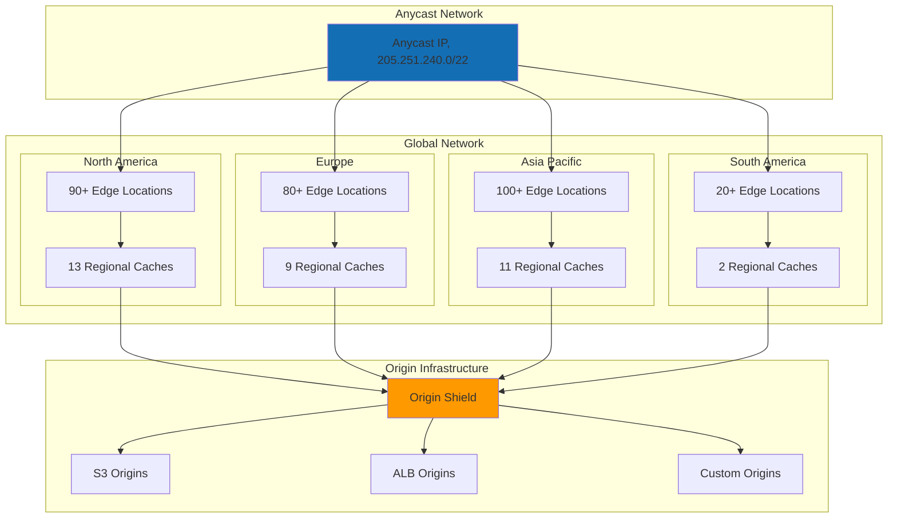
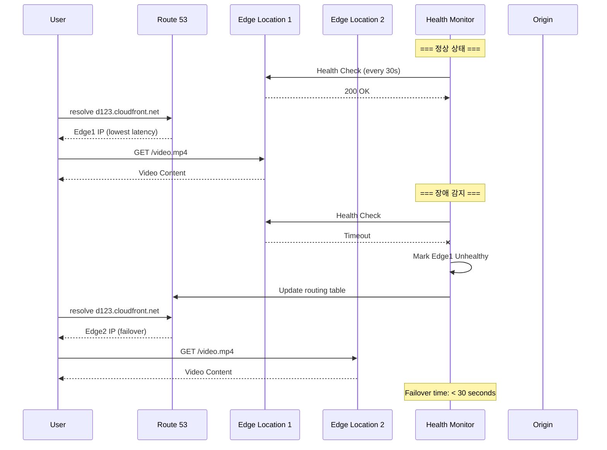
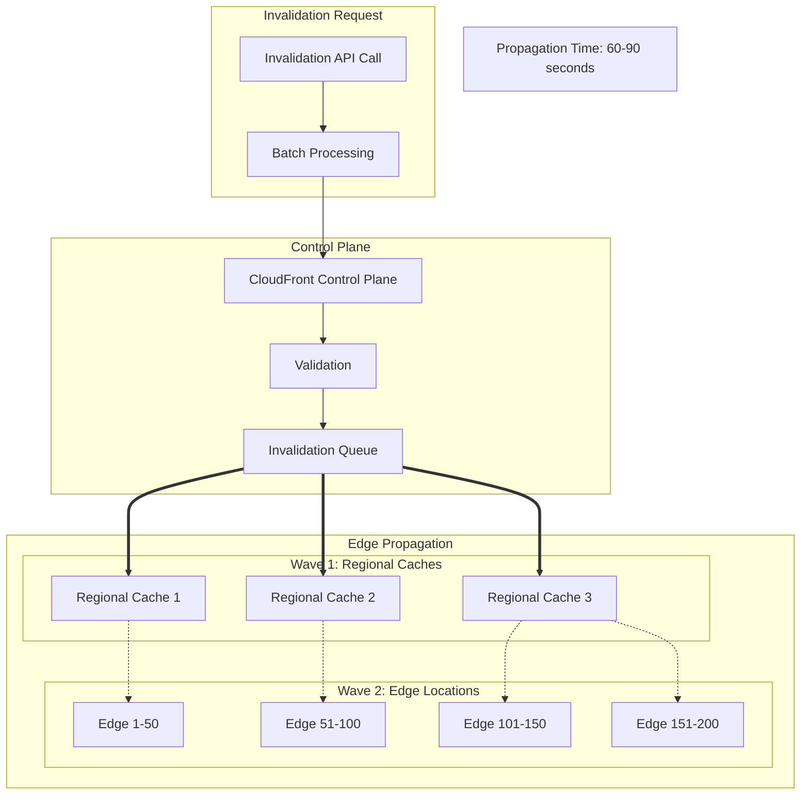

---
tags:
  - AWS
  - CloudFront
  - CDN
  - Architecture
---

# CloudFront 글로벌 아키텍처: 450개 엣지의 마법

## 🎯 Disney+의 글로벌 런칭 D-Day

### 2019년 11월 12일, 스트리밍 전쟁의 시작

```text
📅 2019년 11월 12일, Disney+ 런칭
🌍 5개국 동시 오픈 (미국, 캐나다, 네덜란드...)
👥 첫날 가입자: 1,000만 명
📺 동시 스트림: 수백만
🎬 4K HDR 콘텐츠: 500+ 타이틀
```

Disney의 스트리밍 팀은 Netflix와의 전쟁을 선포했습니다. 하지만 첫날부터 재앙이 시작되었죠:

- **오전 6시**: 서비스 오픈과 동시에 트래픽 폭증
- **오전 7시**: Origin 서버 과부하로 응답 지연
- **오전 8시**: 일부 지역 접속 불가
- **오전 9시**: 긴급 CloudFront 설정 변경

**"450개의 엣지 로케이션이 없었다면, Disney+는 첫날 무너졌을 것이다."**

## 🌍 CloudFront 글로벌 인프라

### 엣지 로케이션의 분산 아키텍처



### 3-Tier 캐싱 계층

```python
class CloudFrontArchitecture:
    def __init__(self):
        self.tiers = {
            "tier_1_edge": {
                "locations": 450,
                "cache_size": "10-50TB per location",
                "purpose": "User proximity caching",
                "ttl": "seconds to days",
                "hit_ratio": "85-95%"
            },
            
            "tier_2_regional": {
                "locations": 35,
                "cache_size": "100-500TB per location",
                "purpose": "Regional aggregation",
                "ttl": "hours to days",
                "hit_ratio": "60-80%"
            },
            
            "tier_3_shield": {
                "locations": 2,  # US-East, EU-West
                "cache_size": "1PB+",
                "purpose": "Origin protection",
                "ttl": "days to weeks",
                "hit_ratio": "99%+"
            }
        }
    
    def request_flow(self, user_location):
        """
        사용자 요청의 여정
        """
        flow = [
            # 1. DNS 해석
            self.anycast_routing(user_location),
            
            # 2. 가장 가까운 엣지로 라우팅
            edge = self.find_nearest_edge(user_location),
            
            # 3. 엣지 캐시 확인
            if self.check_edge_cache(edge):
                return {"source": "Edge Cache", "latency": "< 10ms"}
            
            # 4. Regional Cache 확인
            regional = self.get_regional_cache(edge)
            if self.check_regional_cache(regional):
                return {"source": "Regional Cache", "latency": "< 50ms"}
            
            # 5. Origin Shield 확인
            if self.origin_shield_enabled:
                if self.check_origin_shield():
                    return {"source": "Origin Shield", "latency": "< 100ms"}
            
            # 6. Origin 요청
            return {"source": "Origin", "latency": "100-500ms"}
        ]
```

## 🚀 Anycast 라우팅 메커니즘

### BGP 기반 최적 경로 선택

```python
class AnycastRouting:
    def __init__(self):
        self.anycast_ranges = [
            "205.251.240.0/22",  # Global
            "204.246.164.0/22",  # Global
            "204.246.168.0/22",  # Global
            "204.246.174.0/23",  # Global
        ]
        
    def route_selection(self, user_ip):
        """
        Anycast 라우팅 결정 과정
        """
        # 1. BGP 경로 수집
        bgp_paths = self.collect_bgp_paths(user_ip)
        
        # 2. 최적 경로 선택 기준
        selection_criteria = {
            "as_path_length": 0.3,    # 30% 가중치
            "latency": 0.4,           # 40% 가중치
            "capacity": 0.2,          # 20% 가중치
            "health": 0.1             # 10% 가중치
        }
        
        # 3. 점수 계산
        best_edge = None
        best_score = float('inf')
        
        for edge in self.edge_locations:
            score = self.calculate_score(edge, selection_criteria)
            if score < best_score:
                best_score = score
                best_edge = edge
        
        return {
            "selected_edge": best_edge,
            "expected_latency": f"{best_score}ms",
            "backup_edges": self.get_backup_edges(best_edge)
        }
```

### 실시간 헬스체크와 페일오버



## 🎭 Origin Shield: 궁극의 보호막

### Origin Shield 아키텍처

```python
class OriginShield:
    def __init__(self):
        self.locations = {
            "us-east-1": {
                "region": "N. Virginia",
                "capacity": "1PB+ cache",
                "coverage": ["North America", "South America"]
            },
            "eu-west-1": {
                "region": "Ireland",
                "capacity": "1PB+ cache",
                "coverage": ["Europe", "Middle East", "Africa"]
            }
        }
        
    def request_consolidation(self, requests):
        """
        Origin Shield의 요청 통합
        """
        # 동일한 콘텐츠에 대한 여러 요청을 하나로 통합
        consolidated = {}
        
        for request in requests:
            cache_key = self.generate_cache_key(request)
            
            if cache_key not in consolidated:
                consolidated[cache_key] = {
                    "original_requests": [],
                    "origin_request": None
                }
            
            consolidated[cache_key]["original_requests"].append(request)
        
        # Origin으로는 각 고유 콘텐츠당 1개 요청만
        origin_requests = len(consolidated)
        total_requests = len(requests)
        
        return {
            "total_edge_requests": total_requests,
            "origin_requests": origin_requests,
            "reduction_rate": f"{(1 - origin_requests/total_requests) * 100:.1f}%",
            "origin_protection": "Enabled"
        }
```

### Cache Key 생성 메커니즘

```python
def generate_cache_key(request):
    """
    CloudFront Cache Key 생성 로직
    """
    # 기본 Cache Key 구성요소
    cache_key_components = {
        "required": [
            request.host,
            request.path,
            request.query_string  # 설정된 경우
        ],
        
        "optional": [
            request.headers.get('CloudFront-Viewer-Country'),
            request.headers.get('CloudFront-Is-Mobile-Viewer'),
            request.headers.get('CloudFront-Is-Desktop-Viewer'),
            request.headers.get('Accept-Encoding'),
            request.headers.get('Accept-Language')
        ],
        
        "custom": [
            # Cache Policy에서 정의한 추가 헤더
            request.headers.get('User-Type'),
            request.headers.get('API-Version')
        ]
    }
    
    # Cache Key 생성
    key_parts = []
    
    # 필수 구성요소
    for component in cache_key_components["required"]:
        if component:
            key_parts.append(str(component))
    
    # 선택적 구성요소 (Cache Behavior 설정에 따라)
    if cache_behavior.forward_headers:
        for header in cache_key_components["optional"]:
            if header:
                key_parts.append(str(header))
    
    # 해시 생성
    cache_key = hashlib.md5('|'.join(key_parts).encode()).hexdigest()
    
    return cache_key
```

## 🔄 콘텐츠 무효화 (Invalidation)

### Invalidation 전파 메커니즘



### Invalidation 최적화 전략

```python
class InvalidationOptimization:
    def __init__(self):
        self.strategies = {
            "versioning": self.use_versioning,
            "cache_headers": self.optimize_cache_headers,
            "selective": self.selective_invalidation,
            "batch": self.batch_invalidation
        }
    
    def use_versioning(self):
        """
        파일 버저닝으로 Invalidation 회피
        """
        return {
            "before": "style.css → Invalidate → style.css",
            "after": "style.v1.css → style.v2.css (새 URL)",
            "benefits": [
                "즉시 업데이트",
                "Invalidation 비용 없음",
                "롤백 가능"
            ],
            "implementation": """
                <link rel="stylesheet" href="/assets/style.v${BUILD_HASH}.css">
            """
        }
    
    def selective_invalidation(self, paths):
        """
        선택적 무효화로 비용 절감
        """
        # 와일드카드 사용 최적화
        optimized_paths = []
        
        # 개별 파일 대신 디렉토리 단위
        if len(paths) > 10:
            directories = set()
            for path in paths:
                directory = '/'.join(path.split('/')[:-1])
                directories.add(f"{directory}/*")
            optimized_paths = list(directories)
        else:
            optimized_paths = paths
        
        return {
            "original_count": len(paths),
            "optimized_count": len(optimized_paths),
            "paths": optimized_paths,
            "cost_saving": f"{(1 - len(optimized_paths)/len(paths)) * 100:.0f}%"
        }
```

## 🌐 멀티 오리진 구성

### 오리진 그룹과 페일오버

```python
class OriginConfiguration:
    def __init__(self):
        self.origin_groups = {
            "primary_group": {
                "primary_origin": {
                    "domain": "api.example.com",
                    "protocol": "HTTPS",
                    "port": 443,
                    "path": "/",
                    "headers": {
                        "X-Custom-Header": "primary"
                    }
                },
                "failover_origin": {
                    "domain": "api-backup.example.com",
                    "protocol": "HTTPS",
                    "port": 443,
                    "path": "/",
                    "failover_criteria": [403, 404, 500, 502, 503, 504]
                }
            }
        }
    
    def origin_request_flow(self, request):
        """
        오리진 요청 플로우
        """
        # 1. Primary Origin 시도
        primary_response = self.request_primary_origin(request)
        
        if primary_response.status_code in [200, 201, 204, 206, 301, 302, 304]:
            return primary_response
        
        # 2. Failover 조건 확인
        if primary_response.status_code in self.origin_groups["primary_group"]["failover_origin"]["failover_criteria"]:
            # 3. Failover Origin으로 전환
            failover_response = self.request_failover_origin(request)
            
            # 4. Circuit Breaker 패턴
            self.update_circuit_breaker_state()
            
            return failover_response
        
        return primary_response
```

## 🔒 보안 기능

### Field-Level Encryption

```python
class FieldLevelEncryption:
    def __init__(self):
        self.public_key = """
        -----BEGIN PUBLIC KEY-----
        MIIBIjANBgkqhkiG9w0BAQEFAAOCAQ8AMIIBCgKCAQEA...
        -----END PUBLIC KEY-----
        """
        
    def encrypt_sensitive_fields(self, request_body):
        """
        민감한 필드 암호화
        """
        import json
        from cryptography.hazmat.primitives import serialization
        from cryptography.hazmat.primitives.asymmetric import padding
        
        data = json.loads(request_body)
        
        # 암호화할 필드 정의
        sensitive_fields = ['credit_card', 'ssn', 'password']
        
        for field in sensitive_fields:
            if field in data:
                # RSA 암호화
                encrypted = self.rsa_encrypt(data[field])
                data[field] = base64.b64encode(encrypted).decode()
                
                # 암호화 메타데이터 추가
                data[f"{field}_encrypted"] = {
                    "algorithm": "RSA-OAEP",
                    "key_id": "cloudfront-fle-key-1",
                    "timestamp": time.time()
                }
        
        return json.dumps(data)
```

### Signed URL과 Signed Cookies

```python
def create_signed_url(url, key_pair_id, private_key, expiry_time):
    """
    CloudFront Signed URL 생성
    """
    import rsa
    import base64
    from datetime import datetime, timedelta
    
    # 정책 생성
    policy = {
        "Statement": [{
            "Resource": url,
            "Condition": {
                "DateLessThan": {
                    "AWS:EpochTime": int(expiry_time.timestamp())
                }
            }
        }]
    }
    
    # 정책 문자열 생성
    policy_str = json.dumps(policy, separators=(',', ':'))
    
    # Base64 인코딩
    policy_b64 = base64.b64encode(policy_str.encode()).decode()
    
    # CloudFront용 안전한 Base64 변환
    policy_b64_safe = policy_b64.replace('+', '-').replace('=', '_').replace('/', '~')
    
    # 서명 생성
    signature = rsa.sign(policy_str.encode(), private_key, 'SHA-1')
    signature_b64 = base64.b64encode(signature).decode()
    signature_b64_safe = signature_b64.replace('+', '-').replace('=', '_').replace('/', '~')
    
    # Signed URL 생성
    signed_url = f"{url}?Policy={policy_b64_safe}&Signature={signature_b64_safe}&Key-Pair-Id={key_pair_id}"
    
    return signed_url
```

## 📊 실시간 로그와 모니터링

### Real-Time Logs 구성

```python
class RealTimeLogs:
    def __init__(self):
        self.kinesis_stream = "cloudfront-realtime-logs"
        self.sampling_rate = 1.0  # 100% 샘플링
        
    def log_configuration(self):
        """
        실시간 로그 설정
        """
        return {
            "fields": [
                "timestamp",
                "c-ip",  # Client IP
                "sc-status",  # Response status
                "sc-bytes",  # Response size
                "cs-uri-stem",  # Request path
                "cs-referer",  # Referer
                "cs-user-agent",  # User agent
                "x-edge-location",  # Edge location
                "x-edge-request-id",  # Request ID
                "x-host-header",  # Host header
                "time-taken",  # Response time
                "cs-protocol",  # Protocol
                "cs-bytes",  # Request size
                "x-edge-response-result-type",  # Cache hit/miss
                "x-forwarded-for",  # Original client IP
                "ssl-protocol",  # SSL protocol
                "ssl-cipher",  # SSL cipher
                "x-edge-result-type",  # How request was served
                "fle-status",  # Field-level encryption
                "fle-encrypted-fields"  # Encrypted fields
            ],
            
            "destination": {
                "stream_type": "Kinesis Data Streams",
                "stream_arn": f"arn:aws:kinesis:us-east-1:123456789012:stream/{self.kinesis_stream}"
            }
        }
    
    def process_realtime_logs(self, log_record):
        """
        실시간 로그 처리
        """
        # 캐시 히트율 계산
        if log_record['x-edge-result-type'] in ['Hit', 'RefreshHit']:
            self.metrics['cache_hits'] += 1
        else:
            self.metrics['cache_misses'] += 1
        
        # 에러율 모니터링
        if log_record['sc-status'] >= 400:
            self.metrics['errors'] += 1
            
            # 에러 타입별 분류
            if log_record['sc-status'] >= 500:
                self.alert("5xx Error Spike", log_record)
        
        # 성능 메트릭
        response_time = float(log_record['time-taken'])
        self.metrics['response_times'].append(response_time)
        
        if response_time > 1000:  # 1초 이상
            self.investigate_slow_request(log_record)
```

## 🚨 실전 트러블슈팅

### Case 1: 캐시 히트율 저하

```python
def diagnose_low_cache_hit_rate():
    """
    낮은 캐시 히트율 진단
    """
    issues = {
        "cache_key_variation": {
            "symptom": "동일 콘텐츠가 여러 번 캐싱",
            "cause": "불필요한 쿼리 파라미터",
            "solution": """
                # Cache Policy 수정
                - Query Strings: None 또는 Whitelist
                - Headers: 최소화
                - Cookies: None
            """
        },
        
        "short_ttl": {
            "symptom": "빈번한 Origin 요청",
            "cause": "TTL이 너무 짧음",
            "solution": """
                # Cache-Control 헤더 조정
                Cache-Control: public, max-age=86400  # 1일
                
                # CloudFront 기본 TTL 설정
                Default TTL: 86400
                Maximum TTL: 31536000
            """
        },
        
        "personalized_content": {
            "symptom": "사용자별 다른 응답",
            "cause": "개인화된 콘텐츠",
            "solution": """
                # 정적/동적 콘텐츠 분리
                /static/* → Long TTL
                /api/* → No cache or short TTL
                
                # Lambda@Edge로 동적 처리
                Viewer Request → Personalization
            """
        }
    }
    
    return issues
```

### Case 2: Origin 과부하

```python
class OriginOverloadMitigation:
    def implement_protection(self):
        """
        Origin 보호 전략
        """
        strategies = {
            "1_origin_shield": {
                "enable": True,
                "location": "us-east-1",
                "benefit": "99% Origin 요청 감소"
            },
            
            "2_stale_content": {
                "stale-while-revalidate": 86400,
                "stale-if-error": 604800,
                "benefit": "Origin 장애 시에도 서비스"
            },
            
            "3_request_collapsing": {
                "description": "동시 요청 통합",
                "implementation": "자동 (CloudFront 내장)",
                "benefit": "Thundering Herd 방지"
            },
            
            "4_custom_error_pages": {
                "500": "/errors/500.html",
                "502": "/errors/502.html",
                "503": "/errors/maintenance.html",
                "504": "/errors/timeout.html",
                "error_caching_min_ttl": 60
            }
        }
        
        return strategies
```

### Case 3: 지역별 성능 편차

```python
def optimize_global_performance():
    """
    글로벌 성능 최적화
    """
    optimizations = {
        "geographic_restrictions": {
            "whitelist": ["US", "CA", "GB", "DE", "JP"],
            "blacklist": [],
            "reason": "라이선스 또는 규정"
        },
        
        "price_class": {
            "PriceClass_All": "모든 엣지 사용 (최고 성능)",
            "PriceClass_200": "저렴한 리전 제외",
            "PriceClass_100": "북미/유럽만",
            "recommendation": "타겟 시장에 따라 선택"
        },
        
        "origin_shield_location": {
            "us_users": "us-east-1",
            "eu_users": "eu-west-1",
            "ap_users": "ap-southeast-1"
        },
        
        "tcp_optimizations": {
            "http2": "Enabled",
            "http3": "Enabled (QUIC)",
            "persistent_connections": True,
            "tcp_keepalive": 60
        }
    }
    
    return optimizations
```

## 🎬 마무리: Disney+의 성공 비결

2024년 현재, Disney+는 CloudFront를 통해:

- **글로벌 도달**: 100+ 국가, 1.5억 구독자
- **스트리밍 품질**: 4K HDR 콘텐츠 < 100ms 버퍼링
- **캐시 히트율**: 95%+ (Origin Shield 포함 99%+)
- **비용 절감**: Origin 트래픽 99% 감소
- **가용성**: 99.99% 업타임

**"CloudFront는 단순한 CDN이 아니라, 글로벌 콘텐츠 전송의 신경망이다."**

다음 문서에서는 [CloudFront 최적화 전략](02-optimization.md)을 깊이 있게 다루겠습니다!
