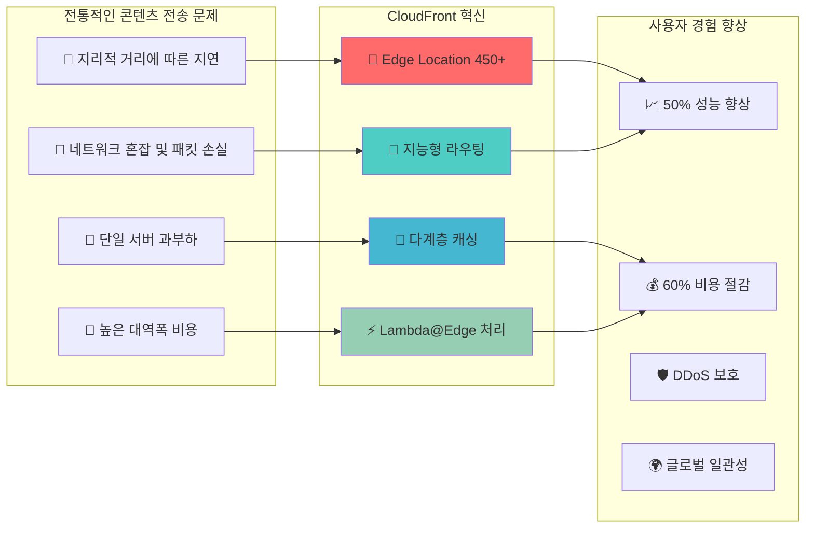

---
tags:
  - AWS
  - CloudFront
  - CDN
  - Performance
  - GlobalInfrastructure
---

# AWS CloudFront - 글로벌 콘텐츠 전송의 완벽한 최적화 🌍

## 이 섹션을 읽으면 답할 수 있는 질문들

- Disney+는 어떻게 전 세계 동시 출시를 성공시켰을까?
- CloudFront Edge Location은 정확히 어디에 있고 어떻게 동작하는가?
- TikTok은 어떻게 바이럴 동영상의 폭발적 트래픽을 처리하는가?
- Lambda@Edge는 어떻게 엣지에서 동적 처리를 가능하게 하는가?
- 전 세계 사용자가 동일한 경험을 받으려면 어떤 최적화가 필요한가?

## 시작하며: 거리의 벽을 허무는 기술

전 세계 어디에서나 빠른 콘텐츠 전송이 왜 중요한지 살펴보겠습니다:



## AWS CloudFront 완벽 마스터 가이드 📚

### [1. CloudFront 아키텍처: 글로벌 인프라의 비밀](01-architecture.md)

**Disney+ 전 세계 동시 출시의 마법**

Disney+가 어떻게 CloudFront를 활용해 전 세계 12개국에서 동시 출시를 성공시켰는지, Edge Location 3단계 캐시 구조부터 Origin Shield까지 CloudFront의 핵심 아키텍처를 완벽 분석합니다.

🏰**핵심 내용**:

- Edge Location 3단계 캐시 메커니즘
- POP (Point of Presence) 전 세계 분포
- Origin Shield와 Request Collapsing
- Disney+ 글로벌 런칭 실전 사례

---

### [2. 성능 최적화: 캐싱 전략과 극한 최적화](02-optimization.md)

**TikTok 바이럴 콘텐츠 폭발적 트래픽 대응**

TikTok이 어떻게 CloudFront 최적화를 통해 바이럴 콘텐츠의 예상치 못한 트래픽 폭증을 안정적으로 처리하는지, Cache Behavior부터 Lambda@Edge까지 성능 최적화의 모든 기법을 탐험합니다.

🎵**핵심 내용**:

- Cache Behavior 최적화 전략
- HTTP/2, HTTP/3 프로토콜 활용
- Lambda@Edge 엣지 컴퓨팅 패턴
- TikTok 바이럴 트래픽 처리 사례

## CloudFront 활용 시나리오 가이드 🎯

### 시나리오 1: 스트리밍 서비스

```python
streaming_optimization = {
    "use_case": "Netflix/Disney+ 스타일 VOD",
    "requirements": {
        "global_latency": "< 100ms",
        "video_quality": "적응형 비트레이트",
        "cdn_hit_ratio": "> 95%"
    },
    "cloudfront_config": {
        "behaviors": [
            {
                "path": "/hls/*",
                "origin": "S3 + MediaConvert",
                "cache_policy": "Optimized for streaming",
                "compress": False
            },
            {
                "path": "/thumbnails/*", 
                "cache_policy": "Long term caching",
                "compress": True
            }
        ],
        "lambda_edge": "ABR manifest 동적 생성"
    }
}
```

### 시나리오 2: API 가속화

```python
api_acceleration = {
    "use_case": "글로벌 모바일 앱 API",
    "requirements": {
        "api_latency": "< 50ms",
        "geographic_routing": "지역별 최적화",
        "security": "DDoS 보호 + WAF"
    },
    "cloudfront_config": {
        "behaviors": [
            {
                "path": "/api/v1/*",
                "origin": "ALB + EC2",
                "cache_policy": "API gateway optimized",
                "origin_request_policy": "CORS headers"
            }
        ],
        "lambda_edge": "JWT 토큰 검증"
    }
}
```

### 시나리오 3: 정적 웹사이트

```python
static_website = {
    "use_case": "React/Vue SPA",
    "requirements": {
        "first_load": "< 2초",
        "subsequent_loads": "< 500ms", 
        "seo_friendly": "Server-side rendering"
    },
    "cloudfront_config": {
        "default_behavior": {
            "origin": "S3 Static Website",
            "cache_policy": "Managed-CachingOptimized",
            "compress": True
        },
        "lambda_edge": "SEO를 위한 pre-rendering"
    }
}
```

## 성능 최적화 체크리스트 ✅

### 캐싱 전략

```python
caching_checklist = [
    "✅ Cache-Control 헤더 적절히 설정",
    "✅ TTL을 콘텐츠 타입별로 세분화", 
    "✅ Query string parameter 캐싱 정책",
    "✅ Vary 헤더 최소화",
    "✅ Cache key 최적화로 hit ratio 향상"
]

# 실제 구현 예시
cache_behaviors = {
    "static_assets": {
        "path_pattern": "/assets/*",
        "ttl": {
            "default": 86400,  # 1일
            "max": 31536000    # 1년  
        },
        "headers": "None",
        "query_strings": False
    },
    "api_responses": {
        "path_pattern": "/api/*",
        "ttl": {
            "default": 0,      # 캐싱 안함
            "max": 300         # 최대 5분
        },
        "headers": ["Authorization", "Accept"],
        "query_strings": True
    }
}
```

### 압축 최적화

```python
compression_strategy = {
    "gzip_types": [
        "text/html",
        "text/css", 
        "text/javascript",
        "application/json",
        "image/svg+xml"
    ],
    "brotli_support": {
        "enabled": True,
        "compression_ratio": "20% better than gzip",
        "browser_support": "90%+"
    },
    "exclude_from_compression": [
        "image/jpeg",
        "image/png", 
        "video/mp4",
        "application/octet-stream"
    ]
}
```

## CloudFront 마스터 로드맵 🗺️

### 기초 (1주)

- [ ] Distribution 생성 및 기본 설정
- [ ] S3 Origin 연결
- [ ] Custom Domain과 SSL 인증서

### 중급 (1개월)

- [ ] Cache Behavior 고급 설정
- [ ] Lambda@Edge 기본 함수
- [ ] CloudWatch 모니터링

### 고급 (3개월)

- [ ] Multi-Origin 복합 구성
- [ ] 실시간 로그 분석
- [ ] 성능 최적화 자동화

### 전문가 (6개월+)

- [ ] 글로벌 트래픽 관리
- [ ] 보안 정책 고도화  
- [ ] 비용 최적화 극대화

## 실전 트러블슈팅 🔧

### 문제 1: 캐시 미스율 높음

```python
cache_miss_debugging = {
    "일반적인_원인": [
        "Vary 헤더 과다 사용",
        "Query string 캐싱 정책 미설정",
        "Cookie forwarding 과다",
        "Cache-Control: no-cache 헤더"
    ],
    
    "해결_방법": [
        "Cache key 최소화",
        "CloudFront 캐시 정책 사용", 
        "Origin에서 적절한 헤더 설정",
        "Real-time logs로 분석"
    ],
    
    "모니터링_메트릭": [
        "CacheHitRate",
        "OriginLatency", 
        "4xxErrorRate",
        "BytesDownloaded"
    ]
}
```

### 문제 2: Lambda@Edge 타임아웃

```python
lambda_edge_optimization = {
    "제한사항": {
        "viewer_request": "5초",
        "origin_request": "30초",
        "memory": "128MB ~ 3008MB",
        "package_size": "50MB"
    },
    
    "최적화_방법": {
        "코드_최적화": "불필요한 의존성 제거",
        "메모리_튜닝": "적절한 메모리 할당", 
        "연결_풀링": "HTTP 연결 재사용",
        "비동기_처리": "Promise 활용"
    }
}
```

## 비용 최적화 전략 💰

### Price Class 전략

```python
price_class_optimization = {
    "PriceClass_All": {
        "coverage": "전 세계 모든 Edge Location",
        "cost": "최고",
        "performance": "최적"
    },
    "PriceClass_200": {
        "coverage": "남미, 호주 제외",
        "cost": "15% 절감",
        "performance": "대부분 지역 최적"
    },
    "PriceClass_100": {
        "coverage": "미국, 캐나다, 유럽만",
        "cost": "30% 절감", 
        "performance": "해당 지역 최적"
    }
}

def recommend_price_class(user_distribution):
    """사용자 분포에 따른 Price Class 추천"""
    if user_distribution["us_eu_percentage"] > 85:
        return "PriceClass_100"
    elif user_distribution["global_spread"] < 20:
        return "PriceClass_200" 
    else:
        return "PriceClass_All"
```

## 보안 고려사항 🛡️

### 보안 강화 체크리스트

```python
security_checklist = [
    "✅ Origin Access Identity (OAI) 설정",
    "✅ Signed URLs/Cookies로 콘텐츠 보호",
    "✅ AWS WAF 통합으로 DDoS 방어",
    "✅ Field-level encryption 민감 데이터 보호",
    "✅ Real-time logs로 이상 트래픽 감지",
    "✅ HTTPS only 강제, HSTS 헤더 설정"
]

# Signed URL 생성 예시
import boto3
from datetime import datetime, timedelta

def generate_signed_url(key, expiry_hours=24):
    """프리미엄 콘텐츠용 signed URL 생성"""
    cloudfront_client = boto3.client('cloudfront')
    
    expiry_time = datetime.utcnow() + timedelta(hours=expiry_hours)
    
    signed_url = cloudfront_client.generate_presigned_url(
        'get_object',
        Params={
            'Bucket': 'premium-content-bucket',
            'Key': key
        },
        ExpiresIn=expiry_hours * 3600
    )
    
    return signed_url
```

## 마치며: 글로벌 사용자 경험의 완성

CloudFront는 단순한 CDN이 아닙니다.**전 세계 어디서나 동일한 사용자 경험을 보장하는 글로벌 플랫폼**입니다.

> *"사용자는 콘텐츠가 어디에서 오는지 신경 쓰지 않는다. 단지 빠르고 안정적이기를 원할 뿐이다. CloudFront는 이를 투명하게 해결한다."*
> — AWS CloudFront Team

글로벌 콘텐츠 전송의 완벽한 최적화 여정을 시작해보겠습니다! 🌍

---

**다음 읽기**: [CloudFront 아키텍처: 글로벌 인프라의 비밀](01-architecture.md)
