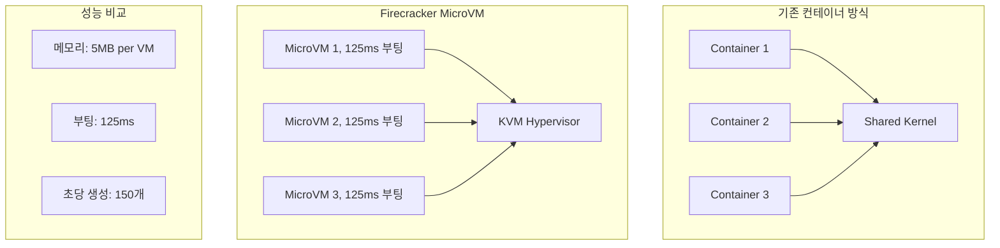
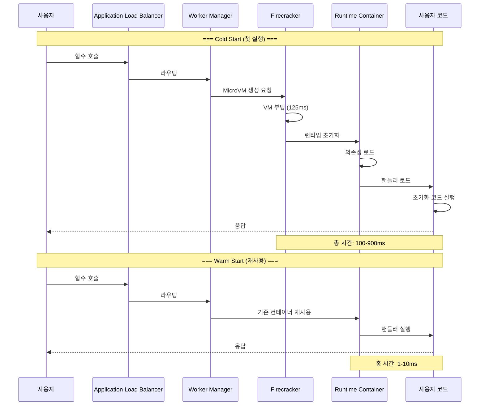
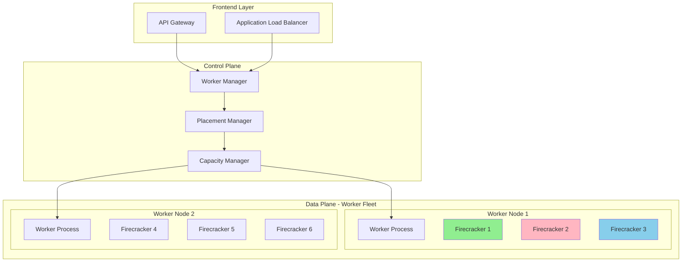
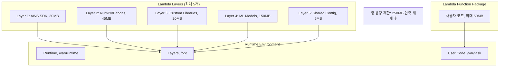

---
tags:
  - AWS
  - Lambda
  - Serverless
  - Compute
---

# Lambda의 서버리스 마법: Firecracker가 만든 0ms 세상

## 🎯 Duolingo의 1억 사용자 비밀: 0ms Cold Start

### 2023년 언어학습 앱의 도전

```text
📅 2023년 3월, Duolingo 본사
👥 일일 활성 사용자: 1억 명
🎯 과제: 사용자별 맞춤 AI 튜터 제공
💰 문제: 서버 비용 연간 $50M
⚡ 요구사항: 100ms 이내 응답
```

Duolingo의 CTO는 고민에 빠졌습니다. 1억 명의 사용자에게 개인화된 AI 언어 튜터를 제공하려면 막대한 서버가 필요했죠. 그런데 사용 패턴을 분석해보니 흥미로운 발견이 있었습니다:

- 평균 학습 시간: 하루 5분
- 피크 시간: 오전 7-9시, 오후 8-10시
- 나머지 시간: 90% 이상 유휴 상태

**"서버의 90%가 놀고 있는데 비용은 100% 지불한다고?"**

## 🚀 Firecracker: 5ms의 마법

### MicroVM의 탄생 스토리



AWS Lambda의 핵심 기술인 Firecracker는 어떻게 탄생했을까요?

```rust
// Firecracker의 핵심: Rust로 작성된 VMM
pub struct Firecracker {
    // 최소한의 디바이스 에뮬레이션
    devices: Vec<VirtioDevice>,

    // KVM 기반 가상화
    vm: KvmVm,

    // 메모리 풋프린트: 5MB
    memory_size_mb: usize,
}

impl Firecracker {
    pub fn boot_microvm(&mut self) -> Result<(), Error> {
        // 1. 메모리 할당 (Copy-on-Write)
        self.setup_memory()?;

        // 2. vCPU 초기화 (1개만)
        self.setup_vcpu()?;

        // 3. 최소 디바이스만 로드
        // - virtio-net (네트워크)
        // - virtio-block (스토리지)
        // - serial console
        self.load_minimal_devices()?;

        // 4. 커널 부팅 (압축된 커널)
        self.boot_kernel()?;

        // 총 소요시간: 125ms
        Ok(())
    }
}
```

### Firecracker vs Docker vs VM 비교

| 구분 | 전통 VM | Docker | Firecracker |
|------|---------|--------|-------------|
| 부팅 시간 | 30-60초 | 1-3초 | 125ms |
| 메모리 오버헤드 | 200-500MB | 10-50MB | 5MB |
| 보안 격리 | 하드웨어 수준 | 커널 공유 | 하드웨어 수준 |
| 밀도 (per host) | 10-50개 | 100-1000개 | 8000개 |

## 🎭 Lambda의 실행 라이프사이클

### Cold Start부터 Warm Start까지



### Cold Start 최적화 기법

```python
# ❌ 나쁜 예: Cold Start 시마다 실행
def lambda_handler(event, context):
    import boto3
    import pandas as pd
    import numpy as np

    # 매번 초기화 (300ms 추가)
    s3 = boto3.client('s3')
    dynamodb = boto3.resource('dynamodb')

    # 무거운 작업
    df = pd.DataFrame(...)
    return process_data(df)

# ✅ 좋은 예: 전역 스코프 활용
import boto3
import pandas as pd
import numpy as np

# 컨테이너 재사용 시 유지됨
s3 = boto3.client('s3')
dynamodb = boto3.resource('dynamodb')

# 미리 컴파일된 정규식
PATTERN = re.compile(r'...')

def lambda_handler(event, context):
    # 핵심 로직만 실행
    return process_data(event)
```

## 🏗️ Lambda의 내부 아키텍처

### Worker Fleet 관리



### Provisioned Concurrency 동작 원리

```python
# Lambda의 내부 동작 의사코드
class LambdaWorker:
    def __init__(self):
        self.warm_pool = []  # Warm 컨테이너 풀
        self.active = {}      # 실행 중인 컨테이너

    def handle_invocation(self, event):
        # 1. Warm 컨테이너 확인
        if self.warm_pool:
            container = self.warm_pool.pop()
            return self.execute_warm(container, event)

        # 2. Cold Start 필요
        container = self.create_new_container()
        return self.execute_cold(container, event)

    def create_new_container(self):
        # Firecracker MicroVM 생성
        vm = Firecracker.create_microvm(
            memory_mb=128,
            vcpus=1,
            kernel="vmlinux-lambda"
        )

        # 런타임 레이어 마운트
        vm.mount_layer("/opt/runtime/python3.9")

        # 사용자 코드 마운트
        vm.mount_layer("/var/task/user-code")

        # 125ms 만에 부팅 완료
        vm.boot()

        return vm
```

## 🎨 Lambda Layers와 Extensions

### Layer 시스템의 비밀



### Extension 실행 모델

```python
# Lambda Extension 예제: 커스텀 모니터링
class MonitoringExtension:
    def __init__(self):
        self.metrics = []

    async def start(self):
        # Extension 등록
        await self.register_extension()

        # 이벤트 루프 시작
        while True:
            event = await self.next_event()

            if event.type == "INVOKE":
                # 함수 실행 전
                start_time = time.time()

            elif event.type == "SHUTDOWN":
                # 함수 종료 시
                self.flush_metrics()
                break

    def collect_metrics(self):
        return {
            "memory_used": get_memory_usage(),
            "cpu_time": get_cpu_time(),
            "network_io": get_network_stats(),
            "custom_metrics": self.metrics
        }
```

## 🔐 Lambda의 보안 모델

### Execution Role과 Resource Policy

```yaml
# Lambda 실행 역할 (Execution Role)
LambdaExecutionRole:
  Type: AWS::IAM::Role
  Properties:
    AssumeRolePolicyDocument:
      Statement:
        - Effect: Allow
          Principal:
            Service: lambda.amazonaws.com
          Action: sts:AssumeRole
    Policies:
      - PolicyName: LambdaBasicExecution
        PolicyDocument:
          Statement:
            # CloudWatch Logs 권한
            - Effect: Allow
              Action:
                - logs:CreateLogGroup
                - logs:CreateLogStream
                - logs:PutLogEvents
              Resource: !Sub 'arn:aws:logs:${AWS::Region}:*'

            # VPC 접근 권한 (선택적)
            - Effect: Allow
              Action:
                - ec2:CreateNetworkInterface
                - ec2:DescribeNetworkInterfaces
                - ec2:DeleteNetworkInterface
              Resource: '*'
```

### 런타임 격리 메커니즘

```rust
// Firecracker의 보안 격리
impl SecurityIsolation {
    fn setup_sandbox(&self) -> Result<()> {
        // 1. Seccomp 필터 (시스템 콜 제한)
        self.apply_seccomp_filter()?;

        // 2. cgroups (리소스 제한)
        self.setup_cgroups(CgroupConfig {
            memory_limit_mb: 3008,  // Lambda 최대 메모리
            cpu_shares: 1024,
            pids_limit: 1024,
        })?;

        // 3. 네임스페이스 격리
        self.create_namespaces(&[
            Namespace::Mount,
            Namespace::Network,
            Namespace::PID,
            Namespace::IPC,
        ])?;

        // 4. 읽기 전용 루트 파일시스템
        self.mount_readonly_rootfs()?;

        Ok(())
    }
}
```

## 💰 비용 최적화 전략

### Duolingo의 최적화 여정

```python
# Before: EC2 기반 아키텍처
class TraditionalArchitecture:
    def __init__(self):
        # 24/7 실행되는 EC2 인스턴스
        self.ec2_instances = 100  # m5.xlarge
        self.monthly_cost = 100 * 140  # $14,000/월

    def handle_request(self, user_id):
        # 평균 CPU 사용률: 10%
        # 90%는 유휴 상태
        return process_user(user_id)

# After: Lambda 기반 아키텍처
class ServerlessArchitecture:
    def __init__(self):
        # 사용한 만큼만 과금
        self.price_per_gb_second = 0.0000166667
        self.price_per_request = 0.0000002

    def calculate_cost(self):
        daily_requests = 100_000_000  # 1억 요청
        avg_duration_ms = 50
        memory_mb = 256

        # GB-seconds = (메모리 / 1024) * (시간 / 1000) * 요청수
        gb_seconds = (256/1024) * (50/1000) * daily_requests

        # 월 비용 계산
        compute_cost = gb_seconds * 30 * self.price_per_gb_second
        request_cost = daily_requests * 30 * self.price_per_request

        total_monthly = compute_cost + request_cost  # $3,750/월

        # 73% 비용 절감!
        return total_monthly
```

### 비용 최적화 Best Practices

```python
# 1. 메모리 크기 최적화
def optimize_memory():
    """
    메모리를 늘리면 CPU도 비례해서 증가
    때로는 메모리를 늘려서 실행 시간을 줄이는 것이 더 저렴
    """
    configurations = [
        {"memory": 128, "duration": 3000, "cost": 0.000625},
        {"memory": 256, "duration": 1500, "cost": 0.000625},
        {"memory": 512, "duration": 750, "cost": 0.000625},
        {"memory": 1024, "duration": 400, "cost": 0.000667},  # 살짝 비쌈
        {"memory": 2048, "duration": 200, "cost": 0.000667},
    ]

    # 512MB가 최적점 (비용 동일, 속도 2배)
    return 512

# 2. Provisioned Concurrency vs On-Demand
def calculate_provisioned_cost(concurrent_executions):
    """
    Provisioned Concurrency는 언제 유리한가?
    """
    # On-Demand 비용
    on_demand_cold_starts = concurrent_executions * 0.3  # 30% cold start
    on_demand_latency_cost = on_demand_cold_starts * 500  # 500ms 추가

    # Provisioned 비용
    provisioned_cost_per_hour = concurrent_executions * 0.000004167
    provisioned_monthly = provisioned_cost_per_hour * 24 * 30

    # 손익분기점: 시간당 100회 이상 실행 시 Provisioned가 유리
    return provisioned_monthly
```

## 🚨 실전 트러블슈팅

### Case 1: Cold Start 지옥

```python
# 문제: 이미지 처리 Lambda가 5초나 걸림
def diagnose_cold_start():
    """
    Cold Start 분석 도구
    """
    import time

    timings = {
        "init_start": time.time(),
    }

    # 1. Import 시간 측정
    import_start = time.time()
    import tensorflow as tf  # 2.5초
    import cv2              # 0.8초
    import numpy as np      # 0.3초
    timings["import_time"] = time.time() - import_start

    # 2. 모델 로딩 시간
    model_start = time.time()
    model = tf.keras.models.load_model('/tmp/model.h5')  # 1.2초
    timings["model_load"] = time.time() - model_start

    # 해결책: Lambda Layer + EFS
    # - TensorFlow를 Layer로 분리
    # - 모델을 EFS에 저장하여 여러 Lambda가 공유
    # - Provisioned Concurrency 활용

    return timings
```

### Case 2: 동시성 제한 (Throttling)

```python
# Lambda 동시성 관리
class ConcurrencyManager:
    def __init__(self):
        self.account_limit = 1000  # 계정 전체 동시성
        self.reserved = {}          # 함수별 예약 동시성

    def handle_throttling(self, function_name):
        """
        429 TooManyRequestsException 처리
        """
        strategies = {
            "1_exponential_backoff": self.exponential_retry,
            "2_reserved_concurrency": self.set_reserved_concurrency,
            "3_sqs_buffering": self.setup_sqs_buffer,
            "4_step_functions": self.use_step_functions,
        }

        return strategies

    def exponential_retry(self, attempt):
        # 지수 백오프 with jitter
        import random
        base_delay = 100  # ms
        max_delay = 20000  # 20초

        delay = min(base_delay * (2 ** attempt), max_delay)
        jitter = random.uniform(0, delay * 0.1)

        time.sleep((delay + jitter) / 1000)
```

### Case 3: 메모리 부족

```python
# Lambda 메모리 최적화
def optimize_large_file_processing():
    """
    3GB 제한 내에서 대용량 파일 처리
    """
    # ❌ 나쁜 예: 전체 파일을 메모리에 로드
    def bad_approach(s3_key):
        s3 = boto3.client('s3')
        response = s3.get_object(Bucket='bucket', Key=s3_key)
        content = response['Body'].read()  # 전체 로드
        return process(content)

    # ✅ 좋은 예: 스트리밍 처리
    def good_approach(s3_key):
        s3 = boto3.client('s3')
        response = s3.get_object(Bucket='bucket', Key=s3_key)

        # 청크 단위로 처리
        chunk_size = 64 * 1024 * 1024  # 64MB chunks
        for chunk in iter(lambda: response['Body'].read(chunk_size), b''):
            process_chunk(chunk)

        return "Processed"
```

## 🎯 Lambda 선택 가이드

### Lambda가 적합한 경우

```python
perfect_use_cases = {
    "이벤트_처리": {
        "예": "S3 업로드 → 썸네일 생성",
        "특징": "간헐적, 이벤트 기반",
        "비용_절감": "95%"
    },

    "API_백엔드": {
        "예": "REST API, GraphQL",
        "특징": "가변적 트래픽",
        "비용_절감": "70%"
    },

    "데이터_처리": {
        "예": "로그 분석, ETL",
        "특징": "배치 처리",
        "비용_절감": "80%"
    },

    "실시간_파일_처리": {
        "예": "이미지 리사이징",
        "특징": "CPU 집약적, 단기 실행",
        "비용_절감": "85%"
    }
}
```

### Lambda가 부적합한 경우

```python
avoid_lambda_when = {
    "장시간_실행": {
        "제한": "15분 최대 실행 시간",
        "대안": "ECS Fargate, Batch"
    },

    "웹소켓_서버": {
        "제한": "상태 유지 불가",
        "대안": "API Gateway WebSocket + DynamoDB"
    },

    "대용량_메모리": {
        "제한": "10GB 메모리 한계",
        "대안": "ECS, EC2"
    },

    "지속적_고부하": {
        "제한": "24/7 실행 시 비용 증가",
        "대안": "ECS, EKS"
    }
}
```

## 🎬 마무리: Duolingo의 성공

2024년 현재, Duolingo는 Lambda를 통해:

- **비용**: 73% 절감 ($50M → $13.5M/년)
- **성능**: 평균 응답 시간 50ms
- **확장성**: 피크 시간 자동 스케일링
- **개발 속도**: 배포 시간 30분 → 30초

**"서버리스는 단순히 서버가 없는 것이 아니라, 서버를 생각하지 않아도 되는 자유다."**

다음 문서에서는 [ECS의 컨테이너 오케스트레이션](03-ecs.md)을 살펴보겠습니다!
