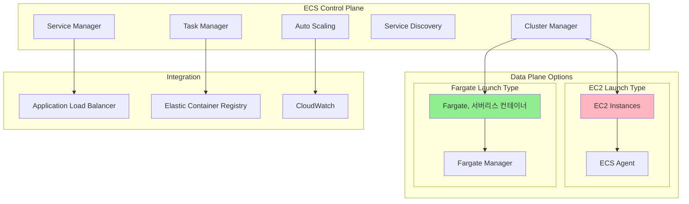
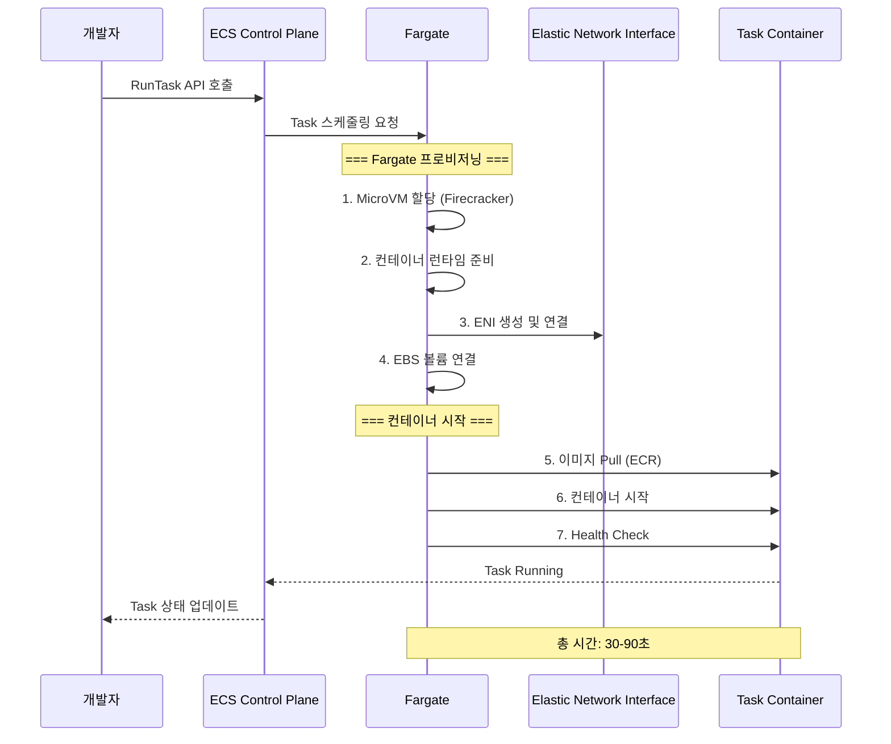
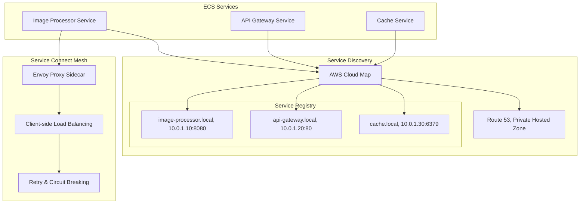

---
tags:
  - AWS
  - ECS
  - Container
  - Orchestration
---

# ECS의 컨테이너 오케스트레이션: Fargate가 바꾼 세상

## 🎯 Pinterest의 10억 이미지 서빙 도전

### 2019년 컨테이너 대전환

```text
📅 2019년 6월, Pinterest 엔지니어링 팀
📌 일일 활성 핀: 10억 개
🖼️ 이미지 처리 요청: 초당 100만 건
🚢 컨테이너 수: 50,000개
💸 EC2 관리 비용: 연간 $20M
```

Pinterest의 인프라 팀은 큰 결정을 앞두고 있었습니다. 수만 개의 컨테이너를 EC2에서 직접 관리하는 것은 악몽이었죠:

- EC2 인스턴스 패치: 매월 2,000시간
- 클러스터 용량 계획: 30% 과다 프로비저닝
- 호스트 장애 대응: 주당 평균 50건

**"우리가 EC2 관리자인가, 아니면 개발자인가?"**

## 🚀 ECS 아키텍처: 단순함의 미학

### Control Plane 구조



### Task Definition: 컨테이너의 청사진

```json
{
  "family": "pinterest-image-processor",
  "networkMode": "awsvpc",
  "requiresCompatibilities": ["FARGATE"],
  "cpu": "2048",
  "memory": "4096",

  "containerDefinitions": [
    {
      "name": "image-processor",
      "image": "pinterest/processor:v2.0",
      "cpu": 1024,
      "memory": 2048,

      "portMappings": [
        {
          "containerPort": 8080,
          "protocol": "tcp"
        }
      ],

      "environment": [
        {
          "name": "REDIS_ENDPOINT",
          "value": "cache.pinterest.internal"
        }
      ],

      "healthCheck": {
        "command": ["CMD-SHELL", "curl -f http://localhost:8080/health"],
        "interval": 30,
        "timeout": 5,
        "retries": 3,
        "startPeriod": 60
      },

      "logConfiguration": {
        "logDriver": "awslogs",
        "options": {
          "awslogs-group": "/ecs/pinterest",
          "awslogs-region": "us-west-2",
          "awslogs-stream-prefix": "processor"
        }
      }
    },

    {
      "name": "sidecar-cache",
      "image": "redis:6-alpine",
      "cpu": 512,
      "memory": 1024,
      "essential": false
    }
  ]
}
```

## 🎭 Fargate: 서버리스 컨테이너의 마법

### Fargate vs EC2 Launch Type

```python
# EC2 Launch Type의 복잡성
class EC2LaunchType:
    def __init__(self):
        self.responsibilities = {
            "인스턴스_관리": [
                "EC2 프로비저닝",
                "AMI 업데이트",
                "패치 관리",
                "SSH 키 관리"
            ],
            "클러스터_관리": [
                "용량 계획",
                "오토스케일링 그룹",
                "스팟 인스턴스 관리",
                "예약 인스턴스 구매"
            ],
            "ECS_에이전트": [
                "에이전트 업데이트",
                "도커 데몬 관리",
                "로그 드라이버 설정"
            ]
        }

    def calculate_overhead(self):
        # 관리 오버헤드: 주당 40시간
        return 40

# Fargate Launch Type의 단순함
class FargatelaunchType:
    def __init__(self):
        self.responsibilities = {
            "개발자_책임": [
                "Task Definition 작성",
                "컨테이너 이미지 빌드",
                "서비스 설정"
            ],
            "AWS_책임": [
                "서버 관리",
                "패치",
                "스케일링",
                "가용성"
            ]
        }

    def calculate_overhead(self):
        # 관리 오버헤드: 주당 2시간
        return 2
```

### Fargate의 내부 동작



## 🏗️ Service와 Auto Scaling

### Service의 지능형 관리

```python
class ECSService:
    def __init__(self, name, task_definition):
        self.name = name
        self.task_definition = task_definition
        self.desired_count = 10
        self.deployment_config = {
            "maximum_percent": 200,      # 최대 200% (20개 태스크)
            "minimum_healthy_percent": 100  # 최소 100% (10개 유지)
        }

    def rolling_update(self, new_task_definition):
        """
        무중단 배포 프로세스
        """
        stages = []

        # 1단계: 새 태스크 시작 (최대 200%까지)
        for i in range(self.desired_count):
            stages.append({
                "action": "START_NEW",
                "new_tasks": i + 1,
                "old_tasks": self.desired_count,
                "total": self.desired_count + i + 1
            })

            # 헬스체크 통과 대기
            self.wait_for_healthy(new_task_definition)

            # 구 태스크 종료
            stages.append({
                "action": "STOP_OLD",
                "new_tasks": i + 1,
                "old_tasks": self.desired_count - i - 1,
                "total": self.desired_count
            })

        return stages
```

### Auto Scaling 전략

```yaml
# Target Tracking Scaling Policy
CPUUtilizationScalingPolicy:
  Type: AWS::ApplicationAutoScaling::ScalingPolicy
  Properties:
    PolicyType: TargetTrackingScaling
    TargetTrackingScalingPolicyConfiguration:
      TargetValue: 70.0
      PredefinedMetricSpecification:
        PredefinedMetricType: ECSServiceAverageCPUUtilization
      ScaleInCooldown: 300
      ScaleOutCooldown: 60

# Step Scaling Policy (더 세밀한 제어)
RequestCountScalingPolicy:
  Type: AWS::ApplicationAutoScaling::ScalingPolicy
  Properties:
    PolicyType: StepScaling
    StepScalingPolicyConfiguration:
      AdjustmentType: PercentChangeInCapacity
      Cooldown: 60
      StepAdjustments:
        - MetricIntervalLowerBound: 0
          MetricIntervalUpperBound: 100
          ScalingAdjustment: 10
        - MetricIntervalLowerBound: 100
          MetricIntervalUpperBound: 200
          ScalingAdjustment: 30
        - MetricIntervalLowerBound: 200
          ScalingAdjustment: 50
```

## 🔌 Service Discovery와 Service Connect

### Cloud Map 통합



### Service Connect 구현

```python
# Service Connect를 통한 서비스 간 통신
class ServiceConnect:
    def __init__(self):
        self.envoy_config = {
            "listeners": [{
                "name": "outbound",
                "address": "127.0.0.1:15001",
                "filter_chains": [{
                    "filters": [{
                        "name": "http_connection_manager",
                        "typed_config": {
                            "route_config": {
                                "virtual_hosts": [{
                                    "name": "backend",
                                    "domains": ["api-service"],
                                    "routes": [{
                                        "match": {"prefix": "/"},
                                        "route": {
                                            "cluster": "api-service",
                                            "retry_policy": {
                                                "retry_on": "5xx",
                                                "num_retries": 3,
                                                "per_try_timeout": "10s"
                                            }
                                        }
                                    }]
                                }]
                            }
                        }
                    }]
                }]
            }],

            "clusters": [{
                "name": "api-service",
                "type": "EDS",  # Endpoint Discovery Service
                "eds_cluster_config": {
                    "eds_config": {
                        "resource_api_version": "V3",
                        "api_config_source": {
                            "api_type": "GRPC",
                            "transport_api_version": "V3"
                        }
                    }
                },
                "circuit_breakers": {
                    "thresholds": [{
                        "max_connections": 1024,
                        "max_pending_requests": 1024,
                        "max_requests": 1024,
                        "max_retries": 3
                    }]
                }
            }]
        }
```

## 🎨 ECS Anywhere: 하이브리드 클라우드

### 온프레미스 통합

```python
# ECS Anywhere 에이전트 설정
class ECSAnywhereAgent:
    def __init__(self):
        self.registration_command = """
        # 온프레미스 서버 등록
        curl --proto "https" -o "/tmp/ecs-anywhere-install.sh" \
            "https://amazon-ecs-agent.s3.amazonaws.com/ecs-anywhere-install-latest.sh"

        sudo bash /tmp/ecs-anywhere-install.sh \
            --region us-west-2 \
            --cluster hybrid-cluster \
            --activation-id $ACTIVATION_ID \
            --activation-code $ACTIVATION_CODE
        """

    def configure_external_instance(self):
        return {
            "requirements": {
                "OS": ["Amazon Linux 2", "Ubuntu 20.04", "RHEL 8"],
                "CPU": "x86_64 or ARM64",
                "Memory": "512MB minimum",
                "Network": "Outbound HTTPS to AWS"
            },

            "components": {
                "ECS_Agent": "Task 관리",
                "SSM_Agent": "시스템 관리",
                "Docker": "컨테이너 런타임"
            },

            "use_cases": [
                "규정 준수 (데이터 레지던시)",
                "레거시 시스템 통합",
                "엣지 컴퓨팅",
                "하이브리드 배포"
            ]
        }
```

## 💰 비용 최적화 전략

### Pinterest의 최적화 결과

```python
class CostOptimization:
    def __init__(self):
        self.before_ecs = {
            "infrastructure": "Self-managed Kubernetes on EC2",
            "instances": 2000,  # m5.xlarge
            "utilization": 0.35,  # 35% CPU 사용률
            "monthly_cost": 280000  # $280K
        }

        self.after_fargate = {
            "infrastructure": "ECS Fargate",
            "tasks": 50000,
            "utilization": 0.95,  # 95% 효율
            "monthly_cost": 140000  # $140K
        }

    def calculate_savings(self):
        # Fargate Spot 활용
        spot_savings = {
            "regular_fargate": 140000,
            "fargate_spot": 98000,  # 30% 추가 절감
            "interruption_rate": 0.05  # 5% 중단율
        }

        # Compute Savings Plans
        savings_plans = {
            "on_demand": 140000,
            "1_year_plan": 112000,  # 20% 할인
            "3_year_plan": 84000    # 40% 할인
        }

        return {
            "total_savings": "70% 비용 절감",
            "management_hours": "95% 감소",
            "deployment_time": "85% 단축"
        }
```

### Fargate Spot 전략

```yaml
# Fargate Spot 설정
ServiceWithSpot:
  Type: AWS::ECS::Service
  Properties:
    CapacityProviderStrategy:
      - Base: 2
        Weight: 1
        CapacityProvider: FARGATE
      - Base: 0
        Weight: 4
        CapacityProvider: FARGATE_SPOT

    # Spot 중단 처리
    PlacementStrategies:
      - Type: spread
        Field: attribute:ecs.availability-zone

    # 중단 내성 설정
    DeploymentConfiguration:
      MaximumPercent: 200
      MinimumHealthyPercent: 100
      DeploymentCircuitBreaker:
        Enable: true
        Rollback: true
```

## 🚨 실전 트러블슈팅

### Case 1: Task 시작 실패

```python
def diagnose_task_failure():
    """
    Task가 시작하지 않을 때 진단
    """
    common_issues = {
        "RESOURCE_NOT_AVAILABLE": {
            "원인": "CPU/메모리 부족",
            "해결": "Task Definition 리소스 요구사항 조정",
            "예시": "memory: 4096 → 2048"
        },

        "IMAGE_PULL_ERROR": {
            "원인": "ECR 권한 또는 이미지 없음",
            "해결": "IAM 역할 및 ECR 리포지토리 확인",
            "명령": "aws ecr get-login-password | docker login"
        },

        "PORT_ALREADY_IN_USE": {
            "원인": "호스트 포트 충돌",
            "해결": "동적 포트 매핑 사용",
            "설정": "hostPort: 0  # 동적 할당"
        },

        "SECRETS_MANAGER_ERROR": {
            "원인": "Secrets Manager 접근 실패",
            "해결": "Task Execution Role에 권한 추가",
            "정책": "secretsmanager:GetSecretValue"
        }
    }

    return common_issues
```

### Case 2: 서비스 업데이트 막힘

```python
class ServiceUpdateTroubleshooting:
    def diagnose_stuck_deployment(self, service_name):
        """
        배포가 진행되지 않을 때
        """
        # 1. 이벤트 확인
        events = self.get_service_events(service_name)

        # 2. 일반적인 원인
        if "unable to place task" in events:
            return {
                "issue": "리소스 부족",
                "solution": [
                    "클러스터 용량 확인",
                    "Task Definition 리소스 줄이기",
                    "다른 AZ로 분산"
                ]
            }

        elif "health check failed" in events:
            return {
                "issue": "헬스체크 실패",
                "solution": [
                    "헬스체크 경로 확인",
                    "startPeriod 늘리기",
                    "컨테이너 로그 확인"
                ]
            }

        elif "cannot pull container image" in events:
            return {
                "issue": "이미지 Pull 실패",
                "solution": [
                    "ECR 권한 확인",
                    "이미지 태그 존재 확인",
                    "VPC 엔드포인트 설정"
                ]
            }
```

### Case 3: 네트워크 연결 문제

```python
# awsvpc 네트워크 모드 트러블슈팅
def troubleshoot_network():
    """
    Task 간 통신 문제 해결
    """
    checklist = {
        "1_security_groups": {
            "확인": "인바운드/아웃바운드 규칙",
            "명령": "aws ec2 describe-security-groups",
            "팁": "같은 SG 내 통신 허용"
        },

        "2_subnet_configuration": {
            "확인": "프라이빗/퍼블릭 서브넷",
            "요구사항": {
                "퍼블릭": "IGW 라우팅",
                "프라이빗": "NAT Gateway 필요"
            }
        },

        "3_service_discovery": {
            "확인": "Cloud Map 네임스페이스",
            "테스트": "nslookup service.local",
            "디버깅": "dig @10.0.0.2 service.local"
        },

        "4_eni_limits": {
            "확인": "ENI 한계 도달",
            "계산": "Tasks per instance = ENIs * IPs per ENI",
            "해결": "인스턴스 타입 변경"
        }
    }

    return checklist
```

## 🎯 ECS vs EKS 선택 가이드

```python
def choose_orchestrator():
    """
    언제 ECS를 선택해야 하나?
    """
    ecs_advantages = {
        "단순성": {
            "학습곡선": "1주일",
            "관리포인트": "Task Definition만",
            "통합": "AWS 네이티브"
        },

        "비용": {
            "컨트롤플레인": "무료",
            "Fargate": "완전 서버리스",
            "운영인력": "최소화"
        },

        "적합한_경우": [
            "AWS 올인 전략",
            "빠른 프로토타이핑",
            "소규모 팀",
            "단순한 워크로드"
        ]
    }

    eks_advantages = {
        "유연성": {
            "이식성": "멀티클라우드",
            "생태계": "쿠버네티스 도구",
            "커스터마이징": "완전 제어"
        },

        "기능": {
            "고급기능": "StatefulSet, DaemonSet",
            "오퍼레이터": "커스텀 리소스",
            "정책": "NetworkPolicy, PodSecurityPolicy"
        },

        "적합한_경우": [
            "멀티클라우드 전략",
            "복잡한 워크로드",
            "쿠버네티스 경험",
            "대규모 조직"
        ]
    }

    return {
        "추천": "시작은 ECS, 성장하면 EKS"
    }
```

## 🎬 마무리: Pinterest의 변화

2024년 현재, Pinterest는 ECS Fargate로:

-**관리 시간**: 95% 감소 (2,000시간 → 100시간/월)
-**비용**: 50% 절감 ($280K → $140K/월)
-**배포 속도**: 30분 → 5분
-**가용성**: 99.95% → 99.99%

**"Fargate는 우리가 서버를 잊고 제품에 집중할 수 있게 해주었다."**

다음 문서에서는 [EKS의 Kubernetes 관리형 서비스](04-eks.md)를 탐험해보겠습니다!
