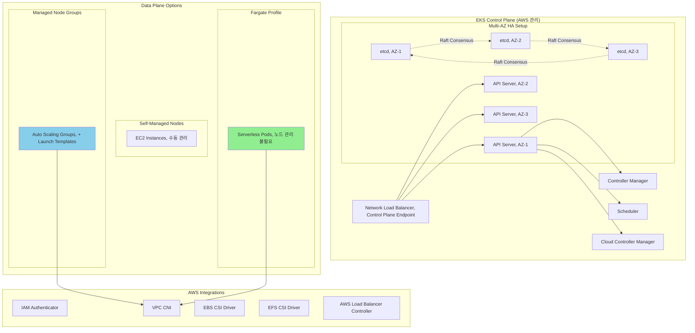
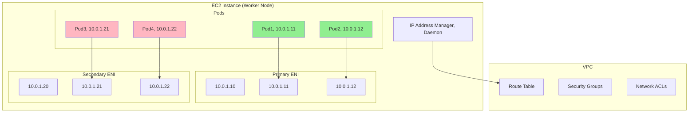
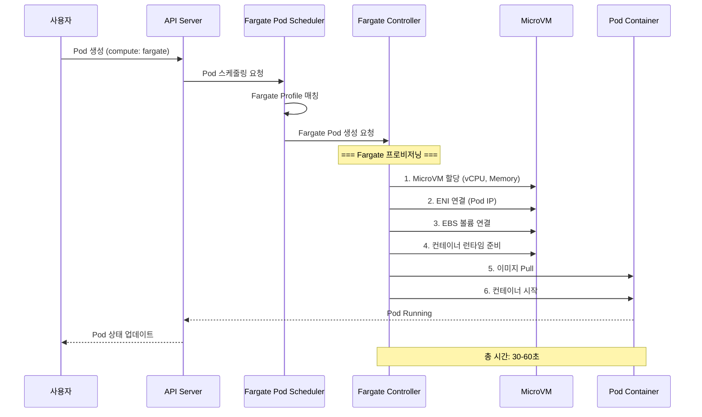

---
tags:
  - AWS
  - EKS
  - Kubernetes
  - Container
---

# EKS의 Kubernetes 마스터리: 관리형 K8s의 진화

## 🎯 Airbnb의 5,000 마이크로서비스 대장정

### 2020년 쿠버네티스 대전환

```text
📅 2020년 3월, Airbnb 플랫폼 팀
🏠 일일 예약: 200만 건
🔧 마이크로서비스: 5,000개
☸️ 자체 관리 K8s 클러스터: 50개
😰 운영 엔지니어: 200명 (24/7)
```

Airbnb는 자체 Kubernetes 클러스터 관리에 지쳐있었습니다:

-**etcd 장애**: 월 평균 3건의 치명적 장애
-**업그레이드 지옥**: 클러스터당 48시간 다운타임
-**보안 패치**: 평균 30일 지연
-**인증서 관리**: 연간 50건의 만료 사고

**"우리가 Kubernetes를 운영하는 회사인가, 숙박 플랫폼인가?"**

## 🚀 EKS 아키텍처: AWS의 K8s 혁신

### Managed Control Plane의 비밀



### EKS의 핵심 혁신

```python
class EKSInnovations:
    def __init__(self):
        self.key_features = {
            "auto_upgrade": {
                "특징": "In-place 업그레이드",
                "방식": "Blue-Green Control Plane 전환",
                "다운타임": "0초",
                "롤백": "자동"
            },

            "multi_tenancy": {
                "특징": "VPC 격리",
                "구현": "Cross-ENI 연결",
                "보안": "네트워크 수준 격리"
            },

            "iam_integration": {
                "특징": "IRSA (IAM Roles for Service Accounts)",
                "이점": "Pod 수준 AWS 권한",
                "구현": "OIDC Provider + STS"
            },

            "fargate_pods": {
                "특징": "서버리스 Pod 실행",
                "이점": "노드 관리 불필요",
                "격리": "VM 수준 보안"
            }
        }
```

## 🔐 IRSA: Pod 수준 보안의 혁명

### 기존 방식의 문제점

```python
# ❌ 나쁜 예: 노드 수준 IAM Role
class TraditionalApproach:
    """
    모든 Pod가 같은 권한 공유 = 보안 위험
    """
    def node_iam_role(self):
        return {
            "Problem": "노드의 모든 Pod가 같은 권한",
            "Risk": "권한 에스컬레이션",
            "Example": {
                "s3_reader_pod": "S3 읽기만 필요",
                "db_admin_pod": "RDS 전체 권한 필요",
                "결과": "둘 다 모든 권한 획득"
            }
        }

# ✅ 좋은 예: IRSA 사용
class IRSAApproach:
    """
    각 Pod마다 최소 권한 원칙 적용
    """
    def pod_specific_role(self):
        return {
            "Solution": "ServiceAccount별 IAM Role",
            "Security": "최소 권한 원칙",
            "Example": {
                "s3_reader_pod": "S3 읽기 권한만",
                "db_admin_pod": "RDS 권한만",
                "결과": "격리된 권한"
            }
        }
```

### IRSA 구현 상세

```yaml
# 1. ServiceAccount with IRSA
apiVersion: v1
kind: ServiceAccount
metadata:
  name: s3-reader
  namespace: production
  annotations:
    eks.amazonaws.com/role-arn: arn:aws:iam::123456789012:role/S3ReaderRole

---
# 2. Pod using ServiceAccount
apiVersion: v1
kind: Pod
metadata:
  name: app-pod
spec:
  serviceAccountName: s3-reader
  containers:
  - name: app
    image: myapp:latest
    env:
    - name: AWS_REGION
      value: us-west-2
    # AWS SDK가 자동으로 토큰 파일 감지
    # /var/run/secrets/eks.amazonaws.com/serviceaccount/token
```

```python
# IRSA 내부 동작 메커니즘
class IRSAMechanism:
    def __init__(self):
        self.workflow = """
        1. Pod 생성 → ServiceAccount 확인
        2. Webhook이 토큰 볼륨 주입
        3. AWS SDK가 토큰 파일 감지
        4. STS AssumeRoleWithWebIdentity 호출
        5. 임시 자격 증명 획득 (1시간)
        6. 자동 갱신
        """

    def token_projection(self):
        # 프로젝트된 서비스 계정 토큰
        return {
            "path": "/var/run/secrets/eks.amazonaws.com/serviceaccount/token",
            "audience": "sts.amazonaws.com",
            "expiration": 3600,
            "issuer": f"https://oidc.eks.{region}.amazonaws.com/id/{cluster_id}"
        }
```

## 🎨 VPC CNI: 네트워킹의 마법

### Native VPC Networking



### VPC CNI 최적화

```python
class VPCCNIOptimization:
    def __init__(self):
        self.instance_limits = {
            "t3.medium": {"enis": 3, "ips_per_eni": 6, "max_pods": 17},
            "m5.large": {"enis": 3, "ips_per_eni": 10, "max_pods": 29},
            "m5.xlarge": {"enis": 4, "ips_per_eni": 15, "max_pods": 58},
            "m5.2xlarge": {"enis": 4, "ips_per_eni": 15, "max_pods": 58},
            "c5n.18xlarge": {"enis": 15, "ips_per_eni": 50, "max_pods": 737}
        }

    def calculate_pod_density(self, instance_type):
        """
        최대 Pod 수 = (ENI 수 × ENI당 IP 수) - 1
        -1은 노드 자체 IP
        """
        limits = self.instance_limits[instance_type]
        return (limits["enis"] * limits["ips_per_eni"]) - 1

    def enable_prefix_delegation(self):
        """
        Prefix Delegation으로 Pod 밀도 16배 증가
        """
        return {
            "기존": "IP 주소 할당",
            "Prefix": "/28 prefix 할당 (16 IPs)",
            "효과": {
                "m5.large": "29 → 110 pods",
                "m5.xlarge": "58 → 250 pods"
            },
            "설정": "ENABLE_PREFIX_DELEGATION=true"
        }
```

## 🚀 Fargate for EKS: 서버리스 Kubernetes

### Fargate Profile 동작 원리

```yaml
# Fargate Profile 정의
apiVersion: eks.amazonaws.com/v1beta1
kind: FargateProfile
metadata:
  name: production-apps
spec:
  podSelector:
    - namespace: production
      labels:
        compute: fargate
    - namespace: staging
      labels:
        workload: batch

  subnets:
    - subnet-12345  # Private Subnet AZ-1
    - subnet-67890  # Private Subnet AZ-2
```



### Fargate vs Node Groups 비교

```python
def compare_compute_options():
    """
    언제 어떤 옵션을 선택할까?
    """
    comparison = {
        "Fargate": {
            "장점": [
                "노드 관리 불필요",
                "Pod 수준 격리",
                "자동 스케일링",
                "패치 자동화"
            ],
            "단점": [
                "DaemonSet 불가",
                "GPU 미지원",
                "비용 증가 (20-30%)",
                "시작 시간 (30-60초)"
            ],
            "적합한_워크로드": [
                "배치 작업",
                "이벤트 기반 처리",
                "개발/테스트 환경",
                "보안 민감 워크로드"
            ]
        },

        "Managed_Node_Groups": {
            "장점": [
                "완전한 K8s 기능",
                "GPU 지원",
                "DaemonSet 가능",
                "비용 효율적"
            ],
            "단점": [
                "노드 관리 필요",
                "용량 계획 필요",
                "패치 관리"
            ],
            "적합한_워크로드": [
                "상시 실행 서비스",
                "ML/AI 워크로드",
                "시스템 데몬",
                "고성능 컴퓨팅"
            ]
        }
    }

    return comparison
```

## 🔧 EKS Add-ons: 생태계 통합

### 핵심 Add-ons

```python
class EKSAddons:
    def __init__(self):
        self.core_addons = {
            "vpc-cni": {
                "버전": "v1.15.0",
                "역할": "Pod 네트워킹",
                "특징": "Native VPC IP"
            },

            "coredns": {
                "버전": "v1.10.1",
                "역할": "클러스터 DNS",
                "특징": "서비스 디스커버리"
            },

            "kube-proxy": {
                "버전": "v1.28.0",
                "역할": "서비스 프록시",
                "특징": "iptables/IPVS 모드"
            },

            "aws-ebs-csi-driver": {
                "버전": "v1.24.0",
                "역할": "EBS 볼륨",
                "특징": "동적 프로비저닝"
            },

            "aws-efs-csi-driver": {
                "버전": "v1.7.0",
                "역할": "EFS 파일시스템",
                "특징": "다중 Pod 공유"
            }
        }

    def install_addon(self, addon_name):
        """
        Add-on 설치 및 업그레이드
        """
        command = f"""
        # Add-on 설치
        aws eks create-addon \\
            --cluster-name production \\
            --addon-name {addon_name} \\
            --addon-version v1.15.0-eksbuild.1 \\
            --service-account-role-arn {role_arn} \\
            --resolve-conflicts OVERWRITE
        """

        return command
```

### AWS Load Balancer Controller

```yaml
# Ingress with ALB
apiVersion: networking.k8s.io/v1
kind: Ingress
metadata:
  name: app-ingress
  annotations:
    kubernetes.io/ingress.class: alb
    alb.ingress.kubernetes.io/scheme: internet-facing
    alb.ingress.kubernetes.io/target-type: ip
    alb.ingress.kubernetes.io/certificate-arn: arn:aws:acm:...
    alb.ingress.kubernetes.io/ssl-policy: ELBSecurityPolicy-TLS-1-2-2017-01
    alb.ingress.kubernetes.io/wafv2-acl-arn: arn:aws:wafv2:...
spec:
  rules:
  - host: api.example.com
    http:
      paths:
      - path: /
        pathType: Prefix
        backend:
          service:
            name: api-service
            port:
              number: 80
```

## 💰 비용 최적화 전략

### Airbnb의 최적화 여정

```python
class CostOptimizationStrategy:
    def __init__(self):
        self.before = {
            "setup": "자체 관리 Kubernetes",
            "nodes": 500,  # m5.2xlarge
            "utilization": 0.30,  # 30% CPU 사용률
            "monthly_cost": 350000,  # $350K
            "ops_cost": 200000  # 인건비 $200K
        }

        self.after = {
            "setup": "EKS with mixed compute",
            "strategy": {
                "on_demand": 100,  # 핵심 워크로드
                "spot": 200,  # 상태 없는 워크로드
                "fargate": 100  # 배치 작업
            },
            "utilization": 0.75,  # 75% CPU 사용률
            "monthly_cost": 180000,  # $180K
            "ops_cost": 50000  # 인건비 $50K
        }

    def implement_karpenter(self):
        """
        Karpenter: 지능형 노드 프로비저닝
        """
        return {
            "benefits": {
                "provisioning_time": "30초",
                "bin_packing": "자동 최적화",
                "spot_handling": "자동 교체",
                "right_sizing": "워크로드 맞춤"
            },

            "configuration": """
            apiVersion: karpenter.sh/v1alpha5
            kind: Provisioner
            metadata:
              name: default
            spec:
              requirements:
                - key: karpenter.sh/capacity-type
                  operator: In
                  values: ["spot", "on-demand"]
                - key: node.kubernetes.io/instance-type
                  operator: In
                  values:
                    - m5.large
                    - m5.xlarge
                    - m5.2xlarge

              limits:
                resources:
                  cpu: 1000
                  memory: 1000Gi

              ttlSecondsAfterEmpty: 30

              providerRef:
                name: default
            """
        }
```

### Spot 인스턴스 전략

```python
class SpotStrategy:
    def __init__(self):
        self.configuration = {
            "node_groups": [
                {
                    "name": "spot-group-1",
                    "instance_types": ["m5.large", "m5a.large", "m4.large"],
                    "spot_allocation": "capacity-optimized",
                    "on_demand_base": 0,
                    "spot_percentage": 100
                }
            ],

            "interruption_handling": {
                "aws_node_termination_handler": True,
                "cordon_and_drain": True,
                "pod_disruption_budget": {
                    "min_available": 1
                }
            }
        }

    def calculate_savings(self):
        on_demand_cost = 0.096  # $/hour for m5.large
        spot_cost = 0.035  # Average spot price

        monthly_hours = 730
        nodes = 200

        savings = (on_demand_cost - spot_cost) * monthly_hours * nodes
        return f"Monthly savings: ${savings:,.0f}"
```

## 🚨 실전 트러블슈팅

### Case 1: Node NotReady

```python
def troubleshoot_node_not_ready():
    """
    노드가 NotReady 상태일 때
    """
    diagnostic_steps = {
        "1_check_kubelet": {
            "명령": "systemctl status kubelet",
            "확인": "kubelet 서비스 상태",
            "해결": "systemctl restart kubelet"
        },

        "2_check_cni": {
            "명령": "kubectl logs -n kube-system aws-node-xxxxx",
            "확인": "VPC CNI 로그",
            "해결": "ENI/IP 한계 확인"
        },

        "3_check_disk": {
            "명령": "df -h",
            "확인": "디스크 공간",
            "해결": "이미지 정리 또는 볼륨 확장"
        },

        "4_check_memory": {
            "명령": "free -h",
            "확인": "메모리 압박",
            "해결": "Pod eviction 또는 노드 추가"
        }
    }

    return diagnostic_steps
```

### Case 2: IRSA 인증 실패

```python
class IRSATroubleshooting:
    def diagnose_auth_failure(self):
        checklist = {
            "1_oidc_provider": {
                "확인": "OIDC Provider 존재",
                "명령": """
                aws eks describe-cluster --name cluster-name \\
                    --query "cluster.identity.oidc.issuer"
                """,
                "해결": "OIDC Provider 생성"
            },

            "2_trust_relationship": {
                "확인": "IAM Role Trust Policy",
                "필요": {
                    "Principal": {
                        "Federated": f"arn:aws:iam::{account}:oidc-provider/{oidc}"
                    },
                    "Condition": {
                        "StringEquals": {
                            f"{oidc}:sub": "system:serviceaccount:namespace:sa-name"
                        }
                    }
                }
            },

            "3_service_account": {
                "확인": "ServiceAccount 어노테이션",
                "명령": "kubectl describe sa service-account-name",
                "필요": "eks.amazonaws.com/role-arn annotation"
            },

            "4_token_volume": {
                "확인": "Token 볼륨 마운트",
                "경로": "/var/run/secrets/eks.amazonaws.com/serviceaccount/token",
                "명령": "kubectl exec pod-name -- ls -la /var/run/secrets/"
            }
        }

        return checklist
```

### Case 3: 클러스터 업그레이드 실패

```python
def handle_upgrade_failure():
    """
    EKS 업그레이드 중 문제 해결
    """
    upgrade_strategy = {
        "preparation": [
            "kubectl get nodes -o wide  # 노드 버전 확인",
            "kubectl get pods --all-namespaces | grep -v Running  # 문제 Pod 확인",
            "aws eks list-addons --cluster-name cluster  # Add-on 버전 확인"
        ],

        "upgrade_order": [
            "1. Control Plane 업그레이드 (AWS 자동)",
            "2. Add-ons 업그레이드",
            "3. Node Groups 업그레이드",
            "4. 애플리케이션 테스트"
        ],

        "rollback_plan": {
            "control_plane": "자동 롤백 (AWS 관리)",
            "nodes": "이전 AMI로 새 Node Group 생성",
            "apps": "Helm rollback 또는 이전 manifest 적용"
        }
    }

    return upgrade_strategy
```

## 🎯 EKS Best Practices

```python
def eks_best_practices():
    return {
        "security": [
            "IRSA 사용 (노드 IAM Role 대신)",
            "Pod Security Standards 적용",
            "Network Policies 구현",
            "Private endpoint 사용",
            "Secrets Manager/Parameter Store 통합"
        ],

        "reliability": [
            "Multi-AZ 노드 분산",
            "Pod Disruption Budgets 설정",
            "Liveness/Readiness Probes",
            "Horizontal Pod Autoscaler",
            "Cluster Autoscaler 또는 Karpenter"
        ],

        "performance": [
            "VPC CNI Prefix Delegation",
            "GP3 EBS 볼륨 사용",
            "노드 로컬 NVMe 캐시",
            "Pod 리소스 requests/limits 설정",
            "노드 affinity/anti-affinity"
        ],

        "cost": [
            "Spot 인스턴스 활용",
            "Fargate Spot 사용",
            "Compute Savings Plans",
            "Karpenter로 right-sizing",
            "미사용 리소스 정리"
        ],

        "operations": [
            "GitOps (Flux/ArgoCD)",
            "Prometheus/Grafana 모니터링",
            "Container Insights 활성화",
            "정기적인 클러스터 업그레이드",
            "Backup 전략 (Velero)"
        ]
    }
```

## 🎬 마무리: Airbnb의 성공 스토리

2024년 현재, Airbnb는 EKS로:

-**운영 비용**: 70% 절감 ($550K → $165K/월)
-**가용성**: 99.95% → 99.99%
-**배포 빈도**: 일 10회 → 시간당 50회
-**평균 복구 시간**: 2시간 → 5분
-**엔지니어 생산성**: 300% 향상

**"EKS는 우리가 Kubernetes를 운영하지 않고 사용할 수 있게 해주었다."**

---

## 🎯 AWS Compute 서비스 선택 가이드

```python
def choose_compute_service():
    """
    최종 의사결정 트리
    """
    decision_tree = {
        "실행_시간": {
            "< 15분": "Lambda",
            "< 1시간": "Fargate (ECS/EKS)",
            "> 1시간": "EC2/ECS/EKS"
        },

        "아키텍처": {
            "함수": "Lambda",
            "컨테이너": {
                "간단": "ECS",
                "복잡": "EKS"
            },
            "VM": "EC2"
        },

        "스케일링": {
            "이벤트_기반": "Lambda",
            "예측_가능": "ECS/EKS",
            "복잡한_규칙": "EKS + Karpenter"
        },

        "비용_민감도": {
            "매우_민감": "Lambda + Spot",
            "보통": "Fargate",
            "낮음": "On-Demand EC2"
        },

        "운영_복잡도": {
            "최소": "Lambda",
            "낮음": "Fargate",
            "보통": "ECS",
            "높음": "EKS"
        }
    }

    return decision_tree
```

AWS Compute의 여정이 끝났습니다!

다음 섹션에서는 [AWS Database 서비스의 내부 구조](../database/01-rds.md)를 탐험해보겠습니다!
