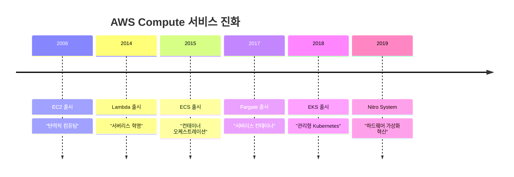

---
tags:
  - AWS
  - Compute
  - EC2
  - Lambda
  - ECS
  - EKS
---

# AWS Compute - 클라우드 컴퓨팅의 진화 ⚡

## 이 섹션을 읽으면 답할 수 있는 질문들

- Netflix는 어떻게 EC2 Nitro로 4K 스트리밍을 최적화하는가?
- Lambda는 정말로 서버리스일까? 내부에는 무엇이 있는가?
- Pinterest는 어떻게 ECS로 수천 개의 마이크로서비스를 관리하는가?
- Airbnb는 왜 Kubernetes에서 EKS로 마이그레이션했을까?
- 내 애플리케이션에는 어떤 컴퓨트 서비스가 최적일까?

## 시작하며: 컴퓨팅의 혁신, AWS의 여정

클라우드 컴퓨팅은 AWS와 함께 진화해왔습니다:



## AWS Compute 서비스 완벽 가이드 📚

### [1. EC2 Nitro: 가상화의 새로운 차원](01-ec2-nitro.md)

**Netflix 4K 스트리밍의 하드웨어 비밀**

Netflix가 어떻게 EC2 Nitro System을 활용해 전 세계에 4K 스트리밍을 제공하는지, 하드웨어 가상화의 혁신부터 성능 최적화까지 완벽 분석합니다.

🔧 **핵심 내용**:

- Nitro System 커스텀 ASIC 아키텍처
- SR-IOV와 하드웨어 가상화
- Local NVMe 스토리지 활용
- Netflix 스트리밍 최적화 사례

---

### [2. Lambda: 진정한 서버리스의 실체](02-lambda.md)

**Duolingo 1억 사용자 서버리스 아키텍처**

Duolingo가 어떻게 Lambda를 활용해 1억 사용자의 언어 학습을 지원하는지, Firecracker MicroVM부터 성능 최적화까지 서버리스의 모든 것을 탐험합니다.

🚀 **핵심 내용**:

- Firecracker MicroVM 기술
- Cold Start vs Warm Start 최적화  
- Provisioned Concurrency 전략
- Duolingo 실시간 언어 처리

---

### [3. ECS: 컨테이너 오케스트레이션의 단순함](03-ecs.md)

**Pinterest 마이크로서비스 관리의 비법**

Pinterest가 어떻게 ECS를 활용해 수백 개의 마이크로서비스를 효율적으로 관리하는지, Task Definition부터 Auto Scaling까지 컨테이너 오케스트레이션을 마스터합니다.

📦 **핵심 내용**:

- ECS 클러스터 관리와 Task 스케줄링
- Fargate vs EC2 배치 전략
- Service Discovery와 로드밸런싱
- Pinterest 마이크로서비스 사례

---

### [4. EKS: 관리형 Kubernetes의 완성](04-eks.md)

**Airbnb 글로벌 확장의 Kubernetes 여정**

Airbnb가 어떻게 EKS를 활용해 글로벌 서비스를 확장하고 운영 복잡도를 줄였는지, Kubernetes 관리부터 고급 패턴까지 상세히 분석합니다.

⚙️ **핵심 내용**:

- EKS Control Plane 관리
- IRSA (IAM Roles for Service Accounts)
- VPC CNI와 네트워킹 최적화
- Airbnb 글로벌 아키텍처

## 컴퓨트 서비스 선택 가이드 🎯

### 의사결정 매트릭스

```python
def choose_compute_service(requirements):
    """
    요구사항에 따른 최적 컴퓨트 서비스 선택
    """
    
    # Lambda: 이벤트 드리븐, 짧은 실행시간
    if (requirements.get("execution_time") < 900 and  # 15분 미만
        requirements.get("trigger") == "event_driven" and
        requirements.get("management_overhead") == "minimal"):
        return "Lambda"
    
    # Fargate: 컨테이너, 서버 관리 불필요  
    if (requirements.get("containerized") and
        requirements.get("server_management") == "none"):
        return "ECS Fargate" if requirements.get("orchestration") == "simple" else "EKS Fargate"
    
    # ECS: 컨테이너, 단순한 오케스트레이션
    if (requirements.get("containerized") and
        requirements.get("orchestration_complexity") == "low"):
        return "ECS"
    
    # EKS: 복잡한 마이크로서비스, Kubernetes 필요
    if (requirements.get("microservices") and
        requirements.get("kubernetes_features") == "required"):
        return "EKS"
    
    # EC2: 최대한의 제어, 커스텀 환경
    if (requirements.get("control_level") == "full" or
        requirements.get("custom_environment") == "required"):
        return "EC2"
    
    return "EC2"  # 기본값

# 실제 사용 예시
netflix_requirements = {
    "execution_time": "continuous",
    "control_level": "full", 
    "custom_environment": "required",
    "performance": "critical"
}
# Result: EC2 Nitro

duolingo_requirements = {
    "execution_time": 300,  # 5분
    "trigger": "event_driven",
    "management_overhead": "minimal"
}
# Result: Lambda
```

### 서비스별 특성 비교

| 특성 | EC2 | Lambda | ECS | EKS |
|------|-----|--------|-----|-----|
| **관리 복잡도** | 높음 | 없음 | 낮음 | 중간 |
| **확장성** | 수동/자동 | 자동 | 자동 | 자동 |
| **비용 모델** | 시간당 | 요청당 | 시간당 | 시간당 |
| **시작 시간** | 분 | 밀리초 | 초 | 초 |
| **최대 실행시간** | 무제한 | 15분 | 무제한 | 무제한 |

## 성능 최적화 패턴 🚀

### 패턴 1: 비용 최적화

```python
cost_optimization = {
    "ec2": {
        "spot_instances": "90% 할인",
        "reserved_instances": "75% 할인",
        "right_sizing": "평균 30% 절감"
    },
    "lambda": {
        "memory_optimization": "실행시간 최적화로 비용 절감",
        "provisioned_concurrency": "cold start 방지"
    },
    "containers": {
        "fargate_spot": "70% 할인",
        "cluster_autoscaling": "자원 최적화"
    }
}
```

### 패턴 2: 성능 최적화  

```python
performance_patterns = {
    "compute_intensive": {
        "service": "EC2 C5n 인스턴스",
        "optimization": "CPU 최적화, Enhanced Networking"
    },
    "memory_intensive": {
        "service": "EC2 R5 인스턴스", 
        "optimization": "대용량 메모리, EBS 최적화"
    },
    "io_intensive": {
        "service": "EC2 I3 인스턴스",
        "optimization": "NVMe SSD, SR-IOV"
    },
    "event_processing": {
        "service": "Lambda",
        "optimization": "메모리 튜닝, 연결 풀링"
    }
}
```

## 컴퓨트 마스터 로드맵 🗺️

### 기초 (1주)

- [ ] EC2 인스턴스 시작 및 연결
- [ ] 첫 Lambda 함수 작성
- [ ] 기본 보안 그룹 설정

### 중급 (1개월)

- [ ] Auto Scaling Group 설정
- [ ] ECS 클러스터 구축
- [ ] Lambda Layer와 환경 변수

### 고급 (3개월)

- [ ] EKS 클러스터 관리
- [ ] 멀티 리전 배포
- [ ] 고급 모니터링 및 로깅

### 전문가 (6개월+)

- [ ] 대규모 시스템 아키텍처
- [ ] 성능 튜닝 및 최적화
- [ ] 비용 효율성 극대화

## 실전 트러블슈팅 🔧

### 문제 1: Lambda Cold Start

```python
# 문제: Lambda 첫 호출이 느림
cold_start_solutions = {
    "provisioned_concurrency": "미리 준비된 실행 환경",
    "runtime_optimization": "빠른 런타임 선택 (Python > Java)",
    "package_size": "배포 패키지 최소화",
    "connection_pooling": "연결 재사용"
}

# 구현 예시
import json
import boto3

# 전역 변수로 연결 풀링
dynamodb = boto3.resource('dynamodb')
table = dynamodb.Table('users')

def lambda_handler(event, context):
    # 매번 새로운 연결 생성하지 않음
    response = table.get_item(Key={'id': event['user_id']})
    return json.dumps(response['Item'])
```

### 문제 2: ECS Task 메모리 부족

```python
# ECS Task Definition 메모리 최적화
task_definition = {
    "memory": 512,  # 컨테이너 메모리 제한
    "cpu": 256,     # CPU 단위 (0.25 vCPU)
    
    # 메모리 예약 vs 제한
    "containerDefinitions": [
        {
            "memory": 400,          # 하드 제한
            "memoryReservation": 300, # 소프트 제한
            "essential": True
        }
    ]
}
```

## 비용 최적화 전략 💰

### 리소스 우선 순위별 최적화

```python
cost_priorities = {
    "1순위": {
        "action": "Spot Instances 활용",
        "savings": "최대 90%",
        "적용대상": "fault-tolerant 워크로드"
    },
    "2순위": {
        "action": "Reserved Instances",
        "savings": "최대 75%", 
        "적용대상": "예측 가능한 워크로드"
    },
    "3순위": {
        "action": "Right Sizing",
        "savings": "평균 30%",
        "적용대상": "모든 워크로드"
    },
    "4순위": {
        "action": "Serverless 전환",
        "savings": "사용량에 따라",
        "적용대상": "간헐적 워크로드"
    }
}
```

## 마치며: 컴퓨팅의 미래

AWS Compute 서비스들은 각각 고유한 강점과 용도를 가지고 있습니다. **완벽한 솔루션은 없지만, 완벽한 조합은 있습니다.**

> *"올바른 도구를 올바른 작업에 사용하는 것이 아키텍트의 기본 소양이다. AWS는 모든 가능성을 제공한다."*
> — AWS Compute Team

컴퓨팅의 무한한 가능성을 탐험해보겠습니다! ⚡

---

**다음 읽기**: [EC2 Nitro: 가상화의 새로운 차원](01-ec2-nitro.md)
