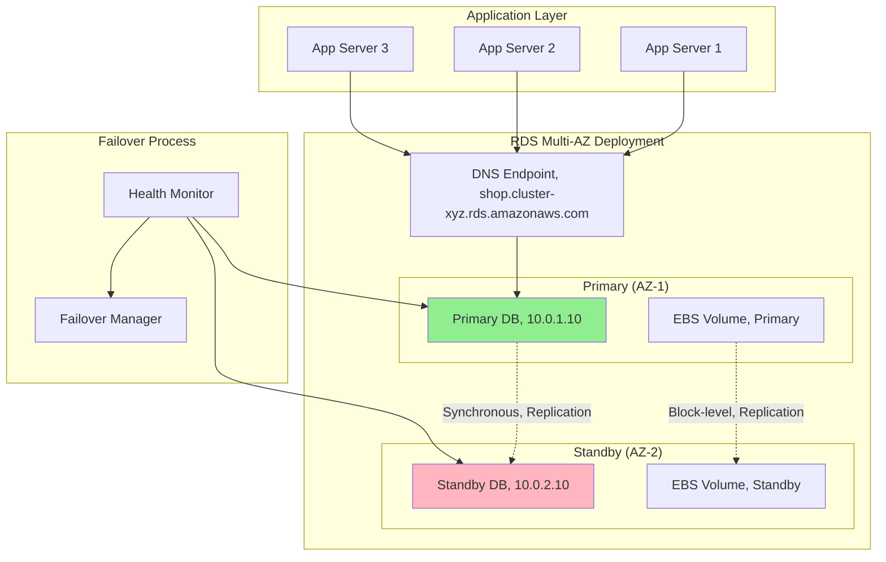
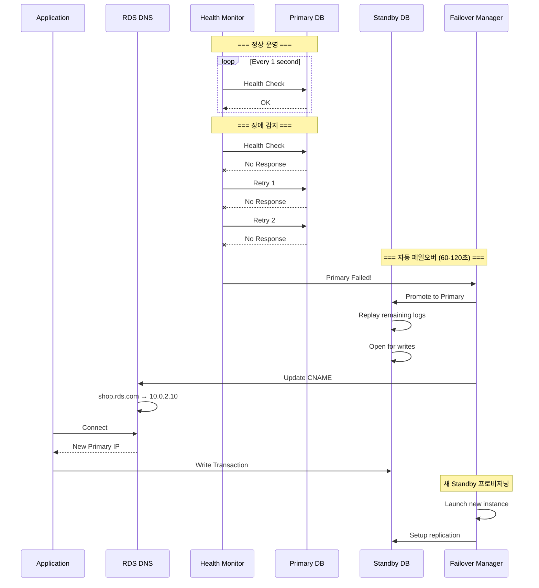
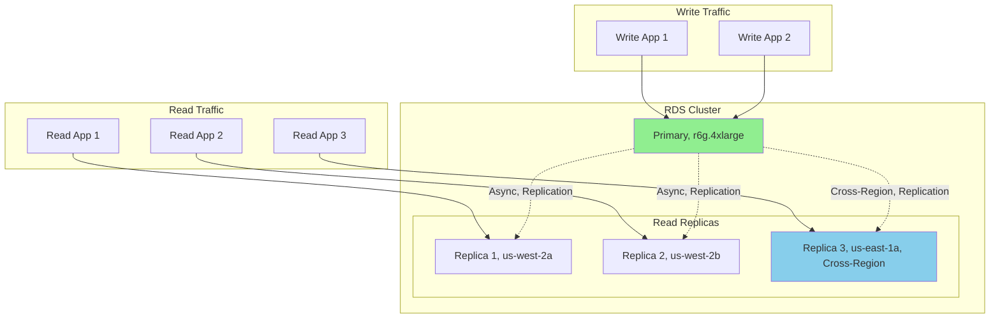
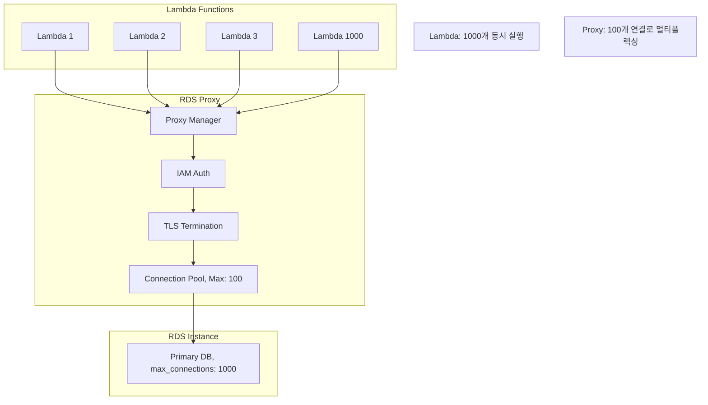

---
tags:
  - AWS
  - RDS
  - Database
  - MySQL
  - PostgreSQL
---

# RDS의 관리형 데이터베이스: Multi-AZ가 만든 무중단 신화

## 🎯 Shopify의 블랙프라이데이 생존기

### 2022년 최대 쇼핑 시즌의 도전

```text
📅 2022년 11월 25일, 블랙프라이데이
🛒 초당 거래: 120만 건
💳 분당 매출: $400만
🗄️ 데이터베이스 쓰기: 초당 50만 TPS
😱 예상 다운타임 비용: 분당 $400만
```

Shopify의 데이터베이스 팀은 숨을 죽이고 있었습니다. 전 세계 수백만 상점의 블랙프라이데이 트래픽이 몰려오고 있었죠. 자체 관리 MySQL 클러스터는 이미 한계를 보이고 있었습니다:

- **복제 지연**: Master-Slave 간 5초 지연
- **페일오버 시간**: 수동 전환 시 15분
- **백업 영향**: 백업 중 30% 성능 저하
- **패치 다운타임**: 월 4시간

**"데이터베이스가 1분만 죽어도 $400만이 날아간다..."**

## 🚀 RDS Multi-AZ: 무중단의 비밀

### Multi-AZ 아키텍처의 마법



### 동기식 복제의 내부 동작

```python
class MultiAZReplication:
    def __init__(self):
        self.replication_mode = "SYNCHRONOUS"
        self.protocol = "MySQL Semi-Sync / PostgreSQL Sync"

    def write_transaction(self, sql):
        """
        Multi-AZ 쓰기 트랜잭션 프로세스
        """
        # 1. Primary에 쓰기
        primary_lsn = self.write_to_primary(sql)

        # 2. Standby로 동기 복제
        replication_future = self.replicate_to_standby(primary_lsn)

        # 3. Standby ACK 대기 (동기식)
        try:
            standby_ack = replication_future.get(timeout_ms=10)

            # 4. 두 노드 모두 커밋
            self.commit_primary()
            self.commit_standby()

            return {"status": "SUCCESS", "latency_ms": 2}

        except TimeoutException:
            # Standby 응답 없음 - 비동기 모드로 전환
            self.switch_to_async_mode()
            return {"status": "DEGRADED", "mode": "ASYNC"}
```

### 자동 페일오버 메커니즘



## 🔒 RDS 보안 아키텍처

### 암호화 계층

```python
class RDSEncryption:
    def __init__(self):
        self.layers = {
            "at_rest": {
                "method": "AES-256",
                "key_management": "AWS KMS",
                "scope": ["data_files", "backups", "snapshots", "replicas"]
            },

            "in_transit": {
                "method": "TLS 1.2/1.3",
                "certificate": "RDS Certificate Authority",
                "enforcement": "rds.force_ssl = 1"
            },

            "transparent_data_encryption": {
                "oracle": "TDE with CloudHSM",
                "sql_server": "TDE with KMS"
            }
        }

    def encrypt_data_block(self, data):
        """
        블록 수준 암호화 프로세스
        """
        # 1. Data Encryption Key (DEK) 가져오기
        dek = self.get_data_key_from_kms()

        # 2. 블록 암호화
        encrypted_block = AES256.encrypt(data, dek)

        # 3. EBS 볼륨에 쓰기
        self.write_to_ebs(encrypted_block)

        # 4. 암호화된 상태로 복제
        self.replicate_encrypted(encrypted_block)

        return encrypted_block
```

### IAM 데이터베이스 인증

```python
# RDS IAM 인증 플로우
class IAMAuthentication:
    def connect_with_iam(self):
        """
        패스워드 없이 IAM으로 연결
        """
        import boto3
        import pymysql

        # 1. 임시 토큰 생성 (15분 유효)
        client = boto3.client('rds')
        token = client.generate_db_auth_token(
            DBHostname='shop.cluster-xyz.rds.amazonaws.com',
            Port=3306,
            DBUsername='shopify_app',
            Region='us-west-2'
        )

        # 2. 토큰으로 연결
        connection = pymysql.connect(
            host='shop.cluster-xyz.rds.amazonaws.com',
            user='shopify_app',
            password=token,  # IAM 토큰을 패스워드로 사용
            ssl_ca='/opt/rds-ca-2019-root.pem',
            ssl_verify_identity=True
        )

        return connection
```

## 🚀 성능 최적화 기법

### Read Replica 아키텍처



### Parameter Group 최적화

```python
class RDSParameterOptimization:
    def __init__(self):
        self.mysql_optimizations = {
            # 연결 관리
            "max_connections": self.calculate_max_connections(),
            "wait_timeout": 300,
            "interactive_timeout": 300,

            # InnoDB 버퍼 풀 (전체 메모리의 75%)
            "innodb_buffer_pool_size": "{DBInstanceClassMemory*3/4}",
            "innodb_buffer_pool_instances": 8,

            # 쿼리 캐시 (8.0부터 제거됨)
            "query_cache_type": 0,
            "query_cache_size": 0,

            # 로그 설정
            "slow_query_log": 1,
            "long_query_time": 2,
            "log_bin_trust_function_creators": 1,

            # 복제 최적화
            "binlog_format": "ROW",
            "sync_binlog": 1,
            "innodb_flush_log_at_trx_commit": 1,

            # 성능 스키마
            "performance_schema": 1,
            "performance_schema_consumer_events_statements_history": 1
        }

    def calculate_max_connections(self):
        """
        인스턴스 클래스별 최적 연결 수
        """
        instance_memory_gb = 64  # r6g.2xlarge

        # 공식: LEAST({DBInstanceClassMemory/9531392}, 5000)
        return min(int(instance_memory_gb * 1024 * 1024 * 1024 / 9531392), 5000)
```

## 📊 모니터링과 인사이트

### Performance Insights 활용

```python
class PerformanceInsights:
    def __init__(self):
        self.metrics = {
            "db.SQL.Innodb_rows_read": "읽은 행 수",
            "db.SQL.Innodb_row_lock_waits": "행 잠금 대기",
            "db.SQL.Questions": "실행된 쿼리 수",
            "db.SQL.Com_select": "SELECT 쿼리 수",
            "db.SQL.Com_insert": "INSERT 쿼리 수"
        }

    def analyze_top_sql(self):
        """
        상위 SQL 분석
        """
        return {
            "top_by_cpu": [
                {
                    "query": "SELECT * FROM orders WHERE status = ?",
                    "cpu_percent": 45,
                    "calls_per_sec": 1000,
                    "avg_latency_ms": 5
                }
            ],

            "top_by_io": [
                {
                    "query": "UPDATE inventory SET quantity = ?",
                    "io_requests_per_sec": 5000,
                    "rows_examined": 1000000
                }
            ],

            "wait_events": {
                "io/table/sql/handler": 40,  # 테이블 I/O
                "synch/mutex/innodb": 20,     # InnoDB 뮤텍스
                "io/file/innodb/data": 15     # 데이터 파일 I/O
            }
        }
```

### CloudWatch 메트릭과 알람

```yaml
# Critical 알람 설정
DatabaseAlarms:
  HighCPU:
    MetricName: CPUUtilization
    Threshold: 80
    Period: 300
    EvaluationPeriods: 2
    Actions:
      - Scale up instance
      - Page on-call engineer

  StorageFull:
    MetricName: FreeStorageSpace
    Threshold: 10737418240  # 10GB
    Period: 300
    Actions:
      - Enable storage autoscaling
      - Delete old logs

  ReplicationLag:
    MetricName: ReplicaLag
    Threshold: 30  # 30초
    Period: 60
    Actions:
      - Check network
      - Reduce write load

  ConnectionExhaustion:
    MetricName: DatabaseConnections
    Threshold: 900  # 90% of max_connections
    Actions:
      - Scale connection pool
      - Restart applications
```

## 🔄 백업과 복구 전략

### 자동 백업 메커니즘

```python
class RDSBackupStrategy:
    def __init__(self):
        self.backup_config = {
            "retention_period": 35,  # 최대 35일
            "backup_window": "03:00-04:00 UTC",
            "copy_tags": True
        }

    def backup_process(self):
        """
        RDS 백업 프로세스
        """
        steps = [
            # 1. 스냅샷 시작
            "CREATE SNAPSHOT FROM EBS VOLUMES",

            # 2. I/O 일시 중단 (Single-AZ만)
            "SUSPEND I/O (few seconds)",

            # 3. 스냅샷 메타데이터 기록
            "RECORD BINLOG POSITION",

            # 4. I/O 재개
            "RESUME I/O",

            # 5. 증분 백업 (이후)
            "INCREMENTAL BACKUP EVERY 5 MINUTES"
        ]

        return {
            "snapshot_time": "초기 몇 초",
            "performance_impact": "Multi-AZ: 없음, Single-AZ: 몇 초 중단",
            "restore_options": ["Point-in-Time", "Snapshot"]
        }

    def point_in_time_recovery(self, target_time):
        """
        특정 시점으로 복구
        """
        # 1. 가장 가까운 자동 백업 찾기
        base_snapshot = self.find_nearest_snapshot(target_time)

        # 2. 새 인스턴스 생성
        new_instance = self.restore_from_snapshot(base_snapshot)

        # 3. 트랜잭션 로그 재생
        self.replay_binlogs(new_instance, base_snapshot.time, target_time)

        # 4. 일관성 검증
        self.verify_consistency(new_instance)

        return new_instance
```

## 💰 비용 최적화 전략

### Shopify의 최적화 결과

```python
class CostOptimization:
    def __init__(self):
        self.before_rds = {
            "setup": "자체 관리 MySQL on EC2",
            "instances": {
                "primary": "r5.8xlarge x 2",
                "replicas": "r5.4xlarge x 6"
            },
            "monthly_cost": 50000,
            "ops_hours": 400  # 월간 운영 시간
        }

        self.after_rds = {
            "setup": "RDS Multi-AZ + Aurora Read Replicas",
            "instances": {
                "primary": "db.r6g.4xlarge Multi-AZ",
                "replicas": "db.r6g.2xlarge x 3"
            },
            "monthly_cost": 25000,
            "ops_hours": 40
        }

    def reserved_instance_savings(self):
        """
        예약 인스턴스 절감액
        """
        return {
            "on_demand": 25000,
            "1_year_reserved": 18750,  # 25% 할인
            "3_year_reserved": 12500,  # 50% 할인
            "savings": "연간 $150,000 절감"
        }
```

### Storage Auto Scaling

```python
# 스토리지 자동 확장 설정
class StorageAutoScaling:
    def configure(self):
        return {
            "enabled": True,
            "max_allocated_storage": 3000,  # GB
            "trigger_conditions": {
                "free_space_less_than": "10%",
                "or_less_than_gb": 10
            },
            "scaling_increment": "10% or 10GB (whichever is greater)",
            "cooldown_period": "6 hours",

            "benefits": [
                "다운타임 없는 확장",
                "자동화된 용량 관리",
                "비용 최적화"
            ]
        }
```

## 🚨 실전 트러블슈팅

### Case 1: 갑작스런 성능 저하

```python
def diagnose_performance_issue():
    """
    RDS 성능 문제 진단
    """
    checklist = {
        "1_check_metrics": [
            "CPU Utilization > 80%?",
            "ReadIOPS/WriteIOPS 급증?",
            "DatabaseConnections 포화?",
            "SwapUsage > 0?"
        ],

        "2_check_slow_queries": """
            SELECT
                query,
                exec_count,
                avg_latency_ms,
                total_latency_ms
            FROM performance_schema.statements_summary
            WHERE avg_latency_ms > 1000
            ORDER BY total_latency_ms DESC;
        """,

        "3_check_locks": """
            SELECT * FROM information_schema.innodb_locks;
            SELECT * FROM information_schema.innodb_lock_waits;
        """,

        "4_immediate_actions": [
            "Kill long-running queries",
            "Increase instance size",
            "Add read replicas",
            "Enable query cache"
        ]
    }

    return checklist
```

### Case 2: 복제 지연

```python
class ReplicationLagTroubleshooting:
    def diagnose_lag(self):
        common_causes = {
            "heavy_writes": {
                "증상": "Primary 쓰기 부하 과다",
                "해결": "쓰기 분산, 배치 처리"
            },

            "long_transactions": {
                "증상": "대량 UPDATE/DELETE",
                "해결": "작은 배치로 분할"
            },

            "network_issues": {
                "증상": "Cross-region 복제 지연",
                "해결": "같은 리전 replica 추가"
            },

            "replica_capacity": {
                "증상": "Replica CPU 100%",
                "해결": "더 큰 인스턴스로 스케일업"
            }
        }

        return common_causes
```

### Case 3: 연결 실패

```python
def troubleshoot_connection():
    """
    연결 문제 해결
    """
    return {
        "security_group": {
            "확인": "인바운드 규칙에 포트 3306/5432 허용?",
            "해결": "애플리케이션 서버 IP/SG 추가"
        },

        "max_connections": {
            "확인": "SHOW VARIABLES LIKE 'max_connections'",
            "해결": "Parameter Group에서 증가"
        },

        "dns_resolution": {
            "확인": "nslookup shop.rds.amazonaws.com",
            "해결": "VPC DNS 설정 확인"
        },

        "ssl_certificate": {
            "확인": "인증서 만료일",
            "해결": "새 RDS CA 인증서 다운로드"
        }
    }
```

## 🎯 RDS Proxy: 연결 풀링의 혁명

### 서버리스 애플리케이션을 위한 연결 관리



```python
class RDSProxy:
    def __init__(self):
        self.benefits = {
            "connection_pooling": "66% 연결 감소",
            "failover_time": "66% 단축 (30초 → 10초)",
            "iam_authentication": "자동 토큰 관리",
            "performance": "7x 처리량 증가"
        }

    def connection_multiplexing(self):
        """
        연결 멀티플렉싱
        """
        # 1000개 Lambda → 100개 DB 연결
        return {
            "pinning": "세션 변수 사용 시 고정",
            "multiplexing": "상태 없는 쿼리는 공유",
            "warm_pool": "사전 연결 유지"
        }
```

## 🎬 마무리: Shopify의 블랙프라이데이 성공

2024년 현재, Shopify는 RDS Multi-AZ로:

- **가용성**: 99.95% → 99.99%
- **페일오버 시간**: 15분 → 60초
- **운영 시간**: 400시간 → 40시간/월
- **비용**: 50% 절감
- **블랙프라이데이**: 0분 다운타임

**"RDS는 우리가 데이터베이스 관리가 아닌 비즈니스에 집중할 수 있게 해주었다."**

다음 문서에서는 [DynamoDB의 무한 확장 비밀](02-dynamodb.md)을 파헤쳐보겠습니다!
