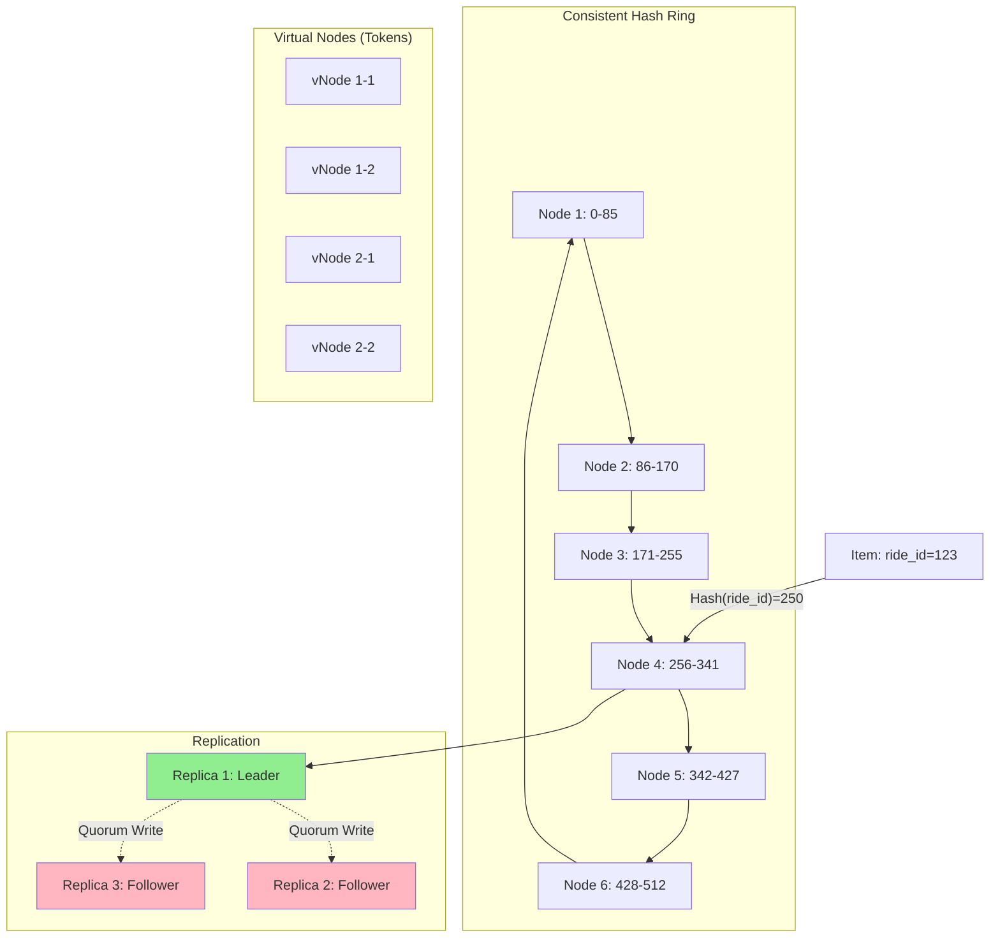
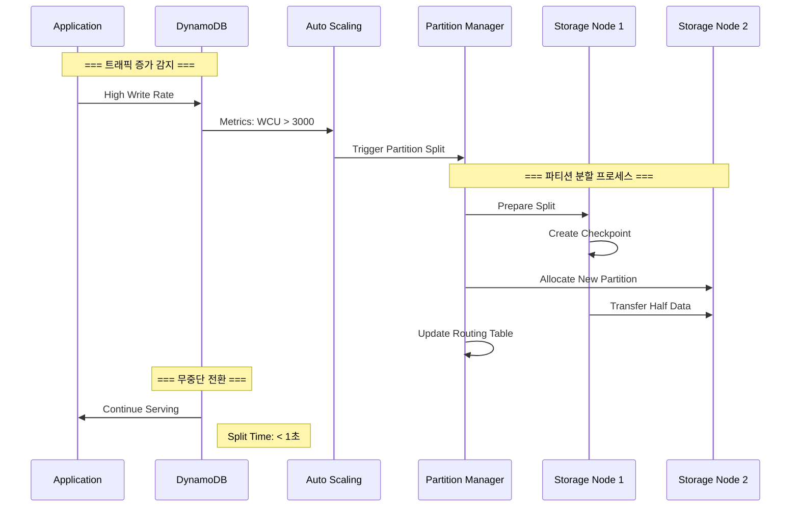
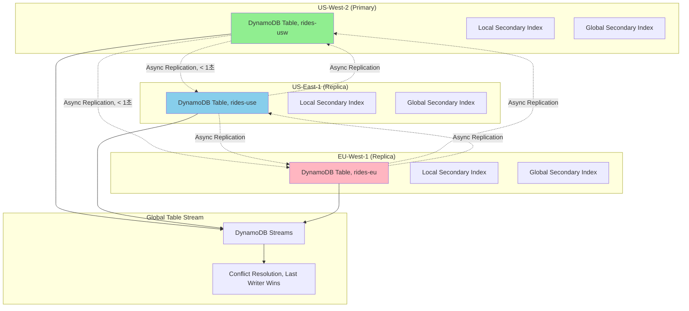
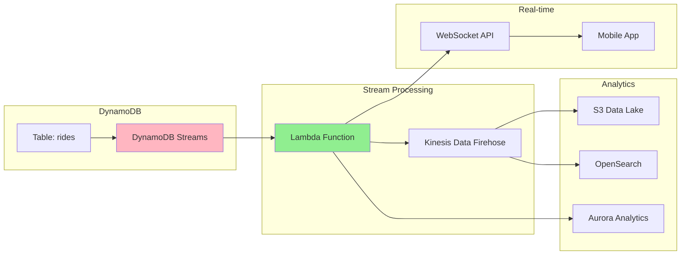
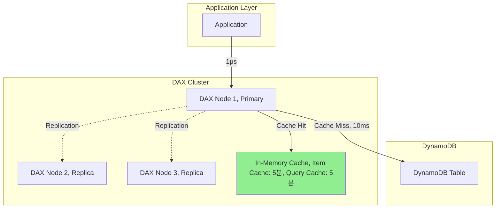

---
tags:
  - AWS
  - DynamoDB
  - NoSQL
  - Database
---

# DynamoDB의 무한 확장: Consistent Hashing의 마법

## 🎯 Lyft의 10억 라이드 도전

### 2021년 팬데믹 이후 폭발적 성장

```text
📅 2021년 7월, 경제 재개방
🚗 일일 라이드: 300만 → 1,000만
📍 위치 업데이트: 초당 500만 건
💾 데이터 증가: 일 10TB
⚡ 응답 시간 요구: < 10ms
```

Lyft의 엔지니어링 팀은 급격한 성장에 직면했습니다. 기존 관계형 데이터베이스는 한계를 보였죠:

- **샤딩 지옥**: 수동 샤드 리밸런싱에 주 40시간
- **핫 파티션**: 뉴욕/SF 지역 데이터 집중
- **스케일 한계**: 수직 확장 불가능
- **복잡한 쿼리**: 위치 기반 조회 지연

**"더 이상 샤딩으로는 해결할 수 없다. 무한 확장이 필요하다!"**

## 🚀 DynamoDB 아키텍처: 무한 확장의 비밀

### Consistent Hashing과 파티션



### 파티션 키 해싱과 분산

```python
class DynamoDBPartitioning:
    def __init__(self):
        self.hash_space = 2**128  # MD5 해시 공간
        self.partition_count = 1000  # 초기 파티션

    def calculate_partition(self, partition_key):
        """
        파티션 키를 물리적 파티션으로 매핑
        """
        # 1. MD5 해시 계산
        hash_value = hashlib.md5(partition_key.encode()).hexdigest()
        hash_int = int(hash_value, 16)

        # 2. 해시 링에서 위치 결정
        position = hash_int % self.hash_space

        # 3. 담당 파티션 찾기
        partition = self.find_partition(position)

        # 4. 복제본 결정 (N=3)
        replicas = self.get_replicas(partition, count=3)

        return {
            "partition": partition,
            "replicas": replicas,
            "consistency": "eventual",  # 기본값
            "quorum": "W=1, R=1"  # 쓰기 1개, 읽기 1개
        }
```

## 🎭 Auto Scaling과 Adaptive Capacity

### 파티션 자동 분할



### Adaptive Capacity 동작

```python
class AdaptiveCapacity:
    def __init__(self):
        self.base_capacity = {
            "RCU": 3000,  # Read Capacity Units
            "WCU": 1000   # Write Capacity Units
        }

    def handle_hot_partition(self, partition_id):
        """
        핫 파티션 자동 처리
        """
        # 1. 핫 파티션 감지
        metrics = self.get_partition_metrics(partition_id)

        if metrics["consumed_capacity"] > metrics["provisioned_capacity"]:
            # 2. Adaptive Capacity 활성화
            isolation_capacity = self.isolate_partition(partition_id)

            # 3. 최대 5분간 버스트 허용
            burst_result = {
                "original_capacity": 100,  # WCU
                "burst_capacity": 300,     # 3x 버스트
                "duration": "5 minutes",
                "auto_scaling": "triggered"
            }

            # 4. 영구적 해결: 파티션 분할
            if metrics["sustained_high_traffic"]:
                self.split_partition(partition_id)

            return burst_result
```

## 🔐 Global Tables: 다중 리전 복제

### Cross-Region 복제 아키텍처



### Conflict Resolution

```python
class GlobalTableConflictResolution:
    def __init__(self):
        self.resolution_strategy = "Last Writer Wins"

    def resolve_conflict(self, item_versions):
        """
        글로벌 테이블 충돌 해결
        """
        # 여러 리전에서 동시 업데이트 발생
        conflicts = [
            {
                "region": "us-west-2",
                "timestamp": 1640000000.123,
                "version": {"status": "picked_up"},
                "vector_clock": {"usw": 5, "use": 3, "eu": 2}
            },
            {
                "region": "us-east-1",
                "timestamp": 1640000000.124,
                "version": {"status": "completed"},
                "vector_clock": {"usw": 4, "use": 4, "eu": 2}
            }
        ]

        # Last Writer Wins 전략
        winner = max(conflicts, key=lambda x: x["timestamp"])

        # 모든 리전에 winner 전파
        self.propagate_to_all_regions(winner["version"])

        return {
            "resolution": "Last Writer Wins",
            "winner": winner["region"],
            "propagation_time": "< 1 second"
        }
```

## 🎨 인덱스 전략

### GSI vs LSI 선택

```python
class DynamoDBIndexStrategy:
    def __init__(self):
        self.table_schema = {
            "table_name": "rides",
            "partition_key": "ride_id",
            "sort_key": "timestamp"
        }

    def create_indexes(self):
        """
        Lyft 라이드 테이블 인덱스 설계
        """
        indexes = {
            # Local Secondary Index (같은 파티션 키)
            "LSI": {
                "DriverIndex": {
                    "partition_key": "ride_id",  # 동일
                    "sort_key": "driver_id",      # 다름
                    "projection": "ALL",
                    "use_case": "특정 라이드의 드라이버 이력"
                }
            },

            # Global Secondary Index (다른 파티션 키)
            "GSI": {
                "UserRidesIndex": {
                    "partition_key": "user_id",
                    "sort_key": "timestamp",
                    "projection": "INCLUDE",
                    "attributes": ["ride_id", "status", "fare"],
                    "use_case": "사용자별 라이드 이력",
                    "capacity": {
                        "RCU": 1000,
                        "WCU": 500
                    }
                },

                "CityStatusIndex": {
                    "partition_key": "city#status",  # Composite key
                    "sort_key": "timestamp",
                    "projection": "KEYS_ONLY",
                    "use_case": "도시별 상태별 라이드 조회"
                },

                "DriverEarningsIndex": {
                    "partition_key": "driver_id",
                    "sort_key": "date",
                    "projection": "ALL",
                    "use_case": "드라이버 수익 계산"
                }
            }
        }

        return indexes
```

### 인덱스 오버로딩 패턴

```python
def index_overloading_pattern():
    """
    하나의 GSI로 여러 액세스 패턴 지원
    """
    # 단일 GSI로 여러 쿼리 지원
    gsi_design = {
        "GSI_name": "GSI1",
        "partition_key": "GSI1PK",
        "sort_key": "GSI1SK",

        "access_patterns": [
            {
                "pattern": "Get rides by user",
                "GSI1PK": "USER#123",
                "GSI1SK": "RIDE#2024-01-01#456"
            },
            {
                "pattern": "Get rides by driver",
                "GSI1PK": "DRIVER#789",
                "GSI1SK": "RIDE#2024-01-01#456"
            },
            {
                "pattern": "Get rides by city",
                "GSI1PK": "CITY#SF",
                "GSI1SK": "STATUS#active#RIDE#456"
            }
        ]
    }

    return gsi_design
```

## 🚀 DynamoDB Streams와 CDC

### Change Data Capture 파이프라인



### Stream 처리 구현

```python
def process_dynamodb_stream(event):
    """
    DynamoDB Streams 이벤트 처리
    """
    for record in event['Records']:
        event_name = record['eventName']

        if event_name == 'INSERT':
            # 새 라이드 생성
            new_ride = record['dynamodb']['NewImage']

            # 실시간 알림
            notify_driver(new_ride['driver_id']['S'])

            # 분석 데이터 저장
            send_to_analytics(new_ride)

        elif event_name == 'MODIFY':
            # 라이드 상태 변경
            old_image = record['dynamodb']['OldImage']
            new_image = record['dynamodb']['NewImage']

            if old_image['status']['S'] != new_image['status']['S']:
                # 상태 변경 추적
                track_status_change(
                    ride_id=new_image['ride_id']['S'],
                    old_status=old_image['status']['S'],
                    new_status=new_image['status']['S']
                )

        elif event_name == 'REMOVE':
            # 라이드 삭제 (거의 없음)
            archive_ride(record['dynamodb']['OldImage'])

    return {'statusCode': 200}
```

## 💰 비용 최적화 전략

### On-Demand vs Provisioned

```python
class CostOptimization:
    def analyze_pricing_model(self):
        """
        Lyft의 비용 최적화 분석
        """
        # 트래픽 패턴 분석
        traffic_pattern = {
            "peak_hours": {
                "7-9am": 10000,   # RCU
                "5-7pm": 15000,   # RCU
                "fri_sat_night": 20000  # RCU
            },
            "off_peak": 2000  # RCU
        }

        # Provisioned Capacity 비용
        provisioned_cost = {
            "base_capacity": 5000,  # RCU
            "auto_scaling": True,
            "monthly_cost": 2500,   # USD
            "reserved_capacity": {
                "1_year": 1750,     # 30% 할인
                "3_year": 1250      # 50% 할인
            }
        }

        # On-Demand 비용
        on_demand_cost = {
            "price_per_million": 0.25,  # USD per million reads
            "monthly_requests": 10_000_000_000,  # 100억 읽기
            "monthly_cost": 2500,
            "benefits": [
                "예측 불가능한 트래픽",
                "자동 스케일링",
                "관리 불필요"
            ]
        }

        # 하이브리드 전략
        hybrid_strategy = {
            "base_tables": "Provisioned with Auto Scaling",
            "new_features": "On-Demand",
            "analytics": "On-Demand",
            "cost_savings": "40%"
        }

        return hybrid_strategy
```

### TTL을 활용한 자동 정리

```python
def configure_ttl():
    """
    Time-To-Live로 오래된 데이터 자동 삭제
    """
    ttl_config = {
        "attribute_name": "expiration_time",
        "strategy": {
            "completed_rides": {
                "retention": "90 days",
                "ttl_value": "timestamp + 7776000"  # 90일
            },
            "cancelled_rides": {
                "retention": "30 days",
                "ttl_value": "timestamp + 2592000"  # 30일
            },
            "location_history": {
                "retention": "7 days",
                "ttl_value": "timestamp + 604800"   # 7일
            }
        },
        "benefits": [
            "자동 데이터 정리",
            "스토리지 비용 절감",
            "백그라운드 삭제 (무료)"
        ]
    }

    return ttl_config
```

## 🚨 실전 트러블슈팅

### Case 1: Hot Partition

```python
def handle_hot_partition():
    """
    핫 파티션 문제 해결
    """
    problem = {
        "symptom": "ProvisionedThroughputExceededException",
        "cause": "특정 파티션에 트래픽 집중",
        "example": "도시별 라이드 - NYC에 50% 집중"
    }

    solutions = {
        "1_add_randomness": {
            "before": "partition_key = 'CITY#NYC'",
            "after": "partition_key = f'CITY#NYC#{random.randint(0,9)}'",
            "effect": "10개 파티션으로 분산"
        },

        "2_write_sharding": {
            "implementation": """
                # 쓰기 분산
                for i in range(10):
                    shard_key = f"{base_key}#{i}"
                    write_to_shard(shard_key, data/10)

                # 읽기 집계
                total = sum(read_from_shard(f"{base_key}#{i}")
                           for i in range(10))
            """
        },

        "3_adaptive_capacity": {
            "action": "자동 활성화",
            "burst": "최대 5분간 3x 용량",
            "long_term": "파티션 자동 분할"
        }
    }

    return solutions
```

### Case 2: GSI Throttling

```python
class GSIThrottling:
    def diagnose_and_fix(self):
        """
        GSI 스로틀링 해결
        """
        diagnosis = {
            "symptoms": [
                "UserErrors.ProvisionedThroughputExceeded",
                "GSI ConsumedCapacity > Provisioned"
            ],

            "root_causes": {
                "uneven_distribution": "GSI 파티션 키 분포 불균형",
                "insufficient_capacity": "GSI RCU/WCU 부족",
                "projection_size": "불필요한 속성 프로젝션"
            },

            "solutions": {
                "immediate": [
                    "GSI 용량 증가",
                    "Auto Scaling 활성화",
                    "백오프 재시도 구현"
                ],

                "long_term": [
                    "GSI 파티션 키 재설계",
                    "Projection 최적화 (KEYS_ONLY)",
                    "쿼리 패턴 캐싱"
                ]
            }
        }

        return diagnosis
```

### Case 3: 일관성 문제

```python
def handle_consistency_issues():
    """
    Eventually Consistent 읽기 문제 해결
    """
    consistency_patterns = {
        "strong_consistency": {
            "use_case": "금융 거래, 재고 확인",
            "implementation": {
                "ConsistentRead": True,
                "cost": "2x RCU 소비"
            }
        },

        "eventual_consistency": {
            "use_case": "분석, 리포트",
            "implementation": {
                "ConsistentRead": False,
                "latency": "< 1초 복제 지연"
            }
        },

        "hybrid_approach": {
            "critical_reads": "Strong Consistency",
            "normal_reads": "Eventual Consistency",
            "cost_optimization": "30% RCU 절감"
        }
    }

    return consistency_patterns
```

## 🎯 DynamoDB Accelerator (DAX)

### 마이크로초 레이턴시 달성



```python
def implement_dax():
    """
    DAX 구현 및 최적화
    """
    dax_config = {
        "cluster_size": "3 nodes",
        "node_type": "dax.r4.large",
        "cache_ttl": {
            "item_cache": 300,  # 5분
            "query_cache": 300   # 5분
        },

        "performance": {
            "read_latency": {
                "without_dax": "10ms",
                "with_dax_miss": "10ms",
                "with_dax_hit": "1μs"  # 마이크로초!
            },
            "throughput": "10x 증가"
        },

        "best_practices": [
            "읽기 집약적 워크로드",
            "반복적인 읽기 패턴",
            "실시간 리더보드",
            "세션 스토어"
        ]
    }

    return dax_config
```

## 🎬 마무리: Lyft의 10억 라이드 달성

2024년 현재, Lyft는 DynamoDB로:

- **확장성**: 0 → 10억 라이드/월 자동 확장
- **성능**: 평균 응답 시간 5ms
- **가용성**: 99.999% (Five 9s)
- **비용**: RDS 대비 60% 절감
- **운영**: 자동화로 DBA 불필요

**"DynamoDB는 우리가 인프라가 아닌 고객 경험에 집중할 수 있게 해주었다."**

다음 문서에서는 [Aurora의 클라우드 네이티브 혁신](03-aurora.md)을 살펴보겠습니다!
