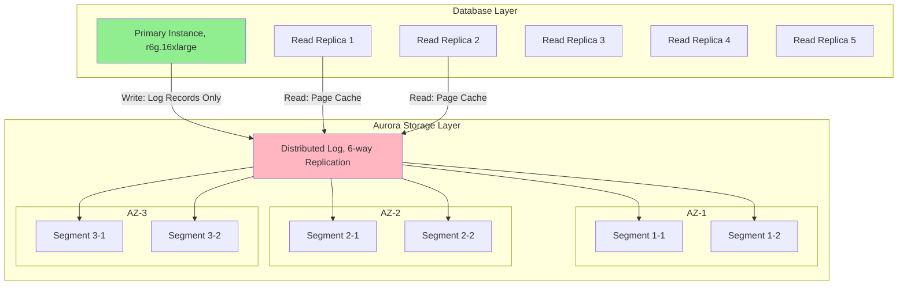
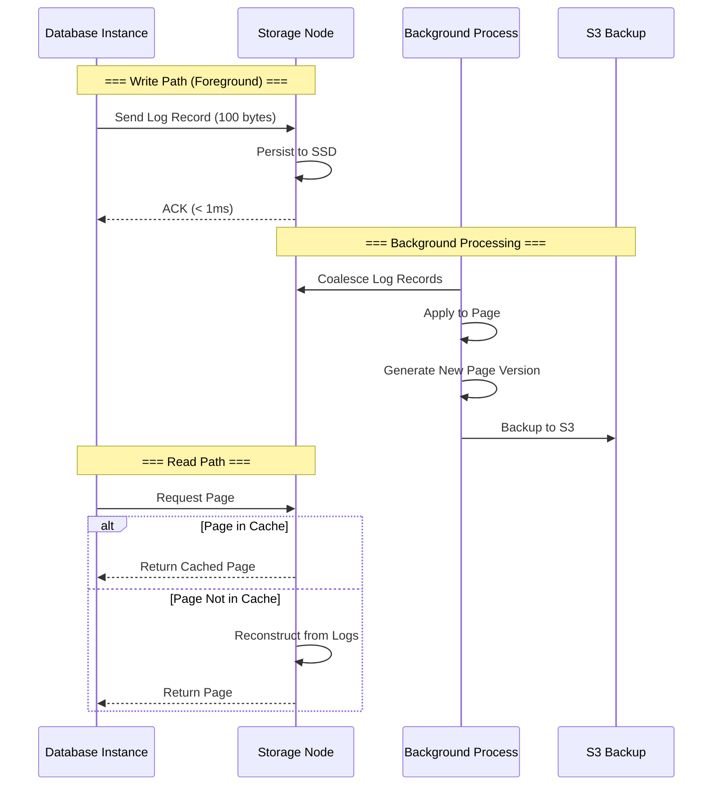
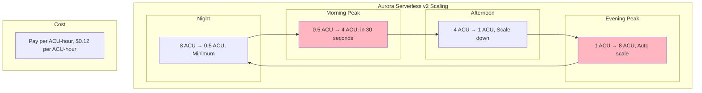
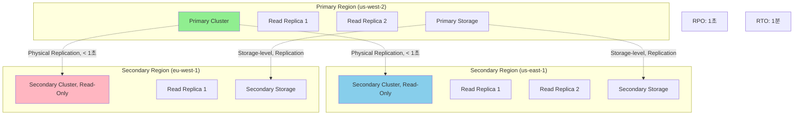

---
tags:
  - AWS
  - Aurora
  - Database
  - MySQL
  - PostgreSQL
---

# Aurora의 클라우드 네이티브 혁신: Log-as-Database의 마법

## 🎯 Netflix의 스트리밍 메타데이터 혁명

### 2020년 글로벌 팬데믹 스트리밍 폭증

```text
📅 2020년 3월, 전 세계 락다운
📺 동시 스트리밍: 2억 세션
🎬 콘텐츠 메타데이터: 100TB
🔍 초당 검색 쿼리: 500만
⚡ 요구 레이턴시: < 100ms
```

Netflix의 데이터베이스 팀은 전례 없는 도전에 직면했습니다. 기존 RDS MySQL은 한계를 보였죠:

- **복제 지연**: 읽기 복제본 5초 지연
- **스토리지 한계**: 64TB 제한 임박
- **백업 시간**: 일일 백업 6시간
- **페일오버**: 30초 이상

**"전통적인 데이터베이스 아키텍처로는 불가능하다. 클라우드 네이티브가 필요하다!"**

## 🚀 Aurora 아키텍처: 스토리지와 컴퓨팅 분리

### Log-Structured Storage의 혁신



### Quorum 기반 분산 스토리지

```python
class AuroraStorageQuorum:
    def __init__(self):
        self.replicas = 6  # 6개 복제본
        self.write_quorum = 4  # 4/6 쓰기
        self.read_quorum = 3   # 3/6 읽기
        
    def write_operation(self, log_record):
        """
        Aurora의 쿼럼 기반 쓰기
        """
        # 1. Log record만 전송 (페이지 전체 X)
        log_lsn = self.generate_lsn()
        
        # 2. 6개 스토리지 노드에 병렬 전송
        write_futures = []
        for node in self.storage_nodes[:6]:
            future = self.async_write(node, log_record, log_lsn)
            write_futures.append(future)
        
        # 3. 4개 노드 ACK 대기 (Quorum)
        acks = 0
        for future in write_futures:
            try:
                if future.get(timeout_ms=10):
                    acks += 1
                    if acks >= self.write_quorum:
                        # 4/6 달성 시 즉시 커밋
                        return {"status": "COMMITTED", "lsn": log_lsn}
            except TimeoutError:
                continue
        
        # 쿼럼 실패
        if acks < self.write_quorum:
            raise QuorumNotMetException()
```

### 스토리지 노드의 백그라운드 처리



## 🎭 Aurora의 혁신적 기능들

### Fast Cloning: Copy-on-Write

```python
class AuroraFastClone:
    def __init__(self):
        self.clone_time = "초 단위"
        self.storage_overhead = "0% (초기)"
        
    def create_clone(self, source_cluster):
        """
        Aurora Fast Clone 생성
        """
        # 1. 메타데이터만 복사 (초 단위)
        clone_metadata = {
            "source_cluster": source_cluster,
            "clone_time": datetime.now(),
            "storage_pointers": self.copy_storage_pointers(source_cluster)
        }
        
        # 2. Copy-on-Write 설정
        cow_config = {
            "shared_pages": True,  # 초기에는 모든 페이지 공유
            "divergence_tracking": True,
            "space_efficiency": "변경된 페이지만 새로 저장"
        }
        
        # 3. 클론 활성화
        clone_cluster = self.activate_clone(clone_metadata, cow_config)
        
        return {
            "clone_id": clone_cluster.id,
            "creation_time": "5초",
            "initial_storage_cost": "$0",
            "use_cases": [
                "개발/테스트 환경",
                "분석 워크로드 격리",
                "A/B 테스팅",
                "재해 복구 테스트"
            ]
        }
```

### Backtrack: 시간 여행

```python
class AuroraBacktrack:
    def __init__(self):
        self.backtrack_window = 72  # 최대 72시간
        
    def backtrack_database(self, target_time):
        """
        데이터베이스를 과거 시점으로 되돌리기
        """
        # 1. 되돌릴 시점 검증
        if not self.is_within_window(target_time):
            raise BacktrackWindowExceededException()
        
        # 2. 타겟 LSN 찾기
        target_lsn = self.find_lsn_at_time(target_time)
        
        # 3. 되돌리기 실행 (데이터 복사 없음!)
        backtrack_process = {
            "current_lsn": self.current_lsn,
            "target_lsn": target_lsn,
            "method": "Rewind log pointer",
            "downtime": "수 초",
            "data_movement": "없음"
        }
        
        # 4. 인스턴스 재시작
        self.restart_instances()
        
        return {
            "backtrack_time": "10초",
            "vs_pitr": "PITR은 새 클러스터 생성 필요 (30분)",
            "use_cases": [
                "실수로 삭제한 데이터 복구",
                "잘못된 배포 롤백",
                "특정 시점 데이터 분석"
            ]
        }
```

## 🚀 Aurora Serverless v2: 자동 스케일링

### 세밀한 용량 조정



```python
class AuroraServerlessV2:
    def __init__(self):
        self.acu_config = {
            "min_capacity": 0.5,  # ACU
            "max_capacity": 128,   # ACU
            "1_acu": {
                "memory": "2 GB",
                "cpu": "~2 vCPUs",
                "network": "~4.5 Gbps"
            }
        }
    
    def auto_scaling_logic(self, metrics):
        """
        Serverless v2 자동 스케일링 로직
        """
        current_acu = self.current_capacity
        
        # CPU, 메모리, 네트워크 기반 스케일링
        scale_factors = {
            "cpu_utilization": metrics["cpu"] / 70,  # 70% 타겟
            "memory_utilization": metrics["memory"] / 75,
            "connection_count": metrics["connections"] / 100,
            "query_latency": metrics["p99_latency"] / 100  # 100ms 타겟
        }
        
        # 가장 높은 factor 기준 스케일링
        required_acu = current_acu * max(scale_factors.values())
        
        # 0.5 ACU 단위로 조정
        new_acu = round(required_acu * 2) / 2
        new_acu = max(self.acu_config["min_capacity"], 
                     min(new_acu, self.acu_config["max_capacity"]))
        
        # 스케일링 실행
        if new_acu != current_acu:
            self.scale_to(new_acu)
            
        return {
            "previous": current_acu,
            "new": new_acu,
            "scale_time": "< 15 seconds",
            "no_disruption": True
        }
```

## 🔐 Aurora Global Database

### Cross-Region 재해 복구



### Global Database 페일오버

```python
class AuroraGlobalDatabase:
    def __init__(self):
        self.regions = {
            "primary": "us-west-2",
            "secondaries": ["us-east-1", "eu-west-1"]
        }
        
    def planned_failover(self, new_primary_region):
        """
        계획된 페일오버 (0 데이터 손실)
        """
        steps = [
            # 1. 쓰기 중지
            self.stop_writes(),
            
            # 2. 복제 동기화 대기
            self.wait_for_replication_sync(),
            
            # 3. 새 Primary 승격
            self.promote_secondary(new_primary_region),
            
            # 4. DNS 업데이트
            self.update_dns_cname(new_primary_region),
            
            # 5. 이전 Primary를 Secondary로
            self.demote_to_secondary(self.regions["primary"])
        ]
        
        return {
            "data_loss": "0 bytes",
            "downtime": "< 1분",
            "automatic_backtrack": True
        }
    
    def unplanned_failover(self):
        """
        비계획 페일오버 (재해 상황)
        """
        # 자동 감지 및 페일오버
        return {
            "detection_time": "30초",
            "failover_time": "30초",
            "total_rto": "1분",
            "potential_data_loss": "< 1초 (RPO)"
        }
```

## 💰 비용 최적화 전략

### Netflix의 Aurora 최적화

```python
class AuroraCostOptimization:
    def __init__(self):
        self.netflix_setup = {
            "before": {
                "solution": "RDS MySQL Multi-AZ",
                "instances": "db.r5.24xlarge x 10",
                "storage": "100TB Provisioned IOPS",
                "monthly_cost": 150000
            },
            "after": {
                "solution": "Aurora MySQL",
                "instances": "db.r6g.16xlarge x 5",
                "storage": "Pay-per-use (100TB)",
                "monthly_cost": 75000
            }
        }
    
    def optimization_strategies(self):
        return {
            "1_serverless_for_dev": {
                "env": "Development/Test",
                "config": "Serverless v2 (0.5-2 ACU)",
                "savings": "90% vs always-on"
            },
            
            "2_reserved_instances": {
                "production": "3-year reserved",
                "savings": "50% discount"
            },
            
            "3_io_optimized": {
                "high_io_workloads": "Aurora I/O-Optimized",
                "benefit": "No I/O charges",
                "break_even": "> 25% I/O cost"
            },
            
            "4_cross_region_replicas": {
                "strategy": "Read locally, write globally",
                "latency_reduction": "100ms → 10ms",
                "cost": "Only storage + compute"
            }
        }
```

## 🎨 Aurora Machine Learning

### 내장 ML 통합

```python
def aurora_ml_integration():
    """
    Aurora와 SageMaker/Comprehend 통합
    """
    ml_queries = {
        "sentiment_analysis": """
            SELECT 
                review_id,
                review_text,
                aws_comprehend_detect_sentiment(
                    review_text, 'en'
                ) as sentiment
            FROM product_reviews
            WHERE created_date = CURDATE();
        """,
        
        "fraud_detection": """
            SELECT 
                transaction_id,
                amount,
                aws_sagemaker_invoke_endpoint(
                    'fraud-detector-endpoint',
                    CONCAT(user_id, ',', amount, ',', merchant)
                ) as fraud_score
            FROM transactions
            WHERE fraud_score > 0.8;
        """,
        
        "batch_inference": """
            CREATE TABLE product_recommendations AS
            SELECT 
                user_id,
                aws_sagemaker_invoke_endpoint(
                    'recommendation-model',
                    user_features
                ) as recommended_products
            FROM user_profiles;
        """
    }
    
    return {
        "benefits": [
            "SQL에서 직접 ML 호출",
            "데이터 이동 없음",
            "실시간 추론",
            "배치 처리 지원"
        ],
        "use_cases": [
            "감성 분석",
            "사기 탐지",
            "추천 시스템",
            "이상 탐지"
        ]
    }
```

## 🚨 실전 트러블슈팅

### Case 1: Reader Endpoint 부하 불균형

```python
def troubleshoot_reader_imbalance():
    """
    읽기 복제본 부하 불균형 해결
    """
    problem = {
        "symptom": "특정 읽기 복제본만 높은 CPU",
        "cause": "DNS 캐싱으로 인한 고정 연결"
    }
    
    solutions = {
        "1_custom_endpoints": {
            "config": """
                # 커스텀 엔드포인트 생성
                - analytics-endpoint: r6g.16xlarge 인스턴스만
                - app-endpoint: r6g.4xlarge 인스턴스만
            """,
            "benefit": "워크로드별 분리"
        },
        
        "2_connection_pool": {
            "ttl": "60초",
            "max_idle": "30초",
            "effect": "주기적 재연결로 부하 분산"
        },
        
        "3_smart_driver": {
            "driver": "AWS JDBC Driver",
            "feature": "Reader endpoint load balancing",
            "config": "aurora-load-balanced=true"
        }
    }
    
    return solutions
```

### Case 2: Storage 사용량 급증

```python
class StorageTroubleshooting:
    def diagnose_storage_growth(self):
        """
        비정상적인 스토리지 증가 진단
        """
        queries = {
            "check_table_sizes": """
                SELECT 
                    table_schema,
                    table_name,
                    ROUND(data_length/1024/1024/1024, 2) as data_gb,
                    ROUND(index_length/1024/1024/1024, 2) as index_gb
                FROM information_schema.tables
                ORDER BY data_length DESC
                LIMIT 10;
            """,
            
            "check_history_list": """
                -- Long-running transactions
                SHOW ENGINE INNODB STATUS;
                -- History list length 확인
            """,
            
            "check_binlog": """
                SHOW BINARY LOGS;
                -- Binlog 크기 확인
            """
        }
        
        solutions = {
            "large_tables": "파티셔닝 또는 아카이빙",
            "history_list": "장기 실행 트랜잭션 종료",
            "binlog": "binlog_expire_logs_seconds 조정",
            "temp_tables": "임시 테이블 정리"
        }
        
        return solutions
```

### Case 3: 쿼리 성능 저하

```python
def optimize_query_performance():
    """
    Aurora 쿼리 최적화
    """
    optimization_steps = {
        "1_enable_performance_insights": {
            "retention": "7 days (free)",
            "metrics": ["top SQL", "wait events", "DB load"]
        },
        
        "2_parallel_query": {
            "enable": "aurora_parallel_query = ON",
            "benefit": "대용량 스캔 16x 빠름",
            "use_case": "분석 쿼리"
        },
        
        "3_hash_joins": {
            "version": "Aurora MySQL 8.0+",
            "config": "optimizer_switch='hash_join=on'",
            "improvement": "조인 성능 10x"
        },
        
        "4_fast_ddl": {
            "operation": "ALTER TABLE ADD COLUMN",
            "time": "즉시 (메타데이터만 변경)",
            "vs_standard": "표준 MySQL은 전체 테이블 재작성"
        }
    }
    
    return optimization_steps
```

## 🎯 Aurora vs RDS vs DynamoDB 선택 가이드

```python
def choose_database():
    """
    AWS 데이터베이스 선택 가이드
    """
    decision_matrix = {
        "Aurora": {
            "best_for": [
                "복잡한 쿼리와 조인",
                "ACID 트랜잭션",
                "MySQL/PostgreSQL 호환성",
                "자동 스케일링 필요"
            ],
            "capacity": "128TB",
            "replicas": "15개",
            "failover": "30초"
        },
        
        "RDS": {
            "best_for": [
                "예측 가능한 워크로드",
                "특정 DB 엔진 필요 (Oracle, SQL Server)",
                "낮은 비용",
                "간단한 설정"
            ],
            "capacity": "64TB",
            "replicas": "5개",
            "failover": "60-120초"
        },
        
        "DynamoDB": {
            "best_for": [
                "Key-Value 액세스 패턴",
                "무한 확장",
                "글로벌 분산",
                "서버리스"
            ],
            "capacity": "무제한",
            "replicas": "글로벌",
            "failover": "자동"
        }
    }
    
    return decision_matrix
```

## 🎬 마무리: Netflix의 Aurora 성공

2024년 현재, Netflix는 Aurora로:

- **확장성**: 100TB → 500TB 자동 확장
- **성능**: 5x 처리량 증가
- **가용성**: 99.99% → 99.999%
- **비용**: 50% 절감
- **운영**: 백업/복구 자동화로 80% 시간 절약

**"Aurora는 우리가 진정한 클라우드 네이티브 데이터베이스를 경험하게 해주었다."**

다음 문서에서는 [ElastiCache의 인메모리 캐싱 전략](04-elasticache.md)을 탐험해보겠습니다!
