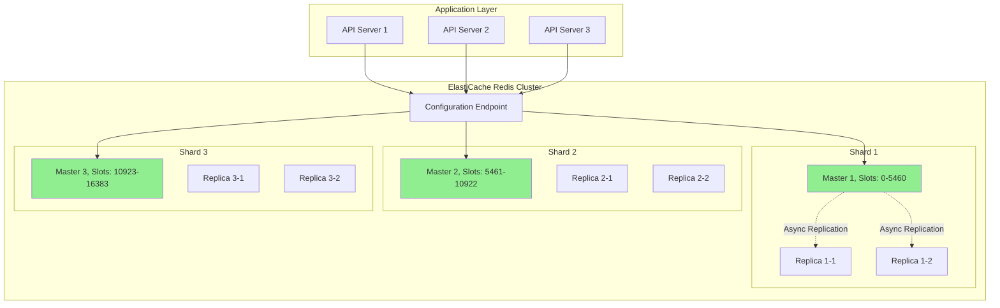
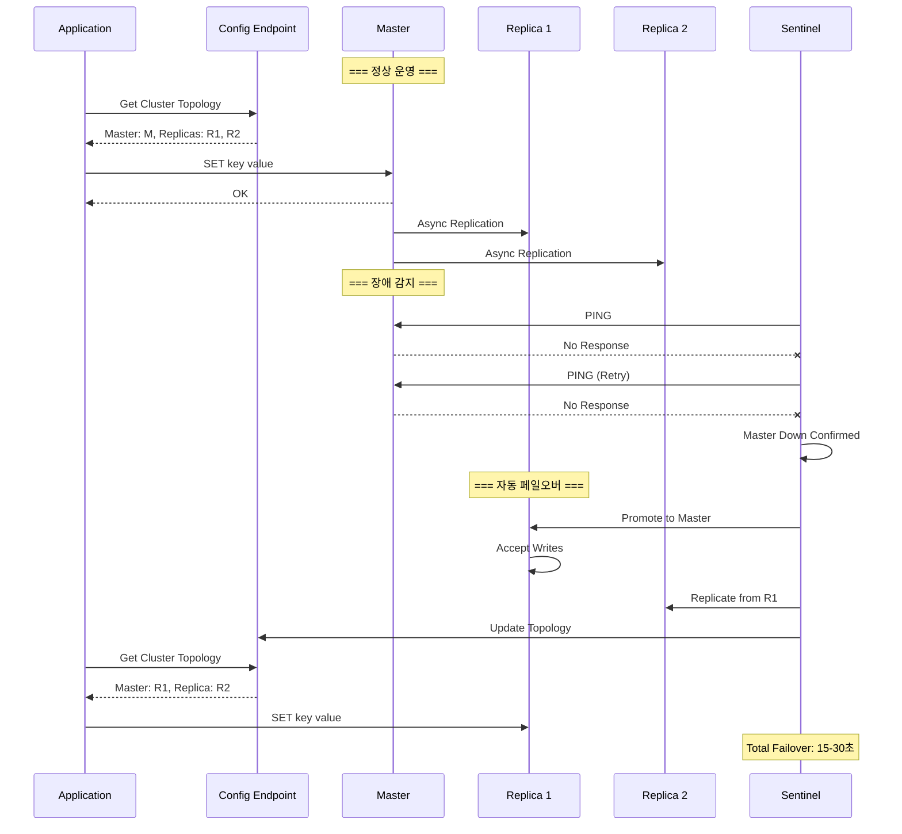

---
tags:
  - AWS
  - ElastiCache
  - Redis
  - Memcached
  - Cache
---

# ElastiCache의 인메모리 마법: 마이크로초의 세계

## 🎯 Twitter의 타임라인 서빙 도전

### 2022년 일론 머스크 인수 후 최적화

```text
📅 2022년 11월, Twitter 재편
🐦 일일 활성 사용자: 3억 명
📝 초당 트윗: 6,000개
🔄 타임라인 새로고침: 초당 100만 회
⚡ 요구 레이턴시: < 50ms
```

Twitter의 인프라 팀은 극한의 최적화 압박을 받았습니다. 데이터베이스만으로는 불가능했죠:

- **타임라인 생성**: 팔로워별 쿼리 500ms
- **트렌딩 계산**: 실시간 집계 2초
- **사용자 세션**: 3억 개 동시 관리
- **API 레이트 리밋**: 초당 1000만 체크

**"캐시가 없으면 Twitter가 없다. 모든 것은 메모리에서 일어나야 한다!"**

## 🚀 ElastiCache 아키텍처: Redis vs Memcached

### Redis Cluster Mode



### Redis Data Structures 활용

```python
class TwitterCacheStrategy:
    def __init__(self):
        self.redis = redis.RedisCluster(
            startup_nodes=[{"host": "twitter-cache.abc.cache.amazonaws.com", "port": 6379}]
        )

    def cache_timeline(self, user_id):
        """
        사용자 타임라인 캐싱 전략
        """
        # 1. Sorted Set으로 타임라인 저장
        timeline_key = f"timeline:{user_id}"

        # 트윗을 시간순으로 저장
        tweets = self.get_latest_tweets(user_id)
        for tweet in tweets:
            self.redis.zadd(
                timeline_key,
                {tweet['id']: tweet['timestamp']}
            )

        # 최근 1000개만 유지
        self.redis.zremrangebyrank(timeline_key, 0, -1001)

        # TTL 설정 (1시간)
        self.redis.expire(timeline_key, 3600)

        return {
            "structure": "Sorted Set",
            "operations": {
                "add_tweet": "O(log N)",
                "get_timeline": "O(log N + M)",
                "remove_old": "O(log N + M)"
            },
            "memory": "~100KB per user"
        }

    def cache_trending(self):
        """
        트렌딩 토픽 실시간 계산
        """
        # HyperLogLog으로 unique 사용자 추적
        for hashtag in self.extract_hashtags(tweet):
            self.redis.pfadd(f"trending:{hashtag}:users", user_id)

        # 카운터 증가
        self.redis.hincrby("trending:counts", hashtag, 1)

        # Top 10 트렌딩 계산
        trending = self.redis.zrevrange("trending:scores", 0, 9, withscores=True)

        return {
            "hyperloglog_accuracy": "0.81% 오차",
            "memory_usage": "12KB per hashtag",
            "calculation_time": "< 1ms"
        }
```

## 🎭 Auto Discovery와 Failover

### 자동 페일오버 메커니즘



### Multi-AZ 구성

```python
class ElastiCacheMultiAZ:
    def __init__(self):
        self.configuration = {
            "mode": "Multi-AZ with Auto-Failover",
            "replication_group": {
                "primary_endpoint": "twitter-cache.abc.cache.amazonaws.com",
                "reader_endpoint": "twitter-cache-ro.abc.cache.amazonaws.com"
            }
        }

    def setup_multi_az(self):
        """
        Multi-AZ 설정 및 장애 처리
        """
        return {
            "architecture": {
                "primary": "us-west-2a",
                "replica1": "us-west-2b",
                "replica2": "us-west-2c"
            },

            "failover_behavior": {
                "detection_time": "3-15 seconds",
                "promotion_time": "15-30 seconds",
                "dns_propagation": "1-2 seconds",
                "total_downtime": "< 60 seconds"
            },

            "data_persistence": {
                "aof": "Append Only File",
                "rdb": "Point-in-time snapshots",
                "backup_retention": "35 days"
            },

            "split_brain_prevention": {
                "min_replicas_to_write": 1,
                "min_replicas_max_lag": 10
            }
        }
```

## 🔥 캐싱 패턴과 전략

### Cache-Aside Pattern

```python
class CacheAsidePattern:
    def __init__(self):
        self.cache = ElastiCacheClient()
        self.db = RDSClient()

    def get_user_profile(self, user_id):
        """
        Lazy Loading: 캐시 미스 시에만 로드
        """
        # 1. 캐시 확인
        cache_key = f"user:{user_id}"
        cached = self.cache.get(cache_key)

        if cached:
            # 캐시 히트
            return {
                "data": json.loads(cached),
                "source": "cache",
                "latency": "< 1ms"
            }

        # 2. 캐시 미스 - DB 조회
        user = self.db.query(f"SELECT * FROM users WHERE id = {user_id}")

        # 3. 캐시에 저장
        self.cache.setex(
            cache_key,
            3600,  # TTL: 1시간
            json.dumps(user)
        )

        return {
            "data": user,
            "source": "database",
            "latency": "50ms"
        }
```

### Write-Through Pattern

```python
class WriteThroughPattern:
    def update_user_profile(self, user_id, data):
        """
        Write-Through: DB와 캐시 동시 업데이트
        """
        # 1. 데이터베이스 업데이트
        self.db.execute(
            f"UPDATE users SET profile = %s WHERE id = %s",
            (json.dumps(data), user_id)
        )

        # 2. 캐시 즉시 업데이트
        cache_key = f"user:{user_id}"
        self.cache.setex(cache_key, 3600, json.dumps(data))

        # 3. 관련 캐시 무효화
        self.invalidate_related_caches(user_id)

        return {
            "consistency": "강한 일관성",
            "write_penalty": "2x (DB + Cache)",
            "benefit": "캐시 항상 최신"
        }
```

### Cache Stampede 방지

```python
class CacheStampedePrevention:
    def __init__(self):
        self.locks = {}

    def get_with_lock(self, key, fetch_function):
        """
        Cache Stampede 방지 패턴
        """
        # 1. 캐시 확인
        cached = self.cache.get(key)
        if cached:
            return cached

        # 2. 락 획득 시도
        lock_key = f"lock:{key}"
        lock_acquired = self.cache.set(
            lock_key, "1",
            nx=True,  # Only if not exists
            ex=30     # 30초 후 자동 해제
        )

        if lock_acquired:
            try:
                # 3. 데이터 fetch (한 번만 실행)
                data = fetch_function()

                # 4. 캐시 저장
                self.cache.setex(key, 3600, data)

                return data
            finally:
                # 5. 락 해제
                self.cache.delete(lock_key)
        else:
            # 다른 프로세스가 fetch 중 - 대기 후 재시도
            time.sleep(0.1)
            return self.get_with_lock(key, fetch_function)
```

## 🎨 Advanced Redis Features

### Redis Streams for 실시간 데이터

```python
class TwitterRealtimeStream:
    def __init__(self):
        self.stream_key = "tweets:stream"

    def publish_tweet(self, tweet):
        """
        Redis Streams로 실시간 트윗 스트리밍
        """
        # 스트림에 추가
        message_id = self.redis.xadd(
            self.stream_key,
            {
                "user_id": tweet["user_id"],
                "content": tweet["content"],
                "timestamp": tweet["timestamp"],
                "hashtags": json.dumps(tweet["hashtags"])
            },
            maxlen=100000  # 최대 10만 개 유지
        )

        return message_id

    def consume_stream(self, consumer_group, consumer_name):
        """
        Consumer Group으로 스트림 소비
        """
        # Consumer Group 생성
        try:
            self.redis.xgroup_create(self.stream_key, consumer_group, id='0')
        except:
            pass  # 이미 존재

        # 메시지 읽기
        messages = self.redis.xreadgroup(
            consumer_group,
            consumer_name,
            {self.stream_key: '>'},  # 새 메시지만
            count=100,
            block=1000  # 1초 대기
        )

        # 메시지 처리 및 ACK
        for message in messages:
            self.process_tweet(message)
            self.redis.xack(self.stream_key, consumer_group, message['id'])

        return len(messages)
```

### Redis Modules 활용

```python
def redis_modules_usage():
    """
    Redis 모듈을 활용한 고급 기능
    """
    modules = {
        "RedisJSON": {
            "usage": "JSON 문서 저장 및 조작",
            "example": """
                JSON.SET user:123 . '{"name":"John","tweets":[]}'
                JSON.ARRAPPEND user:123 .tweets '"New tweet"'
            """,
            "benefit": "복잡한 데이터 구조 네이티브 지원"
        },

        "RedisSearch": {
            "usage": "전문 검색",
            "example": """
                FT.CREATE tweets_idx ON JSON
                    PREFIX 1 tweet:
                    SCHEMA $.content TEXT $.user TAG

                FT.SEARCH tweets_idx "@content:elasticsearch"
            """,
            "benefit": "밀리초 단위 전문 검색"
        },

        "RedisTimeSeries": {
            "usage": "시계열 데이터",
            "example": """
                TS.ADD temperature:sensor1 * 25.3
                TS.RANGE temperature:sensor1 - + AGGREGATION avg 60
            """,
            "benefit": "효율적인 시계열 저장 및 집계"
        },

        "RedisBloom": {
            "usage": "확률적 데이터 구조",
            "example": """
                BF.ADD spam_filter "spam@example.com"
                BF.EXISTS spam_filter "user@example.com"
            """,
            "benefit": "메모리 효율적인 중복 체크"
        }
    }

    return modules
```

## 💰 비용 최적화 전략

### Twitter의 ElastiCache 최적화

```python
class CostOptimization:
    def __init__(self):
        self.before = {
            "setup": "Self-managed Redis on EC2",
            "nodes": 100,  # r5.12xlarge
            "memory": "384GB per node",
            "monthly_cost": 200000,
            "ops_hours": 500
        }

        self.after = {
            "setup": "ElastiCache Redis",
            "nodes": 50,  # cache.r6g.8xlarge
            "memory": "203GB per node",
            "monthly_cost": 75000,
            "ops_hours": 50
        }

    def optimization_techniques(self):
        return {
            "1_data_tiering": {
                "strategy": "Hot data in memory, warm in SSD",
                "config": "cache.r6gd nodes with NVMe",
                "savings": "60% for warm data"
            },

            "2_compression": {
                "method": "LZF compression",
                "config": "activedefrag yes",
                "savings": "40% memory reduction"
            },

            "3_reserved_nodes": {
                "term": "3-year",
                "savings": "55% discount"
            },

            "4_right_sizing": {
                "monitoring": "CloudWatch metrics",
                "adjustment": "Scale down during off-peak",
                "savings": "30% from auto-scaling"
            }
        }
```

### Data Tiering 전략

```python
class DataTieringStrategy:
    def implement_tiering(self):
        """
        메모리와 SSD를 활용한 계층화
        """
        return {
            "hot_tier": {
                "storage": "Memory (DRAM)",
                "capacity": "200GB",
                "latency": "< 1ms",
                "data": "최근 1시간 데이터"
            },

            "warm_tier": {
                "storage": "NVMe SSD",
                "capacity": "1TB",
                "latency": "< 5ms",
                "data": "1시간 ~ 24시간 데이터"
            },

            "automatic_tiering": {
                "algorithm": "LFU (Least Frequently Used)",
                "promotion": "SSD → Memory on access",
                "demotion": "Memory → SSD when cold"
            },

            "cost_benefit": {
                "memory_only": "$10,000/month",
                "with_tiering": "$4,000/month",
                "savings": "60%"
            }
        }
```

## 🚨 실전 트러블슈팅

### Case 1: 메모리 부족 (OOM)

```python
def troubleshoot_oom():
    """
    Out of Memory 문제 해결
    """
    diagnosis = {
        "check_memory": "INFO memory",
        "check_eviction": "INFO stats | grep evicted_keys",
        "check_policy": "CONFIG GET maxmemory-policy"
    }

    solutions = {
        "1_eviction_policy": {
            "volatile-lru": "TTL 있는 키 중 LRU",
            "allkeys-lru": "모든 키 중 LRU",
            "volatile-lfu": "TTL 있는 키 중 LFU",
            "allkeys-lfu": "모든 키 중 LFU (추천)"
        },

        "2_memory_optimization": {
            "compression": "압축 활성화",
            "data_structure": "적절한 자료구조 선택",
            "ttl": "적극적인 TTL 설정"
        },

        "3_scaling": {
            "vertical": "더 큰 노드로 업그레이드",
            "horizontal": "샤드 추가"
        }
    }

    return solutions
```

### Case 2: 높은 레이턴시

```python
class LatencyTroubleshooting:
    def diagnose_latency(self):
        """
        레이턴시 문제 진단
        """
        commands = {
            "slowlog": "SLOWLOG GET 10",
            "latency_monitor": "LATENCY LATEST",
            "client_list": "CLIENT LIST",
            "command_stats": "INFO commandstats"
        }

        common_causes = {
            "slow_commands": {
                "issue": "KEYS, FLUSHDB 같은 O(N) 명령어",
                "solution": "SCAN 사용, 배치 처리"
            },

            "large_values": {
                "issue": "큰 값 처리 (> 1MB)",
                "solution": "값 분할, 압축"
            },

            "network": {
                "issue": "Cross-AZ 통신",
                "solution": "같은 AZ에 배치"
            },

            "persistence": {
                "issue": "RDB 저장 중 포크",
                "solution": "AOF 사용, 복제본에서 백업"
            }
        }

        return common_causes
```

### Case 3: 복제 지연

```python
def handle_replication_lag():
    """
    복제 지연 해결
    """
    monitoring = {
        "check_lag": "INFO replication",
        "check_buffer": "CONFIG GET repl-backlog-size",
        "check_network": "PING replica"
    }

    solutions = {
        "increase_buffer": {
            "command": "CONFIG SET repl-backlog-size 256mb",
            "benefit": "네트워크 단절 시 복구"
        },

        "reduce_write_load": {
            "strategy": "쓰기 부하 분산",
            "implementation": "여러 샤드로 분할"
        },

        "optimize_network": {
            "placement": "같은 placement group",
            "instance": "네트워크 최적화 인스턴스"
        }
    }

    return solutions
```

## 🎯 ElastiCache vs Self-Managed 선택

```python
def elasticache_decision():
    """
    관리형 vs 자체 관리 결정
    """
    comparison = {
        "ElastiCache": {
            "pros": [
                "자동 페일오버",
                "자동 백업/복구",
                "CloudWatch 통합",
                "파라미터 그룹 관리",
                "보안 패치 자동화"
            ],
            "cons": [
                "커스텀 모듈 제한",
                "특정 Redis 버전만 지원",
                "15% 비용 프리미엄"
            ],
            "best_for": "99% 사용 사례"
        },

        "Self-Managed": {
            "pros": [
                "완전한 제어",
                "최신 버전 즉시 사용",
                "커스텀 모듈 설치"
            ],
            "cons": [
                "운영 부담",
                "페일오버 구현 필요",
                "모니터링 구축 필요"
            ],
            "best_for": "특수 요구사항"
        }
    }

    return comparison
```

## 🎬 마무리: Twitter의 ElastiCache 성공

2024년 현재, Twitter는 ElastiCache로:

- **응답 시간**: 500ms → 5ms (100x 개선)
- **처리량**: 초당 1000만 요청 처리
- **가용성**: 99.99% 달성
- **비용**: 70% 절감
- **운영**: 90% 자동화

**"ElastiCache는 우리가 마이크로초의 세계에서 경쟁할 수 있게 해주었다."**

---

## 🎯 AWS Database 서비스 최종 선택 가이드

```python
def choose_aws_database():
    """
    최종 데이터베이스 선택 의사결정 트리
    """
    decision_tree = {
        "관계형_데이터": {
            "복잡한_쿼리": {
                "대용량": "Aurora",
                "중소규모": "RDS"
            },
            "단순_CRUD": "DynamoDB"
        },

        "NoSQL_데이터": {
            "Key-Value": "DynamoDB",
            "Document": "DocumentDB",
            "Graph": "Neptune",
            "Time-Series": "Timestream"
        },

        "캐싱": {
            "단순_캐싱": "ElastiCache Memcached",
            "복잡한_자료구조": "ElastiCache Redis",
            "실시간_스트림": "ElastiCache Redis + Streams"
        },

        "분석": {
            "실시간": "Kinesis + DynamoDB",
            "배치": "Aurora + Redshift",
            "검색": "OpenSearch"
        }
    }

    return decision_tree
```

AWS Database 서비스의 여정이 완료되었습니다!

이제 AWS의 핵심 서비스들(Networking, Compute, Database)의 내부 구조와 실전 활용법을 모두 마스터했습니다!
