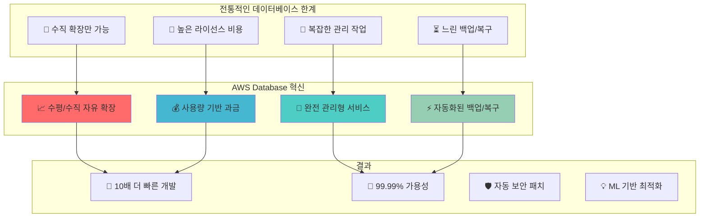

---
tags:
  - AWS
  - Database
  - RDS
  - DynamoDB
  - Aurora
  - ElastiCache
---

# AWS Database - 데이터베이스의 클라우드 혁명 🗃️

## 이 섹션을 읽으면 답할 수 있는 질문들

- Shopify는 어떻게 Black Friday에 초당 80만 주문을 RDS로 처리하는가?
- DynamoDB는 어떻게 Netflix의 수억 사용자 데이터를 1ms 응답시간으로 서빙하는가?
- Aurora는 MySQL과 무엇이 다르고 어떻게 5배 빠른 성능을 달성하는가?
- Twitter는 어떻게 ElastiCache로 타임라인을 실시간으로 제공하는가?
- NoSQL vs RDBMS, 언제 어떤 것을 선택해야 할까?

## 시작하며: 데이터베이스의 패러다임 시프트

AWS가 데이터베이스 세계에 가져온 혁신을 살펴보겠습니다:



## AWS Database 서비스 완벽 가이드 📚

### [1. RDS: 관계형 데이터베이스의 재탄생](01-rds.md)

**Shopify Black Friday 80만 TPS의 비밀**

Shopify가 어떻게 RDS를 활용해 Black Friday 최대 트래픽을 안정적으로 처리하는지, Multi-AZ 배포부터 성능 최적화까지 관계형 데이터베이스의 모든 것을 탐험합니다.

🏪 **핵심 내용**:

- Multi-AZ vs Read Replica 전략
- RDS Proxy 연결 풀링 최적화
- Performance Insights 성능 분석
- Shopify 초대규모 트랜잭션 처리

---

### [2. DynamoDB: NoSQL의 완벽한 구현](02-dynamodb.md)

**Lyft 실시간 라이딩 데이터의 마법**

Lyft가 어떻게 DynamoDB를 활용해 실시간으로 수백만 라이딩 요청을 처리하는지, Consistent Hashing부터 Global Tables까지 NoSQL의 핵심을 완벽 분석합니다.

🚗 **핵심 내용**:

- Partition Key와 Sort Key 설계
- GSI (Global Secondary Index) 활용
- DynamoDB Streams와 실시간 처리
- Lyft 실시간 위치 추적 시스템

---

### [3. Aurora: 클라우드 네이티브 DB의 혁신](03-aurora.md)

**Netflix 메타데이터 관리의 비밀 무기**

Netflix가 어떻게 Aurora를 활용해 글로벌 콘텐츠 메타데이터를 관리하는지, 분산 로그 구조부터 자동 복구까지 차세대 데이터베이스를 심층 분석합니다.

🎬 **핵심 내용**:

- 분산 로그 구조 스토리지
- Quorum 기반 복제 메커니즘
- Aurora Backtrack 시간여행 기능
- Netflix 글로벌 메타데이터 아키텍처

---

### [4. ElastiCache: 인메모리 데이터의 힘](04-elasticache.md)

**Twitter 타임라인 실시간 제공의 비법**

Twitter가 어떻게 ElastiCache를 활용해 수억 사용자의 타임라인을 실시간으로 제공하는지, Redis Cluster부터 캐싱 전략까지 인메모리 데이터베이스를 마스터합니다.

🐦 **핵심 내용**:

- Redis Cluster Mode와 샤딩
- 캐시 전략 (Cache-Aside, Write-Through)
- Memcached vs Redis 선택 기준
- Twitter 타임라인 캐싱 아키텍처

## 데이터베이스 선택 가이드 🎯

### 의사결정 트리

```python
def choose_database(requirements):
    """
    요구사항에 따른 최적 데이터베이스 선택
    """
    
    # 관계형 데이터, ACID 중요
    if (requirements.get("data_model") == "relational" and
        requirements.get("consistency") == "strong"):
        
        if requirements.get("scale") == "massive":
            return "Aurora"  # 대규모 + 관리형
        else:
            return "RDS"     # 일반적인 규모
    
    # 키-값 저장, 높은 확장성 필요
    if (requirements.get("data_model") == "key_value" and
        requirements.get("scalability") == "infinite"):
        return "DynamoDB"
    
    # 문서 기반 데이터
    if requirements.get("data_model") == "document":
        return "DocumentDB"
    
    # 그래프 데이터
    if requirements.get("data_model") == "graph":
        return "Neptune"
    
    # 시계열 데이터  
    if requirements.get("data_type") == "timeseries":
        return "Timestream"
    
    # 캐싱, 세션 스토어
    if (requirements.get("use_case") in ["caching", "session"] and
        requirements.get("latency") == "sub_millisecond"):
        return "ElastiCache"
    
    return "RDS"  # 기본값

# 실제 사용 예시
shopify_requirements = {
    "data_model": "relational",
    "consistency": "strong", 
    "scale": "massive",
    "availability": "99.99%"
}
# Result: Aurora

lyft_requirements = {
    "data_model": "key_value",
    "scalability": "infinite",
    "latency": "single_digit_ms",
    "global": True
}
# Result: DynamoDB
```

### 서비스별 특성 비교

| 특성 | RDS | Aurora | DynamoDB | ElastiCache |
|------|-----|--------|----------|-------------|
| **데이터 모델** | 관계형 | 관계형 | Key-Value | Key-Value |
| **확장성** | 수직 | 수평+수직 | 무제한 | 수평 |
| **일관성** | 강함 | 강함 | 최종적 | 강함 |
| **지연시간** | ~10ms | ~1ms | ~1ms | ~0.1ms |
| **관리 복잡도** | 중간 | 낮음 | 매우 낮음 | 낮음 |

## 성능 최적화 패턴 🚀

### 패턴 1: 읽기 성능 최적화

```python
read_optimization = {
    "rds": {
        "read_replicas": "읽기 트래픽 분산",
        "connection_pooling": "RDS Proxy 활용",
        "query_optimization": "Performance Insights"
    },
    "dynamodb": {
        "gsi_design": "쿼리 패턴별 인덱스",
        "eventually_consistent": "읽기 성능 2배 향상",
        "dax": "마이크로초 캐싱"
    },
    "elasticache": {
        "cluster_mode": "샤딩으로 확장",
        "redis_pipelining": "배치 처리",
        "optimal_expiration": "메모리 효율성"
    }
}
```

### 패턴 2: 쓰기 성능 최적화

```python
write_optimization = {
    "aurora": {
        "parallel_query": "분산 쿼리 처리",
        "fast_clone": "즉시 클론 생성",
        "serverless": "자동 용량 조정"
    },
    "dynamodb": {
        "batch_operations": "배치 쓰기로 비용 절감",
        "write_sharding": "핫 파티션 방지",
        "streams": "실시간 변경 감지"
    }
}
```

## 데이터베이스 마스터 로드맵 🗺️

### 기초 (1주)

- [ ] RDS 인스턴스 생성 및 연결
- [ ] DynamoDB 테이블 설계 기초
- [ ] ElastiCache Redis 클러스터

### 중급 (1개월)

- [ ] Multi-AZ 배포와 읽기 복제본
- [ ] DynamoDB GSI 설계 최적화
- [ ] Aurora 클러스터 관리

### 고급 (3개월)

- [ ] 데이터베이스 마이그레이션 전략
- [ ] 성능 모니터링 및 튜닝
- [ ] 재해 복구 설계

### 전문가 (6개월+)

- [ ] 글로벌 분산 데이터베이스
- [ ] 실시간 데이터 파이프라인
- [ ] AI/ML과 데이터베이스 통합

## 실전 트러블슈팅 🔧

### 문제 1: DynamoDB 핫 파티션

```python
# 문제: 특정 파티션에 트래픽 집중
hot_partition_problem = {
    "증상": "높은 레이턴시, 스로틀링 에러",
    "원인": "편향된 파티션 키 선택",
    "예시": "date를 파티션 키로 사용"
}

# 해결책: 파티션 키 개선
improved_design = {
    "기존": "partition_key = date",
    "개선": "partition_key = user_id + date",
    "효과": "트래픽이 여러 파티션으로 분산"
}

# 구현 예시
import uuid
import datetime

def generate_partition_key():
    """개선된 파티션 키 생성"""
    user_bucket = str(uuid.uuid4())[:8]  # 분산을 위한 랜덤 값
    date_suffix = datetime.date.today().strftime("%Y-%m")
    return f"{user_bucket}#{date_suffix}"
```

### 문제 2: RDS 연결 풀 고갈

```python
# 문제: 연결 수 초과로 새로운 연결 실패
connection_pool_issue = {
    "증상": "SQLSTATE[HY000]: Too many connections",
    "원인": "애플리케이션에서 연결 해제 미흡",
    "영향": "서비스 전체 다운"
}

# 해결책: RDS Proxy 도입
rds_proxy_solution = {
    "connection_pooling": "연결 재사용으로 효율성 향상",
    "failover": "평균 65% 빠른 장애 복구", 
    "security": "IAM 인증 지원",
    "serverless_friendly": "Lambda와 완벽 호환"
}
```

## 비용 최적화 전략 💰

### 리소스별 최적화 방법

```python
cost_optimization = {
    "rds": {
        "reserved_instances": "최대 75% 할인",
        "aurora_serverless": "사용량 기반 과금",
        "storage_optimization": "gp3 전환으로 20% 절감"
    },
    "dynamodb": {
        "on_demand_vs_provisioned": "트래픽 패턴에 따라",
        "table_class": "IA 클래스로 60% 절감",
        "ttl": "자동 데이터 만료"
    },
    "elasticache": {
        "reserved_nodes": "최대 75% 할인", 
        "right_sizing": "메모리 사용량 최적화",
        "data_tiering": "비용 효율적 스토리지"
    }
}
```

## 고가용성 설계 패턴 🛡️

### 재해 복구 전략

```python
disaster_recovery = {
    "rds_multi_az": {
        "rto": "1-2분",      # Recovery Time Objective
        "rpo": "< 5분",      # Recovery Point Objective
        "automatic": True,
        "cost": "2배"
    },
    "aurora_global": {
        "rto": "< 1분",
        "rpo": "< 1초",
        "regions": "최대 6개",
        "read_latency": "< 1초"
    },
    "dynamodb_global_tables": {
        "rto": "즉시",
        "rpo": "최종적 일관성",
        "regions": "무제한",
        "conflict_resolution": "last_writer_wins"
    }
}
```

## 마치며: 데이터의 가치를 극대화하라

AWS Database 서비스들은 단순한 저장소가 아닙니다. **데이터를 통해 비즈니스 가치를 창출하는 플랫폼**입니다.

> *"데이터베이스는 애플리케이션의 심장이다. 올바른 선택은 전체 시스템을 살리고, 잘못된 선택은 모든 것을 무너뜨린다."*
> — AWS Database Team

데이터베이스 마스터로의 여정을 시작해보겠습니다! 🗃️

---

**다음 읽기**: [RDS: 관계형 데이터베이스의 재탄생](01-rds.md)
