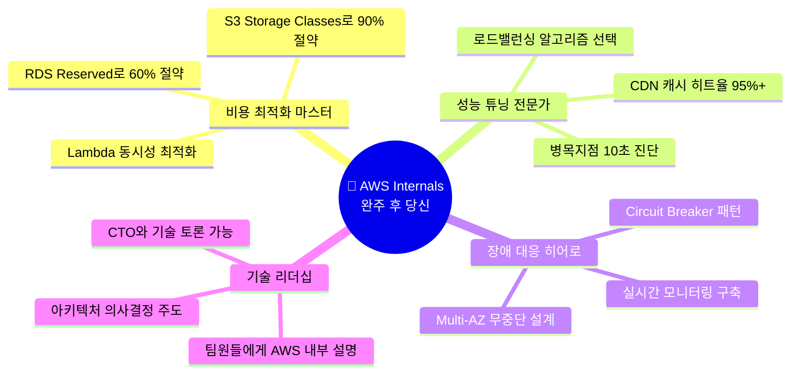

---
tags:
  - AWS
  - Cloud
  - Infrastructure
  - Architecture
---

# AWS Internals - 클라우드의 숨겨진 마법을 파헤치다 ✨

## 📈 당신의 AWS 비용이 매달 증가하는 진짜 이유

매달 AWS 청구서를 받을 때마다 이런 생각이 들지 않나요?

**"분명 같은 서비스인데 왜 비용이 계속 늘어나지?"**

답은 간단합니다. AWS 서비스들이 **어떻게 동작하는지 모르기 때문**입니다.

## 💡 2017년 S3 대장애가 보여준 진실

2017년 2월 28일, 한 AWS 엔지니어의 실수로 인터넷의 절반이 멈췄습니다:

```text
🎯 의도: "문제가 있는 서버 몇 대만 재시작하자"
💥 실수: s3api remove-servers --count=many (전체 서버 제거)
⏰ 결과: 4시간 장애, Netflix/Airbnb/Slack 모두 다운
💰 손실: 1억 5천만 달러
```

하지만 여기서 **놀라운 사실** 하나:

**🎉 단 한 바이트의 데이터도 손실되지 않았습니다!**

어떻게 이게 가능했을까요? 바로 **AWS의 내부 아키텍처** 때문입니다.

## 🔍 이 가이드가 특별한 이유

대부분의 AWS 가이드는 "어떻게 사용하는지"만 알려줍니다. 하지만 이 가이드는 다릅니다:

**📖 What**: AWS 서비스들이 정확히 어떻게 만들어졌는가
**🧠 Why**: 왜 그렇게 설계되었는가
**💰 How**: 어떻게 하면 비용을 절약하면서 성능을 극대화할 수 있는가

### 읽고 나면 이런 변화가 생깁니다

- ⚡ **"왜 갑자기 느려졌지?"** → 병목지점을 10초 만에 찾아냅니다
- 💸 **"비용이 너무 많이 나와"** → 똑같은 성능으로 50% 비용 절감
- 🚨 **"장애가 났어!"** → 장애 발생 전에 미리 예측하고 방지
- 🤝 **"팀원들과 소통이 어려워"** → AWS 내부 동작을 설명하며 기술 리더십 발휘

## 🌍 AWS: 인터넷의 보이지 않는 기반

```mermaid
graph TB
    subgraph "🏪 인터넷 상점가"
        USER["😊 당신<br/>(웹사이트/앱 사용자)"]
    end

    subgraph "🌐 AWS 글로벌 네트워크"
        subgraph "💨 콘텐츠 배송 (CDN)"
            CF["📡 CloudFront<br/>450개 엣지 로케이션<br/>전 세계 10ms 이내"]
        end

        subgraph "⚖️ 트래픽 분산"
            ELB["🎯 Load Balancer<br/>초당 1억 요청 처리<br/>Instagram이 믿는 기술"]
        end

        subgraph "💻 실제 컴퓨팅"
            EC2["⚡ EC2 Nitro<br/>400Gbps 네트워킹<br/>Netflix 4K 스트리밍"]
            LAMBDA["🚀 Lambda<br/>0ms 서버리스<br/>Duolingo 1억 사용자"]
        end

        subgraph "🗄️ 데이터 저장소"
            S3["📦 S3 Storage<br/>99.999999999% 내구성<br/>핵폭탄보다 안전한 데이터"]
            RDS["🏦 RDS Database<br/>Shopify 80만 TPS<br/>Black Friday도 끄떡없어"]
            DDB["⚡ DynamoDB<br/>Lyft 실시간 위치추적<br/>마이크로초 응답"]
        end
    end

    USER --> CF
    CF --> ELB
    ELB --> EC2
    ELB --> LAMBDA
    EC2 --> RDS
    EC2 --> DDB
    LAMBDA --> S3
    LAMBDA --> DDB

    style USER fill:#E8F5E8
    style CF fill:#FF9900
    style ELB fill:#EC7211
    style S3 fill:#146EB4
    style RDS fill:#8C4FFF
    style DDB fill:#FF6B6B
```text

**🎭 이게 바로 당신이 Netflix를 보고, Uber를 부르고, Instagram에 사진을 올릴 때 뒤에서 일어나는 일입니다.**

## 🎬 실제 기업들의 생생한 이야기로 배우는 AWS

각 챕터는 실제 기업이 겪은 **위기와 해결** 스토리를 중심으로 구성되었습니다.

### 🗄️ [S3: 데이터가 사라지지 않는 마법](s3/index.md)

**"우리 고양이 사진이 핵폭탄보다 안전하다고?"** 🐱💣

```text
🎯 이런 궁금증이 있다면 필독:
• 2017년 4시간 장애에도 데이터 손실이 0인 이유는?
• Dropbox는 어떻게 S3로 비용을 75% 절약했을까?
• 11개의 9 (99.999999999%) 내구성이 정확히 뭘까?
• Erasure Coding이 뭐고 왜 RAID보다 강력할까?
```text

**📖 [지금 S3의 비밀 파헤치기 →](s3/index.md)**

---

### ⚖️ [Load Balancing: 10억 사용자를 공평하게 대접하는 법](load-balancing/index.md)

**"Instagram은 어떻게 10억 명이 동시에 사진을 올려도 서버가 안 죽을까?"** 📸⚖️

```text
🔥 이런 경험이 있다면 꼭 읽어보세요:
• "갑자기 서비스가 느려졌어요" → 부하 분산 실패
• "특정 서버만 과부하가 걸려요" → 알고리즘 선택 문제
• "Black Friday 같은 트래픽 급증 대비법은?" → Netflix/Amazon 사례
• Round Robin vs Consistent Hashing, 뭘 써야 할까?
```text

**⚖️ [트래픽 분산의 예술 배우기 →](load-balancing/index.md)**

---

### 🌐 [Networking: 전 세계를 10ms로 연결하는 기술](networking/index.md)

**"Netflix는 어떻게 전 세계 어디서든 4K 영상이 끊기지 않을까?"** 🎬🌍

```text
💫 이런 의문이 든 적 있다면:
• VPC 안에서 패킷이 어떤 여행을 할까?
• Route 53은 정말 1ms 만에 DNS를 응답할 수 있을까?
• Spotify가 전 세계 음악 스트리밍에 쓰는 네트워크 비법은?
• CloudFront 450개 엣지 로케이션의 진짜 위력은?
```text

**🌐 [글로벌 네트워킹의 비밀 알아보기 →](networking/index.md)**

---

### 💻 [Compute: 0ms 서버리스부터 400Gbps 하드웨어까지](compute/index.md)

**"Duolingo는 어떻게 1억 사용자에게 0ms 응답을 제공할까?"** 🦉⚡

```text
🚀 이런 도전에 직면했다면:
• "서버 관리가 너무 복잡해요" → Fargate/Lambda 활용법
• "Cold Start가 너무 느려요" → Firecracker MicroVM 이해
• "EC2 성능이 예측과 달라요" → Nitro System 내부 구조
• Pinterest는 어떻게 5만 개 컨테이너를 관리할까?
```text

**💻 [컴퓨팅의 진화 과정 따라가기 →](compute/index.md)**

---

### 🗄️ [Database: 초당 100만 쿼리도 끄떡없는 비밀](database/index.md)

**"Shopify는 어떻게 Black Friday에 80만 TPS를 처리할까?"** 🛒💳

```text
📊 이런 데이터베이스 고민이 있다면:
• "트래픽이 급증하면 DB가 죽어요" → Aurora/DynamoDB 확장법
• "캐시 히트율이 너무 낮아요" → ElastiCache 최적화
• "Multi-AZ가 정말 장애를 막아줄까?" → RDS 내부 동작
• Twitter가 실시간 타임라인에 쓰는 데이터베이스 전략은?
```text

**🗄️ [데이터베이스 혁명의 현장 가보기 →](database/index.md)**

---

### 📡 [CloudFront: 전 세계를 10ms로 연결하는 CDN 마법](cloudfront/index.md)

**"Disney+는 어떻게 전 세계 동시 출시에 성공했을까?"** 🏰📺

```text
🌍 글로벌 서비스 고민이 있다면:
• "해외 사용자는 왜 이렇게 느릴까?" → Edge Location 활용법
• "갑작스런 바이럴 콘텐츠 대응법은?" → TikTok 사례
• "CDN 캐시 히트율을 어떻게 올릴까?" → 3-tier 캐싱 전략
• Lambda@Edge로 엣지에서 할 수 있는 마법은?
```text

**📡 [글로벌 콘텐츠 전송의 마법 경험하기 →](cloudfront/index.md)**

## 🎯 어떤 순서로 읽어야 할까?

**🔥 급한 문제 해결이 우선이라면:**

```mermaid
flowchart TD
    START(["🚨 지금 당장 해결해야 할 문제가 있다면?"])

    COST(["💸 비용이 너무 많이 나와!"])
    SLOW(["🐌 서비스가 너무 느려!"])
    DOWN(["💀 서버가 자꾸 죽어!"])
    GLOBAL(["🌍 해외 사용자 불만!"])

    START --> COST
    START --> SLOW
    START --> DOWN
    START --> GLOBAL

    COST --> S3["📦 S3: Storage Classes<br/>비용 90% 절감법"]
    COST --> RDS["🗄️ Database: 캐싱 전략<br/>DB 비용 절반 줄이기"]

    SLOW --> LB["⚖️ Load Balancing<br/>트래픽 분산으로 속도 향상"]
    SLOW --> COMPUTE["💻 Compute: Nitro/Lambda<br/>성능 최적화"]

    DOWN --> NET["🌐 Networking: Multi-AZ<br/>무중단 서비스 구축"]
    DOWN --> DB["🗄️ Database: 장애 대응<br/>RDS/Aurora 고가용성"]

    GLOBAL --> CDN["📡 CloudFront<br/>전 세계 10ms 응답"]

    style COST fill:#FFE6E6
    style SLOW fill:#E6F3FF
    style DOWN fill:#FFE6CC
    style GLOBAL fill:#E6FFE6
```

**📚 체계적으로 배우고 싶다면:**

**1단계 - 기반 이해**: [🗄️ S3](s3/index.md) → [🌐 Networking](networking/index.md)
*"데이터는 어떻게 저장되고, 어떻게 전송될까?"*

**2단계 - 처리 능력**: [💻 Compute](compute/index.md) → [⚖️ Load Balancing](load-balancing/index.md)
*"요청은 어떻게 처리되고, 어떻게 분산될까?"*

**3단계 - 최적화**: [🗄️ Database](database/index.md) → [📡 CloudFront](cloudfront/index.md)
*"어떻게 더 빠르고, 더 안정적으로 만들까?"*

## 🎁 이 가이드가 당신에게 줄 선물



---

## 🚀 지금 시작해보세요

**"이론만으로는 부족합니다. 실제 Netflix, Instagram, Shopify의 위기 순간을 함께 경험해보세요."**

💬 *"AWS 비용이 매달 늘어나는 이유를 드디어 알았습니다. S3 Storage Classes 하나만 바꿨는데 월 비용이 절반으로 줄었어요!"*
**- 스타트업 CTO, 김○○님**

💬 *"Load Balancing 문서 읽고 Instagram 알고리즘 적용했더니, 트래픽 3배 늘어도 서버가 안정적이에요!"*
**- 시리즈 A 개발팀장, 이○○님**

**📊 이 가이드의 규모:**
✨ **28개 실전 문서** | 🎬 **6개 기업 스토리 섹션** | 🐍 **300+ Python 코드 예제** | 📊 **80+ 인터랙티브 다이어그램**

**🎯 첫 번째 챕터부터 바로 비용 절약 팁을 경험하세요:**
👉 **[🗄️ S3: 데이터가 사라지지 않는 마법 시작하기 →](s3/index.md)**
