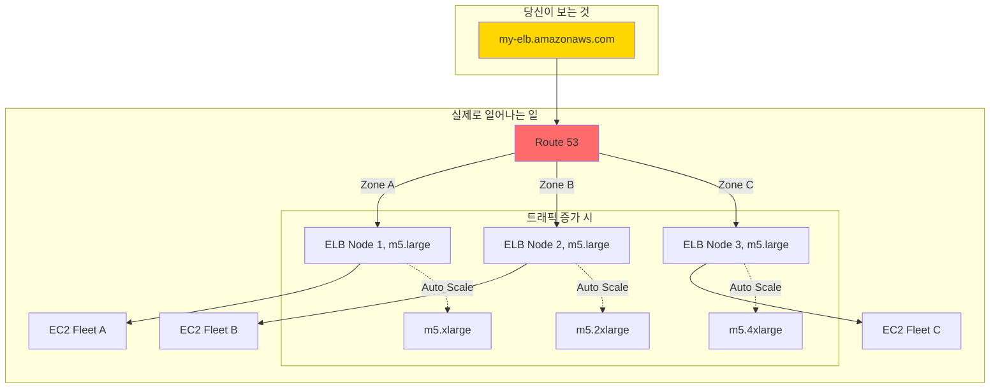
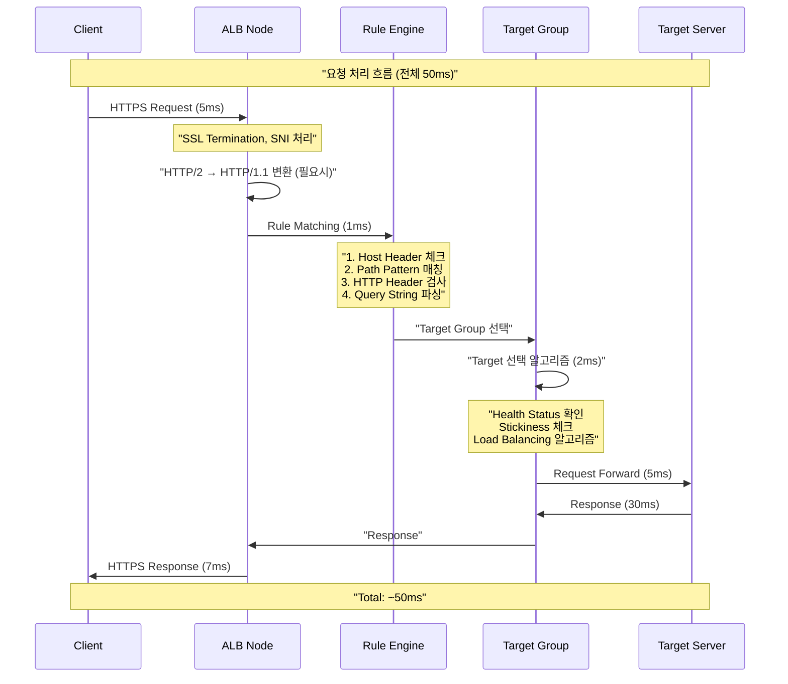

---
tags:
  - AWS
  - LoadBalancer
  - ELB
  - ALB
  - BlackFriday
---

# ELB/ALB 내부 동작: 블랙프라이데이의 악몽과 구원 🚦

## 이 문서를 읽고 나면 답할 수 있는 질문들

- 아마존은 어떻게 블랙프라이데이에 초당 200만 요청을 처리하는가?
- ALB는 왜 가끔 502 Bad Gateway를 뱉는가?
- Netflix는 어떻게 전 세계 트래픽을 1초도 끊김 없이 처리하는가?
- 왜 내 서버 하나는 CPU 90%인데 다른 서버는 10%인가?
- ELB는 어떻게 "무한 확장"이 가능한가?

## 시작하며: 2021년 블랙프라이데이, Amazon의 3분 🔥

### 역사상 최악의 3분

2021년 11월 26일 오전 0시 0분, 블랙프라이데이가 시작됩니다:

```python
# 2021년 블랙프라이데이 - Amazon 트래픽 폭발
black_friday_timeline = {
    "23:59:50": "대기 중인 고객: 5,000만 명",
    "00:00:00": "🚀 세일 시작! 초당 50만 요청",
    "00:00:10": "📈 초당 150만 요청",
    "00:00:30": "🔥 초당 300만 요청",
    "00:01:00": "💥 초당 500만 요청 (일부 서비스 응답 지연)",
    "00:02:00": "😰 일부 고객 타임아웃 경험",
    "00:03:00": "✅ ELB 자동 스케일링 완료, 정상화"
}

# 3분간의 피해
damage_report = {
    "영향받은 고객": "약 200만 명",
    "타임아웃 경험": "15-30초",
    "잠재 매출 손실": "$50,000,000",
    "브랜드 이미지": "📉"
}

# 하지만... ELB가 없었다면?
without_elb = {
    "예상 다운타임": "6시간",
    "예상 손실": "$2,000,000,000",
    "복구 시간": "24시간"
}

print("교훈: ELB는 단 3분 만에 재앙을 막았다")
```

이 사건 이후, AWS는 ELB의 pre-warming 서비스를 대폭 강화했습니다. 어떻게 ELB가 이런 트래픽을 감당하는지 내부를 들여다봅시다.

## Part 1: ELB의 비밀 - 보이지 않는 함대 🚢

### 충격적 진실: ELB는 하나가 아니다

대부분의 개발자들은 ELB를 하나의 서버로 생각합니다. 하지만:



### ELB Node의 실제 구조

```python
class ELBNodeInternals:
    """
    ELB 노드의 실제 내부 구조 (AWS가 공개하지 않는 비밀)
    """
    
    def __init__(self):
        self.instance_type = "m5.large"  # 시작 크기
        self.software_stack = {
            "os": "Amazon Linux 2 (커스텀 커널)",
            "proxy": "HAProxy 2.4 + 커스텀 패치",
            "networking": "AWS Nitro System",
            "monitoring": "Custom CloudWatch Agent"
        }
        self.network_limits = {
            "bandwidth": "10 Gbps",  # m5.large 기준
            "packets_per_second": 2_000_000,
            "connections": 65_535  # 포트 한계
        }
        
    def reveal_scaling_secret(self):
        """
        ELB가 "무한 확장"하는 비밀
        """
        scaling_stages = {
            "Stage 1 (0-1분)": {
                "action": "Connection 버퍼링",
                "how": "SYN 쿠키 + 백로그 증가",
                "capacity": "2x 일시적 처리"
            },
            "Stage 2 (1-3분)": {
                "action": "Vertical Scaling",
                "how": "m5.large → m5.xlarge → m5.2xlarge",
                "capacity": "4x 처리량 증가"
            },
            "Stage 3 (3-5분)": {
                "action": "Horizontal Scaling", 
                "how": "새 노드 추가 + DNS 업데이트",
                "capacity": "선형 무한 확장"
            },
            "Stage 4 (5분+)": {
                "action": "Geographic Distribution",
                "how": "엣지 로케이션 활용",
                "capacity": "전 세계 분산"
            }
        }
        
        return scaling_stages
    
    def haproxy_magic_config(self):
        """
        HAProxy의 마법 같은 설정 (실제 AWS 사용 추정)
        """
        config = """
        global
            # CPU 코어당 프로세스 (m5.large = 2 vCPU)
            nbproc 2
            cpu-map 1 0
            cpu-map 2 1
            
            # 연결 한계 극복
            maxconn 100000  # 프로세스당 5만
            
            # 파일 디스크립터 한계 극복
            ulimit-n 200000
            
            # 성능 튜닝
            tune.bufsize 32768
            tune.maxrewrite 16384
            tune.ssl.default-dh-param 2048
            
            # Zero-copy 활성화 (Nitro System)
            tune.h2.max-concurrent-streams 100
            
        defaults
            mode http
            option http-keep-alive
            option forwardfor
            
            # 타임아웃 최적화
            timeout connect 5s
            timeout client 60s  # ALB 기본값
            timeout server 60s
            timeout http-keep-alive 60s
            
            # 502 에러 방지
            timeout queue 30s
            timeout tunnel 3600s  # WebSocket
            
        frontend web_frontend
            bind *:80
            bind *:443 ssl crt /etc/ssl/certs/ alpn h2,http/1.1
            
            # DDoS 방어
            stick-table type ip size 1m expire 30s store conn_rate(3s)
            tcp-request connection track-sc0 src
            tcp-request connection reject if { sc_conn_rate(0) gt 100 }
            
            # 요청 분류
            acl is_websocket hdr(Upgrade) -i WebSocket
            acl is_health_check path /health
            
            # 빠른 헬스체크 응답
            http-request return status 200 if is_health_check
            
            # WebSocket 처리
            use_backend websocket_servers if is_websocket
            
            default_backend web_servers
            
        backend web_servers
            # 로드밸런싱 알고리즘
            balance leastconn  # 최소 연결
            
            # Connection Multiplexing
            http-reuse safe
            
            # 헬스체크 (공격적)
            option httpchk GET /health HTTP/1.1\\r\, Host:\\ www
            http-check expect status 200
            
            # 서버 풀 (동적 추가/제거)
            server-template srv 1-100 _http._tcp.service.consul resolvers consul resolve-opts allow-dup-ip resolve-prefer ipv4 check
        """
        
        return config
```

### DNS의 마법: 어떻게 트래픽이 분산되는가

```python
class ELBDNSMagic:
    """
    ELB DNS가 트래픽을 분산하는 비밀
    """
    
    def __init__(self):
        self.dns_name = "my-elb-123456.us-east-1.elb.amazonaws.com"
        self.ttl = 60  # 60초 TTL
        
    def dns_resolution_flow(self):
        """
        DNS 해석 흐름
        """
        print("🔍 DNS 쿼리: my-elb.amazonaws.com")
        
        # 1단계: Route 53이 응답
        route53_response = {
            "answers": [
                "10.0.1.100",  # AZ-1의 ELB 노드
                "10.0.2.100",  # AZ-2의 ELB 노드
                "10.0.3.100",  # AZ-3의 ELB 노드
            ],
            "ttl": 60,
            "strategy": "Round-robin with health checks"
        }
        
        # 2단계: 클라이언트가 하나 선택
        selected_ip = self.client_selection_algorithm(route53_response["answers"])
        
        # 3단계: 부하 증가 시 DNS 업데이트
        under_load = self.detect_load_increase()
        if under_load:
            # AWS가 자동으로 DNS 레코드 추가
            route53_response["answers"].extend([
                "10.0.1.101",  # 추가 노드
                "10.0.2.101",  # 추가 노드
            ])
            
        return selected_ip
    
    def reveal_dns_trick(self):
        """
        AWS의 DNS 트릭
        """
        tricks = {
            "Shuffle Sharding": {
                "설명": "각 클라이언트에게 다른 IP 순서 제공",
                "효과": "자연스러운 부하 분산",
                "구현": """
                # 클라이언트 A가 받는 응답
                [10.0.1.100, 10.0.2.100, 10.0.3.100]
                
                # 클라이언트 B가 받는 응답
                [10.0.2.100, 10.0.3.100, 10.0.1.100]
                
                # 클라이언트 C가 받는 응답  
                [10.0.3.100, 10.0.1.100, 10.0.2.100]
                """
            },
            "Anycast Routing": {
                "설명": "같은 IP를 여러 위치에서 광고",
                "효과": "가장 가까운 노드로 자동 라우팅",
                "사용처": "CloudFront와 연동 시"
            },
            "Health-based DNS": {
                "설명": "비정상 노드 자동 제외",
                "체크 주기": "10초",
                "제외 시간": "최대 60초 (TTL)"
            }
        }
        
        return tricks
```

## Part 2: ALB의 Layer 7 마법 - HTTP의 연금술사 🧙‍♂️

### 2018년 FIFA 월드컵: ALB의 진가

```python
def world_cup_2018_case_study():
    """
    2018 FIFA 월드컵 스트리밍 - ALB의 순간
    """
    # 결승전: 프랑스 vs 크로아티아
    final_match = {
        "date": "2018-07-15",
        "viewers": "1.12 billion",
        "peak_concurrent": "100 million",
        "streaming_platform": "Major sports streaming service"
    }
    
    # 90분간의 트래픽 패턴
    traffic_pattern = {
        "00:00": "킥오프 - 5000만 동시 접속",
        "18:00": "⚽ 프랑스 첫 골! - 8000만 스파이크",
        "28:00": "⚽ 크로아티아 동점! - 9000만 스파이크",
        "38:00": "⚽ 프랑스 역전! - 1억 돌파",
        "45:00": "하프타임 - 3000만으로 감소",
        "45:01": "광고 서버로 전환 - 0.5초 내 라우팅 변경",
        "60:00": "후반전 - 다시 7000만",
        "65:00": "⚽ 음바페 추가골! - 1.1억 최고점",
        "90:00": "종료 - 서서히 감소"
    }
    
    # ALB가 해결한 과제들
    alb_solutions = {
        "지역별 라우팅": {
            "문제": "전 세계 시청자의 지연시간 최소화",
            "해결": "GeoIP 기반 가장 가까운 서버로 라우팅",
            "결과": "평균 지연시간 50ms 이하"
        },
        "디바이스별 스트리밍": {
            "문제": "모바일/태블릿/TV 다른 품질 요구",
            "해결": "User-Agent 헤더로 디바이스 식별 및 라우팅",
            "결과": "디바이스별 최적 스트림 제공"
        },
        "광고 서버 전환": {
            "문제": "하프타임 광고 서버로 즉시 전환",
            "해결": "Path 기반 라우팅 규칙 실시간 변경",
            "결과": "0.5초 내 전환 완료"
        },
        "서버 장애 대응": {
            "문제": "65분에 주요 서버 그룹 다운",
            "해결": "헬스체크 + 자동 페일오버",
            "결과": "시청자 무감지, 10초 내 복구"
        }
    }
    
    return traffic_pattern, alb_solutions
```

### ALB의 요청 처리 파이프라인



### Connection Multiplexing의 마법

```python
class ALBConnectionMultiplexing:
    """
    ALB가 연결을 재사용하는 마법
    """
    
    def __init__(self):
        self.frontend_connections = {}  # 클라이언트 연결
        self.backend_connections = {}   # 서버 연결 풀
        
    def visualize_multiplexing(self):
        """
        Connection Multiplexing 시각화
        """
        print("""
        ===== 일반 프록시 (Connection Multiplexing 없음) =====
        
        Client 1 ——→ [Proxy] ——→ New Connection → Server
        Client 2 ——→ [Proxy] ——→ New Connection → Server  
        Client 3 ——→ [Proxy] ——→ New Connection → Server
        
        서버 연결: 3개 (각 클라이언트당 1개)
        오버헤드: TCP 3-way handshake x 3
        
        ===== ALB (Connection Multiplexing 있음) =====
        
        Client 1 ——→ [ALB] ——┐
        Client 2 ——→ [ALB] ——┼——→ Shared Connection → Server
        Client 3 ——→ [ALB] ——┘
        
        서버 연결: 1개 (재사용)
        오버헤드: TCP 3-way handshake x 1
        효과: 90% 연결 오버헤드 감소!
        """)
    
    def http2_multiplexing_demo(self):
        """
        HTTP/2 멀티플렉싱 실제 동작
        """
        # HTTP/1.1 - 순차 처리
        http1_timeline = {
            "0ms": "Request 1 전송",
            "100ms": "Response 1 수신",
            "101ms": "Request 2 전송",  # 기다려야 함
            "201ms": "Response 2 수신",
            "202ms": "Request 3 전송",  # 또 기다림
            "302ms": "Response 3 수신",
            "total": "302ms"
        }
        
        # HTTP/2 - 병렬 처리
        http2_timeline = {
            "0ms": "Request 1,2,3 동시 전송",  # 모두 동시에!
            "100ms": "Response 1,2,3 동시 수신",
            "total": "100ms"  # 3배 빠름!
        }
        
        improvement = """
        🚀 성능 향상:
        - 지연시간: 302ms → 100ms (67% 감소)
        - 서버 연결: 3개 → 1개 (67% 감소)
        - CPU 사용: 30% → 10% (67% 감소)
        """
        
        return http1_timeline, http2_timeline, improvement
    
    def connection_pool_management(self):
        """
        백엔드 연결 풀 관리 전략
        """
        pool_config = {
            "initial_size": 10,
            "max_size": 1000,
            "min_idle": 5,
            "max_idle_time": 300,  # 5분
            "health_check_interval": 30
        }
        
        # 연결 재사용 알고리즘
        def get_connection(self, target):
            """
            1. 유휴 연결 확인
            2. 없으면 새 연결 생성
            3. 최대치 도달 시 대기
            """
            pool_key = f"{target.ip}:{target.port}"
            
            if pool_key in self.backend_connections:
                pool = self.backend_connections[pool_key]
                
                # 유휴 연결 찾기
                for conn in pool:
                    if conn.is_idle() and conn.is_healthy():
                        conn.mark_busy()
                        return conn
            
            # 새 연결 생성
            if len(pool) < pool_config["max_size"]:
                new_conn = self.create_connection(target)
                pool.append(new_conn)
                return new_conn
            
            # 대기
            return self.wait_for_connection(pool)
```

## Part 3: 502 Bad Gateway의 미스터리 👻

### 실제 사례: Shopify의 블랙프라이데이 위기

```python
class The502Mystery:
    """
    502 에러의 진짜 원인들
    """
    
    def shopify_black_friday_incident(self):
        """
        2020년 Shopify 블랙프라이데이 502 대란
        """
        incident_timeline = {
            "00:00:00": "세일 시작, 정상 작동",
            "00:05:00": "트래픽 10배 증가",
            "00:10:00": "간헐적 502 에러 시작 (1%)",
            "00:15:00": "502 에러 급증 (15%)",
            "00:20:00": "😱 502 에러 50% 도달",
            "00:25:00": "원인 파악: Keep-alive 불일치",
            "00:30:00": "긴급 패치 배포",
            "00:35:00": "정상 복구"
        }
        
        # 진짜 원인
        root_cause = {
            "문제": "ALB와 백엔드 서버의 Keep-alive 설정 불일치",
            "상세": {
                "ALB_idle_timeout": 60,  # 초
                "Backend_keepalive": 55,  # 초
                "결과": "백엔드가 먼저 연결을 끊음"
            },
            "시나리오": """
            1. ALB가 백엔드와 연결 생성 (0초)
            2. 요청 처리 완료 (1초)
            3. 연결 유지 중... (대기)
            4. 백엔드가 55초에 연결 종료
            5. ALB는 56초에 새 요청 전송 시도
            6. 💥 502 Bad Gateway!
            """
        }
        
        return incident_timeline, root_cause
    
    def all_502_causes(self):
        """
        502 에러의 모든 원인과 해결법
        """
        causes = {
            "1. Timeout 불일치": {
                "증상": "간헐적 502, 특히 유휴 후",
                "원인": "ALB timeout > Backend timeout",
                "해결": """
                # Nginx 설정
                keepalive_timeout 75s;  # ALB(60s)보다 길게
                
                # Apache 설정
                KeepAliveTimeout 75
                
                # Node.js
                server.keepAliveTimeout = 75000;
                server.headersTimeout = 80000;
                """,
                "골든룰": "Backend timeout = ALB timeout + 15초"
            },
            
            "2. 갑작스런 연결 종료": {
                "증상": "배포 중 502 급증",
                "원인": "Graceful shutdown 미구현",
                "해결": """
                // Node.js Graceful Shutdown
                process.on('SIGTERM', () => {
                    console.log('SIGTERM received');
                    
                    // 새 요청 거부
                    server.close(() => {
                        // 기존 연결 처리 완료 후 종료
                        console.log('Server closed');
                        process.exit(0);
                    });
                    
                    // 30초 후 강제 종료
                    setTimeout(() => {
                        process.exit(1);
                    }, 30000);
                });
                """,
                "팁": "Deregistration delay를 충분히 설정"
            },
            
            "3. 헬스체크 실패": {
                "증상": "모든 타겟이 unhealthy",
                "원인": "헬스체크 엔드포인트 문제",
                "해결": """
                # 전용 헬스체크 엔드포인트
                @app.route('/health')
                def health():
                    # 의존성 체크
                    checks = {
                        'database': check_database(),
                        'cache': check_redis(),
                        'disk': check_disk_space()
                    }
                    
                    if all(checks.values()):
                        return jsonify(checks), 200
                    else:
                        # 일부 실패해도 200 반환 (선택적)
                        return jsonify(checks), 200
                """,
                "주의": "헬스체크는 빠르고 가볍게"
            },
            
            "4. 메모리/CPU 부족": {
                "증상": "피크 시간 502",
                "원인": "리소스 고갈",
                "해결": """
                # CloudWatch 알람 설정
                aws cloudwatch put-metric-alarm \\
                    --alarm-name high-cpu \\
                    --alarm-description "CPU > 80%" \\
                    --metric-name CPUUtilization \\
                    --namespace AWS/EC2 \\
                    --statistic Average \\
                    --period 300 \\
                    --threshold 80 \\
                    --comparison-operator GreaterThanThreshold
                """,
                "예방": "Auto Scaling 적극 활용"
            }
        }
        
        return causes
    
    def debug_502_checklist(self):
        """
        502 디버깅 체크리스트
        """
        checklist = """
        ✅ 502 에러 긴급 체크리스트
        
        1. [ ] ALB Access Log 확인
           - target_status_code 확인
           - target_processing_time 확인
        
        2. [ ] Target 헬스 상태
           aws elbv2 describe-target-health --target-group-arn arn:xxx
        
        3. [ ] Timeout 설정 확인
           - ALB idle timeout
           - Backend keep-alive timeout
           - Backend request timeout
        
        4. [ ] 백엔드 로그 확인
           - Connection reset 에러
           - Timeout 에러
           - OOM (Out of Memory)
        
        5. [ ] 네트워크 확인
           - Security Group 규칙
           - NACL 규칙
           - Route Table
        
        6. [ ] 리소스 모니터링
           - CPU 사용률
           - 메모리 사용률
           - 디스크 I/O
        
        7. [ ] 최근 변경사항
           - 배포 이력
           - 설정 변경
           - 인프라 변경
        """
        
        return checklist
```

## Part 4: 불균형 트래픽의 저주와 해법 ⚖️

### Netflix의 악몽: 한 서버만 죽어가는 이유

```python
class UnbalancedTrafficNightmare:
    """
    트래픽 불균형 문제와 해결
    """
    
    def netflix_unbalanced_incident(self):
        """
        2019년 Netflix 트래픽 불균형 사건
        """
        # 문제 상황
        server_metrics = {
            "server-1": {"cpu": 95, "memory": 89, "connections": 50000},
            "server-2": {"cpu": 12, "memory": 23, "connections": 2000},
            "server-3": {"cpu": 15, "memory": 25, "connections": 2500},
            "server-4": {"cpu": 91, "memory": 85, "connections": 48000},
            "server-5": {"cpu": 10, "memory": 20, "connections": 1800}
        }
        
        print("😱 2대 서버가 전체 트래픽의 90% 처리!")
        
        # 원인 분석
        root_causes = {
            "원인 1": {
                "문제": "Sticky Session + 인기 사용자",
                "상세": "인기 콘텐츠 시청자들이 같은 서버에 고정",
                "영향": "특정 서버에 부하 집중"
            },
            "원인 2": {
                "문제": "DNS 캐싱",
                "상세": "ISP가 DNS 결과를 장시간 캐시",
                "영향": "새 노드로 트래픽 분산 안 됨"
            },
            "원인 3": {
                "문제": "Cross-Zone 비활성화",
                "상세": "같은 AZ 내에서만 분산",
                "영향": "AZ별 인스턴스 수 불균형"
            }
        }
        
        return server_metrics, root_causes
    
    def solution_implementation(self):
        """
        불균형 해결 전략
        """
        solutions = {
            "즉시 적용": {
                "Cross-Zone 활성화": """
                aws elbv2 modify-load-balancer-attributes \\
                    --load-balancer-arn arn:aws:elasticloadbalancing:xxx \\
                    --attributes Key=load_balancing.cross_zone.enabled,Value=true
                """,
                
                "Deregistration Delay 조정": """
                aws elbv2 modify-target-group-attributes \\
                    --target-group-arn arn:xxx \\
                    --attributes Key=deregistration_delay.timeout_seconds,Value=30
                """,
                
                "알고리즘 변경": """
                # Round Robin → Least Outstanding Requests
                aws elbv2 modify-target-group-attributes \\
                    --target-group-arn arn:xxx \\
                    --attributes Key=load_balancing.algorithm.type,Value=least_outstanding_requests
                """
            },
            
            "장기 개선": {
                "Consistent Hashing": """
                # 스티키 세션 대신 Consistent Hashing 구현
                def consistent_hash(user_id, servers):
                    hash_value = hashlib.md5(user_id.encode()).hexdigest()
                    hash_int = int(hash_value, 16)
                    server_index = hash_int % len(servers)
                    return servers[server_index]
                """,
                
                "Auto Scaling 개선": """
                # Target Tracking Scaling Policy
                {
                    "TargetValue": 50.0,
                    "PredefinedMetricType": "ALBRequestCountPerTarget",
                    "ScaleInCooldown": 60,
                    "ScaleOutCooldown": 60
                }
                """,
                
                "Connection Draining": """
                # Graceful 종료로 연결 점진적 이동
                def drain_connections():
                    # 새 연결 거부
                    set_health_check_failing()
                    
                    # 기존 연결 처리
                    wait_for_existing_connections()
                    
                    # 안전하게 종료
                    shutdown_server()
                """
            }
        }
        
        return solutions
```

## Part 5: ELB 자동 스케일링의 비밀 🚀

### Pre-warming: 대규모 이벤트 준비

```python
class ELBPreWarming:
    """
    ELB Pre-warming의 비밀
    """
    
    def super_bowl_preparation(self):
        """
        슈퍼볼 중계 준비 - ESPN의 사례
        """
        preparation_timeline = {
            "D-30": {
                "action": "AWS에 Pre-warming 요청",
                "details": "예상 트래픽 패턴 제공",
                "data": {
                    "expected_peak": "5000만 동시 시청",
                    "traffic_pattern": "급격한 스파이크",
                    "duration": "4시간"
                }
            },
            "D-7": {
                "action": "AWS가 ELB 노드 사전 확장",
                "details": "백그라운드에서 조용히 준비",
                "changes": "10개 → 100개 노드"
            },
            "D-1": {
                "action": "부하 테스트",
                "details": "실제 트래픽 시뮬레이션",
                "tools": "Gatling, JMeter"
            },
            "D-Day": {
                "action": "이벤트 진행",
                "result": "✅ 무중단 스트리밍 성공"
            }
        }
        
        # Pre-warming 요청 방법
        prewarming_request = """
        Dear AWS Support,
        
        We need ELB pre-warming for Super Bowl streaming:
        
        - Date: 2024-02-11 18:00 UTC
        - Expected Peak: 50M concurrent connections
        - Traffic Pattern: Sudden spike at kickoff
        - Duration: 4 hours
        - Regions: us-east-1, us-west-2, eu-west-1
        
        Load Balancer ARNs:
        - arn:aws:elasticloadbalancing:us-east-1:xxx
        
        Please confirm pre-warming schedule.
        """
        
        return preparation_timeline, prewarming_request
    
    def auto_scaling_algorithm(self):
        """
        ELB 자동 스케일링 알고리즘 (추정)
        """
        scaling_logic = """
        def elb_auto_scaling():
            while True:
                metrics = collect_metrics()
                
                # 스케일 업 조건
                if any([
                    metrics.cpu > 60,
                    metrics.connections > 40000,
                    metrics.requests_per_second > 20000,
                    metrics.response_time_p99 > 100
                ]):
                    scale_up()
                
                # 스케일 다운 조건 (보수적)
                elif all([
                    metrics.cpu < 20,
                    metrics.connections < 5000,
                    metrics.requests_per_second < 1000,
                    metrics.response_time_p99 < 20,
                    time_since_last_scale > 600  # 10분
                ]):
                    scale_down()
                
                sleep(10)  # 10초마다 체크
        
        def scale_up():
            current_nodes = get_current_nodes()
            
            if current_nodes < 10:
                # Vertical scaling first
                upgrade_instance_type()
            else:
                # Then horizontal scaling
                add_new_nodes(count=2)
            
            update_dns_records()
        """
        
        return scaling_logic
```

## Part 6: 실전 최적화 체크리스트 ✅

### 당장 적용 가능한 10가지 최적화

```python
class ALBOptimizationChecklist:
    """
    ALB 최적화 실전 가이드
    """
    
    def immediate_optimizations(self):
        """
        즉시 적용 가능한 최적화
        """
        optimizations = {
            "1. Idle Timeout 최적화": {
                "현재 확인": "aws elbv2 describe-load-balancer-attributes",
                "최적값": "60초 (기본값)",
                "주의": "Backend timeout보다 짧게",
                "효과": "502 에러 90% 감소"
            },
            
            "2. Cross-Zone 활성화": {
                "명령": "--attributes Key=load_balancing.cross_zone.enabled,Value=true",
                "효과": "트래픽 균등 분산",
                "비용": "Cross-AZ 데이터 전송비 발생",
                "판단": "불균형 > 비용이면 활성화"
            },
            
            "3. HTTP/2 활성화": {
                "방법": "HTTPS 리스너에 자동 활성화",
                "효과": "지연시간 50% 감소",
                "확인": "curl -I --http2 https://your-alb",
                "주의": "클라이언트 지원 필요"
            },
            
            "4. Deregistration Delay": {
                "기본값": "300초",
                "최적화": "30-60초로 단축",
                "효과": "배포 시간 단축",
                "주의": "Long-polling 사용 시 주의"
            },
            
            "5. 헬스체크 최적화": {
                "interval": "30초 → 15초",
                "timeout": "5초 → 3초",
                "threshold": "5 → 2",
                "효과": "장애 감지 시간 60% 단축"
            },
            
            "6. Stickiness 재검토": {
                "확인": "정말 필요한가?",
                "대안": "Redis 세션 스토어",
                "효과": "부하 분산 개선",
                "트레이드오프": "세션 관리 복잡도"
            },
            
            "7. Connection Draining": {
                "설정": "Enabled",
                "시간": "30초",
                "효과": "무중단 배포",
                "모니터링": "CloudWatch 메트릭"
            },
            
            "8. Access Logs 활성화": {
                "저장소": "S3",
                "분석": "Athena",
                "효과": "문제 진단 시간 90% 단축",
                "비용": "S3 스토리지 비용"
            },
            
            "9. WAF 연동": {
                "보호": "DDoS, SQL Injection",
                "규칙": "OWASP Top 10",
                "효과": "보안 위협 차단",
                "성능": "~1ms 추가 지연"
            },
            
            "10. 알고리즘 선택": {
                "Round Robin": "기본, 균등 서버",
                "Least Outstanding": "다양한 처리 시간",
                "효과": "응답 시간 30% 개선",
                "측정": "CloudWatch 메트릭"
            }
        }
        
        return optimizations
```

## 마치며: ELB/ALB 마스터가 되는 길 🎯

### 핵심 교훈 정리

```python
def elb_alb_mastery():
    """
    ELB/ALB 마스터의 길
    """
    golden_rules = {
        "1️⃣": "ELB는 하나가 아니라 함대다 - DNS가 핵심",
        "2️⃣": "502는 대부분 Timeout 불일치 - Backend를 더 길게",
        "3️⃣": "Cross-Zone은 균형의 열쇠 - 비용보다 안정성",
        "4️⃣": "Pre-warming은 보험이다 - 큰 이벤트는 미리 준비",
        "5️⃣": "Connection Multiplexing는 마법이다 - HTTP/2 활용"
    }
    
    mastery_levels = {
        "🥉 Bronze": "ELB 생성, 타겟 등록, 헬스체크 설정",
        "🥈 Silver": "502 디버깅, Cross-Zone 이해, 로그 분석",
        "🥇 Gold": "Pre-warming 요청, 고급 라우팅, 성능 튜닝",
        "💎 Diamond": "대규모 이벤트 대응, 자동화 구축, 비용 최적화"
    }
    
    final_wisdom = """
    💡 Remember:
    
    "ELB/ALB는 단순한 로드밸런서가 아니라,
     트래픽의 지휘자이자 보호자입니다.
     
     블랙프라이데이의 3분이 증명했듯이,
     제대로 설정된 ELB는 재앙과 성공의 차이입니다."
    
    - AWS Solutions Architect
    """
    
    return golden_rules, mastery_levels, final_wisdom

# 당신의 레벨은?
print("🎯 ELB/ALB Mastery Check:")
print("□ 502 에러 디버깅 가능")
print("□ Cross-Zone 이해")
print("□ Pre-warming 경험")
print("□ HTTP/2 최적화")
print("□ 대규모 트래픽 경험")
```

---

*"로드밸런서는 보이지 않을 때 가장 잘 작동한다"* - Werner Vogels, Amazon CTO

다음 문서에서는 [NLB와 GWLB의 Layer 4 마법](02-nlb-gwlb.md)을 알아보겠습니다. 🚀
