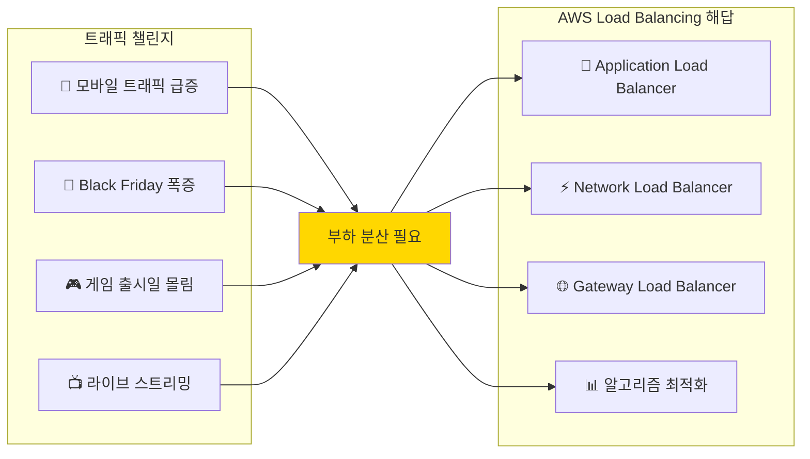

---
tags:
  - AWS
  - LoadBalancing
  - ELB
  - ALB
  - NLB
---

# AWS Load Balancing - 트래픽 분산의 예술 ⚖️

## 이 섹션을 읽으면 답할 수 있는 질문들

- Black Friday에 Amazon이 어떻게 초당 1억 요청을 처리하는가?
- ELB와 ALB의 차이점이 단순히 Layer 차이일까?
- Netflix는 어떻게 Fortnite 1억 동접을 안정적으로 처리했을까?
- 로드밸런서 하나가 죽으면 전체 서비스가 다운될까?
- Instagram이 사용하는 로드밸런싱 알고리즘의 비밀은?

## 시작하며: 트래픽 폭증의 시대

현대 웹 서비스는 예측할 수 없는 트래픽 패턴에 직면합니다:



## AWS Load Balancing 완벽 가이드 📚

### [1. ELB와 ALB: Layer 7의 혁명](01-elb-alb.md)

**Black Friday Amazon의 비밀 무기**

2019년 Black Friday, Amazon이 어떻게 초당 1억 요청을 처리했는지 실제 사례를 통해 ELB와 ALB의 차이점과 내부 동작을 탐험합니다.

🔍**핵심 내용**:

- Classic ELB vs Application LB 완벽 비교
- Target Group과 Health Check의 숨은 로직
- Path-based Routing의 실제 구현
- 2019년 Black Friday 실전 사례

---

### [2. NLB와 GWLB: 극한 성능의 세계](02-nlb-gwlb.md)

**Fortnite 1억 동접의 비밀**

Epic Games가 Fortnite에서 1억 명의 동시 접속자를 처리한 방법을 통해 Network Load Balancer의 극한 성능과 Gateway Load Balancer의 혁신을 알아봅니다.

⚡**핵심 내용**:

- NLB의 초저지연 아키텍처
- Flow Hash Algorithm 동작 원리
- GWLB의 투명한 네트워크 삽입
- Fortnite 스케일링 실전 사례

---

### [3. 로드밸런싱 알고리즘: 분산의 수학](03-algorithms.md)

**Instagram 10억 사용자 분산의 비법**

Instagram이 10억 사용자의 트래픽을 균등하게 분산하는 방법을 통해 Round Robin부터 Consistent Hashing까지 로드밸런싱 알고리즘의 깊은 세계를 탐험합니다.

🧮**핵심 내용**:

- Round Robin의 함정과 개선책
- Consistent Hashing 완벽 구현
- Google Maglev 알고리즘 분석
- Netflix P2C (Power of Two Choices)

## 실전 시나리오별 로드밸런서 선택 가이드 🎯

### 시나리오 1: E-commerce (쇼핑몰)

```python
use_case = "E-commerce"
requirements = {
    "traffic_pattern": "불규칙한 스파이크",
    "session_affinity": "필요",
    "ssl_termination": "필수"
}
recommendation = "Application Load Balancer + Sticky Session"
```

### 시나리오 2: Gaming (게임 서버)

```python
use_case = "Gaming"
requirements = {
    "latency": "초저지연 (<1ms)",
    "protocol": "TCP/UDP",
    "throughput": "매우 높음"
}
recommendation = "Network Load Balancer + Cross-Zone"
```

### 시나리오 3: Security Appliance (보안 장비)

```python
use_case = "Security Appliance"
requirements = {
    "traffic_inspection": "필수",
    "transparent_proxy": "필요",
    "scaling": "자동"
}
recommendation = "Gateway Load Balancer"
```

## 로드밸런싱 마스터 로드맵 🗺️

### 초급 (1주)

- [ ] ALB 기본 설정 및 Target Group 이해
- [ ] Health Check 동작 원리 파악
- [ ] Path-based Routing 구현

### 중급 (1개월)

- [ ] NLB 성능 최적화
- [ ] Cross-Zone Load Balancing 이해
- [ ] SSL/TLS Termination 구현

### 고급 (3개월)

- [ ] 커스텀 로드밸런싱 알고리즘 구현
- [ ] Multi-AZ 장애 복구 설계
- [ ] 대규모 트래픽 처리 아키텍처

### 전문가 (6개월+)

- [ ] 글로벌 로드밸런싱 설계
- [ ] 실시간 트래픽 분석 및 최적화
- [ ] 차세대 로드밸런싱 기술 연구

## 자주 하는 실수들 ❌

### 1. Target Group Health Check 오설정

```python
# 잘못된 예
health_check = {
    "interval": 30,      # 너무 긺
    "timeout": 20,       # 너무 긺
    "healthy_threshold": 10  # 너무 높음
}

# 올바른 예
health_check = {
    "interval": 10,      # 빠른 감지
    "timeout": 5,        # 적절한 시간
    "healthy_threshold": 2   # 빠른 복구
}
```

### 2. Cross-Zone 로드밸런싱 미설정

```python
# AZ 불균형 발생 가능
az_distribution = {
    "us-east-1a": "50 instances",
    "us-east-1b": "10 instances",
    "cross_zone": False  # ❌ 문제 발생
}
```

## 마치며: 분산의 철학

AWS Load Balancing을 마스터하는 것은 단순히 설정을 아는 것이 아닙니다.**트래픽의 본질을 이해하고, 사용자 경험을 최우선으로 생각하는 철학**을 갖는 것입니다.

> *"완벽한 로드밸런서는 존재하지 않는다. 하지만 완벽한 사용자 경험은 만들 수 있다."*
> — AWS Load Balancing Team

다음 문서에서 실제 사례들과 함께 Load Balancing의 깊은 세계로 들어가보겠습니다! 🚀

---

**다음 읽기**: [ELB와 ALB: Layer 7의 혁명](01-elb-alb.md)
