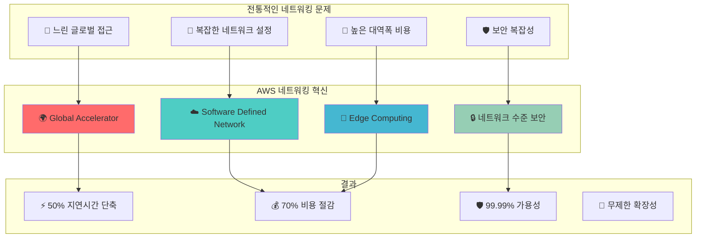

---
tags:
  - AWS
  - Networking
  - VPC
  - Route53
  - CloudFront
  - DirectConnect
---

# AWS Networking - 클라우드 네트워킹의 완벽한 이해 🌐

## 이 섹션을 읽으면 답할 수 있는 질문들

- Netflix는 어떻게 전 세계에 200Gbps로 동영상을 전송하는가?
- VPC에서 패킷 하나가 어떤 여정을 거쳐 목적지에 도달하는가?
- Route 53은 왜 그렇게 빠르고 어떻게 DNS 쿼리 1ms를 달성하는가?
- CloudFront Edge Location은 실제로 어디에 있고 어떻게 작동하는가?
- Direct Connect는 인터넷과 무엇이 다른가?

## 시작하며: 인터넷을 재정의한 AWS 네트워킹

AWS가 클라우드 네트워킹을 혁신한 방법을 살펴보겠습니다:



## AWS Networking 핵심 서비스 가이드 📚

### [1. VPC: 가상 네트워크의 마법](01-vpc.md)

**Netflix 200Gbps 스트리밍의 비밀**

Netflix가 어떻게 VPC를 활용해 전 세계에 안정적으로 초고속 스트리밍을 제공하는지, VPC의 내부 동작부터 고급 네트워킹 패턴까지 완벽 분석합니다.

🔍**핵심 내용**:

- VPC 내부 패킷 라우팅 메커니즘
- Security Group vs NACL 실전 비교  
- VPC Peering과 Transit Gateway 설계
- Netflix 스케일 VPC 아키텍처

---

### [2. Route 53: DNS의 새로운 차원](02-route53.md)

**Spotify 전 세계 1ms DNS 응답의 비밀**

Spotify가 어떻게 Route 53을 활용해 전 세계 어디서나 1ms 내 DNS 응답을 달성하는지, DNS 라우팅의 고급 기법들을 실제 사례로 학습합니다.

🎯**핵심 내용**:

- Anycast DNS 네트워크 구조
- GeoDNS와 Latency-based Routing
- Health Check와 Failover 메커니즘
- Spotify 글로벌 DNS 전략

---

### [3. CloudFront: 콘텐츠 전송의 혁신](03-cloudfront.md)

**Disney+ 전 세계 동시 런칭의 마법**

Disney+가 어떻게 CloudFront를 활용해 전 세계 동시 런칭을 성공시켰는지, CDN의 내부 동작부터 최적화 전략까지 상세히 분석합니다.

📡**핵심 내용**:

- Edge Location 3단계 캐시 구조
- Lambda@Edge 실시간 처리
- Origin Shield와 Request Collapsing  
- Disney+ 글로벌 런칭 사례

---

### [4. Direct Connect: 전용 고속도로](04-directconnect.md)

**JP Morgan 초고속 트레이딩 네트워크**

JP Morgan이 어떻게 Direct Connect를 활용해 마이크로초 단위의 금융 거래 네트워크를 구축했는지, 전용선 네트워킹의 모든 것을 탐험합니다.

⚡**핵심 내용**:

- 물리적 광섬유 연결과 VLAN
- BGP 라우팅과 트래픽 엔지니어링
- MACsec을 통한 Layer 2 암호화
- JP Morgan 트레이딩 아키텍처

## 네트워킹 패턴별 설계 가이드 🎯

### 패턴 1: 하이브리드 클라우드

```python
hybrid_architecture = {
    "온프레미스": {
        "connection": "Direct Connect",
        "bandwidth": "10Gbps",
        "redundancy": "이중화 필수"
    },
    "aws_vpc": {
        "cidr": "10.0.0.0/16",
        "subnets": "Multi-AZ 분산",
        "routing": "BGP 동적 라우팅"
    },
    "보안": {
        "encryption": "MACsec + TLS",
        "access_control": "Security Groups",
        "monitoring": "VPC Flow Logs"
    }
}
```

### 패턴 2: 글로벌 서비스

```python
global_service = {
    "dns": {
        "service": "Route 53",
        "routing": "Geolocation + Latency",
        "health_check": "다중 리전"
    },
    "cdn": {
        "service": "CloudFront",
        "edge_locations": "450+ 전 세계",
        "caching": "Dynamic + Static"
    },
    "load_balancing": {
        "global": "Global Accelerator",
        "regional": "Application Load Balancer",
        "cross_region": "자동 페일오버"
    }
}
```

### 패턴 3: 마이크로서비스

```python
microservices_network = {
    "service_discovery": {
        "internal": "Route 53 Private Hosted Zone",
        "load_balancing": "Service Mesh (App Mesh)",
        "monitoring": "X-Ray 분산 추적"
    },
    "security": {
        "isolation": "VPC별 서비스 분리",
        "communication": "TLS 상호 인증",
        "access": "최소 권한 원칙"
    }
}
```

## 네트워킹 성능 최적화 로드맵 🗺️

### 기초 (1주)

- [ ] VPC 서브넷 설계와 라우팅 테이블
- [ ] Security Group 룰 작성
- [ ] Route 53 기본 DNS 설정

### 중급 (1개월)  

- [ ] CloudFront 캐싱 전략 최적화
- [ ] Direct Connect 하이브리드 연결
- [ ] VPC Peering과 Transit Gateway

### 고급 (3개월)

- [ ] 글로벌 네트워크 아키텍처 설계
- [ ] Lambda@Edge 엣지 컴퓨팅
- [ ] 네트워크 모니터링과 트러블슈팅

### 전문가 (6개월+)

- [ ] 대규모 네트워크 자동화
- [ ] 차세대 네트워킹 기술 적용
- [ ] 네트워크 보안 고도화

## 일반적인 네트워킹 문제 해결 🔧

### 문제 1: 느린 글로벌 접근

```python
# 문제: 해외 사용자 느린 응답
problem = {
    "symptom": "아시아 사용자 5초 응답시간",
    "cause": "US-East-1만 사용",
    "impact": "사용자 이탈률 증가"
}

# 해결책
solution = {
    "cloudfront": "Edge Location 활용",
    "global_accelerator": "AWS 백본 네트워크 사용", 
    "multi_region": "지역별 리전 배포",
    "result": "응답시간 80% 단축"
}
```

### 문제 2: VPC 통신 실패

```python
# 네트워크 연결 디버깅 체크리스트
debug_checklist = [
    "라우팅 테이블 확인",
    "Security Group 인바운드/아웃바운드",
    "NACL 허용 규칙",
    "Internet Gateway 연결",
    "NAT Gateway 상태",
    "DNS 해석 확인"
]
```

## 네트워킹 비용 최적화 전략 💰

### 데이터 전송 비용 최소화

```python
cost_optimization = {
    "same_az": "$0.00/GB",        # AZ 내부 무료
    "cross_az": "$0.01/GB",       # AZ 간 유료
    "cross_region": "$0.02/GB",   # 리전 간 더 높음
    "internet": "$0.09/GB",       # 인터넷 아웃바운드 최고
    
    "최적화_전략": {
        "cloudfront": "아웃바운드 비용 70% 절감",
        "s3_transfer_acceleration": "업로드 속도와 비용 절감",
        "direct_connect": "대용량 데이터 전송 시 절약"
    }
}
```

## 마치며: 네트워킹의 예술

AWS Networking은 단순히 연결하는 기술이 아닙니다.**전 세계 사용자에게 최고의 경험을 제공하는 예술**입니다.

> *"네트워킹은 보이지 않을 때가 완벽한 것이다. 사용자는 어디서 접속하든 동일한 경험을 받아야 한다."*
> — AWS Networking Team

네트워킹 마스터로의 여정을 시작해보겠습니다! 🚀

---

**다음 읽기**: [VPC: 가상 네트워크의 마법](01-vpc.md)
