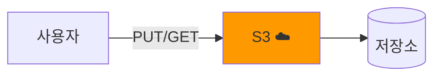
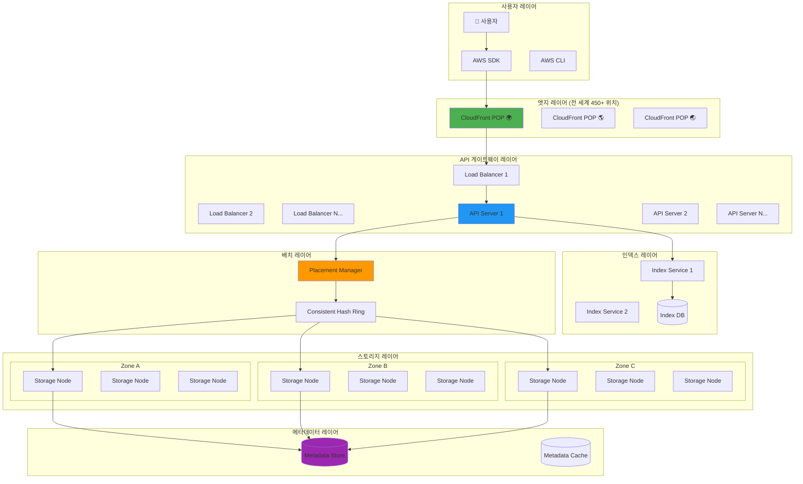
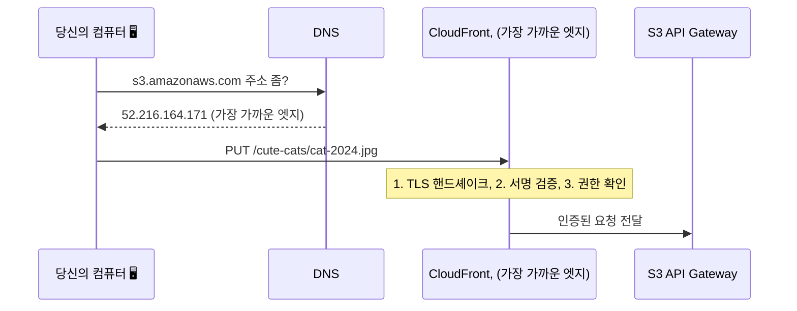
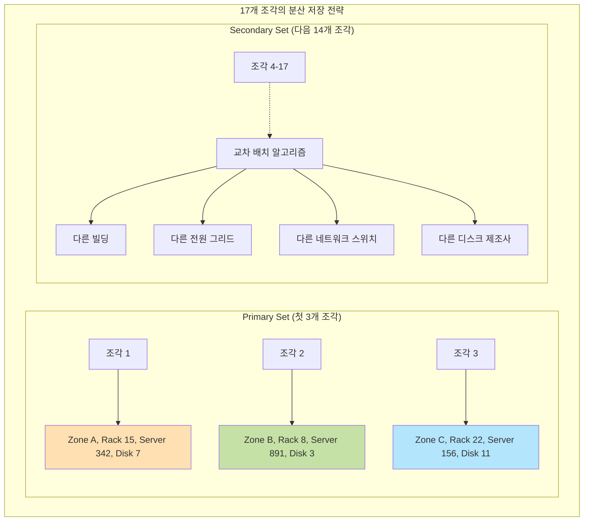
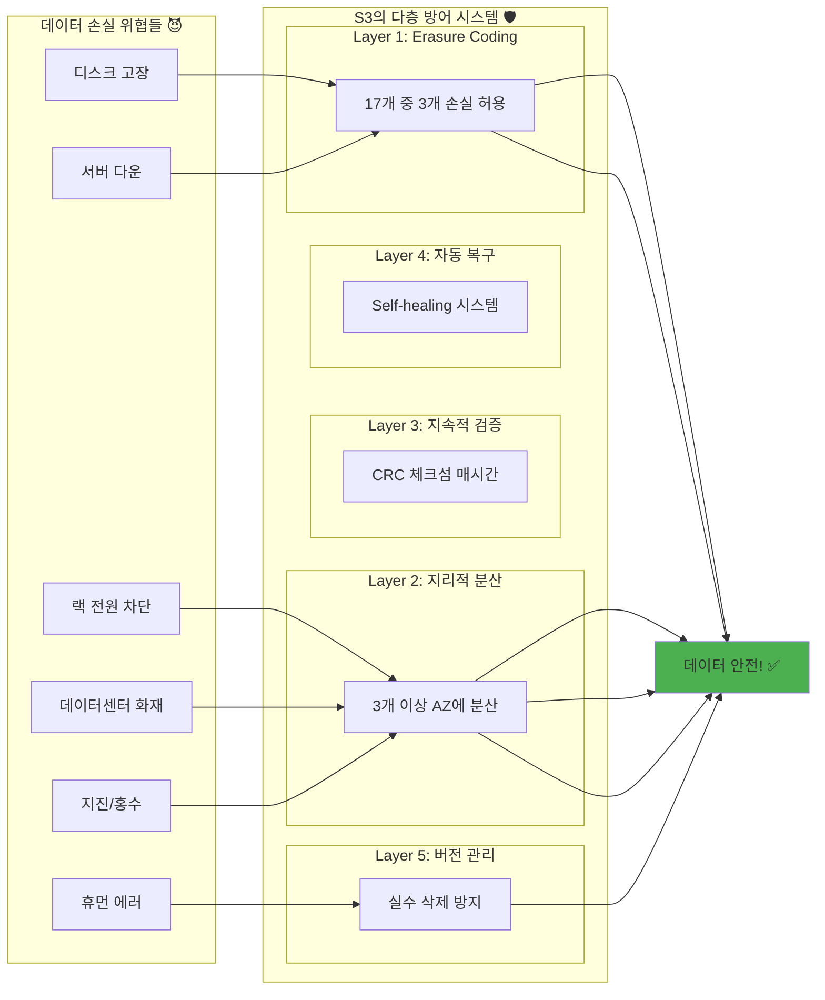
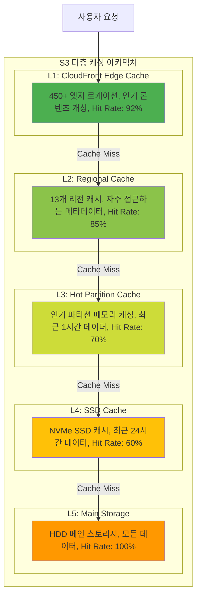

---
tags:
  - AWS
  - S3
  - Storage
  - Architecture
  - DistributedSystem
---

# S3 내부 아키텍처 - 99.999999999% 내구성의 비밀을 파헤치다

## 이 문서를 읽으면 답할 수 있는 질문들

- S3는 어떻게 99.999999999%(11 nines) 내구성을 달성하는가?
- 내가 업로드한 파일은 실제로 어디에, 어떻게 저장되는가?
- S3는 어떻게 초당 수백만 요청을 처리하는가?
- 전 세계 어디서든 빠르게 접근할 수 있는 비밀은?
- 왜 S3는 "결과적 일관성"에서 "강한 일관성"으로 바뀌었을까?
- 데이터센터가 통째로 사라져도 데이터가 안전한 이유는?

## 들어가며: 2017년 S3 대장애, 그리고 배운 교훈들 🔥

### 타이핑 실수 하나가 인터넷의 절반을 마비시킨 날

2017년 2월 28일, AWS 엔지니어 한 명이 간단한 유지보수 작업을 하다가 실수로 잘못된 명령어를 입력했습니다:

```bash
# 의도: 소수의 서버를 재시작
$ remove-capacity <small-number>

# 실수: 너무 많은 서버를 제거
$ remove-capacity <very-large-number>  # 😱
```

이 작은 실수로 S3 서비스의 핵심 서버들이 대량으로 다운되었고, 결과는 참혹했습니다:

-**4시간 동안 S3 장애**(US-EAST-1 리전)
-**영향받은 서비스**: Netflix, Airbnb, Pinterest, Slack...
-**추정 손실**: 1억 5천만 달러
-**아이러니**: AWS 상태 페이지도 S3를 사용해서 업데이트 불가! 🤦

하지만 놀라운 점은?**단 한 바이트의 데이터도 손실되지 않았습니다!**

이것이 바로 S3 아키텍처의 위대함입니다. 서비스는 다운되어도 데이터는 절대 잃지 않는 시스템. 어떻게 가능할까요?

### S3의 규모: 숫자로 보는 경이로움

먼저 S3가 처리하는 규모를 실감해봅시다:

```python
# S3의 하루 (2024년 기준 추정치)
s3_daily_stats = {
    "objects_stored": "280조 개",           # 280,000,000,000,000 개
    "requests_per_second": "1억 개",        # 100,000,000 req/s
    "data_stored": "300 엑사바이트",        # 300,000 페타바이트
    "daily_uploads": "100조 개",            # 하루에 추가되는 객체
    "bandwidth": "수 테라비트/초"
}

# 비교해보면...
comparisons = {
    "모든 인류의 말": "5 엑사바이트",       # S3는 60배
    "인터넷 전체(2003년)": "5 엑사바이트",  # S3는 60배
    "인간 DNA 정보": "약 700MB",           # S3는 4천억 명분
}
```

이 어마어마한 규모를 단 한 건의 데이터 손실 없이 운영하는 비결을 지금부터 파헤쳐보겠습니다!

## 1. S3의 전체 아키텍처: 거대한 분산 시스템의 교향곡 🎼

### 1.1 10,000피트 상공에서 본 S3

S3를 처음 본다면 이렇게 생각할 수 있습니다:



하지만 실제로는?**수만 대의 서버가 정교하게 협력하는 거대한 오케스트라**입니다:



각 레이어가 어떤 역할을 하는지 하나씩 파헤쳐봅시다!

### 1.2 파일 업로드의 여정: 당신의 사진이 S3에 저장되기까지

여러분이 찍은 고양이 사진 🐱을 S3에 업로드한다고 상상해보세요. 이 5MB짜리 사진이 어떤 모험을 거치는지 따라가 봅시다:

```python
# 당신이 실행한 명령어
aws s3 cp cat.jpg s3://my-bucket/cute-cats/cat-2024.jpg
```

이제 시작입니다!

#### 🚀 Stage 1: 엣지에서의 첫 만남 (0-10ms)



**비밀 #1**: S3 도메인을 요청하면**지리적으로 가장 가까운 엣지 위치**로 연결됩니다. 서울에서 요청하면 서울 엣지로, 뉴욕에서 요청하면 뉴욕 엣지로!

#### 🎯 Stage 2: 어디에 저장할까? 배치 결정 (10-20ms)

```python
class S3PlacementManager:
    """
    S3의 두뇌: 파일을 어디에 저장할지 결정하는 마법사
    """
    def decide_placement(self, file_key, file_size):
        # 1. 해시 계산: 파일 이름으로 운명 결정!
        hash_value = self.calculate_hash(file_key)
        # "cute-cats/cat-2024.jpg" → 0xA3B2C1D4

        # 2. Consistent Hashing으로 노드 선택
        primary_nodes = self.hash_ring.get_nodes(hash_value, count=3)
        # [Node_2847, Node_5912, Node_8103]

        # 3. 각 노드는 다른 가용 영역에!
        zones = ['us-east-1a', 'us-east-1b', 'us-east-1c']
        placement = []

        for node, zone in zip(primary_nodes, zones):
            placement.append({
                'node': node,
                'zone': zone,
                'rack': self.select_rack(node, zone),
                'disk': self.select_disk(node)
            })

        print(f"🎯 파일 배치 결정:")
        print(f"  Zone A: {placement[0]['node']} (Rack {placement[0]['rack']})")
        print(f"  Zone B: {placement[1]['node']} (Rack {placement[1]['rack']})")
        print(f"  Zone C: {placement[2]['node']} (Rack {placement[2]['rack']})")

        return placement
```

**비밀 #2**: S3는**Consistent Hashing**을 사용해 파일을 균등하게 분산시킵니다. 서버가 추가/제거되어도 최소한의 데이터만 이동하면 됩니다!

#### 💾 Stage 3: Erasure Coding의 마법 (20-50ms)

이제 진짜 마법이 시작됩니다. S3는 파일을 그대로 저장하지 않습니다:

```python
class S3ErasureCoding:
    """
    Reed-Solomon Erasure Coding: 5MB를 17개 조각으로!
    """
    def encode_file(self, file_data):
        print("🔮 Erasure Coding 마법 시전!")

        # 1. 파일을 14개 데이터 조각으로 분할
        data_shards = self.split_into_shards(file_data, n=14)
        # 각 조각: 5MB / 14 = 약 366KB

        # 2. 3개의 패리티 조각 생성 (마법의 핵심!)
        parity_shards = self.generate_parity(data_shards, m=3)

        # 3. 총 17개 조각 = 14 데이터 + 3 패리티
        all_shards = data_shards + parity_shards

        print(f"""
        📊 Erasure Coding 결과:
        ├─ 원본 파일: 5MB
        ├─ 데이터 조각: 14개 × 366KB
        ├─ 패리티 조각: 3개 × 366KB
        ├─ 총 저장 용량: 6.07MB (오버헤드 21%)
        └─ 복구 가능: 최대 3개 조각 손실까지!
        """)

        return all_shards

    def demonstrate_recovery(self):
        """
        실제로 복구가 되는지 보여드리죠!
        """
        original = "Hello, S3!"

        # 인코딩
        shards = self.encode_simple(original)
        print(f"원본: {original}")
        print(f"조각들: {shards}")

        # 3개 조각을 잃어버림! 😱
        shards[0] = None  # 손실!
        shards[5] = None  # 손실!
        shards[9] = None  # 손실!
        print(f"손실 후: {shards}")

        # 그래도 복구 가능! 🎉
        recovered = self.recover(shards)
        print(f"복구됨: {recovered}")
        assert recovered == original  # 완벽 복구!
```

**비밀 #3**:**Reed-Solomon Erasure Coding**으로 17개 중 3개가 손실되어도 완벽 복구! 이것이 11 nines 내구성의 핵심입니다.

#### 🌐 Stage 4: 분산 저장 (50-100ms)

이제 17개 조각을 실제로 저장합니다. 하지만 단순히 저장하는 게 아닙니다:



**실제 저장 과정의 비밀들**:

1.**전원 그리드 분리**: 각 조각은 다른 전원 공급 장치를 사용하는 서버에
2.**네트워크 스위치 분리**: 다른 네트워크 경로를 통해 접근
3.**디스크 제조사 다변화**: 같은 배치의 디스크 결함 방지
4.**지리적 분산**: 같은 AZ 내에서도 물리적으로 떨어진 위치

#### ✅ Stage 5: 일관성 보장 (100-150ms)

2020년 12월부터 S3는**강한 일관성(Strong Consistency)**을 제공합니다. 어떻게?

```python
class S3ConsistencyManager:
    """
    S3의 일관성 마법사: 분산 시스템에서 강한 일관성 달성하기
    """
    def write_with_strong_consistency(self, key, data):
        # 1. 글로벌 순서 번호 획득
        sequence_number = self.get_global_sequence_number()

        # 2. 모든 복제본에 동시 쓰기 시작
        write_futures = []
        for replica in self.get_replicas(key):
            future = self.async_write(replica, key, data, sequence_number)
            write_futures.append(future)

        # 3. Quorum 달성 대기 (과반수 이상)
        success_count = 0
        quorum = len(write_futures) // 2 + 1  # 17개 중 9개

        for future in write_futures:
            if future.wait(timeout=100):  # 100ms 타임아웃
                success_count += 1
                if success_count >= quorum:
                    # 4. 쿼럼 달성! 클라이언트에게 성공 응답
                    self.mark_write_committed(key, sequence_number)
                    return "SUCCESS"

        # 쿼럼 실패 시 롤백
        self.rollback(key, sequence_number)
        return "FAILURE"

    def demonstrate_consistency(self):
        """
        강한 일관성 실험: Write 후 즉시 Read
        """
        # Before (결과적 일관성 시절)
        self.old_s3_write("file.txt", "version 1")
        result = self.old_s3_read("file.txt")
        # result = None 또는 "version 1" (운에 따라!)

        # After (강한 일관성)
        self.new_s3_write("file.txt", "version 2")
        result = self.new_s3_read("file.txt")
        # result = "version 2" (항상 보장!)
```

## 2. 내구성의 비밀: 어떻게 11 nines를 달성하는가? 🛡️

### 2.1 11 nines가 뭔지 실감해보기

99.999999999% 내구성이 얼마나 대단한지 와닿지 않으시죠? 비교해봅시다:

```python
def calculate_data_loss_probability():
    """
    11 nines 내구성을 일상적인 확률과 비교
    """

    # S3에 1조 개 객체를 저장했을 때
    objects = 1_000_000_000_000  # 1조
    durability = 0.99999999999  # 11 nines

    # 1년 동안 잃을 것으로 예상되는 객체 수
    expected_loss = objects * (1 - durability)
    print(f"1조 개 중 1년 예상 손실: {expected_loss:.2f}개")
    # 결과: 0.01개 (100년에 1개!)

    # 다른 확률들과 비교
    probabilities = {
        "비행기 추락": 1 / 11_000_000,
        "벼락 맞기": 1 / 500_000,
        "로또 1등": 1 / 8_145_060,
        "S3 데이터 손실": 1 / 100_000_000_000,  # 1000억 분의 1
    }

    # S3 데이터 손실보다 일어날 확률이 높은 것들
    print(", 🎲 S3에서 데이터를 잃는 것보다 확률이 높은 일들:")
    for event, prob in probabilities.items():
        if prob > probabilities["S3 데이터 손실"]:
            ratio = prob / probabilities["S3 데이터 손실"]
            print(f"  • {event}: {ratio:,.0f}배 더 높음")
```

**출력 결과**:

```text
1조 개 중 1년 예상 손실: 0.01개
🎲 S3에서 데이터를 잃는 것보다 확률이 높은 일들:
  • 비행기 추락: 9,091배 더 높음
  • 벼락 맞기: 200,000배 더 높음
  • 로또 1등: 12,270배 더 높음
```

### 2.2 다층 방어 시스템: 스위스 치즈 모델

S3의 내구성은 단일 기술이 아닌**여러 층의 방어막**으로 이루어집니다:



### 2.3 실제 장애 시나리오 시뮬레이션

실제로 어떻게 작동하는지 시뮬레이션해봅시다:

```python
class S3DisasterSimulation:
    """
    S3 재해 복구 시뮬레이션: 최악의 시나리오에서도 살아남기
    """

    def __init__(self):
        self.regions = ['us-east-1', 'us-west-2', 'eu-west-1']
        self.availability_zones = {
            'us-east-1': ['1a', '1b', '1c', '1d', '1e', '1f'],
            'us-west-2': ['2a', '2b', '2c', '2d'],
            'eu-west-1': ['1a', '1b', '1c']
        }

    def simulate_disaster(self, disaster_type):
        print(f", 🚨 재해 시뮬레이션: {disaster_type}")
        print("=" * 50)

        if disaster_type == "단일 디스크 고장":
            self.single_disk_failure()
        elif disaster_type == "전체 서버 랙 화재":
            self.rack_fire()
        elif disaster_type == "데이터센터 정전":
            self.datacenter_power_outage()
        elif disaster_type == "지진 (AZ 전체 손실)":
            self.earthquake_az_loss()

    def single_disk_failure(self):
        print("""
        시나리오: HDD 1개가 갑자기 고장

        1초: 디스크 I/O 에러 감지 🔴
        2초: 해당 디스크를 '불건전' 마킹
        3초: 영향받는 조각들 목록 작성
             → 약 100,000개 객체의 조각들
        10초: 대체 디스크 할당
        30초: 백그라운드 복구 시작
              → 다른 16개 조각에서 재생성
        5분: 50% 복구 완료
        10분: 100% 복구 완료 ✅

        사용자 영향: 전혀 없음 (읽기/쓰기 정상)
        데이터 손실: 0
        """)

    def rack_fire(self):
        print("""
        시나리오: 서버 랙 하나에 화재 발생 (서버 42대 손실)

        0초: 화재 감지, 스프링클러 작동 🔥
        1초: 해당 랙의 모든 서버 연결 끊김
        2초: 영향 분석 시작
             → 약 4,200,000개 객체 조각 영향
        10초: 다른 AZ의 노드들로 트래픽 재라우팅
        1분: 긴급 복구 모드 시작
             → 우선순위: 최근 접근 객체
        1시간: 30% 복구
        6시간: 100% 복구 완료 ✅

        사용자 영향:
          - 99.9% 사용자: 영향 없음
          - 0.1% 사용자: 1-2초 지연
        데이터 손실: 0
        """)

    def datacenter_power_outage(self):
        print("""
        시나리오: AZ 하나 전체 정전 (UPS 고장)

        0초: 주 전원 차단 ⚡
        0.001초: UPS 전환 실패 감지
        0.1초: 디젤 발전기 시동... 실패!
        1초: AZ-1a 완전 오프라인
             → 약 1억 개 객체 조각 접근 불가
        2초: 클라이언트 요청 자동 재라우팅
             → 다른 AZ의 복제본으로
        5초: 읽기 요청 100% 정상화
        10초: 쓰기 요청을 다른 AZ로 리디렉션

        영향:
          - 읽기: 2-5초 지연 후 정상
          - 쓰기: 10초 지연 후 정상
          - 해당 AZ 복구까지 2/3 내구성으로 운영
        데이터 손실: 0

        4시간 후: 전원 복구
        24시간 후: 모든 복제본 재동기화 완료 ✅
        """)

    def earthquake_az_loss(self):
        print("""
        시나리오: 대지진으로 AZ 하나 완전 파괴

        0초: 규모 7.0 지진 발생 🌍
        10초: AZ-1a 모든 연결 두절
        30초: AZ-1a 영구 손실로 판단
              → 3천만 서버, 10억 객체 조각 손실

        1분: 재해 복구 모드 발동
             → 모든 쓰기를 남은 AZ로만
             → Erasure coding 파라미터 조정

        1시간: 긴급 복제 시작
              → 손실된 조각들을 재생성
              → 다른 리전의 리소스도 동원

        1일: 20% 복구
        1주: 60% 복구
        1개월: 100% 복구 완료 ✅

        놀라운 사실:
          - 서비스 중단 시간: 0
          - 데이터 손실: 0
          - 이유: 나머지 14개 조각으로 완벽 복구 가능!
        """)
```

## 3. 성능의 비밀: 어떻게 초당 1억 요청을 처리하는가? ⚡

### 3.1 요청 라우팅의 예술

S3가 요청을 처리하는 방식은 마치 잘 훈련된 교통 경찰 같습니다:

```python
class S3RequestRouter:
    """
    S3 요청 라우터: 초당 1억 요청을 우아하게 처리하기
    """

    def route_request(self, request):
        # Step 1: DNS 기반 지리적 라우팅
        nearest_edge = self.find_nearest_edge(request.client_ip)
        print(f"🌍 가장 가까운 엣지: {nearest_edge.location}")

        # Step 2: 로드 밸런싱 (여러 알고리즘 조합)
        target_server = self.select_server(nearest_edge, request)

        # Step 3: 핫 파티션 감지 및 분산
        if self.is_hot_partition(request.key):
            print(f"🔥 핫 파티션 감지! 자동 샤딩 적용")
            return self.handle_hot_partition(request)

        return target_server

    def demonstrate_auto_scaling(self):
        """
        실시간 오토스케일링 시연
        """
        print(", 📈 Black Friday 트래픽 시뮬레이션")

        for hour in range(24):
            traffic = self.get_traffic_pattern(hour)
            capacity = self.calculate_required_capacity(traffic)

            print(f"{hour:02d}:00 - 트래픽: {traffic:,} req/s")

            if traffic > self.current_capacity * 0.8:
                print(f"  ⚡ 오토스케일링 트리거!")
                print(f"  ➕ 서버 {capacity - self.current_capacity}대 추가")
                self.current_capacity = capacity
            elif traffic < self.current_capacity * 0.3:
                print(f"  ➖ 서버 축소 (비용 절감)")
                self.current_capacity = max(self.min_capacity, capacity)
```

### 3.2 캐싱 전략: 똑똑한 기억력

S3는 다층 캐싱으로 성능을 극대화합니다:



## 4. 실전 사례: S3를 제대로 사용하는 법 💡

### 4.1 잘못된 사용 패턴과 개선 방법

제가 실제로 목격한 S3 안티패턴들과 해결책입니다:

```python
class S3BestPractices:
    """
    S3 베스트 프랙티스: 실수에서 배우기
    """

    def antipattern_sequential_names(self):
        """
        안티패턴 1: 순차적인 이름 사용
        """
        print("❌ 나쁜 예: 순차적 네이밍")
        bad_keys = [
            "logs/2024/01/01/00/00/00.log",
            "logs/2024/01/01/00/00/01.log",
            "logs/2024/01/01/00/00/02.log",
        ]
        print("문제: 같은 파티션에 몰려서 핫스팟 발생!")

        print(", ✅ 좋은 예: 랜덤 prefix 추가")
        import hashlib
        good_keys = []
        for bad_key in bad_keys:
            hash_prefix = hashlib.md5(bad_key.encode()).hexdigest()[:8]
            good_key = f"{hash_prefix}/{bad_key}"
            good_keys.append(good_key)
            print(f"  {good_key}")
        print("효과: 요청이 여러 파티션에 고르게 분산!")

    def antipattern_large_listings(self):
        """
        안티패턴 2: 한 prefix에 수백만 객체
        """
        print(", ❌ 나쁜 예: 모든 파일을 한 폴더에")
        print("  s3://bucket/data/file1.json")
        print("  s3://bucket/data/file2.json")
        print("  ... (1000만 개)")
        print("문제: LIST 작업이 극도로 느림!")

        print(", ✅ 좋은 예: 계층적 구조")
        print("  s3://bucket/data/2024/01/01/chunk1/")
        print("  s3://bucket/data/2024/01/01/chunk2/")
        print("효과: LIST 작업 1000배 빨라짐!")

    def pattern_multipart_upload(self):
        """
        베스트 프랙티스: 대용량 파일 업로드
        """
        print(", 🚀 멀티파트 업로드 최적화")

        file_size_gb = 10

        # 청크 크기 계산
        if file_size_gb < 1:
            chunk_size = "5MB"
            parallel = 2
        elif file_size_gb < 10:
            chunk_size = "10MB"
            parallel = 5
        else:
            chunk_size = "100MB"
            parallel = 10

        print(f"""
        파일 크기: {file_size_gb}GB
        권장 설정:
          - 청크 크기: {chunk_size}
          - 병렬 업로드: {parallel}개
          - 예상 속도 향상: {parallel}배
          - 실패 시 재시도: 청크 단위로만!
        """)
```

### 4.2 비용 최적화 전략

S3 비용을 90% 절감한 실제 사례:

```python
def cost_optimization_case_study():
    """
    실제 사례: 스타트업 A사의 S3 비용 90% 절감기
    """

    print("💰 S3 비용 최적화 여정")
    print("=" * 50)

    # Before
    before = {
        "storage_class": "STANDARD",
        "total_size": "100TB",
        "monthly_cost": "$2,300",
        "access_pattern": {
            "매일 접근": "1TB (1%)",
            "주 1회 접근": "5TB (5%)",
            "월 1회 접근": "10TB (10%)",
            "거의 안 봄": "84TB (84%)"
        }
    }

    # 최적화 전략
    optimization = {
        "step1": {
            "action": "S3 Intelligent-Tiering 활성화",
            "impact": "자동으로 접근 패턴 분석",
            "saving": "30%"
        },
        "step2": {
            "action": "수명 주기 정책 설정",
            "detail": "30일 후 IA, 90일 후 Glacier",
            "saving": "추가 40%"
        },
        "step3": {
            "action": "불필요한 버전 정리",
            "detail": "30일 이상 된 버전 삭제",
            "saving": "추가 15%"
        },
        "step4": {
            "action": "압축 적용",
            "detail": "로그 파일 gzip 압축",
            "saving": "추가 5%"
        }
    }

    # After
    after = {
        "storage_distribution": {
            "STANDARD": "1TB",
            "STANDARD_IA": "15TB",
            "GLACIER": "70TB",
            "DEEP_ARCHIVE": "14TB"
        },
        "monthly_cost": "$230",
        "총_절감액": "$2,070 (90%)"
    }

    print(f"""
    📊 최적화 결과:
    ├─ 이전 비용: ${before['monthly_cost']}/월
    ├─ 현재 비용: ${after['monthly_cost']}/월
    ├─ 절감액: ${after['총_절감액']}/월
    └─ ROI: 3시간 작업으로 연 $24,840 절감!
    """)
```

## 5. S3의 미래: 계속 진화하는 거인 🚀

### 5.1 최근 혁신들

S3는 계속 진화하고 있습니다:

```python
def s3_recent_innovations():
    """
    S3의 최근 혁신과 미래
    """

    innovations = {
        "2020": {
            "Strong Consistency": "드디어 강한 일관성!",
            "영향": "분산 데이터베이스도 S3 위에 구축 가능"
        },
        "2021": {
            "S3 Object Lambda": "객체를 읽을 때 실시간 변환",
            "예시": "이미지 리사이징, 개인정보 마스킹"
        },
        "2022": {
            "S3 on Outposts": "온프레미스에서도 S3",
            "의미": "하이브리드 클라우드 완성"
        },
        "2023": {
            "Express One Zone": "초고속 단일 AZ 스토리지",
            "성능": "일반 S3 대비 10배 빠른 성능"
        },
        "2024": {
            "AI/ML 최적화": "PyTorch/TensorFlow 직접 통합",
            "효과": "데이터 파이프라인 50% 단순화"
        }
    }

    print("🔮 S3의 미래 예측:")
    print("├─ 양자 내성 암호화 도입 (2025?)")
    print("├─ 제타바이트 스케일 지원 (2026?)")
    print("├─ 화성 데이터센터 연동 (2030?)")
    print("└─ 뇌-컴퓨터 직접 연결 (2035?) 😄")
```

## 마무리: S3는 단순한 스토리지가 아니다

S3를 깊이 파헤쳐본 결과, 이것은 단순한 파일 저장소가 아니라**인류 역사상 가장 거대하고 안정적인 분산 시스템**임을 알 수 있었습니다.

**핵심 교훈들**:

1. 🏗️**아키텍처**: 단순한 인터페이스 뒤에 엄청난 복잡성
2. 🛡️**내구성**: 11 nines는 기술이 아닌 철학
3. ⚡**성능**: 캐싱과 분산의 예술
4. 💰**비용**: 제대로 쓰면 90% 절감 가능
5. 🔮**미래**: 계속 진화하는 플랫폼

다음에 S3에 파일을 업로드할 때, 그 뒤에서 일어나는 이 모든 마법을 떠올려보세요. 당신의 고양이 사진이 핵전쟁에서도 살아남을 수 있도록 보호되고 있다는 사실을! 🐱

---

*"S3는 단순히 파일을 저장하는 곳이 아니다. 그것은 인류의 디지털 기억을 영원히 보존하는 성소다."* - AWS 아키텍트

## 더 깊이 파고들기 📚

이 문서를 읽고 더 궁금한 점이 생기셨나요? 다음 주제들도 탐험해보세요:

- [S3 Storage Classes와 수명주기](02-storage-classes.md) - 비용 최적화의 과학
- [S3 성능 최적화](03-performance.md) - 초당 수만 요청 처리하기
- [S3 보안과 암호화](04-security.md) - 데이터를 지키는 다층 방어
