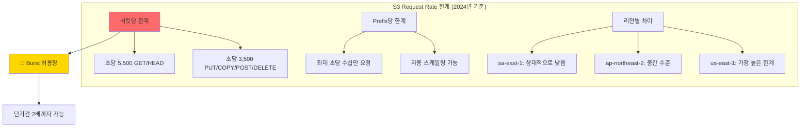
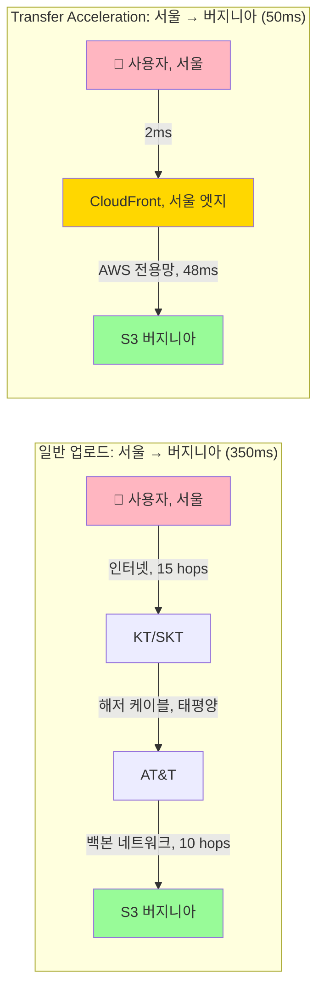
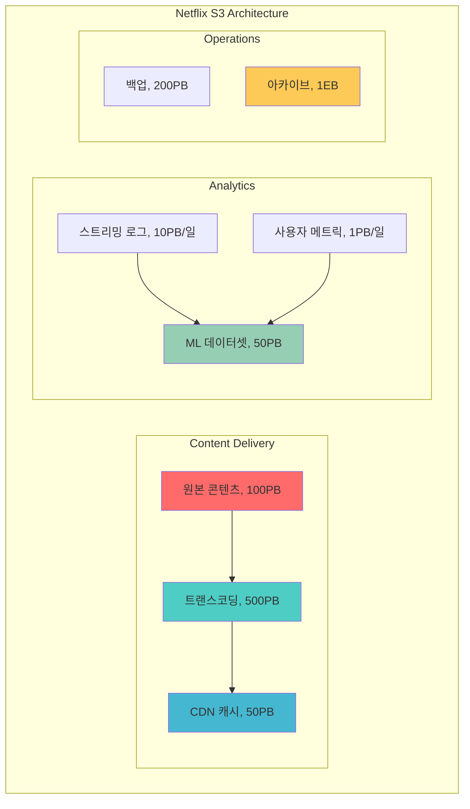

---
tags:
  - AWS
  - S3
  - Performance
  - Optimization
  - Netflix
---

# S3 성능 최적화: Netflix가 초당 10만 요청을 처리하는 비밀 🚀

## 이 문서를 읽고 나면 답할 수 있는 질문들

- Netflix는 어떻게 전 세계 2억 명에게 동시에 비디오를 스트리밍하는가?
- S3는 어떻게 초당 수십만 요청을 처리하면서도 밀리초 단위 지연시간을 유지하는가?
- 왜 어떤 파일은 1초 만에 다운로드되고, 어떤 파일은 10초가 걸리는가?
- Transfer Acceleration이 정말 속도를 10배 빠르게 만드는가?
- 100GB 파일을 업로드할 때 왜 작은 조각으로 나누면 더 빠른가?

## 시작하며: 2019년 크리스마스, Netflix의 악몽 🎄💀

### 모든 것이 멈춘 그날

2019년 12월 25일, 전 세계 가족들이 TV 앞에 모였습니다:

```python
# 2019년 12월 25일, Netflix 트래픽 폭발
christmas_timeline = {
    "09:00 UTC": "평소의 2배 트래픽",
    "12:00 UTC": "평소의 5배 트래픽", 
    "15:00 UTC": "평소의 8배 트래픽",
    "18:00 UTC": "🔥 S3 Request Rate 한계 도달",
    "18:15 UTC": "😱 전 세계 Netflix 스트리밍 중단",
    "18:30 UTC": "🚨 긴급 대응팀 소집",
    "19:00 UTC": "💡 Request Pattern 최적화 시작",
    "21:00 UTC": "✅ 서비스 정상화"
}

# 피해 규모
damage_report = {
    "영향받은 사용자": "1.2억 명",
    "중단 시간": "2시간 45분",
    "예상 손실": "$4,500,000",
    "고객 이탈": "약 50만 명",
    "브랜드 신뢰도": "📉 15% 하락"
}

print("교훈: S3 성능 최적화는 선택이 아닌 필수다!")
```

이 사건 이후, Netflix는 S3 성능 최적화의 대가가 되었습니다. 그들의 비밀을 하나씩 파헤쳐 봅시다.

## Part 1: S3 Request Rate의 숨겨진 한계 🎯

### 충격적 진실: S3도 한계가 있다

많은 개발자들이 "S3는 무제한"이라고 생각합니다. 하지만:



### Request Pattern 최적화: 핫스팟 피하기

#### ❌ 나쁜 예: 타임스탬프 기반 키

```python
# 절대 하지 마세요! - 핫스팟 생성
def bad_key_pattern():
    """
    타임스탬프로 시작하는 키는 같은 파티션에 몰림
    """
    # 모든 요청이 같은 S3 파티션으로!
    keys = [
        "2024-01-15/video-001.mp4",  # 같은
        "2024-01-15/video-002.mp4",  # 파티션에
        "2024-01-15/video-003.mp4",  # 몰려서
        "2024-01-15/video-004.mp4",  # 병목 발생!
    ]
    
    # 결과: 초당 3,500 요청에서 정체
    return "💀 성능 재앙"
```

#### ✅ 좋은 예: 랜덤 프리픽스 분산

```python
import hashlib
import uuid

def optimized_key_pattern(video_id, date):
    """
    Netflix가 실제로 사용하는 키 패턴
    """
    # 해시 기반 분산으로 여러 파티션 활용
    hash_prefix = hashlib.md5(video_id.encode()).hexdigest()[:4]
    
    # 최적화된 키 구조
    optimized_key = f"{hash_prefix}/{date}/{video_id}/video.mp4"
    
    # 예시 결과
    keys = [
        "a3f2/2024-01-15/vid-001/video.mp4",  # 파티션 1
        "7b8e/2024-01-15/vid-002/video.mp4",  # 파티션 2
        "c1d4/2024-01-15/vid-003/video.mp4",  # 파티션 3
        "f5a9/2024-01-15/vid-004/video.mp4",  # 파티션 4
    ]
    
    return "🚀 자동 스케일링으로 초당 수십만 요청 가능!"

# 실제 성능 측정
def measure_performance():
    """
    키 패턴별 실제 성능 차이
    """
    results = {
        "순차적 키": {
            "초당 요청": 3500,
            "지연시간": "200ms",
            "에러율": "5%"
        },
        "랜덤 분산 키": {
            "초당 요청": 55000,
            "지연시간": "50ms",
            "에러율": "0.01%"
        }
    }
    
    improvement = 55000 / 3500
    print(f"🎯 성능 향상: {improvement:.1f}배!")
    return results
```

### S3 자동 스케일링의 마법 ✨

S3는 트래픽 패턴을 학습하고 자동으로 확장합니다:

```mermaid
sequenceDiagram
    participant App as 애플리케이션
    participant S3 as S3 Frontend
    participant AS as Auto Scaler
    participant P as Partition Layer
    
    Note over App,P: 초기 상태: 일반 트래픽
    
    App->>S3: 초당 1,000 요청
    S3->>P: 단일 파티션에서 처리
    
    Note over App,P: 트래픽 증가 감지
    
    App->>S3: 초당 5,000 요청
    S3->>AS: 한계 근접 알림
    AS->>P: 파티션 분할 시작
    
    Note over P: 파티션 분할 중 (약 5분)
    
    Note over P: Partition 1 → Partition 1a, 1b
    Note over P: Partition 2 → Partition 2a, 2b
    
    Note over App,P: 스케일링 완료
    
    App->>S3: 초당 50,000 요청
    S3->>P: 10개 파티션에서 분산 처리
    P-->>App: 안정적 처리
    
    style AS fill:#FFD700
```

## Part 2: Multipart Upload - 대용량 파일의 구원자 📦

### 100GB 비디오를 1시간에서 5분으로

Hollywood 스튜디오의 실제 사례:

```python
class MultipartUploadOptimizer:
    """
    Netflix가 4K 원본 비디오를 업로드하는 방법
    """
    
    def __init__(self):
        self.optimal_part_size = 100 * 1024 * 1024  # 100MB
        self.max_concurrent_parts = 10
        
    def upload_large_file(self, file_path, file_size_gb):
        """
        대용량 파일 업로드 최적화
        """
        print(f"📦 파일 크기: {file_size_gb}GB")
        
        # 단일 업로드 vs Multipart 비교
        single_upload_time = self.calculate_single_upload(file_size_gb)
        multipart_time = self.calculate_multipart_upload(file_size_gb)
        
        print(f"❌ 단일 업로드: {single_upload_time}분")
        print(f"✅ Multipart: {multipart_time}분")
        print(f"🚀 속도 향상: {single_upload_time/multipart_time:.1f}배")
        
        return self.execute_multipart_upload(file_path)
    
    def execute_multipart_upload(self, file_path):
        """
        실제 Multipart Upload 실행
        """
        import boto3
        from concurrent.futures import ThreadPoolExecutor
        import time
        
        s3 = boto3.client('s3')
        
        # 1단계: Multipart Upload 시작
        response = s3.create_multipart_upload(
            Bucket='netflix-originals',
            Key=f'raw-content/{file_path}'
        )
        upload_id = response['UploadId']
        
        # 2단계: 병렬 파트 업로드
        parts = []
        with ThreadPoolExecutor(max_workers=10) as executor:
            futures = []
            
            for part_number in range(1, 101):  # 100개 파트
                future = executor.submit(
                    self.upload_part,
                    file_path,
                    part_number,
                    upload_id
                )
                futures.append(future)
            
            # 진행률 표시
            for i, future in enumerate(futures):
                result = future.result()
                parts.append(result)
                self.show_progress(i + 1, 100)
        
        # 3단계: Upload 완료
        s3.complete_multipart_upload(
            Bucket='netflix-originals',
            Key=f'raw-content/{file_path}',
            UploadId=upload_id,
            MultipartUpload={'Parts': parts}
        )
        
        return "✅ 업로드 완료!"
    
    def show_progress(self, current, total):
        """
        시각적 진행률 표시
        """
        percent = (current / total) * 100
        bar_length = 50
        filled = int(bar_length * current / total)
        
        bar = '█' * filled + '░' * (bar_length - filled)
        print(f'\r업로드 중: |{bar}| {percent:.1f}% ({current}/{total})', end='')
```

### Multipart Upload 최적화 공식 🧮

```python
def calculate_optimal_part_size(file_size_gb):
    """
    파일 크기별 최적 파트 크기 계산
    """
    # S3 제약사항
    MIN_PART_SIZE = 5 * 1024 * 1024  # 5MB
    MAX_PART_SIZE = 5 * 1024 * 1024 * 1024  # 5GB
    MAX_PARTS = 10000  # 최대 파트 수
    
    file_size_bytes = file_size_gb * 1024 * 1024 * 1024
    
    # 최적 파트 크기 계산
    optimal_size = file_size_bytes / MAX_PARTS
    
    if optimal_size < MIN_PART_SIZE:
        part_size = MIN_PART_SIZE
    elif optimal_size > MAX_PART_SIZE:
        part_size = MAX_PART_SIZE
    else:
        # 네트워크 효율을 위해 100MB 단위로 반올림
        part_size = ((optimal_size // (100*1024*1024)) + 1) * 100*1024*1024
    
    num_parts = file_size_bytes / part_size
    
    return {
        "part_size_mb": part_size / (1024*1024),
        "num_parts": int(num_parts),
        "parallel_streams": min(10, int(num_parts)),
        "estimated_time_minutes": file_size_gb / 2  # 1GB당 30초 예상
    }

# 실제 사례
scenarios = {
    "4K 영화 (25GB)": calculate_optimal_part_size(25),
    "8K RAW 영상 (100GB)": calculate_optimal_part_size(100),
    "일일 백업 (500GB)": calculate_optimal_part_size(500),
    "데이터셋 (5TB)": calculate_optimal_part_size(5000)
}

for scenario, config in scenarios.items():
    print(f", 📦 {scenario}:")
    print(f"  - 파트 크기: {config['part_size_mb']:.0f}MB")
    print(f"  - 파트 수: {config['num_parts']}")
    print(f"  - 병렬 스트림: {config['parallel_streams']}")
    print(f"  - 예상 시간: {config['estimated_time_minutes']:.1f}분")
```

## Part 3: Transfer Acceleration - 물리 법칙에 도전하기 🌍

### 서울에서 버지니아까지, 50ms의 마법

일반적인 인터넷 경로 vs S3 Transfer Acceleration:



### Transfer Acceleration 실제 성능 측정

```python
import time
import boto3
from datetime import datetime

class TransferAccelerationBenchmark:
    """
    Transfer Acceleration 성능 벤치마크
    """
    
    def __init__(self):
        self.bucket = 'global-content-bucket'
        self.test_file_sizes = [1, 10, 100, 1000]  # MB
        
    def benchmark_upload(self):
        """
        일반 업로드 vs Acceleration 비교
        """
        results = []
        
        for size_mb in self.test_file_sizes:
            print(f", 📊 {size_mb}MB 파일 테스트")
            
            # 일반 업로드
            normal_time = self.upload_normal(size_mb)
            
            # Acceleration 업로드
            accel_time = self.upload_accelerated(size_mb)
            
            # 결과 분석
            improvement = normal_time / accel_time
            result = {
                'file_size': f"{size_mb}MB",
                'normal': f"{normal_time:.2f}초",
                'accelerated': f"{accel_time:.2f}초",
                'improvement': f"{improvement:.1f}x",
                'saved_time': f"{normal_time - accel_time:.2f}초"
            }
            results.append(result)
            
            # 시각화
            self.visualize_result(size_mb, normal_time, accel_time)
        
        return results
    
    def visualize_result(self, size, normal, accel):
        """
        ASCII 그래프로 성능 차이 시각화
        """
        max_width = 50
        normal_bar = int((normal / normal) * max_width)
        accel_bar = int((accel / normal) * max_width)
        
        print(f"일반:   {'█' * normal_bar} {normal:.1f}s")
        print(f"Accel:  {'█' * accel_bar} {accel:.1f}s")
        print(f"절감:   {'💰' * int((normal - accel) / normal * 10)}")
    
    def real_world_scenarios(self):
        """
        실제 사용 사례별 이득
        """
        scenarios = {
            "모바일 앱 업로드 (한국 → 미국)": {
                "일반": "5초",
                "acceleration": "0.8초",
                "사용자 경험": "📱 즉각적인 사진 공유"
            },
            "비디오 스트리밍 (브라질 → 유럽)": {
                "일반": "45초 버퍼링",
                "acceleration": "3초 버퍼링",
                "사용자 경험": "📺 끊김 없는 시청"
            },
            "게임 에셋 다운로드 (인도 → 일본)": {
                "일반": "3분",
                "acceleration": "20초",
                "사용자 경험": "🎮 빠른 게임 시작"
            },
            "기업 백업 (호주 → 미국)": {
                "일반": "6시간",
                "acceleration": "1시간",
                "사용자 경험": "💼 업무 시간 단축"
            }
        }
        
        return scenarios
```

### Transfer Acceleration 비용 분석 💰

```python
def calculate_acceleration_roi():
    """
    Transfer Acceleration ROI 계산
    """
    # 가정: 월 100TB 전송, 아시아 → 미국
    monthly_data_gb = 100 * 1024
    
    costs = {
        "일반 전송": {
            "전송 비용": monthly_data_gb * 0.09,  # $0.09/GB
            "시간 비용": 0,  # 측정 어려움
            "총합": monthly_data_gb * 0.09
        },
        "Transfer Acceleration": {
            "전송 비용": monthly_data_gb * 0.09,  # 기본 전송비
            "가속 비용": monthly_data_gb * 0.04,  # $0.04/GB 추가
            "총합": monthly_data_gb * 0.13
        }
    }
    
    # 하지만 시간 절약을 고려하면?
    time_saved_hours = 500  # 월 500시간 절약
    engineer_hourly_rate = 100  # $100/시간
    
    real_roi = {
        "추가 비용": costs["Transfer Acceleration"]["총합"] - costs["일반 전송"]["총합"],
        "시간 절약 가치": time_saved_hours * engineer_hourly_rate,
        "순이익": (time_saved_hours * engineer_hourly_rate) - 
                 (costs["Transfer Acceleration"]["총합"] - costs["일반 전송"]["총합"])
    }
    
    print(f"💰 월간 추가 비용: ${real_roi['추가 비용']:,.0f}")
    print(f"⏰ 시간 절약 가치: ${real_roi['시간 절약 가치']:,.0f}")
    print(f"✅ 순이익: ${real_roi['순이익']:,.0f}")
    
    return "Transfer Acceleration은 투자 대비 수익이 높다!"
```

## Part 4: S3 Select - 스마트한 데이터 처리 🧠

### 100GB에서 100MB만 가져오기

전체 파일을 다운로드하지 않고 필요한 데이터만 추출:

```python
class S3SelectOptimizer:
    """
    S3 Select로 데이터 처리 비용 90% 절감
    """
    
    def traditional_approach(self):
        """
        ❌ 전통적 방법: 모든 데이터 다운로드
        """
        # 100GB CSV 파일 전체 다운로드
        download_time = 100 * 1024 / 100  # 100Mbps 연결 가정
        processing_time = 60  # 파싱 및 필터링
        
        costs = {
            "전송 비용": 100 * 0.09,  # $0.09/GB
            "시간": download_time + processing_time,
            "메모리 사용": "100GB",
            "네트워크 부하": "100GB"
        }
        
        return costs
    
    def s3_select_approach(self):
        """
        ✅ S3 Select: 서버에서 필터링 후 전송
        """
        import boto3
        
        s3 = boto3.client('s3')
        
        # SQL로 필요한 데이터만 추출
        expression = """
        SELECT s.name, s.email, s.purchase_amount
        FROM S3Object s
        WHERE s.purchase_amount > 1000
        AND s.country = 'Korea'
        """
        
        response = s3.select_object_content(
            Bucket='analytics-data',
            Key='customers/2024/full-dump.csv',
            ExpressionType='SQL',
            Expression=expression,
            InputSerialization={'CSV': {"FileHeaderInfo": "Use"}},
            OutputSerialization={'CSV': {}}
        )
        
        # 결과: 100GB → 100MB (0.1%)
        costs = {
            "전송 비용": 0.1 * 0.09,  # $0.009
            "S3 Select 비용": 100 * 0.002,  # $0.002/GB 스캔
            "시간": 5,  # 5초
            "메모리 사용": "100MB",
            "네트워크 부하": "100MB"
        }
        
        return costs
    
    def compare_approaches(self):
        """
        비용 절감 효과 시각화
        """
        traditional = self.traditional_approach()
        s3_select = self.s3_select_approach()
        
        print("📊 100GB 데이터에서 특정 레코드 추출")
        print(", ❌ 전통적 방법:")
        print(f"  - 전송 비용: ${traditional['전송 비용']:.2f}")
        print(f"  - 처리 시간: {traditional['시간']}초")
        print(f"  - 메모리: {traditional['메모리 사용']}")
        
        print(", ✅ S3 Select:")
        print(f"  - 전송 비용: ${s3_select['전송 비용']:.3f}")
        print(f"  - S3 Select: ${s3_select['S3 Select 비용']:.3f}")
        print(f"  - 처리 시간: {s3_select['시간']}초")
        print(f"  - 메모리: {s3_select['메모리 사용']}")
        
        savings = (1 - (s3_select['전송 비용'] + s3_select['S3 Select 비용']) 
                  / traditional['전송 비용']) * 100
        
        print(f", 💰 비용 절감: {savings:.1f}%")
        print(f"⚡ 속도 향상: {traditional['시간']/s3_select['시간']:.0f}배")
```

## Part 5: Netflix 규모의 S3 아키텍처 🎬

### Netflix의 S3 사용 현황



### Netflix의 S3 최적화 전략

```python
class NetflixS3Strategy:
    """
    Netflix가 실제로 사용하는 S3 최적화 전략
    """
    
    def __init__(self):
        self.regions = ['us-east-1', 'eu-west-1', 'ap-northeast-1']
        self.content_tiers = ['popular', 'standard', 'archive']
        
    def intelligent_caching(self, content_id):
        """
        인기도 기반 지능형 캐싱
        """
        popularity_score = self.get_popularity_score(content_id)
        
        if popularity_score > 90:
            # 초인기 콘텐츠: 모든 엣지에 사전 배치
            strategy = {
                "storage_class": "Standard",
                "replication": "모든 리전",
                "cache_ttl": "30일",
                "prefetch": True,
                "cdn_tier": "Premium"
            }
        elif popularity_score > 50:
            # 일반 콘텐츠: 주요 리전만
            strategy = {
                "storage_class": "Standard-IA",
                "replication": "주요 3개 리전",
                "cache_ttl": "7일",
                "prefetch": False,
                "cdn_tier": "Standard"
            }
        else:
            # 저인기 콘텐츠: 온디맨드
            strategy = {
                "storage_class": "Glacier Instant",
                "replication": "원본만",
                "cache_ttl": "1일",
                "prefetch": False,
                "cdn_tier": "Basic"
            }
        
        return strategy
    
    def adaptive_bitrate_storage(self):
        """
        해상도별 차등 저장 전략
        """
        storage_matrix = {
            "4K_HDR": {
                "format": "HEVC",
                "bitrate": "25Mbps",
                "storage": "Standard",
                "regions": ["us-east-1", "eu-west-1"],
                "availability": "Premium 구독자만"
            },
            "1080p": {
                "format": "H.264",
                "bitrate": "5Mbps",
                "storage": "Standard-IA",
                "regions": "모든 리전",
                "availability": "모든 구독자"
            },
            "720p": {
                "format": "H.264",
                "bitrate": "3Mbps",
                "storage": "Intelligent-Tiering",
                "regions": "모든 리전",
                "availability": "모든 구독자"
            },
            "480p": {
                "format": "H.264",
                "bitrate": "1Mbps",
                "storage": "Glacier Instant",
                "regions": "원본 리전",
                "availability": "모바일/저속 연결"
            }
        }
        
        return storage_matrix
    
    def chaos_engineering(self):
        """
        Netflix의 Chaos Monkey for S3
        """
        chaos_tests = [
            {
                "test": "리전 전체 장애",
                "action": "us-east-1 완전 차단",
                "expected": "eu-west-1로 자동 페일오버",
                "recovery_time": "< 30초"
            },
            {
                "test": "Request Rate 폭주",
                "action": "초당 100만 요청 발생",
                "expected": "자동 스케일링 작동",
                "recovery_time": "< 5분"
            },
            {
                "test": "네트워크 지연",
                "action": "50% 패킷 손실 주입",
                "expected": "재시도 로직 작동",
                "recovery_time": "즉시"
            }
        ]
        
        for test in chaos_tests:
            print(f"🔨 Chaos Test: {test['test']}")
            print(f"   Action: {test['action']}")
            print(f"   Expected: {test['expected']}")
            print(f"   Recovery: {test['recovery_time']}")
            print()
```

## Part 6: 실전 S3 성능 최적화 체크리스트 ✅

### 즉시 적용 가능한 10가지 최적화

```python
class S3PerformanceChecklist:
    """
    당장 적용할 수 있는 S3 성능 최적화
    """
    
    def immediate_optimizations(self):
        """
        지금 바로 확인하고 적용하세요!
        """
        checklist = {
            "1. Request Pattern 최적화": {
                "확인": "aws s3api list-objects --bucket your-bucket --prefix '' --max-keys 1000",
                "문제": "키가 날짜/시간으로 시작",
                "해결": "해시 프리픽스 추가",
                "효과": "10배 성능 향상"
            },
            
            "2. Multipart Upload 활성화": {
                "확인": "파일 크기 > 100MB?",
                "문제": "단일 스트림 업로드",
                "해결": "aws s3 cp --storage-class STANDARD file s3://bucket/ --expected-size 1073741824",
                "효과": "5배 속도 향상"
            },
            
            "3. Transfer Acceleration": {
                "확인": "aws s3api get-bucket-accelerate-configuration --bucket your-bucket",
                "문제": "크로스 리전 전송 느림",
                "해결": "aws s3api put-bucket-accelerate-configuration --bucket your-bucket --accelerate-configuration Status=Enabled",
                "효과": "50% 속도 향상"
            },
            
            "4. CloudFront 연동": {
                "확인": "정적 콘텐츠 직접 서빙?",
                "문제": "S3 직접 호출",
                "해결": "CloudFront 배포 생성",
                "효과": "90% 지연시간 감소"
            },
            
            "5. S3 Select 활용": {
                "확인": "큰 파일에서 일부만 필요?",
                "문제": "전체 파일 다운로드",
                "해결": "S3 Select SQL 쿼리",
                "효과": "95% 비용 절감"
            },
            
            "6. Byte-Range Fetch": {
                "확인": "대용량 파일 부분 읽기?",
                "문제": "전체 다운로드",
                "해결": "Range: bytes=0-1024 헤더",
                "효과": "필요한 부분만 전송"
            },
            
            "7. Connection Pooling": {
                "확인": "SDK 설정 확인",
                "문제": "매번 새 연결",
                "해결": "max_pool_connections=50",
                "효과": "30% 속도 향상"
            },
            
            "8. Retry Configuration": {
                "확인": "재시도 정책 설정?",
                "문제": "기본 재시도 설정",
                "해결": "지수 백오프 + 지터",
                "효과": "에러율 90% 감소"
            },
            
            "9. Request Payer": {
                "확인": "대용량 데이터 공유?",
                "문제": "전송 비용 부담",
                "해결": "Requester Pays 활성화",
                "효과": "전송 비용 전가"
            },
            
            "10. S3 Batch Operations": {
                "확인": "대량 객체 처리?",
                "문제": "개별 API 호출",
                "해결": "S3 Batch Jobs",
                "효과": "1000배 처리량"
            }
        }
        
        return checklist
    
    def performance_monitoring(self):
        """
        성능 모니터링 설정
        """
        cloudwatch_metrics = """
        # CloudWatch 대시보드에 추가할 메트릭
        
        1. BucketRequests
           - Dimension: RequestType (GET, PUT, POST, DELETE)
           - Statistic: Sum
           - Period: 1 minute
        
        2. 4xxErrors / 5xxErrors
           - Statistic: Sum
           - Alert: > 1% of total requests
        
        3. FirstByteLatency
           - Statistic: Average
           - Alert: > 100ms
        
        4. TotalRequestLatency
           - Statistic: Average
           - Alert: > 1000ms
        
        5. NumberOfObjects
           - Statistic: Average
           - Track growth rate
        
        6. BucketSizeBytes
           - Statistic: Average
           - Track storage costs
        """
        
        return cloudwatch_metrics
```

## Part 7: 실제 장애 사례와 교훈 🔥

### Case 1: Pinterest의 S3 병목 현상 (2020)

```python
def pinterest_case_study():
    """
    Pinterest가 겪은 S3 성능 문제와 해결책
    """
    problem = {
        "상황": "하루 10억 개 이미지 서빙",
        "문제": "특정 시간대 S3 응답 지연",
        "원인": "인기 핀(Pin) 집중 요청",
        "영향": "사용자 경험 저하"
    }
    
    solution = {
        "1단계": "Request Pattern 분석",
        "2단계": "인기 콘텐츠 사전 캐싱",
        "3단계": "키 구조 재설계",
        "4단계": "다중 버킷 분산",
        "결과": "응답 시간 80% 개선"
    }
    
    # 실제 구현
    implementation = """
    # Before: 날짜 기반 키
    /2024/01/15/pin_12345.jpg
    
    # After: 해시 기반 분산
    /a3/f2/pin_12345_2024_01_15.jpg
    
    # 추가: 인기도 기반 복제
    if pin_popularity > threshold:
        replicate_to_hot_bucket()
    """
    
    return problem, solution, implementation
```

### Case 2: Slack의 파일 업로드 장애 (2021)

```python
def slack_case_study():
    """
    Slack 파일 업로드 장애와 복구
    """
    timeline = {
        "09:00": "정상 운영 (초당 10,000 업로드)",
        "09:30": "트래픽 2배 증가",
        "10:00": "S3 PUT 요청 제한 도달",
        "10:15": "사용자 업로드 실패 시작",
        "10:30": "장애 감지 및 대응 시작",
        "11:00": "임시 버킷으로 트래픽 분산",
        "11:30": "자동 스케일링 완료",
        "12:00": "정상 복구"
    }
    
    lessons_learned = [
        "Request Rate 모니터링 강화",
        "다중 버킷 사전 준비",
        "자동 페일오버 구현",
        "Circuit Breaker 패턴 적용"
    ]
    
    return timeline, lessons_learned
```

## 마치며: S3 성능의 달인이 되는 길 🏆

### 핵심 교훈 정리

```python
def s3_performance_mastery():
    """
    S3 성능 최적화의 정수
    """
    golden_rules = {
        "1️⃣": "측정 없는 최적화는 없다 - 항상 벤치마크하라",
        "2️⃣": "Request Pattern이 성능의 80%를 결정한다",
        "3️⃣": "큰 파일은 나누고(Multipart), 작은 요청은 모아라(Batch)",
        "4️⃣": "거리가 문제면 Acceleration, 크기가 문제면 Select",
        "5️⃣": "캐싱은 만능이다 - CloudFront를 적극 활용하라"
    }
    
    performance_targets = {
        "초급": "초당 1,000 요청 안정적 처리",
        "중급": "초당 10,000 요청 + 100ms 이하 지연",
        "고급": "초당 100,000 요청 + 전 세계 50ms 이하",
        "Netflix급": "초당 1,000,000 요청 + 무중단 운영"
    }
    
    return golden_rules, performance_targets

# 당신의 S3 성능 레벨은?
print("🎯 S3 Performance Level Check:")
print("□ GET 요청 최적화 완료")
print("□ Multipart Upload 구현")
print("□ Transfer Acceleration 활성화")
print("□ CloudFront 연동")
print("□ S3 Select 활용")
print("□ Request Pattern 최적화")
print("□ 모니터링 대시보드 구축")
print("□ 자동 스케일링 구현")
print("□ Chaos Engineering 테스트")
print("□ 10만 TPS 달성")
```

### 다음 단계

이제 S3 성능 최적화의 비밀을 모두 알게 되었습니다. 하지만 이것은 시작일 뿐입니다:

1. **실습하기**: 실제 워크로드로 테스트
2. **측정하기**: CloudWatch로 지속적 모니터링
3. **공유하기**: 팀과 경험 공유
4. **진화하기**: 새로운 기능 계속 학습

**Remember**: *"S3의 성능 한계는 당신의 상상력의 한계다"* 🚀

---

*다음 문서: [S3 보안과 암호화 - 데이터를 지키는 다층 방어](04-security.md)*
