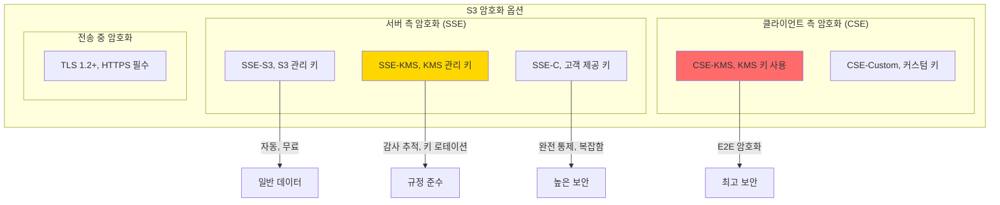

---
tags:
  - AWS
  - S3
  - Security
  - Encryption
  - DataProtection
---

# S3 보안과 암호화: Capital One은 어떻게 1억 명의 데이터를 유출했나? 🔐

## 이 문서를 읽고 나면 답할 수 있는 질문들

- Capital One은 어떻게 S3에서 1억 명의 데이터를 유출했나?
- 왜 S3 버킷의 99%가 잘못 구성되어 있는가?
- 암호화를 해도 데이터가 유출되는 이유는?
- Netflix는 어떻게 수천 개 버킷을 안전하게 관리하는가?
- 랜섬웨어가 S3 데이터를 암호화하면 어떻게 복구하나?

## 시작하며: 2019년 7월 29일, 1억 명의 악몽 💀

### Capital One 데이터 유출 사건 타임라인

```python
# 2019년 Capital One S3 데이터 유출 사건
breach_timeline = {
    "2019-03-22": "🚨 해커가 WAF 설정 오류 발견",
    "2019-03-22~23": "⚡ SSRF 공격으로 EC2 메타데이터 접근",
    "2019-03-23": "🔑 EC2 IAM Role 크레덴셜 탈취",
    "2019-03-23~04-21": "💾 S3에서 700개 폴더, 1억 6백만 명 데이터 유출",
    "2019-07-17": "📧 해커가 GitHub에 데이터 일부 공개",
    "2019-07-19": "🚔 Capital One 사건 인지",
    "2019-07-29": "📢 공식 발표",
    "2019-07-30": "📉 주가 6% 폭락",
    "2020-08-06": "💰 8천만 달러 벌금"
}

# 유출된 데이터
leaked_data = {
    "영향받은 고객": "1억 6백만 명",
    "신용카드 신청서": "1억 건",
    "사회보장번호": "14만 개",
    "은행 계좌번호": "8만 개",
    "캐나다 SIN": "100만 개"
}

print("😱 교훈: S3 보안은 단순히 암호화만의 문제가 아니다!")
```

### 공격이 어떻게 가능했나?

```mermaid
sequenceDiagram
    participant H as 해커
    participant WAF as Web Application Firewall
    participant EC2 as EC2 Instance
    participant MD as EC2 Metadata Service
    participant S3 as S3 Bucket
    
    Note over H,S3: 1단계: 진입점 찾기
    H->>WAF: 설정 오류 발견
    WAF->>EC2: SSRF 취약점 악용
    
    Note over H,S3: 2단계: 권한 탈취
    EC2->>MD: curl 169.254.169.254 메타데이터 요청
    MD-->>EC2: IAM Role 크레덴셜 반환
    EC2-->>H: AWS Access Key 및 Token
    
    Note over H,S3: 3단계: 데이터 유출
    H->>S3: Data download command
    S3-->>H: 데이터 유출 완료
    
    style H fill:#FF6B6B
    style S3 fill:#FF6B6B
```

## Part 1: S3 보안의 3중 방어선 🛡️

### Layer 1: Identity and Access Management (IAM)

```python
class S3SecurityLayers:
    """
    S3 보안의 다층 방어 시스템
    """
    
    def layer1_iam_defense(self):
        """
        첫 번째 방어선: IAM 정책
        """
        # ❌ 잘못된 IAM 정책 (Capital One의 실수)
        bad_policy = {
            "Version": "2012-10-17",
            "Statement": [{
                "Effect": "Allow",
                "Action": "s3:*",  # 😱 모든 S3 작업 허용!
                "Resource": "*"     # 😱 모든 버킷에 대해!
            }]
        }
        
        # ✅ 올바른 IAM 정책 (최소 권한 원칙)
        good_policy = {
            "Version": "2012-10-17",
            "Statement": [
                {
                    "Effect": "Allow",
                    "Action": [
                        "s3:GetObject",  # 읽기만
                        "s3:ListBucket"  # 목록만
                    ],
                    "Resource": [
                        "arn:aws:s3:::specific-bucket/*",  # 특정 버킷만
                        "arn:aws:s3:::specific-bucket"
                    ],
                    "Condition": {
                        "IpAddress": {
                            "aws:SourceIp": ["10.0.0.0/8"]  # 내부 IP만
                        },
                        "StringEquals": {
                            "s3:x-amz-server-side-encryption": "AES256"  # 암호화 필수
                        }
                    }
                }
            ]
        }
        
        return bad_policy, good_policy
    
    def layer2_bucket_policy(self):
        """
        두 번째 방어선: 버킷 정책
        """
        # 공개 접근 완전 차단
        block_public_access = {
            "BlockPublicAcls": True,
            "IgnorePublicAcls": True,
            "BlockPublicPolicy": True,
            "RestrictPublicBuckets": True
        }
        
        # MFA 필수 삭제 정책
        require_mfa_delete = {
            "Version": "2012-10-17",
            "Statement": [{
                "Effect": "Deny",
                "Principal": "*",
                "Action": "s3:DeleteObject",
                "Resource": "arn:aws:s3:::critical-data/*",
                "Condition": {
                    "Bool": {
                        "aws:MultiFactorAuthPresent": "false"
                    }
                }
            }]
        }
        
        return block_public_access, require_mfa_delete
    
    def layer3_encryption(self):
        """
        세 번째 방어선: 암호화
        """
        encryption_options = {
            "SSE-S3": {
                "설명": "S3 관리 키 암호화",
                "키 관리": "AWS",
                "비용": "무료",
                "사용 사례": "기본 보안"
            },
            "SSE-KMS": {
                "설명": "KMS 키 암호화",
                "키 관리": "사용자",
                "비용": "$0.03/10,000 요청",
                "사용 사례": "규정 준수, 감사"
            },
            "SSE-C": {
                "설명": "고객 제공 키 암호화",
                "키 관리": "고객",
                "비용": "무료",
                "사용 사례": "완전한 통제"
            },
            "CSE": {
                "설명": "클라이언트 측 암호화",
                "키 관리": "고객",
                "비용": "무료",
                "사용 사례": "최고 수준 보안"
            }
        }
        
        return encryption_options
```

### 실제 공격 시나리오와 방어

```python
class RealWorldAttackScenarios:
    """
    실제 발생한 S3 공격과 방어 방법
    """
    
    def scenario1_public_bucket_exposure(self):
        """
        시나리오 1: 실수로 공개된 버킷
        """
        print("🎭 시나리오: 개발자가 테스트 중 버킷을 공개로 설정")
        
        # 공격자의 스캔
        attack = """
        # 공격자는 자동화 도구로 공개 버킷 스캔
        import boto3
        
        def scan_public_buckets():
            common_names = ['backup', 'data', 'logs', 'uploads']
            companies = ['tesla', 'uber', 'netflix', 'apple']
            
            for company in companies:
                for name in common_names:
                    bucket = f"{company}-{name}"
                    try:
                        # 공개 버킷 확인
                        response = requests.get(f"http://{bucket}.s3.amazonaws.com")
                        if response.status_code == 200:
                            print(f"🎯 공개 버킷 발견: {bucket}")
                    except:
                        pass
        """
        
        # 방어 방법
        defense = """
        # AWS Config Rule으로 자동 감지
        aws configservice put-config-rule --config-rule '{
            "ConfigRuleName": "s3-bucket-public-read-prohibited",
            "Source": {
                "Owner": "AWS",
                "SourceIdentifier": "S3_BUCKET_PUBLIC_READ_PROHIBITED"
            }
        }'
        
        # Lambda로 자동 수정
        def auto_fix_public_bucket(event, context):
            s3 = boto3.client('s3')
            bucket = event['configurationItem']['resourceName']
            
            # 공개 접근 차단
            s3.put_public_access_block(
                Bucket=bucket,
                PublicAccessBlockConfiguration={
                    'BlockPublicAcls': True,
                    'IgnorePublicAcls': True,
                    'BlockPublicPolicy': True,
                    'RestrictPublicBuckets': True
                }
            )
            
            # 알림 발송
            sns.publish(
                TopicArn='arn:aws:sns:us-east-1:123456789012:security-alerts',
                Message=f'🚨 버킷 {bucket}의 공개 접근이 차단되었습니다'
            )
        """
        
        return attack, defense
    
    def scenario2_ransomware_attack(self):
        """
        시나리오 2: 랜섬웨어 공격
        """
        print("💀 시나리오: 공격자가 모든 S3 객체를 암호화")
        
        # 랜섬웨어 공격 시뮬레이션
        ransomware_attack = """
        # 공격자의 랜섬웨어 스크립트
        def encrypt_all_objects(stolen_credentials):
            s3 = boto3.client('s3', 
                aws_access_key_id=stolen_credentials['AccessKeyId'],
                aws_secret_access_key=stolen_credentials['SecretAccessKey']
            )
            
            # 모든 버킷의 모든 객체 암호화
            for bucket in s3.list_buckets()['Buckets']:
                for obj in s3.list_objects_v2(Bucket=bucket['Name'])['Contents']:
                    # 원본 다운로드
                    original = s3.get_object(Bucket=bucket['Name'], Key=obj['Key'])
                    
                    # 암호화 후 덮어쓰기
                    encrypted = ransomware_encrypt(original['Body'].read())
                    s3.put_object(
                        Bucket=bucket['Name'],
                        Key=obj['Key'],
                        Body=encrypted,
                        Metadata={'ransom': 'Pay 100 BTC to decrypt'}
                    )
                    
                    print(f"💀 암호화됨: {bucket['Name']}/{obj['Key']}")
        """
        
        # 방어 및 복구 전략
        defense_and_recovery = """
        # 1. MFA Delete 활성화 (삭제/수정 방지)
        aws s3api put-bucket-versioning \\
            --bucket critical-data \\
            --versioning-configuration Status=Enabled,MFADelete=Enabled \\
            --mfa "arn:aws:iam::123456789012:mfa/root-account-mfa-device 123456"
        
        # 2. Object Lock 설정 (WORM - Write Once Read Many)
        aws s3api put-object-lock-configuration \\
            --bucket critical-data \\
            --object-lock-configuration '{
                "ObjectLockEnabled": "Enabled",
                "Rule": {
                    "DefaultRetention": {
                        "Mode": "GOVERNANCE",
                        "Days": 30
                    }
                }
            }'
        
        # 3. 크로스 리전 복제 (격리된 백업)
        aws s3api put-bucket-replication \\
            --bucket critical-data \\
            --replication-configuration '{
                "Role": "arn:aws:iam::123456789012:role/replication-role",
                "Rules": [{
                    "ID": "ReplicateAll",
                    "Status": "Enabled",
                    "Priority": 1,
                    "DeleteMarkerReplication": { "Status": "Disabled" },
                    "Filter": {},
                    "Destination": {
                        "Bucket": "arn:aws:s3:::backup-bucket-different-account",
                        "ReplicationTime": {
                            "Status": "Enabled",
                            "Time": {
                                "Minutes": 15
                            }
                        }
                    }
                }]
            }'
        
        # 4. 랜섬웨어 공격 시 복구
        def recover_from_ransomware():
            s3 = boto3.client('s3')
            bucket = 'critical-data'
            
            # 모든 객체의 이전 버전으로 복원
            paginator = s3.get_paginator('list_object_versions')
            for page in paginator.paginate(Bucket=bucket):
                for version in page.get('Versions', []):
                    if 'ransom' not in version.get('Metadata', {}):
                        # 깨끗한 버전으로 복원
                        s3.copy_object(
                            Bucket=bucket,
                            Key=version['Key'],
                            CopySource={'Bucket': bucket, 'Key': version['Key'], 
                                       'VersionId': version['VersionId']}
                        )
                        print(f"✅ 복원됨: {version['Key']}")
        """
        
        return ransomware_attack, defense_and_recovery
```

## Part 2: S3 암호화의 모든 것 🔒

### 암호화 방식별 상세 분석



### 암호화 구현 실습

```python
class S3EncryptionImplementation:
    """
    S3 암호화 방식별 구현
    """
    
    def sse_s3_encryption(self):
        """
        SSE-S3: 가장 간단한 암호화
        """
        import boto3
        
        s3 = boto3.client('s3')
        
        # 버킷 기본 암호화 설정
        s3.put_bucket_encryption(
            Bucket='my-secure-bucket',
            ServerSideEncryptionConfiguration={
                'Rules': [{
                    'ApplyServerSideEncryptionByDefault': {
                        'SSEAlgorithm': 'AES256'
                    }
                }]
            }
        )
        
        # 파일 업로드 (자동 암호화)
        s3.put_object(
            Bucket='my-secure-bucket',
            Key='sensitive-data.json',
            Body=b'{"credit_card": "1234-5678-9012-3456"}',
            ServerSideEncryption='AES256'
        )
        
        print("✅ SSE-S3 암호화 완료 (AWS가 키 관리)")
    
    def sse_kms_encryption(self):
        """
        SSE-KMS: 감사 추적이 가능한 암호화
        """
        import boto3
        
        s3 = boto3.client('s3')
        kms = boto3.client('kms')
        
        # KMS 키 생성
        key_response = kms.create_key(
            Description='S3 암호화용 마스터 키',
            KeyUsage='ENCRYPT_DECRYPT',
            Origin='AWS_KMS'
        )
        kms_key_id = key_response['KeyMetadata']['KeyId']
        
        # KMS 키로 암호화
        s3.put_object(
            Bucket='my-secure-bucket',
            Key='top-secret.json',
            Body=b'{"nuclear_codes": "12345"}',
            ServerSideEncryption='aws:kms',
            SSEKMSKeyId=kms_key_id
        )
        
        # CloudTrail로 감사 추적
        audit_log = """
        {
            "eventTime": "2024-01-15T10:30:00Z",
            "eventName": "Decrypt",
            "userIdentity": {
                "principalId": "AIDAI23HXD2O5EXAMPLE",
                "accountId": "123456789012",
                "userName": "alice"
            },
            "requestParameters": {
                "keyId": "arn:aws:kms:us-east-1:123456789012:key/12345678"
            }
        }
        """
        
        print("✅ SSE-KMS 암호화 완료 (감사 추적 가능)")
        return audit_log
    
    def client_side_encryption(self):
        """
        CSE: 클라이언트 측 암호화 (최고 보안)
        """
        from cryptography.fernet import Fernet
        import boto3
        import base64
        
        # 로컬에서 암호화
        key = Fernet.generate_key()
        cipher = Fernet(key)
        
        sensitive_data = b'{"ssn": "123-45-6789", "salary": 1000000}'
        encrypted_data = cipher.encrypt(sensitive_data)
        
        # 암호화된 데이터를 S3에 업로드
        s3 = boto3.client('s3')
        s3.put_object(
            Bucket='my-secure-bucket',
            Key='ultra-secret.enc',
            Body=encrypted_data,
            Metadata={
                'x-amz-meta-client-side-encryption': 'true',
                'x-amz-meta-algorithm': 'Fernet'
            }
        )
        
        # 키는 별도로 안전하게 보관 (절대 S3에 저장 X)
        # AWS Secrets Manager 사용
        secrets = boto3.client('secretsmanager')
        secrets.create_secret(
            Name='s3-encryption-key',
            SecretString=base64.b64encode(key).decode()
        )
        
        print("✅ 클라이언트 측 암호화 완료 (E2E 보안)")
        print("🔑 키는 Secrets Manager에 별도 보관")
```

## Part 3: Netflix의 S3 보안 아키텍처 🎬

### Netflix가 수천 개 버킷을 관리하는 방법

```python
class NetflixS3Security:
    """
    Netflix의 S3 보안 자동화 시스템
    """
    
    def __init__(self):
        self.total_buckets = 5000
        self.total_objects = "100 trillion"
        self.daily_requests = "100 billion"
        
    def automated_security_scanning(self):
        """
        24/7 자동 보안 스캔
        """
        security_checks = {
            "공개 버킷 스캔": {
                "빈도": "5분마다",
                "도구": "AWS Config + Custom Lambda",
                "자동 조치": "즉시 차단 + 알림"
            },
            "과도한 권한 감지": {
                "빈도": "1시간마다",
                "도구": "AWS Access Analyzer",
                "자동 조치": "권한 축소 제안"
            },
            "암호화 확인": {
                "빈도": "실시간",
                "도구": "S3 이벤트 + Lambda",
                "자동 조치": "미암호화 객체 거부"
            },
            "이상 접근 패턴": {
                "빈도": "실시간",
                "도구": "ML 기반 이상 탐지",
                "자동 조치": "의심 계정 동결"
            }
        }
        
        return security_checks
    
    def zero_trust_architecture(self):
        """
        Netflix의 Zero Trust 모델
        """
        print("🔐 Netflix Zero Trust for S3")
        
        principles = """
        1. 절대 신뢰하지 않고, 항상 검증한다
        2. 최소 권한 원칙 (Least Privilege)
        3. 임시 크레덴셜만 사용 (15분 만료)
        4. 모든 접근 로깅 및 분석
        5. 컨텍스트 기반 접근 제어
        """
        
        implementation = {
            "인증": "mTLS + OAuth 2.0",
            "권한": "동적 IAM 정책 생성",
            "네트워크": "PrivateLink only",
            "감사": "모든 API 호출 기록",
            "암호화": "E2E 암호화 필수"
        }
        
        # 실제 구현 예시
        code_example = """
        def get_s3_access_token(user, context):
            # 1. 사용자 인증
            if not verify_user_identity(user):
                raise UnauthorizedException()
            
            # 2. 컨텍스트 검증
            risk_score = calculate_risk_score(context)
            if risk_score > 0.7:
                require_mfa(user)
            
            # 3. 임시 권한 생성
            policy = generate_least_privilege_policy(
                user=user,
                resource=context['requested_resource'],
                actions=context['requested_actions'],
                duration=min(context['requested_duration'], 900)  # 최대 15분
            )
            
            # 4. STS 토큰 발급
            sts = boto3.client('sts')
            token = sts.assume_role(
                RoleArn=f'arn:aws:iam::netflix:role/{user.role}',
                RoleSessionName=f'{user.id}-{timestamp}',
                Policy=json.dumps(policy),
                DurationSeconds=900
            )
            
            # 5. 감사 로그
            log_access_request(user, context, token)
            
            return token
        """
        
        return principles, implementation, code_example
```

## Part 4: S3 보안 모니터링과 알림 📊

### CloudWatch + CloudTrail 통합 모니터링

```python
class S3SecurityMonitoring:
    """
    S3 보안 이벤트 실시간 모니터링
    """
    
    def setup_cloudtrail_monitoring(self):
        """
        CloudTrail로 모든 S3 API 호출 추적
        """
        import boto3
        
        cloudtrail = boto3.client('cloudtrail')
        
        # S3 데이터 이벤트 로깅 설정
        cloudtrail.put_event_selectors(
            TrailName='s3-security-trail',
            EventSelectors=[{
                'ReadWriteType': 'All',
                'IncludeManagementEvents': True,
                'DataResources': [{
                    'Type': 'AWS::S3::Object',
                    'Values': ['arn:aws:s3:::*/*']  # 모든 버킷
                }]
            }]
        )
        
        # 위험한 API 호출 감지 규칙
        dangerous_api_calls = [
            'PutBucketPolicy',      # 버킷 정책 변경
            'PutBucketAcl',         # ACL 변경
            'DeleteBucket',         # 버킷 삭제
            'PutBucketPublicAccessBlock',  # 공개 접근 설정 변경
            'PutObjectAcl'          # 객체 ACL 변경
        ]
        
        return dangerous_api_calls
    
    def create_security_alarms(self):
        """
        보안 알람 생성
        """
        alarms = {
            "대량 다운로드 감지": {
                "metric": "BytesDownloaded",
                "threshold": "10GB in 5 minutes",
                "action": "Block IP + Alert Security Team"
            },
            "비정상 접근 패턴": {
                "metric": "4xxErrors",
                "threshold": "> 100 in 1 minute",
                "action": "Investigate Source"
            },
            "권한 에스컬레이션 시도": {
                "metric": "AccessDenied Events",
                "threshold": "> 10 from same principal",
                "action": "Freeze Account"
            },
            "데이터 유출 의심": {
                "metric": "GetObject from new IP",
                "threshold": "> 1000 objects",
                "action": "Immediate Investigation"
            }
        }
        
        # CloudWatch 알람 생성
        cloudwatch_alarm = """
        aws cloudwatch put-metric-alarm \\
            --alarm-name s3-mass-download-detection \\
            --alarm-description "Detect mass download from S3" \\
            --metric-name BytesDownloaded \\
            --namespace AWS/S3 \\
            --statistic Sum \\
            --period 300 \\
            --threshold 10737418240 \\
            --comparison-operator GreaterThanThreshold \\
            --evaluation-periods 1 \\
            --alarm-actions arn:aws:sns:us-east-1:123456789012:security-alerts
        """
        
        return alarms, cloudwatch_alarm
    
    def incident_response_playbook(self):
        """
        보안 사고 대응 플레이북
        """
        playbook = {
            "1분 이내": [
                "자동 알림 발송",
                "의심 계정 임시 차단",
                "증거 보존 시작"
            ],
            "5분 이내": [
                "보안팀 호출",
                "영향 범위 파악",
                "추가 확산 차단"
            ],
            "15분 이내": [
                "근본 원인 분석",
                "임시 패치 적용",
                "고객 영향 평가"
            ],
            "1시간 이내": [
                "완전 복구",
                "보안 강화",
                "사고 보고서 초안"
            ],
            "24시간 이내": [
                "전체 보안 감사",
                "영구 해결책 구현",
                "교훈 문서화"
            ]
        }
        
        return playbook
```

## Part 5: S3 보안 체크리스트 ✅

### 지금 바로 확인해야 할 10가지

```python
def s3_security_checklist():
    """
    S3 보안 필수 체크리스트
    """
    checklist = [
        {
            "항목": "공개 접근 차단 설정",
            "명령": "aws s3api get-public-access-block --bucket your-bucket",
            "기대값": "BlockPublicAcls: true, IgnorePublicAcls: true",
            "위험도": "🔴 Critical"
        },
        {
            "항목": "버킷 암호화 확인",
            "명령": "aws s3api get-bucket-encryption --bucket your-bucket",
            "기대값": "SSEAlgorithm: AES256 or aws:kms",
            "위험도": "🔴 Critical"
        },
        {
            "항목": "버킷 버저닝 활성화",
            "명령": "aws s3api get-bucket-versioning --bucket your-bucket",
            "기대값": "Status: Enabled",
            "위험도": "🟡 High"
        },
        {
            "항목": "MFA Delete 설정",
            "명령": "aws s3api get-bucket-versioning --bucket your-bucket",
            "기대값": "MFADelete: Enabled",
            "위험도": "🟡 High"
        },
        {
            "항목": "버킷 로깅 활성화",
            "명령": "aws s3api get-bucket-logging --bucket your-bucket",
            "기대값": "LoggingEnabled 설정됨",
            "위험도": "🟡 High"
        },
        {
            "항목": "CORS 설정 검토",
            "명령": "aws s3api get-bucket-cors --bucket your-bucket",
            "기대값": "필요한 도메인만 허용",
            "위험도": "🟠 Medium"
        },
        {
            "항목": "수명주기 정책 확인",
            "명령": "aws s3api get-bucket-lifecycle-configuration --bucket your-bucket",
            "기대값": "오래된 데이터 자동 삭제/아카이브",
            "위험도": "🟠 Medium"
        },
        {
            "항목": "Object Lock 설정",
            "명령": "aws s3api get-object-lock-configuration --bucket your-bucket",
            "기대값": "GOVERNANCE 또는 COMPLIANCE 모드",
            "위험도": "🟠 Medium"
        },
        {
            "항목": "복제 설정 확인",
            "명령": "aws s3api get-bucket-replication --bucket your-bucket",
            "기대값": "크로스 리전 복제 활성화",
            "위험도": "🟢 Low"
        },
        {
            "항목": "태그 정책 확인",
            "명령": "aws s3api get-bucket-tagging --bucket your-bucket",
            "기대값": "Environment, Owner, DataClassification 태그",
            "위험도": "🟢 Low"
        }
    ]
    
    # 자동화 스크립트
    automation_script = """
    #!/bin/bash
    # S3 보안 자동 점검 스크립트
    
    BUCKETS=$(aws s3api list-buckets --query 'Buckets[].Name' --output text)
    
    for BUCKET in $BUCKETS; do
        echo "🔍 Checking bucket: $BUCKET"
        
        # 공개 접근 확인
        PUBLIC=$(aws s3api get-public-access-block --bucket $BUCKET 2>/dev/null)
        if [ -z "$PUBLIC" ]; then
            echo "  ⚠️  WARNING: No public access block configured!"
        fi
        
        # 암호화 확인
        ENCRYPTION=$(aws s3api get-bucket-encryption --bucket $BUCKET 2>/dev/null)
        if [ -z "$ENCRYPTION" ]; then
            echo "  ⚠️  WARNING: No encryption configured!"
        fi
        
        # 버저닝 확인
        VERSIONING=$(aws s3api get-bucket-versioning --bucket $BUCKET --query 'Status' --output text)
        if [ "$VERSIONING" != "Enabled" ]; then
            echo "  ⚠️  WARNING: Versioning not enabled!"
        fi
        
        echo ""
    done
    """
    
    return checklist, automation_script

# 실행
checklist, script = s3_security_checklist()
print("📋 S3 보안 체크리스트 생성 완료")
print(f"✅ {len(checklist)}개 항목 확인 필요")
```

## Part 6: 실제 기업들의 S3 보안 사고 분석 💣

### Case Studies: 배워야 할 교훈들

```python
class S3SecurityBreaches:
    """
    실제 발생한 S3 보안 사고 분석
    """
    
    def case1_uber_2016(self):
        """
        Uber (2016): 5700만 명 데이터 유출
        """
        incident = {
            "피해 규모": "5700만 명 개인정보",
            "원인": "GitHub에 AWS 키 노출",
            "공격 방법": "GitHub 검색 → AWS 키 발견 → S3 접근",
            "손실": "$148M 벌금 + 브랜드 신뢰도 추락",
            "교훈": "절대 코드에 크레덴셜을 하드코딩하지 말 것"
        }
        
        prevention = """
        # Git 커밋 전 자동 검사
        # .pre-commit-config.yaml
        repos:
        - repo: https://github.com/Yelp/detect-secrets
          hooks:
          - id: detect-secrets
            args: ['--baseline', '.secrets.baseline']
        
        # AWS Secrets Manager 사용
        import boto3
        
        def get_secret():
            session = boto3.session.Session()
            client = session.client('secretsmanager')
            
            response = client.get_secret_value(SecretId='prod/s3/credentials')
            return json.loads(response['SecretString'])
        """
        
        return incident, prevention
    
    def case2_dow_jones_2017(self):
        """
        Dow Jones (2017): 220만 고객 데이터 노출
        """
        incident = {
            "피해 규모": "220만 명 고객 정보",
            "원인": "공개 읽기 권한 설정 실수",
            "노출 기간": "4개월",
            "발견 경로": "보안 연구원의 우연한 발견",
            "교훈": "기본값을 신뢰하지 말고 명시적으로 설정"
        }
        
        prevention = """
        # Organization 수준에서 공개 접근 차단
        aws organizations create-policy \\
            --content '{
                "Version": "2012-10-17",
                "Statement": [{
                    "Effect": "Deny",
                    "Action": [
                        "s3:PutBucketPublicAccessBlock",
                        "s3:PutAccountPublicAccessBlock"
                    ],
                    "Resource": "*",
                    "Condition": {
                        "Bool": {
                            "s3:BlockPublicAcls": "false"
                        }
                    }
                }]
            }' \\
            --description "Prevent disabling public access blocks" \\
            --name "EnforceS3PublicAccessBlock" \\
            --type "SERVICE_CONTROL_POLICY"
        """
        
        return incident, prevention
    
    def case3_tesla_2018(self):
        """
        Tesla (2018): 크립토재킹 공격
        """
        incident = {
            "공격 유형": "크립토재킹 (암호화폐 채굴)",
            "침입 경로": "Kubernetes 대시보드 → AWS 키 → S3",
            "영향": "컴퓨팅 리소스 도용 + 데이터 노출 위험",
            "탐지 시간": "수 개월",
            "교훈": "컨테이너 환경의 크레덴셜 관리 중요성"
        }
        
        prevention = """
        # IRSA (IAM Roles for Service Accounts) 사용
        apiVersion: v1
        kind: ServiceAccount
        metadata:
          name: s3-reader
          annotations:
            eks.amazonaws.com/role-arn: arn:aws:iam::123456789012:role/S3ReadOnlyRole
        
        ---
        # Pod에서 Service Account 사용
        apiVersion: v1
        kind: Pod
        metadata:
          name: app
        spec:
          serviceAccountName: s3-reader
          containers:
          - name: app
            image: myapp:latest
            # AWS SDK가 자동으로 IRSA 크레덴셜 사용
        """
        
        return incident, prevention
```

## 마무리: S3 보안의 황금률 🏆

### 기억해야 할 5가지 원칙

```python
def s3_security_golden_rules():
    """
    S3 보안의 절대 원칙
    """
    rules = {
        "1️⃣ 최소 권한 원칙": {
            "설명": "필요한 최소한의 권한만 부여",
            "구현": "IAM Policy Simulator로 항상 테스트",
            "예시": "GetObject만 필요하면 GetObject만 허용"
        },
        
        "2️⃣ 심층 방어": {
            "설명": "여러 보안 계층을 중첩",
            "구현": "IAM + Bucket Policy + Encryption + MFA",
            "예시": "암호화된 데이터도 접근 제어 필수"
        },
        
        "3️⃣ 감사와 모니터링": {
            "설명": "모든 접근을 기록하고 분석",
            "구현": "CloudTrail + CloudWatch + Access Analyzer",
            "예시": "이상 패턴 자동 감지 및 대응"
        },
        
        "4️⃣ 자동화": {
            "설명": "사람의 실수를 시스템으로 방지",
            "구현": "AWS Config Rules + Lambda 자동 수정",
            "예시": "공개 버킷 자동 차단"
        },
        
        "5️⃣ 정기 검토": {
            "설명": "보안은 일회성이 아닌 지속적 과정",
            "구현": "월간 보안 감사 + 침투 테스트",
            "예시": "사용하지 않는 권한 정기 제거"
        }
    }
    
    final_thoughts = """
    💡 Remember:
    
    "The best time to implement S3 security was when you created the bucket.
     The second best time is now."
    
    S3 보안 사고의 100%는 예방 가능했습니다.
    Capital One도, Uber도, Tesla도 모두 기본적인 실수였습니다.
    
    당신의 S3 버킷은 안전합니까?
    지금 바로 확인하세요. 🔒
    """
    
    return rules, final_thoughts

# 실행
rules, thoughts = s3_security_golden_rules()
print(thoughts)
```

### S3 보안 마스터가 되는 길

```python
def s3_security_mastery_path():
    """
    S3 보안 전문가 로드맵
    """
    roadmap = {
        "🥉 Bronze (1개월)": [
            "기본 IAM 정책 이해",
            "버킷 공개 접근 차단",
            "SSE-S3 암호화 적용",
            "CloudTrail 로깅 설정"
        ],
        
        "🥈 Silver (3개월)": [
            "KMS 키 관리 마스터",
            "버킷 정책 고급 활용",
            "VPC Endpoint 구성",
            "자동화 스크립트 작성"
        ],
        
        "🥇 Gold (6개월)": [
            "Zero Trust 아키텍처 구현",
            "ML 기반 이상 탐지",
            "Chaos Engineering 실습",
            "침투 테스트 수행"
        ],
        
        "💎 Diamond (1년+)": [
            "대규모 멀티 계정 보안",
            "규정 준수 자동화",
            "보안 프레임워크 설계",
            "보안 문화 확산"
        ]
    }
    
    return roadmap

print("🚀 당신의 S3 보안 여정이 시작됩니다!")
```

---

*"보안은 제품이 아니라 과정이다."* - Bruce Schneier

S3 보안은 한 번 설정하고 잊어버리는 것이 아닙니다. 지속적인 관심과 개선이 필요한 여정입니다. Capital One의 교훈을 잊지 마세요. 💪

---

*다음 문서: [AWS Load Balancing - 트래픽의 지휘자](../load-balancing/index.md)*
