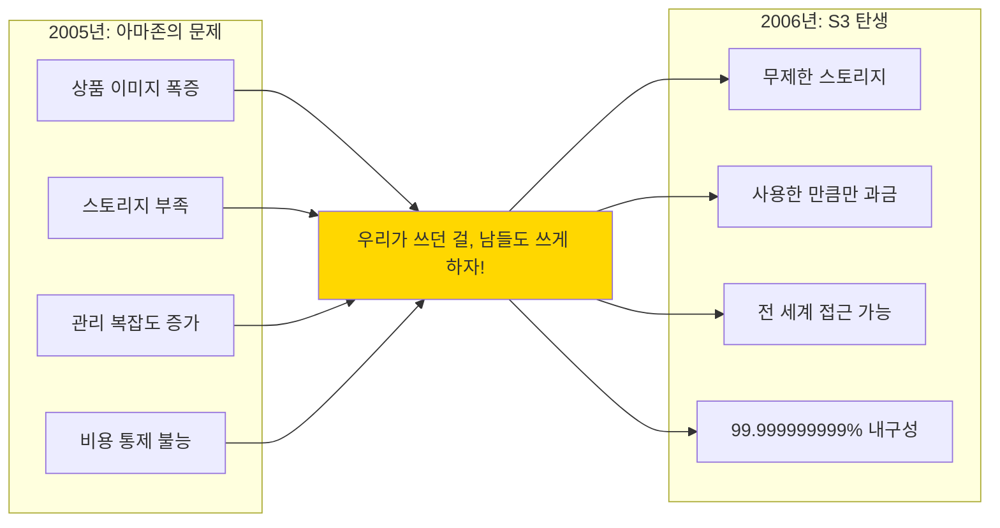

---
tags:
  - AWS
  - S3
  - Storage
  - CloudComputing
---

# AWS S3 내부 동작 원리 - 세계 최대 객체 스토리지의 비밀 🗄️

## 이 장을 읽으면 답할 수 있는 질문들

- S3는 어떻게 99.999999999% 내구성을 보장하는가?
- 내가 업로드한 파일은 실제로 어디에, 몇 개로 나뉘어 저장되는가?
- S3는 어떻게 초당 수백만 개의 요청을 처리하는가?
- 왜 S3 비용이 그렇게 복잡하고, 어떻게 90% 절감할 수 있는가?
- 데이터센터가 통째로 사라져도 데이터가 안전한 이유는?

## 시작하며: 인터넷의 절반을 지탱하는 거인

### 충격적인 사실: 당신도 매일 S3를 사용하고 있다

아침에 일어나서 잠들 때까지, 우리는 알게 모르게 S3를 사용합니다:

```python
# 당신의 하루 with S3
daily_s3_interactions = {
    "07:00": "Netflix에서 드라마 한 편 (비디오 파일들이 S3에)",
    "08:30": "Spotify로 음악 스트리밍 (음원 파일들이 S3에)",
    "09:00": "Slack으로 파일 공유 (첨부파일들이 S3에)",
    "12:00": "Instagram 사진 업로드 (모든 사진이 S3에)",
    "15:00": "Dropbox 동기화 (모든 파일이 S3에)",
    "18:00": "Reddit 브라우징 (이미지/비디오가 S3에)",
    "21:00": "Airbnb 숙소 사진 확인 (모든 이미지가 S3에)"
}

print("🤯 깨달음: 인터넷 콘텐츠의 상당 부분이 S3 위에서 돌아간다!")
```

### S3의 탄생: 실패에서 시작된 혁명

2006년, Amazon의 내부 스토리지 시스템이 한계에 도달했습니다:



**첫 해 성과**:

- 고객 수: 0 → 140,000
- 저장 객체: 0 → 8억 개
- 매출: $0 → $1.5억

**현재 (2024년)**:

- 저장 객체:**280조 개**(280,000,000,000,000)
- 일일 요청:**100조 개**
- 고객: 수백만 기업

## S3 심층 탐구 시리즈 📚

### [1. S3 내부 아키텍처](01-architecture.md)

**99.999999999% 내구성의 비밀을 파헤치다**

2017년 S3 대장애를 시작으로, S3가 어떻게 데이터를 절대 잃지 않는 시스템을 구축했는지 탐험합니다. 당신의 고양이 사진이 핵전쟁에서도 살아남는 이유를 알아보세요!

🔍**다룰 내용**:

- 파일 업로드의 숨겨진 17단계 여정
- Erasure Coding: 파일을 17조각으로 나누는 마법
- 데이터센터가 통째로 사라져도 복구되는 원리
- 2017년 대장애에서 배운 교훈들

---

### [2. Storage Classes와 수명주기](02-storage-classes.md)

**90% 비용 절감의 과학**

한 스타트업이 월 $50,000 S3 비용을 $5,000로 줄인 실제 사례를 통해, S3의 복잡한 스토리지 계층을 이해하고 비용을 최적화하는 방법을 배웁니다.

💰**다룰 내용**:

- Standard vs IA vs Glacier: 물리적 차이점
- Intelligent-Tiering의 ML 기반 자동화
- 수명주기 정책으로 자동 비용 최적화
- 실제 비용 90% 절감 사례 분석

---

### [3. 성능 최적화와 Request Rate](03-performance.md)

**초당 수만 개 요청 처리하기**

Netflix가 전 세계에 비디오를 스트리밍하는 비밀, S3를 극한까지 활용하는 방법을 알아봅니다.

⚡**다룰 내용**:

- Request Rate 한계와 자동 스케일링
- Multipart Upload 최적화 전략
- Transfer Acceleration의 숨은 동작
- Netflix 규모 트래픽 처리 비법

---

### [추가 예정] 4. S3 보안과 암호화

**데이터를 지키는 다층 방어**

Capital One 데이터 유출 사건을 통해 배우는 S3 보안 베스트 프랙티스.

🔐**다룰 내용**:

- 버킷 정책 vs IAM vs ACL 완벽 이해
- 서버/클라이언트 암호화 구현
- VPC Endpoint와 PrivateLink
- 실제 보안 사고 사례와 교훈

## 실전 프로젝트: S3를 활용한 시스템 구축 🛠️

### 프로젝트 1: 나만의 Netflix 만들기

```python
class MyNetflixOnS3:
    """
    S3를 백본으로 하는 비디오 스트리밍 서비스
    """
    
    def __init__(self):
        self.bucket = "my-netflix-content"
        self.cloudfront_distribution = "d1234567890.cloudfront.net"
        
    def upload_video(self, video_file):
        """
        비디오 업로드 및 처리 파이프라인
        """
        # 1. 원본을 S3에 업로드
        original_key = f"originals/{video_file.name}"
        
        # 2. Lambda 트리거로 트랜스코딩
        resolutions = ['4k', '1080p', '720p', '480p']
        
        # 3. HLS 세그먼트 생성
        segments = self.create_hls_segments(video_file)
        
        # 4. CloudFront로 전 세계 배포
        cdn_url = f"https://{self.cloudfront_distribution}/{video_file.id}"
        
        return cdn_url
```

### 프로젝트 2: 비용 최적화 자동화

```python
class S3CostOptimizer:
    """
    S3 비용을 자동으로 최적화하는 시스템
    """
    
    def analyze_access_patterns(self):
        """
        CloudWatch 로그 분석으로 접근 패턴 파악
        """
        patterns = {
            "hot_data": [],    # 매일 접근
            "warm_data": [],   # 주 1회 접근
            "cold_data": [],   # 월 1회 접근
            "frozen_data": []  # 거의 접근 안 함
        }
        
        # S3 Inventory와 CloudTrail 로그 분석
        # ... 분석 로직 ...
        
        return patterns
    
    def apply_lifecycle_policies(self, patterns):
        """
        분석 결과를 바탕으로 수명주기 정책 자동 적용
        """
        policies = []
        
        # Hot → Standard (그대로)
        # Warm → Standard-IA (30일 후)
        # Cold → Glacier Instant (90일 후)
        # Frozen → Deep Archive (180일 후)
        
        estimated_savings = self.calculate_savings(patterns)
        print(f"💰 예상 절감액: ${estimated_savings:,}/월")
```

## S3 마스터가 되는 길 🎯

### Level 1: S3 초보자 (1주)

- [ ] S3 버킷 생성 및 파일 업로드
- [ ] 기본 권한 설정
- [ ] Static Website Hosting
- [ ] 기본 수명주기 정책

### Level 2: S3 중급자 (1개월)

- [ ] Multipart Upload 구현
- [ ] CloudFront 연동
- [ ] Cross-Region Replication
- [ ] S3 Select와 Athena 활용

### Level 3: S3 고급자 (3개월)

- [ ] Transfer Acceleration 최적화
- [ ] S3 Batch Operations
- [ ] Object Lambda 구현
- [ ] 비용 최적화 자동화

### Level 4: S3 마스터 (6개월+)

- [ ] 페타바이트 규모 데이터 관리
- [ ] 멀티 리전 재해 복구 설계
- [ ] 실시간 스트리밍 아키텍처
- [ ] S3 기반 데이터 레이크 구축

## 자주 묻는 질문들 (FAQ) 🤔

### Q1: "S3가 정말 데이터를 절대 잃지 않나요?"

**A**: 99.999999999% 내구성은 사실상 "절대"입니다.

- 10억 개 파일 저장 시 → 10만 년에 1개 손실 확률
- 운석 충돌 확률이 더 높습니다!

### Q2: "왜 S3가 이렇게 비싸죠?"

**A**: 사실 제대로 쓰면 매우 저렴합니다.

- Standard: $0.023/GB (1TB = $23/월)
- Intelligent-Tiering으로 자동 최적화
- 90% 비용 절감 가능!

### Q3: "온프레미스 스토리지가 더 싸지 않나요?"

**A**: 총 소유 비용(TCO)을 계산해보세요:

```python
# 온프레미스 1PB 스토리지 실제 비용
on_premise_tco = {
    "하드웨어": "$300,000",
    "전력/냉각": "$5,000/월",
    "인건비": "$10,000/월",
    "데이터센터": "$3,000/월",
    "교체 주기": "3년",
    "다운타임 손실": "측정 불가"
}

# S3 1PB 스토리지 비용
s3_cost = {
    "Standard": "$23,000/월",
    "IA": "$12,500/월",
    "Glacier": "$4,000/월",
    "관리 비용": "$0",
    "다운타임": "없음"
}
```

## 마치며: S3는 단순한 스토리지가 아니다 🌟

S3를 깊이 이해하면, 단순한 파일 저장소가 아닌**현대 인터넷 인프라의 근간**임을 알게 됩니다.

**S3가 가르쳐주는 교훈들**:

1. 📐**단순한 인터페이스, 복잡한 구현**: 사용자에게는 쉽게, 내부는 정교하게
2. 🛡️**신뢰성은 타협할 수 없다**: 11 nines는 기술이 아닌 철학
3. 💰**규모의 경제**: 크기가 커질수록 단가는 낮아진다
4. 🔄**지속적 혁신**: 18년째 계속 진화 중

이제 S3의 깊은 내부로 들어가 볼 준비가 되셨나요? 🚀

---

*"S3는 AWS의 첫 번째 서비스였고, 여전히 가장 중요한 서비스다. 모든 것이 S3 위에 구축된다."* - Werner Vogels, Amazon CTO
