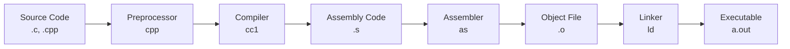
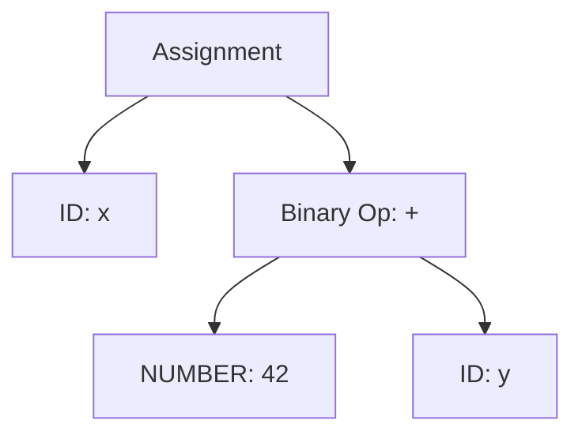

---
tags:
  - Compilation
  - Compiler
  - C
  - CPP
  - GCC
  - Clang
  - Optimization
---

# 컴파일레이션 완벽 가이드: From Source to Binary

## 들어가며

"왜 같은 코드인데 -O2 플래그를 주면 10배 빨라질까?", "왜 Debug 빌드는 느리고 Release 빌드는 빠를까?"와 같은 의문을 가져본 적이 있을 것입니다. 프로덕션에서 성능 최적화를 위해서는 컴파일러가 내부적으로 어떻게 동작하는지 이해하는 것이 필수입니다.

DevOps/SRE 엔지니어로서 컴파일레이션 과정을 깊이 이해하면 성능 튜닝, 의존성 관리, 바이너리 최적화에서 큰 도움이 됩니다.

## 컴파일레이션이란?

컴파일레이션은 고수준 프로그래밍 언어로 작성된 소스 코드를 기계어나 바이트코드로 변환하는 과정입니다. 단순히 번역하는 것이 아니라, 최적화, 오류 검사, 링킹 등 복잡한 과정을 거칩니다.



## 컴파일레이션 단계별 분석

### 1. 전처리 (Preprocessing)

전처리기는 소스 코드에서 `#`으로 시작하는 지시자를 처리합니다.

```c
// hello.c
#include <stdio.h>
#define MAX_SIZE 1024
#define DEBUG

int main() {
#ifdef DEBUG
    printf("Debug mode enabled\n");
#endif
    printf("Hello, World!\n");
    return 0;
}
```

전처리기 결과 확인:

```bash
# 전처리만 실행
$ gcc -E hello.c -o hello.i

# 결과 파일 확인
$ head -20 hello.i
# 1 "hello.c"
# 1 "<built-in>"
# 1 "<command-line>"
# 31 "<command-line>"
# 1 "/usr/include/stdc-predef.h" 1 3 4
...
extern int printf (const char *__restrict __format, ...);
...
# 2 "hello.c"
int main() {
    printf("Debug mode enabled\n");
    printf("Hello, World!\n");
    return 0;
}
```

**전처리기가 하는 일:**

1. **매크로 확장**: `#define`으로 정의된 매크로를 실제 값으로 치환
2. **헤더 파일 포함**: `#include`된 파일을 현재 위치에 삽입
3. **조건부 컴파일**: `#ifdef`, `#ifndef` 등으로 코드 블록 선택
4. **주석 제거**: 모든 주석을 공백으로 변환

### 2. 컴파일 (Compilation)

전처리된 코드를 어셈블리 언어로 변환하는 단계입니다. 이 단계에서 문법 분석, 의미 분석, 최적화가 수행됩니다.

```bash
# 어셈블리 코드 생성
$ gcc -S hello.c -o hello.s

# 최적화 없는 어셈블리
$ cat hello.s
.file   "hello.c"
.text
.section    .rodata
.LC0:
    .string "Debug mode enabled"
.LC1:
    .string "Hello, World!"
.text
.globl  main
.type   main, @function
main:
.LFB0:
    .cfi_startproc
    endbr64
    pushq   %rbp
    .cfi_def_cfa_offset 16
    .cfi_offset 6, -16
    movq    %rsp, %rbp
    .cfi_def_cfa_register 6
    leaq    .LC0(%rip), %rdi
    call    puts@PLT
    leaq    .LC1(%rip), %rdi
    call    puts@PLT
    movl    $0, %eax
    popq    %rbp
    .cfi_def_cfa 7, 8
    ret
    .cfi_endproc
```

최적화 레벨별 비교:

```bash
# 최적화 없음 (-O0, 기본값)
$ gcc -O0 -S hello.c -o hello_O0.s
$ wc -l hello_O0.s
     35 hello_O0.s

# 최적화 레벨 2 (-O2)
$ gcc -O2 -S hello.c -o hello_O2.s  
$ wc -l hello_O2.s
     28 hello_O2.s

# 크기 최적화 (-Os)
$ gcc -Os -S hello.c -o hello_Os.s
$ wc -l hello_Os.s
     25 hello_Os.s
```

### 3. 어셈블 (Assembly)

어셈블리 코드를 기계어 오브젝트 파일로 변환합니다.

```bash
# 오브젝트 파일 생성
$ gcc -c hello.c -o hello.o

# 또는 어셈블러 직접 호출
$ as hello.s -o hello.o

# 오브젝트 파일 정보 확인
$ file hello.o
hello.o: ELF 64-bit LSB relocatable, x86-64, version 1 (SYSV), not stripped

# 오브젝트 파일 섹션 확인
$ objdump -h hello.o
Sections:
Idx Name          Size      VMA               LMA               File Offset  Algn
  0 .text         0000001e  0000000000000000  0000000000000000  00000040  2**0
  1 .data         00000000  0000000000000000  0000000000000000  0000005e  2**0
  2 .bss          00000000  0000000000000000  0000000000000000  0000005e  2**0
  3 .rodata       00000020  0000000000000000  0000000000000000  0000005e  2**0
```

### 4. 링킹 (Linking)

여러 오브젝트 파일과 라이브러리를 하나의 실행 파일로 결합합니다.

```c
// math_utils.c
int add(int a, int b) {
    return a + b;
}

int multiply(int a, int b) {
    return a * b;
}
```

```c
// main.c
#include <stdio.h>

// 외부 함수 선언
extern int add(int a, int b);
extern int multiply(int a, int b);

int main() {
    int result = add(5, 3);
    printf("Result: %d\n", result);
    return 0;
}
```

링킹 과정:

```bash
# 각각 컴파일
$ gcc -c math_utils.c -o math_utils.o
$ gcc -c main.c -o main.o

# 링킹
$ gcc main.o math_utils.o -o program

# 또는 한 번에
$ gcc main.c math_utils.c -o program

# 링킹 과정 상세히 보기
$ gcc -v main.o math_utils.o -o program 2>&1 | grep collect2
collect2 version 2.34 (x86_64 Linux GNU) invocation:
/usr/lib/gcc/x86_64-linux-gnu/9/collect2 --eh-frame-hdr -m elf_x86_64 \
  -dynamic-linker /lib64/ld-linux-x86-64.so.2 \
  /usr/lib/gcc/x86_64-linux-gnu/9/crt1.o \
  main.o math_utils.o \
  -lc
```

## 컴파일러 내부 동작 원리

### 1. 어휘 분석 (Lexical Analysis)

소스 코드를 토큰으로 분해하는 단계입니다.

```c
int x = 42 + y;
```

토큰 분해:

```
INT     -> "int"
ID      -> "x"  
ASSIGN  -> "="
NUMBER  -> "42"
PLUS    -> "+"
ID      -> "y"
SEMI    -> ";"
```

### 2. 구문 분석 (Syntax Analysis)

토큰들을 Abstract Syntax Tree(AST)로 변환합니다.



GCC에서 AST 확인:

```bash
# GCC AST 덤프 (simplified)
$ gcc -fdump-tree-original-raw hello.c
$ cat hello.c.003t.original
```

### 3. 의미 분석 (Semantic Analysis)

타입 체킹, 변수 선언 확인 등을 수행합니다.

```c
// 의미 분석에서 걸리는 오류들
int main() {
    int x = 10;
    float y = x + "hello";  // 타입 불일치
    unknown_function();     // 미선언 함수
    return "string";        // 반환 타입 불일치
}
```

```bash
$ gcc semantic_error.c
semantic_error.c:3:19: error: invalid operands to binary + (have 'int' and 'char *')
semantic_error.c:4:5: error: implicit declaration of function 'unknown_function'
semantic_error.c:5:12: error: return makes integer from pointer without a cast
```

### 4. 중간 코드 생성 (Intermediate Code Generation)

플랫폼 독립적인 중간 표현을 생성합니다. GCC는 GIMPLE, LLVM은 LLVM IR을 사용합니다.

```bash
# GCC GIMPLE 중간 코드 확인
$ gcc -fdump-tree-gimple hello.c
$ cat hello.c.004t.gimple

int main ()
{
  int D.2302;

  puts ("Debug mode enabled");
  puts ("Hello, World!");
  D.2302 = 0;
  return D.2302;
}
```

LLVM IR 확인:

```bash
# Clang으로 LLVM IR 생성
$ clang -S -emit-llvm hello.c -o hello.ll
$ cat hello.ll

define dso_local i32 @main() #0 {
  %1 = alloca i32, align 4
  store i32 0, i32* %1, align 4
  %2 = call i32 @puts(i8* getelementptr inbounds ([19 x i8], [19 x i8]* @.str, i64 0, i64 0))
  %3 = call i32 @puts(i8* getelementptr inbounds ([14 x i8], [14 x i8]* @.str.1, i64 0, i64 0))
  ret i32 0
}
```

### 5. 최적화 (Optimization)

성능 향상을 위한 코드 변환을 수행합니다.

**주요 최적화 기법:**

1. **Dead Code Elimination**: 사용되지 않는 코드 제거
2. **Constant Folding**: 컴파일 타임에 상수 계산
3. **Loop Unrolling**: 반복문 펼치기
4. **Inlining**: 함수 호출을 함수 내용으로 대체

```c
// 최적화 예제
int calculate() {
    int x = 10;
    int y = 20;
    int unused = 30;    // Dead code
    int result = x + y; // Constant folding → result = 30
    
    // Loop unrolling 대상
    for (int i = 0; i < 4; i++) {
        printf("%d\n", i);
    }
    
    return result;
}
```

최적화 전후 비교:

```bash
# 최적화 없음
$ gcc -O0 -S optimize_example.c -o opt_O0.s

# 최적화 레벨 2
$ gcc -O2 -S optimize_example.c -o opt_O2.s

# 차이점 확인
$ diff opt_O0.s opt_O2.s
```

## 주요 컴파일러들

### 1. GCC (GNU Compiler Collection)

**특징:**

- 오픈소스, 다양한 플랫폼 지원
- C, C++, Fortran, Go 등 다중 언어 지원
- 강력한 최적화 기능

```bash
# GCC 버전 확인
$ gcc --version
gcc (Ubuntu 9.4.0-1ubuntu1~20.04.1) 9.4.0

# 지원 아키텍처 확인
$ gcc -print-multiarch
x86_64-linux-gnu

# 내장 매크로 확인
$ gcc -dM -E - < /dev/null | grep __VERSION__
#define __VERSION__ "9.4.0"
```

**GCC 최적화 플래그:**

```bash
# 최적화 레벨
-O0    # 최적화 없음 (기본값, 디버그용)
-O1    # 기본 최적화
-O2    # 권장 최적화 (릴리즈용)
-O3    # 적극적 최적화
-Os    # 크기 최적화
-Ofast # 수학 정확성을 희생한 최고 성능
```

### 2. Clang/LLVM

**특징:**

- 모듈식 설계, 빠른 컴파일 속도
- 우수한 오류 메시지와 경고
- 정적 분석 도구 내장

```bash
# Clang 버전 확인
$ clang --version
clang version 10.0.0-4ubuntu1

# LLVM IR 생성
$ clang -S -emit-llvm example.c -o example.ll

# 최적화된 LLVM IR
$ clang -S -emit-llvm -O2 example.c -o example_opt.ll
```

**Clang 고유 기능:**

```bash
# 정적 분석
$ clang --analyze example.c

# 더 자세한 경고
$ clang -Weverything example.c

# AddressSanitizer (메모리 오류 검출)
$ clang -fsanitize=address -g example.c -o example_asan
```

### 3. MSVC (Microsoft Visual C++)

Windows 플랫폼 최적화에 특화된 컴파일러입니다.

```cmd
REM MSVC 컴파일
cl /O2 /Fe:program.exe source.c

REM 프로파일 가이드 최적화
cl /GL /O2 source.c /link /LTCG
```

## 컴파일러 플래그와 최적화

### 성능 최적화 플래그

```bash
# CPU 특화 최적화
$ gcc -march=native -mtune=native program.c

# 벡터화 활성화
$ gcc -O2 -ftree-vectorize -ftree-vectorizer-verbose=2 program.c

# Link Time Optimization
$ gcc -O2 -flto program.c

# Profile Guided Optimization
$ gcc -O2 -fprofile-generate program.c
$ ./a.out  # 프로파일링 데이터 생성
$ gcc -O2 -fprofile-use program.c
```

### 디버깅 플래그

```bash
# 디버그 정보 포함
$ gcc -g -O0 program.c

# 더 자세한 디버그 정보
$ gcc -g3 -O0 program.c

# AddressSanitizer
$ gcc -fsanitize=address -g program.c

# ThreadSanitizer
$ gcc -fsanitize=thread -g program.c
```

### 경고 플래그

```bash
# 모든 경고 활성화
$ gcc -Wall -Wextra -Wpedantic program.c

# 특정 경고 활성화
$ gcc -Wuninitialized -Wformat=2 -Wconversion program.c

# 경고를 오류로 처리
$ gcc -Werror program.c
```

## 실제 성능 측정

### 컴파일 시간 vs 실행 성능 트레이드오프

```c
// benchmark.c - 계산 집약적 함수
#include <stdio.h>
#include <time.h>

double calculate_pi(int iterations) {
    double pi = 0.0;
    for (int i = 0; i < iterations; i++) {
        pi += (i % 2 == 0 ? 1.0 : -1.0) / (2 * i + 1);
    }
    return pi * 4.0;
}

int main() {
    clock_t start = clock();
    double pi = calculate_pi(100000000);
    clock_t end = clock();
    
    printf("Pi: %f, Time: %f seconds\n", 
           pi, (double)(end - start) / CLOCKS_PER_SEC);
    return 0;
}
```

성능 벤치마크:

```bash
# 각 최적화 레벨로 컴파일
$ gcc -O0 benchmark.c -o bench_O0
$ gcc -O1 benchmark.c -o bench_O1  
$ gcc -O2 benchmark.c -o bench_O2
$ gcc -O3 benchmark.c -o bench_O3

# 실행 시간 측정
$ time ./bench_O0
Pi: 3.141593, Time: 2.450000 seconds
real    0m2.453s

$ time ./bench_O2  
Pi: 3.141593, Time: 0.245000 seconds
real    0m0.248s

# 10배 성능 향상!
```

### 바이너리 크기 최적화

```bash
# 크기 비교
$ gcc -O0 benchmark.c -o bench_O0
$ gcc -O2 benchmark.c -o bench_O2
$ gcc -Os benchmark.c -o bench_Os
$ gcc -O2 -s benchmark.c -o bench_stripped

$ ls -la bench_*
-rwxr-xr-x 1 user user  8768 bench_O0
-rwxr-xr-x 1 user user  8704 bench_O2  
-rwxr-xr-x 1 user user  8536 bench_Os
-rwxr-xr-x 1 user user  6336 bench_stripped

# strip으로 디버그 정보 제거
$ strip bench_O2
$ ls -la bench_O2
-rwxr-xr-x 1 user user  6336 bench_O2
```

## 일반적인 컴파일 오류와 해결법

### 1. 문법 오류 (Syntax Errors)

```c
// syntax_error.c
int main() {
    int x = 10  // 세미콜론 누락
    return 0;
}
```

```bash
$ gcc syntax_error.c
syntax_error.c:3:16: error: expected ';' before 'return'
    return 0;
    ^~~~~~
```

**해결법**: 컴파일러가 정확히 어디서 오류가 발생했는지 알려주므로 해당 위치를 확인

### 2. 링크 오류 (Link Errors)

```c
// link_error.c
#include <stdio.h>

extern int undefined_function();

int main() {
    undefined_function();
    return 0;
}
```

```bash
$ gcc link_error.c
/usr/bin/ld: /tmp/ccXXXXXX.o: in function `main':
link_error.c:(.text+0xe): undefined reference to `undefined_function'
collect2: error: ld returned 1 exit status
```

**해결법**:

- 함수 정의 추가
- 필요한 라이브러리 링크 (`-l` 옵션)
- 오브젝트 파일 추가

### 3. 헤더 파일 누락

```c
// missing_header.c
int main() {
    printf("Hello\n");  // stdio.h 누락
    return 0;
}
```

```bash
$ gcc missing_header.c
missing_header.c:2:5: warning: implicit declaration of function 'printf'
```

**해결법**: 필요한 헤더 파일 포함

### 4. 라이브러리 링크 오류

```c
// math_example.c
#include <math.h>
#include <stdio.h>

int main() {
    double result = sqrt(16.0);
    printf("Result: %f\n", result);
    return 0;
}
```

```bash
$ gcc math_example.c
/usr/bin/ld: /tmp/ccXXXXXX.o: in function `main':
math_example.c:(.text+0x17): undefined reference to `sqrt'

# 해결: 수학 라이브러리 링크
$ gcc math_example.c -lm
```

## 프로덕션 빌드 베스트 프랙티스

### 1. Makefile 예제

```makefile
# Makefile
CC = gcc
CFLAGS = -Wall -Wextra -std=c99
DEBUG_FLAGS = -g -O0 -DDEBUG
RELEASE_FLAGS = -O2 -DNDEBUG -s

SRCDIR = src
OBJDIR = obj
SOURCES = $(wildcard $(SRCDIR)/*.c)
OBJECTS = $(SOURCES:$(SRCDIR)/%.c=$(OBJDIR)/%.o)
TARGET = myprogram

# 기본 타겟: debug 빌드
all: debug

# Debug 빌드
debug: CFLAGS += $(DEBUG_FLAGS)
debug: $(TARGET)_debug

# Release 빌드  
release: CFLAGS += $(RELEASE_FLAGS)
release: $(TARGET)_release

$(TARGET)_debug $(TARGET)_release: $(OBJECTS)
 $(CC) $(OBJECTS) -o $@ $(LDFLAGS)

$(OBJDIR)/%.o: $(SRCDIR)/%.c | $(OBJDIR)
 $(CC) $(CFLAGS) -c $< -o $@

$(OBJDIR):
 mkdir -p $(OBJDIR)

clean:
 rm -rf $(OBJDIR) $(TARGET)_debug $(TARGET)_release

.PHONY: all debug release clean
```

### 2. CI/CD 빌드 스크립트

```bash
#!/bin/bash
# build.sh - 프로덕션 빌드 스크립트

set -e  # 오류 시 중단

# 컴파일러 버전 확인
echo "Compiler versions:"
gcc --version
echo

# 빌드 환경 설정
export CC=gcc
export CFLAGS="-Wall -Wextra -Werror -std=c99"

# Debug 빌드
echo "Building debug version..."
make clean
make debug
strip --strip-unneeded myprogram_debug

# Release 빌드
echo "Building release version..." 
make clean
make release

# 바이너리 크기 확인
echo "Binary sizes:"
ls -la myprogram_*

# 기본 테스트 실행
echo "Running tests..."
./myprogram_debug --test
./myprogram_release --test

echo "Build completed successfully!"
```

### 3. 컨테이너 빌드 (Multi-stage)

```dockerfile
# Dockerfile
FROM gcc:9 AS builder

WORKDIR /src
COPY . .

# Release 빌드
RUN make release && strip myprogram_release

FROM alpine:latest AS runtime

# 런타임 의존성만 설치
RUN apk --no-cache add libc6-compat

WORKDIR /app
COPY --from=builder /src/myprogram_release ./myprogram

# 비특권 사용자로 실행
RUN addgroup -g 1001 -S appgroup && \
    adduser -S appuser -G appgroup -u 1001
USER appuser

ENTRYPOINT ["./myprogram"]
```

## 링커와 라이브러리 심화

### 정적 링킹 vs 동적 링킹

```bash
# 정적 링킹 (모든 라이브러리 포함)
$ gcc -static program.c -o program_static
$ ls -la program_static
-rwxr-xr-x 1 user user 2097152 program_static  # 2MB

# 동적 링킹 (기본값)
$ gcc program.c -o program_dynamic  
$ ls -la program_dynamic
-rwxr-xr-x 1 user user    8760 program_dynamic  # 8KB

# 의존성 확인
$ ldd program_dynamic
    linux-vdso.so.1 =>  (0x00007ffce39fe000)
    libc.so.6 => /lib/x86_64-linux-gnu/libc.so.6 (0x00007f8c5e3c4000)
    /lib64/ld-linux-x86-64.so.2 (0x00007f8c5e58e000)

$ ldd program_static
    not a dynamic executable
```

### 공유 라이브러리 생성

```c
// mathlib.c - 공유 라이브러리
int add(int a, int b) {
    return a + b;
}

int multiply(int a, int b) {
    return a * b;
}
```

```c
// mathlib.h
#ifndef MATHLIB_H
#define MATHLIB_H

int add(int a, int b);
int multiply(int a, int b);

#endif
```

```bash
# 공유 라이브러리 생성
$ gcc -fPIC -c mathlib.c -o mathlib.o
$ gcc -shared -o libmath.so mathlib.o

# 또는 한 번에
$ gcc -fPIC -shared mathlib.c -o libmath.so

# 라이브러리 정보 확인
$ file libmath.so
libmath.so: ELF 64-bit LSB shared object, x86-64

$ nm -D libmath.so
0000000000001119 T add
0000000000001129 T multiply
```

사용 예제:

```c
// main.c
#include <stdio.h>
#include "mathlib.h"

int main() {
    printf("5 + 3 = %d\n", add(5, 3));
    printf("5 * 3 = %d\n", multiply(5, 3));
    return 0;
}
```

```bash
# 컴파일 및 링크
$ gcc main.c -L. -lmath -o program

# 실행
$ LD_LIBRARY_PATH=. ./program
5 + 3 = 8
5 * 3 = 15

# 또는 라이브러리 경로 설정
$ export LD_LIBRARY_PATH=$LD_LIBRARY_PATH:.
$ ./program
```

## 고급 최적화 기법

### Profile-Guided Optimization (PGO)

```bash
# 1단계: 프로파일링 코드 생성
$ gcc -O2 -fprofile-generate program.c -o program_profile

# 2단계: 대표적인 워크로드로 실행
$ ./program_profile < typical_input.txt
# .gcda 파일들이 생성됨

# 3단계: 프로파일 정보를 사용해서 최적화
$ gcc -O2 -fprofile-use program.c -o program_optimized

# 성능 비교
$ time ./program < test_input.txt
real    0m1.234s

$ time ./program_optimized < test_input.txt  
real    0m0.987s  # 약 20% 성능 향상
```

### Link Time Optimization (LTO)

```bash
# 각 파일을 중간 표현으로 컴파일
$ gcc -O2 -flto -c file1.c -o file1.o
$ gcc -O2 -flto -c file2.c -o file2.o

# 링크 시점에서 전체 프로그램 최적화
$ gcc -O2 -flto file1.o file2.o -o optimized_program

# 성능 향상 확인
$ time ./normal_program
real    0m1.500s

$ time ./optimized_program
real    0m1.200s  # LTO로 20% 향상
```

## 컴파일러별 특화 최적화

### GCC 특화 기능

```c
// GCC 전용 최적화 힌트
__attribute__((hot))    // 자주 호출되는 함수
void frequently_called_function() {
    // ...
}

__attribute__((cold))   // 드물게 호출되는 함수  
void error_handler() {
    // ...
}

// 브랜치 예측 힌트
if (__builtin_expect(error_condition, 0)) {
    handle_error();  // 이 브랜치는 거의 실행되지 않을 것
}

// SIMD 자동 벡터화 힌트
void vector_add(float* a, float* b, float* c, int n) {
    #pragma GCC ivdep    // 메모리 의존성 없음을 알림
    for (int i = 0; i < n; i++) {
        c[i] = a[i] + b[i];
    }
}
```

### Clang 특화 기능

```c
// Clang 전용 최적화
void optimized_loop() {
    #pragma clang loop vectorize(enable)
    #pragma clang loop unroll(enable)
    for (int i = 0; i < 1000; i++) {
        // 벡터화와 언롤링 강제 적용
        process(data[i]);
    }
}

// 메모리 새니타이저 어트리뷰트
__attribute__((no_sanitize("address")))
void trusted_function() {
    // AddressSanitizer 검사 제외
}
```

## 정리

컴파일레이션 과정을 깊이 이해하는 것은 DevOps/SRE 엔지니어에게 매우 중요합니다:

1. **전처리**: 매크로와 헤더 파일 처리로 소스 코드 준비
2. **컴파일**: 고수준 언어를 어셈블리로 변환하며 최적화 수행
3. **어셈블**: 어셈블리를 기계어 오브젝트 파일로 변환
4. **링킹**: 여러 오브젝트 파일을 하나의 실행 파일로 결합

**프로덕션 적용 포인트:**

- **성능 최적화**: -O2, PGO, LTO 활용으로 실행 성능 향상
- **크기 최적화**: -Os, strip을 통한 바이너리 크기 최소화
- **디버깅**: -g, -fsanitize로 개발 단계에서 버그 조기 발견
- **경고 처리**: -Wall, -Werror로 코드 품질 향상

최적화 레벨별 성능 차이가 10배까지 날 수 있으므로, 적절한 컴파일 옵션 선택이 시스템 성능에 결정적 영향을 미칩니다.

## 관련 문서

- [프로세스 메모리 구조 완벽 이해](../memory/process-memory-structure.md)
- [Linux Scheduling과 최적화](../process/linux-scheduling-1.md)
- [언어별 메모리 관리 전략](../memory/language-memory-management.md)
