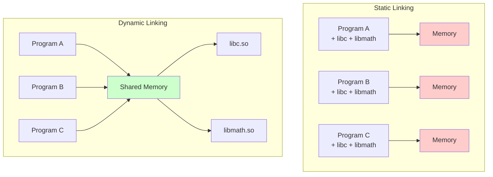

---
tags:
  - Dynamic
  - Library
  - Linking
  - PIC
  - GOT
  - PLT
  - SONAME
  - dlopen
  - Runtime
  - Security
---

# Dynamic Library 완벽 가이드: Runtime Loading부터 Security까지

## 들어가며

"왜 같은 프로그램인데 다른 서버에서는 실행되지 않을까?", "프로그램 크기는 작은데 메모리는 왜 이렇게 많이 사용할까?", "라이브러리 업데이트 후 기존 프로그램이 crash가 발생하는 이유는?"과 같은 의문을 가져본 적이 있을 것입니다.

프로덕션 환경에서 마이크로서비스 아키텍처와 컨테이너 환경이 보편화되면서, dynamic library에 대한 이해는 더욱 중요해졌습니다. 특히 메모리 효율성, 보안 패치, 그리고 배포 전략을 고려할 때 dynamic linking의 내부 동작 원리를 정확히 파악하는 것이 필수적입니다.

## Dynamic Library란 무엇인가?

Dynamic Library(공유 라이브러리)는 프로그램 실행 시점에 메모리로 로딩되는 코드 모듈입니다. Static library와 달리, 여러 프로그램이 동일한 라이브러리 인스턴스를 메모리에서 공유할 수 있어 메모리 효율성과 유지보수성을 제공합니다.



### Platform별 Dynamic Library 확장자

| Platform | Extension | Example |
|----------|-----------|---------|
| Linux | `.so` (Shared Object) | `libc.so.6` |
| Windows | `.dll` (Dynamic Link Library) | `kernel32.dll` |
| macOS | `.dylib` (Dynamic Library) | `libSystem.dylib` |

## Dynamic Linking Process 상세 분석

### 1. Compile Time: PIC 생성

Dynamic library를 만들기 위해서는 Position Independent Code(PIC)로 컴파일해야 합니다.

```c
// math_utils.c - 공유 라이브러리용 코드
#include <stdio.h>

static int internal_counter = 0;  // 라이브러리 내부 전역 변수

int add(int a, int b) {
    internal_counter++;
    printf("Addition called %d times\n", internal_counter);
    return a + b;
}

int multiply(int a, int b) {
    internal_counter++;
    printf("Multiplication called %d times\n", internal_counter);
    return a * b;
}

// 라이브러리 정보 함수
void get_library_info(void) {
    printf("Math Utils Library v1.0\n");
    printf("Total operations: %d\n", internal_counter);
}
```

```bash
# PIC 없이 컴파일 시도 (경고 발생)
$ gcc -shared math_utils.c -o libmath.so
/usr/bin/ld: /tmp/ccxxxxxx.o: warning: relocation against `internal_counter' in read-only section `.text'
/usr/bin/ld: warning: creating DT_TEXTREL in a PIE

# 올바른 PIC 컴파일
$ gcc -fPIC -shared math_utils.c -o libmath.so

# PIC와 non-PIC 코드 차이 확인
$ gcc -c math_utils.c -o math_nopic.o
$ gcc -fPIC -c math_utils.c -o math_pic.o

# 어셈블리 코드 비교
$ objdump -d math_nopic.o | grep -A10 "add>:"
$ objdump -d math_pic.o | grep -A10 "add>:"
```

**PIC vs Non-PIC 어셈블리 차이:**

```assembly
# Non-PIC Code (직접 주소 참조)
movl    $internal_counter, %eax    # 절대 주소 사용
incl    internal_counter           # 직접 메모리 접근

# PIC Code (간접 주소 참조)
movq    %rip, %rax                # RIP-relative 주소 계산
movq    internal_counter@GOTPCREL(%rip), %rax  # GOT를 통한 간접 접근
incl    (%rax)                    # 간접 메모리 접근
```

### 2. Link Time: 심볼 정보 생성

```bash
# 공유 라이브러리 빌드
$ gcc -fPIC -shared -Wl,-soname,libmath.so.1 math_utils.c -o libmath.so.1.0

# 심볼 링크 생성 (버전 관리)
$ ln -sf libmath.so.1.0 libmath.so.1
$ ln -sf libmath.so.1.0 libmath.so

# 라이브러리 정보 확인
$ readelf -d libmath.so.1.0 | grep SONAME
 0x000000000000000e (SONAME)             Library soname: [libmath.so.1]

# 익스포트된 심볼 확인
$ nm -D libmath.so.1.0
0000000000001119 T add
000000000000114a T get_library_info  
0000000000001133 T multiply
0000000000004010 B internal_counter
```

### 3. Runtime: Dynamic Loader 동작

```c
// main.c - 클라이언트 프로그램
#include <stdio.h>

// 외부 함수 선언
extern int add(int a, int b);
extern int multiply(int a, int b);
extern void get_library_info(void);

int main() {
    printf("Starting program...\n");
    
    int result1 = add(5, 3);
    int result2 = multiply(4, 7);
    
    printf("Results: %d, %d\n", result1, result2);
    get_library_info();
    
    return 0;
}
```

```bash
# 동적 링크로 컴파일
$ gcc main.c -L. -lmath -o program

# 의존성 확인
$ ldd program
    linux-vdso.so.1 (0x00007ffee1bfe000)
    libmath.so.1 => ./libmath.so.1 (0x00007f8b2e400000)
    libc.so.6 => /lib/x86_64-linux-gnu/libc.so.6 (0x00007f8b2e200000)
    /lib64/ld-linux-x86-64.so.2 (0x00007f8b2e550000)

# 동적 로딩 과정 추적
$ LD_DEBUG=all ./program 2>&1 | head -20
     1234: calling init: /lib64/ld-linux-x86-64.so.2
     1234: find library=libmath.so.1 [0]; searching
     1234:  search path=./  (rpath from file program)
     1234:   trying file=./libmath.so.1
     1234: binding file ./libmath.so.1 to ./program: normal symbol `add'
     1234: binding file ./libmath.so.1 to ./program: normal symbol `multiply'
```

## Position Independent Code (PIC) 심화

### Global Offset Table (GOT)

GOT는 전역 변수와 함수의 실제 주소를 저장하는 테이블입니다.

```c
// got_example.c
#include <stdio.h>

int global_variable = 42;

void function_call_example() {
    printf("Global variable value: %d\n", global_variable);
    printf("Address of global_variable: %p\n", &global_variable);
}
```

```bash
# GOT 섹션 확인
$ gcc -fPIC -shared got_example.c -o libgot.so
$ readelf -S libgot.so | grep -E "(got|GOT)"
  [21] .got              PROGBITS         0000000000003fd8  00002fd8
  [22] .got.plt          PROGBITS         0000000000004000  00003000

# GOT 엔트리 확인
$ objdump -R libgot.so
DYNAMIC RELOCATION RECORDS
OFFSET           TYPE              VALUE
0000000000003fd8 R_X86_64_RELATIVE *ABS*+0x0000000000001119
0000000000004000 R_X86_64_GLOB_DAT  printf@GLIBC_2.2.5
0000000000004008 R_X86_64_GLOB_DAT  global_variable
```

### Procedure Linkage Table (PLT)

PLT는 외부 함수 호출을 지연 바인딩(lazy binding)으로 처리하는 메커니즘입니다.

```c
// plt_example.c
#include <stdio.h>
#include <math.h>

void demonstrate_plt() {
    // 첫 번째 호출 시 PLT를 통해 실제 주소 해결
    double result1 = sqrt(16.0);
    printf("First sqrt call: %.2f\n", result1);
    
    // 두 번째 호출 시 이미 해결된 주소 직접 사용
    double result2 = sqrt(25.0);
    printf("Second sqrt call: %.2f\n", result2);
}
```

```bash
# PLT 섹션 분석
$ gcc plt_example.c -lm -o plt_program
$ objdump -d plt_program | grep -A10 -B5 "@plt"

0000000000001030 <sqrt@plt>:
    1030: ff 25 e2 2f 00 00     jmpq   *0x2fe2(%rip)        # 4018 <sqrt@GLIBC_2.2.5>
    1036: 68 00 00 00 00        pushq  $0x0
    103b: e9 e0 ff ff ff        jmpq   1020 <.plt>

# 실행 중 PLT 동작 추적
$ LD_DEBUG=bindings ./plt_program 2>&1 | grep sqrt
     1234: binding file /lib/x86_64-linux-gnu/libm.so.6 to ./plt_program: normal symbol `sqrt' [GLIBC_2.2.5]
First sqrt call: 4.00
Second sqrt call: 5.00
```

### Lazy vs Eager Binding

```bash
# 기본값: Lazy binding (지연 바인딩)
$ ./program
# 함수가 처음 호출될 때 주소 해결

# Eager binding (즉시 바인딩) - 보안상 유리
$ LD_BIND_NOW=1 ./program
# 프로그램 시작 시 모든 심볼 즉시 해결

# 컴파일 시 eager binding 설정
$ gcc -Wl,-z,now main.c -L. -lmath -o program_eager

# 바인딩 모드 확인
$ readelf -d program | grep -E "(BIND_NOW|LAZY)"
$ readelf -d program_eager | grep -E "(BIND_NOW|LAZY)"
 0x0000000000000018 (BIND_NOW)           
```

## Symbol Resolution과 Binding

### Symbol Precedence (심볼 우선순위)

```c
// symbol_test.c - 메인 프로그램
#include <stdio.h>

void shared_function() {
    printf("Main program implementation\n");
}

extern void call_shared_function();

int main() {
    printf("=== Symbol Resolution Test ===\n");
    
    // 직접 호출
    printf("Direct call: ");
    shared_function();
    
    // 라이브러리를 통한 호출
    printf("Library call: ");
    call_shared_function();
    
    return 0;
}
```

```c
// lib_symbol.c - 라이브러리
#include <stdio.h>

void shared_function() {
    printf("Library implementation\n");
}

void call_shared_function() {
    shared_function();  // 어느 것을 호출할까?
}
```

```bash
# 라이브러리 빌드
$ gcc -fPIC -shared lib_symbol.c -o libsymbol.so

# 프로그램 빌드 및 실행
$ gcc symbol_test.c -L. -lsymbol -o symbol_program
$ LD_LIBRARY_PATH=. ./symbol_program

=== Symbol Resolution Test ===
Direct call: Main program implementation
Library call: Main program implementation  # 메인 프로그램의 심볼이 우선!
```

### Symbol Versioning

```c
// versioned_lib.c
#include <stdio.h>

// Version 1.0 함수
__asm__(".symver old_function_v1, old_function@VER_1.0");
void old_function_v1() {
    printf("Function version 1.0\n");
}

// Version 2.0 함수 (기본값)
__asm__(".symver new_function_v2, old_function@@VER_2.0");
void new_function_v2() {
    printf("Function version 2.0 (default)\n");
}
```

```bash
# 버전 스크립트 생성
cat > version.map << EOF
VER_1.0 {
    global: old_function;
    local: *;
};

VER_2.0 {
    global: old_function;
} VER_1.0;
EOF

# 버전 정보와 함께 라이브러리 빌드
$ gcc -fPIC -shared -Wl,--version-script=version.map versioned_lib.c -o libversioned.so

# 심볼 버전 확인
$ objdump -T libversioned.so
DYNAMIC SYMBOL TABLE:
0000000000001119 g    DF .text  000000000000000b VER_1.0     old_function
000000000000112e g    DF .text  000000000000000b VER_2.0     old_function
```

## Library Versioning과 SONAME

### SONAME 시스템

SONAME(Shared Object Name)은 바이너리 호환성을 보장하는 버전 관리 시스템입니다.

```bash
# 버전별 라이브러리 빌드
$ gcc -fPIC -shared -Wl,-soname,libmath.so.1 math_utils.c -o libmath.so.1.0.0
$ gcc -fPIC -shared -Wl,-soname,libmath.so.2 math_utils_v2.c -o libmath.so.2.0.0

# 심볼릭 링크 생성 (패키지 매니저가 관리)
$ ln -sf libmath.so.1.0.0 libmath.so.1     # Runtime 링크
$ ln -sf libmath.so.1.0.0 libmath.so       # Compile-time 링크

# SONAME 정보 확인
$ readelf -d libmath.so.1.0.0 | grep SONAME
 0x000000000000000e (SONAME)             Library soname: [libmath.so.1]

# 프로그램이 요구하는 SONAME 확인
$ readelf -d program | grep NEEDED
 0x0000000000000001 (NEEDED)             Shared library: [libmath.so.1]
```

### ABI 호환성 문제 시뮬레이션

```c
// math_utils_v1.c (Version 1 - 원본)
typedef struct {
    int major;
    int minor;
} version_t;

version_t get_version() {
    version_t ver = {1, 0};
    return ver;
}

int add(int a, int b) {
    return a + b;
}
```

```c
// math_utils_v2.c (Version 2 - 호환성 깨짐)
typedef struct {
    int major;
    int minor;
    int patch;      // 새 필드 추가 - ABI 호환성 깨짐!
} version_t;

version_t get_version() {
    version_t ver = {2, 0, 1};
    return ver;
}

int add(int a, int b) {
    return a + b;
}

// 새 함수 추가 (API 확장)
int subtract(int a, int b) {
    return a - b;
}
```

```bash
# V1으로 빌드된 프로그램이 V2 라이브러리 사용 시
$ gcc -fPIC -shared -Wl,-soname,libmath.so.1 math_utils_v1.c -o libmath.so.1.0.0
$ gcc client_program.c -L. -lmath -o client

$ gcc -fPIC -shared -Wl,-soname,libmath.so.1 math_utils_v2.c -o libmath.so.1.1.0
$ ln -sf libmath.so.1.1.0 libmath.so.1

$ LD_LIBRARY_PATH=. ./client
# ABI 호환성 문제로 인한 런타임 오류 발생 가능
```

## LD_LIBRARY_PATH와 rpath/runpath

### Library Search Order

Dynamic linker가 라이브러리를 찾는 순서:

1. **DT_RPATH** (deprecated)
2. **LD_LIBRARY_PATH** 환경 변수
3. **DT_RUNPATH**
4. **/etc/ld.so.cache** (ldconfig로 생성)
5. **/lib, /usr/lib** (기본 시스템 경로)

```bash
# 현재 라이브러리 캐시 확인
$ ldconfig -p | grep libmath
    libmath.so.1 (libc6,x86-64) => /usr/local/lib/libmath.so.1
    libmath.so (libc6,x86-64) => /usr/local/lib/libmath.so

# 캐시 업데이트
$ sudo ldconfig

# 특정 디렉토리 추가
$ echo "/opt/custom/lib" | sudo tee /etc/ld.so.conf.d/custom.conf
$ sudo ldconfig
```

### rpath vs runpath 차이점

```bash
# RPATH 설정 (LD_LIBRARY_PATH보다 우선순위 높음)
$ gcc -Wl,-rpath,/opt/myapp/lib main.c -L. -lmath -o program_rpath

# RUNPATH 설정 (LD_LIBRARY_PATH보다 우선순위 낮음)  
$ gcc -Wl,--enable-new-dtags -Wl,-rpath,/opt/myapp/lib main.c -L. -lmath -o program_runpath

# rpath/runpath 정보 확인
$ readelf -d program_rpath | grep -E "(RPATH|RUNPATH)"
 0x000000000000000f (RPATH)              Library rpath: [/opt/myapp/lib]

$ readelf -d program_runpath | grep -E "(RPATH|RUNPATH)"
 0x000000000000001d (RUNPATH)            Library runpath: [/opt/myapp/lib]

# 실행 시 라이브러리 검색 순서 확인
$ LD_DEBUG=libs ./program_rpath 2>&1 | grep "search path"
$ LD_DEBUG=libs ./program_runpath 2>&1 | grep "search path"
```

### 보안 고려사항: LD_LIBRARY_PATH

```bash
# 보안 위험 시나리오
$ echo 'void malicious_function() { system("rm -rf /"); }' > malicious.c
$ gcc -fPIC -shared malicious.c -o libmath.so

# 악성 라이브러리가 먼저 로딩됨
$ LD_LIBRARY_PATH=/tmp/malicious:$LD_LIBRARY_PATH ./program

# setuid 프로그램에서는 LD_LIBRARY_PATH 무시됨 (보안 기능)
$ sudo chmod u+s ./program
$ LD_LIBRARY_PATH=/tmp/malicious ./program  # 무시됨
```

## dlopen/dlsym을 통한 Runtime Loading

### 기본 dlopen 사용법

```c
// runtime_loader.c
#include <dlfcn.h>
#include <stdio.h>
#include <stdlib.h>

int main() {
    void *handle;
    int (*add_func)(int, int);
    void (*info_func)(void);
    char *error;

    printf("=== Runtime Library Loading ===\n");

    // 1. 라이브러리 로딩
    handle = dlopen("./libmath.so", RTLD_LAZY);
    if (!handle) {
        fprintf(stderr, "dlopen error: %s\n", dlerror());
        exit(EXIT_FAILURE);
    }

    // 2. 에러 상태 초기화
    dlerror();

    // 3. 함수 심볼 로딩
    *(void **) (&add_func) = dlsym(handle, "add");
    if ((error = dlerror()) != NULL) {
        fprintf(stderr, "dlsym error: %s\n", error);
        dlclose(handle);
        exit(EXIT_FAILURE);
    }

    *(void **) (&info_func) = dlsym(handle, "get_library_info");
    if ((error = dlerror()) != NULL) {
        fprintf(stderr, "dlsym error: %s\n", error);
        dlclose(handle);
        exit(EXIT_FAILURE);
    }

    // 4. 함수 호출
    int result = add_func(10, 20);
    printf("Dynamic function result: %d\n", result);
    info_func();

    // 5. 라이브러리 언로딩
    dlclose(handle);
    
    return 0;
}
```

```bash
# 컴파일 (libdl 링크 필요)
$ gcc runtime_loader.c -ldl -o runtime_loader

# 실행
$ ./runtime_loader
=== Runtime Library Loading ===
Addition called 1 times
Dynamic function result: 30
Math Utils Library v1.0
Total operations: 1
```

### Plugin Architecture 구현

```c
// plugin_interface.h
#ifndef PLUGIN_INTERFACE_H
#define PLUGIN_INTERFACE_H

#define PLUGIN_API_VERSION 1

typedef struct {
    int api_version;
    const char* name;
    const char* version;
    const char* description;
} plugin_info_t;

typedef struct {
    int (*init)(void);
    int (*process)(const char* input, char* output, size_t output_size);
    void (*cleanup)(void);
    plugin_info_t* (*get_info)(void);
} plugin_interface_t;

// Plugin entry point function type
typedef plugin_interface_t* (*get_plugin_interface_func_t)(void);

#endif
```

```c
// text_processor_plugin.c
#include <stdio.h>
#include <string.h>
#include <ctype.h>
#include "plugin_interface.h"

static int plugin_init(void) {
    printf("Text Processor Plugin initialized\n");
    return 0;
}

static int plugin_process(const char* input, char* output, size_t output_size) {
    // 텍스트를 대문자로 변환
    strncpy(output, input, output_size - 1);
    output[output_size - 1] = '\0';
    
    for (char* p = output; *p; p++) {
        *p = toupper(*p);
    }
    
    return strlen(output);
}

static void plugin_cleanup(void) {
    printf("Text Processor Plugin cleaned up\n");
}

static plugin_info_t plugin_info = {
    .api_version = PLUGIN_API_VERSION,
    .name = "Text Processor",
    .version = "1.0.0",
    .description = "Converts text to uppercase"
};

static plugin_info_t* plugin_get_info(void) {
    return &plugin_info;
}

static plugin_interface_t plugin_interface = {
    .init = plugin_init,
    .process = plugin_process,
    .cleanup = plugin_cleanup,
    .get_info = plugin_get_info
};

// Plugin entry point
plugin_interface_t* get_plugin_interface(void) {
    return &plugin_interface;
}
```

```c
// plugin_manager.c
#include <stdio.h>
#include <stdlib.h>
#include <dlfcn.h>
#include <string.h>
#include "plugin_interface.h"

typedef struct {
    void* handle;
    plugin_interface_t* interface;
    plugin_info_t* info;
} plugin_t;

plugin_t* load_plugin(const char* path) {
    plugin_t* plugin = malloc(sizeof(plugin_t));
    if (!plugin) return NULL;

    // 플러그인 로딩
    plugin->handle = dlopen(path, RTLD_LAZY);
    if (!plugin->handle) {
        printf("Plugin load error: %s\n", dlerror());
        free(plugin);
        return NULL;
    }

    // Entry point 함수 찾기
    get_plugin_interface_func_t get_interface = 
        (get_plugin_interface_func_t) dlsym(plugin->handle, "get_plugin_interface");
    
    if (!get_interface) {
        printf("Entry point not found: %s\n", dlerror());
        dlclose(plugin->handle);
        free(plugin);
        return NULL;
    }

    // 인터페이스 획득
    plugin->interface = get_interface();
    if (!plugin->interface) {
        printf("Failed to get plugin interface\n");
        dlclose(plugin->handle);
        free(plugin);
        return NULL;
    }

    // 플러그인 정보 획득
    plugin->info = plugin->interface->get_info();
    if (plugin->info->api_version != PLUGIN_API_VERSION) {
        printf("Plugin API version mismatch: expected %d, got %d\n",
               PLUGIN_API_VERSION, plugin->info->api_version);
        dlclose(plugin->handle);
        free(plugin);
        return NULL;
    }

    return plugin;
}

void unload_plugin(plugin_t* plugin) {
    if (plugin) {
        if (plugin->interface) {
            plugin->interface->cleanup();
        }
        if (plugin->handle) {
            dlclose(plugin->handle);
        }
        free(plugin);
    }
}

int main() {
    printf("=== Plugin Manager Demo ===\n");

    // 플러그인 로딩
    plugin_t* plugin = load_plugin("./text_processor_plugin.so");
    if (!plugin) {
        printf("Failed to load plugin\n");
        return 1;
    }

    // 플러그인 정보 출력
    printf("Loaded plugin: %s v%s\n", 
           plugin->info->name, plugin->info->version);
    printf("Description: %s\n", plugin->info->description);

    // 플러그인 초기화
    if (plugin->interface->init() != 0) {
        printf("Plugin initialization failed\n");
        unload_plugin(plugin);
        return 1;
    }

    // 플러그인 사용
    const char* input = "hello world";
    char output[256];
    int result = plugin->interface->process(input, output, sizeof(output));
    
    printf("Input: %s\n", input);
    printf("Output: %s\n", output);
    printf("Processed %d characters\n", result);

    // 플러그인 언로딩
    unload_plugin(plugin);
    return 0;
}
```

```bash
# 플러그인 컴파일
$ gcc -fPIC -shared text_processor_plugin.c -o text_processor_plugin.so

# 플러그인 매니저 컴파일
$ gcc plugin_manager.c -ldl -o plugin_manager

# 실행
$ ./plugin_manager
=== Plugin Manager Demo ===
Loaded plugin: Text Processor v1.0.0
Description: Converts text to uppercase
Text Processor Plugin initialized
Input: hello world
Output: HELLO WORLD
Processed 11 characters
Text Processor Plugin cleaned up
```

## Performance Implications

### Dynamic vs Static Linking 성능 비교

```c
// performance_test.c
#include <stdio.h>
#include <time.h>
#include <math.h>

#define ITERATIONS 10000000

double calculate_intensive(double base) {
    double result = base;
    for (int i = 0; i < 100; i++) {
        result = sqrt(result + sin(result));
    }
    return result;
}

int main() {
    clock_t start, end;
    double cpu_time_used;
    
    printf("=== Performance Test: Dynamic vs Static ===\n");
    
    start = clock();
    
    for (int i = 0; i < ITERATIONS; i++) {
        double result = calculate_intensive(i * 0.001);
        (void)result; // 최적화 방지
    }
    
    end = clock();
    cpu_time_used = ((double)(end - start)) / CLOCKS_PER_SEC;
    
    printf("Execution time: %f seconds\n", cpu_time_used);
    
    return 0;
}
```

```bash
# 성능 테스트 스크립트
#!/bin/bash
echo "=== Linking Performance Comparison ==="

# Static linking
gcc -static -O2 performance_test.c -lm -o perf_static
echo -n "Static linking: "
time ./perf_static

# Dynamic linking
gcc -O2 performance_test.c -lm -o perf_dynamic  
echo -n "Dynamic linking: "
time ./perf_dynamic

# PIC overhead 측정
gcc -fPIC -O2 performance_test.c -lm -o perf_pic
echo -n "PIC overhead: "
time ./perf_pic

# 메모리 사용량 비교
echo -e "\n=== Memory Usage ==="
echo -n "Static binary size: "
ls -lh perf_static | awk '{print $5}'
echo -n "Dynamic binary size: "  
ls -lh perf_dynamic | awk '{print $5}'

# 실행 시 메모리 사용량
echo -e "\n=== Runtime Memory Usage ==="
echo "Static linking memory:"
/usr/bin/time -v ./perf_static 2>&1 | grep "Maximum resident set size"

echo "Dynamic linking memory:"
/usr/bin/time -v ./perf_dynamic 2>&1 | grep "Maximum resident set size"
```

### Startup Time 분석

```bash
# 프로그램 시작 시간 측정
$ perf stat -e task-clock,cycles,instructions ./perf_static
$ perf stat -e task-clock,cycles,instructions ./perf_dynamic

# Dynamic linker 작업 시간 측정
$ LD_DEBUG=statistics ./perf_dynamic 2>&1 | grep "time"
      runtime linker statistics:
        total startup time in dynamic loader: 1234567 cycles
        time needed for relocation: 234567 cycles
        number of relocations: 45
        number of relocations from cache: 12
        time needed to load objects: 567890 cycles
```

## Security Considerations

### ASLR과 PIE

Address Space Layout Randomization(ASLR)과 Position Independent Executable(PIE)는 보안을 강화합니다.

```bash
# ASLR 상태 확인
$ cat /proc/sys/kernel/randomize_va_space
2  # 0=disabled, 1=partial, 2=full

# PIE 없이 컴파일
$ gcc -no-pie main.c -L. -lmath -o program_nopie

# PIE로 컴파일
$ gcc -pie -fPIE main.c -L. -lmath -o program_pie

# 주소 랜덤화 확인
$ for i in {1..3}; do 
    echo "Run $i:"; 
    gdb -batch -ex "break main" -ex "run" -ex "info proc mappings" ./program_pie | grep program_pie
done
```

### GOT/PLT Overwrite 공격 방어

```bash
# RELRO (RELocation Read-Only) 설정
$ gcc -Wl,-z,relro,-z,now main.c -L. -lmath -o secure_program

# 보안 설정 확인
$ readelf -d secure_program | grep -E "(RELRO|BIND_NOW)"
 0x000000006ffffffb (FLAGS_1)            Flags: NOW PIE  
 0x000000000000001e (FLAGS)              BIND_NOW

# checksec으로 종합 보안 상태 확인  
$ checksec --file=secure_program
RELRO           : Full RELRO
Stack           : Canary found
NX              : NX enabled  
PIE             : PIE enabled
RUNPATH         : No RUNPATH
RPATH           : No RPATH
```

### Symbol Hiding for Attack Surface Reduction

```c
// secure_library.c
#include <stdio.h>

// 내부 함수 (외부에서 접근 불가)
__attribute__((visibility("hidden")))
static void internal_debug_function() {
    printf("Internal debug info\n");
}

// Private 헬퍼 함수
__attribute__((visibility("hidden")))
int private_helper(int x) {
    return x * 2;
}

// Public API (외부에서 접근 가능)
__attribute__((visibility("default")))
int public_api_function(int input) {
    if (input < 0) {
        internal_debug_function();
        return -1;
    }
    return private_helper(input);
}

// 또 다른 public 함수
__attribute__((visibility("default")))
void library_info() {
    printf("Secure Library v1.0\n");
}
```

```bash
# 심볼 가시성 제어로 컴파일
$ gcc -fPIC -shared -fvisibility=hidden secure_library.c -o libsecure.so

# 익스포트된 심볼만 확인
$ nm -D libsecure.so | grep " T "
0000000000001119 T library_info
000000000000112e T public_api_function

# hidden 심볼은 보이지 않음 (공격 표면 축소)
$ nm libsecure.so | grep hidden  
# 아무것도 출력되지 않음
```

## Production 환경에서의 Dynamic Library 관리

### Container 환경에서의 최적화

```dockerfile
# Dockerfile.optimized - 멀티스테이지 빌드로 최적화
FROM gcc:9 AS builder

WORKDIR /src
COPY . .

# 최적화된 라이브러리 빌드
RUN gcc -fPIC -shared -O2 -flto -fvisibility=hidden \
    -Wl,-z,relro,-z,now -Wl,--as-needed \
    math_utils.c -o libmath.so.1.0 && \
    strip libmath.so.1.0

# 프로그램 빌드
RUN gcc -O2 -flto -fPIE -pie \
    -Wl,-z,relro,-z,now \
    main.c -L. -lmath -o program && \
    strip program

# Runtime 스테이지 - 최소한의 이미지
FROM debian:bullseye-slim

# 필요한 시스템 라이브러리만 설치
RUN apt-get update && apt-get install -y --no-install-recommends \
    libc6 \
    && rm -rf /var/lib/apt/lists/*

# 라이브러리와 프로그램 복사
COPY --from=builder /src/libmath.so.1.0 /usr/local/lib/
COPY --from=builder /src/program /usr/local/bin/

# 라이브러리 심볼릭 링크 생성
RUN cd /usr/local/lib && \
    ln -s libmath.so.1.0 libmath.so.1 && \
    ldconfig

ENTRYPOINT ["/usr/local/bin/program"]
```

### Library 버전 관리 전략

```bash
# 패키지 기반 버전 관리 (Debian/Ubuntu 스타일)
/usr/lib/x86_64-linux-gnu/
├── libmath.so.1.0.0          # 실제 라이브러리 파일
├── libmath.so.1 -> libmath.so.1.0.0    # SONAME 링크
└── libmath.so -> libmath.so.1          # 개발용 링크

# RPM 기반 버전 관리 (RedHat/CentOS 스타일)
/usr/lib64/
├── libmath.so.1.0.0
├── libmath.so.1 -> libmath.so.1.0.0
└── libmath.so -> libmath.so.1

# 버전별 호환성 체크 스크립트
#!/bin/bash
check_library_compatibility() {
    local lib_path=$1
    local required_symbols=$2
    
    echo "Checking library compatibility: $lib_path"
    
    # SONAME 확인
    soname=$(readelf -d "$lib_path" | grep SONAME | awk '{print $5}' | tr -d '[]')
    echo "SONAME: $soname"
    
    # 필수 심볼 존재 확인
    for symbol in $required_symbols; do
        if nm -D "$lib_path" | grep -q " T $symbol"; then
            echo "✓ Symbol found: $symbol"
        else
            echo "✗ Symbol missing: $symbol"
            return 1
        fi
    done
    
    return 0
}

# 사용 예
check_library_compatibility "/usr/lib/libmath.so.1" "add multiply get_library_info"
```

### Memory 사용량 모니터링

```c
// memory_monitor.c - 동적 라이브러리 메모리 사용량 모니터링
#include <stdio.h>
#include <stdlib.h>
#include <dlfcn.h>
#include <unistd.h>
#include <string.h>

void print_memory_usage() {
    FILE *status = fopen("/proc/self/status", "r");
    char line[256];
    
    if (status) {
        printf("=== Memory Usage ===\n");
        while (fgets(line, sizeof(line), status)) {
            if (strncmp(line, "VmSize:", 7) == 0 ||
                strncmp(line, "VmRSS:", 6) == 0 ||
                strncmp(line, "VmData:", 7) == 0 ||
                strncmp(line, "VmStk:", 6) == 0 ||
                strncmp(line, "VmExe:", 6) == 0 ||
                strncmp(line, "VmLib:", 6) == 0) {
                printf("%s", line);
            }
        }
        fclose(status);
    }
}

void print_library_mappings() {
    FILE *maps = fopen("/proc/self/maps", "r");
    char line[512];
    
    if (maps) {
        printf("\n=== Library Mappings ===\n");
        while (fgets(line, sizeof(line), maps)) {
            if (strstr(line, ".so")) {
                printf("%s", line);
            }
        }
        fclose(maps);
    }
}

int main() {
    printf("Initial state:\n");
    print_memory_usage();
    
    // 동적으로 라이브러리 로딩
    printf("\nLoading library dynamically...\n");
    void *handle = dlopen("./libmath.so", RTLD_LAZY);
    if (!handle) {
        fprintf(stderr, "dlopen error: %s\n", dlerror());
        return 1;
    }
    
    printf("After loading library:\n");
    print_memory_usage();
    print_library_mappings();
    
    // 라이브러리 사용
    int (*add_func)(int, int) = dlsym(handle, "add");
    if (add_func) {
        int result = add_func(10, 20);
        printf("\nFunction result: %d\n", result);
    }
    
    printf("\nPress Enter to unload library...");
    getchar();
    
    // 라이브러리 언로딩
    dlclose(handle);
    printf("After unloading library:\n");
    print_memory_usage();
    
    return 0;
}
```

### 프로덕션 환경 문제 해결

#### 1. Missing Library 문제

```bash
# 문제 진단 스크립트
#!/bin/bash
diagnose_library_issues() {
    local program=$1
    
    echo "=== Library Dependency Analysis for $program ==="
    
    # 1. 직접 의존성 확인
    echo "Direct dependencies:"
    ldd "$program" 2>&1
    
    # 2. 누락된 라이브러리 찾기
    echo -e "\n=== Missing Libraries ==="
    ldd "$program" 2>&1 | grep "not found" | while read line; do
        lib_name=$(echo "$line" | awk '{print $1}')
        echo "Missing: $lib_name"
        
        # 시스템에서 비슷한 이름의 라이브러리 찾기
        find /usr/lib* /lib* -name "*${lib_name%.*}*" 2>/dev/null | head -5
    done
    
    # 3. 라이브러리 검색 경로 확인
    echo -e "\n=== Library Search Paths ==="
    echo "LD_LIBRARY_PATH: $LD_LIBRARY_PATH"
    echo "System paths:"
    cat /etc/ld.so.conf /etc/ld.so.conf.d/* 2>/dev/null | grep -v "#"
    
    # 4. 프로그램의 RPATH/RUNPATH 확인
    echo -e "\n=== Program RPATH/RUNPATH ==="
    readelf -d "$program" 2>/dev/null | grep -E "(RPATH|RUNPATH)"
}

# 사용 예
diagnose_library_issues "./program"
```

#### 2. Version Mismatch 문제

```bash
# 버전 호환성 체크 도구
#!/bin/bash
check_version_compatibility() {
    local program=$1
    
    echo "=== Version Compatibility Check ==="
    
    # 프로그램이 요구하는 라이브러리 버전
    echo "Required libraries:"
    readelf -d "$program" | grep NEEDED | awk '{print $5}' | tr -d '[]'
    
    echo -e "\nActual library versions:"
    ldd "$program" | while read line; do
        if echo "$line" | grep -q "=>"; then
            lib_path=$(echo "$line" | awk '{print $3}')
            lib_name=$(echo "$line" | awk '{print $1}')
            
            if [ -f "$lib_path" ]; then
                echo -n "$lib_name: "
                readelf -d "$lib_path" 2>/dev/null | grep SONAME | awk '{print $5}' | tr -d '[]'
            fi
        fi
    done
    
    # ABI 호환성 확인
    echo -e "\n=== ABI Information ==="
    file "$program"
    
    ldd "$program" | grep "=>" | awk '{print $3}' | while read lib_path; do
        if [ -f "$lib_path" ]; then
            echo -n "$(basename $lib_path): "
            file "$lib_path" | grep -o "ELF.*"
        fi
    done
}

check_version_compatibility "./program"
```

## 정리

Dynamic library는 현대 소프트웨어 시스템의 핵심 구성 요소로, 메모리 효율성과 모듈화를 제공하는 동시에 복잡한 관리 이슈를 수반합니다.

### 핵심 개념 요약

**런타임 로딩 메커니즘:**

- GOT/PLT를 통한 Position Independent Code 실행
- Lazy binding으로 성능 최적화, Eager binding으로 보안 강화
- Dynamic linker의 심볼 해결 과정과 우선순위

**버전 관리와 호환성:**

- SONAME을 통한 바이너리 호환성 보장
- ABI 변경 시 major version 증가 필요
- Semantic versioning과 library versioning의 차이점 인식

**보안 고려사항:**

- ASLR/PIE를 통한 메모리 레이아웃 랜덤화
- RELRO를 통한 GOT 오버라이트 방지  
- Symbol visibility 제어로 공격 표면 최소화

### 프로덕션 적용 지침

**성능 최적화:**

- Static linking: 단독 실행 환경, 최고 성능 필요시
- Dynamic linking: 메모리 효율성, 유지보수성 중시시
- Runtime loading: 플러그인 아키텍처, 유연한 모듈 시스템

**컨테이너 환경:**

- 멀티스테이지 빌드로 이미지 크기 최적화
- 필요한 라이브러리만 포함하여 보안 위험 감소
- Library caching과 layer 최적화

**DevOps 관점:**

- 의존성 관리 자동화 (ldd, readelf 활용)
- CI/CD에서 ABI 호환성 검증
- Library 버전 롤백 전략 수립

**문제 해결:**

- LD_DEBUG로 로딩 과정 추적
- strace로 시스템 콜 레벨 분석
- Memory mapping 모니터링

Dynamic library의 효과적 활용은 시스템 아키텍처 설계부터 운영 모니터링까지 전 생명주기에 걸친 이해가 필요하며, 특히 클라우드 네이티브 환경에서는 컨테이너 최적화와 보안 강화가 핵심 고려사항입니다.

## 관련 문서

- [Linker 완벽 가이드](linker.md) - Symbol Resolution과 Link-Time Optimization
- [Static Library 구축 가이드](static-library.md) - 정적 vs 동적 링킹 비교
- [Symbol Table 심화 분석](symbol-table.md) - 동적 심볼 해결과 Runtime Loading
- [Header Files 완벽 가이드](header-files.md) - 공유 라이브러리와 헤더 관리
- [프로세스 메모리 구조 완벽 이해](../memory/process-memory-structure.md) - 메모리 매핑과 라이브러리 로딩
