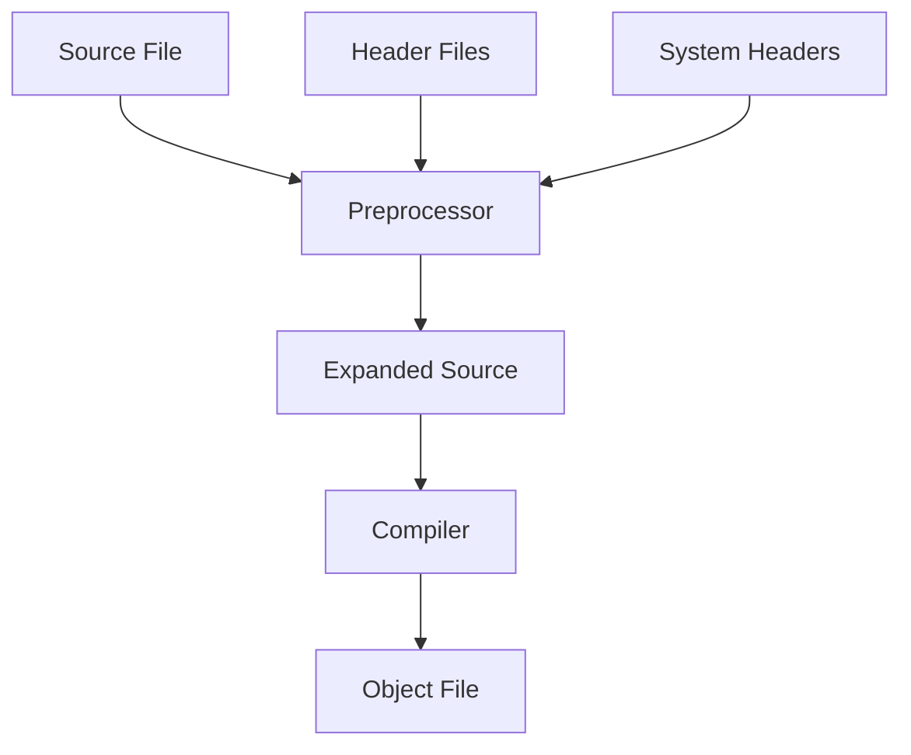
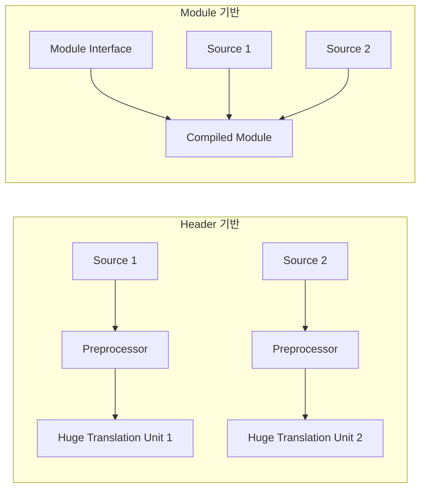

---
tags:
  - Compilation
  - C
  - C++
  - Headers
  - Preprocessor
---

# Header Files: 컴파일의 첫 번째 관문에서 마주하는 복잡성

## 들어가며

"컴파일 시간이 너무 오래 걸립니다." 프로덕션 환경에서 빌드 시간이 30분을 넘어가는 C++ 프로젝트를 마주했을 때, 가장 먼저 의심해야 할 것은 바로 header file의 구조입니다.

Header file은 단순해 보이지만, 실제로는 컴파일 성능과 코드 구조의 품질을 좌우하는 핵심 요소입니다. 왜 iostream을 include하는 간단한 프로그램도 수만 줄의 코드를 전처리해야 할까요? 왜 template heavy한 라이브러리는 컴파일이 느릴까요?

## Header File의 본질 이해하기

### 전처리기의 동작 원리

Header file을 이해하려면 먼저 C/C++ 컴파일 과정의 첫 번째 단계인 전처리(preprocessing)를 알아야 합니다.

```c
#include <stdio.h>
#include "myheader.h"

int main() {
    printf("Hello, World!\n");
    return 0;
}
```

전처리기는 `#include` 지시문을 만나면 해당 파일의 내용을 **텍스트 그대로** 복사해서 붙여넣습니다.



### 실제 전처리 결과 확인하기

```bash
# 전처리 결과만 출력 (-E 플래그)
$ gcc -E hello.c -o hello.i
$ wc -l hello.i
    862 hello.i
```

단순한 "Hello, World!" 프로그램이 전처리 후 862줄이 됩니다. 이것이 바로 header file의 첫 번째 문제점입니다.

### Translation Unit의 개념

```c
// main.c
#include "common.h"
#include "module1.h"
#include "module2.h"

int main() {
    // code
}
```

각 소스 파일(.c, .cpp)은 전처리 후 하나의 **Translation Unit**이 됩니다. 컴파일러는 Translation Unit 단위로 작업하며, 각 unit은 독립적으로 컴파일됩니다.

## Header Guard와 중복 포함 문제

### 문제 상황

```c
// common.h
struct Point {
    int x, y;
};

// geometry.h
#include "common.h"
struct Circle {
    struct Point center;
    double radius;
};

// main.c
#include "common.h"  // Point 정의
#include "geometry.h"  // common.h를 다시 include
```

이 경우 `struct Point`가 두 번 정의되어 컴파일 오류가 발생합니다.

### Header Guard 솔루션

```c
// common.h
#ifndef COMMON_H
#define COMMON_H

struct Point {
    int x, y;
};

#endif // COMMON_H
```

**동작 원리:**

1. 첫 번째 include 시: `COMMON_H`가 정의되지 않아 내용이 포함됨
2. 두 번째 include 시: `COMMON_H`가 이미 정의되어 내용이 건너뛰어짐

### #pragma once의 현대적 접근

```c
// common.h
#pragma once

struct Point {
    int x, y;
};
```

**장점:**

- 코드가 간결함
- 매크로 이름 충돌 걱정 없음
- 컴파일러 최적화 가능

**단점:**

- 표준이 아님 (하지만 모든 주요 컴파일러 지원)
- 심볼릭 링크나 하드링크에서 문제 발생 가능

## Include Path와 검색 순서

### 시스템 Header vs 사용자 Header

```c
#include <stdio.h>     // 시스템 header - angle brackets
#include "myheader.h"  // 사용자 header - quotes
```

### 검색 순서 이해하기

**따옴표(" ") 사용 시:**

1. 현재 소스 파일과 같은 디렉터리
2. -I 옵션으로 지정된 디렉터리 (순서대로)
3. 시스템 include 디렉터리

**꺾쇠(&lt; &gt;) 사용 시:**

1. -I 옵션으로 지정된 디렉터리
2. 시스템 include 디렉터리

### 실제 검색 경로 확인

```bash
# GCC의 기본 include 경로 확인
$ gcc -v -E -x c++ /dev/null
```

```bash
# 사용자 정의 include 경로 추가
$ gcc -I./include -I./external/boost main.cpp
```

### 실무에서의 Include Path 관리

```cmake
# CMake에서의 include path 관리
target_include_directories(myapp PRIVATE
    ${CMAKE_CURRENT_SOURCE_DIR}/include
    ${CMAKE_CURRENT_SOURCE_DIR}/src
)

target_include_directories(myapp SYSTEM PRIVATE
    ${BOOST_INCLUDE_DIRS}
    ${OPENSSL_INCLUDE_DIR}
)
```

## Forward Declaration vs Full Include

### 문제: 불필요한 컴파일 의존성

```cpp
// engine.h - BAD
#include "renderer.h"  // 전체 정의 포함
#include "physics.h"   // 전체 정의 포함
#include "audio.h"     // 전체 정의 포함

class Engine {
    Renderer* renderer;    // 포인터만 사용
    Physics* physics;      // 포인터만 사용  
    Audio* audio;         // 포인터만 사용
};
```

이 경우 `engine.h`를 포함하는 모든 파일이 `renderer.h`, `physics.h`, `audio.h`의 변경에 영향을 받습니다.

### 해결책: Forward Declaration

```cpp
// engine.h - GOOD
class Renderer;  // forward declaration
class Physics;   // forward declaration
class Audio;     // forward declaration

class Engine {
    Renderer* renderer;
    Physics* physics;
    Audio* audio;
    
public:
    void initialize();
    void update();
};
```

```cpp
// engine.cpp - 구현부에서만 full include
#include "engine.h"
#include "renderer.h"
#include "physics.h"  
#include "audio.h"

void Engine::initialize() {
    renderer = new Renderer();  // 여기서 complete type 필요
    // ...
}
```

### Forward Declaration이 가능한 경우

**가능:**

```cpp
class MyClass;

// 포인터와 참조
MyClass* ptr;
MyClass& ref;

// 함수 매개변수와 반환 타입
MyClass* createObject();
void processObject(const MyClass& obj);

// 컨테이너 타입 argument
std::vector<MyClass*> objects;
```

**불가능 (complete type 필요):**

```cpp
class MyClass;

// 값으로 멤버 변수
MyClass obj;  // ERROR: incomplete type

// 상속
class Derived : public MyClass { };  // ERROR

// sizeof 연산자
size_t size = sizeof(MyClass);  // ERROR

// 멤버 함수 호출
MyClass* obj = getObject();
obj->method();  // ERROR
```

### PIMPL Idiom으로 완전한 캡슐화

```cpp
// widget.h
class Widget {
public:
    Widget();
    ~Widget();
    void doSomething();
    
private:
    class Impl;  // forward declaration
    std::unique_ptr<Impl> pImpl;  // pointer to implementation
};
```

```cpp
// widget.cpp
#include "widget.h"
#include "expensive_headers.h"  // 여기서만 include

class Widget::Impl {
public:
    ExpensiveClass obj1;
    AnotherExpensiveClass obj2;
    
    void doSomething() {
        // actual implementation
    }
};

Widget::Widget() : pImpl(std::make_unique<Impl>()) {}
Widget::~Widget() = default;  // unique_ptr이 Impl을 삭제
void Widget::doSomething() { pImpl->doSomething(); }
```

## Precompiled Headers (PCH)

### PCH의 필요성

대규모 C++ 프로젝트에서는 표준 라이브러리와 자주 사용되는 헤더들이 매번 다시 컴파일됩니다.

```cpp
// 많은 소스 파일에서 반복되는 includes
#include <iostream>
#include <vector>
#include <string>
#include <memory>
#include <algorithm>
#include "boost/system.hpp"
#include "boost/filesystem.hpp"
```

### PCH 생성과 사용

```cpp
// stdafx.h (또는 pch.h)
#pragma once

// 자주 사용되지만 거의 변경되지 않는 헤더들
#include <iostream>
#include <vector>
#include <string>
#include <memory>
#include <algorithm>
#include <unordered_map>

// 외부 라이브러리
#include "boost/system.hpp"
#include "boost/filesystem.hpp"
```

```bash
# GCC에서 PCH 생성
$ g++ -x c++-header stdafx.h -o stdafx.h.gch

# PCH 사용하여 컴파일
$ g++ -include stdafx.h main.cpp -o main
```

### Visual Studio에서의 PCH

```cpp
// pch.h
#pragma once
#include <iostream>
#include <vector>
// ... 기타 자주 사용되는 헤더들

// pch.cpp
#include "pch.h"
// 이 파일은 PCH 생성을 위해서만 존재

// main.cpp
#include "pch.h"  // 항상 첫 번째로 include
#include "myheader.h"
```

### PCH 사용 시 주의사항

```cpp
// BAD: PCH 이전에 다른 헤더 포함
#include "config.h"  // 이 헤더의 매크로가 PCH에 영향을 줄 수 있음
#include "pch.h"

// GOOD: PCH를 항상 먼저 포함
#include "pch.h"
#include "config.h"
```

## Header-Only Libraries

### Header-Only 라이브러리의 장점

```cpp
// math_utils.h
#pragma once

template<typename T>
constexpr T square(T x) {
    return x * x;
}

inline double fast_sqrt(double x) {
    // 인라인 함수는 header-only 가능
    return x; // 간단한 예시
}

class MathUtility {
public:
    template<typename T>
    static T max(T a, T b) {
        return a > b ? a : b;
    }
};
```

**장점:**

- 별도의 라이브러리 빌드 불필요
- 컴파일러 최적화 기회 증가
- 배포와 사용이 간단

### Header-Only의 함정들

```cpp
// BAD: static 변수를 header에 정의
// global_state.h
static int global_counter = 0;  // 각 translation unit마다 별도 인스턴스!

void increment() {
    ++global_counter;
}
```

이 경우 각 소스 파일마다 별도의 `global_counter` 인스턴스가 생성됩니다.

```cpp
// GOOD: inline 변수 사용 (C++17)
// global_state.h
inline int global_counter = 0;  // 모든 translation unit에서 동일한 인스턴스

inline void increment() {
    ++global_counter;
}
```

### Template 코드의 특별한 경우

```cpp
// container.h
template<typename T>
class Container {
    std::vector<T> data;
public:
    void add(const T& item) {
        data.push_back(item);
    }
    
    // template 멤버 함수는 자동으로 header-only
    template<typename Predicate>
    void remove_if(Predicate pred) {
        data.erase(
            std::remove_if(data.begin(), data.end(), pred),
            data.end()
        );
    }
};
```

Template 코드는 본질적으로 header-only여야 합니다. 컴파일러가 인스턴스화할 때 정의를 볼 수 있어야 하기 때문입니다.

## C++20 Modules: Header의 미래

### 기존 Header 시스템의 한계

```cpp
// 기존 방식의 문제점
#include <iostream>   // 수천 줄의 코드가 복사됨
#include <vector>     // 또 다른 수천 줄이 복사됨
#include <algorithm>  // 매번 반복되는 전처리

// 매크로 오염
#define MAX(a,b) ((a) > (b) ? (a) : (b))  // 전역 네임스페이스 오염
```

### Module의 새로운 접근

```cpp
// math_module.cpp (module interface)
export module math;

export namespace Math {
    int add(int a, int b) {
        return a + b;
    }
    
    template<typename T>
    T square(T x) {
        return x * x;
    }
}
```

```cpp
// main.cpp
import math;  // #include가 아닌 import!

int main() {
    int result = Math::add(5, 3);
    auto squared = Math::square(4.5);
    return 0;
}
```

### Module의 장점



**성능 향상:**

- Module은 한 번 컴파일되면 재사용됨
- 전처리 시간 대폭 감소
- 컴파일 병렬화 개선

**캡슐화 강화:**

```cpp
// module implementation
module math;  // implementation unit

// 이 함수는 export되지 않아 외부에서 접근 불가
int internal_helper() {
    return 42;
}
```

## Best Practices와 Common Pitfalls

### 1. Include 순서 관리

```cpp
// GOOD: 일관된 include 순서
// main.cpp
#include "main.h"        // 대응하는 헤더 파일 먼저
#include "project.h"     // 프로젝트 헤더
#include "third_party.h" // 서드파티 라이브러리
#include <iostream>      // 표준 라이브러리
#include <vector>
```

### 2. Circular Dependency 해결

```cpp
// BAD: 순환 의존성
// a.h
#include "b.h"
class A {
    B b_instance;
};

// b.h  
#include "a.h"
class B {
    A a_instance;
};
```

```cpp
// GOOD: forward declaration으로 해결
// a.h
class B;  // forward declaration
class A {
    std::unique_ptr<B> b_ptr;  // 포인터 사용
};

// b.h
class A;  // forward declaration
class B {
    std::unique_ptr<A> a_ptr;
};
```

### 3. Macro 사용 주의사항

```cpp
// BAD: 매크로가 헤더에서 전역 네임스페이스 오염
// utils.h
#define MAX(a,b) ((a) > (b) ? (a) : (b))
#define MIN(a,b) ((a) < (b) ? (a) : (b))
```

```cpp
// GOOD: namespace나 inline function 사용
// utils.h
namespace Utils {
    template<typename T>
    constexpr T max(T a, T b) {
        return a > b ? a : b;
    }
    
    template<typename T>
    constexpr T min(T a, T b) {
        return a < b ? a : b;
    }
}
```

### 4. 컴파일 시간 최적화 전략

```cpp
// GOOD: 최소한의 include로 컴파일 시간 단축
// engine.h
#include <memory>        // unique_ptr을 위해 필요
class Renderer;          // forward declaration
class Physics;           // forward declaration

class Engine {
    std::unique_ptr<Renderer> renderer;
    std::unique_ptr<Physics> physics;
public:
    void initialize();
    void shutdown();
};
```

### 5. Unity Build와 Header 최적화

```cpp
// unity.cpp - 여러 소스 파일을 하나로 합쳐서 컴파일
#include "module1.cpp"
#include "module2.cpp"
#include "module3.cpp"
// 장점: 중복 헤더 전처리 감소, 템플릿 인스턴스화 최적화
// 단점: 네임스페이스 충돌 위험, 병렬 컴파일 불가
```

## Real Production Incident Example

### 문제 상황

2024년 초, 대규모 C++ 게임 엔진 프로젝트에서 다음과 같은 현상이 발생했습니다:

1. **증상**: Incremental build가 20분 이상 소요
2. **초기 분석**: 코드 변경량 대비 과도한 재컴파일
3. **실제 원인**: Core header file에 불필요한 template 코드 포함
4. **파급 효과**: 500개 이상의 translation unit이 매번 재컴파일

### 해결 과정

```bash
# 의존성 분석 도구 사용
$ g++ -M main.cpp | tr ' ' '\n' | grep -E '\.h$' | wc -l
247  # 하나의 소스 파일이 247개 헤더에 의존

# 가장 많이 포함되는 헤더 분석
$ find . -name "*.cpp" -exec g++ -M {} \; | \
  tr ' ' '\n' | grep -E '\.h$' | sort | uniq -c | sort -rn | head -10
```

**해결책:**

1. 자주 변경되는 template 코드를 별도 헤더로 분리
2. Forward declaration 적극 활용
3. PIMPL 패턴으로 구현 세부사항 숨김
4. Precompiled headers 도입

결과: **빌드 시간 75% 단축** (20분 → 5분)

## 문제 해결 체크리스트

### 컴파일 시간이 오래 걸릴 때

- [ ] 불필요한 #include 제거

  ```bash
  include-what-you-use main.cpp
  ```

- [ ] Forward declaration 활용 가능성 검토
- [ ] Template heavy한 헤더의 분리 검토
- [ ] PCH 도입 검토
- [ ] Unity build 검토

### 링크 오류가 발생할 때

- [ ] Multiple definition 오류 확인

  ```bash
  # 중복 정의 확인
  $ nm object1.o object2.o | grep "T symbol_name"
  ```

- [ ] Header guard 누락 확인
- [ ] Template 특수화 위치 확인
- [ ] Inline 함수 정의 위치 확인

### 헤더 의존성 문제

- [ ] Circular dependency 확인

  ```bash
  cinclude2dot --src src/ | dot -Tsvg > deps.svg
  ```

- [ ] 불필요한 의존성 제거
- [ ] Interface segregation 적용 검토

## Summary

Header file은 C/C++의 핵심이지만, 잘못 사용하면 컴파일 시간과 코드 구조에 심각한 문제를 일으킵니다. 주요 포인트:

1. **전처리 이해**: Header는 단순한 텍스트 복사임을 인식
2. **의존성 최소화**: Forward declaration과 PIMPL 패턴 활용
3. **컴파일 최적화**: PCH와 Unity build로 빌드 시간 단축
4. **미래 지향**: C++20 modules로의 점진적 마이그레이션 준비

프로덕션 환경에서 빌드 시간은 개발 생산성과 직결됩니다. Header file을 올바르게 관리하면 **개발 경험을 획기적으로 개선**할 수 있습니다.

## 관련 문서

- [Linker 완벽 가이드](linker.md) - Header와 linking의 상관관계
- [Symbol Table 심화 분석](symbol-table.md) - 심볼 선언과 정의의 분리
- [Static Library 구축 가이드](static-library.md) - 라이브러리의 헤더 설계
- [Dynamic Library 완벽 가이드](dynamic-library.md) - 공유 라이브러리와 헤더 관리
