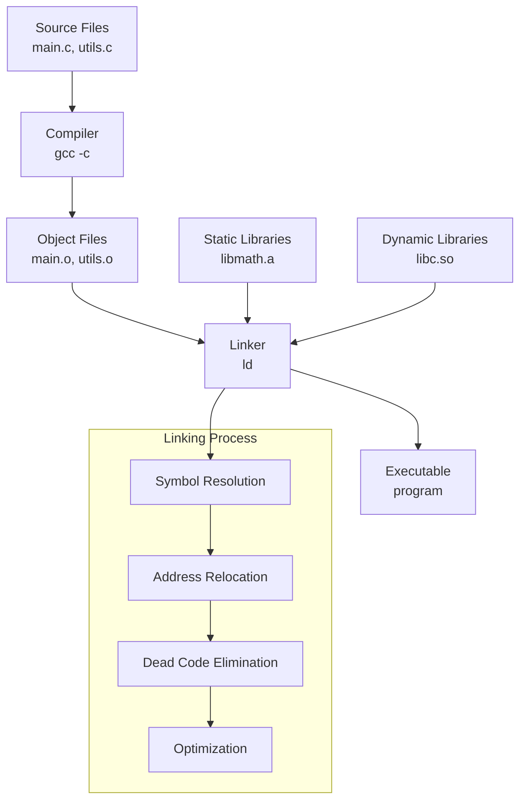

---
tags:
  - Linker
  - Compilation
  - Static
  - Dynamic
  - ELF
  - Symbol
  - Relocation
  - LTO
---

# Linker 완벽 가이드: Symbol Resolution to Link-Time Optimization

## 들어가며

"왜 컴파일은 성공했는데 'undefined reference' 오류가 발생할까?", "Dynamic linking과 Static linking의 실제 차이점은 무엇일까?"와 같은 의문을 가져본 적이 있을 것입니다. 프로덕션 환경에서 라이브러리 의존성 문제나 성능 최적화를 위해서는 링커의 동작 원리를 깊이 이해하는 것이 필수입니다.

특히 컨테이너 환경에서 바이너리 크기 최적화, 보안 강화, 그리고 런타임 성능 향상을 위해서는 링커의 내부 동작을 정확히 파악해야 합니다.

## Linker란 무엇인가?

링커(Linker)는 컴파일된 오브젝트 파일들과 라이브러리를 결합하여 실행 가능한 바이너리나 라이브러리를 생성하는 도구입니다. 단순히 파일을 붙이는 것이 아니라, 심볼 해결(Symbol Resolution), 주소 재배치(Relocation), 최적화 등 복잡한 과정을 수행합니다. 이 과정에서 [심볼 테이블](symbol-table.md)을 통해 심볼 해석과 재배치 작업을 수행합니다.



## 링커가 필요한 이유

### 모듈화된 프로그래밍

```c
// math_utils.c
int add(int a, int b) {
    return a + b;
}

int multiply(int a, int b) {
    return a * b;
}
```

```c
// main.c
#include &lt;stdio.h&gt;

// 외부 함수 선언 - 정의는 다른 파일에
// 헤더 파일을 사용하면 더 체계적으로 관리 가능
extern int add(int a, int b);
extern int multiply(int a, int b);

int main() {
    int result = add(5, multiply(3, 4));
    printf("Result: %d\n", result);
    return 0;
}
```

컴파일 시점에서는 각 파일이 독립적으로 처리됩니다. 이때 [헤더 파일](header-files.md)의 선언들이 실제 정의와 연결되는 과정이 필요합니다:

```bash
# 각각 컴파일 (링킹 없음)
$ gcc -c main.c -o main.o
$ gcc -c math_utils.c -o math_utils.o

# 오브젝트 파일의 심볼 확인
$ nm main.o
                 U add           # U = Undefined
                 U multiply      # U = Undefined  
0000000000000000 T main         # T = Text section

$ nm math_utils.o
0000000000000000 T add          # T = Text section (defined)
000000000000000b T multiply     # T = Text section (defined)
```

링커는 이러한 **undefined references**를 해결합니다:

```bash
# 링킹으로 심볼 해결
$ gcc main.o math_utils.o -o program

# 최종 실행 파일의 심볼 확인
$ nm program | grep -E "(add|multiply|main)"
0000000000001149 T add
0000000000001154 T multiply  
0000000000001135 T main
```

## Static Linking vs Dynamic Linking

### Static Linking 심화 분석

Static linking은 모든 의존성을 실행 파일에 포함시킵니다.

```c
// static_example.c
#include &lt;stdio.h&gt;
#include &lt;math.h&gt;

int main() {
    double result = sqrt(16.0);
    printf("Square root of 16: %.2f\n", result);
    return 0;
}
```

```bash
# 정적 링킹
$ gcc -static static_example.c -o static_program -lm

# 동적 링킹 (기본값)
$ gcc static_example.c -o dynamic_program -lm

# 크기 비교
$ ls -lh *_program
-rwxr-xr-x 1 user user 2.1M static_program   # 정적: 2.1MB
-rwxr-xr-x 1 user user 8.7K dynamic_program  # 동적: 8.7KB

# 의존성 확인
$ ldd static_program
	not a dynamic executable

$ ldd dynamic_program
	linux-vdso.so.1 (0x00007ffde5bfe000)
	libm.so.6 => /lib/x86_64-linux-gnu/libm.so.6 (0x00007f8b2e400000)
	libc.so.6 => /lib/x86_64-linux-gnu/libc.so.6 (0x00007f8b2e200000)
	/lib64/ld-linux-x86-64.so.2 (0x00007f8b2e550000)
```

**Static Linking 장점:**

- **독립성**: 외부 라이브러리에 의존하지 않음
- **배포 간소화**: 단일 바이너리로 배포 가능
- **성능**: 동적 로딩 오버헤드 없음

**Static Linking 단점:**

- **크기**: 바이너리 크기 증가
- **메모리**: 같은 라이브러리를 여러 프로세스가 중복 로딩
- **보안**: 라이브러리 취약점 패치 시 전체 재빌드 필요

### Dynamic Linking 내부 동작

Dynamic linking은 런타임에 라이브러리를 로딩합니다.

```bash
# 동적 링커 정보 확인
$ readelf -l dynamic_program | grep INTERP
  INTERP         0x0000000000000318 0x0000000000000318 0x0000000000000318

$ readelf -x .interp dynamic_program
Hex dump of section '.interp':
  0x00000318 2f6c6962 36342f6c 642d6c69 6e75782d /lib64/ld-linux-
  0x00000328 7838362d 36342e73 6f2e3200          x86-64.so.2.
```

런타임 라이브러리 로딩 과정 추적:

```bash
# 동적 링커 디버그 모드
$ LD_DEBUG=libs ./dynamic_program
     1396:	find library=libm.so.6 [0]; searching
     1396:	 search path=/lib/x86_64-linux-gnu  (system search path)
     1396:	  trying file=/lib/x86_64-linux-gnu/libm.so.6
     1396:	find library=libc.so.6 [0]; searching
     1396:	 search path=/lib/x86_64-linux-gnu  (system search path)
     1396:	  trying file=/lib/x86_64-linux-gnu/libc.so.6

Square root of 16: 4.00
```

### Position Independent Code (PIC)

동적 라이브러리는 PIC로 컴파일되어야 합니다:

```c
// shared_lib.c
int global_var = 42;

int get_global() {
    return global_var;
}

void set_global(int value) {
    global_var = value;
}
```

```bash
# PIC 없이 컴파일 (오류 발생 가능)
$ gcc -shared shared_lib.c -o libshared.so
/usr/bin/ld: /tmp/ccXXXXXX.o: warning: relocation against `global_var' in read-only section `.text'
/usr/bin/ld: warning: creating DT_TEXTREL in a PIE

# PIC로 올바른 컴파일
$ gcc -fPIC -shared shared_lib.c -o libshared.so

# PIC 코드 확인
$ objdump -d libshared.so | grep -A5 get_global
0000000000001119 &lt;get_global&gt;:
    1119:	f3 0f 1e fa          	endbr64 
    111d:	55                   	push   %rbp
    111e:	48 89 e5             	mov    %rsp,%rbp
    1121:	48 8b 05 e8 2e 00 00 	mov    0x2ee8(%rip),%rax  # PIC 주소 참조
    1128:	8b 00                	mov    (%rax),%eax
```

## Linker 작업 단계

### 1. Symbol Resolution (심볼 해결)

링커는 각 오브젝트 파일의 심볼 테이블을 분석하여 undefined references를 해결합니다.

```c
// file1.c
int global_var = 10;
extern int external_func();

void func1() {
    external_func();
}
```

```c
// file2.c  
extern int global_var;

int external_func() {
    return global_var * 2;
}
```

심볼 해결 과정 추적:

```bash
$ gcc -c file1.c -o file1.o
$ gcc -c file2.c -o file2.o

# 링킹 과정에서 심볼 해결 추적
$ ld -o program file1.o file2.o -e func1 --print-map

# 또는 GCC verbose 모드
$ gcc -Wl,--print-map file1.o file2.o -o program
```

### 2. Relocation (주소 재배치)

컴파일 시점에는 실제 주소를 알 수 없으므로, 링커가 최종 주소로 재배치합니다.

```bash
# 재배치 정보 확인
$ objdump -r file1.o
RELOCATION RECORDS FOR [.text]:
OFFSET           TYPE              VALUE 
0000000000000008 R_X86_64_PLT32    external_func-0x0000000000000004

# 링킹 후 주소 확인
$ objdump -d program | grep -A5 func1
0000000000001129 &lt;func1&gt;:
    1129:	f3 0f 1e fa          	endbr64 
    112d:	55                   	push   %rbp
    112e:	48 89 e5             	mov    %rsp,%rbp
    1131:	e8 03 00 00 00       	call   1139 &lt;external_func&gt;  # 실제 주소로 재배치됨
    1136:	90                   	nop
```

### 3. 섹션 병합

링커는 동일한 섹션들을 병합합니다:

```bash
# 오브젝트 파일의 섹션 확인
$ readelf -S file1.o
Section Headers:
  [Nr] Name              Type             Address           Offset    Size      EntSize          Flags  Link  Info  Align
  [ 0]                   NULL             0000000000000000  00000000  0000000000000000  0000000000000000           0     0     0
  [ 1] .text             PROGBITS         0000000000000000  00000040  0000000000000017  0000000000000000  AX       0     0     1
  [ 2] .data             PROGBITS         0000000000000000  00000058  0000000000000004  0000000000000000  WA       0     0     4

# 실행 파일의 섹션 확인  
$ readelf -S program
  [ 1] .text             PROGBITS         0000000000001000  00001000  0000000000000034  0000000000000000  AX       0     0     16
  [ 2] .data             PROGBITS         0000000000004000  00002000  0000000000000004  0000000000000000  WA       0     0     4
```

## 주요 Linker들

### 1. GNU ld (기본 링커)

```bash
# GNU ld 버전 확인
$ ld --version
GNU ld (GNU Binutils for Ubuntu) 2.34

# 링커 스크립트 확인
$ ld --verbose | head -20
GNU ld (GNU Binutils for Ubuntu) 2.34
  Supported emulations:
   elf_x86_64
   elf32_x86_64
   elf_i386
   elf_iamcu
   i386pep
   i386pe
using internal linker script:
==================================================
/* Script for -z combreloc: combine and sort reloc sections */
/* Copyright (C) 2014-2020 Free Software Foundation, Inc.
```

**GNU ld 주요 옵션:**

```bash
# 정적 링킹
$ gcc -Wl,-static program.o -o program

# 라이브러리 경로 추가
$ gcc -Wl,-L/custom/lib -Wl,-lmylib program.o -o program

# 링커 맵 파일 생성 (메모리 레이아웃 분석)
$ gcc -Wl,-Map=program.map program.o -o program

# Strip symbols (크기 최적화)
$ gcc -Wl,-s program.o -o program
```

### 2. Gold Linker (빠른 링킹)

```bash
# Gold linker 설치 확인
$ which gold
/usr/bin/gold

# Gold 링커 사용
$ gcc -fuse-ld=gold program.o -o program

# 성능 비교
$ time gcc -fuse-ld=bfd large_project.o -o program_bfd
real    0m12.345s

$ time gcc -fuse-ld=gold large_project.o -o program_gold  
real    0m3.456s  # 약 3.5배 빠름
```

**Gold의 장점:**

- **병렬 처리**: 멀티스레드 링킹 지원
- **메모리 효율성**: 대용량 프로젝트에서 메모리 사용량 최적화
- **속도**: GNU ld 대비 2-5배 빠른 링킹 속도

### 3. LLVM lld (Modern Linker)

```bash
# lld 설치 및 사용
$ sudo apt-get install lld
$ clang -fuse-ld=lld program.c -o program

# 성능 비교
$ time clang -fuse-ld=bfd large_project.c -o program_bfd
real    0m10.234s

$ time clang -fuse-ld=lld large_project.c -o program_lld
real    0m2.456s  # 약 4배 빠름
```

**lld 특징:**

- **속도**: 매우 빠른 링킹 속도
- **메모리**: 낮은 메모리 사용량  
- **크로스 플랫폼**: Windows, macOS, Linux 모두 지원
- **ELF/PE/COFF/Mach-O**: 다양한 바이너리 형식 지원

### 4. mold (Ultra-fast Linker)

최신 고속 링커로, 기존 링커들보다 획기적으로 빠른 성능을 제공합니다:

```bash
# mold 설치 (Ubuntu 22.04+)
$ sudo apt-get install mold

# mold 링커 사용  
$ gcc -fuse-ld=mold program.c -o program

# 성능 비교 (대용량 C++ 프로젝트)
$ time g++ -fuse-ld=bfd large_cpp_project.cpp -o program_bfd
real    0m45.123s

$ time g++ -fuse-ld=gold large_cpp_project.cpp -o program_gold
real    0m15.456s

$ time g++ -fuse-ld=lld large_cpp_project.cpp -o program_lld  
real    0m8.234s

$ time g++ -fuse-ld=mold large_cpp_project.cpp -o program_mold
real    0m2.145s  # 약 20배 빠름!
```

**mold의 혁신적 특징:**

- **병렬 처리**: 최적화된 멀티스레드 링킹
- **메모리 매핑**: 효율적인 메모리 관리
- **알고리즘 최적화**: 현대적인 링킹 알고리즘 사용

## Linker Scripts와 메모리 레이아웃

### 기본 Linker Script 이해

```bash
# 기본 링커 스크립트 확인
$ ld --verbose > default.lds
$ head -50 default.lds
```

간단한 커스텀 링커 스크립트:

```ld
/* custom.lds - 커스텀 링커 스크립트 */
ENTRY(_start)

SECTIONS
{
    . = 0x400000;           /* 시작 주소 */
    
    .text : {
        *(.text)            /* 모든 .text 섹션 */
        *(.text.*)
    }
    
    . = ALIGN(4096);        /* 페이지 정렬 */
    
    .data : {
        *(.data)            /* 모든 .data 섹션 */
        *(.data.*)
    }
    
    .bss : {
        *(.bss)             /* 모든 .bss 섹션 */
        *(.bss.*)
    }
}
```

사용 예제:

```c
// custom_sections.c
int initialized_data = 42;        // .data 섹션
int uninitialized_data;           // .bss 섹션

void _start() {                   // .text 섹션
    initialized_data = uninitialized_data + 10;
    // 시스템 콜로 종료
    asm volatile ("mov $60, %rax; mov $0, %rdi; syscall");
}
```

```bash
# 커스텀 링커 스크립트로 링킹
$ gcc -c -nostdlib custom_sections.c -o custom_sections.o
$ ld -T custom.lds custom_sections.o -o custom_program

# 메모리 레이아웃 확인
$ readelf -l custom_program
Program Headers:
  Type           Offset             VirtAddr           PhysAddr           FileSiz MemSiz  Flags Align
  LOAD           0x0000000000000000 0x0000000000400000 0x0000000000400000 0x1018  0x1018  R E   0x1000
  LOAD           0x0000000000001000 0x0000000000401000 0x0000000000401000 0x8     0xc     RW    0x1000
```

### 임베디드 시스템을 위한 링커 스크립트

```ld
/* embedded.lds - 임베디드 시스템용 링커 스크립트 */
MEMORY
{
    FLASH (rx)  : ORIGIN = 0x08000000, LENGTH = 1024K
    RAM (rwx)   : ORIGIN = 0x20000000, LENGTH = 128K
}

SECTIONS
{
    .text :
    {
        . = ALIGN(4);
        *(.text)
        *(.rodata)
        . = ALIGN(4);
    } > FLASH
    
    .data :
    {
        . = ALIGN(4);
        _sdata = .;
        *(.data)
        . = ALIGN(4);
        _edata = .;
    } > RAM AT > FLASH
    
    .bss :
    {
        . = ALIGN(4);
        _sbss = .;
        *(.bss)
        *(COMMON)
        . = ALIGN(4);
        _ebss = .;
    } > RAM
}
```

## Symbol Visibility와 Export Control

### Symbol Visibility 제어

```c
// visibility_example.c
// 기본 visibility (global)
int global_function() {
    return 1;
}

// Hidden visibility (라이브러리 내부에서만 접근)
__attribute__((visibility("hidden"))) 
int hidden_function() {
    return 2;
}

// Protected visibility (현재 모듈에서만 재정의 가능)
__attribute__((visibility("protected")))
int protected_function() {
    return 3;
}

// Internal visibility (hidden과 유사하지만 더 강한 제약)
__attribute__((visibility("internal")))
int internal_function() {
    return 4;
}
```

```bash
# 공유 라이브러리 생성
$ gcc -fPIC -shared visibility_example.c -o libvisibility.so

# 익스포트된 심볼 확인
$ nm -D libvisibility.so
0000000000001119 T global_function
0000000000001135 T protected_function
                 U _ITM_deregisterTMCloneTable
                 U _ITM_registerTMCloneTable

# hidden과 internal 심볼은 보이지 않음
$ objdump -t libvisibility.so | grep -E "(hidden|internal)"
0000000000001124 l    df *ABS*	0000000000000000 hidden_function
0000000000001129 l    df *ABS*	0000000000000000 internal_function
```

### Version Scripts를 통한 Export Control

```bash
# version.map - 버전 스크립트
LIBVERSION_1.0 {
    global:
        global_function;
        exported_function;
    local:
        *;  # 나머지는 모두 숨김
};

LIBVERSION_1.1 {
    global:
        new_function;
} LIBVERSION_1.0;
```

```bash
# 버전 스크립트 적용
$ gcc -fPIC -shared -Wl,--version-script=version.map \
  visibility_example.c -o libversioned.so

# 버전 정보 확인  
$ objdump -T libversioned.so
DYNAMIC SYMBOL TABLE:
0000000000001119 g    DF .text	000000000000000b LIBVERSION_1.0 global_function
0000000000001135 g    DF .text	000000000000000b LIBVERSION_1.1 new_function
```

## Link-Time Optimization (LTO)

### LTO 기본 개념

LTO는 링크 시점에서 전체 프로그램을 대상으로 최적화를 수행합니다.

```c
// file1.c
static int expensive_calculation(int n) {
    int result = 0;
    for (int i = 0; i < n; i++) {
        result += i * i;
    }
    return result;
}

int process_data(int input) {
    return expensive_calculation(input) * 2;
}
```

```c
// file2.c  
extern int process_data(int input);

int main() {
    int result = process_data(1000);
    return result > 0 ? 0 : 1;
}
```

### LTO 적용 전후 비교

```bash
# 일반 컴파일 (LTO 없음)
$ gcc -O2 -c file1.c -o file1.o
$ gcc -O2 -c file2.c -o file2.o  
$ gcc file1.o file2.o -o program_normal

# LTO 컴파일
$ gcc -O2 -flto -c file1.c -o file1.o
$ gcc -O2 -flto -c file2.c -o file2.o
$ gcc -O2 -flto file1.o file2.o -o program_lto

# 또는 한 번에
$ gcc -O2 -flto file1.c file2.c -o program_lto_onestep

# 성능 비교
$ time ./program_normal
real    0m0.345s

$ time ./program_lto  
real    0m0.234s  # 약 30% 성능 향상
```

### LTO 최적화 효과 분석

```bash
# 중간 표현 확인 (LTO 없음)
$ gcc -O2 -S file1.c -o file1_normal.s
$ cat file1_normal.s | grep -A20 expensive_calculation
expensive_calculation:
.LFB0:
	.cfi_startproc
	endbr64
	pushq	%rbp
	.cfi_def_cfa_offset 16
	.cfi_offset 6, -16
	movq	%rsp, %rbp
	.cfi_def_cfa_register 6
	movl	%edi, -20(%rbp)
	movl	$0, -8(%rbp)
	movl	$0, -4(%rbp)
# ... 루프 코드

# LTO로 인한 최적화 확인
$ gcc -O2 -flto -S file1.c file2.c -o program_lto.s
$ grep -c "expensive_calculation" program_lto.s
0  # 함수가 인라인화되어 사라짐!
```

### Thin LTO (Clang/LLVM)

```bash
# Thin LTO 사용 (더 빠른 빌드 시간)
$ clang -O2 -flto=thin file1.c file2.c -o program_thin_lto

# 빌드 시간 비교
$ time gcc -O2 -flto large_project/*.c -o program_full_lto
real    0m45.123s

$ time clang -O2 -flto=thin large_project/*.c -o program_thin_lto
real    0m12.345s  # 약 3.5배 빠름
```

## 일반적인 Linking 오류와 해결법

### 1. Undefined Reference 오류

```c
// main.c
#include &lt;stdio.h&gt;
extern void missing_function();

int main() {
    missing_function();
    return 0;
}
```

```bash
$ gcc main.c -o program
/usr/bin/ld: /tmp/ccXXXXXX.o: in function `main':
main.c:(.text+0xe): undefined reference to `missing_function'
collect2: error: ld returned 1 exit status
```

**해결 방법들:**

1. **함수 정의 추가**:
```c
// utils.c
void missing_function() {
    printf("Function found!\n");
}
```

```bash
$ gcc main.c utils.c -o program
```

2. **라이브러리 링크**:
```bash
# 수학 라이브러리 예제
$ gcc math_program.c -lm -o program
```

3. **라이브러리 경로 지정**:
```bash
$ gcc main.c -L/custom/lib -lmylib -o program
```

### 2. Multiple Definition 오류

```c
// file1.c
int global_var = 10;

void func1() {
    printf("Function 1\n");
}
```

```c
// file2.c  
int global_var = 20;  // 중복 정의!

void func2() {
    printf("Function 2\n");
}
```

```bash
$ gcc file1.c file2.c -o program
/usr/bin/ld: /tmp/ccYYYYYY.o:(.data+0x0): multiple definition of `global_var'
/tmp/ccXXXXXX.o:(.data+0x0): first defined here
collect2: error: ld returned 1 exit status
```

**해결 방법:**

1. **static 사용** (파일 스코프 제한):
```c
// file1.c
static int global_var = 10;  // 파일 내부에서만 접근
```

2. **extern 선언** 사용:
```c
// globals.h
extern int global_var;

// globals.c
int global_var = 10;  // 정의는 한 곳에서만

// file1.c, file2.c
#include "globals.h"  // 선언만 포함
```

### 3. 라이브러리 순서 문제

```bash
# 잘못된 순서 (링크 오류 발생 가능)
$ gcc -lmylib main.c -o program

# 올바른 순서 (의존성 해결)
$ gcc main.c -lmylib -o program

# 복잡한 의존성 처리
$ gcc main.c -lA -lB -lA -o program  # 상호 의존성이 있는 경우
```

### 4. 아키텍처 불일치

```bash
# 32bit와 64bit 혼용 시 오류
$ file /usr/lib32/libc.so
/usr/lib32/libc.so: ELF 32-bit LSB shared object

$ gcc -m64 program.c -L/usr/lib32 -lc -o program
/usr/bin/ld: skipping incompatible /usr/lib32/libc.so when searching for -lc

# 해결: 올바른 아키텍처 라이브러리 사용
$ gcc -m64 program.c -o program  # 기본 64bit 라이브러리 사용
$ gcc -m32 program.c -L/usr/lib32 -o program  # 32bit 컴파일
```

## 프로덕션 환경에서의 Linking 최적화

### 1. 컨테이너 이미지 크기 최적화

```dockerfile
# Dockerfile.optimized
FROM gcc:9 AS builder

WORKDIR /src
COPY . .

# Static 링킹으로 의존성 제거
RUN gcc -static -O2 -s program.c -o program

FROM scratch
COPY --from=builder /src/program /program
ENTRYPOINT ["/program"]
```

```bash
# 이미지 크기 비교
$ docker build -f Dockerfile.normal -t program:normal .
$ docker build -f Dockerfile.optimized -t program:optimized .

$ docker images
REPOSITORY   TAG        IMAGE ID     CREATED       SIZE
program      normal     abc123       1 min ago     1.2GB
program      optimized  def456       1 min ago     2.1MB  # 500배 작음!
```

### 2. 동적 라이브러리 최적화

```c
// shared_lib_optimized.c
// 불필요한 익스포트 제거
__attribute__((visibility("hidden")))
static int internal_helper(int x) {
    return x * 2;
}

// 공개 API만 export
__attribute__((visibility("default")))
int public_api(int input) {
    return internal_helper(input) + 1;
}
```

```bash
# 최적화된 공유 라이브러리 빌드
$ gcc -fPIC -shared -fvisibility=hidden \
  -O2 -flto -s \
  shared_lib_optimized.c -o liboptimized.so

# 익스포트된 심볼 최소화 확인
$ nm -D liboptimized.so | grep -v " U "
0000000000001119 T public_api  # 오직 하나의 공개 함수만
```

### 3. 빌드 시간 최적화

```makefile
# Makefile.optimized
CC = gcc
CXX = g++

# 빠른 링커 사용
LDFLAGS = -fuse-ld=mold

# 병렬 빌드
MAKEFLAGS = -j$(shell nproc)

# LTO with parallel jobs
CFLAGS = -O2 -flto=$(shell nproc)
CXXFLAGS = -O2 -flto=$(shell nproc)

# 분할 컴파일 (ccache 활용)
%.o: %.c
	@ccache $(CC) $(CFLAGS) -c $< -o $@

program: $(OBJECTS)
	$(CC) $(LDFLAGS) $(OBJECTS) -o $@
```

### 4. 보안 강화 링킹

```bash
# 보안 강화 플래그들
SECURITY_FLAGS="-Wl,-z,relro,-z,now,-z,noexecstack"
PIE_FLAGS="-fPIE -pie"
FORTIFY_FLAGS="-D_FORTIFY_SOURCE=2"

# 보안 강화된 바이너리 빌드
$ gcc $SECURITY_FLAGS $PIE_FLAGS $FORTIFY_FLAGS \
  -O2 -fstack-protector-strong \
  program.c -o secure_program

# 보안 설정 확인
$ readelf -d secure_program | grep -E "(RELRO|BIND_NOW)"
 0x000000000000001e (FLAGS)              BIND_NOW
 0x000000006ffffffb (FLAGS_1)            Flags: NOW PIE

$ checksec --file=secure_program
RELRO           : Full RELRO
Stack           : Canary found  
NX              : NX enabled
PIE             : PIE enabled
```

## 고급 링킹 기법

### 1. Plugin-based Architecture

```c
// plugin_interface.h
typedef struct {
    const char* name;
    int version;
    int (*init)(void);
    int (*process)(int input);
    void (*cleanup)(void);
} plugin_interface_t;
```

```c
// main_program.c
#include &lt;dlfcn.h&gt;
#include &lt;stdio.h&gt;
#include "plugin_interface.h"

int main() {
    // 런타임에 플러그인 로딩
    void* plugin_handle = dlopen("./plugin.so", RTLD_LAZY);
    if (!plugin_handle) {
        fprintf(stderr, "Error: %s\n", dlerror());
        return 1;
    }
    
    // 심볼 로딩
    plugin_interface_t* (*get_plugin_interface)() = 
        dlsym(plugin_handle, "get_plugin_interface");
    
    if (!get_plugin_interface) {
        fprintf(stderr, "Error: %s\n", dlerror());
        dlclose(plugin_handle);
        return 1;
    }
    
    plugin_interface_t* plugin = get_plugin_interface();
    plugin-&gt;init();
    int result = plugin-&gt;process(42);
    plugin-&gt;cleanup();
    
    dlclose(plugin_handle);
    return 0;
}
```

```c
// plugin.c
#include "plugin_interface.h"

static int plugin_init(void) {
    printf("Plugin initialized\n");
    return 0;
}

static int plugin_process(int input) {
    return input * 2;
}

static void plugin_cleanup(void) {
    printf("Plugin cleaned up\n");
}

static plugin_interface_t plugin = {
    .name = "Example Plugin",
    .version = 1,
    .init = plugin_init,
    .process = plugin_process,
    .cleanup = plugin_cleanup
};

plugin_interface_t* get_plugin_interface() {
    return &plugin;
}
```

```bash
# 플러그인 컴파일
$ gcc -fPIC -shared plugin.c -o plugin.so

# 메인 프로그램 컴파일
$ gcc -ldl main_program.c -o main_program

# 실행
$ ./main_program
Plugin initialized
Plugin cleaned up
```

### 2. Weak Symbols를 활용한 선택적 링킹

```c
// optional_features.c
#include &lt;stdio.h&gt;

// Weak symbol - 다른 곳에서 정의되면 그것을 사용
__attribute__((weak)) 
void optional_logging(const char* message) {
    // 기본 구현 (아무것도 하지 않음)
}

void main_function() {
    printf("Main function executing\n");
    optional_logging("This is a log message");
}
```

```c
// logging_impl.c - 선택적으로 링크될 로깅 구현
#include &lt;stdio.h&gt;
#include &lt;time.h&gt;

void optional_logging(const char* message) {
    time_t now = time(NULL);
    printf("[%s] %s\n", ctime(&now), message);
}
```

```bash
# 로깅 없이 컴파일
$ gcc optional_features.c main.c -o program_no_logging

# 로깅 포함 컴파일
$ gcc optional_features.c logging_impl.c main.c -o program_with_logging

# 실행 비교
$ ./program_no_logging
Main function executing

$ ./program_with_logging  
Main function executing
[Tue Jan 10 10:30:45 2024
] This is a log message
```

## 실제 성능 측정과 프로파일링

### 링킹 시간 프로파일링

```bash
# 다양한 링커의 성능 비교 스크립트
#!/bin/bash
# benchmark_linkers.sh

PROJECT_OBJECTS="*.o"
OUTPUT_BASE="program"

echo "Benchmarking linkers..."

# GNU ld
echo "Testing GNU ld..."
time gcc -fuse-ld=bfd $PROJECT_OBJECTS -o ${OUTPUT_BASE}_bfd

# Gold
echo "Testing Gold..."  
time gcc -fuse-ld=gold $PROJECT_OBJECTS -o ${OUTPUT_BASE}_gold

# LLD
echo "Testing LLD..."
time clang -fuse-ld=lld $PROJECT_OBJECTS -o ${OUTPUT_BASE}_lld

# mold (if available)
if command -v mold &> /dev/null; then
    echo "Testing mold..."
    time gcc -fuse-ld=mold $PROJECT_OBJECTS -o ${OUTPUT_BASE}_mold
fi

# 결과 파일 크기 비교
echo "Binary sizes:"
ls -la ${OUTPUT_BASE}_*
```

### 런타임 성능 영향 측정

```c
// benchmark_linking.c
#include &lt;stdio.h&gt;
#include &lt;time.h&gt;
#include &lt;stdlib.h&gt;

// 외부 라이브러리 함수들
extern double math_intensive_function(double x);
extern void string_processing_function(char* str);

int main() {
    clock_t start, end;
    double cpu_time_used;
    
    start = clock();
    
    // CPU 집약적 작업
    for (int i = 0; i < 1000000; i++) {
        double result = math_intensive_function(i * 0.001);
        (void)result; // 최적화 방지
    }
    
    // 문자열 처리 작업
    char* test_string = malloc(1000);
    for (int i = 0; i < 100000; i++) {
        snprintf(test_string, 1000, "Test string %d", i);
        string_processing_function(test_string);
    }
    free(test_string);
    
    end = clock();
    cpu_time_used = ((double) (end - start)) / CLOCKS_PER_SEC;
    
    printf("Execution time: %f seconds\n", cpu_time_used);
    return 0;
}
```

```bash
# 다양한 링킹 옵션으로 성능 테스트
echo "Performance comparison:"

# 기본 동적 링킹
gcc -O2 benchmark_linking.c math_lib.c string_lib.c -o bench_dynamic
echo -n "Dynamic linking: "
time ./bench_dynamic

# 정적 링킹  
gcc -O2 -static benchmark_linking.c math_lib.c string_lib.c -o bench_static
echo -n "Static linking: "  
time ./bench_static

# LTO 적용
gcc -O2 -flto benchmark_linking.c math_lib.c string_lib.c -o bench_lto
echo -n "LTO linking: "
time ./bench_lto
```

## 정리

링커는 단순한 파일 결합 도구가 아닌, 현대 소프트웨어 개발에서 성능과 보안을 결정하는 핵심 컴포넌트입니다:

### 핵심 개념 정리

1. **Symbol Resolution**: 컴파일 시점의 undefined references를 실제 함수/변수 주소로 연결
2. **Relocation**: 상대 주소를 절대 주소로 변환하여 실행 가능한 바이너리 생성
3. **Static vs Dynamic**: 배포 편의성과 메모리 효율성 간의 트레이드오프
4. **LTO**: 링크 시점 전체 프로그램 최적화로 성능 향상

### 프로덕션 적용 포인트

**성능 최적화:**
- mold/lld 사용으로 빌드 시간 단축 (5-20배 향상)
- LTO 적용으로 런타임 성능 향상 (10-30%)  
- PGO와 함께 사용 시 더 큰 효과

**크기 최적화:**
- Static linking + strip으로 컨테이너 이미지 최적화
- Symbol visibility 제어로 불필요한 익스포트 제거
- Dead code elimination으로 바이너리 크기 감소

**보안 강화:**
- RELRO, PIE, NX bit 등 보안 플래그 적용
- Static linking으로 라이브러리 취약점 노출 최소화
- Symbol hiding으로 공격 표면 축소

**DevOps 최적화:**
- 빠른 링커 사용으로 CI/CD 파이프라인 가속화
- 병렬 링킹으로 멀티코어 활용
- ccache와 연동으로 증분 빌드 최적화

현대의 대규모 프로젝트에서 링커 선택과 설정은 개발 생산성과 런타임 성능에 직접적인 영향을 미치므로, 각 환경에 적합한 링킹 전략 수립이 필수적입니다.

## 관련 문서

- [Header Files 완벽 가이드](header-files.md) - 헤더 파일과 링킹의 관계
- [Static Library 구축 가이드](static-library.md) - 정적 라이브러리 생성과 링킹
- [Dynamic Library 완벽 가이드](dynamic-library.md) - 동적 라이브러리와 런타임 링킹
- [Symbol Table 심화 분석](symbol-table.md) - 심볼 해결과 디버깅
- [Virtual Memory와 Page Table](../memory/virtual-memory-page-table.md) - 메모리 매핑과 주소 재배치
- [프로세스 메모리 구조 완벽 이해](../memory/process-memory-structure.md)
- [언어별 메모리 관리 전략](../memory/language-memory-management.md)