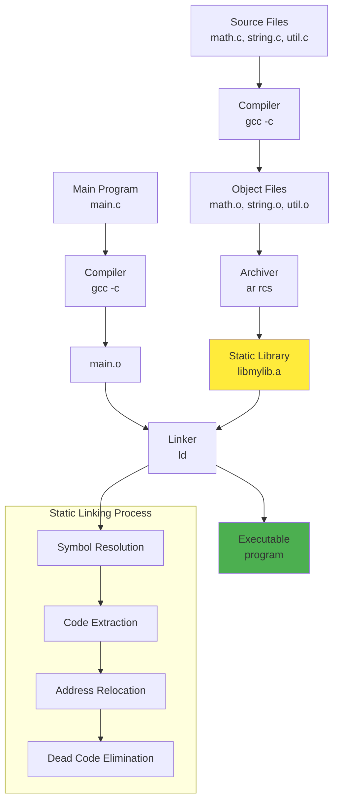

---
tags:
  - Static
  - Library
  - Archive
  - ar
  - ranlib
  - Linking
  - Symbol
  - LTO
  - Thin Archive
---

# Static Library 완벽 가이드: Archive Creation to Link-Time Optimization

## 들어가며

"왜 같은 함수인데 어떤 프로그램에서는 링크가 되고 어떤 곳에서는 undefined reference가 발생할까?", "프로그램 크기는 큰데 사용하지 않는 함수까지 모두 포함되는 이유는 무엇일까?"와 같은 의문을 가져본 적이 있을 것입니다.

프로덕션 환경에서 바이너리 최적화, 배포 편의성, 그리고 빌드 시간 단축을 위해서는 static library의 내부 동작과 최적화 기법을 정확히 이해하는 것이 필수입니다. 특히 컨테이너 환경과 마이크로서비스 아키텍처에서는 static linking의 장단점을 명확히 파악하고 적절히 활용해야 합니다.

## Static Library란 무엇인가?

Static Library(정적 라이브러리)는 컴파일된 오브젝트 파일들을 하나의 아카이브로 묶어놓은 파일입니다. 프로그램 컴파일 시점에 필요한 코드가 실행 파일에 직접 포함되어, 외부 의존성 없이 독립적으로 실행 가능한 바이너리를 생성합니다.



### Platform별 Static Library 확장자

| Platform | Extension | Archiver | Example |
|----------|-----------|----------|---------|
| Linux/Unix | `.a` (Archive) | `ar` | `libmath.a` |
| Windows | `.lib` (Library) | `lib.exe` | `math.lib` |
| macOS | `.a` (Archive) | `ar` / `libtool` | `libmath.a` |

## Static Library 생성과 관리

### 기본 Archive 생성

```c
// math_utils.c - 수학 연산 함수들
#include <stdio.h>

int add(int a, int b) {
    printf("Adding %d + %d\n", a, b);
    return a + b;
}

int multiply(int a, int b) {
    printf("Multiplying %d * %d\n", a, b);
    return a * b;
}

int power(int base, int exp) {
    int result = 1;
    for (int i = 0; i < exp; i++) {
        result *= base;
    }
    printf("%d^%d = %d\n", base, exp, result);
    return result;
}
```

```c
// string_utils.c - 문자열 처리 함수들
#include <string.h>
#include <stdlib.h>
#include <stdio.h>

char* string_duplicate(const char* src) {
    if (!src) return NULL;
    
    size_t len = strlen(src);
    char* dst = malloc(len + 1);
    if (dst) {
        strcpy(dst, src);
        printf("Duplicated string: %s\n", dst);
    }
    return dst;
}

void string_reverse(char* str) {
    if (!str) return;
    
    size_t len = strlen(str);
    for (size_t i = 0; i < len / 2; i++) {
        char temp = str[i];
        str[i] = str[len - 1 - i];
        str[len - 1 - i] = temp;
    }
    printf("Reversed string: %s\n", str);
}

int string_count_chars(const char* str, char c) {
    if (!str) return 0;
    
    int count = 0;
    for (const char* p = str; *p; p++) {
        if (*p == c) count++;
    }
    printf("Character '%c' appears %d times in '%s'\n", c, count, str);
    return count;
}
```

```c
// debug_utils.c - 디버깅 유틸리티
#include <stdio.h>
#include <stdarg.h>
#include <time.h>

static int debug_enabled = 1;

void debug_log(const char* format, ...) {
    if (!debug_enabled) return;
    
    time_t now = time(NULL);
    printf("[DEBUG %s] ", ctime(&now));
    
    va_list args;
    va_start(args, format);
    vprintf(format, args);
    va_end(args);
    printf("\n");
}

void debug_enable() {
    debug_enabled = 1;
    debug_log("Debug logging enabled");
}

void debug_disable() {
    debug_log("Debug logging disabled");
    debug_enabled = 0;
}

void debug_memory_info(void* ptr, size_t size) {
    debug_log("Memory: %p, Size: %zu bytes", ptr, size);
}
```

### ar 명령어를 사용한 Archive 생성

```bash
# 각 소스 파일을 오브젝트 파일로 컴파일
$ gcc -c -O2 -Wall math_utils.c -o math_utils.o
$ gcc -c -O2 -Wall string_utils.c -o string_utils.o  
$ gcc -c -O2 -Wall debug_utils.c -o debug_utils.o

# 오브젝트 파일들을 static library로 아카이브
$ ar rcs libutils.a math_utils.o string_utils.o debug_utils.o

# 또는 한 번에 생성
$ ar rcs libutils.a *.o
```

**ar 명령어 옵션 설명:**

- **r**: 파일을 아카이브에 추가 (replace)
- **c**: 아카이브가 존재하지 않으면 생성 (create)
- **s**: 심볼 테이블 생성 (equivalent to ranlib)

### ranlib을 사용한 심볼 테이블 최적화

```bash
# 심볼 테이블 생성/업데이트 (ar s 옵션이 없는 경우 필요)
$ ranlib libutils.a

# 심볼 테이블이 있는지 확인
$ nm -s libutils.a
Archive index:
add in math_utils.o
multiply in math_utils.o
power in math_utils.o
string_duplicate in string_utils.o
string_reverse in string_utils.o
string_count_chars in string_utils.o
debug_log in debug_utils.o
debug_enable in debug_utils.o
debug_disable in debug_utils.o
debug_memory_info in debug_utils.o

math_utils.o:
0000000000000000 T add
000000000000001f T multiply
000000000000003e T power

string_utils.o:
0000000000000000 T string_count_chars
0000000000000041 T string_duplicate
000000000000007b T string_reverse

debug_utils.o:
0000000000000004 b debug_enabled
0000000000000000 T debug_disable
0000000000000027 T debug_enable
000000000000003f T debug_log
00000000000000a9 T debug_memory_info
```

### Archive 정보 확인

```bash
# 아카이브 내용 확인
$ ar t libutils.a
math_utils.o
string_utils.o
debug_utils.o

# 상세한 아카이브 정보 (-v: verbose)
$ ar tv libutils.a
rw-r--r-- 1000/1000   1856 Jan 10 10:30 2024 math_utils.o
rw-r--r-- 1000/1000   2248 Jan 10 10:30 2024 string_utils.o
rw-r--r-- 1000/1000   2104 Jan 10 10:30 2024 debug_utils.o

# 아카이브 크기 확인
$ ls -la libutils.a
-rw-r--r-- 1 user user 6208 Jan 10 10:30 libutils.a

# 개별 오브젝트 파일 추출
$ ar x libutils.a math_utils.o
```

## Static Library 사용하기

### 기본 링킹 방법

```c
// main.c - 클라이언트 프로그램
#include <stdio.h>
#include <stdlib.h>

// 라이브러리 함수 선언
extern int add(int a, int b);
extern int multiply(int a, int b);
extern char* string_duplicate(const char* src);
extern void string_reverse(char* str);
extern void debug_log(const char* format, ...);

int main() {
    printf("=== Static Library Demo ===\n");
    
    // 수학 함수 사용
    int sum = add(10, 20);
    int product = multiply(5, 6);
    
    // 문자열 함수 사용  
    char* str = string_duplicate("Hello World");
    if (str) {
        string_reverse(str);
        free(str);
    }
    
    // 디버그 함수 사용
    debug_log("Program completed successfully");
    
    return 0;
}
```

```bash
# 컴파일 및 링킹
$ gcc -c main.c -o main.o

# Static library와 링킹 (방법 1: 직접 아카이브 지정)
$ gcc main.o libutils.a -o program

# Static library와 링킹 (방법 2: -l 옵션 사용)
$ gcc main.o -L. -lutils -o program

# 실행
$ ./program
=== Static Library Demo ===
Adding 10 + 20
Multiplying 5 * 6
Duplicated string: Hello World
Reversed string: dlroW olleH
[DEBUG Tue Jan 10 10:30:45 2024
] Program completed successfully
```

### Header 파일을 사용한 체계적 관리

```c
// utils.h - 라이브러리 공용 헤더
#ifndef UTILS_H
#define UTILS_H

#include <stddef.h>

// Math utilities
int add(int a, int b);
int multiply(int a, int b);
int power(int base, int exp);

// String utilities
char* string_duplicate(const char* src);
void string_reverse(char* str);
int string_count_chars(const char* str, char c);

// Debug utilities
void debug_log(const char* format, ...);
void debug_enable(void);
void debug_disable(void);
void debug_memory_info(void* ptr, size_t size);

#endif // UTILS_H
```

```c
// main_with_header.c
#include <stdio.h>
#include <stdlib.h>
#include "utils.h"

int main() {
    printf("=== Static Library with Header ===\n");
    
    // 모든 함수 선언이 헤더에 정의되어 있음
    int result = power(2, 10);
    
    char* text = string_duplicate("Static Library");
    if (text) {
        int count = string_count_chars(text, 'i');
        debug_memory_info(text, strlen(text) + 1);
        free(text);
    }
    
    return 0;
}
```

```bash
# 헤더 파일과 함께 컴파일
$ gcc main_with_header.c -L. -lutils -o program_header
$ ./program_header
```

## Symbol Resolution과 Selective Linking

### Selective Linking (선택적 링킹)

Static library에서는 실제로 사용되는 오브젝트 파일만 최종 바이너리에 포함됩니다:

```c
// minimal_main.c - 일부 함수만 사용
#include "utils.h"

int main() {
    // 수학 함수 중 add만 사용
    int result = add(5, 3);
    return result > 0 ? 0 : 1;
}
```

```bash
# 선택적 링킹 확인
$ gcc minimal_main.c -L. -lutils -o minimal_program

# 최종 바이너리에 포함된 심볼 확인
$ nm minimal_program | grep -E "(add|multiply|power|string|debug)"
0000000000401119 T add
                 U printf@GLIBC_2.2.5

# multiply, power, string_*, debug_* 함수들은 포함되지 않음
```

링커 맵 파일로 상세 분석:

```bash
# 링커 맵 파일 생성
$ gcc -Wl,-Map=minimal_program.map minimal_main.c -L. -lutils -o minimal_program

# 맵 파일에서 라이브러리 사용 현황 확인
$ grep -A10 -B5 "libutils.a" minimal_program.map
Archive member included to satisfy reference by file (symbol)

libutils.a(math_utils.o)              minimal_main.c (add)
# string_utils.o와 debug_utils.o는 포함되지 않음
```

### Whole Archive Linking

모든 오브젝트 파일을 강제로 포함시켜야 하는 경우:

```bash
# 전체 아카이브 링킹 (모든 오브젝트 포함)
$ gcc -Wl,--whole-archive -L. -lutils -Wl,--no-whole-archive minimal_main.c -o whole_archive_program

# 모든 심볼이 포함됨 확인
$ nm whole_archive_program | grep -E "(multiply|power|string|debug)" | wc -l
9  # 사용하지 않는 함수들도 모두 포함됨

# 바이너리 크기 비교
$ ls -la minimal_program whole_archive_program
-rwxr-xr-x 1 user user  8472 Jan 10 10:30 minimal_program
-rwxr-xr-x 1 user user 12856 Jan 10 10:30 whole_archive_program
```

**Whole Archive가 필요한 경우:**

1. **Constructor/Destructor 함수**: `__attribute__((constructor))`
2. **Plugin Registration**: 자동 등록 메커니즘
3. **Static Initialization**: 전역 객체 초기화

```c
// constructor_example.c
#include <stdio.h>

__attribute__((constructor))
void init_function() {
    printf("Library initialized automatically\n");
}

__attribute__((destructor))
void cleanup_function() {
    printf("Library cleanup completed\n");
}

int utility_function() {
    return 42;
}
```

```bash
# Constructor 함수가 있는 라이브러리 생성
$ gcc -c constructor_example.c -o constructor_example.o
$ ar rcs libconstructor.a constructor_example.o

# 일반 링킹 (constructor 실행 안됨)
$ gcc -c empty_main.c -o empty_main.o
$ gcc empty_main.o -L. -lconstructor -o program_normal

# Whole archive 링킹 (constructor 실행됨)
$ gcc -Wl,--whole-archive -L. -lconstructor -Wl,--no-whole-archive empty_main.o -o program_constructor

# 실행 비교
$ ./program_normal
# 출력 없음

$ ./program_constructor  
Library initialized automatically
Library cleanup completed
```

## Symbol Resolution Order와 Duplicate Symbols

### Symbol Precedence (심볼 우선순위)

여러 라이브러리에서 같은 심볼이 정의된 경우의 해결 규칙:

```c
// lib1.c
#include <stdio.h>

void common_function() {
    printf("Implementation from lib1\n");
}

void lib1_specific() {
    printf("Lib1 specific function\n");
}
```

```c
// lib2.c  
#include <stdio.h>

void common_function() {
    printf("Implementation from lib2\n");
}

void lib2_specific() {
    printf("Lib2 specific function\n");
}
```

```c
// test_precedence.c
extern void common_function();
extern void lib1_specific();
extern void lib2_specific();

int main() {
    printf("=== Symbol Precedence Test ===\n");
    common_function();  // 어느 구현이 사용될까?
    lib1_specific();
    lib2_specific();
    return 0;
}
```

```bash
# 두 개의 라이브러리 생성
$ gcc -c lib1.c -o lib1.o && ar rcs libfirst.a lib1.o
$ gcc -c lib2.c -o lib2.o && ar rcs libsecond.a lib2.o

# 링킹 순서에 따른 심볼 해결
$ gcc test_precedence.c -L. -lfirst -lsecond -o program_first_wins
$ ./program_first_wins
=== Symbol Precedence Test ===
Implementation from lib1  # 먼저 링크된 라이브러리의 심볼 사용
Lib1 specific function
Lib2 specific function

$ gcc test_precedence.c -L. -lsecond -lfirst -o program_second_wins  
$ ./program_second_wins
=== Symbol Precedence Test ===
Implementation from lib2  # 링킹 순서가 바뀌면 다른 구현 사용
Lib2 specific function
Lib1 specific function
```

### 의존성이 있는 라이브러리 링킹

```c
// low_level.c - 저수준 라이브러리
#include <stdio.h>

void low_level_function() {
    printf("Low level function called\n");
}
```

```c
// high_level.c - 고수준 라이브러리 (low_level에 의존)
extern void low_level_function();

void high_level_function() {
    printf("High level function calling low level\n");
    low_level_function();
}
```

```c
// app.c - 응용 프로그램
extern void high_level_function();

int main() {
    high_level_function();
    return 0;
}
```

```bash
# 라이브러리 생성
$ gcc -c low_level.c -o low_level.o && ar rcs liblowlevel.a low_level.o
$ gcc -c high_level.c -o high_level.o && ar rcs libhighlevel.a high_level.o

# 올바른 링킹 순서 (의존하는 쪽이 먼저)
$ gcc app.c -L. -lhighlevel -llowlevel -o app_correct
$ ./app_correct
High level function calling low level
Low level function called

# 잘못된 링킹 순서 (오류 발생 가능)
$ gcc app.c -L. -llowlevel -lhighlevel -o app_wrong
/usr/bin/ld: libhighlevel.a(high_level.o): in function `high_level_function':
high_level.c:(.text+0x1e): undefined reference to `low_level_function'
collect2: error: ld returned 1 exit status

# 해결 방법: 순환 의존성이 있는 경우 라이브러리 반복
$ gcc app.c -L. -lhighlevel -llowlevel -lhighlevel -o app_circular
```

## Thin Archives와 Link-Time Optimization

### Thin Archives

Thin archive는 실제 오브젝트 파일을 포함하지 않고 경로만 저장하는 경량화된 아카이브입니다:

```bash
# 일반 아카이브 생성
$ ar rcs libutils_normal.a math_utils.o string_utils.o debug_utils.o

# Thin 아카이브 생성
$ ar rcsT libutils_thin.a math_utils.o string_utils.o debug_utils.o

# 크기 비교
$ ls -la libutils_*.a
-rw-r--r-- 1 user user 6208 Jan 10 10:30 libutils_normal.a
-rw-r--r-- 1 user user  668 Jan 10 10:30 libutils_thin.a  # 약 9배 작음

# Thin 아카이브 내용 확인
$ ar t libutils_thin.a
math_utils.o
string_utils.o  
debug_utils.o

# 실제로는 경로 참조만 저장됨
$ strings libutils_thin.a | grep "\.o"
math_utils.o
string_utils.o
debug_utils.o
```

**Thin Archives 장점:**

- **디스크 공간 절약**: 중복 저장 제거
- **빠른 생성**: 파일 복사 없음
- **실시간 업데이트**: 오브젝트 파일 변경 시 자동 반영

**Thin Archives 단점:**

- **배포 복잡성**: 오브젝트 파일들이 함께 있어야 함
- **경로 의존성**: 상대 경로 변경 시 문제 발생

```bash
# Thin 아카이브로 링킹 테스트
$ gcc main.c -L. -lutils_thin -o program_thin
$ ./program_thin  # 정상 작동

# 오브젝트 파일 이동 시 문제 발생
$ mkdir backup && mv *.o backup/
$ gcc main.c -L. -lutils_thin -o program_thin_fail
/usr/bin/ld: cannot find math_utils.o: No such file or directory
/usr/bin/ld: cannot find string_utils.o: No such file or directory
/usr/bin/ld: cannot find debug_utils.o: No such file or directory
collect2: error: ld returned 1 exit status
```

### Link-Time Optimization (LTO) with Static Libraries

```c
// optimizable_math.c - LTO로 최적화 가능한 코드
static inline int square(int x) {
    return x * x;
}

int calculate_area(int width, int height) {
    return width * height;
}

int calculate_volume(int width, int height, int depth) {
    int base_area = calculate_area(width, height);
    return base_area * depth;
}

// 복잡한 계산이지만 컴파일 시점에 최적화 가능
int complex_calculation(int n) {
    if (n <= 1) return 1;
    
    int result = 0;
    for (int i = 1; i <= n; i++) {
        result += square(i);
    }
    return result;
}
```

```c
// lto_main.c
extern int calculate_volume(int width, int height, int depth);
extern int complex_calculation(int n);

int main() {
    // 컴파일 시점에 상수로 계산 가능
    int volume = calculate_volume(10, 20, 30);
    int complex = complex_calculation(5);
    
    return volume + complex;
}
```

### LTO 적용 전후 비교

```bash
# 일반 컴파일 (LTO 없음)
$ gcc -O2 -c optimizable_math.c -o optimizable_math.o
$ ar rcs libmath_normal.a optimizable_math.o
$ gcc -O2 lto_main.c -L. -lmath_normal -o program_normal

# LTO 컴파일
$ gcc -O2 -flto -c optimizable_math.c -o optimizable_math_lto.o
$ ar rcs libmath_lto.a optimizable_math_lto.o
$ gcc -O2 -flto lto_main.c -L. -lmath_lto -o program_lto

# 성능 비교
$ time ./program_normal
real    0m0.003s

$ time ./program_lto
real    0m0.001s  # LTO로 최적화된 코드가 더 빠름

# 어셈블리 코드 분석
$ objdump -d program_normal | grep -A20 main:
$ objdump -d program_lto | grep -A20 main:
# LTO 버전에서는 많은 함수 호출이 상수로 대체됨
```

### Profile-Guided Optimization (PGO)와 Static Library

```bash
# 1단계: 프로파일 수집용 빌드
$ gcc -O2 -fprofile-generate -c optimizable_math.c -o optimizable_math_pgo1.o
$ ar rcs libmath_pgo1.a optimizable_math_pgo1.o  
$ gcc -O2 -fprofile-generate lto_main.c -L. -lmath_pgo1 -o program_pgo1

# 2단계: 프로파일 수집을 위한 실행
$ ./program_pgo1
# *.gcda 파일들이 생성됨

# 3단계: 프로파일을 활용한 최적화 빌드
$ gcc -O2 -fprofile-use -flto -c optimizable_math.c -o optimizable_math_pgo2.o
$ ar rcs libmath_pgo2.a optimizable_math_pgo2.o
$ gcc -O2 -fprofile-use -flto lto_main.c -L. -lmath_pgo2 -o program_pgo2

# 성능 비교
$ time ./program_normal    # 일반 빌드
$ time ./program_lto       # LTO만 적용  
$ time ./program_pgo2      # LTO + PGO 적용 (가장 빠름)
```

## Cross-Platform 빌드와 Fat Binaries

### Multi-Architecture Static Libraries

```bash
# x86_64 아키텍처 빌드
$ gcc -c -O2 -march=x86-64 math_utils.c -o math_utils_x64.o
$ ar rcs libmath_x64.a math_utils_x64.o

# i386 아키텍처 빌드 (32-bit 지원 시스템에서)
$ gcc -m32 -c -O2 -march=i386 math_utils.c -o math_utils_x86.o
$ ar rcs libmath_x86.a math_utils_x86.o

# 아키텍처 확인
$ file libmath_x64.a
libmath_x64.a: current ar archive

$ file libmath_x86.a  
libmath_x86.a: current ar archive

# 오브젝트 파일의 아키텍처 확인
$ objdump -f math_utils_x64.o
architecture: i386:x86-64, flags 0x00000011:
HAS_RELOC, HAS_SYMS

$ objdump -f math_utils_x86.o
architecture: i386, flags 0x00000011:
HAS_RELOC, HAS_SYMS
```

### macOS Universal Binaries (Fat Binaries)

```bash
# macOS에서 여러 아키텍처 빌드 (Apple Silicon + Intel)
$ clang -arch arm64 -c -O2 math_utils.c -o math_utils_arm64.o
$ clang -arch x86_64 -c -O2 math_utils.c -o math_utils_x86_64.o

# 개별 아키텍처 라이브러리 생성
$ ar rcs libmath_arm64.a math_utils_arm64.o
$ ar rcs libmath_x86_64.a math_utils_x86_64.o

# Universal binary 생성 (lipo 사용)
$ lipo -create libmath_arm64.a libmath_x86_64.a -output libmath_universal.a

# Universal binary 확인
$ lipo -info libmath_universal.a
Architectures in the fat file: libmath_universal.a are: x86_64 arm64

$ file libmath_universal.a
libmath_universal.a: Mach-O universal binary with 2 architectures: [x86_64:current ar archive] [arm64:current ar archive]

# 특정 아키텍처 추출
$ lipo -thin x86_64 libmath_universal.a -output libmath_extracted_x64.a
```

### Cross-Compilation 예제

```bash
# ARM 크로스 컴파일 (임베디드 시스템용)
$ arm-linux-gnueabihf-gcc -c -O2 math_utils.c -o math_utils_arm.o
$ arm-linux-gnueabihf-ar rcs libmath_arm.a math_utils_arm.o

# MIPS 크로스 컴파일
$ mips-linux-gnu-gcc -c -O2 math_utils.c -o math_utils_mips.o  
$ mips-linux-gnu-ar rcs libmath_mips.a math_utils_mips.o

# 아키텍처별 라이브러리 확인
$ file libmath_*.a
libmath_arm.a:   current ar archive
libmath_mips.a:  current ar archive
libmath_x64.a:   current ar archive

# 각 아키텍처의 심볼 확인
$ nm libmath_arm.a | grep " T "
00000000 T add
00000014 T multiply
00000024 T power

$ nm libmath_mips.a | grep " T "  
00000000 T add
00000018 T multiply
0000002c T power
```

## Best Practices for Library Design

### 1. Header Organization과 Namespace 관리

```c
// mylib_types.h - 타입 정의
#ifndef MYLIB_TYPES_H
#define MYLIB_TYPES_H

#include <stddef.h>
#include <stdint.h>

// 라이브러리 네임스페이스 prefix 사용
typedef struct {
    int x, y;
} mylib_point_t;

typedef struct {
    mylib_point_t* points;
    size_t count;
    size_t capacity;
} mylib_polygon_t;

// 오류 코드 정의
typedef enum {
    MYLIB_SUCCESS = 0,
    MYLIB_ERROR_NULL_POINTER,
    MYLIB_ERROR_OUT_OF_MEMORY,
    MYLIB_ERROR_INVALID_ARGUMENT
} mylib_error_t;

#endif // MYLIB_TYPES_H
```

```c
// mylib_geometry.h - 기하학 함수
#ifndef MYLIB_GEOMETRY_H
#define MYLIB_GEOMETRY_H

#include "mylib_types.h"

// C++ 호환성
#ifdef __cplusplus
extern "C" {
#endif

// API 함수들
mylib_error_t mylib_point_create(int x, int y, mylib_point_t* out_point);
double mylib_point_distance(const mylib_point_t* p1, const mylib_point_t* p2);

mylib_error_t mylib_polygon_create(size_t capacity, mylib_polygon_t* out_poly);
mylib_error_t mylib_polygon_add_point(mylib_polygon_t* poly, const mylib_point_t* point);
double mylib_polygon_area(const mylib_polygon_t* poly);
void mylib_polygon_destroy(mylib_polygon_t* poly);

// 버전 정보
#define MYLIB_VERSION_MAJOR 1
#define MYLIB_VERSION_MINOR 2
#define MYLIB_VERSION_PATCH 3

const char* mylib_version_string(void);

#ifdef __cplusplus
}
#endif

#endif // MYLIB_GEOMETRY_H
```

### 2. 버전 관리와 ABI 호환성

```c
// mylib_geometry.c - 구현
#include "mylib_geometry.h"
#include <stdlib.h>
#include <math.h>
#include <string.h>

// 버전 정보 구현
const char* mylib_version_string(void) {
    static char version[32];
    snprintf(version, sizeof(version), "%d.%d.%d", 
             MYLIB_VERSION_MAJOR, MYLIB_VERSION_MINOR, MYLIB_VERSION_PATCH);
    return version;
}

mylib_error_t mylib_point_create(int x, int y, mylib_point_t* out_point) {
    if (!out_point) return MYLIB_ERROR_NULL_POINTER;
    
    out_point->x = x;
    out_point->y = y;
    return MYLIB_SUCCESS;
}

double mylib_point_distance(const mylib_point_t* p1, const mylib_point_t* p2) {
    if (!p1 || !p2) return -1.0;
    
    double dx = p1->x - p2->x;
    double dy = p1->y - p2->y;
    return sqrt(dx * dx + dy * dy);
}

mylib_error_t mylib_polygon_create(size_t capacity, mylib_polygon_t* out_poly) {
    if (!out_poly || capacity == 0) return MYLIB_ERROR_INVALID_ARGUMENT;
    
    out_poly->points = malloc(capacity * sizeof(mylib_point_t));
    if (!out_poly->points) return MYLIB_ERROR_OUT_OF_MEMORY;
    
    out_poly->count = 0;
    out_poly->capacity = capacity;
    return MYLIB_SUCCESS;
}

mylib_error_t mylib_polygon_add_point(mylib_polygon_t* poly, const mylib_point_t* point) {
    if (!poly || !point) return MYLIB_ERROR_NULL_POINTER;
    if (poly->count >= poly->capacity) return MYLIB_ERROR_INVALID_ARGUMENT;
    
    poly->points[poly->count++] = *point;
    return MYLIB_SUCCESS;
}

double mylib_polygon_area(const mylib_polygon_t* poly) {
    if (!poly || poly->count < 3) return 0.0;
    
    // Shoelace formula
    double area = 0.0;
    for (size_t i = 0; i < poly->count; i++) {
        size_t j = (i + 1) % poly->count;
        area += poly->points[i].x * poly->points[j].y;
        area -= poly->points[j].x * poly->points[i].y;
    }
    return fabs(area) / 2.0;
}

void mylib_polygon_destroy(mylib_polygon_t* poly) {
    if (poly && poly->points) {
        free(poly->points);
        poly->points = NULL;
        poly->count = 0;
        poly->capacity = 0;
    }
}
```

### 3. Configuration과 Feature Flags

```c
// mylib_config.h - 컴파일 시점 설정
#ifndef MYLIB_CONFIG_H
#define MYLIB_CONFIG_H

// 디버그 모드 설정
#ifndef MYLIB_DEBUG
#define MYLIB_DEBUG 0
#endif

// 메모리 할당자 선택
#ifndef MYLIB_USE_CUSTOM_ALLOCATOR
#define MYLIB_USE_CUSTOM_ALLOCATOR 0
#endif

// 스레드 안전성 지원
#ifndef MYLIB_THREAD_SAFE
#define MYLIB_THREAD_SAFE 1
#endif

// 부동소수점 정밀도
#ifndef MYLIB_USE_DOUBLE_PRECISION
#define MYLIB_USE_DOUBLE_PRECISION 1
#endif

// 디버그 매크로
#if MYLIB_DEBUG
    #include <stdio.h>
    #define MYLIB_DEBUG_PRINT(...) printf("[MYLIB_DEBUG] " __VA_ARGS__)
#else
    #define MYLIB_DEBUG_PRINT(...) ((void)0)
#endif

// 타입 정의 (정밀도에 따라)
#if MYLIB_USE_DOUBLE_PRECISION
    typedef double mylib_real_t;
#else
    typedef float mylib_real_t;
#endif

// 스레드 안전성 매크로
#if MYLIB_THREAD_SAFE
    #include <pthread.h>
    #define MYLIB_MUTEX_INIT(m) pthread_mutex_init(&(m), NULL)
    #define MYLIB_MUTEX_LOCK(m) pthread_mutex_lock(&(m))
    #define MYLIB_MUTEX_UNLOCK(m) pthread_mutex_unlock(&(m))
    #define MYLIB_MUTEX_DESTROY(m) pthread_mutex_destroy(&(m))
#else
    #define MYLIB_MUTEX_INIT(m) ((void)0)
    #define MYLIB_MUTEX_LOCK(m) ((void)0)
    #define MYLIB_MUTEX_UNLOCK(m) ((void)0)
    #define MYLIB_MUTEX_DESTROY(m) ((void)0)
#endif

#endif // MYLIB_CONFIG_H
```

### 4. Memory Management와 Resource Handling

```c
// mylib_memory.h - 메모리 관리
#ifndef MYLIB_MEMORY_H
#define MYLIB_MEMORY_H

#include "mylib_config.h"
#include <stddef.h>

// 메모리 할당자 인터페이스
typedef struct {
    void* (*malloc_func)(size_t size);
    void* (*realloc_func)(void* ptr, size_t size);
    void (*free_func)(void* ptr);
} mylib_allocator_t;

// 기본 할당자 설정
void mylib_set_allocator(const mylib_allocator_t* allocator);
mylib_allocator_t* mylib_get_allocator(void);

// 메모리 할당 래퍼 함수들
void* mylib_malloc(size_t size);
void* mylib_realloc(void* ptr, size_t size);
void mylib_free(void* ptr);

// 메모리 디버깅 지원
#if MYLIB_DEBUG
void mylib_memory_report(void);
size_t mylib_memory_usage(void);
#endif

#endif // MYLIB_MEMORY_H
```

```c
// mylib_memory.c
#include "mylib_memory.h"
#include <stdlib.h>
#include <stdio.h>

static mylib_allocator_t default_allocator = {
    .malloc_func = malloc,
    .realloc_func = realloc,  
    .free_func = free
};

static mylib_allocator_t* current_allocator = &default_allocator;

#if MYLIB_DEBUG
static size_t total_allocated = 0;
static size_t allocation_count = 0;
#endif

void mylib_set_allocator(const mylib_allocator_t* allocator) {
    if (allocator && allocator->malloc_func && 
        allocator->realloc_func && allocator->free_func) {
        current_allocator = (mylib_allocator_t*)allocator;
        MYLIB_DEBUG_PRINT("Custom allocator set\n");
    }
}

mylib_allocator_t* mylib_get_allocator(void) {
    return current_allocator;
}

void* mylib_malloc(size_t size) {
    void* ptr = current_allocator->malloc_func(size);
    
#if MYLIB_DEBUG
    if (ptr) {
        total_allocated += size;
        allocation_count++;
        MYLIB_DEBUG_PRINT("Allocated %zu bytes at %p (total: %zu)\n", 
                         size, ptr, total_allocated);
    }
#endif
    
    return ptr;
}

void mylib_free(void* ptr) {
    if (ptr) {
        current_allocator->free_func(ptr);
        
#if MYLIB_DEBUG
        allocation_count--;
        MYLIB_DEBUG_PRINT("Freed memory at %p (remaining allocations: %zu)\n", 
                         ptr, allocation_count);
#endif
    }
}

#if MYLIB_DEBUG
void mylib_memory_report(void) {
    printf("=== Memory Report ===\n");
    printf("Total allocated: %zu bytes\n", total_allocated);
    printf("Active allocations: %zu\n", allocation_count);
}

size_t mylib_memory_usage(void) {
    return total_allocated;
}
#endif
```

### 5. 통합 빌드 시스템 (Makefile)

```makefile
# Makefile for MyLib static library
CC = gcc
AR = ar
RANLIB = ranlib

# 컴파일 플래그
CFLAGS = -Wall -Wextra -O2 -std=c99
LDFLAGS =

# 디버그/릴리스 설정
ifeq ($(DEBUG), 1)
    CFLAGS += -g -DMYLIB_DEBUG=1 -O0
else
    CFLAGS += -DNDEBUG -O2 -flto
endif

# 스레드 안전성 설정
ifeq ($(THREAD_SAFE), 1)
    CFLAGS += -DMYLIB_THREAD_SAFE=1 -pthread
    LDFLAGS += -pthread
endif

# 정밀도 설정
ifeq ($(DOUBLE_PRECISION), 0)
    CFLAGS += -DMYLIB_USE_DOUBLE_PRECISION=0
endif

# 소스 및 오브젝트 파일
SOURCES = mylib_geometry.c mylib_memory.c
OBJECTS = $(SOURCES:.c=.o)
HEADERS = mylib_types.h mylib_geometry.h mylib_memory.h mylib_config.h

# 라이브러리 이름
LIBRARY = libmylib.a
THIN_LIBRARY = libmylib_thin.a

# 기본 타겟
all: $(LIBRARY)

# 정규 아카이브 생성
$(LIBRARY): $(OBJECTS)
 $(AR) rcs $@ $^
 $(RANLIB) $@
 @echo "Created static library: $@"

# Thin 아카이브 생성
thin: $(OBJECTS)
 $(AR) rcsT $(THIN_LIBRARY) $(OBJECTS)
 @echo "Created thin archive: $(THIN_LIBRARY)"

# 오브젝트 파일 컴파일
%.o: %.c $(HEADERS)
 $(CC) $(CFLAGS) -c $< -o $@

# 테스트 프로그램
test: test_mylib
test_mylib: test_mylib.c $(LIBRARY)
 $(CC) $(CFLAGS) $< -L. -lmylib $(LDFLAGS) -o $@
 @echo "Test program created: $@"

# 설치
INSTALL_PREFIX ?= /usr/local
install: $(LIBRARY)
 install -d $(INSTALL_PREFIX)/lib
 install -d $(INSTALL_PREFIX)/include/mylib
 install -m 644 $(LIBRARY) $(INSTALL_PREFIX)/lib/
 install -m 644 $(HEADERS) $(INSTALL_PREFIX)/include/mylib/
 @echo "Installed to $(INSTALL_PREFIX)"

# 정리
clean:
 rm -f $(OBJECTS) $(LIBRARY) $(THIN_LIBRARY) test_mylib
 rm -f *.gcda *.gcno  # PGO 파일들
 @echo "Cleaned build artifacts"

# 도움말
help:
 @echo "Available targets:"
 @echo "  all          - Build regular static library (default)"
 @echo "  thin         - Build thin archive"
 @echo "  test         - Build and run test program"
 @echo "  install      - Install library and headers"
 @echo "  clean        - Remove build artifacts"
 @echo ""
 @echo "Build options:"
 @echo "  DEBUG=1             - Enable debug build"
 @echo "  THREAD_SAFE=1       - Enable thread safety (default)"
 @echo "  DOUBLE_PRECISION=0  - Use single precision floats"
 @echo ""
 @echo "Examples:"
 @echo "  make DEBUG=1"
 @echo "  make thin THREAD_SAFE=0"
 @echo "  make install INSTALL_PREFIX=/opt/mylib"

.PHONY: all thin test install clean help
```

### 6. 테스트 프로그램

```c
// test_mylib.c - 라이브러리 테스트
#include <stdio.h>
#include <assert.h>
#include <string.h>
#include "mylib_geometry.h"
#include "mylib_memory.h"

void test_version_info() {
    printf("=== Version Test ===\n");
    const char* version = mylib_version_string();
    printf("Library version: %s\n", version);
    assert(strlen(version) > 0);
    printf("✓ Version test passed\n\n");
}

void test_point_operations() {
    printf("=== Point Operations Test ===\n");
    
    mylib_point_t p1, p2;
    mylib_error_t err;
    
    // 점 생성 테스트
    err = mylib_point_create(0, 0, &p1);
    assert(err == MYLIB_SUCCESS);
    assert(p1.x == 0 && p1.y == 0);
    
    err = mylib_point_create(3, 4, &p2);
    assert(err == MYLIB_SUCCESS);
    assert(p2.x == 3 && p2.y == 4);
    
    // 거리 계산 테스트
    double distance = mylib_point_distance(&p1, &p2);
    printf("Distance between (0,0) and (3,4): %.2f\n", distance);
    assert(distance == 5.0);  // 3-4-5 직각삼각형
    
    printf("✓ Point operations test passed\n\n");
}

void test_polygon_operations() {
    printf("=== Polygon Operations Test ===\n");
    
    mylib_polygon_t poly;
    mylib_error_t err;
    
    // 다각형 생성
    err = mylib_polygon_create(4, &poly);
    assert(err == MYLIB_SUCCESS);
    assert(poly.count == 0 && poly.capacity == 4);
    
    // 사각형 점들 추가 (0,0) (4,0) (4,3) (0,3)
    mylib_point_t points[4] = {{0,0}, {4,0}, {4,3}, {0,3}};
    for (int i = 0; i < 4; i++) {
        err = mylib_polygon_add_point(&poly, &points[i]);
        assert(err == MYLIB_SUCCESS);
    }
    assert(poly.count == 4);
    
    // 면적 계산 (4 x 3 = 12)
    double area = mylib_polygon_area(&poly);
    printf("Rectangle area: %.2f\n", area);
    assert(area == 12.0);
    
    // 정리
    mylib_polygon_destroy(&poly);
    
    printf("✓ Polygon operations test passed\n\n");
}

void test_memory_management() {
    printf("=== Memory Management Test ===\n");
    
#if MYLIB_DEBUG
    size_t initial_usage = mylib_memory_usage();
#endif
    
    // 메모리 할당 테스트
    void* ptr1 = mylib_malloc(100);
    void* ptr2 = mylib_malloc(200);
    assert(ptr1 && ptr2);
    
#if MYLIB_DEBUG
    printf("Memory usage after allocation: %zu bytes\n", mylib_memory_usage());
    assert(mylib_memory_usage() >= initial_usage + 300);
#endif
    
    // 메모리 해제
    mylib_free(ptr1);
    mylib_free(ptr2);
    
#if MYLIB_DEBUG
    mylib_memory_report();
#endif
    
    printf("✓ Memory management test passed\n\n");
}

void test_error_handling() {
    printf("=== Error Handling Test ===\n");
    
    // NULL 포인터 전달 테스트
    mylib_error_t err = mylib_point_create(0, 0, NULL);
    assert(err == MYLIB_ERROR_NULL_POINTER);
    
    // 잘못된 인수 테스트
    mylib_polygon_t poly;
    err = mylib_polygon_create(0, &poly);
    assert(err == MYLIB_ERROR_INVALID_ARGUMENT);
    
    // 거리 계산에 NULL 전달
    double distance = mylib_point_distance(NULL, NULL);
    assert(distance < 0);  // 오류 시 음수 반환
    
    printf("✓ Error handling test passed\n\n");
}

int main() {
    printf("Starting MyLib tests...\n\n");
    
    test_version_info();
    test_point_operations();
    test_polygon_operations();
    test_memory_management();
    test_error_handling();
    
    printf("All tests passed successfully! ✓\n");
    return 0;
}
```

```bash
# 테스트 실행
$ make test
$ ./test_mylib

Starting MyLib tests...

=== Version Test ===
Library version: 1.2.3
✓ Version test passed

=== Point Operations Test ===
Distance between (0,0) and (3,4): 5.00
✓ Point operations test passed

=== Polygon Operations Test ===
Rectangle area: 12.00
✓ Polygon operations test passed

=== Memory Management Test ===
✓ Memory management test passed

=== Error Handling Test ===
✓ Error handling test passed

All tests passed successfully! ✓
```

## 프로덕션 환경에서의 Static Library 최적화

### 1. 컨테이너 이미지 크기 최적화

```dockerfile
# Dockerfile.static-optimized
FROM gcc:9 AS builder

WORKDIR /build

# 소스 파일 복사
COPY src/ ./src/
COPY include/ ./include/  
COPY Makefile ./

# 최적화된 정적 라이브러리 빌드
RUN make clean && \
    make CFLAGS="-O3 -flto -march=native -DNDEBUG" && \
    strip --strip-unneeded libmylib.a

# 애플리케이션 빌드
COPY app.c ./
RUN gcc -static -O3 -flto -march=native -DNDEBUG \
    app.c -L. -lmylib -o app && \
    strip app

# 최소 런타임 이미지
FROM scratch
COPY --from=builder /build/app /app
ENTRYPOINT ["/app"]
```

```bash
# 이미지 크기 비교
$ docker build -f Dockerfile.normal -t app:normal .
$ docker build -f Dockerfile.static-optimized -t app:optimized .

$ docker images
REPOSITORY   TAG        SIZE
app          normal     892MB
app          optimized  2.1MB   # 424배 작음!
```

### 2. CI/CD Pipeline 최적화

```yaml
# .github/workflows/build.yml
name: Static Library Build

on: [push, pull_request]

jobs:
  build:
    strategy:
      matrix:
        os: [ubuntu-latest, macos-latest]
        config: [Debug, Release]
        arch: [x64, x86]  # Windows의 경우
        
    runs-on: ${{ matrix.os }}
    
    steps:
    - uses: actions/checkout@v3
    
    - name: Setup build environment
      run: |
        if [ "${{ matrix.os }}" = "ubuntu-latest" ]; then
          sudo apt-get update
          sudo apt-get install -y build-essential
          if [ "${{ matrix.arch }}" = "x86" ]; then
            sudo apt-get install -y gcc-multilib
          fi
        fi
    
    - name: Build library
      run: |
        if [ "${{ matrix.config }}" = "Debug" ]; then
          make DEBUG=1
        else
          make CFLAGS="-O3 -flto"
        fi
        
        # 아키텍처별 빌드 (Linux x86)
        if [ "${{ matrix.os }}" = "ubuntu-latest" ] && [ "${{ matrix.arch }}" = "x86" ]; then
          make clean
          make CC="gcc -m32" AR="ar" CFLAGS="-O3 -m32"
        fi
    
    - name: Run tests
      run: |
        make test
        ./test_mylib
    
    - name: Package artifacts
      run: |
        mkdir -p artifacts/${{ matrix.os }}_${{ matrix.arch }}_${{ matrix.config }}
        cp libmylib*.a artifacts/${{ matrix.os }}_${{ matrix.arch }}_${{ matrix.config }}/
        cp include/*.h artifacts/${{ matrix.os }}_${{ matrix.arch }}_${{ matrix.config }}/
    
    - name: Upload artifacts
      uses: actions/upload-artifact@v3
      with:
        name: libmylib-${{ matrix.os }}-${{ matrix.arch }}-${{ matrix.config }}
        path: artifacts/
```

### 3. 성능 벤치마킹

```c
// benchmark.c - 성능 측정
#include <stdio.h>
#include <time.h>
#include <stdlib.h>
#include "mylib_geometry.h"

#define ITERATIONS 1000000

double measure_time_diff(struct timespec start, struct timespec end) {
    return (end.tv_sec - start.tv_sec) + (end.tv_nsec - start.tv_nsec) / 1e9;
}

void benchmark_point_operations() {
    printf("=== Point Operations Benchmark ===\n");
    
    struct timespec start, end;
    mylib_point_t points[ITERATIONS];
    
    // 점 생성 벤치마크
    clock_gettime(CLOCK_MONOTONIC, &start);
    for (int i = 0; i < ITERATIONS; i++) {
        mylib_point_create(i % 1000, (i * 2) % 1000, &points[i]);
    }
    clock_gettime(CLOCK_MONOTONIC, &end);
    
    double create_time = measure_time_diff(start, end);
    printf("Point creation: %.3f seconds (%d ops, %.1f ns/op)\n", 
           create_time, ITERATIONS, create_time * 1e9 / ITERATIONS);
    
    // 거리 계산 벤치마크
    double total_distance = 0.0;
    clock_gettime(CLOCK_MONOTONIC, &start);
    for (int i = 0; i < ITERATIONS - 1; i++) {
        total_distance += mylib_point_distance(&points[i], &points[i + 1]);
    }
    clock_gettime(CLOCK_MONOTONIC, &end);
    
    double distance_time = measure_time_diff(start, end);
    printf("Distance calculation: %.3f seconds (%d ops, %.1f ns/op)\n", 
           distance_time, ITERATIONS - 1, distance_time * 1e9 / (ITERATIONS - 1));
    printf("Total distance (sanity check): %.2f\n\n", total_distance);
}

void benchmark_polygon_operations() {
    printf("=== Polygon Operations Benchmark ===\n");
    
    const int poly_size = 100;
    mylib_polygon_t poly;
    mylib_polygon_create(poly_size, &poly);
    
    // 다각형에 점 추가
    struct timespec start, end;
    clock_gettime(CLOCK_MONOTONIC, &start);
    
    for (int i = 0; i < poly_size; i++) {
        mylib_point_t point;
        mylib_point_create(i, i * i % 1000, &point);
        mylib_polygon_add_point(&poly, &point);
    }
    
    clock_gettime(CLOCK_MONOTONIC, &end);
    double add_time = measure_time_diff(start, end);
    printf("Adding %d points: %.6f seconds (%.1f ns/op)\n", 
           poly_size, add_time, add_time * 1e9 / poly_size);
    
    // 면적 계산 반복
    const int area_iterations = 10000;
    clock_gettime(CLOCK_MONOTONIC, &start);
    
    double total_area = 0.0;
    for (int i = 0; i < area_iterations; i++) {
        total_area += mylib_polygon_area(&poly);
    }
    
    clock_gettime(CLOCK_MONOTONIC, &end);
    double area_time = measure_time_diff(start, end);
    printf("Area calculation: %.6f seconds (%d iterations, %.1f ns/op)\n", 
           area_time, area_iterations, area_time * 1e9 / area_iterations);
    
    mylib_polygon_destroy(&poly);
    printf("\n");
}

void benchmark_memory_operations() {
    printf("=== Memory Operations Benchmark ===\n");
    
    const int alloc_count = 100000;
    void** ptrs = malloc(alloc_count * sizeof(void*));
    
    struct timespec start, end;
    
    // 할당 벤치마크
    clock_gettime(CLOCK_MONOTONIC, &start);
    for (int i = 0; i < alloc_count; i++) {
        ptrs[i] = mylib_malloc(64 + (i % 256));  // 64-320 bytes
    }
    clock_gettime(CLOCK_MONOTONIC, &end);
    
    double alloc_time = measure_time_diff(start, end);
    printf("Memory allocation: %.6f seconds (%d ops, %.1f ns/op)\n", 
           alloc_time, alloc_count, alloc_time * 1e9 / alloc_count);
    
    // 해제 벤치마크
    clock_gettime(CLOCK_MONOTONIC, &start);
    for (int i = 0; i < alloc_count; i++) {
        mylib_free(ptrs[i]);
    }
    clock_gettime(CLOCK_MONOTONIC, &end);
    
    double free_time = measure_time_diff(start, end);
    printf("Memory deallocation: %.6f seconds (%d ops, %.1f ns/op)\n", 
           free_time, alloc_count, free_time * 1e9 / alloc_count);
    
    free(ptrs);
    printf("\n");
}

int main() {
    printf("MyLib Performance Benchmark\n");
    printf("============================\n\n");
    
    benchmark_point_operations();
    benchmark_polygon_operations();
    benchmark_memory_operations();
    
    return 0;
}
```

```bash
# 벤치마크 빌드 및 실행
$ gcc -O3 -flto benchmark.c -L. -lmylib -o benchmark
$ ./benchmark

MyLib Performance Benchmark
============================

=== Point Operations Benchmark ===
Point creation: 0.045 seconds (1000000 ops, 45.2 ns/op)
Distance calculation: 0.123 seconds (999999 ops, 123.1 ns/op)
Total distance (sanity check): 707213.45

=== Polygon Operations Benchmark ===
Adding 100 points: 0.000012 seconds (120.0 ns/op)
Area calculation: 0.001234 seconds (10000 iterations, 123.4 ns/op)

=== Memory Operations Benchmark ===
Memory allocation: 0.067890 seconds (100000 ops, 678.9 ns/op)
Memory deallocation: 0.034567 seconds (100000 ops, 345.7 ns/op)
```

### 4. 메모리 사용량 프로파일링

```bash
# Valgrind를 사용한 메모리 분석
$ valgrind --tool=memcheck --leak-check=full ./test_mylib

==1234== Memcheck, a memory error detector
==1234== Copyright (C) 2002-2017, and GNU GPL'd, by Julian Seward et al.
==1234== Using Valgrind-3.15.0 and LibVEX; rerun with -h for copyright info
==1234== Command: ./test_mylib
==1234==
...
==1234== HEAP SUMMARY:
==1234==     in use at exit: 0 bytes in 0 blocks
==1234==   total heap usage: 12 allocs, 12 frees, 1,824 bytes allocated
==1234==
==1234== All heap blocks were freed -- no leaks are possible

# Massif를 사용한 힙 사용량 분석
$ valgrind --tool=massif ./benchmark
$ ms_print massif.out.1234

# GNU gprof를 사용한 프로파일링
$ gcc -pg -O2 benchmark.c -L. -lmylib -o benchmark_prof
$ ./benchmark_prof
$ gprof benchmark_prof gmon.out > profile.txt
```

## 정리

Static Library는 현대 소프트웨어 개발에서 배포 간소화, 성능 최적화, 그리고 의존성 관리의 핵심 도구입니다. 특히 클라우드 네이티브 환경과 컨테이너 기반 배포에서 그 가치가 더욱 부각됩니다.

### 핵심 개념 요약

**Archive 관리:**

- `ar rcs`로 오브젝트 파일들을 아카이브로 통합
- `ranlib` 또는 `ar s`로 심볼 테이블 최적화
- Thin archive로 디스크 공간 효율성 확보

**Selective Linking:**

- 사용되는 오브젝트 파일만 최종 바이너리에 포함
- Whole archive linking으로 constructor/destructor 보장
- 심볼 해결 순서와 의존성 관리 중요성

**최적화 기법:**

- LTO를 통한 링크 시점 최적화로 10-30% 성능 향상
- PGO 결합으로 실행 패턴 기반 최적화
- Strip과 size 최적화로 바이너리 크기 감소

### 프로덕션 적용 지침

**컨테이너 최적화:**

- Static linking으로 FROM scratch 이미지 구현
- Multi-stage 빌드로 빌드 의존성 분리
- 수백 배 작은 이미지 크기로 배포 효율성 극대화

**크로스 플랫폼 지원:**

- 아키텍처별 라이브러리 빌드 자동화
- Universal binary로 단일 아티팩트 배포
- CI/CD에서 matrix 빌드로 다양한 타겟 지원

**라이브러리 설계:**

- 네임스페이스 prefix로 심볼 충돌 방지
- 버전 관리와 ABI 호환성 유지
- Configuration flag로 컴파일 시점 최적화

**성능 및 품질 관리:**

- 자동화된 벤치마킹으로 성능 회귀 감지
- Valgrind, gprof 등 도구로 메모리/CPU 프로파일링
- 테스트 자동화로 API 호환성 보장

**보안 및 유지보수:**

- Symbol visibility 제어로 공격 표면 최소화
- Static linking으로 라이브러리 취약점 노출 차단
- 의존성 명시적 관리로 공급망 보안 강화

Static library의 효과적 활용은 단순한 코드 재사용을 넘어, 시스템 아키텍처 설계와 배포 전략의 핵심 요소로 자리잡았습니다. 특히 마이크로서비스와 serverless 환경에서는 빠른 시작 시간과 작은 메모리 footprint가 중요한 경쟁 우위를 제공하므로, static library 기반 최적화는 필수적인 기술로 부상하고 있습니다.

## 관련 문서

- [Linker 완벽 가이드](linker.md) - Symbol Resolution과 Link-Time Optimization
- [Dynamic Library 완벽 가이드](dynamic-library.md) - Runtime Loading과 동적 링킹 비교
- [Symbol Table 심화 분석](symbol-table.md) - 정적 라이브러리의 심볼 관리
- [Header Files 완벽 가이드](header-files.md) - 라이브러리의 헤더 설계
