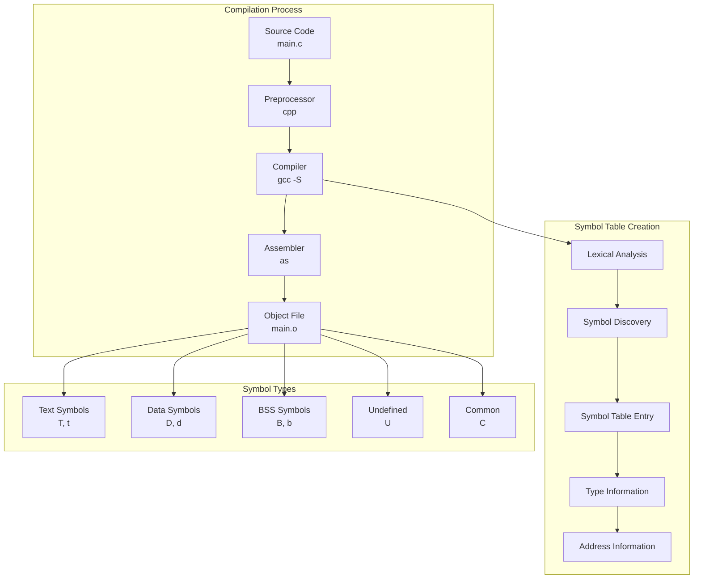

---
tags:
  - Symbol
  - Table
  - Compilation
  - Linking
  - ELF
  - Debug
  - Mangling
  - nm
  - objdump
  - readelf
  - strip
---

# Symbol Table 완벽 가이드: From Compilation to Runtime Resolution

## 들어가며

"왜 같은 이름의 함수인데 링킹 오류가 발생할까?", "바이너리에서 함수 이름을 찾을 수 없는 이유는?", "C++에서 함수 오버로딩이 어떻게 구별될까?"와 같은 의문을 가져본 적이 있을 것입니다.

프로덕션 환경에서 디버깅, 성능 분석, 보안 감사를 진행할 때 Symbol Table에 대한 깊이 있는 이해는 필수입니다. 특히 대용량 바이너리의 크기 최적화, 디버깅 심볼 관리, 그리고 라이브러리 의존성 분석 시 심볼 테이블의 내부 구조를 정확히 파악하는 것이 중요합니다.

## Symbol Table이란 무엇인가?

Symbol Table은 컴파일러와 [링커](linker.md)가 함수, 변수, 타입 등의 식별자(symbol)에 대한 정보를 저장하는 데이터 구조입니다. 각 심볼은 이름, 주소, 타입, 바인딩 정보 등을 포함하며, 컴파일 과정에서 심볼 해결(Symbol Resolution)과 링킹에 핵심적인 역할을 합니다.



### 심볼 테이블의 역할

1. **컴파일 시간**: 변수/함수 선언과 정의 검증
2. **링킹 시간**: Undefined references 해결
3. **로딩 시간**: Dynamic symbol resolution
4. **런타임**: 디버깅 정보 제공
5. **분석 도구**: 프로파일링, 역공학

## Symbol Types 상세 분석

### 1. Symbol Binding Types

```c
// symbol_types.c - 다양한 심볼 타입 예제
#include &lt;stdio.h&gt;

// Global symbols (external binding)
int global_variable = 42;
extern int external_variable;

// Static symbols (internal binding) 
static int static_variable = 10;
static void static_function(void) {
    printf("Static function\n");
}

// Weak symbols
__attribute__((weak)) int weak_variable = 100;
__attribute__((weak)) void weak_function(void) {
    printf("Weak function\n");
}

// Strong symbols (default)
void public_function(void) {
    printf("Public function\n");
}

// Function with different linkage
extern void external_function(void);

// Common symbols (uninitialized globals)
int common_variable;

int main() {
    static_function();
    public_function();
    
    printf("Global: %d\n", global_variable);
    printf("Static: %d\n", static_variable);
    printf("Weak: %d\n", weak_variable);
    
    return 0;
}
```

```bash
# 심볼 테이블 분석
$ gcc -c symbol_types.c -o symbol_types.o

# nm으로 심볼 확인
$ nm symbol_types.o
0000000000000004 C common_variable        # C = Common
0000000000000000 D global_variable        # D = Initialized data
0000000000000000 T main                   # T = Text (code)
0000000000000017 T public_function        # T = Text (code) 
0000000000000004 d static_variable        # d = local data
0000000000000008 t static_function        # t = local text
                 U external_function      # U = Undefined
                 U external_variable      # U = Undefined
0000000000000000 V weak_function          # V = Weak object
0000000000000008 V weak_variable          # V = Weak object
```

### 2. Symbol Visibility

```c
// visibility_demo.c
#include &lt;stdio.h&gt;

// Default visibility (global scope)
void default_function(void) {
    printf("Default visibility\n");
}

// Hidden visibility (module scope)
__attribute__((visibility("hidden")))
void hidden_function(void) {
    printf("Hidden visibility\n");
}

// Protected visibility (no interposition)
__attribute__((visibility("protected")))
void protected_function(void) {
    printf("Protected visibility\n");
}

// Internal visibility (like hidden but stronger)
__attribute__((visibility("internal")))
void internal_function(void) {
    printf("Internal visibility\n");
}

void test_visibility(void) {
    default_function();
    hidden_function();
    protected_function();
    internal_function();
}
```

```bash
# 공유 라이브러리로 컴파일
$ gcc -fPIC -shared visibility_demo.c -o libvisibility.so

# Dynamic symbol table 확인 (외부에 노출되는 심볼만)
$ nm -D libvisibility.so
0000000000001119 T default_function      # 외부 노출
000000000000112e T protected_function    # 외부 노출  
0000000000001143 T test_visibility       # 외부 노출

# 전체 심볼 테이블 확인 (내부 심볼 포함)
$ nm libvisibility.so | grep -E "(hidden|internal)"
0000000000001124 t hidden_function       # t = local text
0000000000001135 t internal_function     # t = local text
```

## ELF Symbol Table 구조 심화

### Symbol Table Entry 구조

```c
// ELF symbol table entry 구조 (64-bit)
typedef struct {
    Elf64_Word    st_name;     // 심볼 이름 (string table index)
    unsigned char st_info;     // 심볼 타입과 바인딩
    unsigned char st_other;    // 심볼 가시성
    Elf64_Section st_shndx;    // 섹션 인덱스
    Elf64_Addr    st_value;    // 심볼 값 (주소)
    Elf64_Xword   st_size;     // 심볼 크기
} Elf64_Sym;
```

### Symbol Table 섹션들

```bash
# ELF 파일의 심볼 테이블 섹션 확인
$ readelf -S symbol_types.o | grep -E "(symtab|strtab|dynsym)"
  [8] .symtab           SYMTAB           0000000000000000  000003c8
  [9] .strtab           STRTAB           0000000000000000  00000470  
  [10] .shstrtab        STRTAB           0000000000000000  000004c8

# Dynamic executable의 경우
$ readelf -S /bin/ls | grep -E "(symtab|strtab|dynsym)"
  [6] .dynsym           DYNSYM           0000000000000318  00000318
  [7] .dynstr           STRTAB           0000000000000360  00000360
  [29] .symtab          SYMTAB           0000000000000000  0000b018
  [30] .strtab          STRTAB           0000000000000000  0000c7a0
```

**섹션별 역할:**

- **.symtab**: 컴파일 시 생성되는 완전한 심볼 테이블 (strip으로 제거 가능)
- **.dynsym**: 동적 링킹용 심볼 테이블 (런타임 필요, 제거 불가)
- **.strtab**: 심볼 이름 문자열 테이블
- **.dynstr**: 동적 심볼 이름 문자열 테이블

### 상세 심볼 정보 분석

```c
// complex_symbols.c
#include &lt;stdio.h&gt;

// 다양한 크기와 정렬을 가진 심볼들
struct large_struct {
    double data[100];
    char name[256];
} global_struct;

// 함수 심볼 (크기 정보 포함)
__attribute__((noinline))
int complex_function(int a, int b, int c) {
    int local_array[1000];
    
    for (int i = 0; i < 1000; i++) {
        local_array[i] = a + b + c + i;
    }
    
    return local_array[999];
}

// Thread-local storage 심볼
__thread int tls_variable = 50;

// 정렬된 심볼
__attribute__((aligned(64)))
int aligned_variable = 123;

int main() {
    complex_function(1, 2, 3);
    return 0;
}
```

```bash
# 컴파일 및 상세 심볼 정보 확인
$ gcc -c complex_symbols.c -o complex_symbols.o

# readelf로 상세 심볼 정보 확인
$ readelf -s complex_symbols.o
Symbol table '.symtab' contains 12 entries:
   Num:    Value          Size Type    Bind   Vis      Ndx Name
     0: 0000000000000000     0 NOTYPE  LOCAL  DEFAULT  UND 
     1: 0000000000000000     0 FILE    LOCAL  DEFAULT  ABS complex_symbols.c
     2: 0000000000000040     4 OBJECT  GLOBAL DEFAULT    4 aligned_variable
     3: 0000000000000000  2056 OBJECT  GLOBAL DEFAULT    3 global_struct
     4: 0000000000000000    64 FUNC    GLOBAL DEFAULT    1 complex_function
     5: 0000000000000040    42 FUNC    GLOBAL DEFAULT    1 main
     6: 0000000000000000     4 OBJECT  GLOBAL DEFAULT    6 tls_variable

# 심볼 크기별 정렬하여 확인
$ readelf -s complex_symbols.o | sort -k3 -n
```

## Name Mangling in C++

### C++ Name Mangling 메커니즘

```cpp
// cpp_mangling.cpp
#include &lt;iostream&gt;
#include &lt;string&gt;

class Calculator {
private:
    int value;
    
public:
    Calculator(int v) : value(v) {}
    
    // 메서드 오버로딩
    int add(int x) { return value + x; }
    double add(double x) { return value + x; }
    std::string add(const std::string& x) { return std::to_string(value) + x; }
    
    // 템플릿 메서드
    template&lt;typename T&gt;
    T multiply(T factor) { return static_cast&lt;T&gt;(value) * factor; }
    
    // 연산자 오버로딩
    Calculator operator+(const Calculator& other) {
        return Calculator(value + other.value);
    }
    
    // Static 메서드
    static void static_method() {
        std::cout &lt;&lt; "Static method\n";
    }
};

// 네임스페이스 함수
namespace math {
    namespace advanced {
        double complex_calculation(double a, double b, double c) {
            return (a + b) * c / 2.0;
        }
    }
}

// 함수 오버로딩
void overloaded_function(int x) { std::cout &lt;&lt; "int: " &lt;&lt; x &lt;&lt; std::endl; }
void overloaded_function(double x) { std::cout &lt;&lt; "double: " &lt;&lt; x &lt;&lt; std::endl; }
void overloaded_function(const char* x) { std::cout &lt;&lt; "string: " &lt;&lt; x &lt;&lt; std::endl; }

int main() {
    Calculator calc(10);
    
    // 다양한 타입으로 메서드 호출
    calc.add(5);
    calc.add(3.14);
    calc.add(std::string("Hello"));
    
    // 템플릿 인스턴스화
    calc.multiply&lt;int&gt;(2);
    calc.multiply&lt;double&gt;(2.5);
    
    // 연산자 오버로딩
    Calculator calc2(20);
    Calculator result = calc + calc2;
    
    // 네임스페이스 함수
    math::advanced::complex_calculation(1.0, 2.0, 3.0);
    
    // 함수 오버로딩
    overloaded_function(42);
    overloaded_function(3.14159);
    overloaded_function("Hello World");
    
    return 0;
}
```

```bash
# C++ 컴파일 및 mangled names 확인
$ g++ -c cpp_mangling.cpp -o cpp_mangling.o

# Mangled symbol names 확인
$ nm cpp_mangling.o | grep -E "(Calculator|overloaded)"
0000000000000000 W _ZN10Calculator3addEd            # Calculator::add(double)
0000000000000000 W _ZN10Calculator3addEi            # Calculator::add(int)
0000000000000000 W _ZN10Calculator3addERKSs         # Calculator::add(string&)
0000000000000000 W _ZN10CalculatorC1Ei              # Calculator::Calculator(int)
0000000000000000 W _ZN10CalculatorC2Ei              # Calculator::Calculator(int)
0000000000000000 T _Z18overloaded_functionPKc       # overloaded_function(char const*)
0000000000000017 T _Z18overloaded_functiond         # overloaded_function(double)
000000000000000e T _Z18overloaded_functioni         # overloaded_function(int)

# c++filt로 demangling
$ nm cpp_mangling.o | c++filt
0000000000000000 W Calculator::add(double)
0000000000000000 W Calculator::add(int)  
0000000000000000 W Calculator::add(std::string const&)
0000000000000000 W Calculator::Calculator(int)
0000000000000000 W Calculator::Calculator(int)
0000000000000000 T overloaded_function(char const*)
0000000000000017 T overloaded_function(double)
000000000000000e T overloaded_function(int)
```

### Demangling 도구 활용

```bash
# 다양한 demangling 방법들

# 1. c++filt 사용
$ echo "_ZN10Calculator8multiplyIiEET_S1_" | c++filt
Calculator::multiply&lt;int&gt;(int)

# 2. objdump와 함께 사용
$ objdump -t cpp_mangling.o | c++filt
0000000000000000 w    F .text.linkonce.t._ZN10Calculator3addEi 000000000000000a Calculator::add(int)

# 3. nm과 함께 사용 (가장 일반적)
$ nm -C cpp_mangling.o  # -C 옵션이 자동 demangle
0000000000000000 W Calculator::add(double)
0000000000000000 W Calculator::add(int)

# 4. readelf와 함께 사용
$ readelf -s cpp_mangling.o | c++filt

# 5. addr2line으로 주소에서 함수 이름 찾기
$ addr2line -f -C -e program 0x1234
Calculator::add(int)
/path/to/cpp_mangling.cpp:15
```

### Template Instantiation과 Symbol Explosion

```cpp
// template_symbols.cpp
#include &lt;vector&gt;
#include &lt;map&gt;
#include &lt;string&gt;

template&lt;typename T, int N&gt;
class FixedArray {
private:
    T data[N];
    
public:
    void set(int index, T value) { data[index] = value; }
    T get(int index) const { return data[index]; }
    
    template&lt;typename U&gt;
    void copy_from(const FixedArray&lt;U, N&gt;& other) {
        for (int i = 0; i < N; i++) {
            data[i] = static_cast&lt;T&gt;(other.get(i));
        }
    }
};

int main() {
    // 템플릿 인스턴스화들
    FixedArray&lt;int, 10&gt; int_array;
    FixedArray&lt;double, 10&gt; double_array;
    FixedArray&lt;std::string, 5&gt; string_array;
    
    // STL 템플릿들
    std::vector&lt;int&gt; vec;
    std::map&lt;std::string, int&gt; my_map;
    
    // 복잡한 중첩 템플릿
    std::vector&lt;std::map&lt;std::string, FixedArray&lt;double, 20&gt;&gt;&gt; complex_structure;
    
    return 0;
}
```

```bash
# 템플릿으로 인한 심볼 폭발 확인
$ g++ -c template_symbols.cpp -o template_symbols.o

# 생성된 심볼 개수 확인
$ nm template_symbols.o | wc -l
247  # 단순한 코드에서도 많은 심볼 생성!

# 템플릿 인스턴스 심볼들 확인
$ nm template_symbols.o | c++filt | grep "FixedArray" | head -10
FixedArray&lt;double, 10&gt;::get(int) const
FixedArray&lt;double, 10&gt;::set(int, double)
FixedArray&lt;int, 10&gt;::get(int) const  
FixedArray&lt;int, 10&gt;::set(int, int)
FixedArray&lt;std::string, 5&gt;::get(int) const
FixedArray&lt;std::string, 5&gt;::set(int, std::string)
```

## Debugging Symbols

### DWARF Debug Information

```c
// debug_example.c
#include &lt;stdio.h&gt;
#include &lt;stdlib.h&gt;

typedef struct {
    int id;
    char name[50];
    double salary;
} Employee;

Employee* create_employee(int id, const char* name, double salary) {
    Employee* emp = malloc(sizeof(Employee));
    if (emp) {
        emp-&gt;id = id;
        snprintf(emp-&gt;name, sizeof(emp-&gt;name), "%s", name);
        emp-&gt;salary = salary;
    }
    return emp;
}

void print_employee(const Employee* emp) {
    if (emp) {
        printf("ID: %d, Name: %s, Salary: %.2f\n", 
               emp-&gt;id, emp-&gt;name, emp-&gt;salary);
    }
}

int main() {
    Employee* emp1 = create_employee(1001, "John Doe", 75000.0);
    Employee* emp2 = create_employee(1002, "Jane Smith", 85000.0);
    
    print_employee(emp1);
    print_employee(emp2);
    
    free(emp1);
    free(emp2);
    
    return 0;
}
```

```bash
# 다양한 디버그 정보 레벨로 컴파일
$ gcc -g0 debug_example.c -o debug_none     # 디버그 정보 없음
$ gcc -g1 debug_example.c -o debug_minimal  # 최소 디버그 정보
$ gcc -g2 debug_example.c -o debug_default  # 기본 디버그 정보 (기본값)
$ gcc -g3 debug_example.c -o debug_full     # 최대 디버그 정보 (매크로 포함)

# 파일 크기 비교
$ ls -lh debug_*
-rwxr-xr-x 1 user user 8.2K debug_none
-rwxr-xr-x 1 user user  12K debug_minimal  
-rwxr-xr-x 1 user user  18K debug_default
-rwxr-xr-x 1 user user  22K debug_full

# 디버그 섹션 확인
$ readelf -S debug_full | grep debug
  [27] .debug_aranges    PROGBITS         0000000000000000  00002120
  [28] .debug_info       PROGBITS         0000000000000000  00002150
  [29] .debug_abbrev     PROGBITS         0000000000000000  000022c1
  [30] .debug_line       PROGBITS         0000000000000000  00002344
  [31] .debug_str        PROGBITS         0000000000000000  000023b8
  [32] .debug_ranges     PROGBITS         0000000000000000  00002476
```

### Debug Symbol 추출과 분리

```bash
# 디버그 심볼 분리 과정

# 1. 디버그 정보가 포함된 바이너리 빌드
$ gcc -g -O2 debug_example.c -o program_with_debug

# 2. 디버그 심볼만 별도 파일로 추출
$ objcopy --only-keep-debug program_with_debug program.debug

# 3. 실행 파일에서 디버그 정보 제거
$ objcopy --strip-debug program_with_debug program_stripped

# 또는 strip 명령 사용
$ strip --strip-debug program_with_debug -o program_stripped

# 4. 디버그 링크 추가 (디버거가 디버그 파일을 찾을 수 있도록)
$ objcopy --add-gnu-debuglink=program.debug program_stripped

# 크기 비교
$ ls -lh program*
-rwxr-xr-x 1 user user  18K program_with_debug
-rw-r--r-- 1 user user  14K program.debug      # 디버그 심볼만
-rwxr-xr-x 1 user user 8.5K program_stripped  # 실행 파일만

# 디버그 링크 확인
$ readelf -p .gnu_debuglink program_stripped
String dump of section '.gnu_debuglink':
  [     0]  program.debug
```

### Build ID와 Symbol Server

```bash
# Build ID 생성 및 확인
$ gcc -g -Wl,--build-id=sha1 debug_example.c -o program_buildid

# Build ID 확인
$ readelf -n program_buildid | grep "Build ID"
    Build ID: a1b2c3d4e5f67890abcdef1234567890deadbeef

# Build ID를 이용한 디버그 심볼 관리
$ mkdir -p ~/.debug/.build-id/a1/
$ cp program.debug ~/.debug/.build-id/a1/b2c3d4e5f67890abcdef1234567890deadbeef.debug

# 또는 debuginfo 패키지 스타일
$ mkdir -p /usr/lib/debug/usr/local/bin/
$ cp program.debug /usr/lib/debug/usr/local/bin/program.debug

# gdb에서 자동으로 디버그 심볼 찾기
$ gdb program_stripped
(gdb) info files
# gdb가 자동으로 program.debug 파일을 로드함
```

## Dynamic vs Static Symbol Tables

### Static Symbol Table (.symtab)

```c
// static_analysis.c
#include &lt;stdio.h&gt;

static int internal_counter = 0;

static void internal_function(void) {
    internal_counter++;
    printf("Internal call #%d\n", internal_counter);
}

void public_function(void) {
    internal_function();
    printf("Public function called\n");
}

extern void external_dependency(void);

int main() {
    public_function();
    // external_dependency();  // 주석 처리하면 미사용 심볼
    return 0;
}
```

```bash
# Static symbol table 분석
$ gcc -c static_analysis.c -o static_analysis.o

# 모든 심볼 (컴파일 타임 정보)
$ nm static_analysis.o
0000000000000000 b internal_counter.2177    # b = local BSS
0000000000000000 t internal_function        # t = local text  
0000000000000000 T main                     # T = global text
0000000000000017 T public_function          # T = global text
                 U external_dependency       # U = undefined
                 U printf                   # U = undefined (from libc)

# readelf로 더 상세한 정보
$ readelf -s static_analysis.o
Symbol table '.symtab' contains 11 entries:
   Num:    Value          Size Type    Bind   Vis      Ndx Name
     0: 0000000000000000     0 NOTYPE  LOCAL  DEFAULT  UND 
     1: 0000000000000000     0 FILE    LOCAL  DEFAULT  ABS static_analysis.c
     2: 0000000000000000     4 OBJECT  LOCAL  DEFAULT    4 internal_counter.2177
     3: 0000000000000000    23 FUNC    LOCAL  DEFAULT    1 internal_function
     4: 0000000000000000    18 FUNC    GLOBAL DEFAULT    1 main
     5: 0000000000000017    10 FUNC    GLOBAL DEFAULT    1 public_function
     6: 0000000000000000     0 NOTYPE  GLOBAL DEFAULT  UND external_dependency
     7: 0000000000000000     0 NOTYPE  GLOBAL DEFAULT  UND printf
```

### Dynamic Symbol Table (.dynsym)

```bash
# Dynamic executable 생성
$ gcc static_analysis.c -o static_program

# Dynamic symbols만 확인 (런타임에 필요한 심볼들)
$ nm -D static_program
                 w __cxa_finalize@@GLIBC_2.2.5
                 w __gmon_start__
                 w _ITM_deregisterTMCloneTable
                 w _ITM_registerTMCloneTable
                 U printf@@GLIBC_2.2.5
0000000000001149 T public_function

# 동적 심볼과 정적 심볼 비교
$ echo "=== Static Symbol Table ==="
$ nm static_program | wc -l
$ echo "=== Dynamic Symbol Table ==="  
$ nm -D static_program | wc -l

# 일반적으로 dynamic symbols << static symbols
# static: 수십~수백개, dynamic: 수개~수십개
```

### Strip 명령어의 영향

```bash
# Strip 전후 비교
$ cp static_program static_program_original

# 디버그 정보만 제거
$ strip --strip-debug static_program
$ echo "After strip-debug:"
$ ls -lh static_program*

# 모든 심볼 제거 (동적 심볼 제외)
$ strip --strip-all static_program  
$ echo "After strip-all:"
$ ls -lh static_program*

# 심볼 테이블 확인
$ echo "=== Original symbols ==="
$ nm static_program_original | wc -l

$ echo "=== After strip-all ==="
$ nm static_program 2>&1 | head -1  # "no symbols" 메시지

$ echo "=== Dynamic symbols (preserved) ==="
$ nm -D static_program | wc -l
```

## Symbol Analysis Tools 완벽 활용

### nm (Name List) 고급 사용법

```bash
# nm의 다양한 옵션들
$ nm --help | grep -E "^\s*-[a-zA-Z]"

# 1. 심볼 정렬 옵션
$ nm -n binary_file          # 주소순 정렬
$ nm -S binary_file          # 크기 정보 포함
$ nm -s binary_file          # 아카이브 인덱스 출력
$ nm -p binary_file          # 정렬하지 않음 (원본 순서)

# 2. 필터링 옵션  
$ nm -u binary_file          # undefined 심볼만
$ nm -g binary_file          # global 심볼만
$ nm -l binary_file          # 라인 번호 정보 포함

# 3. 실용적인 분석 예제
$ nm -S --size-sort program | tail -10    # 가장 큰 심볼들
$ nm -u program | wc -l                   # undefined 심볼 개수
$ nm program | grep -c " T "              # 함수 개수
$ nm program | grep -c " D "              # 초기화된 전역변수 개수
```

### objdump 활용법

```c
// analysis_target.c
#include &lt;stdio.h&gt;
#include &lt;string.h&gt;

__attribute__((section(".custom_section")))
int custom_data = 0x12345678;

__attribute__((constructor))
void init_function(void) {
    printf("Constructor called\n");
}

__attribute__((destructor))
void cleanup_function(void) {
    printf("Destructor called\n");
}

int main() {
    char buffer[100];
    strcpy(buffer, "Hello, Symbol Analysis!");
    printf("%s\n", buffer);
    printf("Custom data: 0x%x\n", custom_data);
    return 0;
}
```

```bash
# objdump 종합 분석
$ gcc -g analysis_target.c -o analysis_target

# 1. 심볼 테이블 덤프
$ objdump -t analysis_target | head -20

# 2. 동적 심볼 테이블
$ objdump -T analysis_target

# 3. 디스어셈블리와 심볼 정보 함께
$ objdump -d -t analysis_target | grep -A5 -B5 "main>:"

# 4. 섹션별 내용 확인
$ objdump -s -j .custom_section analysis_target
Contents of section .custom_section:
 4010 78563412                             xV4.

# 5. 생성자/소멸자 함수 확인
$ objdump -t analysis_target | grep -E "(init|cleanup)_function"
0000000000001169 g     F .text  000000000000001a init_function
0000000000001183 g     F .text  000000000000001a cleanup_function

# 6. 재배치 정보 확인 (오브젝트 파일)
$ gcc -c analysis_target.c -o analysis_target.o
$ objdump -r analysis_target.o
RELOCATION RECORDS FOR [.text]:
OFFSET           TYPE              VALUE 
000000000000000a R_X86_64_PLT32    puts-0x0000000000000004
0000000000000014 R_X86_64_PLT32    printf-0x0000000000000004
```

### readelf 심화 활용

```bash
# readelf 종합 심볼 분석

# 1. 모든 심볼 테이블 정보
$ readelf -s analysis_target
Symbol table '.dynsym' contains 7 entries:
Symbol table '.symtab' contains 64 entries:

# 2. 심볼 버전 정보
$ readelf -V analysis_target
Version symbols section '.gnu.version' contains 7 entries:
Version needs section '.gnu.version_r' contains 1 entries:

# 3. 동적 섹션 정보 (런타임 링킹 정보)
$ readelf -d analysis_target | grep -E "(NEEDED|SONAME|RPATH|RUNPATH)"
 0x0000000000000001 (NEEDED)             Shared library: [libc.so.6]

# 4. 재배치 정보 (동적)
$ readelf -r analysis_target
Relocation section '.rela.dyn' contains 8 entries:
Relocation section '.rela.plt' contains 2 entries:

# 5. 프로그램 헤더와 섹션 매핑
$ readelf -l analysis_target | grep -A1 -B1 LOAD
  LOAD           0x0000000000000000 0x0000000000400000 0x0000000000400000

# 6. 심볼 해시 테이블 (빠른 심볼 검색용)
$ readelf -I analysis_target
Histogram for bucket list length (total of 3 buckets):
 Length  Number     % of total  Coverage
      0  1          ( 33.3%)
      1  1          ( 33.3%)    14.3%
      2  1          ( 33.3%)   100.0%
```

### 심볼 분석 자동화 스크립트

```bash
#!/bin/bash
# symbol_analyzer.sh - 종합 심볼 분석 도구

analyze_binary() {
    local binary=$1
    
    if [ ! -f "$binary" ]; then
        echo "Error: $binary not found"
        return 1
    fi
    
    echo "============================================"
    echo "Symbol Analysis Report for: $binary"
    echo "============================================"
    
    # 1. 파일 기본 정보
    echo -e "\n1. Binary Information:"
    file "$binary"
    ls -lh "$binary"
    
    # 2. 심볼 통계
    echo -e "\n2. Symbol Statistics:"
    local total_symbols=$(nm "$binary" 2>/dev/null | wc -l)
    local dynamic_symbols=$(nm -D "$binary" 2>/dev/null | wc -l)
    local undefined_symbols=$(nm -u "$binary" 2>/dev/null | wc -l)
    local text_symbols=$(nm "$binary" 2>/dev/null | grep -c " T ")
    local data_symbols=$(nm "$binary" 2>/dev/null | grep -c " D ")
    local bss_symbols=$(nm "$binary" 2>/dev/null | grep -c " B ")
    
    echo "Total symbols: $total_symbols"
    echo "Dynamic symbols: $dynamic_symbols"  
    echo "Undefined symbols: $undefined_symbols"
    echo "Text symbols (functions): $text_symbols"
    echo "Data symbols (initialized): $data_symbols"
    echo "BSS symbols (uninitialized): $bss_symbols"
    
    # 3. 가장 큰 심볼들
    echo -e "\n3. Largest Symbols:"
    nm -S --size-sort "$binary" 2>/dev/null | tail -10
    
    # 4. 외부 의존성
    echo -e "\n4. External Dependencies:"
    if command -v ldd &> /dev/null; then
        ldd "$binary" 2>/dev/null | head -10
    fi
    
    # 5. 보안 정보
    echo -e "\n5. Security Features:"
    if command -v checksec &> /dev/null; then
        checksec --file="$binary"
    elif command -v readelf &> /dev/null; then
        echo "PIE: $(readelf -h "$binary" | grep "Type:" | grep -q "DYN" && echo "Yes" || echo "No")"
        echo "RELRO: $(readelf -d "$binary" 2>/dev/null | grep -q "BIND_NOW" && echo "Full" || echo "Partial")"
        echo "Stack Canary: $(readelf -s "$binary" 2>/dev/null | grep -q "__stack_chk" && echo "Yes" || echo "No")"
    fi
    
    # 6. 스트립 상태
    echo -e "\n6. Strip Status:"
    if readelf -S "$binary" 2>/dev/null | grep -q "\.symtab"; then
        echo "Symbols: Present"
    else
        echo "Symbols: Stripped"
    fi
    
    if readelf -S "$binary" 2>/dev/null | grep -q "\.debug"; then
        echo "Debug info: Present"
    else  
        echo "Debug info: Stripped"
    fi
    
    # 7. 중복 심볼 검사 (라이브러리인 경우)
    echo -e "\n7. Potential Issues:"
    local duplicate_symbols=$(nm "$binary" 2>/dev/null | awk '{print $3}' | sort | uniq -d | wc -l)
    echo "Duplicate symbols: $duplicate_symbols"
    
    if [ "$undefined_symbols" -gt 0 ]; then
        echo "Undefined symbols found - linking required"
    fi
}

# 사용 예
analyze_binary "$1"
```

## Production 환경에서의 Symbol Table 활용

### Performance Profiling과 Symbol Resolution

```c
// profiling_example.c
#include &lt;stdio.h&gt;
#include &lt;stdlib.h&gt;
#include &lt;time.h&gt;

// 프로파일링 대상 함수들
__attribute__((noinline))
void hot_function(void) {
    volatile int sum = 0;
    for (int i = 0; i < 1000000; i++) {
        sum += i;
    }
}

__attribute__((noinline))  
void cold_function(void) {
    volatile int product = 1;
    for (int i = 1; i < 100; i++) {
        product *= 2;
    }
}

__attribute__((noinline))
void recursive_function(int depth) {
    if (depth > 0) {
        volatile int temp = depth * depth;
        recursive_function(depth - 1);
    }
}

int main() {
    // Hot path
    for (int i = 0; i < 1000; i++) {
        hot_function();
    }
    
    // Cold path  
    for (int i = 0; i < 10; i++) {
        cold_function();
    }
    
    // Recursive calls
    recursive_function(100);
    
    return 0;
}
```

```bash
# 프로파일링 가능한 바이너리 빌드
$ gcc -g -fno-omit-frame-pointer profiling_example.c -o profiling_example

# perf를 이용한 프로파일링
$ perf record -g ./profiling_example
$ perf report --stdio | head -20

# 심볼 정보가 있어야 함수 이름으로 결과를 볼 수 있음
# Samples: 1K of event 'cycles:u'
# Event count (approx.): 123456789
# Children      Self  Command   Shared Object      Symbol
# 95.23%     95.23%  profiling  profiling_example  [.] hot_function
#  2.31%      2.31%  profiling  profiling_example  [.] recursive_function  
#  1.89%      1.89%  profiling  profiling_example  [.] cold_function

# addr2line으로 주소를 함수 이름과 라인 번호로 변환
$ addr2line -f -C -e profiling_example 0x1169
hot_function
/path/to/profiling_example.c:8

# objdump로 어셈블리와 심볼 매핑 확인
$ objdump -d profiling_example | grep -A10 "&lt;hot_function&gt;:"
```

### Memory Leak Detection과 Symbol Resolution

```c
// memory_debug.c  
#include &lt;stdio.h&gt;
#include &lt;stdlib.h&gt;
#include &lt;string.h&gt;

// 메모리 리크가 있는 함수들 (의도적)
__attribute__((noinline))
char* allocate_and_leak(size_t size) {
    char* ptr = malloc(size);
    strcpy(ptr, "This memory will leak");
    return ptr;  // 반환하지만 호출자가 free하지 않음
}

__attribute__((noinline))
void create_leak_in_loop(void) {
    for (int i = 0; i < 100; i++) {
        char* leaked = allocate_and_leak(1024);
        // leaked 포인터를 잃어버림 - 메모리 리크!
    }
}

__attribute__((noinline))
void proper_allocation(void) {
    char* ptr = malloc(2048);
    strcpy(ptr, "This memory will be freed");
    printf("Allocated properly: %s\n", ptr);
    free(ptr);  // 올바른 해제
}

int main() {
    proper_allocation();
    create_leak_in_loop();  // 메모리 리크 발생
    
    printf("Program finished - check for leaks\n");
    return 0;
}
```

```bash
# 디버그 심볼과 함께 빌드
$ gcc -g -fno-omit-frame-pointer memory_debug.c -o memory_debug

# Valgrind로 메모리 리크 검사 (심볼 정보 필요)
$ valgrind --leak-check=full --show-leak-kinds=all ./memory_debug
==1234== HEAP SUMMARY:
==1234==     in use at exit: 102,400 bytes in 100 blocks
==1234==   total heap usage: 101 allocs, 1 frees, 106,496 bytes allocated
==1234== 
==1234== 102,400 bytes in 100 blocks are definitely lost in loss record 1 of 1
==1234==    at 0x4C29BE3: malloc (vg_replace_malloc.c:299)
==1234==    by 0x40064A: allocate_and_leak (memory_debug.c:8)  # 심볼 정보로 정확한 위치
==1234==    by 0x400678: create_leak_in_loop (memory_debug.c:14)
==1234==    by 0x4006B8: main (memory_debug.c:26)

# AddressSanitizer를 이용한 분석
$ gcc -g -fsanitize=address memory_debug.c -o memory_debug_asan
$ ./memory_debug_asan
# 심볼 정보를 바탕으로 정확한 스택 트레이스 제공

# 프로덕션 환경에서 coredump 분석
$ ulimit -c unlimited
$ ./memory_debug  # 크래시 발생 시
$ gdb memory_debug core
(gdb) bt  # 심볼 정보로 백트레이스 출력
(gdb) info locals  # 지역 변수 정보
(gdb) list  # 소스 코드 출력
```

### Binary Size Optimization

```bash
# 바이너리 크기 최적화 전후 비교

# 1. 기본 빌드 (모든 심볼 포함)
$ gcc -g -O0 complex_symbols.c -o binary_full
$ ls -lh binary_full
-rwxr-xr-x 1 user user  25K binary_full

# 2. 최적화된 빌드
$ gcc -Os -flto complex_symbols.c -o binary_optimized  # 크기 최적화
$ ls -lh binary_optimized
-rwxr-xr-x 1 user user  12K binary_optimized

# 3. 심볼 제거
$ strip --strip-all binary_optimized -o binary_stripped
$ ls -lh binary_stripped
-rwxr-xr-x 1 user user 8.5K binary_stripped

# 4. UPX 압축 (옵션)
$ upx binary_stripped -o binary_compressed
$ ls -lh binary_compressed  
-rwxr-xr-x 1 user user 4.2K binary_compressed

# 심볼 정보 확인
$ echo "=== Full binary symbols ==="
$ nm binary_full | wc -l
127

$ echo "=== Optimized binary symbols ==="  
$ nm binary_optimized | wc -l
89

$ echo "=== Stripped binary symbols ==="
$ nm binary_stripped 2>&1 | head -1
nm: binary_stripped: no symbols

# 하지만 동적 심볼은 남아있음
$ nm -D binary_stripped | wc -l
6
```

### Container 환경에서의 심볼 관리

```dockerfile
# Dockerfile.symbol-optimized
FROM gcc:9 AS builder

WORKDIR /src
COPY . .

# 최적화된 빌드
RUN gcc -Os -flto -s \
    -ffunction-sections -fdata-sections \
    -Wl,--gc-sections \
    complex_symbols.c -o optimized_binary

# 디버그 심볼 분리 (필요시)
RUN objcopy --only-keep-debug optimized_binary debug_symbols
RUN strip --strip-debug optimized_binary

# Runtime 이미지 (최소화)
FROM scratch
COPY --from=builder /src/optimized_binary /app
ENTRYPOINT ["/app"]

# 디버그 이미지 (별도 생성)
FROM debian:bullseye-slim AS debug
COPY --from=builder /src/optimized_binary /app
COPY --from=builder /src/debug_symbols /debug/app.debug
RUN apt-get update && apt-get install -y gdb && rm -rf /var/lib/apt/lists/*
ENTRYPOINT ["/app"]
```

```bash
# 다단계 빌드로 크기 최적화
$ docker build -f Dockerfile.symbol-optimized -t myapp:optimized .
$ docker build -f Dockerfile.symbol-optimized --target debug -t myapp:debug .

# 이미지 크기 비교
$ docker images myapp
REPOSITORY   TAG         IMAGE ID     CREATED       SIZE
myapp        optimized   abc123       1 min ago     2.1MB   # 프로덕션용
myapp        debug       def456       1 min ago     85MB    # 디버깅용

# 프로덕션에서는 optimized, 디버깅 시에는 debug 이미지 사용
```

## 정리

Symbol Table은 컴파일러, 링커, 디버거, 프로파일러 등 모든 개발 도구의 핵심 인프라로서, 단순한 이름-주소 매핑을 넘어서 프로그램의 구조와 동작을 이해하는 메타데이터 저장소입니다.

### 핵심 개념 요약

**심볼 타입과 바인딩:**

- Text(T), Data(D), BSS(B), Undefined(U), Common(C) 심볼 구분
- Global, Local, Weak 바인딩의 링킹 시 우선순위
- Visibility(default, hidden, protected) 제어로 API 경계 관리

**ELF 구조와 도구들:**

- .symtab (컴파일 타임) vs .dynsym (런타임) 심볼 테이블의 역할
- nm, objdump, readelf의 특화된 분석 기능
- strip의 단계별 심볼 제거와 크기 최적화

**C++ Name Mangling:**

- 오버로딩, 템플릿, 네임스페이스의 고유한 심볼 생성
- c++filt를 통한 demangling으로 가독성 확보
- 템플릿 인스턴스화로 인한 심볼 폭발과 최적화 전략

**디버깅 심볼 관리:**

- DWARF 디버그 정보의 구조와 레벨별 상세도
- 디버그 심볼 분리로 프로덕션 바이너리 크기 최적화
- Build ID와 Symbol Server를 통한 체계적 심볼 관리

### 프로덕션 적용 지침

**성능 최적화:**

- 프로파일링 도구는 심볼 정보 의존 - 적절한 심볼 유지 필요
- Function-level linking으로 미사용 코드 제거
- LTO와 PGO 결합으로 심볼 기반 최적화 극대화

**크기 최적화:**

- 단계별 strip 적용: debug → all → dynamic only
- Visibility 제어로 불필요한 심볼 익스포트 방지  
- Container 멀티스테이지 빌드로 런타임 이미지 최소화

**디버깅 전략:**

- 프로덕션: stripped binary + 별도 debug symbols
- 개발: full symbols로 즉시 디버깅 가능
- CI/CD: symbol 분리 자동화로 양쪽 요구사항 충족

**보안 고려사항:**

- Symbol hiding으로 공격 표면 축소
- Strip을 통한 내부 구조 정보 제거
- 동적 심볼은 제거 불가 - 최소한으로 유지

**DevOps 관점:**

- Symbol 분석 자동화로 의존성 관리
- Binary artifact 크기 모니터링
- Debug symbol repository 구축으로 효율적 문제 해결

현대의 클라우드 네이티브 환경에서는 바이너리 크기 최적화와 디버깅 용이성 사이의 균형이 중요하며, 심볼 테이블의 전략적 관리가 개발 생산성과 운영 효율성을 동시에 향상시키는 핵심 요소입니다.

## 관련 문서

- [Linker 완벽 가이드](linker.md) - Symbol Resolution과 Link-Time Optimization
- [Header Files 완벽 가이드](header-files.md) - 심볼 선언과 정의의 분리
- [Static Library 구축 가이드](static-library.md) - 정적 라이브러리의 심볼 관리
- [Dynamic Library 완벽 가이드](dynamic-library.md) - Runtime Loading과 동적 심볼 해결
- [프로세스 메모리 구조 완벽 이해](../memory/process-memory-structure.md) - 메모리 레이아웃과 심볼 배치
