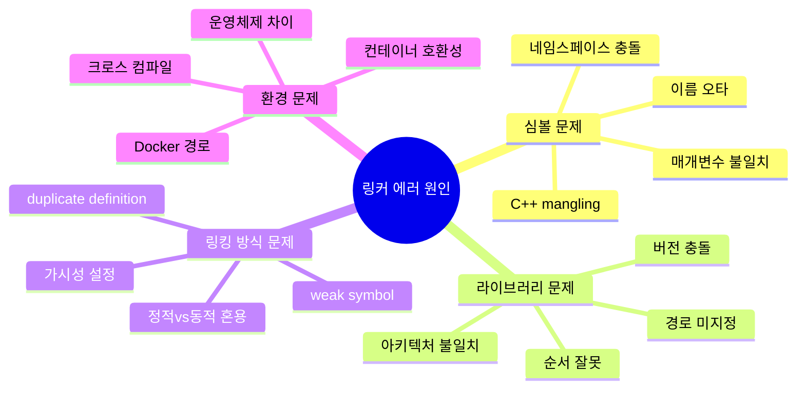
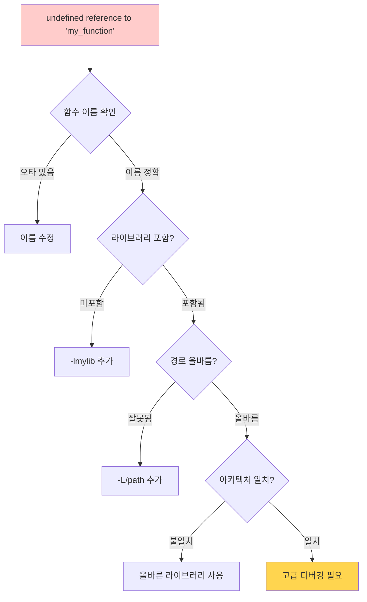

---
tags:
  - Linker
  - Debugging
  - Symbol
  - Library
  - nm
  - objdump
---

# 1-6: 링커 에러 해결 - "undefined reference가 계속 나요"

## 이 문서를 읽으면 답할 수 있는 질문들

- "undefined reference to..." 에러가 나는 근본 원인은 무엇일까요?
- nm, objdump, readelf 도구를 언제, 어떻게 사용해야 하나요?
- 멀티플랫폼 빌드에서 심볼 충돌을 어떻게 해결하나요?
- Docker/컨테이너 환경에서만 나는 링킹 에러의 원인은?
- 동적 라이브러리 로딩 문제를 어떻게 디버깅하나요?

## 들어가며: 링커 에러의 공포

개발자가 가장 무력감을 느끼는 순간 중 하나가 바로 **링커 에러**를 만났을 때입니다.

```bash
/usr/bin/ld: main.o: in function `main':
main.c:(.text+0x1a): undefined reference to `my_function'
collect2: error: ld returned 1 exit status
```

"분명히 함수를 만들었는데 왜 찾을 수 없다고 하지?"
"라이브러리도 설치했는데 왜 링킹이 안되지?"

이런 좌절감, 모두 경험해보셨을 거예요. 하지만 링커 에러는 사실 매우 **논리적**이고 **예측 가능한** 이유로 발생합니다.

### 링커 에러가 발생하는 진짜 이유



각 원인별로 **체계적인 해결 과정**을 배워보겠습니다.

## 1. 링커 에러 진단 프로세스

### 1.1 undefined reference - 가장 흔한 에러

이 에러가 나는 순간, 당황하지 말고 **체계적으로 접근**해봅시다:



**단계별 진단 방법**:

```bash
# 1단계: 심볼이 정말 존재하는지 확인
$ nm -D /usr/lib/libmylib.so | grep my_function
00001234 T my_function    # T = 정의된 함수
                 U my_function    # U = 정의되지 않음 (문제!)

# 2단계: 링크 명령에 라이브러리가 포함됐는지 확인
$ gcc -v main.c -lmylib 2>&1 | grep collect2
collect2 -o a.out /tmp/main.o -lmylib  # 포함됨

# 3단계: 라이브러리 검색 경로 확인
$ ld --verbose | grep SEARCH_DIR | head -5
SEARCH_DIR("/usr/lib")
SEARCH_DIR("/lib")
SEARCH_DIR("/usr/local/lib")

# 4단계: 라이브러리가 실제 경로에 존재하는지 확인
$ find /usr/lib /lib /usr/local/lib -name "libmylib*" 2>/dev/null
/usr/lib/libmylib.so.1.0
/usr/lib/libmylib.a
```

### 1.2 실제 디버깅 사례

**사례 1: 함수명 오타**

```c
// mylib.h
int calcuate_sum(int a, int b);  // 오타: calculate가 아님

// main.c
#include "mylib.h"
int main() {
    return calculate_sum(1, 2);  // 정확한 철자로 호출
}
```

```bash
# 에러 발생
$ gcc main.c -lmylib
undefined reference to `calculate_sum'

# 진단: 심볼 테이블 확인
$ nm -D libmylib.so | grep calcul
00001234 T calcuate_sum   # 오타 발견!
```

**사례 2: C++ name mangling 문제**

```cpp
// lib.cpp (C++로 컴파일됨)
int my_function(int x) { return x * 2; }

// main.c (C로 컴파일됨)
int my_function(int x);
int main() { return my_function(5); }
```

```bash
# C++ 심볼은 mangling됨
$ nm lib.o
00000000 T _Z11my_functioni  # mangled name

# C에서는 mangling 안됨
$ nm main.o
         U my_function      # unmangled name

# 해결책: extern "C" 사용
extern "C" int my_function(int x);
```

### 2. multiple definition 에러

```bash
# 에러 상황
$ gcc file1.o file2.o -o program
/usr/bin/ld: file2.o: in function `global_var':
file2.c:(.data+0x0): multiple definition of `global_var'
file1.o:file1.c:(.data+0x0): first defined here

# 해결 방법
# 1. 심볼 가시성 분석
$ nm file1.o file2.o | grep global_var
file1.o:
00000000 D global_var    # D = 초기화된 데이터
file2.o:
00000000 D global_var    # 중복 정의!

# 2. weak 심볼로 해결
__attribute__((weak)) int global_var = 42;

# 3. 헤더 가드 확인
#ifndef HEADER_H
#define HEADER_H
// 선언만, 정의는 하나의 .c 파일에서만
extern int global_var;
#endif
```

## 고급 심볼 분석 도구

### nm - 심볼 테이블 분석

```bash
# 모든 심볼 출력
$ nm libmylib.a

# 동적 심볼만 출력
$ nm -D libmylib.so

# 정의되지 않은 심볼만 출력
$ nm -u main.o

# C++ 심볼 디맹글링
$ nm --demangle libcpplib.a

# 심볼 크기와 함께 출력
$ nm -S --size-sort libmylib.a

# 심볼 타입 설명
# T = text (코드), D = data (초기화된 변수)
# B = BSS (초기화되지 않은 변수), U = undefined
# W = weak symbol, A = absolute
```

### objdump - 오브젝트 파일 분석

```bash
# 헤더 정보 출력
$ objdump -h main.o

# 디스어셈블리 출력
$ objdump -d main.o

# 재배치 정보 출력
$ objdump -r main.o

# 동적 재배치 정보
$ objdump -R libmylib.so

# 심볼 테이블
$ objdump -t main.o

# 소스 코드와 함께 디스어셈블리
$ objdump -S -d program

# 특정 섹션만 덤프
$ objdump -s -j .rodata main.o
```

### readelf - ELF 파일 분석

```bash
# ELF 헤더 출력
$ readelf -h program

# 섹션 헤더 출력
$ readelf -S program

# 프로그램 헤더 출력
$ readelf -l program

# 심볼 테이블 출력
$ readelf -s program

# 동적 섹션 출력
$ readelf -d program

# 재배치 정보
$ readelf -r main.o

# 의존성 라이브러리 확인
$ readelf -d program | grep NEEDED
 0x0000000000000001 (NEEDED)    Shared library: [libm.so.6]
```

## 라이브러리 경로와 검색

### 동적 라이브러리 검색 순서

```bash
# 1. RPATH/RUNPATH (바이너리에 포함된 경로)
$ readelf -d program | grep -E 'RPATH|RUNPATH'

# 2. LD_LIBRARY_PATH 환경 변수
export LD_LIBRARY_PATH=/opt/mylib:$LD_LIBRARY_PATH

# 3. ldconfig 캐시 (/etc/ld.so.cache)
$ ldconfig -p | grep mylib

# 4. 기본 시스템 경로 (/lib, /usr/lib)
$ cat /etc/ld.so.conf.d/*.conf

# 라이브러리 의존성 확인
$ ldd program
    linux-vdso.so.1 => (0x00007fff)
    libmylib.so.1 => /opt/lib/libmylib.so.1
    libc.so.6 => /lib/x86_64-linux-gnu/libc.so.6
```

### RPATH vs RUNPATH 설정

```bash
# RPATH 설정 (보안상 권장하지 않음)
$ gcc -Wl,-rpath,/opt/mylib main.c -o program

# RUNPATH 설정 (권장)
$ gcc -Wl,--enable-new-dtags -Wl,-rpath,/opt/mylib main.c -o program

# 상대 경로 RPATH ($ORIGIN 활용)
$ gcc -Wl,-rpath,'$ORIGIN/../lib' main.c -o program

# 기존 RPATH 수정
$ chrpath -r /new/path program
$ patchelf --set-rpath /new/path program
```

## symbol visibility와 링킹

### C++ 심볼 가시성 제어

```cpp
// 라이브러리 헤더 파일
#ifdef BUILDING_MYLIB
    #define MYLIB_API __attribute__((visibility("default")))
#else
    #define MYLIB_API
#endif

// 공개할 함수
MYLIB_API void public_function();

// 내부 함수 (라이브러리 외부에서 접근 불가)
__attribute__((visibility("hidden"))) void internal_function();

// 컴파일 시 기본 가시성 설정
// gcc -fvisibility=hidden -DBUILDING_MYLIB -shared lib.cpp -o libmylib.so
```

### 심볼 버전 관리

```cpp
// libmylib.c - 심볼 버전 관리
#include <stdio.h>

// 구버전 함수
void old_function_v1() {
    printf("old version, ");
}

// 신버전 함수
void new_function_v2() {
    printf("new version, ");
}

// 심볼 별칭과 기본 버전 설정
__asm__(".symver old_function_v1,my_function@MYLIB_1.0");
__asm__(".symver new_function_v2,my_function@@MYLIB_2.0");  // 기본
```

```bash
# 버전 맵 파일 생성 (libmylib.map)
MYLIB_1.0 {
    global:
        my_function;
    local:
        *;
};

MYLIB_2.0 {
    global:
        my_function;
        new_api_function;
} MYLIB_1.0;

# 버전 맵 적용하여 라이브러리 빌드
$ gcc -shared -Wl,--version-script=libmylib.map lib.c -o libmylib.so

# 버전 정보 확인
$ objdump -T libmylib.so | grep my_function
00001234 g    DF .text  0000001a  MYLIB_2.0   my_function
```

## 정적 vs 동적 링킹 디버깅

### 정적 링킹 문제 해결

```bash
# 아카이브 내부 확인
$ ar -t libmylib.a
file1.o
file2.o
file3.o

# 특정 심볼이 어느 오브젝트 파일에 있는지 확인
$ ar -t libmylib.a | xargs nm 2>/dev/null | grep my_function
file2.o: 00000000 T my_function

# 링크 순서 주의 (의존성이 있는 라이브러리를 뒤에)
$ gcc main.c -lmylib -lpthread  # 올바른 순서
$ gcc main.c -lpthread -lmylib  # 잘못된 순서 (링크 에러 가능)

# whole-archive 옵션 (모든 오브젝트 포함)
$ gcc main.c -Wl,--whole-archive -lmylib -Wl,--no-whole-archive
```

### 동적 링킹 문제 해결

```bash
# 동적 링커 디버깅 모드
$ LD_DEBUG=libs ./program
$ LD_DEBUG=symbols ./program
$ LD_DEBUG=files ./program
$ LD_DEBUG=all ./program 2>&1 | less

# 지연 바인딩 비활성화 (디버깅용)
$ LD_BIND_NOW=1 ./program

# PLT/GOT 분석
$ objdump -d program | grep -A5 -B5 "@plt"
$ readelf -r program | grep JUMP_SLOT

# 라이브러리 preload
$ LD_PRELOAD=./my_override.so ./program
```

## 크로스 컴파일 링킹 문제

### 다중 아키텍처 링킹

```bash
# ARM용 크로스 컴파일
$ arm-linux-gnueabihf-gcc main.c -o program_arm
$ file program_arm
program_arm: ELF 32-bit LSB executable, ARM, version 1

# 라이브러리 아키텍처 확인
$ file /usr/lib/x86_64-linux-gnu/libmylib.so
libmylib.so: ELF 64-bit LSB shared object, x86-64

# 올바른 크로스 컴파일 라이브러리 경로
$ arm-linux-gnueabihf-gcc \
    --sysroot=/usr/arm-linux-gnueabihf \
    -L/usr/arm-linux-gnueabihf/lib \
    main.c -lmylib -o program_arm
```

### pkg-config 활용

```bash
# pkg-config 정보 확인
$ pkg-config --cflags --libs opencv4
-I/usr/include/opencv4 -lopencv_core -lopencv_imgproc

# Makefile에서 활용
CFLAGS += $(shell pkg-config --cflags opencv4)
LDFLAGS += $(shell pkg-config --libs opencv4)

# CMake에서 활용
find_package(PkgConfig REQUIRED)
pkg_check_modules(OPENCV REQUIRED opencv4)
target_link_libraries(myapp ${OPENCV_LIBRARIES})
target_include_directories(myapp PRIVATE ${OPENCV_INCLUDE_DIRS})
```

## Docker 환경에서의 링킹 문제

### 동적 라이브러리 호환성

```dockerfile
# 베이스 이미지의 glibc 버전 확인
FROM ubuntu:20.04
RUN ldd --version

# 정적 링킹된 바이너리 생성
RUN gcc -static main.c -o program_static

# 멀티스테이지 빌드로 라이브러리 의존성 최소화
FROM ubuntu:20.04 as builder
RUN apt-get update && apt-get install -y gcc libc6-dev
COPY . /src
WORKDIR /src
RUN gcc -static main.c -o program

FROM scratch
COPY --from=builder /src/program /program
ENTRYPOINT ["/program"]
```

### Alpine Linux 링킹 이슈

```dockerfile
# Alpine은 musl libc 사용 (glibc와 호환성 문제)
FROM alpine:latest
RUN apk add --no-cache gcc musl-dev

# glibc 바이너리를 Alpine에서 실행하려면
FROM alpine:latest
RUN apk add --no-cache gcompat  # glibc 호환 레이어
COPY program_glibc /program
```

## 실전 디버깅 워크플로우

### 링킹 에러 진단 스크립트

```bash
#!/bin/bash
# link_debug.sh - 링킹 에러 자동 진단

echo "=== Linking Error Diagnosis ==="

if [ $# -ne 1 ]; then
    echo "Usage: $0 <program_or_object_file>"
    exit 1
fi

FILE=$1

echo "1. File type and architecture:"
file "$FILE"

echo -e ", 2. Undefined symbols:"
nm -u "$FILE" 2>/dev/null || echo "Not an object/executable file"

echo -e ", 3. Dynamic library dependencies:"
if [[ "$FILE" =~ \.(so|dylib)$ ]] || [ -x "$FILE" ]; then
    ldd "$FILE" 2>/dev/null || otool -L "$FILE" 2>/dev/null
fi

echo -e ", 4. RPATH/RUNPATH information:"
readelf -d "$FILE" 2>/dev/null | grep -E 'RPATH|RUNPATH' || echo "No RPATH/RUNPATH"

echo -e ", 5. Section information:"
readelf -S "$FILE" 2>/dev/null | head -20

echo -e ", 6. Symbol table summary:"
nm "$FILE" 2>/dev/null | awk '{print $2}' | sort | uniq -c | sort -nr
```

### 라이브러리 호환성 체커

```python
#!/usr/bin/env python3
# lib_compat_check.py

import subprocess
import sys
import re

def get_symbols(library_path):
    """라이브러리에서 심볼 목록 추출"""
    try:
        result = subprocess.run(['nm', '-D', library_path],
                              capture_output=True, text=True)
        symbols = []
        for line in result.stdout.split(', '):
            if ' T ' in line:  # Text symbols only
                symbol = line.split()[-1]
                symbols.append(symbol)
        return symbols
    except:
        return []

def check_compatibility(old_lib, new_lib):
    """라이브러리 호환성 확인"""
    old_symbols = set(get_symbols(old_lib))
    new_symbols = set(get_symbols(new_lib))

    missing = old_symbols - new_symbols
    added = new_symbols - old_symbols

    print(f"Old library: {old_lib}")
    print(f"New library: {new_lib}")
    print(f"Missing symbols: {len(missing)}")
    if missing:
        for sym in sorted(missing):
            print(f"  - {sym}")

    print(f"Added symbols: {len(added)}")
    if added:
        for sym in sorted(added):
            print(f"  + {sym}")

    return len(missing) == 0

if __name__ == '__main__':
    if len(sys.argv) != 3:
        print("Usage: lib_compat_check.py <old_lib> <new_lib>")
        sys.exit(1)

    compatible = check_compatibility(sys.argv[1], sys.argv[2])
    print(f", Compatibility: {'OK' if compatible else 'BROKEN'}")
```

## 실무 체크리스트

### 링킹 에러 해결 체크리스트

- [ ] `nm -u`로 정의되지 않은 심볼 확인
- [ ] `ldd`로 동적 라이브러리 의존성 확인
- [ ] 라이브러리 검색 경로 확인 (`-L` 옵션, `LD_LIBRARY_PATH`)
- [ ] 링크 순서 확인 (의존 라이브러리를 뒤에)
- [ ] 아키텍처 호환성 확인 (`file` 명령)
- [ ] C++ 심볼 mangling 문제 (`extern "C"` 필요성)
- [ ] 심볼 가시성 문제 (`-fvisibility` 옵션)
- [ ] 정적/동적 링킹 선택 적절성

### 성능 최적화 체크리스트

- [ ] 불필요한 라이브러리 의존성 제거
- [ ] 링커 최적화 옵션 활용 (`-Wl,--gc-sections`)
- [ ] 심볼 스트리핑 (`strip` 명령)
- [ ] 라이브러리 로딩 최적화 (지연 바인딩)
- [ ] RPATH 대신 RUNPATH 사용
- [ ] 공유 라이브러리 버전 관리

## 다음 단계

링커 문제 해결을 마스터했다면, [1-7: 바이너리 분석](07-binary-analysis.md)에서 실행 파일 내부를 깊이 들여다보는 방법을 배워봅시다.

디버깅 도구들을 활용해 "블랙박스" 같던 실행 파일의 비밀을 파헤쳐보겠습니다! 🔍
