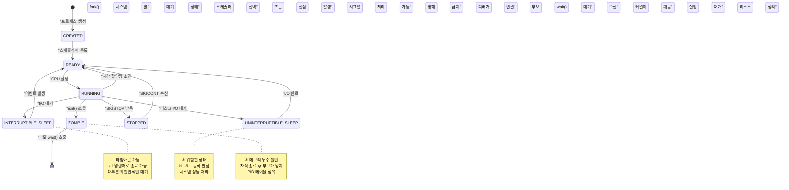
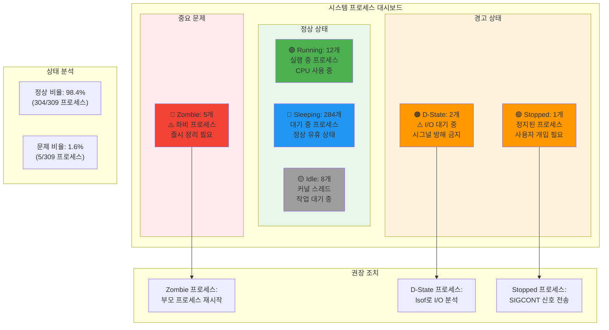
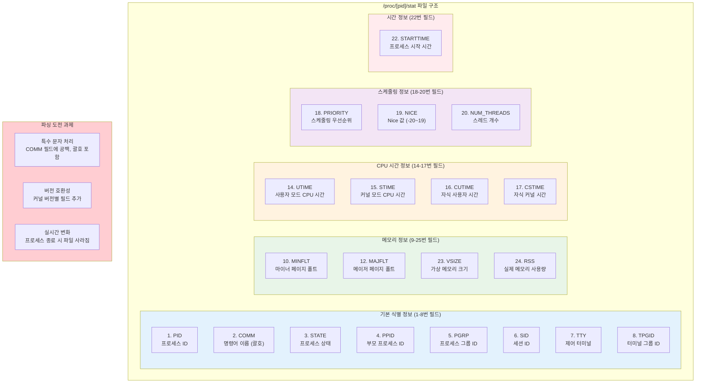
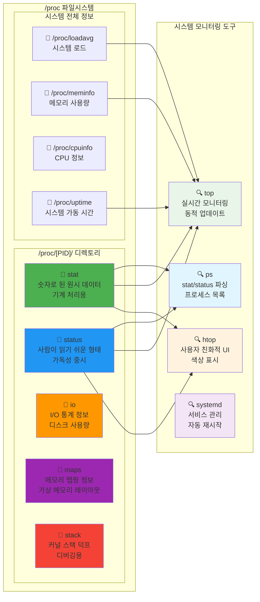
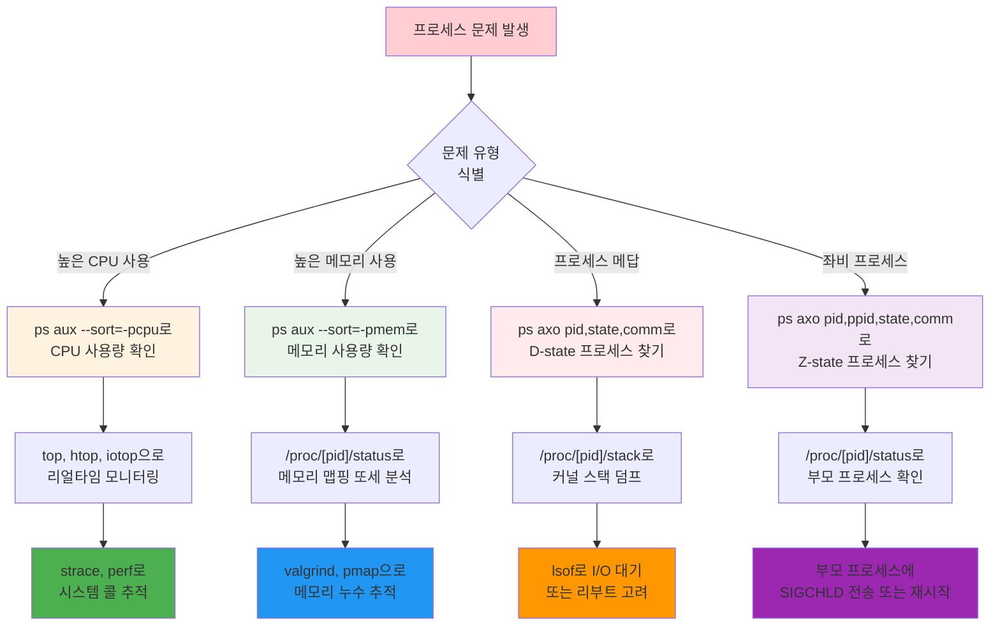
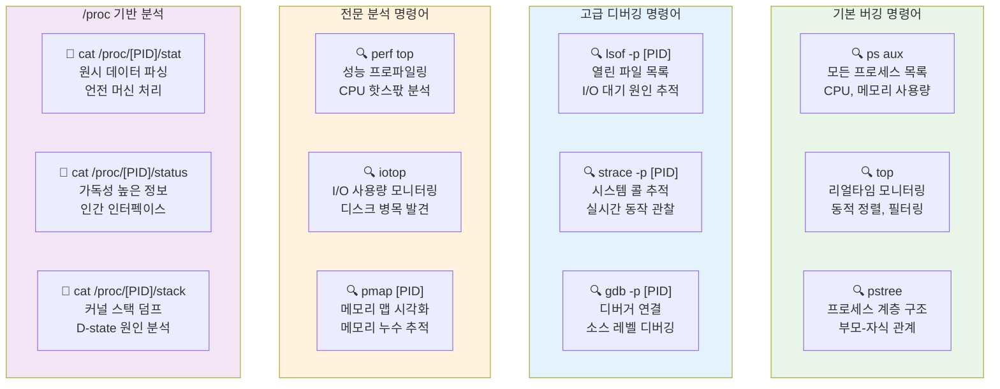

---
tags:
  - debugging-fundamentals
  - fundamentals
  - hands-on
  - medium-read
  - proc-filesystem
  - process-state
  - system-monitoring
  - 시스템프로그래밍
difficulty: FUNDAMENTALS
learning_time: "3-5시간"
main_topic: "시스템 프로그래밍"
priority_score: 4
---

# 1.1.2: 프로세스 상태와 라이프사이클

## 프로세스 상태와 /proc 파일시스템 완전 분석

리눅스에서 프로세스 상태를 정확히 파악하는 것은 시스템 진단의 첫걸음입니다. /proc/[pid]/stat과 status 정보를 제대로 읽을 수 있어야 문제의 근본 원인을 찾을 수 있습니다.

### 프로세스 라이프사이클: 탄생부터 소멸까지



### Linux 프로세스 상태 전체 맵

```mermaid
graph TB
    subgraph NORMAL_STATES["정상 상태"]
        R["🟢 R - Running
실행 중 또는 대기
CPU를 사용 중이거나 사용 대기"]
        S["🔵 S - Interruptible Sleep
인터럽트 가능한 대기
I/O, 네트워크, 사용자 입력 대기"]
        I["🟡 I - Idle
유휴 상태
커널 스레드 대기"]
    end
    
    subgraph WARNING_STATES["주의 상태"]
        D["🟠 D - Uninterruptible Sleep
인터럽트 불가능한 대기
디스크 I/O, 커널 작업 대기"]
        T["🟣 T - Stopped
정지된 상태
SIGSTOP, SIGTSTP 신호로 정지"]
        t["🟣 t - Tracing Stop
디버거 추적 중
ptrace(), gdb 디버깅"]
    end
    
    subgraph PROBLEM_STATES["문제 상태"]
        Z["🔴 Z - Zombie
좌비 프로세스
자식 종료, 부모 wait() 대기"]
        X["⚫ X - Dead
죽은 상태
ps에서 보이지 않음"]
    end
    
    subgraph DETAILED_INFO["상태별 세부 정보"]
        subgraph R_INFO["🟢 Running 상세"]
            R_DESC["• 런큐에서 대기 중
• 실제 CPU 사용 중
• 정상적인 상태
• 시스템 로드에 기여"]
        end
        
        subgraph S_INFO["🔵 Sleep 상세"]
            S_DESC["• 시그널 수신 가능
• kill 명령어로 종료 가능
• 대부분의 대기 상태
• 메모리에서 스왓 아웃 가능"]
        end
        
        subgraph D_INFO["🟠 D-State 상세"]
            D_DESC["⚠️ 시그널 방해 금지
⚠️ kill -9도 무효
⚠️ 시스템 성능 저하
⚠️ 커널 작업 완료 대기"]
        end
        
        subgraph Z_INFO["🔴 Zombie 상세"]
            Z_DESC["⚠️ 부모 wait() 대기
⚠️ PID 테이블 점유
⚠️ 메모리 누수 원인
⚠️ 자원 정리 필요"]
        end
    end
    
    R --> R_DESC
    S --> S_DESC
    D --> D_DESC
    Z --> Z_DESC
    
    style NORMAL_STATES fill:#E8F5E8
    style WARNING_STATES fill:#FFF3E0
    style PROBLEM_STATES fill:#FFEBEE
    style R fill:#4CAF50
    style S fill:#2196F3
    style I fill:#9E9E9E
    style D fill:#FF9800
    style T fill:#FF9800
    style t fill:#FF9800
    style Z fill:#F44336
    style X fill:#424242
```



## 1. 프로세스 상태 완전 분석

### 1.1 Linux 프로세스 상태 전체 목록

```bash
# 모든 프로세스 상태 확인
$ ps axo pid,ppid,state,comm | head -20

# 상태별 설명:
# R - Running (실행 중)
# S - Interruptible sleep (인터럽트 가능한 대기)
# D - Uninterruptible sleep (인터럽트 불가능한 대기) ⚠️
# T - Stopped (정지됨, SIGSTOP)
# t - Tracing stop (디버거에 의해 추적 중)
# Z - Zombie (좀비 프로세스) ⚠️
# X - Dead (죽음, ps에서 보이지 않음)
# I - Idle (유휴 상태, 커널 스레드)
```

### 실시간 프로세스 상태 대시보드



### 1.2 /proc/[pid]/stat 상세 분석

각 필드가 무엇을 의미하는지 정확히 알아봅시다:

### /proc/[pid]/stat 파일 구조 맵



### /proc 파일시스템 내비게이션



```c
// process_stat_analyzer.c
#include <stdio.h>
#include <stdlib.h>
#include <string.h>
#include <unistd.h>
#include <time.h>

typedef struct {
    int pid;
    char comm[256];
    char state;
    int ppid;
    int pgrp;
    int session;
    int tty_nr;
    int tpgid;
    unsigned long flags;
    unsigned long minflt;      // minor page faults
    unsigned long cminflt;     // children minor faults
    unsigned long majflt;      // major page faults
    unsigned long cmajflt;     // children major faults
    unsigned long utime;       // user mode time
    unsigned long stime;       // kernel mode time
    long cutime;               // children user time
    long cstime;               // children system time
    long priority;
    long nice;
    long num_threads;
    long itrealvalue;
    unsigned long long starttime;
    unsigned long vsize;       // virtual memory size
    long rss;                  // resident set size
    unsigned long rsslim;      // RSS limit
    // ... 더 많은 필드들
} proc_stat_t;

const char* state_description(char state) {
    switch (state) {
        case 'R': return "Running (실행 중)";
        case 'S': return "Interruptible sleep (신호로 깨울 수 있는 대기)";
        case 'D': return "Uninterruptible sleep (⚠️ 위험: 신호로 깨울 수 없음)";
        case 'T': return "Stopped (정지됨)";
        case 't': return "Tracing stop (디버거 추적 중)";
        case 'Z': return "Zombie (⚠️ 정리 필요)";
        case 'X': return "Dead (종료됨)";
        case 'I': return "Idle (유휴 상태)";
        default: return "Unknown";
    }
}

// /proc/[pid]/stat 파서 - Linux 프로세스 상태 분석의 핵심
// 실제 사용: htop, ps, top 등 모든 시스템 모니터링 도구가 사용하는 인터페이스
int parse_proc_stat(int pid, proc_stat_t *stat_info) {
    char path[256];
    snprintf(path, sizeof(path), "/proc/%d/stat", pid);

    // ⭐ 1단계: /proc/[pid]/stat 파일 열기
    // 이 파일은 커널이 실시간으로 생성하는 가상 파일
    // 프로세스가 사라지면 파일도 즉시 사라짐
    FILE *f = fopen(path, "r");
    if (!f) {
        // 프로세스가 이미 종료되었거나 권한이 없는 경우
        return -1;
    }

    // ⭐ 2단계: 복잡한 /proc/[pid]/stat 형식 파싱
    // 주의사항: comm 필드는 괄호로 둘러싸이며 공백/특수문자 포함 가능
    // 예: "1234 (hello world) S 1 ..." 형태
    // %255[^)]: 닫는 괄호가 아닌 문자를 최대 255개까지 읽기
    int ret = fscanf(f, "%d (%255[^)]) %c %d %d %d %d %d %lu %lu %lu %lu %lu %lu %lu %ld %ld %ld %ld %ld %ld %llu %lu %ld %lu",
        &stat_info->pid,          // [1] 프로세스 ID
        stat_info->comm,          // [2] 실행 파일명 (괄호 안)
        &stat_info->state,        // [3] 프로세스 상태 (R,S,D,Z,T,t,X,I)
        &stat_info->ppid,         // [4] 부모 프로세스 ID
        &stat_info->pgrp,         // [5] 프로세스 그룹 ID
        &stat_info->session,      // [6] 세션 ID
        &stat_info->tty_nr,       // [7] 터미널 번호
        &stat_info->tpgid,        // [8] 터미널 프로세스 그룹 ID
        &stat_info->flags,        // [9] 커널 플래그 (PF_*)
        &stat_info->minflt,       // [10] 마이너 페이지 폴트 수 (디스크 I/O 없음)
        &stat_info->cminflt,      // [11] 자식 프로세스들의 마이너 폴트 합계
        &stat_info->majflt,       // [12] ⭐ 메이저 페이지 폴트 (디스크 I/O 발생)
        &stat_info->cmajflt,      // [13] 자식 프로세스들의 메이저 폴트 합계
        &stat_info->utime,        // [14] ⭐ 사용자 모드 CPU 시간 (jiffies)
        &stat_info->stime,        // [15] ⭐ 커널 모드 CPU 시간 (jiffies)
        &stat_info->cutime,       // [16] 자식들의 사용자 모드 시간
        &stat_info->cstime,       // [17] 자식들의 커널 모드 시간
        &stat_info->priority,     // [18] ⭐ 스케줄링 우선순위
        &stat_info->nice,         // [19] ⭐ Nice 값 (-20~19)
        &stat_info->num_threads,  // [20] ⭐ 스레드 개수
        &stat_info->itrealvalue,  // [21] 사용되지 않음 (0)
        &stat_info->starttime,    // [22] 부팅 후 프로세스 시작 시간
        &stat_info->vsize,        // [23] ⭐ 가상 메모리 크기 (바이트)
        &stat_info->rss,          // [24] ⭐ 실제 사용 메모리 (페이지 수)
        &stat_info->rsslim        // [25] RSS 제한값
    );

    fclose(f);

    // ⭐ 3단계: 파싱 결과 검증
    // 25개 필드가 모두 올바르게 읽혔는지 확인
    // /proc/[pid]/stat 형식이 커널 버전마다 다를 수 있으므로 중요
    return (ret == 25) ? 0 : -1;
}

void print_process_analysis(const proc_stat_t *stat) {
    printf("=== 프로세스 상태 분석 ===\n");
    printf("PID: %d\n", stat->pid);
    printf("명령어: %s\n", stat->comm);
    printf("상태: %c (%s)\n", stat->state, state_description(stat->state));
    printf("부모 PID: %d\n", stat->ppid);
    printf("스레드 수: %ld\n", stat->num_threads);
    printf("우선순위: %ld (nice: %ld)\n", stat->priority, stat->nice);

    // 메모리 정보
    printf("\n=== 메모리 정보 ===\n");
    printf("가상 메모리: %.1f MB\n", stat->vsize / 1024.0 / 1024.0);
    printf("물리 메모리: %.1f MB\n", stat->rss * 4 / 1024.0);  // 페이지 크기 4KB 가정

    // 페이지 폴트 정보
    printf("\n=== 페이지 폴트 통계 ===\n");
    printf("Minor faults: %lu\n", stat->minflt);
    printf("Major faults: %lu\n", stat->majflt);
    printf("자식 minor faults: %lu\n", stat->cminflt);
    printf("자식 major faults: %lu\n", stat->cmajflt);

    // CPU 시간 정보
    long hz = sysconf(_SC_CLK_TCK);
    printf("\n=== CPU 시간 정보 ===\n");
    printf("사용자 모드: %.2f초\n", (double)stat->utime / hz);
    printf("커널 모드: %.2f초\n", (double)stat->stime / hz);
    printf("총 CPU 시간: %.2f초\n", (double)(stat->utime + stat->stime) / hz);

    // 경고 메시지
    if (stat->state == 'D') {
        printf("\n⚠️  경고: 프로세스가 D state입니다!\n");
        printf("   - I/O 작업을 기다리고 있습니다.\n");
        printf("   - 신호로 종료할 수 없습니다.\n");
        printf("   - 시스템 성능에 영향을 줄 수 있습니다.\n");
    } else if (stat->state == 'Z') {
        printf("\n⚠️  경고: 좀비 프로세스입니다!\n");
        printf("   - 부모 프로세스가 wait()를 호출하지 않았습니다.\n");
        printf("   - 프로세스 테이블 엔트리를 차지하고 있습니다.\n");
    }
}

void monitor_process_state(int pid, int duration) {
    printf("프로세스 %d 상태 모니터링 시작 (%d초간)...\n", pid, duration);

    time_t start_time = time(NULL);
    char last_state = 0;

    while (time(NULL) - start_time < duration) {
        proc_stat_t stat;
        if (parse_proc_stat(pid, &stat) == 0) {
            if (stat.state != last_state) {
                printf("[%s] 상태 변화: %c (%s)\n",
                       ctime(&(time_t){time(NULL)}),
                       stat.state,
                       state_description(stat.state));
                last_state = stat.state;

                // 위험한 상태 감지
                if (stat.state == 'D') {
                    printf("⚠️  D state 감지! I/O 대기 중...\n");
                }
            }
        } else {
            printf("프로세스 %d가 종료되었습니다.\n", pid);
            break;
        }

        sleep(1);
    }
}

int main(int argc, char *argv[]) {
    if (argc < 2) {
        printf("사용법: %s <pid> [monitor_duration]\n", argv[0]);
        printf("예시: %s 1234\n", argv[0]);
        printf("예시: %s 1234 60  # 60초간 모니터링\n", argv[0]);
        return 1;
    }

    int pid = atoi(argv[1]);

    if (argc == 2) {
        // 한 번만 분석
        proc_stat_t stat;
        if (parse_proc_stat(pid, &stat) == 0) {
            print_process_analysis(&stat);
        } else {
            printf("프로세스 %d의 정보를 읽을 수 없습니다.\n", pid);
            return 1;
        }
    } else {
        // 지속적 모니터링
        int duration = atoi(argv[2]);
        monitor_process_state(pid, duration);
    }

    return 0;
}
```

### 1.3 /proc/[pid]/status 정보 활용

status 파일은 stat보다 읽기 쉬운 형태로 정보를 제공합니다:

```bash
#!/bin/bash
# process_status_analyzer.sh

analyze_process_status() {
    local pid=$1
    local status_file="/proc/$pid/status"

    if [ ! -f "$status_file" ]; then
        echo "프로세스 $pid를 찾을 수 없습니다."
        return 1
    fi

    echo "=== 프로세스 $pid 상세 분석 ==="

    # 기본 정보
    echo "== 기본 정보 =="
    grep -E "^(Name|State|Pid|PPid|Tgid|Threads)" "$status_file"

    # 메모리 정보
    echo -e "\n== 메모리 정보 =="
    grep -E "^(VmPeak|VmSize|VmLck|VmPin|VmHWM|VmRSS|VmData|VmStk|VmExe|VmLib|VmPTE|VmSwap)" "$status_file"

    # 신호 정보
    echo -e "\n== 신호 정보 =="
    grep -E "^(SigQ|SigPnd|ShdPnd|SigBlk|SigIgn|SigCgt)" "$status_file"

    # 권한 정보
    echo -e "\n== 권한 정보 =="
    grep -E "^(Uid|Gid|Groups)" "$status_file"

    # 상태별 분석
    local state=$(grep "^State:" "$status_file" | awk '{print $2}')

    case $state in
        "D")
            echo -e "\n⚠️  D STATE 감지!"
            echo "현재 프로세스가 I/O 작업을 기다리고 있습니다."
            echo "관련 정보를 확인해보겠습니다..."

            # 열린 파일 확인
            echo -e "\n열린 파일들:"
            lsof -p "$pid" 2>/dev/null | head -10

            # I/O 통계
            if [ -f "/proc/$pid/io" ]; then
                echo -e "\nI/O 통계:"
                cat "/proc/$pid/io"
            fi

            # 스택 트레이스 (root 권한 필요)
            if [ -f "/proc/$pid/stack" ] && [ -r "/proc/$pid/stack" ]; then
                echo -e "\n커널 스택 트레이스:"
                cat "/proc/$pid/stack"
            fi
            ;;

        "Z")
            echo -e "\n⚠️  ZOMBIE 프로세스 감지!"
            echo "부모 프로세스 정보:"
            local ppid=$(grep "^PPid:" "$status_file" | awk '{print $2}')
            if [ -f "/proc/$ppid/comm" ]; then
                echo "부모 PID $ppid: $(cat /proc/$ppid/comm)"
                echo "부모 프로세스에 SIGCHLD 신호를 보내거나 재시작을 고려하세요."
            fi
            ;;

        "T")
            echo -e "\n⚠️  정지된 프로세스 감지!"
            echo "SIGCONT 신호로 재시작할 수 있습니다: kill -CONT $pid"
            ;;
    esac
}

# 시스템 전체 프로세스 상태 요약
system_process_summary() {
    echo "=== 시스템 프로세스 상태 요약 ==="

    ps axo state | tail -n +2 | sort | uniq -c | while read count state; do
        echo "$count 개 프로세스: $state ($(
            case $state in
                R*) echo "Running" ;;
                S*) echo "Sleeping" ;;
                D*) echo "⚠️ Uninterruptible Sleep" ;;
                T*) echo "⚠️ Stopped" ;;
                Z*) echo "⚠️ Zombie" ;;
                I*) echo "Idle" ;;
                *) echo "기타" ;;
            esac
        ))"
    done

    # 문제가 있는 프로세스들 상세 분석
    echo -e "\n=== 문제 프로세스 분석 ==="

    # D state 프로세스들
    local d_processes=$(ps axo pid,state,comm | awk '$2 ~ /^D/ {print $1}')
    if [ -n "$d_processes" ]; then
        echo "⚠️ D state 프로세스들:"
        echo "$d_processes" | while read pid; do
            if [ -n "$pid" ]; then
                echo "  PID $pid: $(cat /proc/$pid/comm 2>/dev/null || echo 'unknown')"
            fi
        done
    fi

    # Zombie 프로세스들
    local zombie_processes=$(ps axo pid,state,comm | awk '$2 ~ /^Z/ {print $1}')
    if [ -n "$zombie_processes" ]; then
        echo "⚠️ Zombie 프로세스들:"
        echo "$zombie_processes" | while read pid; do
            if [ -n "$pid" ]; then
                echo "  PID $pid: $(cat /proc/$pid/comm 2>/dev/null || echo 'unknown')"
            fi
        done
    fi
}

# 메뉴
if [ $# -eq 0 ]; then
    echo "프로세스 상태 분석 도구"
    echo "1) 특정 프로세스 분석: $0 <pid>"
    echo "2) 시스템 전체 요약: $0 summary"
    exit 1
fi

if [ "$1" = "summary" ]; then
    system_process_summary
else
    analyze_process_status "$1"
fi
```

## 핵심 요점

### 프로세스 디버깅 워크플로우



### 실전 디버깅 명령어 사전



### 1. /proc/[pid]/stat 파싱의 핵심

- 25개 필드의 정확한 의미 파악
- comm 필드의 특수 문자 처리 주의
- 실시간 프로세스 모니터링 구현

### 2. 프로세스 상태별 특징

- D state: I/O 대기로 신호 처리 불가
- Z state: 부모의 wait() 호출 대기
- T state: SIGSTOP으로 정지된 상태

### 3. 시스템 진단을 위한 접근

- /proc/[pid]/status로 가독성 높은 정보 확인
- lsof로 열린 파일 분석
- I/O 통계로 성능 문제 추적

---

**다음**: [1.5.6 D-state 디버깅](./01-05-06-dstate-debugging.md)에서 위험한 D State 프로세스 디버깅을 학습합니다.

## 📚 관련 문서

### 📖 현재 문서 정보

-**난이도**: FUNDAMENTALS
-**주제**: 시스템 프로그래밍
-**예상 시간**: 3-5시간

### 🎯 학습 경로

- [📚 FUNDAMENTALS 레벨 전체 보기](../learning-paths/fundamentals/)
- [🏠 메인 학습 경로](../learning-paths/)
- [📋 전체 가이드 목록](../README.md)

### 📂 같은 챕터 (chapter-01-process-thread)

- [Chapter 1-2-1: 프로세스 생성과 종료 개요](./01-02-01-process-creation.md)
- [Chapter 1-2-2: fork() 시스템 콜과 프로세스 복제 메커니즘](./01-02-02-process-creation-fork.md)
- [Chapter 1-2-3: exec() 패밀리와 프로그램 교체 메커니즘](./01-02-03-program-replacement-exec.md)
- [Chapter 1-2-4: 프로세스 종료와 좀비 처리](./01-02-04-process-termination-zombies.md)
- [Chapter 1-5-1: 프로세스 관리와 모니터링](./01-05-01-process-management-monitoring.md)

### 🏷️ 관련 키워드

`process-state`, `proc-filesystem`, `system-monitoring`, `debugging-fundamentals`

### ⏭️ 다음 단계 가이드

- 기초 개념을 충분히 이해한 후 INTERMEDIATE 레벨로 진행하세요
- 실습 위주의 학습을 권장합니다
