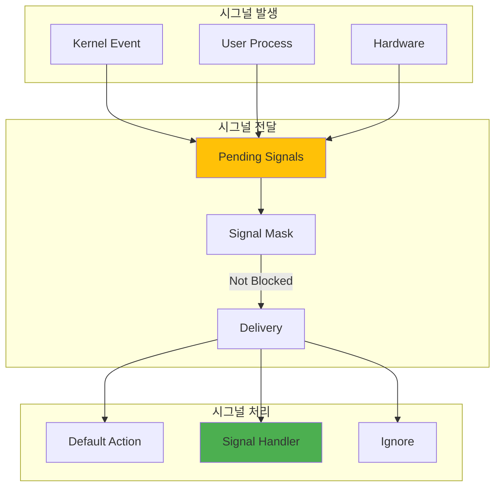

---
tags:
  - async-signal-safe
  - fundamentals
  - graceful-shutdown
  - hands-on
  - medium-read
  - realtime-signal
  - sigaction
  - signal
  - 시스템프로그래밍
difficulty: FUNDAMENTALS
learning_time: "4-6시간"
main_topic: "시스템 프로그래밍"
priority_score: 4
---

# 1.1.4: 시그널 기초

## 🔔 전화벨 같은 비동기 알림

시그널은 Unix의 "전화벨"입니다. 언제 울릴지 모르지만, 울리면 반드시 처리해야 하죠.

**실제 사례: Netflix의 Graceful Shutdown**

Netflix 서버는 매일 수천 번 재시작됩니다. 어떻게 사용자가 모르게 할까요?

```c
// Netflix 스타일 graceful shutdown
void sigterm_handler(int sig) {
    printf("SIGTERM received, starting graceful shutdown...\n");
    
    // 1. 새 연결 거부
    stop_accepting_connections();
    
    // 2. 기존 연결 완료 대기 (30초)
    wait_for_active_connections(30);
    
    // 3. 캐시 저장
    save_cache_to_disk();
    
    // 4. 깨끗하게 종료
    exit(0);
}

// 결과: 사용자는 재시작을 눈치채지 못함!
```

### 🐛 내가 만든 버그: Ctrl+C가 안 먹힌다

신입 때 만든 서버가 Ctrl+C를 눌러도 죽지 않았습니다.

```c
// 내 실수
void main() {
    signal(SIGINT, SIG_IGN);  // SIGINT 무시... 😱
    
    while (1) {
        // 무한 루프
        // Ctrl+C? 무시!
        // kill -9만이 유일한 희망...
    }
}
```

선배가 한마디:**"SIGKILL과 SIGSTOP만 못 막아. 그게 커널의 법칙이야."**

## 1.1 시그널의 본질: 커널의 택배



## 1.2 시그널 구현: 실수하기 쉬운 함정들

**함정 1: signal() vs sigaction()**

```c
// 🚫 위험한 코드 (signal)
void bad_handler(int sig) {
    printf("Signal %d\n", sig);  // printf는 async-signal-safe 아님!
    malloc(100);  // 더 위험!
}
signal(SIGINT, bad_handler);

// ✅ 안전한 코드 (sigaction)
void safe_handler(int sig) {
    const char msg[] = "Signal!\n";
    write(STDOUT_FILENO, msg, sizeof(msg));  // write는 안전!
}
```

**함정 2: 시그널 핸들러에서 할 수 있는 것**

제가 겪은 실제 버그:

```c
// 데드락 발생 코드!
void sigchld_handler(int sig) {
    mutex_lock(&global_mutex);  // 💥 데드락!
    // 메인 스레드가 이 뮤텍스를 가지고 있으면?
    cleanup_child();
    mutex_unlock(&global_mutex);
}
```

### 시그널 종류와 기본 사용법

```c
// 시그널 정의 (일부)
#define SIGHUP     1   // 터미널 연결 끊김
#define SIGINT     2   // 인터럽트 (Ctrl+C)
#define SIGQUIT    3   // 종료 (Ctrl+\)
#define SIGILL     4   // 잘못된 명령어
#define SIGTRAP    5   // 트레이스/브레이크포인트
#define SIGABRT    6   // abort() 호출
#define SIGBUS     7   // 버스 에러
#define SIGFPE     8   // 부동소수점 예외
#define SIGKILL    9   // 강제 종료 (차단 불가)
#define SIGUSR1   10   // 사용자 정의 1
#define SIGSEGV   11   // 세그멘테이션 폴트
#define SIGUSR2   12   // 사용자 정의 2
#define SIGPIPE   13   // 파이프 깨짐
#define SIGALRM   14   // 알람
#define SIGTERM   15   // 종료 요청
#define SIGCHLD   17   // 자식 프로세스 상태 변경
#define SIGCONT   18   // 계속 (정지된 프로세스)
#define SIGSTOP   19   // 정지 (차단 불가)
#define SIGTSTP   20   // 터미널 정지 (Ctrl+Z)

// 시그널 핸들러 등록 (기본)
void simple_signal_handler() {
    // 시그널 핸들러
    void sigint_handler(int sig) {
        printf("\nReceived SIGINT (Ctrl+C)\n");
        // 정리 작업
        cleanup();
        exit(0);
    }
    
    // 핸들러 등록
    signal(SIGINT, sigint_handler);
    
    // 메인 루프
    while (1) {
        do_work();
        sleep(1);
    }
}

// sigaction 사용 (권장)
void advanced_signal_handler() {
    struct sigaction sa;
    
    // 핸들러 함수
    void signal_handler(int sig, siginfo_t *info, void *context) {
        printf("Signal %d received\n", sig);
        printf("  From PID: %d\n", info->si_pid);
        printf("  Value: %d\n", info->si_value.sival_int);
        
        // 시그널별 처리
        switch (sig) {
            case SIGTERM:
                graceful_shutdown();
                break;
            case SIGUSR1:
                reload_config();
                break;
            case SIGUSR2:
                dump_stats();
                break;
        }
    }
    
    // sigaction 설정
    memset(&sa, 0, sizeof(sa));
    sa.sa_sigaction = signal_handler;
    sa.sa_flags = SA_SIGINFO | SA_RESTART;
    
    // 시그널 마스크 설정
    sigemptyset(&sa.sa_mask);
    sigaddset(&sa.sa_mask, SIGTERM);  // 핸들러 실행 중 SIGTERM 차단
    
    // 핸들러 등록
    sigaction(SIGTERM, &sa, NULL);
    sigaction(SIGUSR1, &sa, NULL);
    sigaction(SIGUSR2, &sa, NULL);
}

// 시그널 마스킹
void signal_masking_example() {
    sigset_t oldmask, newmask;
    
    // 새 마스크 생성
    sigemptyset(&newmask);
    sigaddset(&newmask, SIGINT);
    sigaddset(&newmask, SIGTERM);
    
    // Critical Section - 시그널 차단
    sigprocmask(SIG_BLOCK, &newmask, &oldmask);
    
    // 중요한 작업 (인터럽트 불가)
    critical_operation();
    
    // 시그널 차단 해제
    sigprocmask(SIG_SETMASK, &oldmask, NULL);
    
    // Pending 시그널 확인
    sigset_t pending;
    sigpending(&pending);
    
    if (sigismember(&pending, SIGINT)) {
        printf("SIGINT was pending\n");
    }
}
```

## 1.3 실시간 시그널: 큐잉의 마법

**일반 시그널 vs 실시간 시그널**

```c
// 일반 시그널: 여러 개 보내면 하나만 받음
for (int i = 0; i < 10; i++) {
    kill(pid, SIGUSR1);  // 10번 보내도
}
// 결과: 한 번만 받을 수도! 😱

// 실시간 시그널: 모두 큐잉
for (int i = 0; i < 10; i++) {
    union sigval value = {.sival_int = i};
    sigqueue(pid, SIGRTMIN, value);  // 데이터와 함께!
}
// 결과: 10번 모두 받음 + 순서 보장! ✅
```

**실제 활용: 비디오 인코딩 진행률**

```c
// FFmpeg 같은 도구에서 사용
void send_progress(pid_t monitor, int percent) {
    union sigval val = {.sival_int = percent};
    sigqueue(monitor, SIGRTMIN+1, val);
}

// 모니터링 프로세스
void progress_handler(int sig, siginfo_t *info, void *ctx) {
    int percent = info->si_value.sival_int;
    draw_progress_bar(percent);  // ████░░░ 57%
}
```

### 실시간 시그널 구현

```c
// 실시간 시그널 (SIGRTMIN ~ SIGRTMAX)
void realtime_signal_example() {
    // 실시간 시그널은 큐잉됨
    union sigval value;
    value.sival_int = 42;
    
    // 시그널과 함께 데이터 전송
    sigqueue(target_pid, SIGRTMIN + 5, value);
    
    // 수신측 핸들러
    void rt_handler(int sig, siginfo_t *info, void *context) {
        printf("RT Signal %d\n", sig);
        printf("Data: %d\n", info->si_value.sival_int);
        
        // 실시간 시그널은 순서 보장
        static int last_value = 0;
        assert(info->si_value.sival_int > last_value);
        last_value = info->si_value.sival_int;
    }
}

// signalfd - 시그널을 파일 디스크립터로 (현대적 접근법)
void signal_fd_example() {
    // signalfd의 핵심 장점:
    // 1. 동기적 처리: 언제든 원하는 시점에 시그널 확인 가능
    // 2. 멀티스레드 안전: race condition 없음
    // 3. epoll 통합: 다른 I/O와 함께 처리 가능
    // 4. 시그널 정보 손실 없음: 큐잉된 모든 시그널 처리
    
    sigset_t mask;
    int sfd;
    
    printf("[signalfd 장점 데모] 전통적 시그널 vs signalfd\n");
    
    // 시그널 마스크 설정
    sigemptyset(&mask);
    sigaddset(&mask, SIGINT);
    sigaddset(&mask, SIGTERM);
    
    // 일반 전달 차단
    sigprocmask(SIG_BLOCK, &mask, NULL);
    
    // signalfd 생성
    sfd = signalfd(-1, &mask, SFD_CLOEXEC);
    
    // 이제 시그널을 read()로 받음
    while (1) {
        struct signalfd_siginfo si;
        ssize_t s = read(sfd, &si, sizeof(si));
        
        if (s == sizeof(si)) {
            printf("Signal %d from PID %d\n", 
                   si.ssi_signo, si.ssi_pid);
            
            if (si.ssi_signo == SIGINT) {
                break;
            }
        }
    }
    
    close(sfd);
}
```

## 실전 시그널 활용 패턴

### 1. Graceful Shutdown 패턴

```c
static volatile sig_atomic_t shutdown_requested = 0;

void shutdown_handler(int sig) {
    shutdown_requested = 1;
}

void server_main() {
    signal(SIGTERM, shutdown_handler);
    signal(SIGINT, shutdown_handler);
    
    while (!shutdown_requested) {
        // 서버 작업
        handle_requests();
        
        // 주기적으로 shutdown_requested 확인
        if (shutdown_requested) {
            cleanup_and_exit();
        }
    }
}
```

### 2. Configuration Reload 패턴

```c
static volatile sig_atomic_t reload_config = 0;

void sigusr1_handler(int sig) {
    reload_config = 1;
}

void daemon_main() {
    signal(SIGUSR1, sigusr1_handler);
    
    while (1) {
        if (reload_config) {
            reload_configuration();
            reload_config = 0;
        }
        
        do_work();
    }
}
```

### 3. Child Process Monitoring

```c
void sigchld_handler(int sig) {
    pid_t pid;
    int status;
    
    // 좀비 프로세스 정리
    while ((pid = waitpid(-1, &status, WNOHANG)) > 0) {
        printf("Child %d exited with status %d\n", pid, status);
        cleanup_child_resources(pid);
    }
}

void parent_process() {
    signal(SIGCHLD, sigchld_handler);
    
    // 자식 프로세스들 생성
    for (int i = 0; i < 10; i++) {
        fork_worker_process();
    }
    
    // 메인 루프
    while (1) {
        manage_workers();
        sleep(1);
    }
}
```

## 핵심 요점

### 1. 시그널은 비동기 통신의 기본이다

프로세스가 예측하지 못한 시점에 발생하는 이벤트를 처리하는 핵심 메커니즘이다.

### 2. Async-signal-safe 함수만 사용하라

시그널 핸들러에서는 제한된 함수만 안전하게 사용할 수 있다. `write()`, `_exit()` 등만 사용 권장.

### 3. 실시간 시그널로 데이터와 순서를 보장하라

일반 시그널과 달리 큐잉되며 데이터를 함께 전송할 수 있어 더 정교한 제어가 가능하다.

### 4. signalfd로 현대적인 시그널 처리를 구현하라

전통적인 핸들러보다 안전하고 다른 I/O와 통합하기 쉬운 현대적 접근법이다.

---

**이전**: [1.4.1 스케줄링 개요](./01-04-01-scheduling.md)  
**다음**: [1.6.2 파이프와 FIFO](./01-06-02-pipes-fifos.md)에서 프로세스 간 데이터 스트리밍을 학습합니다.

## 📚 관련 문서

### 📖 현재 문서 정보

-**난이도**: FUNDAMENTALS
-**주제**: 시스템 프로그래밍
-**예상 시간**: 4-6시간

### 🎯 학습 경로

- [📚 FUNDAMENTALS 레벨 전체 보기](../learning-paths/fundamentals/)
- [🏠 메인 학습 경로](../learning-paths/)
- [📋 전체 가이드 목록](../README.md)

### 📂 같은 챕터 (chapter-01-process-thread)

- [Chapter 1-2-1: 프로세스 생성과 종료 개요](./01-02-01-process-creation.md)
- [Chapter 1-2-2: fork() 시스템 콜과 프로세스 복제 메커니즘](./01-02-02-process-creation-fork.md)
- [Chapter 1-2-3: exec() 패밀리와 프로그램 교체 메커니즘](./01-02-03-program-replacement-exec.md)
- [Chapter 1-2-4: 프로세스 종료와 좀비 처리](./01-02-04-process-termination-zombies.md)
- [Chapter 1-5-1: 프로세스 관리와 모니터링](./01-05-01-process-management-monitoring.md)

### 🏷️ 관련 키워드

`signal`, `sigaction`, `async-signal-safe`, `graceful-shutdown`, `realtime-signal`

### ⏭️ 다음 단계 가이드

- 기초 개념을 충분히 이해한 후 INTERMEDIATE 레벨로 진행하세요
- 실습 위주의 학습을 권장합니다
