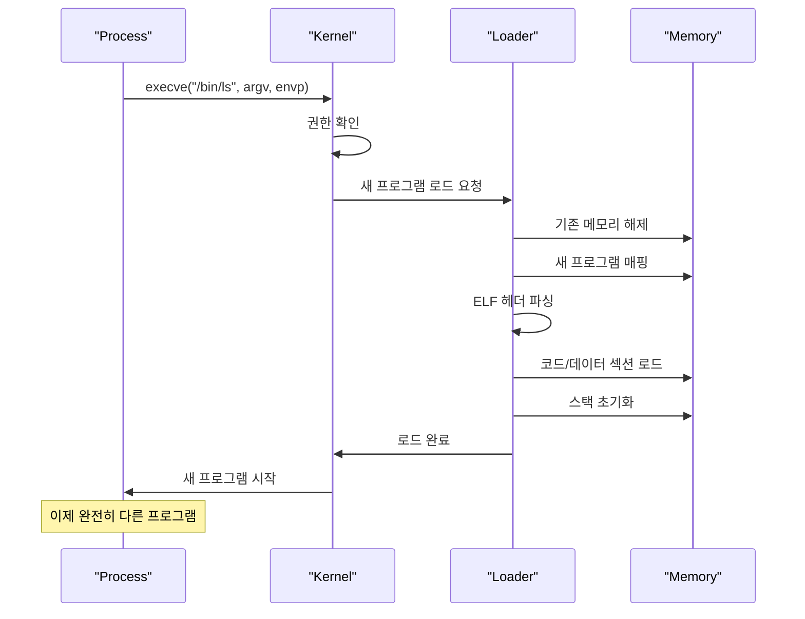
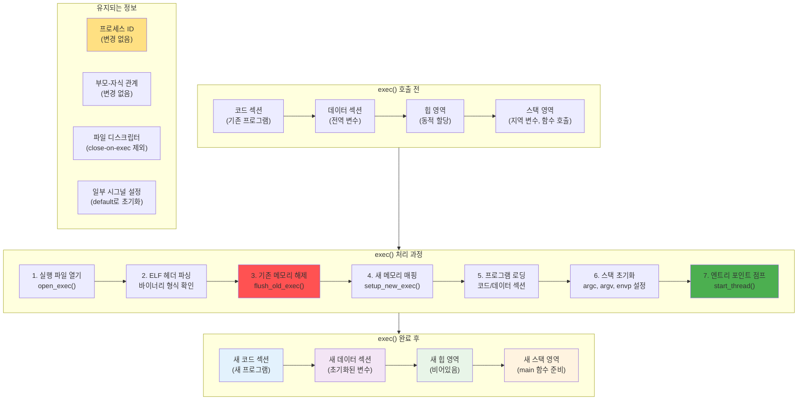
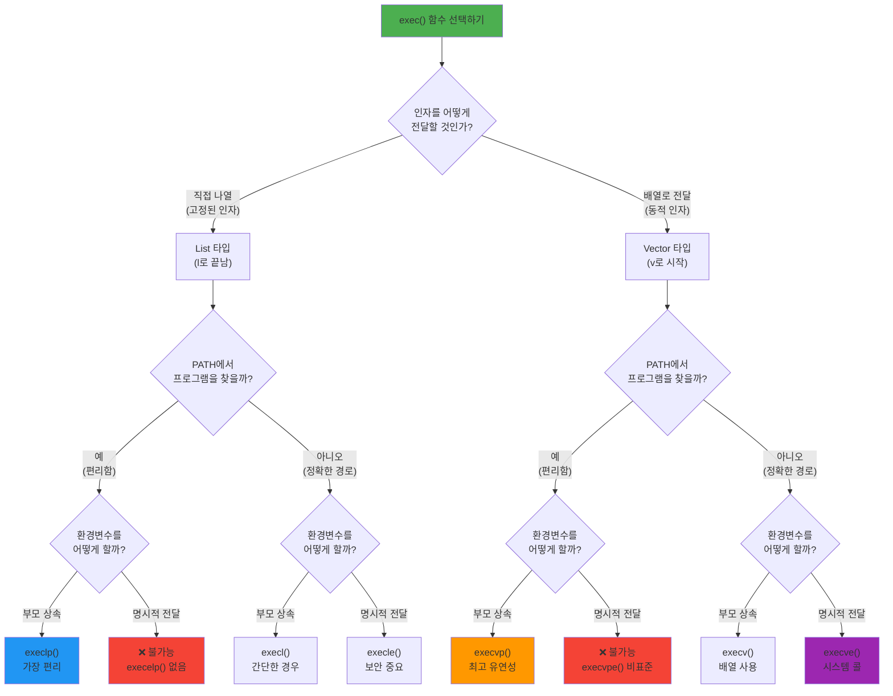
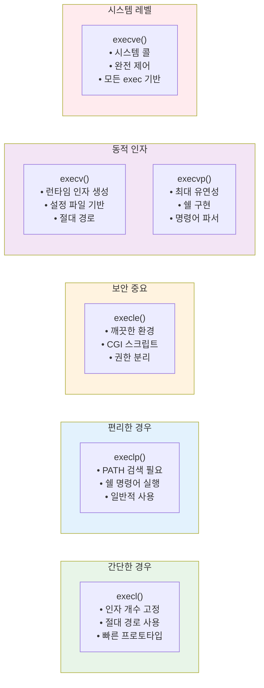
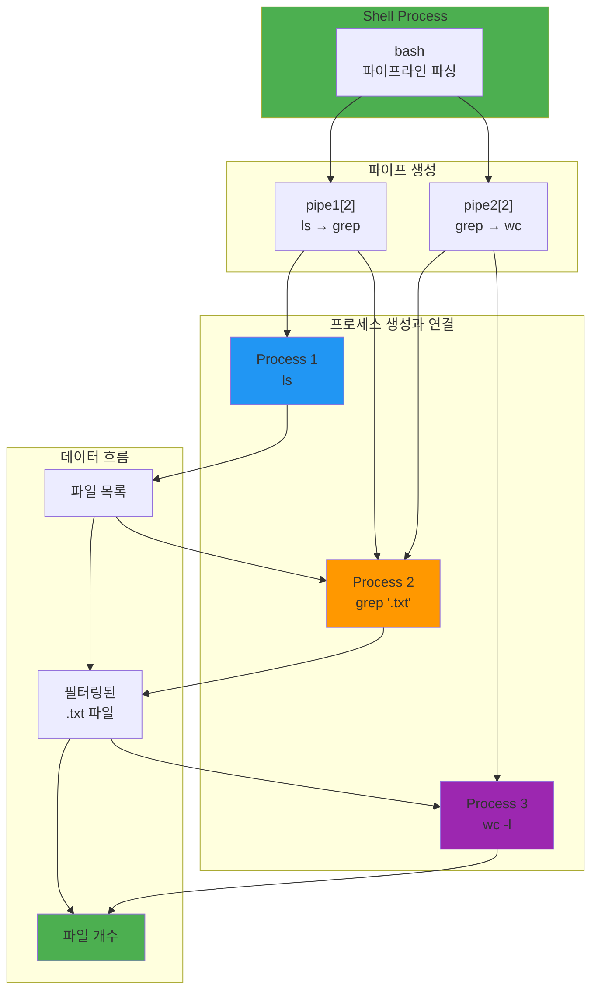

---
tags:
  - exec
  - hands-on
  - intermediate
  - medium-read
  - memory_replacement
  - process_control
  - system_call
  - unix_philosophy
  - 시스템프로그래밍
difficulty: INTERMEDIATE
learning_time: "3-5시간"
main_topic: "시스템 프로그래밍"
priority_score: 4
---

# 1.2.3: exec() 프로그램 교체

## 완전한 변신의 기술: 나비로 변하는 애벌레

### 쉘이 명령어를 실행하는 비밀

터미널에서 `ls` 명령을 입력하면 무슨 일이 일어날까요? 쉘 구현 중 알게 된 놀라운 사실:

```bash
$ strace -f bash -c "ls"
...
clone(...)  # fork()의 실제 시스템 콜
execve("/bin/ls", ["ls"], ...)  # 변신!
```

**쉘은 자기 자신을 ls로 바꾸지 않습니다!** fork()로 자식을 만들고, 그 자식이 exec()로 ls가 되는 거죠. 그래서 ls가 끝나도 쉘은 살아있는 겁니다.

### 프로그램 교체 메커니즘: 나비로 변하는 애벌레



### exec() 구현: 기억을 지우고 새로운 인격을 심는 과정

실제로 exec()를 디버깅하며 본 놀라운 광경입니다:

```c
// execve() 시스템 콜 내부: 프로세스 변신술의 비밀
int do_execve(const char *filename, 
              const char *const argv[],
              const char *const envp[]) {
    struct linux_binprm bprm;
    int retval;
    
    printf("[exec] %d번 프로세스가 %s로 변신 시작!\n", 
           getpid(), filename);
    
    // 1. 바이너리 파라미터 초기화
    memset(&bprm, 0, sizeof(bprm));
    
    // 2. 실행 파일 열기
    bprm.file = open_exec(filename);
    if (IS_ERR(bprm.file))
        return PTR_ERR(bprm.file);
    
    // 3. 인자와 환경변수 복사
    retval = copy_strings_kernel(argv, &bprm);
    if (retval < 0)
        goto out;
    
    retval = copy_strings_kernel(envp, &bprm);
    if (retval < 0)
        goto out;
    
    // 4. 바이너리 형식 확인 (ELF, script, etc.)
    retval = search_binary_handler(&bprm);
    if (retval < 0)
        goto out;
    
    // 5. 메모리 교체 (이 순간 과거는 사라진다!)
    flush_old_exec(&bprm);  // Point of No Return!
    
    // 6. 새 프로그램 설정
    setup_new_exec(&bprm);
    
    // 7. 엔트리 포인트로 점프 (새로운 삶의 시작)
    start_thread(bprm.entry_point);
    
    // 이 줄은 영원히 실행되지 않음 - exec()의 마법!
    // 이미 다른 프로그램이 되어버렸으니까
    printf("You will never see this!\n");
    return 0;
    
out:
    // 에러 처리
    return retval;
}

// 메모리 교체 과정: 기억을 지우는 순간
void flush_old_exec(struct linux_binprm *bprm) {
    struct mm_struct *old_mm = current->mm;
    
    printf("[exec] 과거를 지우는 중...\n");
    
    // 1. 새 메모리 공간 생성
    struct mm_struct *new_mm = mm_alloc();
    
    // 2. 기존 메모리 매핑 해제
    exit_mmap(old_mm);
    
    // 3. 새 메모리 공간 활성화
    activate_mm(old_mm, new_mm);
    current->mm = new_mm;
    
    // 4. 기존 메모리 구조체 해제
    mmput(old_mm);
    
    // 5. 시그널 초기화
    flush_signal_handlers(current);
    
    // 6. 파일 디스크립터 정리 (close-on-exec)
    flush_old_files(current->files);
}
```

### exec() 메모리 교체 과정: 기억 지우기의 시각화

exec() 시스템 콜이 어떻게 프로세스의 메모리를 완전히 교체하는지 단계별로 시각화해보겠습니다:



### Point of No Return: 되돌릴 수 없는 순간

```mermaid
sequenceDiagram
    participant App as "실행 중 프로그램"
    participant Kernel as "커널"
    participant Loader as "프로그램 로더"
    participant NewApp as "새 프로그램"
    
    Note over App: execve("/bin/ls", ...) 호출
    
    App->>Kernel: exec() 시스템 콜
    Kernel->>Kernel: 권한 검사
    Kernel->>Kernel: 파일 존재 확인
    
    Note over Kernel: Point of No Return!<br/>이 시점부터 되돌릴 수 없음
    
    Kernel->>Loader: 기존 메모리 해제 시작
    Loader->>Loader: 코드/데이터/힙/스택 정리
    
    Note over App: 기존 프로그램 완전 소멸
    
    Loader->>Loader: 새 프로그램 로딩
    Loader->>NewApp: 메모리 매핑 완료
    
    NewApp->>NewApp: main() 함수 시작
    
    Note over NewApp: 완전히 다른 프로그램이 됨<br/>PID는 동일하지만 내용은 완전 변경
    
    style Kernel fill:#FF9800
    style Loader fill:#2196F3
    style NewApp fill:#4CAF50
```

**중요한 통찰**: exec() 호출 후의 `printf("You will never see this!");`가 실행되지 않는 이유는 이미 다른 프로그램이 되어버렸기 때문입니다!

### exec() 패밀리 사용: 6형제의 차이점

exec() 패밀리를 처음 봤을 때 혼란스러웠던 기억이 납니다. 왜 이렇게 많은 버전이?

```c
#include <unistd.h>
#include <stdio.h>

// exec 패밀리 함수들: 각자의 특기가 있다!
void demonstrate_exec_family() {
    printf("\n=== exec() 6형제 소개 ===\n\n");
    
    // execl - List: 인자를 나열 (간단한 경우)
    printf("1. execl: 인자를 직접 나열\n");
    execl("/bin/ls", "ls", "-l", "/home", NULL);
    
    // execlp - List + Path: PATH에서 찾기 (편리!)
    printf("2. execlp: PATH에서 프로그램 찾기\n");
    execlp("ls", "ls", "-l", "/home", NULL);  // /bin/ls 안 써도 됨!
    
    // execle - List + Environment: 깨끗한 환경
    printf("3. execle: 커스텀 환경변수\n");
    char *envp[] = {"PATH=/bin", "USER=test", "LANG=C", NULL};
    execle("/bin/ls", "ls", "-l", NULL, envp);  // 보안에 좋음
    
    // execv - 배열 형태 인자
    char *argv[] = {"ls", "-l", "/home", NULL};
    execv("/bin/ls", argv);
    
    // execvp - PATH 검색 + 배열
    execvp("ls", argv);
    
    // execve - 배열 + 환경변수 (시스템 콜)
    execve("/bin/ls", argv, envp);
    
    // exec 이후 코드는 실행되지 않음
    printf("This will never be printed\n");
}
```

### exec() 함수 선택 플로우차트

어떤 exec() 함수를 써야 할지 헷갈릴 때 사용하는 의사결정 다이어그램:



### exec() 함수별 사용 시나리오



이제 각 함수의 실제 사용 예제를 보겠습니다:

```c

// fork + exec 패턴: 쉘의 핵심 메커니즘
void spawn_program(const char *program, char *const argv[]) {
    printf("\n=== 쉘처럼 프로그램 실행하기 ===\n");
    
    // 이것이 바로 system() 함수의 내부!
    pid_t pid = fork();
    
    if (pid == 0) {
        // 자식: 새 프로그램 실행
        execvp(program, argv);
        
        // exec 실패 시에만 실행
        perror("exec failed");
        exit(1);
    } else if (pid > 0) {
        // 부모: 자식 대기
        int status;
        waitpid(pid, &status, 0);
        
        if (WIFEXITED(status)) {
            printf("%s exited with %d\n", 
                   program, WEXITSTATUS(status));
        }
    } else {
        perror("fork failed");
    }
}

### 파이프라인 구현: 유닉스 철학의 시각화

`ls | grep '.txt' | wc -l` 명령이 어떻게 3개의 프로세스가 협력하여 동작하는지 시각화해보겠습니다:



### 파이프라인 실행 시퀀스

```mermaid
sequenceDiagram
    participant Shell as "Shell"
    participant Kernel as "Kernel"
    participant LS as "ls 프로세스"
    participant Grep as "grep 프로세스"
    participant WC as "wc 프로세스"
    
    Note over Shell: 파이프라인 파싱: ls | grep | wc
    
    Shell->>Kernel: pipe() - pipe1 생성
    Shell->>Kernel: pipe() - pipe2 생성
    
    par 프로세스 생성
        Shell->>Kernel: fork() - ls용
        Kernel->>LS: 자식 프로세스 생성
        LS->>LS: dup2(pipe1[1], STDOUT)
        LS->>LS: 모든 파이프 닫기
        LS->>Kernel: exec("ls")
    and
        Shell->>Kernel: fork() - grep용
        Kernel->>Grep: 자식 프로세스 생성
        Grep->>Grep: dup2(pipe1[0], STDIN)
        Grep->>Grep: dup2(pipe2[1], STDOUT)
        Grep->>Grep: 모든 파이프 닫기
        Grep->>Kernel: exec("grep", ".txt")
    and
        Shell->>Kernel: fork() - wc용
        Kernel->>WC: 자식 프로세스 생성
        WC->>WC: dup2(pipe2[0], STDIN)
        WC->>WC: 모든 파이프 닫기
        WC->>Kernel: exec("wc", "-l")
    end
    
    Shell->>Shell: 모든 파이프 닫기
    
    Note over LS,WC: 동시 실행 및 데이터 파이프를 통해 흐름
    
    LS->>Grep: 파일 목록 데이터
    Grep->>WC: 필터링된 .txt 파일들
    WC->>Shell: 최종 카운트 결과
    
    par 프로세스 종료 대기
        Shell->>Kernel: wait() - ls
        Shell->>Kernel: wait() - grep
        Shell->>Kernel: wait() - wc
    end
    
    Note over Shell: 파이프라인 완료
    
    style LS fill:#2196F3
    style Grep fill:#FF9800
    style WC fill:#9C27B0
```

이 패턴이 바로 **유닉스 철학**의 핵심입니다: "작은 도구들이 파이프로 연결되어 큰 일을 해낸다!"

```c
// 파이프라인 구현: 유닉스 철학의 정수
void create_pipeline() {
    printf("\n=== 파이프라인 마법: ls | grep '.txt' | wc -l ===\n");
    // 이렇게 3개 프로세스가 협력한다!
    int pipe1[2], pipe2[2];

    pipe(pipe1);
    pipe(pipe2);
    
    // 첫 번째 명령: ls
    if (fork() == 0) {
        dup2(pipe1[1], STDOUT_FILENO);
        close(pipe1[0]);
        close(pipe1[1]);
        close(pipe2[0]);
        close(pipe2[1]);
        execlp("ls", "ls", NULL);
    }
    
    // 두 번째 명령: grep
    if (fork() == 0) {
        dup2(pipe1[0], STDIN_FILENO);
        dup2(pipe2[1], STDOUT_FILENO);
        close(pipe1[0]);
        close(pipe1[1]);
        close(pipe2[0]);
        close(pipe2[1]);
        execlp("grep", "grep", ".txt", NULL);
    }
    
    // 세 번째 명령: wc
    if (fork() == 0) {
        dup2(pipe2[0], STDIN_FILENO);
        close(pipe1[0]);
        close(pipe1[1]);
        close(pipe2[0]);
        close(pipe2[1]);
        execlp("wc", "wc", "-l", NULL);
    }
    
    // 부모: 파이프 닫고 대기
    close(pipe1[0]);
    close(pipe1[1]);
    close(pipe2[0]);
    close(pipe2[1]);
    
    wait(NULL);
    wait(NULL);
    wait(NULL);
}
```

## exec() 패밀리 함수 비교표

| 함수 | 인자 형태 | PATH 검색 | 환경변수 | 특징 |
|------|-----------|-----------|----------|---------|
| **execl** | List (가변인자) | ❌ | 부모 상속 | 간단한 경우 |
| **execlp** | List + PATH | ✅ | 부모 상속 | 가장 편리 |
| **execle** | List + Env | ❌ | 명시적 전달 | 보안 중시 |
| **execv** | Vector (배열) | ❌ | 부모 상속 | 동적 인자 |
| **execvp** | Vector + PATH | ✅ | 부모 상속 | 유연성 최대 |
| **execve** | Vector + Env | ❌ | 명시적 전달 | **시스템 콜** |

## 실전 활용 시나리오

### 시나리오 1: 웹서버 CGI 실행

```c
// Apache가 PHP 스크립트를 실행하는 방식
if (fork() == 0) {
    // 환경변수 설정
    setenv("REQUEST_METHOD", "GET", 1);
    setenv("QUERY_STRING", "name=value", 1);
    
    // PHP 인터프리터로 변신
    execl("/usr/bin/php", "php", "script.php", NULL);
}
```

### 시나리오 2: 시스템 명령 실행

```c
// system() 함수의 실제 구현
int my_system(const char *command) {
    pid_t pid = fork();
    
    if (pid == 0) {
        execl("/bin/sh", "sh", "-c", command, NULL);
        exit(127);  // exec 실패
    }
    
    int status;
    waitpid(pid, &status, 0);
    return WEXITSTATUS(status);
}
```

### 시나리오 3: 데몬 프로세스 생성

```c
void become_daemon(const char *daemon_program) {
    // 1. 부모에서 분리
    if (fork() != 0) exit(0);
    
    // 2. 세션 리더 되기
    setsid();
    
    // 3. 두 번째 fork로 세션 리더 포기
    if (fork() != 0) exit(0);
    
    // 4. 작업 디렉토리 변경
    chdir("/");
    
    // 5. 파일 모드 마스크 리셋
    umask(0);
    
    // 6. 표준 파일 디스크립터 닫기
    close(STDIN_FILENO);
    close(STDOUT_FILENO);
    close(STDERR_FILENO);
    
    // 7. 데몬 프로그램으로 변신
    execl(daemon_program, daemon_program, NULL);
}
```

## Point of No Return: exec()의 특성

### 1. 메모리 공간 완전 교체

- 기존 코드, 데이터, 힙, 스택 모두 삭제
- 새 프로그램의 메모리 레이아웃으로 완전 교체
- **되돌릴 수 없는 변화**

### 2. PID는 유지, 내용은 완전 변경

- 프로세스 ID는 그대로
- 부모-자식 관계 유지
- 하지만 실행 중인 프로그램은 완전히 다름

### 3. 파일 디스크립터 처리

- 기본: 열린 파일 디스크립터 상속
- close-on-exec 플래그: exec() 시 자동 닫기
- 보안상 중요한 파일들은 close-on-exec 설정 필수

```c
// close-on-exec 설정 예제
int fd = open("sensitive_file.txt", O_RDONLY);
fcntl(fd, F_SETFD, FD_CLOEXEC);  // exec() 시 자동 닫기
```

## 핵심 요점

### 1. exec()의 마법

exec()는 프로세스의 기억을 완전히 지우고 새로운 프로그램으로 변신시킵니다. 되돌릴 수 없는 Point of No Return입니다.

### 2. 6형제의 특징

각 exec() 함수는 인자 전달 방식과 기능에 따라 다른 용도에 최적화되어 있습니다.

### 3. fork + exec 패턴

유닉스의 핵심 철학: fork()로 복제하고 exec()로 변신하는 것이 모든 프로그램 실행의 기본입니다.

### 4. 실전 활용

웹서버, 시스템 도구, 데몬 프로세스 등 모든 곳에서 사용되는 필수 기술입니다.

---

**이전**: [1.2.2 fork() 시스템 콜](./01-02-02-process-creation-fork.md)  
**다음**: [1.2.4 프로세스 종료와 좀비](./01-02-04-process-termination-zombies.md)에서 프로세스 종료와 좀비 프로세스 처리를 학습합니다.

## 📚 관련 문서

### 📖 현재 문서 정보

- **난이도**: INTERMEDIATE
- **주제**: 시스템 프로그래밍
- **예상 시간**: 3-5시간

### 🎯 학습 경로

- [📚 INTERMEDIATE 레벨 전체 보기](../learning-paths/intermediate/)
- [🏠 메인 학습 경로](../learning-paths/)
- [📋 전체 가이드 목록](../README.md)

### 📂 같은 챕터 (chapter-01-process-thread)

- [Chapter 1-2-1: 프로세스 생성과 종료 개요](./01-02-01-process-creation.md)
- [Chapter 1-2-2: fork() 시스템 콜과 프로세스 복제 메커니즘](./01-02-02-process-creation-fork.md)
- [Chapter 1-2-4: 프로세스 종료와 좀비 처리](./01-02-04-process-termination-zombies.md)
- [Chapter 1-5-1: 프로세스 관리와 모니터링](./01-05-01-process-management-monitoring.md)
- [1.3.2 스레드 동기화 개요: 멀티스레딩 마스터로드맵](./01-03-02-thread-synchronization.md)

### 🏷️ 관련 키워드

`exec`, `process_control`, `system_call`, `memory_replacement`, `unix_philosophy`

### ⏭️ 다음 단계 가이드

- 실무 적용을 염두에 두고 프로젝트에 적용해보세요
- 관련 도구들을 직접 사용해보는 것이 중요합니다
