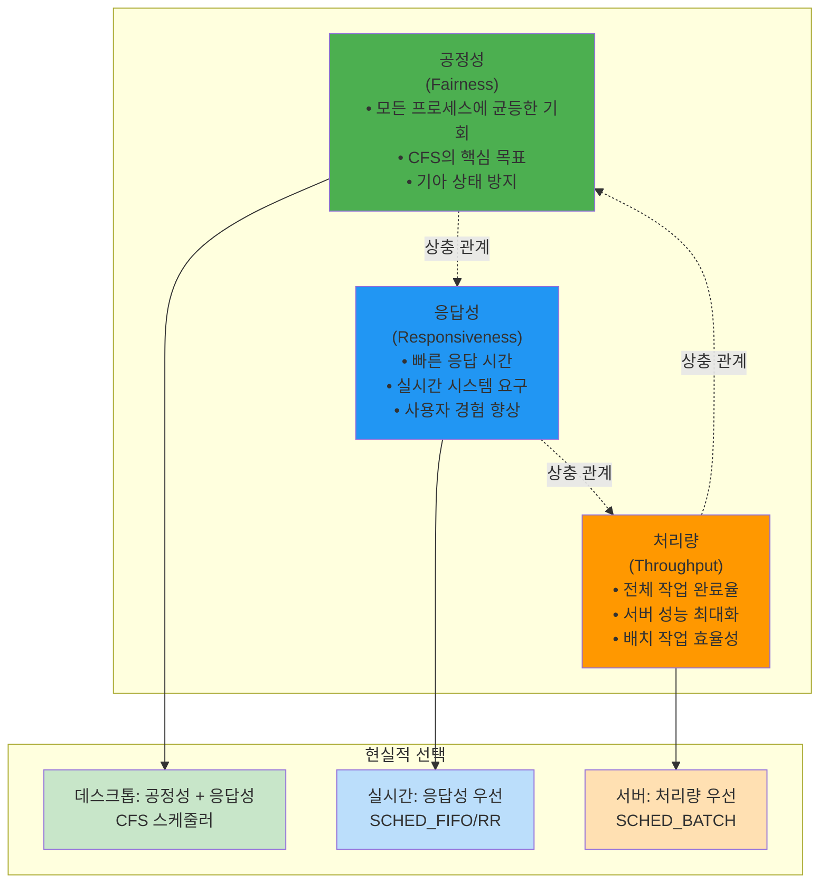
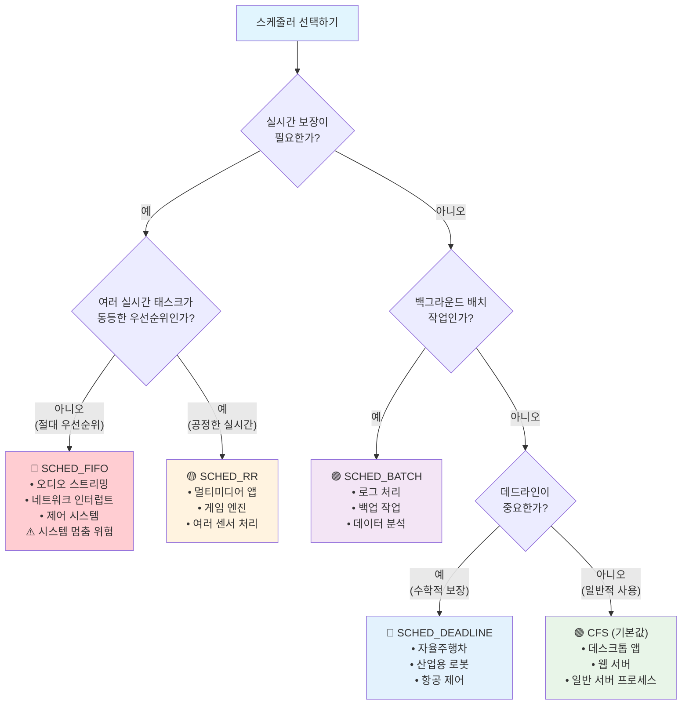
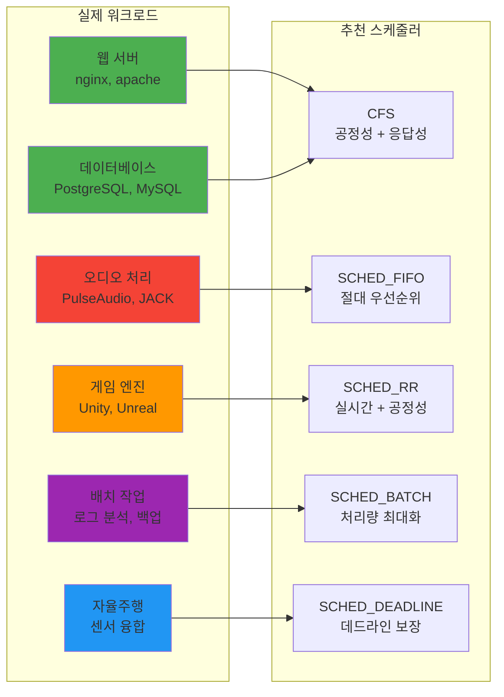
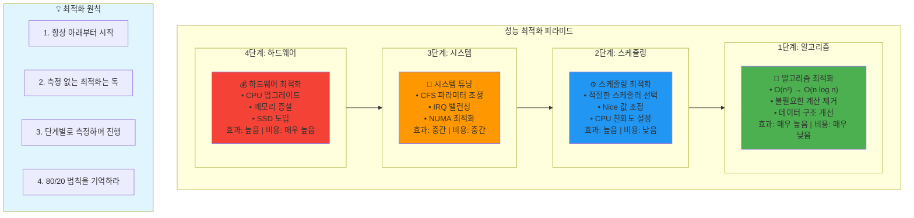

---
tags:
  - CFS
  - CPU-affinity
  - balanced
  - intermediate
  - medium-read
  - performance-tuning
  - real-time
  - scheduling
  - 시스템프로그래밍
difficulty: INTERMEDIATE
learning_time: "4-6시간"
main_topic: "시스템 프로그래밍"
priority_score: 4
---

# 1.4.1: 스케줄링 심화

## 🎪 구글 데이터센터의 비밀

구글 데이터센터에는 수백만 개의 태스크가 동시에 실행됩니다. 검색 쿼리, YouTube 스트리밍, Gmail, 광고 서빙... 이 모든 것이 어떻게 공존할까요?

제가 구글 엔지니어와 대화했을 때 들은 충격적인 사실:
**"우리는 CPU를 200% 이상 사용합니다."**

어떻게 가능할까요? 바로**스케줄링의 마법**입니다.

스케줄링은 현대 컴퓨터 시스템의**두뇌**와 같습니다. 제대로 이해하면 시스템 성능을 극대화할 수 있지만, 잘못 설정하면 전체 시스템이 마비될 수 있습니다.

### 스케줄링의 불가능한 삼각형: 트레이드오프의 현실



### CPU 과구독의 마법: 시간 분할의 힘

구글이 어떻게 200% CPU 사용률을 달성하는지 시각화해보겠습니다:

```mermaid
gantt
    title CPU 과구독 예시: 4개 작업이 2개 CPU 코어에서 실행
    dateFormat X
    axisFormat %L
    
    section CPU Core 1
    검색 쿼리 처리     :active, search1, 0, 50
    YouTube 스트리밍   :active, youtube1, 50, 100
    검색 쿼리 처리     :active, search2, 100, 150
    Gmail 처리        :active, gmail1, 150, 200
    
    section CPU Core 2  
    광고 서빙         :active, ads1, 0, 50
    Gmail 처리        :active, gmail2, 50, 100
    YouTube 스트리밍   :active, youtube2, 100, 150
    광고 서빙         :active, ads2, 150, 200
    
    section 논리적 사용률
    실제 CPU 사용률   :milestone, actual, 200, 0
```



**핵심 인사이트**: 스케줄러가 마이크로초 단위로 작업을 전환하여 물리적 한계를 뛰어넘는 성능을 만들어냅니다!

## 📚 학습 로드맵

이 섹션은**5개의 전문화된 문서**로 구성되어 있어, 스케줄링의 모든 측면을 체계적으로 마스터할 수 있습니다:

### 1️⃣ [스케줄링 기초와 CFS 원리](./01-01-03-scheduling-fundamentals.md)

- 스케줄링 목표의 불가능한 삼각형 (공정성 vs 응답성 vs 처리량)
- 프로세스 상태와 런큐 구조
- CFS(Completely Fair Scheduler)의 Red-Black Tree 마법
- vruntime과 공정성 보장 메커니즘

### 2️⃣ [CFS 구현 세부사항](./01-04-02-cfs-implementation.md)

- Nice 값과 가중치 시스템: 1.25의 법칙
- Weight 테이블과 CPU 시간 분배 공식
- PELT(Per-Entity Load Tracking) 알고리즘
- CFS 성능 튜닝과 워크로드별 최적화

### 3️⃣ [실시간 스케줄링](./01-04-03-realtime-scheduling.md)

- SCHED_FIFO vs SCHED_RR: 언제 어떤 것을 사용할까?
- SCHED_DEADLINE과 EDF(Earliest Deadline First) 알고리즘
- Mars Pathfinder 사례와 우선순위 역전 문제
- 자율주행차와 산업용 로봇의 실시간 요구사항

### 4️⃣ [CPU 친화도와 NUMA 최적화](./01-04-04-cpu-affinity.md)

- CPU 친화도를 통한 캐시 최적화
- NUMA 아키텍처와 메모리 지역성
- 우선순위 역전 문제와 우선순위 상속
- 멀티코어 시스템의 로드 밸런싱

### 5️⃣ [로드 밸런싱과 성능 최적화](./01-05-04-optimization-strategies.md)

- CPU 간 로드 밸런싱 알고리즘
- Cgroup을 이용한 CPU 제한과 격리
- 스케줄링 통계 분석과 병목 지점 발견
- 워크로드별 스케줄링 튜닝 전략

## 🎯 핵심 스케줄러 비교표

| 스케줄러 | 목표 | 사용 시점 | 장점 | 단점 |
|---------|------|----------|------|------|
|**CFS**| 공정성 | 일반 데스크톱/서버 | 완전 공정, 응답성 양호 | 실시간 보장 불가 |
|**SCHED_FIFO**| 실시간 성능 | 오디오, 네트워크 스택 | 최고 우선순위 보장 | 시스템 멈춤 위험 |
|**SCHED_RR**| 실시간 공정성 | 멀티미디어, 게임 | 실시간 + 공정성 | 타임슬라이스 오버헤드 |
|**SCHED_DEADLINE**| 데드라인 보장 | 자율주행, 제어 시스템 | 수학적 최적성 | 설정 복잡함 |
|**SCHED_BATCH**| 처리량 최대화 | 백그라운드 작업 | 높은 처리량 | 응답성 희생 |

### 스케줄러 선택 의사결정 트리

어떤 스케줄러를 사용해야 할지 헷갈릴 때 사용하는 플로우차트입니다:



### 실제 워크로드별 스케줄러 매핑



## 🚀 실전 활용 시나리오

### 웹 서버 최적화

```bash
# 웹 서버 프로세스: 응답성 우선
nice -n -5 nginx
echo 0 > /proc/sys/kernel/sched_autogroup_enabled

# 로그 처리: 백그라운드에서
nice -n 15 logrotate /etc/logrotate.conf
```

### 멀티미디어 시스템

```c
// 오디오: 절대 끊기면 안됨
sched_setscheduler(audio_pid, SCHED_FIFO, &fifo_param);

// 비디오: 여러 스트림 공정하게
sched_setscheduler(video_pid, SCHED_RR, &rr_param);
```

### 임베디드 실시간 시스템

```c
// 센서 읽기: 정확한 주기 보장
set_deadline_scheduling(sensor_pid, 
    2000000,   // 2ms 실행
    5000000,   // 5ms 데드라인
    10000000); // 10ms 주기
```

## 📈 성능 최적화 우선순위

### 최적화 피라미드: 효과 vs 노력의 현실

성능 최적화는 피라미드 구조로 접근해야 합니다. 아래부터 차례대로!



### 단계별 최적화 전략

### 1단계: 알고리즘 최적화 (🥇 최우선)

-**O(n²) → O(n log n)**시간복잡도 개선
-**불필요한 계산 제거**- 가장 큰 효과
-**캐시 친화적 데이터 구조**사용

### 2단계: 스케줄링 최적화 (🥈 높은 효과)

-**적절한 스케줄러 선택**- 워크로드별 맞춤
-**Nice 값과 우선순위 조정**- 비용 제로
-**CPU 친화도 설정**- 캐시 최적화

### 3단계: 시스템 튜닝 (🥉 중간 효과)

-**CFS 파라미터 조정**- 세밀한 튜닝
-**IRQ 밸런싱**- 인터럽트 최적화
-**NUMA 최적화**- 메모리 지역성

### 4단계: 하드웨어 최적화 (💰 마지막 수단)

-**CPU 업그레이드**- 가장 비싼 방법
-**메모리 증설**- 메모리 부족 시에만
-**SSD 도입**- I/O 집약적 작업

## ⚠️ 주의사항과 함정

### 절대 하지 말아야 할 것들

-**모든 것을 SCHED_FIFO로**: 시스템 멈춤 위험
-**Nice -20 남용**: 다른 프로세스 기아 상태
-**측정 없는 최적화**: 추측으로는 성능 개선 불가

### 반드시 기억할 것들

-**실시간 != 빠른 실행**: 예측 가능성이 더 중요
-**공정성과 성능은 트레이드오프**: 둘 다 100% 만족 불가
-**워크로드별 맞춤 설정**: 만능 설정은 없음

## 🔗 연관 학습

### 선행 학습 권장

- [1.2.1 프로세스 생성 개요](./01-02-01-process-creation.md) - 프로세스 생명주기
- [1.3.2 스레드 동기화](./01-03-02-thread-synchronization.md) - 동기화 메커니즘

### 후속 학습 추천  

- [1.3.5 Signal과 IPC](./01-03-05-signal-ipc.md) - 프로세스 간 통신
- [메모리 관리](../../memory/) - 가상 메모리와 성능

## 💡 마지막 조언

스케줄링은**시스템 성능의 핵심**이지만,**측정 없는 최적화는 독**입니다.

**성공하는 스케줄링 최적화:**

1.**프로파일링 먼저**: `perf`, `htop`, `/proc/stat` 활용
2.**단계적 접근**: 하나씩 바꿔가며 측정
3.**워크로드 이해**: 내 시스템의 특성 파악
4.**지속적 모니터링**: 최적화 후에도 계속 관찰

10년간 수백 개의 시스템을 튜닝한 경험으로 말씀드리면, 스케줄링을 마스터하면**진정한 시스템 전문가**가 될 수 있습니다. 하지만 그 길은 험난하니, 체계적으로 한 걸음씩 나아가세요! 🚀

---

**다음**: [1.1.3 스케줄링 기초와 CFS 원리](./01-01-03-scheduling-fundamentals.md)에서 스케줄링의 기초부터 차근차근 시작하세요!

## 📚 관련 문서

### 📖 현재 문서 정보

-**난이도**: INTERMEDIATE
-**주제**: 시스템 프로그래밍
-**예상 시간**: 4-6시간

### 🎯 학습 경로

- [📚 INTERMEDIATE 레벨 전체 보기](../learning-paths/intermediate/)
- [🏠 메인 학습 경로](../learning-paths/)
- [📋 전체 가이드 목록](../README.md)

### 📂 같은 챕터 (chapter-01-process-thread)

- [Chapter 1-2-1: 프로세스 생성과 종료 개요](./01-02-01-process-creation.md)
- [Chapter 1-2-2: fork() 시스템 콜과 프로세스 복제 메커니즘](./01-02-02-process-creation-fork.md)
- [Chapter 1-2-3: exec() 패밀리와 프로그램 교체 메커니즘](./01-02-03-program-replacement-exec.md)
- [Chapter 1-2-4: 프로세스 종료와 좀비 처리](./01-02-04-process-termination-zombies.md)
- [Chapter 1-5-1: 프로세스 관리와 모니터링](./01-05-01-process-management-monitoring.md)

### 🏷️ 관련 키워드

`scheduling`, `CFS`, `real-time`, `CPU-affinity`, `performance-tuning`

### ⏭️ 다음 단계 가이드

- 실무 적용을 염두에 두고 프로젝트에 적용해보세요
- 관련 도구들을 직접 사용해보는 것이 중요합니다
