---
tags:
  - CFS
  - Nice값
  - PELT
  - Weight시스템
  - balanced
  - intermediate
  - medium-read
  - 스케줄링최적화
  - 시스템프로그래밍
difficulty: INTERMEDIATE
learning_time: "4-6시간"
main_topic: "시스템 프로그래밍"
priority_score: 4
---

# 1.4.2: CFS 구현

## 🎯 1.25의 법칙: Nice 값의 숨겨진 과학

**Nice 값의 숨겨진 규칙**

Linux 개발자들의 절묘한 선택: Nice 값이 1 차이날 때마다 CPU 시간은 약 1.25배(정확히는 1.25992...) 차이납니다.

왜 1.25인지 궁금하죠?

```text
nice 차이 5 = 1.25^5 ≈ 3배
nice 차이 10 = 1.25^10 ≈ 10배  
nice 차이 20 = 1.25^20 ≈ 100배
```

이렇게 기하급수적으로 증가해서 세밀한 제어가 가능합니다.

### Nice 값과 CPU 시간의 관계: 1.25의 마법

```mermaid
graph TD
    subgraph NICE_SCALE["Nice 값 스케일"]
        N20["-20<br/>최고 우선순위<br/>Weight: 88761"]
        N10["-10<br/>높은 우선순위<br/>Weight: 9548"]
        N0["0<br/>기본값<br/>Weight: 1024"]
        N10P["10<br/>낮은 우선순위<br/>Weight: 110"]
        N19["19<br/>최저 우선순위<br/>Weight: 15"]
    end
    
    subgraph CPU_TIME["실제 CPU 시간 (10초 중)"]
        T95["9.5초<br/>(95%)"]
        T72["7.2초<br/>(72%)"]
        T50["5.0초<br/>(50%)"]
        T18["1.8초<br/>(18%)"]
        T05["0.5초<br/>(5%)"]
    end
    
    N20 --> T95
    N10 --> T72
    N0 --> T50
    N10P --> T18
    N19 --> T05
    
    subgraph FORMULA["1.25 공식"]
        RULE["Nice 차이 = n<br/>CPU 시간 비율 = 1.25^n"]
        EXAMPLE1["Nice 0 vs Nice 5<br/>1.25^5 ≈ 3배 차이"]
        EXAMPLE2["Nice 0 vs Nice 10<br/>1.25^10 ≈ 10배 차이"]
        EXAMPLE3["Nice 0 vs Nice 20<br/>1.25^20 ≈ 100배 차이"]
    end
    
    style N20 fill:#F44336
    style N10 fill:#FF9800
    style N0 fill:#4CAF50
    style N10P fill:#2196F3
    style N19 fill:#9C27B0
    style T95 fill:#FFCDD2
    style T50 fill:#E8F5E8
    style T05 fill:#F3E5F5
```



### Weight 테이블 시각화: 기하급수적 증가

```mermaid
graph LR
    subgraph WEIGHTS["Weight 값 분포"]
        W1["Nice -20<br/>Weight: 88761<br/>🔴 독점적"]
        W2["Nice -10<br/>Weight: 9548<br/>🟠 높음"]  
        W3["Nice 0<br/>Weight: 1024<br/>🟢 기준"]
        W4["Nice 10<br/>Weight: 110<br/>🔵 낮음"]
        W5["Nice 19<br/>Weight: 15<br/>🟣 최소"]
    end
    
    subgraph RATIO["상대적 비율"]
        R1["5914배"]
        R2["9.3배"]
        R3["1배<br/>(기준)"]
        R4["0.11배"]
        R5["0.015배"]
    end
    
    W1 --> R1
    W2 --> R2  
    W3 --> R3
    W4 --> R4
    W5 --> R5
    
    subgraph USAGE["실제 용도"]
        U1["시스템 중요<br/>프로세스만"]
        U2["실시간<br/>애플리케이션"]
        U3["일반<br/>프로세스"]
        U4["배치<br/>작업"]
        U5["백그라운드<br/>작업만"]
    end
    
    R1 --> U1
    R2 --> U2
    R3 --> U3  
    R4 --> U4
    R5 --> U5
    
    style W1 fill:#FFEBEE
    style W3 fill:#E8F5E8
    style W5 fill:#F3E5F5
```



**실제 활용 사례**

제가 만든 백업 스크립트:

```bash
#!/bin/bash
# 백업은 느려도 되니까 양보
nice -n 19 ionice -c 3 rsync -av /data /backup

# 실시간 서비스는 우선권
nice -n -10 ./realtime-service
```

## Nice 값과 Weight 테이블: 정교한 우선순위 시스템

```c
// Nice 값과 weight 테이블
const int sched_prio_to_weight[40] = {
    /* -20 */     88761,     71755,     56483,     46273,     36291,
    /* -15 */     29154,     23254,     18705,     14949,     11916,
    /* -10 */      9548,      7620,      6100,      4904,      3906,
    /*  -5 */      3121,      2501,      1991,      1586,      1277,
    /*   0 */      1024,       820,       655,       526,       423,
    /*   5 */       335,       272,       215,       172,       137,
    /*  10 */       110,        87,        70,        56,        45,
    /*  15 */        36,        29,        23,        18,        15,
};

// Nice 값 설정
int set_user_nice(struct task_struct *p, long nice) {
    struct cfs_rq *cfs_rq;
    int old_prio, delta;
    
    if (nice < MIN_NICE)
        nice = MIN_NICE;
    if (nice > MAX_NICE)
        nice = MAX_NICE;
    
    old_prio = p->static_prio;
    p->static_prio = NICE_TO_PRIO(nice);
    p->prio = effective_prio(p);
    delta = p->prio - old_prio;
    
    // weight 재계산
    set_load_weight(p, true);
    
    // vruntime 조정
    if (queued) {
        dequeue_task(rq, p, DEQUEUE_SAVE | DEQUEUE_NOCLOCK);
        p->sched_entity.vruntime -= cfs_rq->min_vruntime;
        enqueue_task(rq, p, ENQUEUE_RESTORE | ENQUEUE_NOCLOCK);
    }
    
    return 0;
}

// 실제 사용 예제
void demonstrate_nice_effect() {
    // CPU 집약적 태스크 생성
    for (int nice = -20; nice <= 19; nice += 5) {
        pid_t pid = fork();
        
        if (pid == 0) {
            // Nice 값 설정
            if (nice != 0) {
                setpriority(PRIO_PROCESS, 0, nice);
            }
            
            // CPU 집약적 작업
            unsigned long count = 0;
            time_t start = time(NULL);
            
            while (time(NULL) - start < 10) {
                count++;
            }
            
            printf("Nice %3d: Count = %lu\n", nice, count);
            exit(0);
        }
    }
    
    // 모든 자식 대기
    while (wait(NULL) > 0);
}
```

### 실제 실험 결과

제가 직접 측정한 결과입니다:

```c
// nice 값에 따른 CPU 시간 (10초 동안)
nice -20: 9.5초 (95%) - 거의 독점
nice -10: 7.2초 (72%) - 높은 우선순위
nice   0: 5.0초 (50%) - 기본값
nice  10: 1.8초 (18%) - 낮은 우선순위
nice  19: 0.5초 (5%)  - 거의 실행 안됨
```

이런 차이가 나는 이유는 **가중치(weight) 시스템** 때문입니다!

## CFS Weight 계산: 공정성의 핵심

```c
// Load weight 구조체
struct load_weight {
    unsigned long weight;     // 실제 가중치
    u32 inv_weight;          // 역수 (나눗셈 최적화용)
};

// Weight 계산 함수
static void set_load_weight(struct task_struct *p, bool update_load) {
    int prio = p->static_prio - MAX_RT_PRIO;
    struct load_weight *load = &p->se.load;
    
    // Nice 값에 해당하는 weight 설정
    if (task_has_idle_policy(p)) {
        load->weight = scale_load(WEIGHT_IDLEPRIO);
        load->inv_weight = WMULT_IDLEPRIO;
    } else {
        load->weight = scale_load(sched_prio_to_weight[prio]);
        load->inv_weight = sched_prio_to_wmult[prio];
    }
    
    // 런큐 load 업데이트
    if (update_load) {
        reweight_entity(cfs_rq_of(&p->se), &p->se, load);
    }
}

// CFS 핵심: timeslice 계산
// 실제 CPU 시간 분배의 핵심 공식
u64 sched_slice(struct cfs_rq *cfs_rq, struct sched_entity *se) {
    u64 slice = __sched_period(cfs_rq->nr_running);
    
    // 개별 태스크의 timeslice = 전체 period * (내 weight / 전체 weight)
    // 예: nice 0 태스크 (weight 1024)가 총 weight 2048 런큐에서
    //     6ms period의 절반인 3ms 할당받음
    for_each_sched_entity(se) {
        struct load_weight *load;
        struct load_weight lw;
        struct cfs_rq *qcfs_rq;

        qcfs_rq = cfs_rq_of(se);
        load = &qcfs_rq->load;

        if (unlikely(!se->on_rq)) {
            lw = qcfs_rq->load;
            update_load_add(&lw, se->load.weight);
            load = &lw;
        }
        
        // 핵심 공식: slice * (se->weight / cfs_rq->total_weight)
        slice = __calc_delta(slice, se->load.weight, load);
    }
    
    return slice;
}

// Period 계산: 전체 스케줄링 주기 결정
// 태스크가 많을수록 period가 길어져 각자의 기회 보장
static u64 __sched_period(unsigned long nr_running) {
    if (unlikely(nr_running > sched_nr_latency))
        // 태스크가 많으면 최소 granularity * 개수
        return nr_running * sysctl_sched_min_granularity;
    else
        // 적으면 고정된 latency 유지 (기본 6ms)
        return sysctl_sched_latency;
}
```

### CFS Timeslice 계산 알고리즘: 공정성의 핵심

CFS가 어떻게 각 프로세스에 CPU 시간을 배분하는지 시각화해보겠습니다:

```mermaid
flowchart TD
    START["CFS Timeslice 계산 시작"] --> COUNT_TASKS["런큐의 태스크 개수<br/>nr_running 확인"]
    
    COUNT_TASKS --> CALC_PERIOD{"태스크가 많은가?<br/>(nr_running > sched_nr_latency)"}
    
    CALC_PERIOD -->|"많음 (8개 이상)"| DYNAMIC_PERIOD["동적 Period 계산<br/>nr_running × min_granularity<br/>예: 10개 × 0.75ms = 7.5ms"]
    
    CALC_PERIOD -->|"적음 (8개 미만)"| FIXED_PERIOD["고정 Period 사용<br/>sched_latency (기본 6ms)"]
    
    DYNAMIC_PERIOD --> CALC_TOTAL_WEIGHT["런큐 총 Weight 계산<br/>모든 태스크 weight 합계"]
    FIXED_PERIOD --> CALC_TOTAL_WEIGHT
    
    CALC_TOTAL_WEIGHT --> CALC_SLICE["개별 Timeslice 계산<br/>slice = period × (task_weight / total_weight)"]
    
    CALC_SLICE --> EXAMPLE["💡 실제 예시<br/>Period: 6ms, Total Weight: 2048<br/>• Nice 0 (weight 1024): 3ms<br/>• Nice 5 (weight 335): 1ms<br/>• Nice -5 (weight 3121): 9ms"]
    
    EXAMPLE --> APPLY["프로세스에 적용<br/>해당 시간만큼 CPU 할당"]
    
    style START fill:#4CAF50
    style CALC_SLICE fill:#2196F3
    style EXAMPLE fill:#FFE0B2
    style APPLY fill:#C8E6C9
```



### CFS Red-Black Tree: 효율적인 프로세스 관리

CFS가 사용하는 Red-Black Tree 구조와 vruntime 기반 정렬:

```mermaid
graph TD
    subgraph RB_TREE["CFS Red-Black Tree (vruntime 기준 정렬)"]
        ROOT["Root<br/>vruntime: 1000ms<br/>Nice: 0"]
        
        LEFT1["Left Child<br/>vruntime: 500ms<br/>Nice: -5<br/>(높은 우선순위)"]
        RIGHT1["Right Child<br/>vruntime: 1500ms<br/>Nice: 5<br/>(낮은 우선순위)"]
        
        LEFT2["vruntime: 200ms<br/>Nice: -10"]
        LEFT3["vruntime: 800ms<br/>Nice: 0"]
        RIGHT2["vruntime: 1200ms<br/>Nice: 0"]
        RIGHT3["vruntime: 2000ms<br/>Nice: 10"]
    end
    
    ROOT --> LEFT1
    ROOT --> RIGHT1
    LEFT1 --> LEFT2
    LEFT1 --> LEFT3
    RIGHT1 --> RIGHT2
    RIGHT1 --> RIGHT3
    
    subgraph LEFTMOST["다음 실행 프로세스"]
        NEXT["Leftmost Node<br/>vruntime: 200ms<br/>가장 적게 실행된 프로세스"]
    end
    
    LEFT2 -.->|"O(log n) 검색"| NEXT
    
    subgraph OPERATIONS["주요 연산"]
        INSERT["새 프로세스 삽입<br/>O(log n)"]
        REMOVE["프로세스 제거<br/>O(log n)"]
        FIND_MIN["최소 vruntime 검색<br/>O(1) - leftmost 캐시"]
        UPDATE["vruntime 업데이트 후<br/>재정렬 O(log n)"]
    end
    
    style ROOT fill:#4CAF50
    style LEFT2 fill:#FF9800
    style NEXT fill:#2196F3
    style FIND_MIN fill:#E8F5E8
```



### CFS 성능 최적화 기법

```c
// CFS 런큐 로드 추적 - 스케줄링 성능의 핵심
// 실시간으로 모든 태스크의 weight 합계를 유지하여 O(1) 계산 달성
static void update_cfs_rq_load_avg(u64 now, struct cfs_rq *cfs_rq) {
    // ⭐ 1단계: 로드 평균 계산 (PELT: Per-Entity Load Tracking)
    // 지수적 감소 평균으로 최근 activity 더 높은 가중치 부여
    unsigned long removed_load = 0, removed_util = 0, removed_runnable = 0;
    struct sched_avg *sa = &cfs_rq->avg;
    
    // 마지막 업데이트 이후 시간 계산
    u64 delta = now - sa->last_update_time;
    
    if (delta < LOAD_AVG_PERIOD)
        return;  // 아직 업데이트할 시점 아님
    
    // ⭐ 2단계: 지수적 가중 이동 평균 (EWMA) 계산
    // 최근 1초 활동량에 더 큰 가중치를 부여하여 반응성 향상
    // 공식: new_avg = old_avg * decay + current_sample * (1 - decay)
    sa->load_avg = decay_load(sa->load_avg, delta);
    sa->util_avg = decay_util(sa->util_avg, delta);
    sa->runnable_avg = decay_runnable(sa->runnable_avg, delta);
    
    // ⭐ 3단계: 현재 실행 중인 태스크 기여도 추가
    if (cfs_rq->curr) {
        struct sched_entity *se = cfs_rq->curr;
        
        // 현재 실행 중인 태스크의 weight를 평균에 반영
        sa->load_avg += se->load.weight;
        sa->runnable_avg += se->load.weight;
        
        // CPU 사용률 기여도 (0~1024 스케일)
        sa->util_avg += scale_load_down(se->load.weight);
    }
    
    // 마지막 업데이트 시간 갱신
    sa->last_update_time = now;
    
    // ⭐ 4단계: 런큐 총 로드 업데이트
    // 이 값이 timeslice 계산의 분모가 됨
    cfs_rq->load.weight = max(cfs_rq->avg.load_avg, cfs_rq->load.weight);
}

// 엔티티별 로드 추적 업데이트
// 개별 태스크의 CPU 사용 패턴을 추적하여 공정한 스케줄링 지원
static int update_entity_load_avg(struct sched_entity *se, int update_cfs_rq) {
    struct sched_avg *sa = &se->avg;
    u64 now = cfs_rq_clock_pelt(cfs_rq_of(se));
    
    // ⭐ 1단계: 마지막 업데이트 이후 변화 계산
    u64 delta = now - sa->last_update_time;
    
    if (!delta)
        return 0;  // 변화 없음
    
    // ⭐ 2단계: PELT(Per-Entity Load Tracking) 알고리즘 적용
    // 각 태스크별로 최근 활동 패턴 추적하여 공정성 보장
    sa->last_update_time = now;
    
    // 로드 기여도 업데이트 (running 시간 비율)
    if (se->on_rq) {
        // 현재 실행 가능한 상태라면 weight 전체 기여
        sa->load_avg = decay_load(sa->load_avg, delta) + se->load.weight;
        sa->runnable_avg = decay_runnable(sa->runnable_avg, delta) + se->load.weight;
    } else {
        // sleep 상태라면 decay만 적용
        sa->load_avg = decay_load(sa->load_avg, delta);
        sa->runnable_avg = decay_runnable(sa->runnable_avg, delta);
    }
    
    // ⭐ 3단계: CPU 사용률 추적
    if (entity_is_task(se)) {
        struct task_struct *p = task_of(se);
        
        // 실제 CPU 사용 시간 비율 계산 (0~1024)
        if (se->on_rq) {
            sa->util_avg = decay_util(sa->util_avg, delta);
            sa->util_avg += scale_load_down(se->load.weight);
        }
    }
    
    // ⭐ 4단계: 상위 cfs_rq에 변화 전파
    if (update_cfs_rq) {
        struct cfs_rq *cfs_rq = cfs_rq_of(se);
        update_cfs_rq_load_avg(now, cfs_rq);
    }
    
    return 1;  // 업데이트 수행됨
}
```

### PELT 알고리즘 시각화: 동적 로드 추적의 핵심

PELT(Per-Entity Load Tracking)가 어떻게 프로세스별 부하를 추적하는지 시각화해보겠습니다:

```mermaid
sequenceDiagram
    participant Task as "프로세스"
    participant PELT as "PELT 추적기"
    participant Scheduler as "CFS 스케줄러"
    participant Timeline as "시간축"
    
    Note over Task,Timeline: PELT 동적 로드 추적 과정
    
    Timeline->>PELT: 1024μs 간격으로 업데이트
    
    loop 지속적 추적
        Task->>PELT: 프로세스 상태 변경
        
        alt 프로세스가 실행 중
            PELT->>PELT: load_avg += weight<br/>util_avg += scale_load(weight)
            Note over PELT: 현재 기여도 추가
        else 프로세스가 sleep
            PELT->>PELT: load_avg = decay(load_avg)<br/>util_avg = decay(util_avg)
            Note over PELT: 지수적 감소만 적용
        end
        
        PELT->>PELT: 지수적 가중 이동 평균 계산<br/>new_avg = old_avg × 0.9785 + current × 0.0215
        
        PELT->>Scheduler: 업데이트된 로드 정보 전달
        Scheduler->>Scheduler: 공정한 스케줄링 결정
    end
    
    Note over PELT: 최근 1초 활동에 더 큰 가중치<br/>과거 활동은 기하급수적으로 감소
```



### PELT 가중치 감소 패턴: 최근성이 핵심

```mermaid
graph TD
    subgraph TIMELINE["시간에 따른 가중치 변화"]
        T0["현재<br/>가중치: 100%<br/>📈"]
        T1["1초 전<br/>가중치: 97.85%<br/>📊"]
        T2["2초 전<br/>가중치: 95.73%<br/>📉"]
        T3["5초 전<br/>가중치: 89.44%<br/>📉"]
        T4["10초 전<br/>가중치: 79.98%<br/>📉"]
        T5["30초 전<br/>가중치: 51.18%<br/>📉"]
        T6["60초 전<br/>가중치: 26.21%<br/>📉"]
    end
    
    T0 --> T1 --> T2 --> T3 --> T4 --> T5 --> T6
    
    subgraph DECAY_FORMULA["감쇠 공식"]
        FORMULA["weight(t) = weight(0) × (0.9785)^t"]
        HALF_LIFE["반감기: 약 32초<br/>32초 후 영향력 50%로 감소"]
        PRACTICAL["실용성: 최근 활동 우선<br/>오래된 패턴 자동 무시"]
    end
    
    subgraph APPLICATIONS["실제 적용"]
        INTERACTIVE["대화형 프로세스<br/>갑작스런 활성화에<br/>빠르게 반응"]
        BATCH["배치 프로세스<br/>지속적 부하 패턴<br/>안정적 추적"]
        BURSTY["버스트 워크로드<br/>짧은 활동 후<br/>빠른 가중치 감소"]
    end
    
    T0 --> INTERACTIVE
    T3 --> BATCH
    T6 --> BURSTY
    
    style T0 fill:#4CAF50
    style T3 fill:#FF9800
    style T6 fill:#9C27B0
    style HALF_LIFE fill:#E3F2FD
```



## 실전 성능 튜닝 가이드

### Nice 값 최적화 전략

```c
// 서버 워크로드별 권장 nice 값
typedef struct {
    const char* workload;
    int nice_value;
    const char* reason;
} workload_nice_t;

workload_nice_t server_workloads[] = {
    {"realtime-audio",    -20, "절대 끊기면 안되는 오디오 처리"},
    {"database-query",    -10, "사용자 쿼리 응답성 최우선"},
    {"web-frontend",       -5, "UI 응답성 중요"},
    {"application-logic",   0, "일반 비즈니스 로직"},
    {"background-job",      5, "백그라운드 처리"},
    {"log-processing",     10, "로그 분석 배치 작업"},
    {"backup-rsync",       19, "백업은 여유있을 때만"},
    {NULL, 0, NULL}
};

// 동적 nice 값 조정
void adjust_nice_by_workload(pid_t pid, const char* workload_type) {
    for (int i = 0; server_workloads[i].workload; i++) {
        if (strcmp(workload_type, server_workloads[i].workload) == 0) {
            setpriority(PRIO_PROCESS, pid, server_workloads[i].nice_value);
            printf("Set %s (PID %d) to nice %d: %s\n",
                   workload_type, pid, 
                   server_workloads[i].nice_value,
                   server_workloads[i].reason);
            return;
        }
    }
    
    printf("Unknown workload type: %s, using default nice 0\n", workload_type);
}
```

### CFS 튜닝 파라미터

```c
// /proc/sys/kernel/sched_* 파라미터들
typedef struct {
    const char* name;
    unsigned long default_value;
    const char* description;
    const char* tuning_tip;
} cfs_param_t;

cfs_param_t cfs_params[] = {
    {
        "sched_latency_ns", 6000000,
        "Target preemption latency for CPU-bound tasks",
        "낮추면 응답성↑ 처리량↓, 높이면 처리량↑ 응답성↓"
    },
    {
        "sched_min_granularity_ns", 750000,
        "Minimal preemption granularity",
        "너무 낮으면 context switch 오버헤드 증가"
    },
    {
        "sched_wakeup_granularity_ns", 1000000,
        "Wake-up preemption granularity",
        "I/O 집약적 워크로드는 낮게, CPU 집약적은 높게"
    },
    {
        "sched_child_runs_first", 0,
        "fork()한 child가 먼저 실행되는지 여부",
        "shell scripting이 많으면 1로 설정"
    }
};

// 실제 시스템 튜닝 함수
int tune_cfs_for_workload(const char* workload) {
    if (strcmp(workload, "interactive") == 0) {
        // 대화형 워크로드: 응답성 최우선
        write_proc_value("sched_latency_ns", "3000000");     // 3ms
        write_proc_value("sched_min_granularity_ns", "500000"); // 0.5ms
        write_proc_value("sched_wakeup_granularity_ns", "500000");
        printf("Tuned for interactive workload: low latency\n");
        
    } else if (strcmp(workload, "throughput") == 0) {
        // 처리량 워크로드: 컨텍스트 스위치 최소화
        write_proc_value("sched_latency_ns", "12000000");    // 12ms
        write_proc_value("sched_min_granularity_ns", "1500000"); // 1.5ms
        write_proc_value("sched_wakeup_granularity_ns", "2000000"); // 2ms
        printf("Tuned for throughput workload: fewer context switches\n");
        
    } else if (strcmp(workload, "balanced") == 0) {
        // 균형 워크로드: 기본값 복구
        write_proc_value("sched_latency_ns", "6000000");
        write_proc_value("sched_min_granularity_ns", "750000");
        write_proc_value("sched_wakeup_granularity_ns", "1000000");
        printf("Restored balanced CFS parameters\n");
    }
    
    return 0;
}
```

### CFS 파라미터 튜닝 효과 시각화

다양한 워크로드에 맞는 CFS 파라미터 조정 효과를 시각화해보겠습니다:

```mermaid
graph TD
    subgraph WORKLOAD_TYPES["워크로드 타입"]
        INTERACTIVE["🖥️ 대화형<br/>• 데스크톱 앱<br/>• 웹 브라우저<br/>• 편집기"]
        THROUGHPUT["⚡ 처리량 우선<br/>• 웹 서버<br/>• 데이터베이스<br/>• 계산 작업"]
        BALANCED["⚖️ 균형<br/>• 범용 서버<br/>• 개발 환경<br/>• 기본 설정"]
    end
    
    subgraph PARAM_SETTINGS["파라미터 설정"]
        INT_PARAMS["sched_latency: 3ms<br/>min_granularity: 0.5ms<br/>wakeup_granularity: 0.5ms"]
        THR_PARAMS["sched_latency: 12ms<br/>min_granularity: 1.5ms<br/>wakeup_granularity: 2ms"]
        BAL_PARAMS["sched_latency: 6ms<br/>min_granularity: 0.75ms<br/>wakeup_granularity: 1ms"]
    end
    
    subgraph EFFECTS["성능 효과"]
        INT_EFFECT["✅ 높은 응답성<br/>✅ 낮은 지연시간<br/>❌ 높은 컨텍스트 스위치<br/>❌ 낮은 처리량"]
        THR_EFFECT["✅ 높은 처리량<br/>✅ 낮은 오버헤드<br/>❌ 높은 지연시간<br/>❌ 낮은 응답성"]
        BAL_EFFECT["✅ 균형잡힌 성능<br/>✅ 범용 적합<br/>⚖️ 중간 수준 모든 지표"]
    end
    
    INTERACTIVE --> INT_PARAMS --> INT_EFFECT
    THROUGHPUT --> THR_PARAMS --> THR_EFFECT
    BALANCED --> BAL_PARAMS --> BAL_EFFECT
    
    subgraph METRICS["성능 지표 비교"]
        LATENCY_CHART["지연시간<br/>Interactive: 🟢 3ms<br/>Balanced: 🟡 6ms<br/>Throughput: 🔴 12ms"]
        
        CONTEXT_SWITCH["컨텍스트 스위치/초<br/>Interactive: 🔴 높음<br/>Balanced: 🟡 중간<br/>Throughput: 🟢 낮음"]
        
        OVERALL_PERF["전체 처리량<br/>Interactive: 🔴 85%<br/>Balanced: 🟡 100%<br/>Throughput: 🟢 115%"]
    end
    
    style INTERACTIVE fill:#2196F3
    style THROUGHPUT fill:#4CAF50  
    style BALANCED fill:#FF9800
    style INT_EFFECT fill:#BBDEFB
    style THR_EFFECT fill:#C8E6C9
    style BAL_EFFECT fill:#FFE0B2
```



### 실시간 튜닝 효과 모니터링

```mermaid
sequenceDiagram
    participant Admin as "시스템 관리자"
    participant Tuner as "튜닝 도구"  
    participant CFS as "CFS 스케줄러"
    participant Monitor as "성능 모니터"
    participant Workload as "워크로드"
    
    Note over Admin,Workload: CFS 파라미터 실시간 튜닝 과정
    
    Admin->>Tuner: 워크로드 타입 지정<br/>"interactive"/"throughput"/"balanced"
    
    Tuner->>CFS: /proc/sys/kernel/sched_* 파라미터 변경
    Note over CFS: sched_latency_ns<br/>sched_min_granularity_ns<br/>sched_wakeup_granularity_ns
    
    CFS->>Workload: 새 스케줄링 정책 적용
    
    loop 성능 모니터링 (30초간)
        Workload->>Monitor: 성능 지표 수집
        Monitor->>Monitor: 지연시간, 처리량, CPU 사용률 측정
        
        Monitor->>Admin: 실시간 성능 리포트
        Note over Admin: • 평균 응답시간<br/>• 컨텍스트 스위치 빈도<br/>• 전체 처리량 변화
        
        alt 성능 개선됨
            Admin->>Admin: 설정 유지
        else 성능 악화됨  
            Admin->>Tuner: 파라미터 롤백
            Tuner->>CFS: 이전 설정 복구
        end
    end
    
    Admin->>Admin: 최적 설정 문서화<br/>프로덕션 적용
    
    style CFS fill:#4CAF50
    style Monitor fill:#2196F3
```

## 핵심 요점

### 1. Nice 값은 기하급수적으로 작동한다

Nice 값 1 차이 = 1.25배 CPU 시간 차이로, 미세한 조정부터 극단적인 우선순위 조절까지 가능하다.

### 2. Weight 시스템이 공정성을 보장한다

CFS는 weight 비율에 따라 정확하게 CPU 시간을 분배하여 완전한 공정성을 달성한다.

### 3. PELT로 동적 로드 추적이 가능하다

Per-Entity Load Tracking으로 각 태스크의 최근 활동 패턴을 추적하여 더 정확한 스케줄링을 수행한다.

### 4. 워크로드에 따른 최적화가 필요하다

대화형, 처리량 우선, 균형 등 목적에 따라 CFS 파라미터를 조정해야 최적의 성능을 얻을 수 있다.

---

**이전**: [1.1.3 스케줄링 기초와 CFS 원리](./01-01-03-scheduling-fundamentals.md)  
**다음**: [1.4.3 실시간 스케줄링](./01-04-03-realtime-scheduling.md)에서 FIFO, RR, DEADLINE 스케줄링을 학습합니다.

## 📚 관련 문서

### 📖 현재 문서 정보

- **난이도**: INTERMEDIATE
- **주제**: 시스템 프로그래밍
- **예상 시간**: 4-6시간

### 🎯 학습 경로

- [📚 INTERMEDIATE 레벨 전체 보기](../learning-paths/intermediate/)
- [🏠 메인 학습 경로](../learning-paths/)
- [📋 전체 가이드 목록](../README.md)

### 📂 같은 챕터 (chapter-01-process-thread)

- [Chapter 1-2-1: 프로세스 생성과 종료 개요](./01-02-01-process-creation.md)
- [Chapter 1-2-2: fork() 시스템 콜과 프로세스 복제 메커니즘](./01-02-02-process-creation-fork.md)
- [Chapter 1-2-3: exec() 패밀리와 프로그램 교체 메커니즘](./01-02-03-program-replacement-exec.md)
- [Chapter 1-2-4: 프로세스 종료와 좀비 처리](./01-02-04-process-termination-zombies.md)
- [Chapter 1-5-1: 프로세스 관리와 모니터링](./01-05-01-process-management-monitoring.md)

### 🏷️ 관련 키워드

`CFS`, `Nice값`, `Weight시스템`, `PELT`, `스케줄링최적화`

### ⏭️ 다음 단계 가이드

- 실무 적용을 염두에 두고 프로젝트에 적용해보세요
- 관련 도구들을 직접 사용해보는 것이 중요합니다
