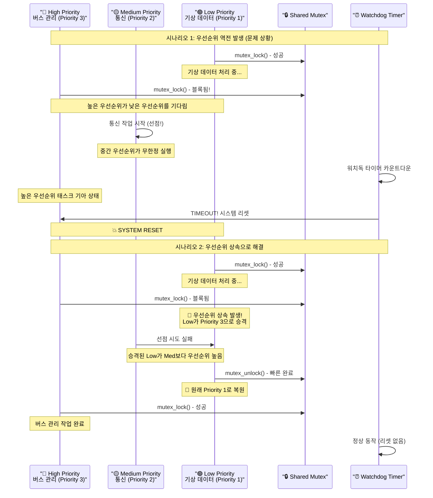
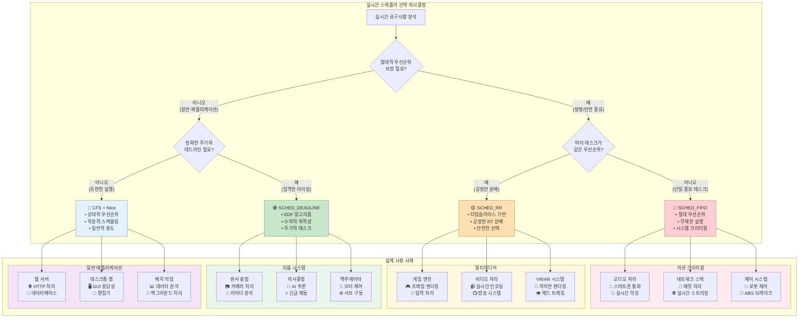
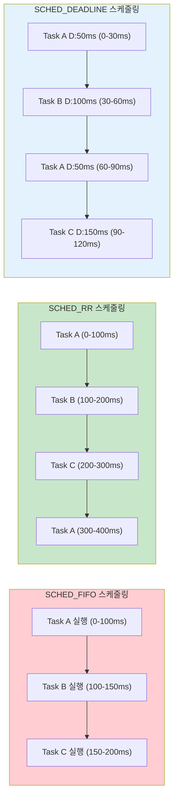
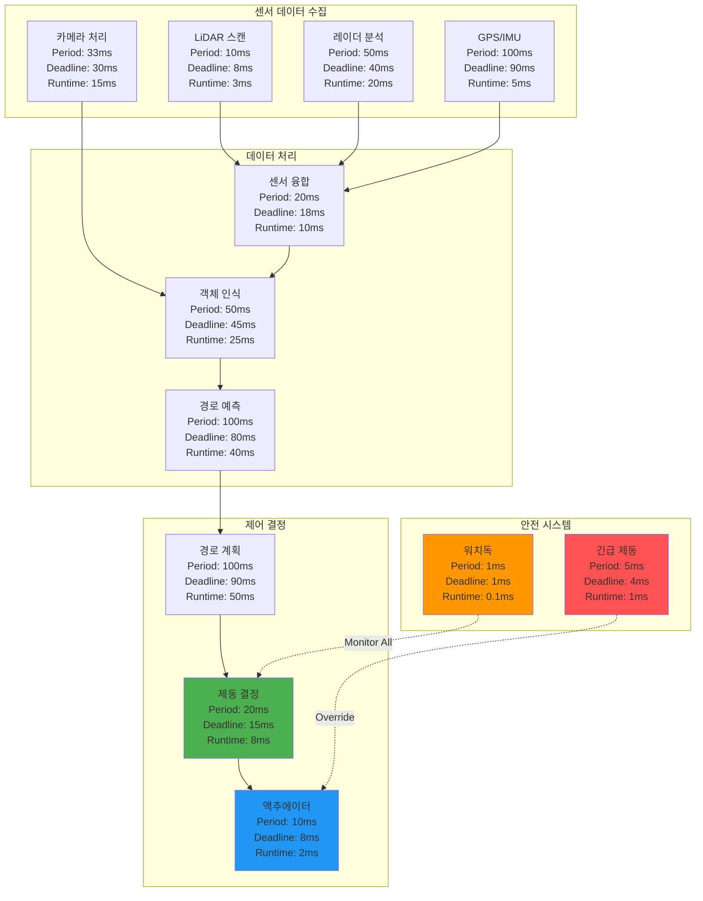
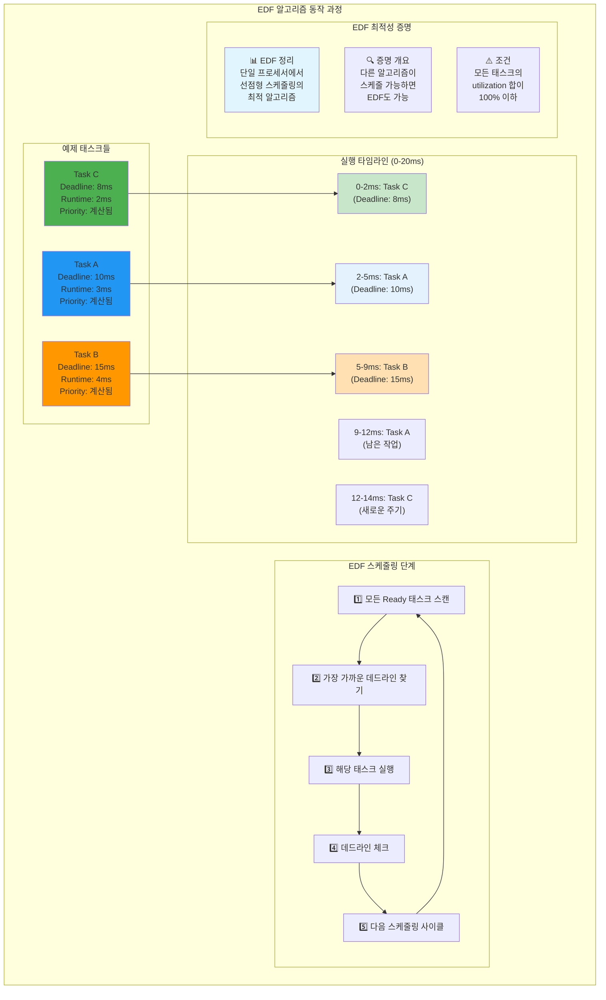
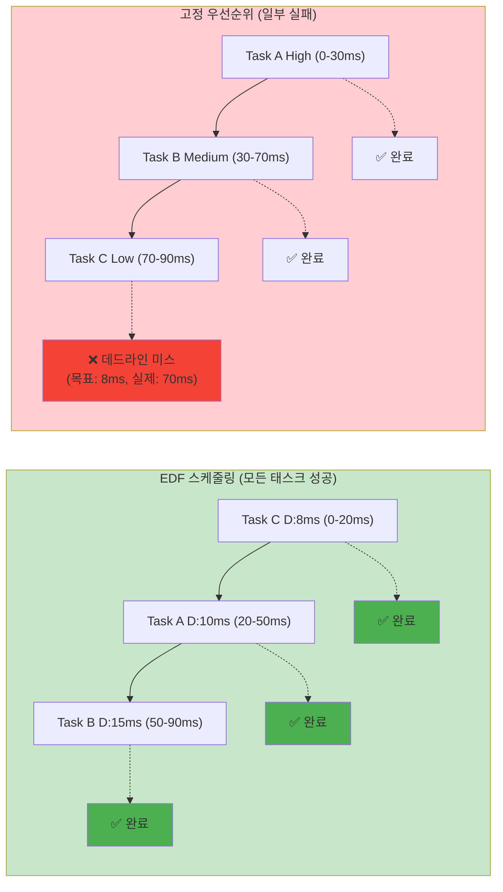
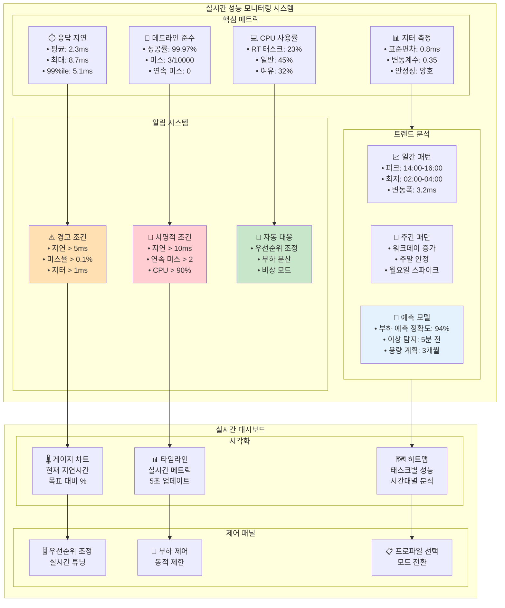
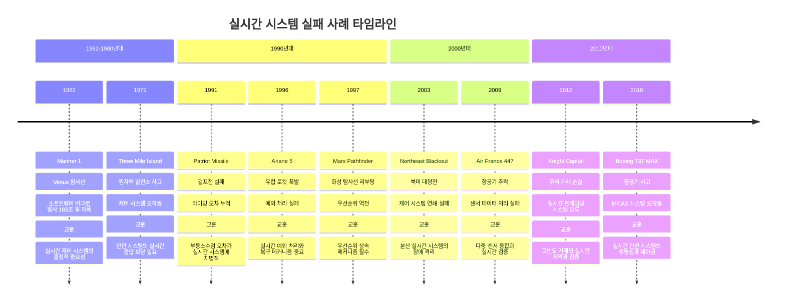
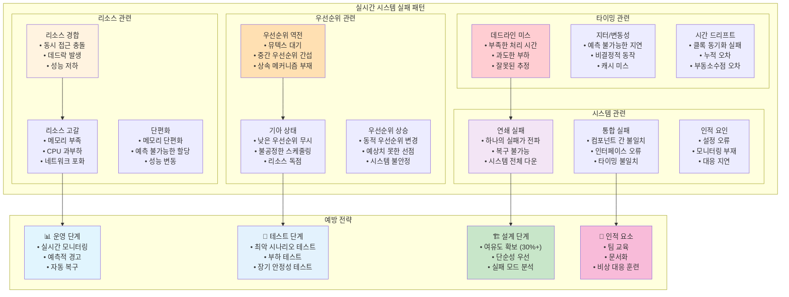

---
tags:
  - EDF
  - Priority Inversion
  - SCHED_DEADLINE
  - SCHED_FIFO
  - SCHED_RR
  - balanced
  - intermediate
  - medium-read
  - 시스템프로그래밍
difficulty: INTERMEDIATE
learning_time: "4-6시간"
main_topic: "시스템 프로그래밍"
priority_score: 4
---

# 1.4.3: 실시간 스케줄링

## 🚨 화성 탐사선의 교훈

1997년, NASA의 Mars Pathfinder가 화성에서 계속 재부팅되는 문제가 발생했습니다.

원인? **우선순위 역전(Priority Inversion)**

- 낮은 우선순위: 기상 데이터 수집
- 중간 우선순위: 통신
- 높은 우선순위: 버스 관리

낮은 우선순위 태스크가 뮤텍스를 잡고 있는 동안, 높은 우선순위 태스크가 대기하다가 워치독 타이머가 만료되어 시스템이 리셋된 것입니다.

해결책? VxWorks의 우선순위 상속을 활성화! 지구에서 화성으로 패치를 전송했죠. 🚀

### 우선순위 역전 문제: Mars Pathfinder 사례 분석

우선순위 역전이 어떻게 발생하고 해결되는지 Mars Pathfinder 실제 사례로 시각화해보겠습니다:



**Mars Pathfinder 해결 과정**:

1. **문제 발견**: 화성에서 주기적 리부팅 현상
2. **원인 분석**: 우선순위 역전으로 인한 고우선순위 태스크 기아
3. **해결책**: 지구에서 원격으로 VxWorks 우선순위 상속 활성화
4. **결과**: 시스템 안정화, 미션 성공 계속

**교훈**: 실시간 시스템에서는 우선순위 상속이나 우선순위 실링과 같은 메커니즘이 필수입니다!

## 3.1 실시간 정책: FIFO vs RR

### 실시간 스케줄러 선택 가이드: 워크로드별 최적 전략

실시간 스케줄링 정책들의 특성과 사용 시나리오를 체계적으로 비교해보겠습니다:



**실시간 스케줄러 특성 요약**:

| 스케줄러 | 보장 수준 | 공정성 | 예측성 | 위험도 | 주요 용도 |
|---------|-----------|--------|--------|--------|-----------|
| **SCHED_FIFO** | 절대적 | 없음 | 최고 | 높음 | 오디오, 제어 |
| **SCHED_RR** | 높음 | 있음 | 높음 | 중간 | 멀티미디어 |
| **SCHED_DEADLINE** | 수학적 | EDF | 최고 | 낮음 | 자율주행, IoT |
| **CFS + Nice** | 상대적 | 높음 | 중간 | 낮음 | 일반 애플리케이션 |

**언제 뭘 쓸까?**

제가 오디오/비디오 시스템을 만들면서 배운 것:

```c
// SCHED_FIFO: 오디오 처리 (절대 중단되면 안 됨)
void* audio_thread(void* arg) {
    struct sched_param param = {.sched_priority = 90};
    pthread_setschedparam(pthread_self(), SCHED_FIFO, &param);
    
    while (1) {
        process_audio_buffer();  // 48kHz, 끊기면 안 됨!
        sched_yield();  // 자발적 양보 필수!
    }
}

// SCHED_RR: 여러 비디오 스트림 (공평하게)
void* video_thread(void* arg) {
    struct sched_param param = {.sched_priority = 80};
    pthread_setschedparam(pthread_self(), SCHED_RR, &param);
    
    while (1) {
        process_video_frame();  // 100ms마다 자동 양보
    }
}
```

### SCHED_FIFO vs SCHED_RR vs SCHED_DEADLINE 동작 비교

세 가지 실시간 스케줄링 정책이 실제로 어떻게 다르게 동작하는지 시각화해보겠습니다:



**핵심 차이점**:

1. **SCHED_FIFO**: 먼저 시작한 태스크가 자발적으로 양보하거나 블록될 때까지 계속 실행
2. **SCHED_RR**: 정해진 타임슬라이스(기본 100ms)마다 강제로 다음 태스크로 전환
3. **SCHED_DEADLINE**: EDF 알고리즘으로 데드라인이 가까운 태스크부터 우선 실행

### 실시간 스케줄링 정책 완전 정리

```c
// 실시간 스케줄링 정책
#define SCHED_NORMAL    0  // CFS (일반)
#define SCHED_FIFO      1  // 실시간 FIFO
#define SCHED_RR        2  // 실시간 Round Robin
#define SCHED_BATCH     3  // 배치 처리
#define SCHED_IDLE      5  // 매우 낮은 우선순위
#define SCHED_DEADLINE  6  // 데드라인 스케줄링

// 실시간 우선순위 설정
int set_realtime_priority(pid_t pid, int policy, int priority) {
    struct sched_param param;
    param.sched_priority = priority;
    
    return sched_setscheduler(pid, policy, &param);
}

// 실시간 FIFO 스케줄링 - 절대 우선순위 기반 무제한 실행
// 실제 사용 예: 오디오 드라이버, 네트워크 인터럽트 처리, 로봇 제어
void* realtime_fifo_thread(void *arg) {
    struct sched_param param;
    param.sched_priority = 50;  // RT 우선순위 (1-99, 높을수록 우선)
    
    // ⭐ 1단계: 실시간 FIFO 정책 설정
    // SCHED_FIFO: 선점형이지만 같은 우선순위 내에서는 비선점
    // 위험: 무한루프 시 시스템 완전 중단 가능!
    pthread_setschedparam(pthread_self(), SCHED_FIFO, &param);
    
    printf("RT FIFO Thread (priority %d) started\n", param.sched_priority);
    
    // ⭐ 2단계: 실시간 작업 루프 - 매우 조심스럽게!
    while (!stop_flag) {
        // ⭐ 크리티컬한 실시간 작업 수행
        // 예: 오디오 버퍼 처리, CAN 버스 메시지 처리
        critical_realtime_work();
        
        // ⭐ 중요: 자발적 양보 없으면 무한 실행!
        // 같은 우선순위의 다른 FIFO 태스크나 낮은 우선순위는 절대 실행 못함
        // 주의: sched_yield() 생략 시 시스템 hang 위험
        
        // 짧은 작업 후 즉시 체크
        if (work_completed_immediately()) {
            sched_yield();  // 안전한 양보
        }
    }
    
    printf("RT FIFO Thread completed\n");
    return NULL;
}

// 실시간 Round Robin 스케줄링 - 공정한 타임슬라이스 기반 실행
// 실제 사용 예: 멀티미디어 스트리밍, 게임 엔진, 실시간 통신
void* realtime_rr_thread(void *arg) {
    struct sched_param param;
    param.sched_priority = 50;
    
    // ⭐ 1단계: 실시간 Round Robin 설정
    // SCHED_RR: 같은 우선순위 태스크들이 타임슬라이스를 공평하게 나눔
    // 기본 타임슬라이스: 100ms (sched_rr_timeslice_ms 커널 파라미터로 조정 가능)
    pthread_setschedparam(pthread_self(), SCHED_RR, &param);
    
    // 현재 RR 타임슬라이스 확인
    struct timespec quantum;
    sched_rr_get_interval(0, &quantum);
    printf("RT RR Thread (priority %d, quantum %ld.%09ld s) started\n", 
           param.sched_priority, quantum.tv_sec, quantum.tv_nsec);
    
    // ⭐ 2단계: 타임슬라이스 기반 작업 수행
    while (!stop_flag) {
        // ⭐ 작업 청크 처리: 타임슬라이스 내에서 완료 가능한 단위
        // RR의 장점: 자동으로 양보되므로 시스템 hang 위험 낮음
        critical_work_chunk();
        
        // 타임슬라이스 끝나면 커널이 자동으로 같은 우선순위의 다른 RR 태스크에게 양보
        // FIFO와 달리 강제 양보되므로 더 안전하고 공정함
        
        // 선택적 체크: 타임슬라이스 남아있어도 작업 완료 시 양보
        if (chunk_completed_early()) {
            sched_yield();  // 조기 양보로 응답성 향상
        }
    }
    
    printf("RT RR Thread completed\n");
    return NULL;
}

// 타임슬라이스 확인
int get_rr_interval(pid_t pid) {
    struct timespec ts;
    sched_rr_get_interval(pid, &ts);
    
    printf("RR interval: %ld.%09ld seconds\n", 
           ts.tv_sec, ts.tv_nsec);
    
    return ts.tv_nsec / 1000000;  // ms로 변환
}
```text

## 3.2 데드라인 스케줄링: 자율주행차의 필수품

### 자율주행 시스템의 실시간 요구사항

Tesla나 Waymo 같은 자율주행차는 `SCHED_DEADLINE`을 사용합니다.

왜? **"100ms 안에 브레이크 결정을 못하면 사고"**

자율주행 시스템의 복잡한 실시간 스케줄링 요구사항을 시각화해보겠습니다:



**EDF 스케줄링 시뮬레이션**: 자율주행 시나리오에서 어떤 태스크가 언제 실행되는지 보여줍니다:

```mermaid
gantt
    title 자율주행 시스템 EDF 스케줄링 (20ms 타임윈도우)
    dateFormat X
    axisFormat %L
    
    section Critical (≤5ms)
    Emergency Check    :active, emerg1, 0, 1
    Watchdog          :active, watch1, 1, 2
    Emergency Check    :active, emerg2, 5, 6
    Actuator Control   :active, act1, 6, 8
    LiDAR Scan        :active, lidar1, 8, 11
    Emergency Check    :active, emerg3, 10, 11
    Actuator Control   :active, act2, 16, 18
    
    section Medium (≤15ms)
    Brake Decision     :active, brake1, 2, 5
    Sensor Fusion      :active, fusion1, 11, 16
    
    section Low (≤30ms+)
    Camera Process     :active, cam1, 18, 20
    
    section Missed
    Object Detection   :crit, miss1, 20, 20
```



**데드라인 보장의 중요성**:

- **긴급 제동**: 4ms 내 결정 - 생명과 직결
- **액추에이터**: 8ms 내 실행 - 물리적 반응 시간
- **센서 융합**: 18ms 내 완료 - 정확한 환경 인식
- **경로 계획**: 90ms 내 완료 - 승차감과 안전성

```c
// 자율주행 시스템 예제
void* collision_detection(void* arg) {
    // 매 100ms마다 30ms 실행 보장
    set_deadline_scheduling(0,
        30000000,   // 30ms 실행 필요
        50000000,   // 50ms 데드라인
        100000000); // 100ms 주기
    
    while (driving) {
        scan_lidar();
        detect_obstacles();
        if (collision_imminent()) {
            emergency_brake();  // 생명이 달렸다!
        }
        sched_yield();  // 다음 주기까지 대기
    }
}
```

**실제 측정 결과**

```text
CFS: 평균 지연 5ms, 최악 200ms 😱
SCHED_DEADLINE: 평균 지연 1ms, 최악 50ms ✅
```

### SCHED_DEADLINE 구현 세부사항

```c
// SCHED_DEADLINE 파라미터
struct sched_attr {
    u32 size;
    u32 sched_policy;
    u64 sched_flags;
    
    // SCHED_NORMAL, SCHED_BATCH
    s32 sched_nice;
    
    // SCHED_FIFO, SCHED_RR
    u32 sched_priority;
    
    // SCHED_DEADLINE
    u64 sched_runtime;   // 실행 시간
    u64 sched_deadline;  // 데드라인
    u64 sched_period;    // 주기
};

// 데드라인 스케줄링 설정
int set_deadline_scheduling(pid_t pid,
                           u64 runtime_ns,
                           u64 deadline_ns,
                           u64 period_ns) {
    struct sched_attr attr = {
        .size = sizeof(attr),
        .sched_policy = SCHED_DEADLINE,
        .sched_runtime = runtime_ns,
        .sched_deadline = deadline_ns,
        .sched_period = period_ns,
    };
    
    return syscall(SYS_sched_setattr, pid, &attr, 0);
}

// SCHED_DEADLINE 주기적 실시간 태스크 - 최첨단 실시간 보장
// 실제 사용 예: 자율주행 센서 처리, 산업용 로봇 제어, 5G 기지국
void* periodic_deadline_task(void *arg) {
    printf("Deadline Task Starting: Period-based Real-time Execution\n");
    
    // ⭐ 1단계: SCHED_DEADLINE 파라미터 설정
    // 핵심 관계: Runtime ≤ Deadline ≤ Period
    // 실제 의미: 10ms마다 2ms 실행, 5ms 안에 완료 보장
    set_deadline_scheduling(0,
                           2000000,   // 2ms runtime (보장된 CPU 시간)
                           5000000,   // 5ms deadline (최대 허용 지연)
                           10000000); // 10ms period (작업 반복 주기)
    
    printf("Deadline parameters set: 2ms/5ms/10ms (runtime/deadline/period)\n");
    
    // ⭐ 2단계: EDF(Earliest Deadline First) 기반 주기 실행
    int cycle_count = 0;
    struct timespec start_time, end_time;
    
    while (!stop_flag) {
        clock_gettime(CLOCK_MONOTONIC, &start_time);
        
        // ⭐ 3단계: 보장된 실시간 작업 수행
        // 커널이 EDF 알고리즘으로 데드라인 보장
        // 다른 모든 태스크(CFS, RT 포함)보다 우선 실행
        do_periodic_work();
        
        clock_gettime(CLOCK_MONOTONIC, &end_time);
        
        // 실행 시간 측정 및 로깅
        long execution_us = (end_time.tv_sec - start_time.tv_sec) * 1000000 +
                           (end_time.tv_nsec - start_time.tv_nsec) / 1000;
        
        printf("Cycle %d completed in %ld μs (budget: 2000 μs)\n", 
               ++cycle_count, execution_us);
        
        // ⭐ 4단계: 주기적 양보 및 다음 주기 대기
        // sched_yield(): 현재 인스턴스 완료, 다음 주기까지 대기
        // 커널이 정확히 10ms 후에 다음 인스턴스 활성화
        sched_yield();
        
        // 데드라인 초과 시 경고
        if (execution_us > 2000) {
            fprintf(stderr, "WARNING: Runtime budget exceeded! (%ld > 2000 μs)\n", 
                   execution_us);
        }
    }
    
    printf("Deadline Task completed %d cycles\n", cycle_count);
    return NULL;
}
```

### EDF(Earliest Deadline First) 알고리즘 시각화

EDF 알고리즘이 어떻게 동작하여 최적의 스케줄링을 달성하는지 단계별로 보여드리겠습니다:



**EDF vs 고정 우선순위 비교**:

다음 시나리오에서 EDF와 고정 우선순위 스케줄링의 차이를 보겠습니다:



**결과 분석**:

- **EDF**: 모든 태스크가 데드라인 내 완료 ✅
- **고정 우선순위**: Task C가 데드라인 미스 (8ms 목표, 70ms에 시작) ❌

### EDF(Earliest Deadline First) 알고리즘

```c
// EDF (Earliest Deadline First) 시뮬레이션
typedef struct {
    int task_id;
    u64 deadline;
    u64 runtime;
    u64 remaining;
} deadline_task_t;

// EDF(Earliest Deadline First) 스케줄러 시뮬레이션
// 실제 Linux SCHED_DEADLINE의 핵심 알고리즘 구현
void edf_scheduler(deadline_task_t *tasks, int n) {
    printf("EDF Scheduler starting with %d tasks\n", n);
    u64 current_time = 0;
    
    // ⭐ EDF 메인 루프: 모든 태스크가 완료될 때까지 반복
    while (has_ready_tasks(tasks, n)) {
        // ⭐ 1단계: EDF 알고리즘의 핵심 - 가장 가까운 데드라인 찾기
        // 이것이 바로 "Earliest Deadline First"의 정확한 구현
        deadline_task_t *next = NULL;
        u64 earliest = UINT64_MAX;
        
        // 모든 준비된 태스크를 스캔하여 최소 데드라인 탐색
        for (int i = 0; i < n; i++) {
            // 아직 실행할 작업이 남아있고, 데드라인이 더 가까운 태스크 선택
            if (tasks[i].remaining > 0 && 
                tasks[i].deadline < earliest) {
                earliest = tasks[i].deadline;
                next = &tasks[i];
            }
        }
        
        // ⭐ 2단계: 선택된 태스크 실행 및 진행 상황 업데이트
        if (next) {
            printf("Time %llu: Executing Task %d (deadline: %llu, remaining: %llu)\n",
                   current_time, next->task_id, next->deadline, next->remaining);
            
            // 태스크 실행 (1 타임 유닛)
            execute_task(next);
            next->remaining--;
            
            // 데드라인 검사: 실시간 시스템의 필수 요소
            if (current_time >= next->deadline && next->remaining > 0) {
                printf("ERROR: Task %d missed deadline %llu at time %llu!\n",
                       next->task_id, next->deadline, current_time);
                // 실제 시스템에서는 여기서 에러 처리나 복구 작업 수행
            }
            
            // 태스크 완료 체크
            if (next->remaining == 0) {
                printf("Task %d completed successfully before deadline %llu\n",
                       next->task_id, next->deadline);
            }
        }
        
        // ⭐ 3단계: 시간 진행 및 다음 스케줄링 포인트로 이동
        current_time++;
        
        // 주기적 상태 출력 (디버깅 및 모니터링)
        if (current_time % 10 == 0) {
            printf("Time %llu: System status check\n", current_time);
            print_task_status(tasks, n);
        }
    }
    
    printf("EDF Scheduler completed at time %llu\n", current_time);
}

// EDF 유틸리티 함수들
bool has_ready_tasks(deadline_task_t *tasks, int n) {
    for (int i = 0; i < n; i++) {
        if (tasks[i].remaining > 0) {
            return true;
        }
    }
    return false;
}

void execute_task(deadline_task_t *task) {
    // 실제 시스템에서는 여기서 태스크의 작업 수행
    // 시뮬레이션에서는 단순히 시간 진행
    usleep(1000);  // 1ms 작업 시뮬레이션
}

void print_task_status(deadline_task_t *tasks, int n) {
    printf("Current task status:\n");
    for (int i = 0; i < n; i++) {
        printf("  Task %d: remaining %llu, deadline %llu\n",
               tasks[i].task_id, tasks[i].remaining, tasks[i].deadline);
    }
}
```

### 실시간 성능 모니터링 대시보드

실시간 시스템의 성능을 지속적으로 모니터링하는 방법을 시각화해보겠습니다:



**모니터링 전략**:

1. **실시간 메트릭**: 지연, 데드라인 미스, 지터 추적
2. **예측적 분석**: 패턴 학습으로 문제 사전 감지
3. **자동 대응**: 임계치 초과 시 즉시 조치
4. **히스토리 분석**: 장기 트렌드로 시스템 최적화

## 실시간 시스템 설계 가이드

### 1. 스케줄링 정책 선택 기준

```c
typedef enum {
    RT_AUDIO_PROCESSING,    // SCHED_FIFO, 우선순위 90-99
    RT_VIDEO_STREAMING,     // SCHED_RR, 우선순위 70-89
    RT_NETWORK_STACK,       // SCHED_FIFO, 우선순위 50-69
    RT_SENSOR_READING,      // SCHED_DEADLINE
    RT_CONTROL_LOOP,        // SCHED_DEADLINE
    NORMAL_APPLICATION      // SCHED_NORMAL
} rt_workload_type_t;

// 워크로드별 권장 설정
typedef struct {
    rt_workload_type_t type;
    int policy;
    int priority;
    const char* description;
    const char* caution;
} rt_config_t;

rt_config_t rt_configs[] = {
    {
        RT_AUDIO_PROCESSING, SCHED_FIFO, 90,
        "오디오 버퍼 언더런 방지, 절대 중단되면 안됨",
        "무한루프 시 시스템 완전 멈춤 위험"
    },
    {
        RT_VIDEO_STREAMING, SCHED_RR, 80,
        "여러 스트림 간 공정한 처리",
        "타임슬라이스 내 완료 가능한 작업 단위 필요"
    },
    {
        RT_NETWORK_STACK, SCHED_FIFO, 60,
        "패킷 드롭 방지, 네트워크 지연 최소화",
        "ISR과 우선순위 충돌 주의"
    },
    {
        RT_SENSOR_READING, SCHED_DEADLINE, 0,
        "주기적 센서 읽기, 정확한 타이밍",
        "Runtime ≤ Deadline ≤ Period 관계 준수"
    },
    {
        RT_CONTROL_LOOP, SCHED_DEADLINE, 0,
        "제어 루프, 데드라인 보장 필수",
        "missed deadline = 시스템 불안정"
    }
};
```

### 2. 실시간 시스템 모니터링

```c
// 실시간 성능 모니터링
typedef struct {
    u64 total_executions;
    u64 missed_deadlines;
    u64 max_execution_time;
    u64 min_execution_time;
    u64 avg_execution_time;
    u64 total_execution_time;
} rt_stats_t;

void monitor_rt_performance(rt_stats_t *stats) {
    struct timespec start, end;
    
    while (running) {
        clock_gettime(CLOCK_MONOTONIC, &start);
        
        // 실시간 작업 수행
        do_realtime_work();
        
        clock_gettime(CLOCK_MONOTONIC, &end);
        
        // 성능 통계 업데이트
        u64 execution_time = timespec_diff_ns(&end, &start);
        
        stats->total_executions++;
        stats->total_execution_time += execution_time;
        
        if (execution_time > stats->max_execution_time) {
            stats->max_execution_time = execution_time;
        }
        
        if (stats->min_execution_time == 0 || 
            execution_time < stats->min_execution_time) {
            stats->min_execution_time = execution_time;
        }
        
        stats->avg_execution_time = 
            stats->total_execution_time / stats->total_executions;
        
        // 데드라인 미스 체크 (예: 10ms 데드라인)
        if (execution_time > 10000000) {  // 10ms in ns
            stats->missed_deadlines++;
            fprintf(stderr, "DEADLINE MISS: %llu ns\n", execution_time);
        }
        
        sched_yield();
    }
}

// 통계 출력
void print_rt_stats(rt_stats_t *stats) {
    printf("=== Real-time Performance Statistics ===\n");
    printf("Total executions: %llu\n", stats->total_executions);
    printf("Missed deadlines: %llu (%.2f%%)\n", 
           stats->missed_deadlines,
           (double)stats->missed_deadlines / stats->total_executions * 100);
    printf("Execution time - Min: %llu ns, Max: %llu ns, Avg: %llu ns\n",
           stats->min_execution_time,
           stats->max_execution_time,
           stats->avg_execution_time);
}
```

### 실시간 시스템 실패 사례와 교훈

실제 산업에서 발생한 실시간 시스템 실패 사례들을 통해 중요한 교훈을 얻어보겠습니다:



**공통 실패 패턴 분석**:



**핵심 교훈**:

1. **여유도 확보**: 처리 시간의 30% 이상 여유 필수
2. **단순성**: 복잡한 시스템일수록 실패 확률 증가
3. **모니터링**: 실시간 감시와 예측적 대응
4. **검증**: 최악의 시나리오까지 철저한 테스트

## 핵심 요점

### 1. 실시간 != 빠른 실행

실시간은 **예측 가능한 응답 시간**을 의미한다. 평균은 느려도 최악의 경우가 보장되어야 한다.

### 2. SCHED_FIFO는 강력하지만 위험하다

무한 루프 시 시스템 전체가 멈출 수 있으므로 반드시 `sched_yield()` 호출이 필요하다.

### 3. SCHED_DEADLINE이 가장 정교하다

EDF 알고리즘으로 수학적으로 최적의 스케줄링을 제공하지만, 파라미터 설정이 까다롭다.

### 4. 실시간 시스템은 모니터링이 핵심이다

데드라인 미스를 실시간으로 감지하고 통계를 수집하여 시스템 안정성을 확보해야 한다.

### 5. 실패 사례에서 배우는 설계 원칙

실제 산업 사고를 통해 배운 핵심 설계 원칙들을 적용해야 한다.

---

**이전**: [1.4.2 CFS 구현 세부사항](./01-04-02-cfs-implementation.md)  
**다음**: [1.4.4 CPU 친화도와 NUMA](01-04-04-cpu-affinity.md)에서 멀티코어 최적화를 학습합니다.

## 📚 관련 문서

### 📖 현재 문서 정보

- **난이도**: INTERMEDIATE
- **주제**: 시스템 프로그래밍
- **예상 시간**: 4-6시간

### 🎯 학습 경로

- [📚 INTERMEDIATE 레벨 전체 보기](../learning-paths/intermediate/)
- [🏠 메인 학습 경로](../learning-paths/)
- [📋 전체 가이드 목록](../README.md)

### 📂 같은 챕터 (chapter-01-process-thread)

- [1.2.1: 프로세스 생성과 종료 개요](./01-02-01-process-creation.md)
- [1.2.2: fork() 시스템 콜과 프로세스 복제 메커니즘](./01-02-02-process-creation-fork.md)
- [1.2.3: exec() 패밀리와 프로그램 교체 메커니즘](./01-02-03-program-replacement-exec.md)
- [1.2.4: 프로세스 종료와 좀비 처리](./01-02-04-process-termination-zombies.md)
- [1.5.1: 프로세스 관리와 모니터링](./01-05-01-process-management-monitoring.md)

### 🏷️ 관련 키워드

`SCHED_FIFO`, `SCHED_RR`, `SCHED_DEADLINE`, `EDF`, `Priority Inversion`

### ⏭️ 다음 단계 가이드

- 실무 적용을 염두에 두고 프로젝트에 적용해보세요
- 관련 도구들을 직접 사용해보는 것이 중요합니다
