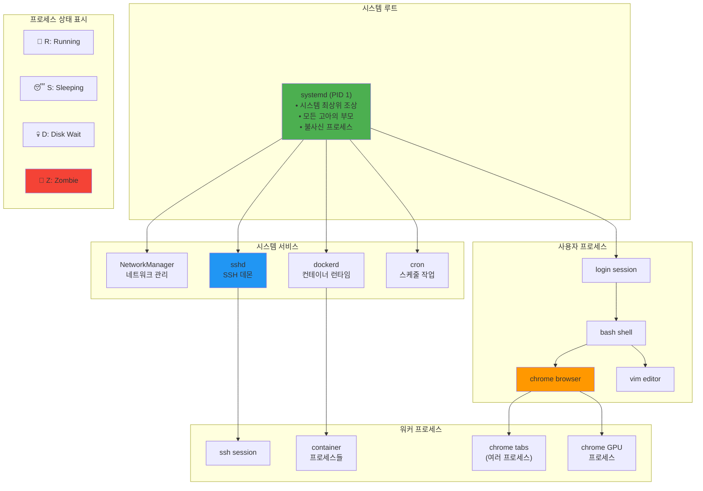
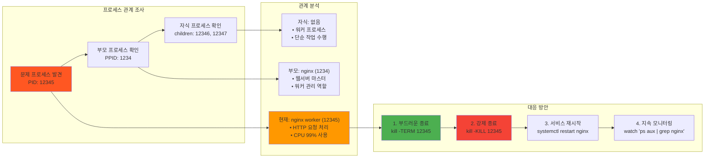
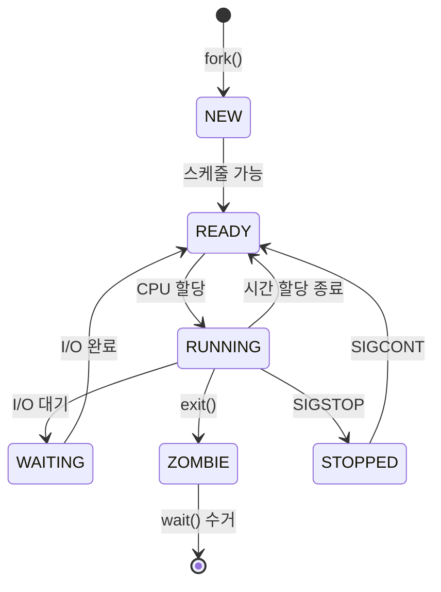
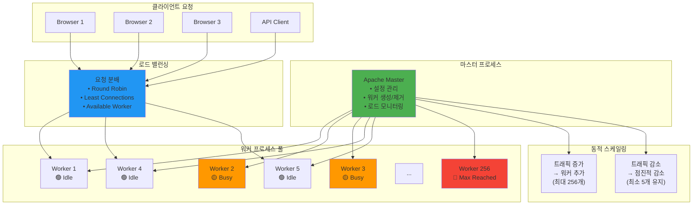
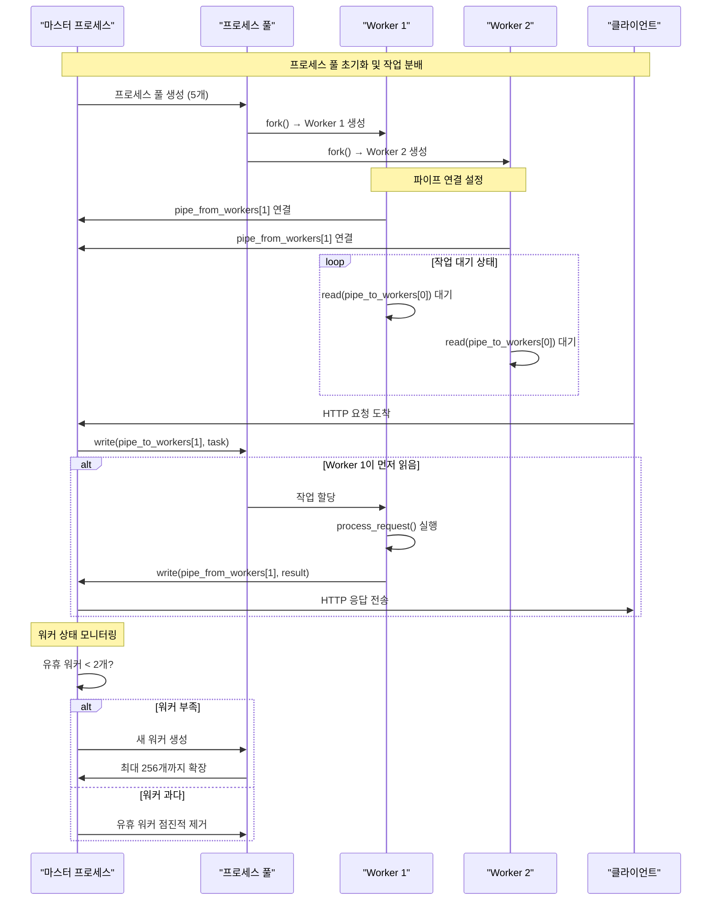
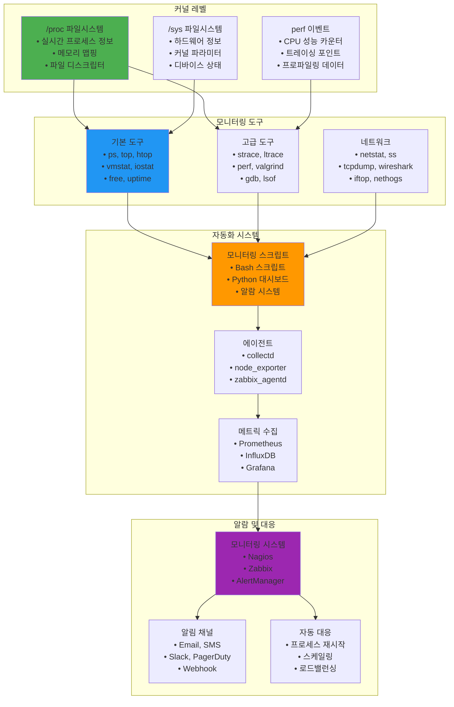
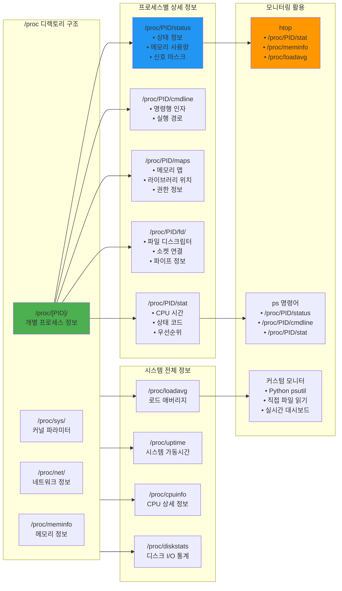
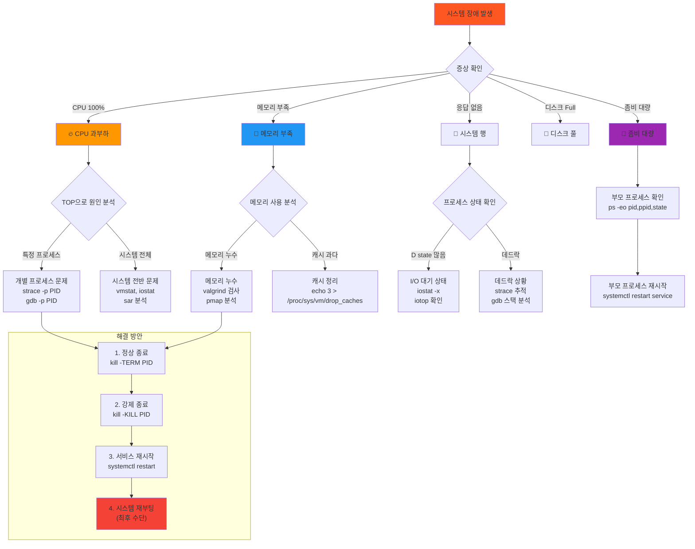
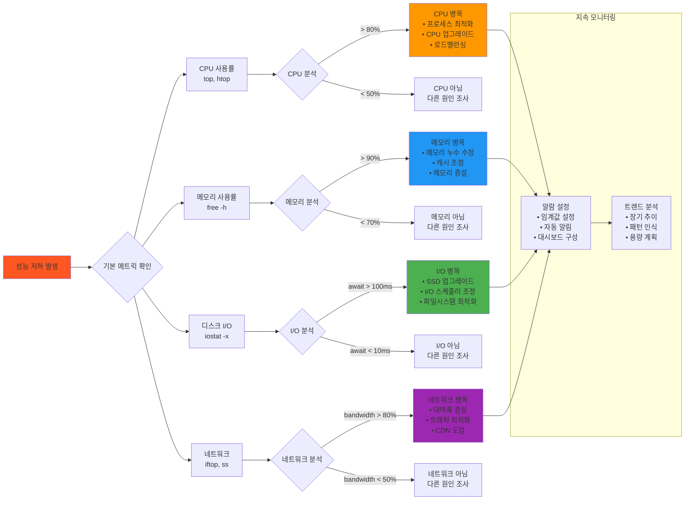

---
tags:
  - hands-on
  - intermediate
  - medium-read
  - performance_optimization
  - process_management
  - process_pool
  - system_monitoring
  - troubleshooting
  - 시스템프로그래밍
difficulty: INTERMEDIATE
learning_time: "4-6시간"
main_topic: "시스템 프로그래밍"
priority_score: 4
---

# 1.5.1: 프로세스 관리 모니터링

## 리눅스 가계도: 프로세스 트리와 관계

### pstree로 본 충격적 진실

처음 `pstree`를 실행했을 때의 충격을 잊을 수 없습니다:

```bash
$ pstree
systemd─┬─NetworkManager───2*[{NetworkManager}]
       ├─sshd───sshd───bash───pstree
       ├─dockerd─┬─containerd───12*[{containerd}]
       │         └─10*[{dockerd}]
       └─chrome─┬─chrome───chrome───5*[{chrome}]
                └─nacl_helper
```

**모든 프로세스가 연결되어 있다!** 리눅스는 거대한 가족입니다.

### 프로세스 계층 구조: 디지털 족보

리눅스 시스템의 실제 프로세스 트리 구조를 시각화해보겠습니다:



### 프로세스 관계 분석: 부모-자식 추적



### 프로세스 트리 구현: 계층 구조 시각화

```c
// 프로세스 트리 출력
void print_process_tree(pid_t pid, int level) {
    char path[256];
    sprintf(path, "/proc/%d/task/%d/children", pid, pid);
    
    FILE *f = fopen(path, "r");
    if (!f) return;
    
    // 들여쓰기
    for (int i = 0; i < level; i++) {
        printf("  ");
    }
    
    // 프로세스 정보
    char name[256];
    get_process_name(pid, name);
    printf("├─ %d %s\n", pid, name);
    
    // 자식 프로세스들
    pid_t child;
    while (fscanf(f, "%d", &child) == 1) {
        print_process_tree(child, level + 1);
    }
    
    fclose(f);
}

// 프로세스 이름 가져오기
void get_process_name(pid_t pid, char *name) {
    char path[256];
    sprintf(path, "/proc/%d/comm", pid);
    
    FILE *f = fopen(path, "r");
    if (f) {
        fscanf(f, "%s", name);
        fclose(f);
    } else {
        strcpy(name, "unknown");
    }
}

// init 프로세스 특징: 신이 되는 방법
void about_init_process() {
    // PID 1은 특별하다 - 리눅스의 아담
    if (getpid() == 1) {
        printf("I am init!\n");
        
        // init은 불사신! SIGKILL도 못 죽임
        signal(SIGTERM, SIG_IGN);
        signal(SIGKILL, SIG_IGN);  // 커널: "안 돼, 널 죽으면 안 돼!"
        
        // 모든 고아의 부모가 됨
        while (1) {
            // 좀비 자식들 수거
            while (waitpid(-1, NULL, WNOHANG) > 0);
            
            // init 작업 수행
            perform_init_duties();
            
            sleep(1);
        }
    }
}
```

## 프로세스 상태 전이: 삶의 단계들

### CPU를 얻기 위한 전쟁

한 번은 서버의 로드 애버리지가 200을 넘은 적이 있습니다. 무슨 일이 일어난 걸까요?

```bash
$ uptime
load average: 212.35, 198.67, 187.43  # CPU는 8개인데?!

$ ps aux | grep " D "
... (수십 개의 D 상태 프로세스)
```

**D 상태(Uninterruptible Sleep)**의 프로세스들이 I/O를 기다리며 쌓여있었습니다. NFS 서버가 죽어서 모든 프로세스가 대기 중이었죠.

### 프로세스 상태: 7개의 인생



### 상태 확인과 변경: 프로세스 진단하기

```c
// 프로세스 상태 확인: 건강 검진
void check_process_state(pid_t pid) {
    printf("\n=== 프로세스 %d 상태 진단 ===\n", pid);
    char path[256];
    sprintf(path, "/proc/%d/stat", pid);
    
    FILE *f = fopen(path, "r");
    if (!f) return;
    
    char state;
    fscanf(f, "%*d %*s %c", &state);
    fclose(f);
    
    switch (state) {
        case 'R': printf("🏃 Running (CPU 사용 중!)\n"); break;
        case 'S': printf("😴 Sleeping (깨울 수 있음)\n"); break;
        case 'D': printf("💀 Disk sleep (깨울 수 없음! 위험!)\n"); break;
        case 'Z': printf("🧟 Zombie (죽었는데 안 죽음)\n"); break;
        case 'T': printf("⏸️ Stopped (일시정지)\n"); break;
        case 't': printf("🔍 Tracing stop (디버깅 중)\n"); break;
        case 'X': printf("☠️ Dead (완전히 죽음)\n"); break;
    }
}

// 프로세스 일시 정지/재개
void control_process() {
    pid_t pid = fork();
    
    if (pid == 0) {
        // 자식: 카운터
        for (int i = 0; i < 100; i++) {
            printf("Count: %d\n", i);
            sleep(1);
        }
        exit(0);
    } else {
        // 부모: 제어
        sleep(3);
        
        printf("Stopping child...\n");
        kill(pid, SIGSTOP);
        
        sleep(3);
        
        printf("Resuming child...\n");
        kill(pid, SIGCONT);
        
        waitpid(pid, NULL, 0);
    }
}
```

## 실전: 프로세스 관리 (프로덕션 레시피)

### Apache의 비밀: Prefork MPM

Apache 웹서버의 prefork 모드를 분석하면서 배운 프로세스 풀의 정수:

```text
초기: 5개 프로세스 대기
트래픽 증가 → 프로세스 10개로 증가
트래픽 폭증 → 최대 256개까지
트래픽 감소 → 천천히 감소 (급격한 변화 방지)
```

### Apache Prefork 모델 시각화: 효율적인 프로세스 관리



### 프로세스 풀 통신 아키텍처: 파이프 기반 IPC



### 프로세스 풀 구현: 미리 만들어 놓고 재사용

```c
typedef struct {
    pid_t *workers;
    int num_workers;
    int pipe_to_workers[2];
    int pipe_from_workers[2];
} process_pool_t;

// 프로세스 풀 생성: Apache처럼 만들기
process_pool_t* create_process_pool(int num_workers) {
    printf("\n=== 프로세스 풀 생성 (워커: %d개) ===\n", num_workers);
    
    process_pool_t *pool = malloc(sizeof(process_pool_t));
    pool->num_workers = num_workers;
    pool->workers = malloc(num_workers * sizeof(pid_t));
    
    pipe(pool->pipe_to_workers);
    pipe(pool->pipe_from_workers);
    
    for (int i = 0; i < num_workers; i++) {
        pid_t pid = fork();
        
        if (pid == 0) {
            // 워커 프로세스
            close(pool->pipe_to_workers[1]);
            close(pool->pipe_from_workers[0]);
            
            worker_main(pool->pipe_to_workers[0],
                       pool->pipe_from_workers[1]);
            exit(0);
        } else {
            pool->workers[i] = pid;
        }
    }
    
    // 마스터용 파이프 설정
    close(pool->pipe_to_workers[0]);
    close(pool->pipe_from_workers[1]);
    
    return pool;
}

// 워커 프로세스 메인
void worker_main(int read_fd, int write_fd) {
    while (1) {
        task_t task;
        
        // 작업 대기
        if (read(read_fd, &task, sizeof(task)) != sizeof(task)) {
            break;
        }
        
        // 작업 수행
        result_t result = process_task(&task);
        
        // 결과 전송
        write(write_fd, &result, sizeof(result));
    }
}

// 작업 분배
void distribute_work(process_pool_t *pool, task_t *tasks, int num_tasks) {
    // 모든 작업 전송
    for (int i = 0; i < num_tasks; i++) {
        write(pool->pipe_to_workers[1], &tasks[i], sizeof(task_t));
    }
    
    // 결과 수집
    for (int i = 0; i < num_tasks; i++) {
        result_t result;
        read(pool->pipe_from_workers[0], &result, sizeof(result));
        process_result(&result);
    }
}
```

### 프로세스 모니터링: 나만의 htop 만들기

```c
// 프로세스 정보 수집
typedef struct {
    pid_t pid;
    char name[256];
    long memory_kb;
    double cpu_percent;
    char state;
} process_info_t;

process_info_t* get_process_info(pid_t pid) {
    process_info_t *info = malloc(sizeof(process_info_t));
    info->pid = pid;
    
    // 이름
    char path[256];
    sprintf(path, "/proc/%d/comm", pid);
    FILE *f = fopen(path, "r");
    if (f) {
        fscanf(f, "%s", info->name);
        fclose(f);
    }
    
    // 메모리
    sprintf(path, "/proc/%d/status", pid);
    f = fopen(path, "r");
    if (f) {
        char line[256];
        while (fgets(line, sizeof(line), f)) {
            if (strncmp(line, "VmRSS:", 6) == 0) {
                sscanf(line, "VmRSS: %ld kB", &info->memory_kb);
                break;
            }
        }
        fclose(f);
    }
    
    // CPU (간단 버전)
    sprintf(path, "/proc/%d/stat", pid);
    f = fopen(path, "r");
    if (f) {
        unsigned long utime, stime;
        fscanf(f, "%*d %*s %c %*d %*d %*d %*d %*d %*u "
               "%*u %*u %*u %*u %lu %lu",
               &info->state, &utime, &stime);
        
        // CPU 사용률 계산 (간소화)
        info->cpu_percent = (utime + stime) / (double)sysconf(_SC_CLK_TCK);
        fclose(f);
    }
    
    return info;
}

### 시스템 모니터링 아키텍처: 전체 생태계



### /proc 파일시스템 활용 맵: 프로세스 정보의 보물창고



```c
// 프로세스 모니터: 미니 htop
void monitor_processes() {
    printf("\n=== 실시간 프로세스 모니터 (Ctrl+C로 종료) ===\n");

    while (1) {
        system("clear");
        printf("🖥️  프로세스 모니터 - %s\n", get_current_time());
        printf("PID\tNAME\t\tMEM(KB)\tCPU%%\tSTATE\n");
        printf("----------------------------------------\n");
        
        DIR *proc_dir = opendir("/proc");
        struct dirent *entry;
        
        while ((entry = readdir(proc_dir)) != NULL) {
            // 숫자로 된 디렉토리만 (PID)
            if (!isdigit(entry->d_name[0])) continue;
            
            pid_t pid = atoi(entry->d_name);
            process_info_t *info = get_process_info(pid);
            
            printf("%d\t%-15s\t%ld\t%.1f\t%c\n",
                   info->pid, info->name, info->memory_kb,
                   info->cpu_percent, info->state);
            
            free(info);
        }
        
        closedir(proc_dir);
        sleep(1);
    }
}
```

## 실전 모니터링 도구들

### 기본 명령어들

```bash
# 프로세스 목록 보기
ps aux                    # 모든 프로세스
ps -ef                    # 다른 형식
ps -eo pid,ppid,cmd      # 커스텀 출력

# 프로세스 트리
pstree                   # 계층 구조
pstree -p               # PID 포함
pstree -u user          # 특정 사용자

# 동적 모니터링
top                     # 기본 모니터
htop                    # 향상된 모니터
watch "ps aux"          # 주기적 실행

# 리소스 사용률
vmstat 1                # 메모리/CPU 통계
iostat 1                # I/O 통계
sar -u 1 10            # 시스템 통계
```

### 고급 분석 도구

```bash
# 프로세스 추적
strace -p PID           # 시스템 콜 추적
ltrace -p PID           # 라이브러리 콜 추적
gdb -p PID              # 디버거 연결

# 성능 분석
perf record ./program   # 성능 데이터 수집
perf report            # 분석 결과
valgrind ./program     # 메모리 검사

# 네트워크 모니터링
netstat -tulpn         # 포트 사용 현황
ss -tulpn              # 향상된 버전
lsof -i                # 네트워크 연결
```

### proc 파일시스템 활용

```bash
# 프로세스 상세 정보
cat /proc/PID/status    # 기본 정보
cat /proc/PID/cmdline   # 명령어 라인
cat /proc/PID/environ   # 환경변수
cat /proc/PID/maps      # 메모리 맵
cat /proc/PID/fd/       # 파일 디스크립터

# 시스템 전체 정보
cat /proc/meminfo       # 메모리 정보
cat /proc/cpuinfo       # CPU 정보
cat /proc/loadavg       # 로드 애버리지
cat /proc/uptime        # 시스템 가동시간
```

## 성능 최적화 기법

### CPU 친화도 (CPU Affinity)

```c
// CPU 친화도 설정: 특정 CPU에 프로세스 바인딩
void set_cpu_affinity(int cpu_id) {
    cpu_set_t cpuset;
    CPU_ZERO(&cpuset);
    CPU_SET(cpu_id, &cpuset);
    
    if (sched_setaffinity(0, sizeof(cpuset), &cpuset) == -1) {
        perror("sched_setaffinity");
        return;
    }
    
    printf("프로세스 %d가 CPU %d에 바인딩되었습니다\n", getpid(), cpu_id);
}

// NUMA 인식 배치
void numa_aware_allocation() {
    // NUMA 노드 정보 확인
    int numa_nodes = numa_num_configured_nodes();
    printf("NUMA 노드 수: %d\n", numa_nodes);
    
    // 로컬 메모리 할당
    numa_set_localalloc();
    
    // 특정 노드에 바인딩
    // numa_bind(numa_parse_nodestring("0"));
}
```

### 프로세스 우선순위 조정

```c
// nice 값 조정
void adjust_priority() {
    // 현재 우선순위 확인
    int current_priority = getpriority(PRIO_PROCESS, 0);
    printf("현재 우선순위: %d\n", current_priority);
    
    // 낮은 우선순위로 설정 (백그라운드 작업)
    if (setpriority(PRIO_PROCESS, 0, 10) == -1) {
        perror("setpriority");
    } else {
        printf("우선순위를 10으로 설정\n");
    }
}

// 리얼타임 스케줄링
void set_realtime_priority() {
    struct sched_param param;
    param.sched_priority = 50;  // 1-99 범위
    
    if (sched_setscheduler(0, SCHED_FIFO, &param) == -1) {
        perror("sched_setscheduler");
    } else {
        printf("리얼타임 FIFO 스케줄링 설정\n");
    }
}
```

## 장애 대응 시나리오

### 시스템 장애 진단 플로우차트: 문제 해결의 체계적 접근



### 성능 병목 진단 트리: 단계별 성능 분석



### 시나리오 1: 프로세스 폭주

```bash
# 증상: CPU 사용률 100%
$ top
PID    USER     PR  NI    VIRT    RES    SHR S  %CPU %MEM
12345  apache   20   0  500000  50000   1000 R  99.9  5.0

# 원인 분석
$ strace -p 12345
# 무한 루프 또는 비효율적 코드 발견

# 대응
$ kill -STOP 12345  # 일시 정지
$ gdb -p 12345      # 디버거로 분석
$ kill -TERM 12345  # 정상 종료 요청
$ kill -KILL 12345  # 강제 종료
```

### 시나리오 2: 메모리 누수

```bash
# 증상: 메모리 사용률 지속 증가
$ free -h
              total        used        free      shared  buff/cache   available
Mem:            8.0G        7.8G        200M         50M        100M        150M

# 원인 분석
$ ps aux --sort=-%mem | head -10
$ pmap -x PID
$ valgrind --leak-check=full ./program

# 대응
$ echo 3 > /proc/sys/vm/drop_caches  # 버퍼 캠시 비우기
$ swapoff -a && swapon -a           # 스왈 리셋
```

### 시나리오 3: 좀비 대량 발생

```bash
# 증상: 좀비 프로세스 대량 발생
$ ps aux | grep defunct | wc -l
1500

# 원인 분석
$ ps -eo pid,ppid,state,comm | grep Z
$ pstree -p | grep defunct

# 대응
$ kill -CHLD PPID  # 부모 프로세스에 SIGCHLD 전솨
$ systemctl restart service  # 서비스 재시작
```

## 모니터링 스크립트

### 자동 알람 시스템

```bash
#!/bin/bash
# process_monitor.sh - 프로세스 모니터링 스크립트

CPU_THRESHOLD=80
MEM_THRESHOLD=80
ZOMBIE_THRESHOLD=100
LOGFILE="/var/log/process_monitor.log"

while true; do
    DATE=$(date '+%Y-%m-%d %H:%M:%S')
    
    # CPU 사용률 체크
    CPU_USAGE=$(top -bn1 | grep "Cpu(s)" | awk '{print $2}' | cut -d'%' -f1)
    if (( $(echo "$CPU_USAGE > $CPU_THRESHOLD" | bc -l) )); then
        echo "$DATE ALERT: High CPU usage: ${CPU_USAGE}%" >> $LOGFILE
    fi
    
    # 메모리 사용률 체크
    MEM_USAGE=$(free | awk 'NR==2{printf "%.2f", $3*100/$2}')
    if (( $(echo "$MEM_USAGE > $MEM_THRESHOLD" | bc -l) )); then
        echo "$DATE ALERT: High memory usage: ${MEM_USAGE}%" >> $LOGFILE
    fi
    
    # 좀비 프로세스 체크
    ZOMBIE_COUNT=$(ps aux | grep defunct | wc -l)
    if [ $ZOMBIE_COUNT -gt $ZOMBIE_THRESHOLD ]; then
        echo "$DATE ALERT: Too many zombies: $ZOMBIE_COUNT" >> $LOGFILE
    fi
    
    # 로드 애버리지 체크
    LOAD_AVG=$(uptime | awk '{print $(NF-2)}' | cut -d',' -f1)
    if (( $(echo "$LOAD_AVG > 10.0" | bc -l) )); then
        echo "$DATE ALERT: High load average: $LOAD_AVG" >> $LOGFILE
    fi
    
    sleep 60  # 1분마다 체크
done
```

### 성능 대시보드

```python
#!/usr/bin/env python3
# dashboard.py - 실시간 대시보드

import psutil
import time
import os
from datetime import datetime

def show_system_info():
    # CPU 정보
    cpu_percent = psutil.cpu_percent(interval=1)
    cpu_count = psutil.cpu_count()
    
    # 메모리 정보
    mem = psutil.virtual_memory()
    
    # 로드 애버리지
    load_avg = os.getloadavg()
    
    # 화면 초기화
    os.system('clear')
    
    print(f"""
    🖥️ 시스템 모니터 - {datetime.now().strftime('%Y-%m-%d %H:%M:%S')}
    
    📊 CPU: {cpu_percent}% ({cpu_count} cores)
    💾 메모리: {mem.percent}% ({mem.used//1024//1024}MB/{mem.total//1024//1024}MB)
    🏃 로드: {load_avg[0]:.2f} {load_avg[1]:.2f} {load_avg[2]:.2f}
    
    🔄 상위 프로세스 (CPU):
    """)
    
    # 상위 프로세스 표시
    for proc in psutil.process_iter(['pid', 'name', 'cpu_percent']):
        try:
            if proc.info['cpu_percent'] > 0:
                print(f"    {proc.info['pid']:>5} {proc.info['name']:<20} {proc.info['cpu_percent']:>5.1f}%")
        except (psutil.NoSuchProcess, psutil.AccessDenied):
            pass

def main():
    try:
        while True:
            show_system_info()
            time.sleep(5)
    except KeyboardInterrupt:
        print("\n모니터링 종료")

if __name__ == "__main__":
    main()
```

## 핵심 요점

### 1. 프로세스 계층 구조

모든 프로세스는 부모-자식 관계로 연결된 트리 구조를 형성합니다. init(또는 systemd)이 모든 프로세스의 최상위 조상입니다.

### 2. 상태 모니터링

프로세스의 7가지 상태(R, S, D, Z, T, t, X)를 이해하고 각 상태의 의미를 파악해야 합니다.

### 3. 실전 관리 기법

- **프로세스 풀**: Apache처럼 미리 만들어 둔 프로세스 활용
- **CPU 친화도**: 특정 CPU에 프로세스 바인딩으로 성능 옵적화
- **우선순위 조정**: nice/renice로 시스템 자원 배분 제어

### 4. 모니터링 도구 활용

- **기본**: ps, top, htop, pstree
- **고급**: strace, perf, valgrind
- **자동화**: 모니터링 스크립트와 알람 시스템

### 5. /proc 파일시스템

리눅스의 핵심 인터페이스로 모든 프로세스 정보에 접근할 수 있습니다.

---

**이전**: [01-13-process-termination-zombies.md](./01-02-04-process-termination-zombies.md)  
**다음**: [01-14-thread-synchronization.md](./01-03-02-thread-synchronization.md)에서 스레드와 동기화 기법을 학습합니다.

## 📚 관련 문서

### 📖 현재 문서 정보

- **난이도**: INTERMEDIATE
- **주제**: 시스템 프로그래밍
- **예상 시간**: 4-6시간

### 🎯 학습 경로

- [📚 INTERMEDIATE 레벨 전체 보기](../learning-paths/intermediate/)
- [🏠 메인 학습 경로](../learning-paths/)
- [📋 전체 가이드 목록](../README.md)

### 📂 같은 챕터 (chapter-01-process-thread)

- [Chapter 4-1: 프로세스 생성과 종료 개요](./01-02-01-process-creation.md)
- [Chapter 4-1A: fork() 시스템 콜과 프로세스 복제 메커니즘](./01-02-02-process-creation-fork.md)
- [Chapter 4-1B: exec() 패밀리와 프로그램 교체 메커니즘](./01-02-03-program-replacement-exec.md)
- [Chapter 4-1C: 프로세스 종료와 좀비 처리](./01-02-04-process-termination-zombies.md)
- [1.3.2 스레드 동기화 개요: 멀티스레딩 마스터로드맵](./01-03-02-thread-synchronization.md)

### 🏷️ 관련 키워드

`process_management`, `system_monitoring`, `process_pool`, `performance_optimization`, `troubleshooting`

### ⏭️ 다음 단계 가이드

- 실무 적용을 염두에 두고 프로젝트에 적용해보세요
- 관련 도구들을 직접 사용해보는 것이 중요합니다
