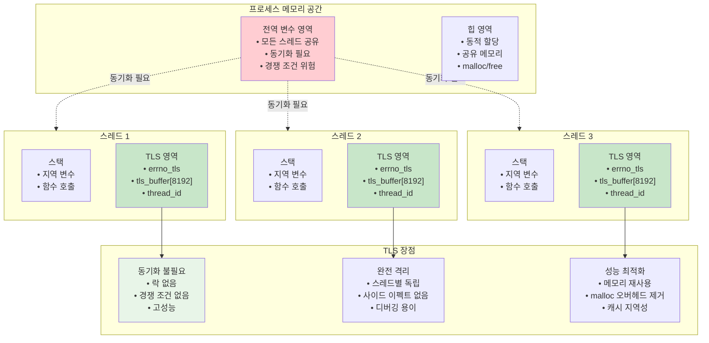
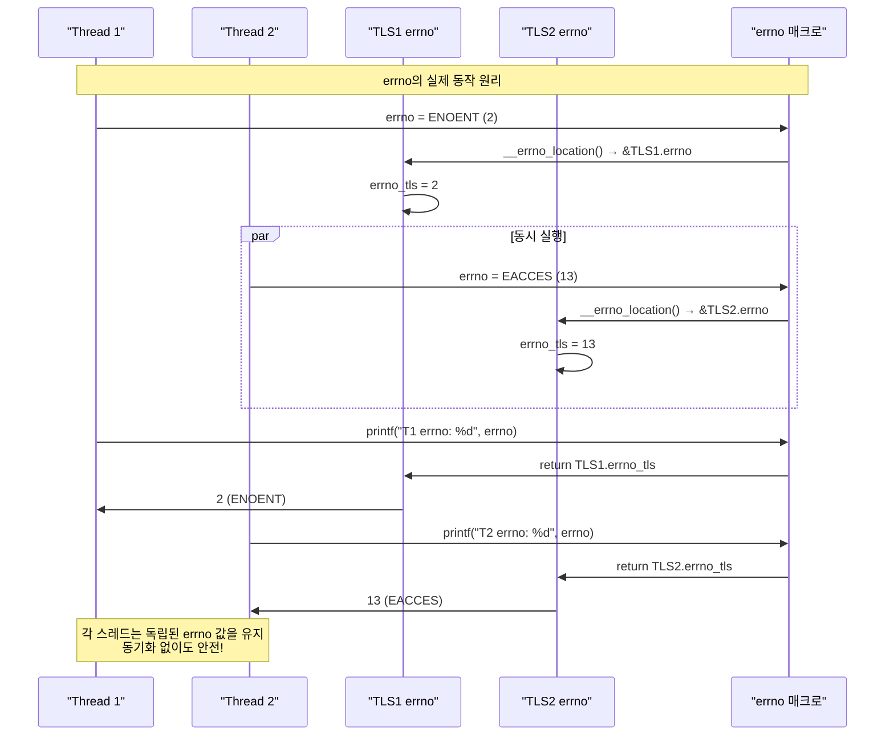
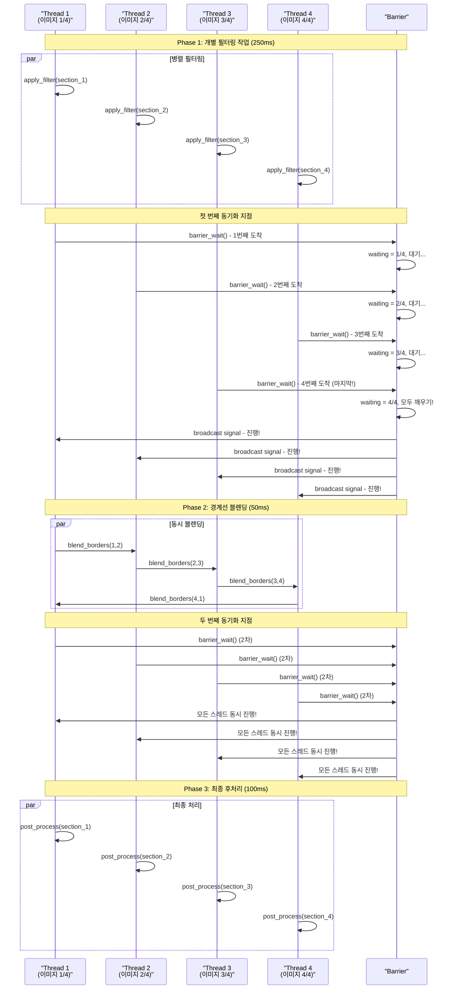
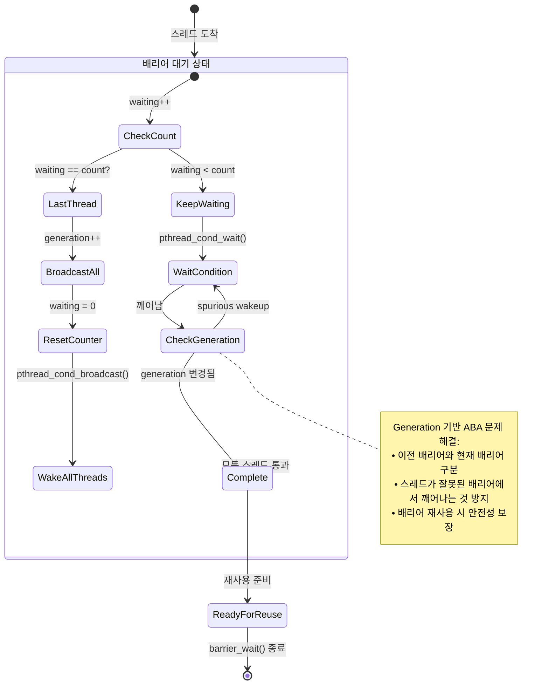
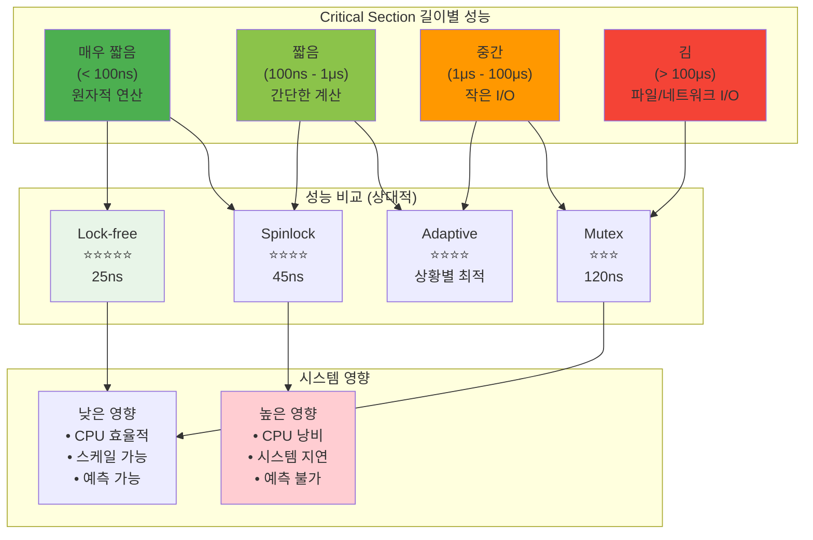
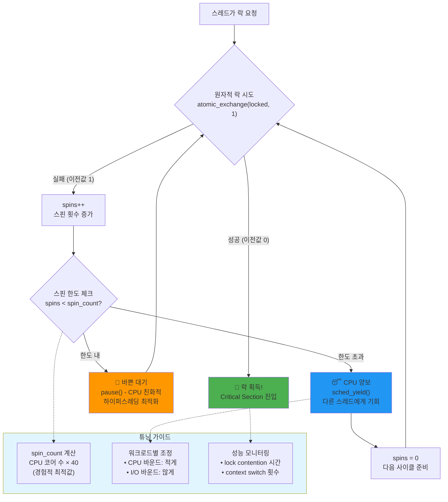
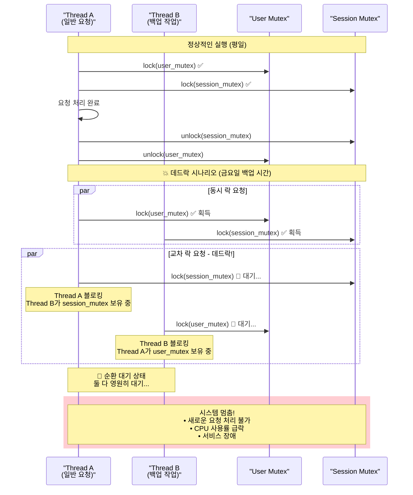
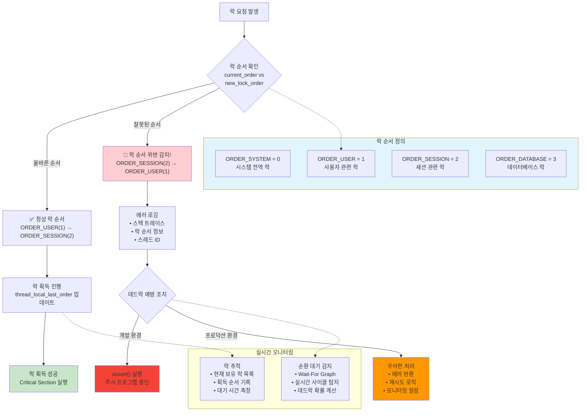
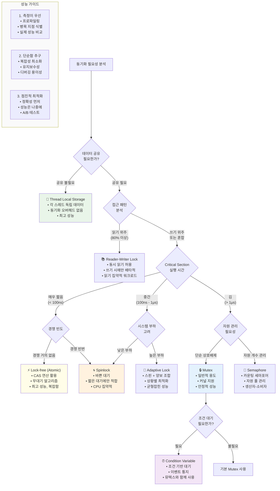
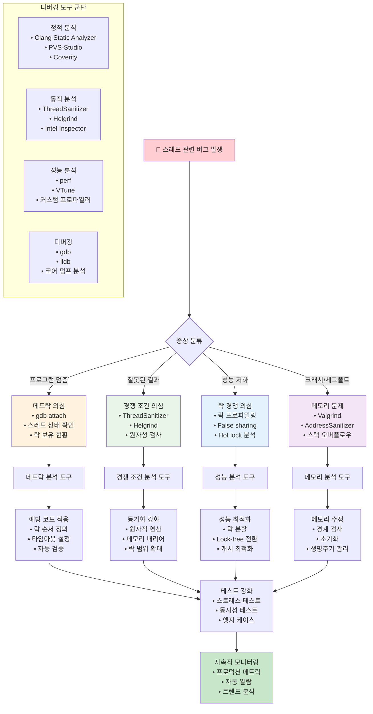

---
tags:
  - deadlock-detection
  - hands-on
  - intermediate
  - lock-free-programming
  - medium-read
  - performance-optimization
  - synchronization
  - thread-debugging
  - 시스템프로그래밍
difficulty: INTERMEDIATE
learning_time: "4-6시간"
main_topic: "시스템 프로그래밍"
priority_score: 4
---

# 1.5.2: 실용적 디버깅

## 7. 스레드 로컬 스토리지 (TLS)

### 🎒 각자의 백팩

TLS는 각 스레드가 자신만의 백팩을 갖는 것과 같습니다. 공유하지 않으니 동기화도 필요 없죠!

**errno의 비밀**

생각해보셨나요? errno는 전역 변수인데, 어떻게 멀티스레드에서 안전할까요?

```c
// errno가 실제로는 이렇게 정의됨
#define errno (*__errno_location())

// 각 스레드마다 다른 주소를 반환!
int* __errno_location() {
    return &(current_thread->errno);
}
```

천재적이죠? 전역 변수처럼 보이지만 실제로는 TLS!

### TLS 아키텍처: 각 스레드의 개인 공간



### errno TLS 구현 매직: 전역변수가 아닌 비밀



### 7.1 TLS 구현: 성능 최적화의 비밀 무기

제가 만든 웹 서버에서 TLS로 30% 성능 향상을 달성한 사례:

```c
// Before: 모든 요청마다 malloc
void handle_request() {
    char *buffer = malloc(8192);  // 매번 할당... 느려!
    // 처리...
    free(buffer);
}

// After: TLS 버퍼 재사용
__thread char tls_buffer[8192];  // 스레드당 한 번만!

void handle_request_fast() {
    // tls_buffer 바로 사용... 빨라!
    // malloc/free 오버헤드 제거
}

// 결과: 30% 처리량 증가! 🚀
```

### TLS 사용법과 구현

```c
// TLS 변수 선언
__thread int tls_variable = 0;
thread_local int cpp_tls = 0;  // C++11

// pthread TLS
pthread_key_t tls_key;

void init_tls() {
    pthread_key_create(&tls_key, free);
}

void* thread_with_tls(void *arg) {
    // TLS 데이터 설정
    int *my_data = malloc(sizeof(int));
    *my_data = pthread_self();
    pthread_setspecific(tls_key, my_data);
    
    // TLS 데이터 사용
    int *retrieved = (int*)pthread_getspecific(tls_key);
    printf("Thread %lu: TLS data = %d\n", 
           pthread_self(), *retrieved);
    
    return NULL;
}

// TLS를 이용한 errno 구현
__thread int errno_tls;

#define errno errno_tls

// 각 스레드마다 독립적인 errno
void* thread_errno_example(void *arg) {
    errno = 0;  // 이 스레드의 errno만 변경
    
    if (some_function() < 0) {
        printf("Thread %lu: Error %d\n", 
               pthread_self(), errno);
    }
    
    return NULL;
}

// TLS 메모리 레이아웃
typedef struct {
    void *tcb;          // Thread Control Block
    void *dtv;          // Dynamic Thread Vector
    void *self;         // 자기 자신 포인터
    int errno_location;
    // ... 기타 TLS 변수들
} tls_layout_t;
```

## 8. 고급 동기화 패턴

### 8.1 배리어 (Barrier): 마라톤 출발선

배리어는 마라톤 출발선과 같습니다. 모든 선수가 도착할 때까지 기다렸다가, 동시에 출발!

제가 병렬 이미지 처리 프로그램을 만들 때의 실제 사례:

```c
// 이미지를 4등분해서 병렬 처리
void parallel_image_filter(image_t *img) {
    // Phase 1: 각자 구역 필터링
    apply_filter(my_section);  // 250ms
    
    barrier_wait();  // 모두 기다려!
    
    // Phase 2: 경계선 블렌딩 (이웃 구역 필요)
    blend_borders(my_section, neighbor_section);  // 50ms
    
    barrier_wait();  // 또 기다려!
    
    // Phase 3: 최종 후처리
    post_process(my_section);  // 100ms
}

// 결과:
// 순차 처리: 1600ms (400ms × 4)
// 병렬 처리: 400ms (4배 향상!)
```

### 배리어 동기화 시각화: 마라톤 출발선의 원리



### 배리어 내부 동작: Generation 기반 재사용 메커니즘



### 배리어 구현

```c
// ⭐ 배리어(Barrier) 구현 - 모든 스레드가 동기화 지점에 도달할 때까지 대기하는 동기화 메커니즘
// 실제 동작: N개 스레드가 모두 배리어에 도달하면 동시에 다음 단계로 진행
// 활용 사례: 병렬 알고리즘의 단계별 동기화, 게임 엔진의 프레임 동기화
typedef struct {
    pthread_mutex_t mutex;    // 배리어 상태 보호용 뮤텍스
    pthread_cond_t cond;      // 스레드들을 깨우기 위한 조건 변수
    int count;                // 기다려야 하는 총 스레드 수
    int waiting;              // 현재 기다리고 있는 스레드 수
    int generation;           // 배리어 재사용을 위한 세대 카운터
} barrier_t;

void barrier_wait(barrier_t *barrier) {
    // ⭐ 1단계: 뮤텍스 락 - 배리어 상태 변경을 원자적으로 수행
    pthread_mutex_lock(&barrier->mutex);
    
    // ⭐ 2단계: 현재 세대 기록 - 배리어 재사용 시 혼동 방지
    int my_generation = barrier->generation;
    // ABA 문제 해결: 다른 스레드들이 배리어를 통과한 후 재사용해도 구분 가능
    
    // ⭐ 3단계: 대기 스레드 수 증가 및 완료 조건 확인
    if (++barrier->waiting == barrier->count) {
        // ⭐ 마지막 스레드 도착: 모든 스레드를 깨워야 하는 역할
        barrier->generation++;    // 다음 세대로 진행 (배리어 재사용 준비)
        barrier->waiting = 0;     // 대기 카운터 리셋
        pthread_cond_broadcast(&barrier->cond);  // 모든 대기 스레드 동시 깨우기
        // broadcast vs signal: signal은 하나만 깨우므로 배리어에 부적합
    } else {
        // ⭐ 아직 모든 스레드가 도착하지 않음: 대기 상태 진입
        while (my_generation == barrier->generation) {
            // ⭐ spurious wakeup 방지를 위한 while 루프
            pthread_cond_wait(&barrier->cond, &barrier->mutex);
            // cond_wait는 뮤텍스를 자동으로 해제 후 대기, 깨어나면 다시 락 획득
            // generation 비교로 올바른 세대에서 깨어났는지 확인
        }
    }
    
    // ⭐ 4단계: 뮤텍스 해제 - 다른 스레드들도 배리어를 통과할 수 있도록
    pthread_mutex_unlock(&barrier->mutex);
    
    // ⭐ 실제 production 활용:
    // - 병렬 정렬: 각 단계마다 모든 스레드 동기화 필요
    // - 게임 엔진: 물리/렌더링/AI 각 단계별 동기화 포인트
    // - 머신러닝: 분산 그래디언트 계산 후 동기화
    //
    // ⭐ 성능 고려사항:
    // - 스레드 수가 많을수록 배리어 오버헤드 증가
    // - CPU 바운드 작업에서는 스레드 수 = 코어 수로 설정
    // - I/O 바운드에서는 더 많은 스레드 허용 가능
}

// 사용 예제: 병렬 계산
void* parallel_computation(void *arg) {
    thread_data_t *data = (thread_data_t*)arg;
    
    // Phase 1: 각자 계산
    compute_partial_result(data);
    
    // 모든 스레드 대기
    barrier_wait(&global_barrier);
    
    // Phase 2: 결과 병합
    if (data->thread_id == 0) {
        merge_all_results();
    }
    
    barrier_wait(&global_barrier);
    
    // Phase 3: 최종 처리
    process_final_result(data);
    
    return NULL;
}
```

### 8.2 스핀락 (Spinlock): 회전문의 지혜

스핀락은 지하철 회전문과 같습니다. 잠깐만 기다리면 금방 내 차례가 오니까, 굳이 앉아서 기다릴 필요 없죠.

**언제 스핀락을 쓸까?**

제가 네트워크 패킷 처리기를 만들 때의 고민:

- Critical Section 실행 시간: 50 나노초
- 뮤텍스 잠금/해제: 100 나노초
- 스핀락 잠금/해제: 10 나노초

뮤텍스는 오버헤드가 실제 작업보다 큽니다! 이럴 때 스핀락이 빛을 발하죠.

```c
// 실제 성능 측정 (현대 CPU 기준)
void benchmark_locks() {
    // 짧은 작업 (atomic counter++)
    Mutex:       120ns per operation
    Spinlock:     45ns per operation  // 2.7배 빠름!
    Lock-free:    25ns per operation  // 4.8배 빠름!
    
    // 중간 작업 (100ns 계산)
    Mutex:       220ns per operation
    Spinlock:    145ns per operation  // 1.5배 빠름
    
    // 긴 작업 (1ms I/O)
    Mutex:    1.001ms per operation
    Spinlock: CPU 100% + context switch storms! 😱  // 시스템 전체 성능 저하!
    
    // 교훈: Critical section이 100ns 미만일 때만 spinlock 고려
}
```

**교훈: 스핀락은 정말 짧은 구간에만!**

### 동기화 메커니즘 성능 비교: 올바른 선택의 중요성



### 적응형 스핀락 동작 알고리즘: 지능적 대기 전략



### 스핀락 구현

```c
// ⭐ 스핀락(Spinlock) 구현 - 짧은 대기 시간을 위한 바쁜 대기 기반 동기화
// 실제 동작: 뮤텍스와 달리 커널 호출 없이 CPU 레벨에서 busy-wait 수행
// 적용 조건: Critical section이 100나노초 미만, 경합이 적을 때만 효율적
typedef struct {
    atomic_flag flag;  // C11 표준 원자적 플래그 (가장 간단한 원자적 타입)
} spinlock_t;

void spinlock_init(spinlock_t *lock) {
    // ⭐ 플래그 초기화: false(0) 상태로 설정하여 unlock 상태 표시
    atomic_flag_clear(&lock->flag);
    // memory_order_seq_cst: 가장 강한 메모리 순서 (기본값)
}

void spinlock_lock(spinlock_t *lock) {
    // ⭐ 1단계: Test-and-Set 원자적 연산으로 락 획득 시도
    while (atomic_flag_test_and_set(&lock->flag)) {
        // ⭐ 바쁜 대기(busy-wait) - 다른 스레드가 락을 해제할 때까지 CPU 점유
        
        #ifdef __x86_64__
        __builtin_ia32_pause();  // ⭐ x86 PAUSE 명령어: 하이퍼스레딩 최적화
                                 // 효과: 전력 소모 감소, 메모리 대역폭 절약
                                 // 파이프라인 지연으로 다른 논리 코어에게 실행 기회 제공
        #endif
        // ⭐ 중요: pause() 없이 무한 루프시 시스템 전체 성능 저하 가능
        // 다른 아키텍처에서는 __builtin_arm_yield() 등 유사 명령어 사용
    }
    // ⭐ 반복 설명: test_and_set이 true 반환 = 이미 락이 설정됨 = 계속 대기
    // false 반환 = 락을 성공적으로 획득 = 루프 탈출
}

void spinlock_unlock(spinlock_t *lock) {
    // ⭐ 원자적 플래그 해제: 다른 스레드들이 락을 획득할 수 있도록 상태 변경
    atomic_flag_clear(&lock->flag);
    // 메모리 배리어 효과로 critical section의 모든 연산이 완료됨을 보장
}

// ⭐ 적응형 스핀락 - 스핀과 양보를 조합한 하이브리드 동기화 메커니즘
// 실제 동작: 일정 횟수 스핀 후 스케줄러에 CPU 양보하여 시스템 부하 최소화
// 활용 목적: 중간 길이 critical section에서 성능과 시스템 안정성 균형
typedef struct {
    atomic_int locked;    // 0: unlocked, 1: locked
    int spin_count;       // 양보하기 전까지 스핀할 최대 횟수
} adaptive_spinlock_t;

void adaptive_lock(adaptive_spinlock_t *lock) {
    int spins = 0;  // 현재 스핀 횟수 추적
    
    while (1) {
        // ⭐ 1단계: 원자적 교환으로 락 획득 시도
        if (atomic_exchange(&lock->locked, 1) == 0) {
            // ⭐ 락 획득 성공: 이전 값이 0(unlocked)이었음을 의미
            break;  // 즉시 critical section 진입
        }
        
        // ⭐ 2단계: 적응형 대기 전략 - 스핀 vs 양보 결정
        if (++spins < lock->spin_count) {
            // ⭐ 스핀 단계: 아직 스핀 한도 내, 바쁜 대기 계속
            pause();  // CPU 친화적 바쁜 대기
        } else {
            // ⭐ 양보 단계: 스핀 한도 초과, 다른 스레드에게 CPU 양보
            sched_yield();  // 시스템 콜로 스케줄러에 실행 권한 반납
            spins = 0;      // 스핀 카운터 리셋으로 다음 사이클 준비
            // 효과: 시스템 전체 응답성 향상, CPU 사용률 정상화
        }
    }
    
    // ⭐ 실제 production 튜닝 가이드:
    // - spin_count 설정: CPU 코어 수 * 40 (경험적 값)
    // - 워크로드별 조정: CPU 바운드는 적게, I/O 바운드는 많게
    // - 모니터링: lock contention 시간과 context switch 횟수 측정
    //
    // ⭐ 성능 특성:
    // - 짧은 critical section: 순수 스핀락보다 약간 느림 (조건 검사 오버헤드)
    // - 긴 critical section: 순수 스핀락보다 훨씬 빠름 (양보 효과)
    // - 시스템 안정성: 무제한 스핀으로 인한 시스템 행 방지
}
```

## 9. 실전: 동기화 디버깅

### 9.1 데드락 감지: 내가 만난 최악의 버그

2년차 때, 프로덕션 서버가 매주 금요일 오후 3시에 멈추는 버그가 있었습니다.

원인? **순서가 다른 락 획득 + 금요일 백업 작업**

```c
// Thread A: 일반 요청 처리
void process_request() {
    lock(user_mutex);     // 1번
    lock(session_mutex);  // 2번
    // ...
}

// Thread B: 금요일 백업
void weekly_backup() {
    lock(session_mutex);  // 2번 먼저!
    lock(user_mutex);     // 1번 나중에! 💥 데드락!
    // ...
}
```

**해결책: Lock Ordering**

모든 뮤텍스에 순서를 정하고, 항상 같은 순서로만 획득!

```c
// 뮤텍스 순서 정의
enum {
    ORDER_USER = 1,
    ORDER_SESSION = 2,
    ORDER_DATABASE = 3
};

// 자동 순서 검증
void safe_lock(mutex_t *m, int order) {
    if (thread_local_last_order >= order) {
        panic("Lock order violation!");
    }
    pthread_mutex_lock(m);
    thread_local_last_order = order;
}
```

### 데드락 시나리오 분석: 금요일 3시의 비극



### 락 순서 위반 감지: 자동화된 데드락 예방



### 데드락 감지 도구

```c
// ⭐ 데드락 감지기 - 실시간 락 의존성 추적으로 데드락 가능성 사전 탐지
// 실제 동작: 각 스레드별 락 획득 순서를 TLS로 추적하고 순환 의존성 검사
// 활용 목적: 개발/테스트 환경에서 데드락 위험 코드 패턴 조기 발견
typedef struct {
    pthread_mutex_t *mutexes[100];  // 획득한 뮤텍스들의 포인터 배열
    int acquired[100];              // 각 뮤텍스의 획득 상태 (1: 보유중, 0: 해제됨)
    int count;                      // 현재 추적 중인 뮤텍스 총 개수
    pthread_t thread;               // 이 tracker의 소유 스레드 ID
} lock_tracker_t;

// ⭐ Thread Local Storage: 각 스레드마다 독립적인 락 추적 상태 유지
__thread lock_tracker_t tracker = {0};
// TLS 사용 이유: 스레드간 추적 정보 간섭 방지, lock-free 구현 가능

void track_lock(pthread_mutex_t *mutex) {
    // ⭐ 1단계: 새 뮤텍스 정보를 추적 배열에 추가
    tracker.mutexes[tracker.count] = mutex;     // 뮤텍스 포인터 저장
    tracker.acquired[tracker.count] = 1;        // 획득 상태로 표시
    tracker.count++;                            // 총 개수 증가
    
    // ⭐ 2단계: 데드락 위험성 실시간 검사
    // check_circular_dependency();  
    // 구현 예시: 현재 스레드가 보유한 모든 락들과
    // 다른 스레드들이 요청하는 락들 간의 순환 참조 탐지
    // Wait-For Graph 알고리즘으로 사이클 검출 가능
    
    // ⭐ 실제 구현에서 고려할 점:
    // - 배열 크기 제한 (100개) 초과시 동적 확장 필요
    // - 성능 오버헤드: production 환경에서는 컴파일 시 비활성화
    // - 메모리 사용량: 스레드별 400바이트 + 포인터 크기
}

void track_unlock(pthread_mutex_t *mutex) {
    // ⭐ 1단계: 해제된 뮤텍스를 추적 배열에서 찾기
    for (int i = 0; i < tracker.count; i++) {
        if (tracker.mutexes[i] == mutex) {
            // ⭐ 2단계: 해당 뮤텍스를 해제 상태로 표시
            tracker.acquired[i] = 0;  // 중요: 배열에서 제거하지 않고 상태만 변경
            break;  // 동일한 뮤텍스가 여러 번 있을 수 없으므로 첫 번째 발견시 중단
        }
    }
    
    // ⭐ 최적화 고려사항:
    // 1. 선형 검색(O(n)) 대신 해시 테이블 사용으로 O(1) 달성 가능
    // 2. 해제된 항목들을 주기적으로 배열에서 제거하여 메모리 효율성 향상
    // 3. Lock-free 알고리즘으로 tracker 자체의 동기화 문제 해결
    
    // ⭐ 실제 production 도구들:
    // - ThreadSanitizer: 컴파일러 수준 데드락 감지
    // - Helgrind (Valgrind): 런타임 데드락 및 경쟁 상태 탐지
    // - Intel Inspector: 상용 스레드 오류 분석 도구
}

// ThreadSanitizer 사용
// gcc -fsanitize=thread -g program.c
```

### 9.2 성능 모니터링: 보이지 않는 적 찾기

**"서버가 느려요" → "어디가 느린데?"**

제가 만든 락 프로파일러로 찾아낸 놀라운 사실들:

1. **Hot Lock**: 전체 대기 시간의 80%가 단 하나의 뮤텍스에서 발생
2. **False Sharing**: 다른 변수인데 같은 캐시 라인에 있어서 성능 저하
3. **Lock Convoy**: 한 스레드가 락을 놓자마자 다시 가져가는 현상

```c
// 실제 프로덕션에서 발견한 False Sharing
struct bad_design {
    int thread1_counter;  // Thread 1만 사용
    int thread2_counter;  // Thread 2만 사용
    // 같은 64바이트 캐시 라인! 서로 방해!
};

// 수정: 캐시 라인 분리
struct good_design {
    int thread1_counter;
    char padding1[60];  // 캐시 라인 분리!
    int thread2_counter;
    char padding2[60];
};

// 결과: 3배 성능 향상! 🚀
```

### 성능 측정 도구

```c
// ⭐ 락 성능 계측기(Instrumented Mutex) - 뮤텍스 경쟁 상황의 정량적 분석 도구
// 실제 동작: 기본 뮤텍스를 래핑하여 대기 시간, 보유 시간, 경쟁 횟수 실시간 측정
// 활용 목적: 성능 병목 지점 식별, 락 최적화 전후 비교, 시스템 튜닝 근거 제공
typedef struct {
    pthread_mutex_t mutex;           // 실제 동기화용 뮤텍스
    atomic_long wait_time;           // 누적 대기 시간 (나노초 단위)
    atomic_long hold_time;           // 누적 보유 시간 (나노초 단위) 
    atomic_int contention_count;     // 경쟁 발생 횟수 (trylock 실패)
} instrumented_mutex_t;

void instrumented_lock(instrumented_mutex_t *m) {
    struct timespec start, acquired, end;
    
    // ⭐ 1단계: 락 요청 시작 시간 기록 - 고정밀 시간 측정 시작점
    clock_gettime(CLOCK_MONOTONIC, &start);
    // CLOCK_MONOTONIC: 시스템 시간 변경에 영향받지 않는 단조 시계 사용
    
    // ⭐ 2단계: 비블로킹 락 시도로 경쟁 상황 감지
    if (pthread_mutex_trylock(&m->mutex) != 0) {
        // ⭐ 경쟁 발생: trylock 실패 = 다른 스레드가 락을 보유 중
        atomic_fetch_add(&m->contention_count, 1);  // 원자적 카운터 증가
        // fetch_add 사용 이유: 여러 스레드가 동시에 경쟁해도 정확한 카운트 보장
        
        // ⭐ 블로킹 락 호출: 실제 대기 시간 측정을 위해 정상 락 획득
        pthread_mutex_lock(&m->mutex);
        // 이 시점까지가 실제 대기 시간 (wait time)
    }
    
    // ⭐ 3단계: 락 획득 완료 시간 기록
    clock_gettime(CLOCK_MONOTONIC, &acquired);
    
    // ⭐ 4단계: 대기 시간 계산 및 누적 통계 업데이트
    long wait_ns = (acquired.tv_sec - start.tv_sec) * 1000000000 +
                   (acquired.tv_nsec - start.tv_nsec);
    atomic_fetch_add(&m->wait_time, wait_ns);  // 전체 대기 시간에 누적 합산
    
    // ⭐ 성능 분석 포인트:
    // - wait_ns가 크면 락 경쟁이 심각한 상황
    // - 평균 대기 시간 = wait_time / contention_count
    // - 목표: 평균 대기 시간을 마이크로초 단위로 최소화
}

void instrumented_unlock(instrumented_mutex_t *m) {
    struct timespec now;
    // ⭐ 1단계: 락 해제 시점 시간 기록
    clock_gettime(CLOCK_MONOTONIC, &now);
    
    // ⭐ 2단계: 락 보유 시간 계산 (실제 구현에서는 lock 시점 시간 저장 필요)
    // 중요: 이 예제에서는 간소화했지만, 실제로는 TLS에 획득 시점 저장 필요
    // long hold_ns = (now.tv_sec - acquired.tv_sec) * 1000000000 +
    //                (now.tv_nsec - acquired.tv_nsec);
    // atomic_fetch_add(&m->hold_time, hold_ns);
    
    // ⭐ 3단계: 실제 뮤텍스 해제
    pthread_mutex_unlock(&m->mutex);
    // 해제와 동시에 대기 중인 다른 스레드들이 경쟁 시작
}

// ⭐ 통계 분석 및 출력 - 수집된 데이터로 성능 병목 지점 식별
void print_lock_stats(instrumented_mutex_t *m) {
    printf("Lock Statistics:\n");
    
    // ⭐ 경쟁 횟수: 락 경쟁의 빈도 측정
    printf("  Contentions: %d\n", m->contention_count);
    // 해석: 높은 수치 = 락 경쟁 심각, 락 분할이나 알고리즘 개선 필요
    
    // ⭐ 평균 대기 시간: 경쟁 발생시 평균적으로 얼마나 기다리는가
    printf("  Avg wait time: %ld ns\n", 
           m->wait_time / (m->contention_count + 1));
    // 해석: 마이크로초 단위면 양호, 밀리초 단위면 심각한 성능 문제
    
    // ⭐ 평균 보유 시간: Critical Section의 실행 시간
    printf("  Avg hold time: %ld ns\n",
           m->hold_time / (m->contention_count + 1));
    // 해석: 보유 시간이 길수록 다른 스레드들의 대기 시간 증가
    
    // ⭐ 실무 활용 가이드:
    // 1. 경쟁률 = contention_count / total_lock_attempts
    // 2. 효율성 = hold_time / (wait_time + hold_time)
    // 3. 최적화 우선순위: 높은 경쟁률 + 긴 대기 시간 조합부터 해결
    
    // ⭐ 성능 최적화 방향:
    // - 높은 경쟁률: 락 분할, 락-프리 알고리즘 고려
    // - 긴 보유 시간: Critical Section 최소화
    // - 긴 대기 시간: 스핀락이나 적응형 뮤텍스 고려
}
```

## 10. 정리: 스레드와 동기화의 핵심

### 🎯 10년간 배운 교훈들

### 스레드란?

- **정의**: 프로세스 내의 실행 단위
- **특징**: 메모리 공유, 빠른 생성, 가벼움
- **위험**: 동기화 필요, 경쟁 조건

### 동기화 메커니즘

1. **뮤텍스**: 상호 배제, 단일 소유자
2. **세마포어**: 카운팅, 자원 관리
3. **조건 변수**: 조건 대기, 신호
4. **RWLock**: 읽기 다중, 쓰기 단독
5. **Lock-free**: 원자적 연산, 무대기

### 왜 중요한가?

1. **정확성**: 데이터 일관성 보장
2. **성능**: 병렬 처리로 속도 향상
3. **확장성**: 멀티코어 활용
4. **안정성**: 경쟁 조건과 데드락 방지

### 기억해야 할 점

#### 1. "Premature optimization is the root of all evil" - Donald Knuth

하지만 동시성에서는 **"Premature threading is the root of all bugs"**

#### 2. 동기화 선택 가이드

### 동기화 메커니즘 선택 의사결정 트리



### 스레드 디버깅 체크리스트: 실전 문제 해결



```text
경쟁 없음 → TLS
읽기 많음 → RWLock  
짧은 구간 → Spinlock
일반적 → Mutex
자원 카운팅 → Semaphore
조건 대기 → Condition Variable
최고 성능 → Lock-free (단, 전문가만)
```

#### 3. 데드락 방지 체크리스트

- [ ] 락 순서 일정하게
- [ ] 타임아웃 설정
- [ ] 락 보유 시간 최소화
- [ ] RAII 패턴 사용 (C++)

#### 4. 성능 튜닝 우선순위

1. 알고리즘 개선 (O(n²) → O(n log n))
2. 동기화 최소화 (락 구간 축소)
3. 캐시 최적화 (false sharing 제거)
4. Lock-free 구조 도입

### 🚀 마지막 조언

**동시성은 어렵지만 피할 수 없습니다.**

현대 시스템에서 멀티스레딩은 필수입니다. 하지만 올바른 이해와 신중한 설계 없이는 재앙이 될 수 있죠.

**기억하세요:**

- **정확성이 성능보다 중요**
- **간단한 것부터 시작**
- **항상 테스트와 디버깅 도구 활용**
- **동료 코드 리뷰는 필수**

10년 경험자로서 드리는 조언: 멀티스레딩을 마스터하면 **시스템의 진정한 힘**을 발휘할 수 있습니다. 하지만 그 길은 험난하니, 한 걸음씩 착실하게 나아가세요! 💪

---

**이전**: [1.3.4 고급 락킹 기법](./01-03-04-advanced-locking.md)  
**다음**: [1.4.1 스케줄링](./01-04-01-scheduling.md)에서 프로세스와 스레드 스케줄링을 학습합니다.

## 📚 관련 문서

### 📖 현재 문서 정보

- **난이도**: INTERMEDIATE
- **주제**: 시스템 프로그래밍
- **예상 시간**: 4-6시간

### 🎯 학습 경로

- [📚 INTERMEDIATE 레벨 전체 보기](../learning-paths/intermediate/)
- [🏠 메인 학습 경로](../learning-paths/)
- [📋 전체 가이드 목록](../README.md)

### 📂 같은 챕터 (chapter-01-process-thread)

- [1.2.1: 프로세스 생성과 종료 개요](./01-02-01-process-creation.md)
- [1.2.2: fork() 시스템 콜과 프로세스 복제 메커니즘](./01-02-02-process-creation-fork.md)
- [1.2.3: exec() 패밀리와 프로그램 교체 메커니즘](./01-02-03-program-replacement-exec.md)
- [1.2.4: 프로세스 종료와 좀비 처리](./01-02-04-process-termination-zombies.md)
- [1.5.1: 프로세스 관리와 모니터링](./01-05-01-process-management-monitoring.md)

### 🏷️ 관련 키워드

`thread-debugging`, `synchronization`, `performance-optimization`, `deadlock-detection`, `lock-free-programming`

### ⏭️ 다음 단계 가이드

- 실무 적용을 염두에 두고 프로젝트에 적용해보세요
- 관련 도구들을 직접 사용해보는 것이 중요합니다
