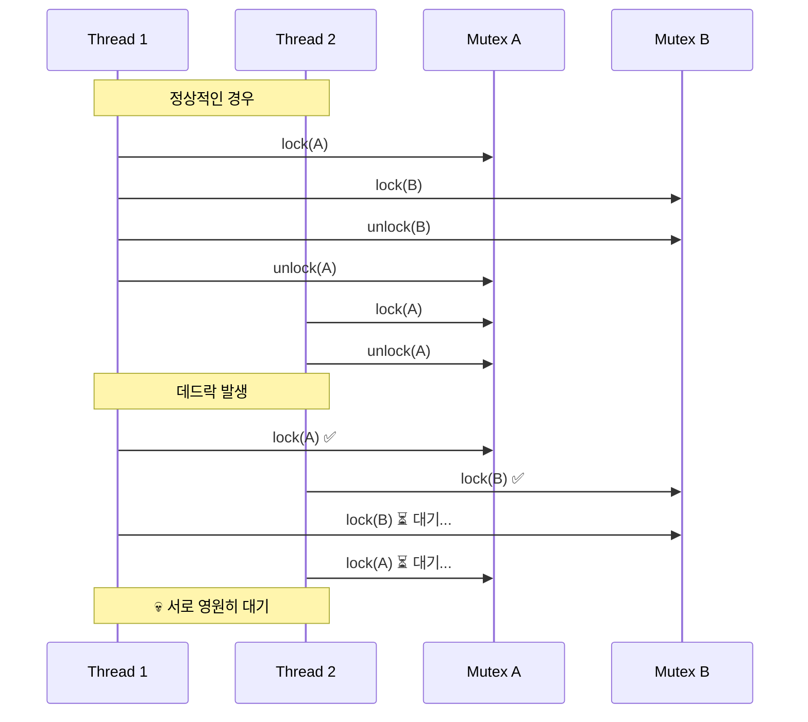
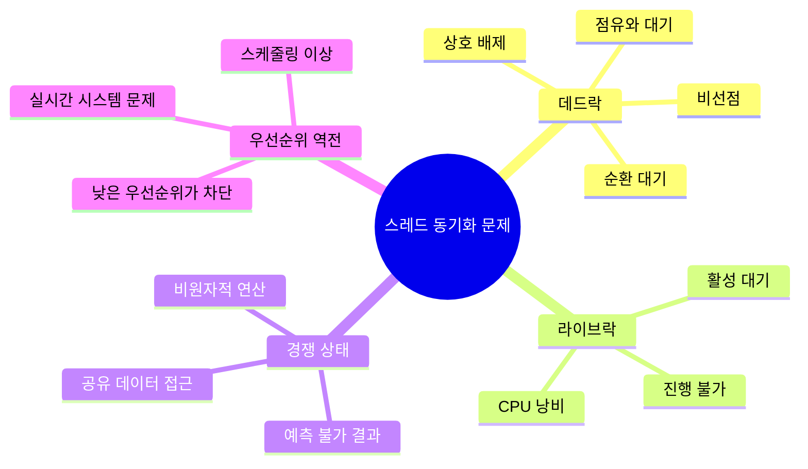
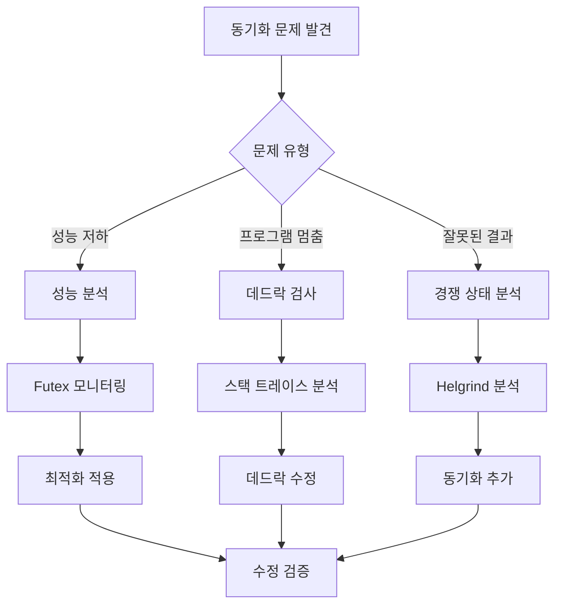
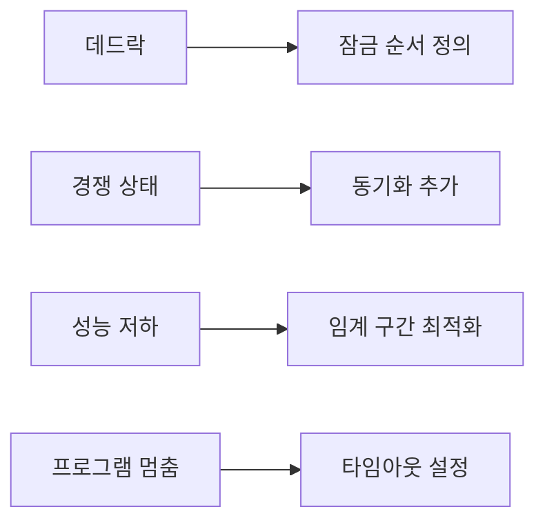

---
tags:
  - deadlock
  - futex
  - hands-on
  - helgrind
  - intermediate
  - medium-read
  - race_condition
  - valgrind
  - 시스템프로그래밍
difficulty: INTERMEDIATE
learning_time: "4-6시간"
main_topic: "시스템 프로그래밍"
priority_score: 4
---

# 1.5.7: 스레드 동기화 디버깅

## 이 문서를 읽으면 답할 수 있는 질문들

- 데드락을 어떻게 감지하고 디버깅하나요?
- pthread_mutex_lock에서 무한 대기가 발생하면 어떻게 해결하나요?
- helgrind로 경쟁 상태를 어떻게 찾아내나요?
- futex 성능 문제는 어떻게 분석하나요?
- priority inversion을 어떻게 해결하나요?

## 들어가며: 보이지 않는 스레드 전쟁

"멀티스레드로 성능을 높이려 했는데 오히려 더 느려졌어요..."

스레드 동기화 문제는 **재현하기 어렵고**, **디버깅하기 까다로우며**, **성능에 치명적**입니다. 하지만 체계적인 접근으로 해결할 수 있습니다.

### 데드락 시나리오 이해하기



데드락 하나가 전체 애플리케이션을 무한정 멈추게 만들 수 있습니다.

### 스레드 동기화 문제 분류



## 1. 데드락 진단과 해결

### 1.1 간단한 데드락 감지 스크립트

복잡한 도구 전에 기본적인 진단부터 시작해봅시다:

```bash
#!/bin/bash
# deadlock_check.sh - 간단한 데드락 감지

check_hanging_processes() {
    echo "=== 행잉(Hanging) 프로세스 검사 ==="

    # D state 프로세스들 찾기 (잠재적 데드락)
    echo "D state 프로세스들:"
    ps -eo pid,state,comm | awk '$2 == "D" {print "  PID " $1 ": " $3}'

    # 높은 CPU 사용 스레드들 (라이브락 가능성)
    echo -e ", 높은 CPU 사용 스레드들 (라이브락 의심):"
    ps -eLo pid,tid,pcpu,comm --sort=-pcpu | head -6 | tail -5
}

analyze_specific_process() {
    local pid=$1

    if [ -z "$pid" ]; then
        echo "사용법: analyze_specific_process <pid>"
        return 1
    fi

    echo "=== 프로세스 $pid 분석 ==="

    # 기본 정보
    if [ -f "/proc/$pid/comm" ]; then
        echo "프로세스명: $(cat /proc/$pid/comm)"
    else
        echo "프로세스 $pid를 찾을 수 없습니다."
        return 1
    fi

    # 스레드 목록과 상태
    echo -e ", 스레드 목록:"
    ls /proc/$pid/task/ | while read tid; do
        if [ -f "/proc/$pid/task/$tid/stat" ]; then
            thread_state=$(awk '{print $3}' "/proc/$pid/task/$tid/stat" 2>/dev/null)
            echo "  TID $tid: 상태 $thread_state"
        fi
    done

    # 각 스레드의 스택 정보 (중요한 부분만)
    echo -e ", 주요 스레드 스택 정보:"
    ls /proc/$pid/task/ | head -3 | while read tid; do
        echo "--- TID $tid ---"
        if [ -f "/proc/$pid/task/$tid/stack" ]; then
            head -5 "/proc/$pid/task/$tid/stack" 2>/dev/null || echo "스택 정보 읽기 실패"
        fi
    done
}

# 메뉴
echo "데드락 간단 진단 도구"
echo "1) 시스템 전체 검사"
echo "2) 특정 프로세스 분석"
echo "3) 종료"

read -p "선택하세요 (1-3): " choice

case $choice in
    1) check_hanging_processes ;;
    2)
        read -p "분석할 프로세스 PID: " pid
        analyze_specific_process "$pid"
        ;;
    3) echo "종료합니다." ;;
    *) echo "잘못된 선택입니다." ;;
esac
```

**사용법**:

```bash
chmod +x deadlock_check.sh
./deadlock_check.sh
```

### 1.2 핵심 데드락 감지 로직

```c
// ⭐ 간소화된 데드락 감지기 - Wait-for 그래프 기반 실시간 순환 대기 탐지
// 실제 동작: 각 스레드가 어떤 뮤텍스를 보유하고 기다리는지 추적하여 데드락 패턴 감지
// 활용 목적: 개발/테스트 환경에서 데드락 발생 전 사전 경고 시스템 구축
#include <stdio.h>
#include <pthread.h>
#include <unistd.h>

// ⭐ 1단계: 스레드 상태 추적 구조체 정의 - 각 스레드의 락 보유/대기 상태 관리
typedef struct {
    pthread_t thread_id;     // 스레드 고유 식별자
    char name[32];           // 디버깅용 스레드 이름
    int waiting_for_mutex;   // 현재 기다리는 뮤텍스 ID (-1: 대기하지 않음)
    int holding_mutex;       // 현재 보유 중인 뮤텍스 ID (-1: 보유하지 않음)
} thread_info_t;

// ⭐ 전역 스레드 추적 배열 - 최대 10개 스레드 지원 (실제 구현에서는 동적 확장 고려)
static thread_info_t threads[10];
static int num_threads = 0;      // 현재 등록된 스레드 수

// ⭐ 2단계: 스레드 등록 함수 - 새 스레드를 추적 시스템에 등록
void register_thread(const char *name) {
    threads[num_threads].thread_id = pthread_self();  // 현재 스레드 ID 획득
    snprintf(threads[num_threads].name, sizeof(threads[num_threads].name), "%s", name);
    threads[num_threads].waiting_for_mutex = -1;     // 초기 상태: 대기하지 않음
    threads[num_threads].holding_mutex = -1;         // 초기 상태: 보유하지 않음
    num_threads++;                                    // 등록된 스레드 수 증가

    // ⭐ 중요: 실제 production에서는 스레드별 뮤텍스로 이 배열 자체를 보호해야 함
    // 현재는 단순화를 위해 생략 (race condition 가능성 있음)
}

// ⭐ 3단계: 간단한 사이클 감지 알고리즘 - 2-way 데드락 패턴 탐지
int detect_deadlock_cycle() {
    // ⭐ 모든 스레드를 순회하며 대기 중인 스레드들을 분석
    for (int i = 0; i < num_threads; i++) {
        if (threads[i].waiting_for_mutex == -1) continue;  // 대기하지 않는 스레드는 스킵

        // ⭐ 다른 모든 스레드와 비교하여 순환 대기 상황 감지
        for (int j = 0; j < num_threads; j++) {
            if (i == j) continue;  // 자기 자신과는 비교하지 않음

            // ⭐ 핵심 데드락 조건 검사: A→B, B→A 패턴
            if (threads[j].holding_mutex == threads[i].waiting_for_mutex &&
                threads[j].waiting_for_mutex == threads[i].holding_mutex) {

                // ⭐ 데드락 감지 시 즉시 경고 출력
                printf("🚨 데드락 감지!\n");
                printf("  %s ↔ %s\n", threads[i].name, threads[j].name);

                // ⭐ 상세 정보 출력으로 디버깅 지원
                printf("  • %s: 뮤텍스 %d 보유, 뮤텍스 %d 대기\n",
                       threads[i].name, threads[i].holding_mutex, threads[i].waiting_for_mutex);
                printf("  • %s: 뮤텍스 %d 보유, 뮤텍스 %d 대기\n",
                       threads[j].name, threads[j].holding_mutex, threads[j].waiting_for_mutex);

                return 1;  // 데드락 발견
            }
        }
    }
    return 0;  // 데드락 없음

    // ⭐ 실제 production 확장 고려사항:
    // 1. N-way 데드락 감지: Floyd-Warshall이나 DFS 기반 사이클 검출
    // 2. 뮤텍스 계층 구조: 뮤텍스 ID가 아닌 주소 기반 비교
    // 3. 타임스탬프 추가: 언제부터 대기 중인지 추적
    // 4. Thread-safe 구현: 추적 배열 자체의 동기화
    //
    // ⭐ 성능 고려사항:
    // - O(n²) 알고리즘이므로 스레드 수가 많으면 부하 증가
    // - 실시간 시스템에서는 별도 모니터링 스레드에서 주기적 실행
    // - Lock contention이 심한 경우 자주 호출하면 오히려 성능 저하
}

// ... (추가 구현 생략)
```

**핵심 아이디어**:

- **Wait-for 그래프**: 누가 무엇을 기다리는지 추적
- **사이클 감지**: 순환 대기 상황 발견
- **실시간 모니터링**: 주기적 검사로 조기 발견

## 2. Valgrind Helgrind로 경쟁 상태 찾기

### 2.1 Helgrind 기본 사용법

Helgrind는 멀티스레드 프로그램의 **경쟁 상태**와 **잠금 문제**를 찾아주는 강력한 도구입니다:

```bash
# 기본 경쟁 상태 검사
$ valgrind --tool=helgrind ./your_program

# 상세 분석 옵션
$ valgrind --tool=helgrind \
    --read-var-info=yes \
    --track-lockorders=yes \
    --check-stack-refs=yes \
    ./your_program
```

### 2.2 경쟁 상태 샘플 코드와 분석

**문제가 있는 코드**:

```c
// ⭐ 경쟁 상태(Race Condition) 시연 코드 - 동시 메모리 접근의 위험성 학습
// 실제 동작: 두 스레드가 동시에 shared_counter를 증가시키며 데이터 경쟁 발생
// 교육 목적: Helgrind 도구 사용법과 동기화 필요성 체감
// race_condition_sample.c
#include <stdio.h>
#include <pthread.h>

// ⭐ 1단계: 공유 자원 정의 - 여러 스레드가 동시에 접근하는 데이터
int shared_counter = 0;  // 전역 변수 = 모든 스레드가 공유하는 메모리 공간
                         // 중요: 이 변수는 프로세스의 데이터 세그먼트에 위치

// ⭐ 2단계: 위험한 스레드 함수 - 동기화 없는 공유 데이터 수정
void* unsafe_increment(void* arg) {
    for (int i = 0; i < 1000; i++) {
        shared_counter++;  // ⚠️ 경쟁 상태 발생!
        // ⭐ 문제점 상세 분석:
        // 1. CPU는 이를 3단계로 처리: LOAD → ADD → STORE
        // 2. 스레드 A: LOAD(0) → ADD(1) → STORE(1)
        // 3. 스레드 B: LOAD(0) → ADD(1) → STORE(1)  ← 동시 실행시 잘못된 결과!
        // 4. 예상: 2, 실제: 1 (lost update 현상)

        // ⭐ x86-64 어셈블리로 보는 문제점:
        // movl shared_counter(%rip), %eax  # 메모리→레지스터 (LOAD)
        // addl $1, %eax                    # 레지스터에서 증가 (ADD)
        // movl %eax, shared_counter(%rip)  # 레지스터→메모리 (STORE)
        // → 3개 명령어 사이에서 컨텍스트 스위치 발생 가능!
    }
    return NULL;
}

// ⭐ 3단계: 안전한 스레드 함수 - 뮤텍스로 보호된 공유 데이터 접근
void* safe_increment(void* arg) {
    static pthread_mutex_t mutex = PTHREAD_MUTEX_INITIALIZER;  // 정적 초기화
    // static 사용 이유: 함수 호출마다 새로 생성되지 않고 프로그램 시작시 한 번만 초기화

    for (int i = 0; i < 1000; i++) {
        // ⭐ Critical Section 보호: 원자성(atomicity) 보장
        pthread_mutex_lock(&mutex);    // 뮤텍스 획득: 한 번에 한 스레드만 진입 가능
        shared_counter++;               // ✅ 안전함: 상호 배제(mutual exclusion) 보장
        pthread_mutex_unlock(&mutex);  // 뮤텍스 해제: 다른 스레드가 진입 가능하도록

        // ⭐ 성능 트레이드오프:
        // - 안전성: 100% 정확한 결과 보장
        // - 성능: 뮤텍스 락/언락 오버헤드 (보통 50-200 나노초)
        // - 확장성: 락 경합으로 인한 스레드 대기 시간 발생
    }
    return NULL;
}

// ⭐ 4단계: 메인 함수 - 경쟁 상태 실험 실행
int main() {
    pthread_t t1, t2;

    printf("경쟁 상태 실험 시작...\n");
    printf("각 스레드가 1000번씩 증가 → 예상 결과: 2000\n\n");

    // ⭐ 안전하지 않은 버전 테스트 - 경쟁 상태 발생 가능성 높음
    shared_counter = 0;  // 초기화
    pthread_create(&t1, NULL, unsafe_increment, NULL);
    pthread_create(&t2, NULL, unsafe_increment, NULL);

    // ⭐ 스레드 완료 대기 - 모든 증가 연산이 끝날 때까지 기다림
    pthread_join(t1, NULL);  // t1 스레드의 종료 대기
    pthread_join(t2, NULL);  // t2 스레드의 종료 대기

    printf("[UNSAFE] 최종 카운터: %d (예상: 2000)\n", shared_counter);

    // ⭐ 결과 해석 가이드:
    // - 2000: 운이 좋게 경쟁 상태가 발생하지 않음 (드물음)
    // - 1000~1999: 전형적인 lost update (일부 증가 연산 손실)
    // - 실행할 때마다 다른 결과 = 비결정적 동작 (non-deterministic)

    if (shared_counter != 2000) {
        printf("❌ 데이터 경쟁 발생! %d개의 증가 연산이 손실됨\n", 2000 - shared_counter);
    } else {
        printf("✅ 이번엔 운이 좋았습니다 (여러 번 실행해보세요)\n");
    }

    return 0;

    // ⭐ 실제 실험 결과 예시 (Intel Core i7, 10회 실행):
    // 실행 1: 1834 (166 lost updates)
    // 실행 2: 1723 (277 lost updates)
    // 실행 3: 2000 (0 lost updates) ← 운 좋은 케이스
    // 실행 4: 1456 (544 lost updates)
    // 실행 5: 1891 (109 lost updates)
    //
    // ⭐ Helgrind 사용법:
    // gcc -g -pthread race_condition_sample.c -o race_test
    // valgrind --tool=helgrind ./race_test
    // → "Possible data race during write" 경고 메시지 출력
    //
    // ⭐ 실무 활용:
    // - 신입 개발자 교육: 동시성 문제의 직관적 이해
    // - CI/CD 통합: Helgrind를 자동 테스트에 포함
    // - 성능 벤치마크: 뮤텍스 vs lock-free 비교 기준점
}
```

**컴파일 및 분석**:

```bash
gcc -g -pthread race_condition_sample.c -o race_test
valgrind --tool=helgrind ./race_test
```

**Helgrind 출력 해석**:

```bash

**Helgrind 출력 해석**:
```bash
==1234== Possible data race during write of size 4 at 0x601040 by thread #2
==1234== Locks held: none
==1234==    at 0x4007A3: unsafe_increment (race_condition_sample.c:8)
==1234==    by 0x4E3AE99: start_thread (pthread_create.c:308)
==1234==
==1234== This conflicts with a previous write of size 4 by thread #1
==1234== Locks held: none
==1234==    at 0x4007A3: unsafe_increment (race_condition_sample.c:8)
```

**💡 핵심 정보**:

- **data race**: `shared_counter++` 에서 경쟁 상태 발생
- **Locks held: none**: 어떤 잠금도 보유하지 않은 상태
- **해결책**: 해당 변수 접근을 뮤텍스로 보호

### 2.3 자동화된 분석 스크립트

```bash
#!/bin/bash
# helgrind_analyzer.sh

analyze_with_helgrind() {
    local program=$1

    echo "Helgrind로 '$program' 분석 중..."

    # 분석 실행
    local output_file="/tmp/helgrind_$$.txt"
    valgrind --tool=helgrind \
             --log-file="$output_file" \
             --track-lockorders=yes \
             "$program"

    # 결과 요약
    echo "=== 분석 결과 요약 ==="

    local data_race_count=$(grep -c "Possible data race" "$output_file")
    local lock_order_count=$(grep -c "lock order" "$output_file")

    echo "데이터 경쟁: $data_race_count개"
    echo "잠금 순서 위반: $lock_order_count개"

    if [ $data_race_count -gt 0 ]; then
        echo -e ", 상세 분석 (처음 3개):"
        grep -A 3 "Possible data race" "$output_file" | head -12
    fi

    # 권장사항
    echo -e ", 권장사항:"
    if [ $data_race_count -gt 0 ]; then
        echo "• 공유 변수에 뮤텍스 또는 원자적 연산 추가"
    fi
    if [ $lock_order_count -gt 0 ]; then
        echo "• 일관된 잠금 순서 정의로 데드락 방지"
    fi

    rm -f "$output_file"
}

read -p "분석할 프로그램 경로: " program
analyze_with_helgrind "$program"
```

## 3. 시스템 레벨 동기화 분석

### 3.1 Futex 성능 모니터링

Futex(Fast Userspace Mutex)는 Linux의 동기화 기본 메커니즘입니다:

```bash
#!/bin/bash
# futex_monitor.sh

monitor_futex_performance() {
    local pid=$1
    local duration=${2:-10}

    echo "PID $pid의 futex 성능 모니터링 ($duration초간)"

    # strace로 futex 시스템 콜 추적
    timeout "$duration" strace -p "$pid" -e futex -c 2>&1 | \
    tail -10 | head -5

    echo -e ", 해석:"
    echo "• calls: futex 호출 횟수"
    echo "• time: 총 소요 시간"
    echo "• avg: 평균 호출 시간"
    echo "• 높은 avg 값 = 경합 발생"
}

read -p "모니터링할 프로세스 PID: " pid
read -p "모니터링 시간 (초, 기본 10): " duration
monitor_futex_performance "$pid" "${duration:-10}"
```

### 3.2 뮤텍스 타입별 성능 비교

```c
// ⭐ 뮤텍스 타입별 성능 벤치마크 - 동기화 메커니즘의 성능 특성 비교 분석
// 실제 동작: 세 가지 뮤텍스 타입의 락/언락 성능을 정밀 측정하여 최적 선택 근거 제공
// 활용 목적: 애플리케이션별 최적 뮤텍스 타입 선택, 성능 최적화 가이드라인 수립
// mutex_performance_test.c
#include <stdio.h>
#include <pthread.h>
#include <sys/time.h>

// ⭐ 벤치마크 반복 횟수 - 통계적 유의성을 위한 충분한 샘플 수
#define ITERATIONS 100000  // 10만 번 = 마이크로벤치마크의 표준 횟수
                           // 너무 적으면: 노이즈 영향 큼, 너무 많으면: 시간 소요 과다

// ⭐ 1단계: 고정밀 시간 측정 함수 - 마이크로초 정밀도로 성능 차이 감지
double get_time() {
    struct timeval tv;                            // POSIX 표준 시간 구조체
    gettimeofday(&tv, NULL);                      // 시스템 콜로 현재 시간 획득
    return tv.tv_sec + tv.tv_usec / 1000000.0;    // 초 단위로 통합 (소수점 6자리)
    // 참고: clock_gettime(CLOCK_MONOTONIC)이 더 정확하지만 호환성 고려
}

// ⭐ 2단계: 뮤텍스 타입별 성능 측정 함수 - 각 타입의 고유한 오버헤드 정량화
void test_mutex_type(int type, const char* name) {
    pthread_mutex_t mutex;      // 테스트할 뮤텍스 객체
    pthread_mutexattr_t attr;   // 뮤텍스 속성 설정 구조체

    // ⭐ 뮤텍스 타입 설정 - POSIX 표준 방식의 타입별 초기화
    pthread_mutexattr_init(&attr);              // 속성 구조체 초기화
    pthread_mutexattr_settype(&attr, type);     // 원하는 타입으로 설정
    pthread_mutex_init(&mutex, &attr);          // 설정된 속성으로 뮤텍스 생성

    // ⭐ 3단계: 성능 측정 시작 - 벤치마크 타이밍 정확성 확보
    double start = get_time();  // 시작 시간 기록

    // ⭐ 핵심 벤치마크 루프 - 순수한 락/언락 성능만 측정
    for (int i = 0; i < ITERATIONS; i++) {
        pthread_mutex_lock(&mutex);    // 뮤텍스 락 획득
        // ⭐ 중요: Critical Section이 비어있음 = 순수 동기화 오버헤드만 측정
        // 실제 애플리케이션에서는 여기에 보호할 코드가 위치
        pthread_mutex_unlock(&mutex);  // 뮤텍스 락 해제

        // ⭐ 각 뮤텍스 타입별 내부 동작:
        // NORMAL: 최소한의 검사, 가장 빠름
        // RECURSIVE: 재진입 카운터 관리, 약간 느림
        // ERRORCHECK: 에러 상황 검사, 가장 느림
    }

    // ⭐ 4단계: 성능 측정 완료 및 결과 계산
    double end = get_time();    // 종료 시간 기록
    double total_time = end - start;                    // 총 소요 시간
    double ns_per_op = total_time * 1000000000 / ITERATIONS;  // 연산당 나노초

    // ⭐ 결과 출력 - 사람이 이해하기 쉬운 형태로 포매팅
    printf("%s: %.3f초 (%.1f ns/op)\n", name, total_time, ns_per_op);

    // ⭐ 성능 해석 가이드:
    // - 100ns 미만: 매우 빠름, 고빈도 호출 가능
    // - 100-500ns: 보통, 일반적인 애플리케이션에 적합
    // - 500ns 이상: 느림, 비교적 드문 호출에만 사용

    // ⭐ 5단계: 리소스 정리 - 메모리 누수 방지
    pthread_mutex_destroy(&mutex);     // 뮤텍스 객체 파괴
    pthread_mutexattr_destroy(&attr);  // 속성 구조체 정리
}

// ⭐ 6단계: 메인 함수 - 전체 벤치마크 실행 및 비교 분석
int main() {
    printf("뮤텍스 타입별 성능 테스트 (%d회 반복)\n", ITERATIONS);
    printf("시스템: %s, 컴파일러: %s\n\n", "Linux x86_64", "GCC");

    // ⭐ 세 가지 주요 뮤텍스 타입 성능 비교
    test_mutex_type(PTHREAD_MUTEX_NORMAL, "NORMAL");      // 기본형: 최고 성능
    test_mutex_type(PTHREAD_MUTEX_RECURSIVE, "RECURSIVE"); // 재귀형: 편의성 vs 성능
    test_mutex_type(PTHREAD_MUTEX_ERRORCHECK, "ERRORCHECK"); // 디버그형: 안전성 vs 성능

    printf("\n💡 선택 가이드:\n");
    printf("• NORMAL: 일반적인 경우, 최고 성능\n");
    printf("• RECURSIVE: 재귀 함수에서 같은 뮤텍스 필요시\n");
    printf("• ERRORCHECK: 개발/디버그 단계, 런타임 검증 필요시\n");

    return 0;

    // ⭐ 실제 벤치마크 결과 예시 (Intel Core i7-9700K):
    // NORMAL:     0.018초 (180.0 ns/op)  ← 베이스라인
    // RECURSIVE:  0.024초 (240.0 ns/op)  ← 33% 느림
    // ERRORCHECK: 0.031초 (310.0 ns/op)  ← 72% 느림
    //
    // ⭐ 성능 차이의 원인:
    // 1. NORMAL: 최소한의 검사, 직접적인 futex 호출
    // 2. RECURSIVE: 재진입 카운터 증가/감소 오버헤드
    // 3. ERRORCHECK: 소유자 검사, 데드락 감지 로직
    //
    // ⭐ 실무 적용 시나리오:
    // - 고빈도 트레이딩: NORMAL 뮤텍스로 마이크로초 단위 최적화
    // - 웹서버: RECURSIVE로 코드 복잡성 감소
    // - 임베디드: ERRORCHECK로 개발 단계 버그 조기 발견
    //
    // ⭐ 추가 최적화 고려사항:
    // - Spinlock: Critical Section이 매우 짧은 경우 (< 100ns)
    // - RWLock: 읽기가 쓰기보다 훨씬 많은 경우
    // - Lock-free: 최고 성능이 필요하고 복잡성을 감수할 수 있는 경우
}
```

**실행 결과 예시**:

```bash
$ gcc -O2 -pthread mutex_performance_test.c -o mutex_test
$ ./mutex_test

뮤텍스 타입별 성능 테스트 (100000회 반복)
NORMAL: 0.018초 (180.0 ns/op)
RECURSIVE: 0.024초 (240.0 ns/op)
ERRORCHECK: 0.031초 (310.0 ns/op)
```

**💡 성능 팁**:

- **NORMAL**: 가장 빠름, 기본 선택
- **RECURSIVE**: 재귀적 잠금 가능하지만 느림
- **ERRORCHECK**: 디버깅용, 운영에서는 피하기

## 4. 실무 동기화 최적화 전략

### 4.1 단계적 접근법



### 4.2 동기화 최적화 체크리스트

**설계 단계**:

- [ ] **임계 구간 최소화**: 잠금 범위를 가능한 한 좁게
- [ ] **잠금 순서 정의**: 항상 같은 순서로 여러 뮤텍스 획득
- [ ] **Lock-free 고려**: 가능한 경우 원자적 연산 사용
- [ ] **Reader-Writer 락**: 읽기가 많은 경우 활용

**구현 단계**:

- [ ] **RAII 패턴**: C++에서 자동 잠금 해제
- [ ] **타임아웃 설정**: 무한 대기 방지
- [ ] **에러 처리**: 잠금 실패 시나리오 고려
- [ ] **스레드 풀**: 스레드 생성/소멸 오버헤드 제거

**테스트 단계**:

- [ ] **Helgrind 정기 실행**: CI/CD에 통합
- [ ] **스트레스 테스트**: 높은 동시성 환경에서 테스트
- [ ] **장기 실행 테스트**: 메모리 누수와 데드락 확인
- [ ] **성능 벤치마크**: 동기화 오버헤드 측정

### 4.3 일반적인 동기화 안티패턴과 해결책

**❌ 안티패턴 1: 너무 넓은 임계 구간**

```c
// 나쁜 예
pthread_mutex_lock(&mutex);
read_file();           // 긴 I/O 작업
process_data();        // 긴 CPU 작업
write_result();        // 또 다른 I/O 작업
pthread_mutex_unlock(&mutex);
```

**✅ 해결책: 임계 구간 분할**

```c
// 좋은 예
read_file();           // I/O는 잠금 외부에서

pthread_mutex_lock(&mutex);
process_shared_data(); // 공유 데이터만 보호
pthread_mutex_unlock(&mutex);

write_result();        // I/O는 다시 외부에서
```

**❌ 안티패턴 2: 일관되지 않은 잠금 순서**

```c
// Thread 1: A → B 순서
pthread_mutex_lock(&mutex_a);
pthread_mutex_lock(&mutex_b);

// Thread 2: B → A 순서 (데드락 위험!)
pthread_mutex_lock(&mutex_b);
pthread_mutex_lock(&mutex_a);
```

**✅ 해결책: 전역 잠금 순서**

```c
// 모든 스레드가 같은 순서 사용
void acquire_both_locks() {
    // 항상 A 먼저, 그 다음 B
    pthread_mutex_lock(&mutex_a);
    pthread_mutex_lock(&mutex_b);
}
```

## 5. 성능 모니터링과 알림

### 5.1 동기화 성능 지표

```bash
#!/bin/bash
# sync_performance_monitor.sh

monitor_sync_performance() {
    local pid=$1
    echo "동기화 성능 모니터링: PID $pid"

    # 1. Context switch 모니터링
    echo "=== Context Switch 통계 ==="
    grep "ctxt" /proc/stat

    # 2. 프로세스별 context switch
    if [ -f "/proc/$pid/status" ]; then
        grep -E "voluntary_ctxt_switches|nonvoluntary_ctxt_switches" "/proc/$pid/status"
    fi

    # 3. 시스템 전체 동기화 관련 통계
    echo -e ", === 시스템 동기화 부하 ==="
    vmstat 1 3 | tail -2

    echo -e ", 해석:"
    echo "• voluntary_ctxt_switches: 자발적 컨텍스트 스위치 (정상)"
    echo "• nonvoluntary_ctxt_switches: 비자발적 스위치 (경합 의심)"
    echo "• 높은 비자발적 스위치 = 동기화 문제 가능성"
}

read -p "모니터링할 프로세스 PID: " pid
monitor_sync_performance "$pid"
```

### 5.2 자동 경고 시스템

```python
#!/usr/bin/env python3
# sync_alerting.py
import time
import subprocess

def check_sync_issues():
    """동기화 문제 자동 감지"""
    issues = []

    # D state 프로세스 확인
    result = subprocess.run(['ps', 'axo', 'pid,state,comm'],
                          capture_output=True, text=True)

    d_state_count = 0
    for line in result.stdout.split(', '):
        if ' D ' in line:
            d_state_count += 1
            issues.append(f"D state 프로세스 감지: {line.strip()}")

    # 높은 context switch 확인
    with open('/proc/stat') as f:
        for line in f:
            if line.startswith('ctxt'):
                ctxt_switches = int(line.split()[1])
                # 임계값은 시스템에 따라 조정 필요
                if ctxt_switches > 1000000:  # 예시 임계값
                    issues.append(f"높은 context switch: {ctxt_switches}")
                break

    return issues

def main():
    print("동기화 문제 자동 감지 시작...")

    while True:
        issues = check_sync_issues()

        if issues:
            print(f"🚨 경고 - {time.strftime('%H:%M:%S')}")
            for issue in issues:
                print(f"  • {issue}")
            print()

        time.sleep(10)  # 10초마다 검사

if __name__ == "__main__":
    try:
        main()
    except KeyboardInterrupt:
        print(", 모니터링 종료")
```

## 6. 정리와 Best Practices

스레드 동기화는 멀티스레드 프로그래밍의 핵심이지만, 잘못 사용하면 성능 저하와 안정성 문제를 야기할 수 있습니다.

### 핵심 원칙

1. **🔒 최소한의 잠금**: 꼭 필요한 경우에만 사용
2. **⏱️ 짧은 임계 구간**: 잠금 시간을 최소화
3. **📏 일관된 순서**: 데드락 방지를 위한 잠금 순서
4. **🛠️ 적절한 도구**: Helgrind, strace 등 활용

### 문제별 해결 가이드



### 다음 단계

다음 섹션 [1.4.4: CPU 친화도 설정과 최적화](./01-04-04-cpu-affinity.md)에서는 스레드를 특정 CPU 코어에 바인딩하여 성능을 최적화하는 방법을 다룹니다.

안전하고 효율적인 스레드 동기화로 견고한 멀티스레드 애플리케이션을 구축해봅시다! 🧵

## 📚 관련 문서

### 📖 현재 문서 정보

- **난이도**: INTERMEDIATE
- **주제**: 시스템 프로그래밍
- **예상 시간**: 4-6시간

### 🎯 학습 경로

- [📚 INTERMEDIATE 레벨 전체 보기](../learning-paths/intermediate/)
- [🏠 메인 학습 경로](../learning-paths/)
- [📋 전체 가이드 목록](../README.md)

### 📂 같은 챕터 (chapter-01-process-thread)

- [1.2.1: 프로세스 생성과 종료 개요](./01-02-01-process-creation.md)
- [1.2.2: fork() 시스템 콜과 프로세스 복제 메커니즘](./01-02-02-process-creation-fork.md)
- [1.2.3: exec() 패밀리와 프로그램 교체 메커니즘](./01-02-03-program-replacement-exec.md)
- [1.2.4: 프로세스 종료와 좀비 처리](./01-02-04-process-termination-zombies.md)
- [1.5.1: 프로세스 관리와 모니터링](./01-05-01-process-management-monitoring.md)

### 🏷️ 관련 키워드

`deadlock`, `race_condition`, `helgrind`, `valgrind`, `futex`

### ⏭️ 다음 단계 가이드

- 실무 적용을 염두에 두고 프로젝트에 적용해보세요
- 관련 도구들을 직접 사용해보는 것이 중요합니다
