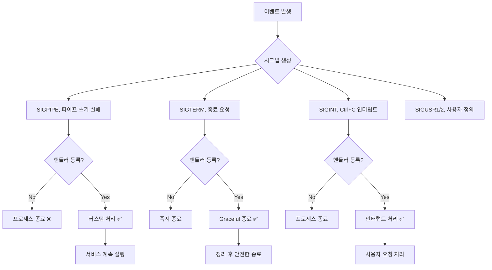

---
tags:
  - SIGPIPE
  - debugging
  - hands-on
  - intermediate
  - medium-read
  - network-programming
  - process-management
  - signal
  - 시스템프로그래밍
difficulty: INTERMEDIATE
learning_time: "3-4시간"
main_topic: "시스템 프로그래밍"
priority_score: 4
---

# 1.5.8: 시그널 처리 디버깅

## 상황: 웹 서버의 갑작스러운 종료

"안녕하세요, Node.js로 만든 웹 서버가 간헐적으로 갑자기 죽어요. 로그를 보니 클라이언트가 연결을 끊었을 때 SIGPIPE 에러가 발생하는 것 같습니다. 네트워크 연결이 끊어졌을 때 프로세스가 죽지 않게 하려면 어떻게 해야 할까요?"

이런 상황은 네트워크 서비스에서 흔히 발생하는 문제입니다. 시그널 처리를 제대로 이해하고 적절히 핸들링하면 robust한 서비스를 만들 수 있습니다.

## 시그널 처리의 핵심 이해

### 시그널 발생과 처리 과정



### 주요 시그널과 기본 동작

| 시그널 | 번호 | 기본 동작 | 주요 발생 상황 |
|--------|------|-----------|----------------|
| SIGPIPE | 13 | 종료 | 끊어진 파이프/소켓에 쓰기 |
| SIGTERM | 15 | 종료 | 정상적인 종료 요청 |
| SIGINT | 2 | 종료 | Ctrl+C 인터럽트 |
| SIGKILL | 9 | 강제 종료 | 핸들러 등록 불가 |
| SIGUSR1 | 10 | 종료 | 사용자 정의 용도 |

**💡 핵심 포인트**: SIGPIPE는 네트워크 서비스에서 클라이언트 연결 종료 시 가장 빈번하게 발생하는 시그널입니다.

## 1. 기본 시그널 분석기

먼저 프로세스가 어떤 시그널을 받는지 모니터링하는 간단한 도구를 만들어보겠습니다.

### 핵심 구조체 정의

```c
// signal_monitor.c
#include <stdio.h>
#include <signal.h>
#include <time.h>
#include <string.h>
#include <pthread.h>

typedef struct {
    int signal_num;
    char* signal_name;
    int count;
    time_t last_time;
    int is_fatal;
} signal_info_t;

typedef struct {
    pid_t pid;
    signal_info_t signals[32];
    pthread_mutex_t mutex;
    FILE* log_file;
} signal_monitor_t;
```

**설명**: 이 구조체들은 시그널 발생을 추적하고 통계를 수집하는 기본 틀을 제공합니다.

### 시그널 로깅 함수

```c
void log_signal(signal_monitor_t* monitor, int signum) {
    pthread_mutex_lock(&monitor->mutex);

    time_t now = time(NULL);
    struct tm* tm_info = localtime(&now);
    char timestamp[64];
    strftime(timestamp, sizeof(timestamp), "%Y-%m-%d %H:%M:%S", tm_info);

    // 시그널 이름 매핑
    const char* sig_names[] = {
        [SIGPIPE] = "SIGPIPE", [SIGTERM] = "SIGTERM",
        [SIGINT] = "SIGINT", [SIGUSR1] = "SIGUSR1"
    };

    const char* sig_name = (signum < 32 && sig_names[signum]) ?
                          sig_names[signum] : "UNKNOWN";

    printf("[%s] PID %d received %s (%d), ",
           timestamp, monitor->pid, sig_name, signum);

    // 통계 업데이트
    for (int i = 0; i < 32; i++) {
        if (monitor->signals[i].signal_num == signum ||
            monitor->signals[i].signal_num == 0) {
            monitor->signals[i].signal_num = signum;
            monitor->signals[i].count++;
            monitor->signals[i].last_time = now;
            break;
        }
    }

    pthread_mutex_unlock(&monitor->mutex);
}
```

**동작 원리**:

1. 시그널 발생 시간을 기록하고 콘솔에 출력
2. 내부 통계 배열에서 해당 시그널 카운터 증가
3. 스레드 안전성을 위해 mutex 사용

### SIGPIPE 특화 분석

```c
void analyze_sigpipe_context(pid_t pid) {
    printf(", === SIGPIPE 분석 ===, ");

    // 열린 파일 디스크립터 확인
    char fd_path[256];
    snprintf(fd_path, sizeof(fd_path), "/proc/%d/fd", pid);

    // ... (파일 디스크립터 분석 코드)
    // ... (네트워크 연결 상태 확인)

    printf("권장사항: SIGPIPE 핸들러 등록 또는 MSG_NOSIGNAL 사용, ");
}
```

**사용법**:

```bash
# 컴파일
gcc -o signal_monitor signal_monitor.c -lpthread

# 특정 프로세스 모니터링
./signal_monitor 1234

# 출력 예시
[2024-01-15 10:30:25] PID 1234 received SIGPIPE (13)
=== SIGPIPE 분석 ===
열린 소켓: 5개, 파이프: 2개
권장사항: SIGPIPE 핸들러 등록 또는 MSG_NOSIGNAL 사용
```

## 2. Robust 시그널 처리 라이브러리

실제 프로덕션 환경에서 사용할 수 있는 견고한 시그널 처리 라이브러리를 구현해봅시다.

### 라이브러리 인터페이스

```c
// robust_signal.h
typedef enum {
    SIGNAL_ACTION_IGNORE,           // 시그널 무시
    SIGNAL_ACTION_GRACEFUL_SHUTDOWN,// 정리 후 종료
    SIGNAL_ACTION_LOG_AND_CONTINUE, // 로그만 기록
    SIGNAL_ACTION_CUSTOM           // 커스텀 핸들러
} signal_action_t;

// 초기화 함수
int init_robust_signal_handling();

// 시그널 설정 함수
int configure_signal(int signum, signal_action_t action);

// 안전한 네트워크 전송
ssize_t safe_send(int sockfd, const void* buf, size_t len, int flags);
```

### 핵심 구현

```c
// robust_signal.c
static volatile sig_atomic_t graceful_shutdown_requested = 0;
static void (*shutdown_callbacks[10])() = {NULL};
static int shutdown_callback_count = 0;

// 범용 시그널 핸들러
void universal_signal_handler(int signum) {
    switch (signum) {
        case SIGPIPE:
            // SIGPIPE는 조용히 무시 (로그만 기록)
            fprintf(stderr, "SIGPIPE received and ignored\n");
            break;

        case SIGTERM:
        case SIGINT:
            if (!graceful_shutdown_requested) {
                graceful_shutdown_requested = 1;
                printf("Graceful shutdown initiated...\n");

                // 등록된 정리 콜백들 실행
                for (int i = 0; i < shutdown_callback_count; i++) {
                    if (shutdown_callbacks[i]) {
                        shutdown_callbacks[i]();
                    }
                }
                exit(0);
            }
            break;

        default:
            printf("Signal %d received\n", signum);
    }
}

// 시그널 설정 함수
int configure_signal(int signum, signal_action_t action) {
    struct sigaction sa;
    memset(&sa, 0, sizeof(sa));

    switch (action) {
        case SIGNAL_ACTION_IGNORE:
            sa.sa_handler = SIG_IGN;
            break;
        case SIGNAL_ACTION_GRACEFUL_SHUTDOWN:
        case SIGNAL_ACTION_LOG_AND_CONTINUE:
            sa.sa_handler = universal_signal_handler;
            sa.sa_flags = SA_RESTART;  // 시스템 콜 재시작
            break;
    }

    return sigaction(signum, &sa, NULL);
}

// SIGPIPE 안전 전송
ssize_t safe_send(int sockfd, const void* buf, size_t len, int flags) {
    // MSG_NOSIGNAL로 SIGPIPE 방지
    return send(sockfd, buf, len, flags | MSG_NOSIGNAL);
}
```

**핵심 장점**:

- **자동 복구**: SIGPIPE 발생 시 프로세스 종료 방지
- **Graceful Shutdown**: SIGTERM/SIGINT 시 정리 작업 후 종료
- **시스템 콜 재시작**: SA_RESTART로 중단된 시스템 콜 자동 재시작

## 3. 실용적인 웹서버 예제

### 기본 서버 구조

```c
// web_server.c
#include "robust_signal.h"

static int server_socket = -1;
static volatile int server_running = 1;

// 서버 정리 함수
void cleanup_server() {
    printf("Server shutting down...\n");
    server_running = 0;

    if (server_socket != -1) {
        close(server_socket);
        server_socket = -1;
    }
    printf("Server shutdown complete\n");
}

int main() {
    // 시그널 처리 초기화
    init_robust_signal_handling();

    // SIGPIPE 무시 설정
    configure_signal(SIGPIPE, SIGNAL_ACTION_IGNORE);

    // Graceful shutdown 설정
    configure_signal(SIGTERM, SIGNAL_ACTION_GRACEFUL_SHUTDOWN);
    configure_signal(SIGINT, SIGNAL_ACTION_GRACEFUL_SHUTDOWN);

    // 정리 콜백 등록
    register_shutdown_callback(cleanup_server);

    // 서버 소켓 생성 및 바인딩
    server_socket = socket(AF_INET, SOCK_STREAM, 0);
    // ... (소켓 설정 코드)

    printf("Server running on port 8080\n");
    printf("Send SIGTERM to gracefully shutdown: kill -TERM %d\n", getpid());

    // 메인 루프
    while (server_running) {
        int client_fd = accept(server_socket, NULL, NULL);
        if (client_fd < 0) continue;

        // 클라이언트 처리
        char response[] = "HTTP/1.1 200 OK\r, \r, Hello, World!";

        // 안전한 전송 (SIGPIPE 방지)
        if (safe_send(client_fd, response, strlen(response), 0) == -1) {
            if (errno == EPIPE) {
                printf("Client disconnected\n");
            }
        }

        close(client_fd);
    }

    return 0;
}
```

**실행 결과**:

```bash
$ ./web_server
Server running on port 8080
Send SIGTERM to gracefully shutdown: kill -TERM 1234

# 다른 터미널에서
$ curl http://localhost:8080
Hello, World!

# 클라이언트가 중간에 연결을 끊어도 서버는 계속 실행
$ kill -TERM 1234
Graceful shutdown initiated...
Server shutting down...
Server shutdown complete
```

## 4. Python에서의 Robust 시그널 처리

### 간소화된 Python 라이브러리

```python
#!/usr/bin/env python3
# robust_signal_python.py

import signal
import sys
import logging
from contextlib import contextmanager

class RobustSignalHandler:
    def __init__(self):
        self.shutdown_callbacks = []
        self.graceful_shutdown_requested = False

        # 기본 핸들러 설정
        self._setup_handlers()

    def _setup_handlers(self):
        # SIGPIPE 무시 (UNIX 시스템)
        if hasattr(signal, 'SIGPIPE'):
            signal.signal(signal.SIGPIPE, signal.SIG_IGN)

        # Graceful shutdown
        signal.signal(signal.SIGTERM, self._graceful_shutdown)
        signal.signal(signal.SIGINT, self._graceful_shutdown)

    def _graceful_shutdown(self, signum, frame):
        if self.graceful_shutdown_requested:
            # 이미 진행 중이면 강제 종료
            sys.exit(1)

        self.graceful_shutdown_requested = True
        print(f"Graceful shutdown by signal {signum}")

        # 정리 콜백 실행
        for callback in self.shutdown_callbacks:
            try:
                callback()
            except Exception as e:
                print(f"Cleanup error: {e}")

        sys.exit(0)

    def register_shutdown_callback(self, callback):
        self.shutdown_callbacks.append(callback)

# 안전한 네트워크 처리
@contextmanager
def safe_socket_operation():
    """SIGPIPE를 안전하게 처리하는 컨텍스트 매니저"""
    try:
        yield
    except (BrokenPipeError, ConnectionResetError):
        print("Client disconnected")
    except Exception as e:
        print(f"Socket error: {e}")

# 사용 예제
def main():
    signal_handler = RobustSignalHandler()

    def cleanup():
        print("Cleaning up resources...")

    signal_handler.register_shutdown_callback(cleanup)

    print(f"Python server running (PID: {os.getpid()})")
    print("Press Ctrl+C for graceful shutdown")

    # 메인 서버 루프
    import socket
    server = socket.socket(socket.AF_INET, socket.SOCK_STREAM)
    server.bind(('localhost', 8080))
    server.listen(5)

    try:
        while True:
            with safe_socket_operation():
                client, addr = server.accept()
                response = b"HTTP/1.1 200 OK\r, \r, Hello from Python!"
                client.sendall(response)
                client.close()
    except KeyboardInterrupt:
        pass  # 이미 핸들러에서 처리됨

if __name__ == "__main__":
    main()
```

## 5. 실무 적용 가이드

### 단계별 시그널 처리 구현

#### 1단계: 기본 SIGPIPE 처리 (필수)

```c
// 최소한의 SIGPIPE 처리
signal(SIGPIPE, SIG_IGN);  // 또는
// send()에서 MSG_NOSIGNAL 사용
send(sockfd, data, len, MSG_NOSIGNAL);
```

#### 2단계: Graceful Shutdown 추가

```c
void cleanup() { /* 정리 코드 */ }

void shutdown_handler(int sig) {
    cleanup();
    exit(0);
}

signal(SIGTERM, shutdown_handler);
signal(SIGINT, shutdown_handler);
```

#### 3단계: 로깅 및 모니터링

```c
void log_signal(int sig) {
    time_t now = time(NULL);
    printf("[%s] Signal %d received, ", ctime(&now), sig);
}
```

#### 4단계: 프로덕션 레벨 처리

```c
// 시그널 마스킹, 통계 수집, 자동 복구 등
// (위에서 구현한 robust_signal 라이브러리 사용)
```

### ⚠️ 주의사항

1. **시그널 핸들러에서 안전한 함수만 사용**
   - `printf()` 대신 `write()` 사용
   - `malloc()` 같은 비동기 안전하지 않은 함수 피하기

2. **재진입 가능성 고려**
   - 전역 변수는 `volatile sig_atomic_t` 사용
   - 핸들러 실행 중 동일 시그널 발생 가능

3. **시스템별 차이점**
   - `MSG_NOSIGNAL`은 Linux 전용 (BSD에서는 `SO_NOSIGPIPE` 소켓 옵션)

### 💡 Best Practices

1. **시그널 핸들러는 최대한 간단하게**
2. **로깅은 필수, 하지만 핸들러 내부에서는 간단히**
3. **Graceful shutdown 시간 제한 설정**
4. **테스트 시나리오에 시그널 처리 포함**

### 🔧 디버깅 팁

```bash
# 프로세스의 시그널 상태 확인
cat /proc/PID/status | grep Sig

# 실시간 시그널 모니터링
strace -e signal -p PID

# 시그널 전송 테스트
kill -PIPE PID    # SIGPIPE 전송
kill -TERM PID    # 정상 종료 테스트
kill -USR1 PID    # 사용자 정의 시그널
```

## 결론

시그널 처리는 robust한 시스템 프로그래밍의 핵심입니다. 특히 네트워크 서비스에서는:

1. **SIGPIPE 처리**로 클라이언트 연결 끊김 상황 대응
2. **Graceful Shutdown**으로 안전한 서비스 종료
3. **적절한 로깅**으로 문제 추적 및 분석
4. **단계적 구현**으로 점진적인 견고성 향상

이러한 원칙을 따르면 예측 가능하고 안정적인 서비스를 구축할 수 있습니다.

## 📚 관련 문서

### 📖 현재 문서 정보

- **난이도**: INTERMEDIATE
- **주제**: 시스템 프로그래밍
- **예상 시간**: 3-4시간

### 🎯 학습 경로

- [📚 INTERMEDIATE 레벨 전체 보기](../learning-paths/intermediate/)
- [🏠 메인 학습 경로](../learning-paths/)
- [📋 전체 가이드 목록](../README.md)

### 📂 같은 챕터 (chapter-01-process-thread)

- [Chapter 4-1: 프로세스 생성과 종료 개요](./04-10-process-creation.md)
- [Chapter 4-1A: fork() 시스템 콜과 프로세스 복제 메커니즘](./04-11-process-creation-fork.md)
- [Chapter 4-1B: exec() 패밀리와 프로그램 교체 메커니즘](./04-12-program-replacement-exec.md)
- [Chapter 4-1C: 프로세스 종료와 좀비 처리](./04-13-process-termination-zombies.md)
- [Chapter 4-1D: 프로세스 관리와 모니터링](./04-40-process-management-monitoring.md)

### 🏷️ 관련 키워드

`signal`, `SIGPIPE`, `debugging`, `network-programming`, `process-management`

### ⏭️ 다음 단계 가이드

- 실무 적용을 염두에 두고 프로젝트에 적용해보세요
- 관련 도구들을 직접 사용해보는 것이 중요합니다
