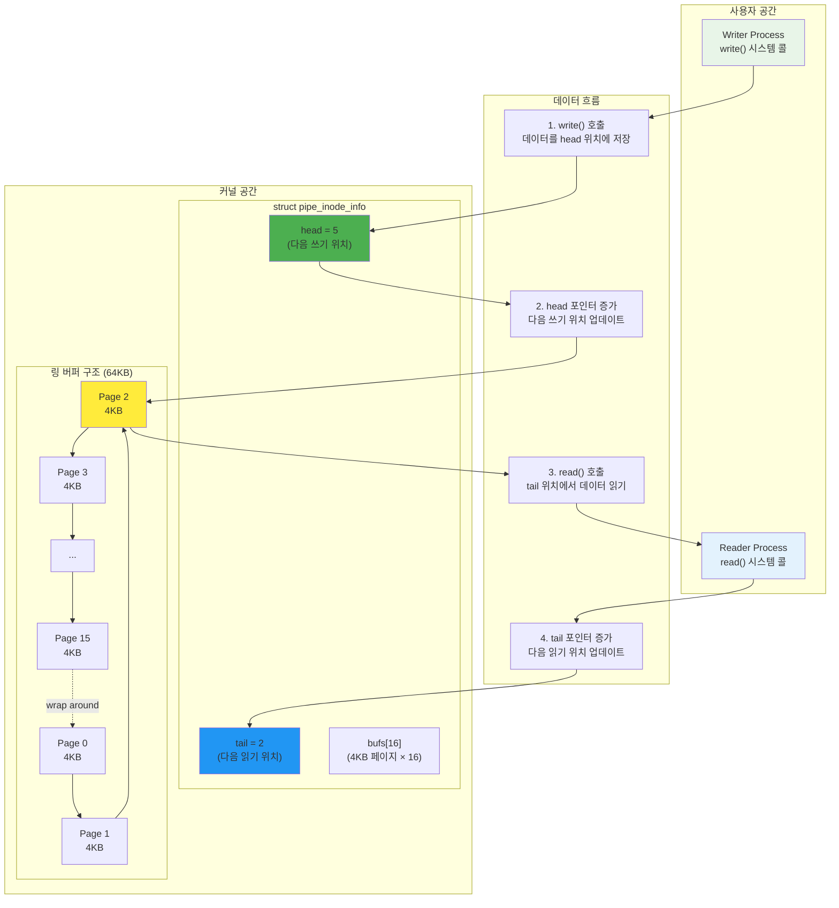
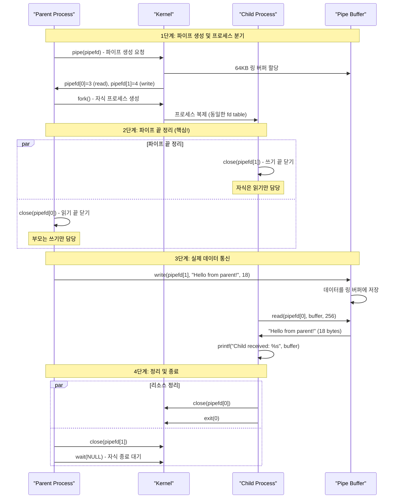
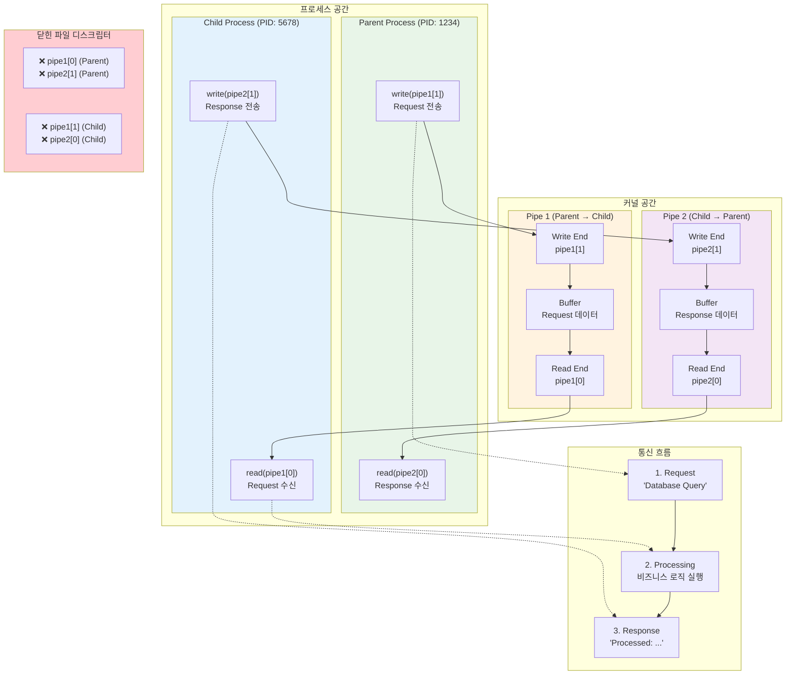
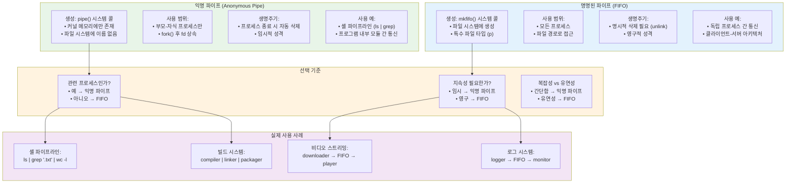
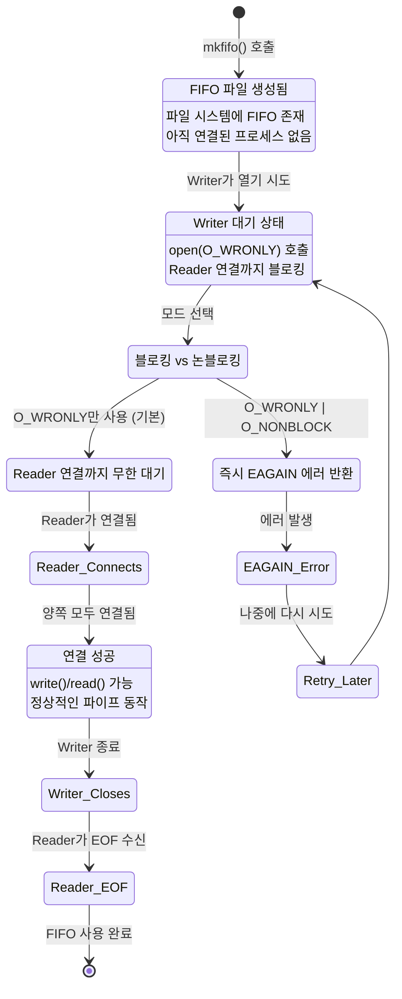

---
tags:
  - FIFO
  - hands-on
  - intermediate
  - medium-read
  - named_pipe
  - pipe
  - pipeline
  - process_communication
  - 시스템프로그래밍
difficulty: INTERMEDIATE
learning_time: "4-6시간"
main_topic: "시스템 프로그래밍"
priority_score: 4
---

# 1.6.2: 파이프와 FIFO

## 🚇 지하철 터널 같은 단방향 통로

파이프는 지하철 터널과 같습니다. 한 쪽으로만 갈 수 있죠.

**왜 파이프가 단방향일까?**

제가 커널 소스를 보고 깨달은 사실:**파이프는 사실상 링 버퍼입니다!**

```c
// 커널 내부 구조 (간략화)
struct pipe_inode_info {
    unsigned int head;    // 쓰기 위치
    unsigned int tail;    // 읽기 위치
    struct page *bufs[16];  // 64KB 버퍼 (4KB * 16)
};

// 단방향인 이유: head와 tail이 하나씩뿐!
```

### 파이프 내부 구조: 링 버퍼의 비밀

파이프가 왜 단방향인지, 그리고 어떻게 64KB라는 크기가 결정되었는지 시각화해보겠습니다:



**핵심 통찰**:

-**단방향인 이유**: head와 tail 포인터가 각각 하나씩만 있어서 한 방향으로만 데이터 흐름 가능
-**64KB 크기**: 4KB 페이지 × 16개 = 효율적인 메모리 관리와 적당한 버퍼링
-**링 버퍼**: 메모리 재사용으로 효율성 극대화, 연속적인 데이터 스트림 처리에 최적

**실제 사용 예: `ls | grep | wc`**

```bash
$ ls -la | grep ".txt" | wc -l
# 42
```

이 명령어가 어떻게 동작하는지 아세요?

## 2.1 익명 파이프: 부모-자식의 비밀 통로

```c
// 기본 파이프
void basic_pipe_example() {
    int pipefd[2];
    char buffer[256];
    
    // 파이프 생성
    if (pipe(pipefd) == -1) {
        perror("pipe");
        exit(1);
    }
    
    pid_t pid = fork();
    
    if (pid == 0) {
        // 자식: 읽기
        close(pipefd[1]);  // 쓰기 끝 닫기
        
        ssize_t n = read(pipefd[0], buffer, sizeof(buffer));
        buffer[n] = '\0';
        printf("Child received: %s\n", buffer);
        
        close(pipefd[0]);
        exit(0);
    } else {
        // 부모: 쓰기
        close(pipefd[0]);  // 읽기 끝 닫기
        
        const char *msg = "Hello from parent!";
        write(pipefd[1], msg, strlen(msg));
        
        close(pipefd[1]);
        wait(NULL);
    }
}

### 익명 파이프 통신 시각화: 부모-자식 단방향 통신

기본적인 pipe() 시스템 콜을 통한 부모-자식 프로세스 간 통신 과정을 시각화해보겠습니다:



**중요한 포인트**:

1.**파이프 끝 닫기**: 사용하지 않는 끝을 반드시 닫아야 EOF 감지 가능
2.**단방향성**: 한 프로세스는 읽기만, 다른 프로세스는 쓰기만 담당
3.**블로킹**: 읽기는 데이터가 있을 때까지, 쓰기는 버퍼에 공간이 있을 때까지 대기

```c
// 양방향 통신: 두 개의 파이프로 풀 듀플렉스 통신 구현
// 실제 예: 웹서버와 CGI 스크립트, 데이터베이스 클라이언트-서버 통신
void bidirectional_pipe() {
    printf("\n=== 양방향 파이프 통신 데모 ===\n");

    // ★ 두 개의 파이프 선언: 양방향 통신을 위해 필요
    // 파이프는 단방향이므로 양방향에는 2개 필요!
    int pipe1[2], pipe2[2];  // pipe1: 부모->자식, pipe2: 자식->부모
    
    printf("[Setup] 두 개의 파이프 생성 시도...\n");
    
    // ★ 1단계: 두 개의 파이프 생성
    if (pipe(pipe1) == -1) {  // 부모 -> 자식 방향
        perror("pipe1 생성 실패");
        exit(1);
    }
    
    if (pipe(pipe2) == -1) {  // 자식 -> 부모 방향  
        perror("pipe2 생성 실패");
        exit(1);
    }
    
    printf("[Setup] 파이프 생성 성공 - pipe1: %d,%d, pipe2: %d,%d\n",
           pipe1[0], pipe1[1], pipe2[0], pipe2[1]);
    
    // ★ 2단계: 프로세스 분기 (fork)
    pid_t pid = fork();
    
    if (pid == 0) {
        // ★ 자식 프로세스 실행 경로
        printf("[자식 %d] 시작 - 요청 및 응답 처리기\n", getpid());
        
        // ★ 3단계: 사용하지 않을 파이프 끝 닫기 (자식 정리)
        // 자식은 pipe1에서 읽고, pipe2에 쓸 예정
        close(pipe1[1]);  // pipe1 쓰기 끝 닫기 (부모가 사용)
        close(pipe2[0]);  // pipe2 읽기 끝 닫기 (부모가 사용)
        
        printf("[자식] 불필요한 파이프 끝 닫기 완료\n");
        
        // ★ 4단계: 부모로부터 요청 수신 (pipe1에서 읽기)
        char request[256];
        printf("[자식] 부모의 요청 대기 중...\n");
        
        ssize_t bytes_read = read(pipe1[0], request, sizeof(request) - 1);
        if (bytes_read > 0) {
            request[bytes_read] = '\0';  // NULL 종료 문자 추가
            printf("[자식] 요청 수신: '%s' (%zd bytes)\n", request, bytes_read);
        } else {
            printf("[자식] 요청 수신 실패 또는 EOF\n");
        }
        
        // ★ 5단계: 요청 처리 (비즈니스 로직)
        // 실제 예: 데이터 베이스 쿼리, 파일 처리, 웹 요청 처리 등
        printf("[자식] 요청 처리 시작...\n");
        
        char response[256];
        snprintf(response, sizeof(response), "Processed: %s [by child %d]", request, getpid());
        
        // 시뮬레이션 처리 지연 (실제 작업 시뮬레이션)
        sleep(1);  // 1초 처리 시간
        printf("[자식] 처리 완료: '%s'\n", response);
        
        // ★ 6단계: 부모에게 응답 전송 (pipe2에 쓰기)
        printf("[자식] 부모에게 응답 전송...\n");
        
        ssize_t bytes_written = write(pipe2[1], response, strlen(response));
        if (bytes_written > 0) {
            printf("[자식] 응답 전송 성공: %zd bytes\n", bytes_written);
        } else {
            perror("[자식] 응답 전송 실패");
        }
        
        // ★ 7단계: 자식 정리 작업
        close(pipe1[0]);  // 읽기용 파이프 닫기
        close(pipe2[1]);  // 쓰기용 파이프 닫기
        
        printf("[자식] 모든 작업 완료 - 종료\n");
        exit(0);
        
    } else if (pid > 0) {
        // ★ 부모 프로세스 실행 경로
        printf("[부모 %d] 시작 - 자식 %d와 통신\n", getpid(), pid);
        
        // ★ 8단계: 사용하지 않을 파이프 끝 닫기 (부모 정리)
        // 부모는 pipe1에 쓰고, pipe2에서 읽을 예정
        close(pipe1[0]);  // pipe1 읽기 끝 닫기 (자식이 사용)
        close(pipe2[1]);  // pipe2 쓰기 끝 닫기 (자식이 사용)
        
        printf("[부모] 불필요한 파이프 끝 닫기 완료\n");
        
        // ★ 9단계: 자식에게 요청 전송 (pipe1에 쓰기)
        const char *request = "Database Query: SELECT * FROM users";
        printf("[부모] 자식에게 요청 전송: '%s'\n", request);
        
        ssize_t bytes_written = write(pipe1[1], request, strlen(request));
        if (bytes_written > 0) {
            printf("[부모] 요청 전송 성공: %zd bytes\n", bytes_written);
        } else {
            perror("[부모] 요청 전송 실패");
        }
        
        // ★ 10단계: 자식으로부터 응답 수신 (pipe2에서 읽기)
        char response[256];
        printf("[부모] 자식의 응답 대기 중...\n");
        
        ssize_t bytes_read = read(pipe2[0], response, sizeof(response) - 1);
        if (bytes_read > 0) {
            response[bytes_read] = '\0';  // NULL 종료 문자 추가
            printf("[부모] 응답 수신: '%s' (%zd bytes)\n", response, bytes_read);
        } else {
            printf("[부모] 응답 수신 실패 또는 EOF\n");
        }
        
        // ★ 11단계: 부모 정리 작업
        close(pipe1[1]);  // 쓰기용 파이프 닫기
        close(pipe2[0]);  // 읽기용 파이프 닫기
        
        // ★ 12단계: 자식 프로세스 종료 대기
        int status;
        pid_t terminated = wait(&status);
        
        if (WIFEXITED(status)) {
            printf("[부모] 자식 %d 정상 종료 (exit code: %d)\n", 
                   terminated, WEXITSTATUS(status));
        } else {
            printf("[부모] 자식 %d 비정상 종료\n", terminated);
        }
        
    } else {
        // fork 실패 처리
        perror("fork 실패");
        close(pipe1[0]); close(pipe1[1]);
        close(pipe2[0]); close(pipe2[1]);
        exit(1);
    }
    
    printf("\n=== 양방향 파이프 통신 완료 ===\n");
}

### 양방향 파이프 통신: 풀 듀플렉스 구현

두 개의 파이프를 사용하여 양방향 통신을 구현하는 방법을 시각화해보겠습니다:



**양방향 통신의 핵심**:

1.**두 개의 파이프**: 각 방향마다 하나씩 필요
2.**파이프 끝 관리**: 사용하지 않는 끝은 반드시 닫기
3.**데드락 방지**: 동시에 읽기/쓰기 시도 시 주의 필요
4.**실무 활용**: 데이터베이스 클라이언트-서버, 웹서버-CGI 스크립트 통신

```c
// 파이프라인 구현
void create_pipeline(char *cmds[], int n) {
    int pipes[n-1][2];

    // 파이프 생성
    for (int i = 0; i < n-1; i++) {
        pipe(pipes[i]);
    }
    
    // 각 명령어에 대한 프로세스 생성
    for (int i = 0; i < n; i++) {
        pid_t pid = fork();
        
        if (pid == 0) {
            // 입력 리다이렉션
            if (i > 0) {
                dup2(pipes[i-1][0], STDIN_FILENO);
            }
            
            // 출력 리다이렉션
            if (i < n-1) {
                dup2(pipes[i][1], STDOUT_FILENO);
            }
            
            // 모든 파이프 닫기
            for (int j = 0; j < n-1; j++) {
                close(pipes[j][0]);
                close(pipes[j][1]);
            }
            
            // 명령 실행
            execlp(cmds[i], cmds[i], NULL);
            exit(1);
        }
    }
    
    // 부모: 모든 파이프 닫기
    for (int i = 0; i < n-1; i++) {
        close(pipes[i][0]);
        close(pipes[i][1]);
    }
    
    // 모든 자식 대기
    for (int i = 0; i < n; i++) {
        wait(NULL);
    }
}
```

## 2.2 명명된 파이프 (FIFO): 우체함 같은 공유 통로

**실제 활용: YouTube 다운로더 + 플레이어**

제가 만든 비디오 스트리밍 시스템:

```c
// 다운로더 프로세스
void video_downloader() {
    mkfifo("/tmp/video_stream", 0666);
    int fifo = open("/tmp/video_stream", O_WRONLY);
    
    while (downloading) {
        char chunk[4096];
        download_chunk(chunk);
        write(fifo, chunk, 4096);  // FIFO로 전달
    }
}

// 플레이어 프로세스 (동시 실행)
void video_player() {
    int fifo = open("/tmp/video_stream", O_RDONLY);
    
    while (playing) {
        char chunk[4096];
        read(fifo, chunk, 4096);  // FIFO에서 읽기
        play_video_chunk(chunk);
    }
}

// 결과: 다운로드와 재생이 동시에! 🎥
```

### FIFO vs 익명 파이프 비교: 언제 무엇을 사용할까?



### 비디오 스트리밍 아키텍처: FIFO 활용 실례

```mermaid
sequenceDiagram
    participant Downloader as "Video Downloader
(독립 프로세스)"
    participant FIFO as "FIFO
/tmp/video_stream"
    participant Player as "Video Player
(독립 프로세스)"
    participant FS as "File System"
    
    Note over Downloader,FS: 초기 설정 단계
    
    Downloader->>FS: mkfifo("/tmp/video_stream", 0666)
    FS->>FS: 특수 파일 생성 (type: p)
    
    par 비동기 프로세스 시작
        Downloader->>FIFO: open("/tmp/video_stream", O_WRONLY)
        Note over Downloader: Writer 대기... (블로킹)
    and
        Player->>FIFO: open("/tmp/video_stream", O_RDONLY)
        Note over Player,FIFO: Reader 연결 완료!
    end
    
    FIFO->>Downloader: 연결 성공 - 쓰기 가능
    
    Note over Downloader,Player: 실시간 스트리밍 단계
    
    loop 비디오 스트리밍
        Downloader->>Downloader: download_chunk() - 4KB 다운로드
        Downloader->>FIFO: write(chunk, 4096)
        FIFO->>Player: chunk 데이터 전달
        Player->>Player: play_video_chunk() - 재생
        
        Note over Downloader,Player: 동시 실행: 다운로드 + 재생
    end
    
    Note over Downloader,Player: 종료 및 정리
    
    Downloader->>FIFO: close() - 더 이상 데이터 없음
    FIFO->>Player: EOF 전달
    Player->>Player: 재생 완료
    Player->>FIFO: close()
    
    Player->>FS: unlink("/tmp/video_stream")
    FS->>FS: FIFO 파일 삭제
```

**실무 인사이트**:

-**실시간 처리**: 다운로드와 재생이 동시에 진행되어 사용자 경험 향상
-**메모리 효율성**: 전체 파일을 메모리에 로드하지 않고 스트리밍
-**프로세스 독립성**: 다운로더와 플레이어가 독립적으로 실행 가능

**FIFO의 함정: Blocking**

```c
// 주의! Reader가 없으면 Writer가 블록됨
int fd = open("/tmp/myfifo", O_WRONLY);
// 여기서 멈춤... reader를 기다림

// 해결책: Non-blocking 모드
int fd = open("/tmp/myfifo", O_WRONLY | O_NONBLOCK);
```

### FIFO 블로킹 동작: Writer가 Reader를 기다리는 이유



### FIFO 블로킹 시나리오 실제 예제

```mermaid
sequenceDiagram
    participant W as "Writer Process"
    participant F as "FIFO (/tmp/myfifo)"
    participant R as "Reader Process"
    participant K as "Kernel"
    
    Note over W,K: 시나리오 1: 블로킹 모드 (기본)
    
    W->>F: mkfifo("/tmp/myfifo", 0666)
    F->>F: FIFO 파일 생성
    
    W->>K: open("/tmp/myfifo", O_WRONLY)
    K->>K: Reader 확인... 없음!
    Note over W,K: ⏳ Writer 블로킹 대기 시작
    
    rect rgb(255, 235, 238)
        Note over W: Writer 프로세스 완전 정지
Reader가 나타날 때까지 무한 대기
    end
    
    R->>K: open("/tmp/myfifo", O_RDONLY)
    K->>K: Writer 존재 확인!
    K->>W: 연결 성공! open() 반환
    K->>R: 연결 성공! open() 반환
    
    Note over W,R: ✅ 이제 정상적인 통신 가능
    
    W->>F: write("Hello FIFO!", 11)
    F->>R: read() - "Hello FIFO!"
    
    Note over W,K: 시나리오 2: 논블로킹 모드
    
    W->>K: open("/tmp/myfifo", O_WRONLY | O_NONBLOCK)
    K->>K: Reader 확인... 없음!
    K->>W: EAGAIN 에러 즉시 반환
    
    W->>W: 다른 작업 수행 가능
    W->>K: 주기적으로 재시도
    
    R->>K: open("/tmp/myfifo", O_RDONLY)
    
    W->>K: open("/tmp/myfifo", O_WRONLY | O_NONBLOCK)
    K->>W: 성공! Reader 존재함
```

**실무 교훈**:

1.**기본은 블로킹**: FIFO는 기본적으로 상대방이 올 때까지 대기
2.**논블로킹 활용**: 응답성이 중요한 애플리케이션에서는 O_NONBLOCK 사용
3.**타임아웃 고려**: select()나 poll()과 함께 사용하여 타임아웃 구현
4.**에러 처리**: EAGAIN, EPIPE 등 FIFO 특유의 에러 상황 대비

```c
// FIFO 생성과 사용
void named_pipe_example() {
    const char *fifo_path = "/tmp/myfifo";
    
    // FIFO 생성
    if (mkfifo(fifo_path, 0666) == -1) {
        if (errno != EEXIST) {
            perror("mkfifo");
            exit(1);
        }
    }
    
    pid_t pid = fork();
    
    if (pid == 0) {
        // 자식: 리더
        int fd = open(fifo_path, O_RDONLY);
        char buffer[256];
        
        while (1) {
            ssize_t n = read(fd, buffer, sizeof(buffer)-1);
            if (n <= 0) break;
            
            buffer[n] = '\0';
            printf("Received: %s\n", buffer);
        }
        
        close(fd);
        exit(0);
    } else {
        // 부모: 라이터
        int fd = open(fifo_path, O_WRONLY);
        
        for (int i = 0; i < 5; i++) {
            char msg[256];
            sprintf(msg, "Message %d", i);
            write(fd, msg, strlen(msg));
            sleep(1);
        }
        
        close(fd);
        wait(NULL);
        
        // FIFO 삭제
        unlink(fifo_path);
    }
}

// 비블로킹 FIFO
void nonblocking_fifo() {
    const char *fifo_path = "/tmp/nonblock_fifo";
    mkfifo(fifo_path, 0666);
    
    // 비블로킹 모드로 열기
    int fd = open(fifo_path, O_RDONLY | O_NONBLOCK);
    
    while (1) {
        char buffer[256];
        ssize_t n = read(fd, buffer, sizeof(buffer));
        
        if (n > 0) {
            buffer[n] = '\0';
            printf("Data: %s\n", buffer);
        } else if (n == 0) {
            printf("No writers\n");
            break;
        } else if (errno == EAGAIN) {
            printf("No data available\n");
            usleep(100000);  // 100ms 대기
        } else {
            perror("read");
            break;
        }
    }
    
    close(fd);
    unlink(fifo_path);
}
```

## 실전 파이프 활용 패턴

### 1. 로그 처리 파이프라인

```c
// 실시간 로그 모니터링
void create_log_pipeline() {
    char *commands[] = {
        "tail", "-f", "/var/log/system.log",  // 실시간 로그 읽기
        "grep", "ERROR",                       // 에러만 필터링
        "awk", "{print $1, $2, $NF}",         // 시간과 메시지만 추출
        "tee", "/tmp/errors.log"               // 파일로도 저장
    };
    
    // 4단계 파이프라인 생성
    create_pipeline(commands, 4);
}
```

### 2. 백업 스트리밍

```c
// 실시간 압축 백업
void streaming_backup() {
    int pipefd[2];
    pipe(pipefd);
    
    if (fork() == 0) {
        // 자식: 압축기
        close(pipefd[1]);
        dup2(pipefd[0], STDIN_FILENO);
        execlp("gzip", "gzip", "-c", NULL);
    } else {
        // 부모: 데이터 생산
        close(pipefd[0]);
        
        FILE *input = fopen("largefile.dat", "rb");
        char buffer[4096];
        size_t bytes;
        
        while ((bytes = fread(buffer, 1, sizeof(buffer), input)) > 0) {
            write(pipefd[1], buffer, bytes);
        }
        
        close(pipefd[1]);
        fclose(input);
        wait(NULL);
    }
}
```

### 3. 프로세스 풀 관리

```c
// 워커 프로세스 풀과 작업 분배
typedef struct {
    pid_t pid;
    int request_pipe;
    int response_pipe;
    int busy;
} worker_t;

void worker_pool_manager(int num_workers) {
    worker_t workers[num_workers];
    
    // 워커 프로세스들 생성
    for (int i = 0; i < num_workers; i++) {
        int req_pipe[2], resp_pipe[2];
        pipe(req_pipe);
        pipe(resp_pipe);
        
        pid_t pid = fork();
        if (pid == 0) {
            // 워커 프로세스
            close(req_pipe[1]);
            close(resp_pipe[0]);
            
            worker_process(req_pipe[0], resp_pipe[1]);
            exit(0);
        } else {
            // 관리자
            workers[i].pid = pid;
            workers[i].request_pipe = req_pipe[1];
            workers[i].response_pipe = resp_pipe[0];
            workers[i].busy = 0;
            
            close(req_pipe[0]);
            close(resp_pipe[1]);
        }
    }
    
    // 작업 분배 로직
    distribute_work(workers, num_workers);
}
```

## 핵심 요점

### 1. 파이프는 단방향 스트림이다

한 번에 한 방향으로만 데이터가 흐를 수 있으며, 양방향 통신에는 두 개의 파이프가 필요하다.

### 2. FIFO는 파일 시스템에 존재한다

익명 파이프와 달리 FIFO는 파일 시스템에 이름을 가지므로 관련 없는 프로세스들도 통신할 수 있다.

### 3. 블로킹에 주의하라

FIFO를 열 때나 읽기/쓰기 시 블로킹이 발생할 수 있으므로 논블로킹 모드를 고려해야 한다.

### 4. 파이프라인은 Unix의 철학이다

"하나의 일을 잘하는 작은 프로그램들을 연결"하는 Unix 철학의 핵심 구현체다.

---

**이전**: [1.1.4 시그널 기초](./01-01-04-signals-basics.md)  
**다음**: [1.6.3 메시지 큐와 공유 메모리](./01-06-03-message-queues-shared-memory.md)에서 고성능 IPC 메커니즘을 학습합니다.

## 📚 관련 문서

### 📖 현재 문서 정보

-**난이도**: INTERMEDIATE
-**주제**: 시스템 프로그래밍
-**예상 시간**: 4-6시간

### 🎯 학습 경로

- [📚 INTERMEDIATE 레벨 전체 보기](../learning-paths/intermediate/)
- [🏠 메인 학습 경로](../learning-paths/)
- [📋 전체 가이드 목록](../README.md)

### 📂 같은 챕터 (chapter-01-process-thread)

- [1.2.1: 프로세스 생성과 종료 개요](./01-02-01-process-creation.md)
- [1.2.2: fork() 시스템 콜과 프로세스 복제 메커니즘](./01-02-02-process-creation-fork.md)
- [1.2.3: exec() 패밀리와 프로그램 교체 메커니즘](./01-02-03-program-replacement-exec.md)
- [1.2.4: 프로세스 종료와 좀비 처리](./01-02-04-process-termination-zombies.md)
- [1.5.1: 프로세스 관리와 모니터링](./01-05-01-process-management-monitoring.md)

### 🏷️ 관련 키워드

`pipe`, `FIFO`, `named_pipe`, `process_communication`, `pipeline`

### ⏭️ 다음 단계 가이드

- 실무 적용을 염두에 두고 프로젝트에 적용해보세요
- 관련 도구들을 직접 사용해보는 것이 중요합니다
