---
tags:
  - cache-optimization
  - cpu-affinity
  - hands-on
  - intermediate
  - medium-read
  - numa
  - performance-tuning
  - process-scheduling
  - 시스템프로그래밍
difficulty: INTERMEDIATE
learning_time: "4-6시간"
main_topic: "시스템 프로그래밍"
priority_score: 4
---

# 1.6.7: CPU 친화도 기초

## CPU 친화도의 개념과 필요성

"게임 서버를 운영하고 있는데 레이턴시가 일정하지 않아서 문제가 되고 있어요. 특히 멀티코어 환경에서 프로세스가 여러 CPU 코어 사이를 옮겨다니면서 캐시 미스가 발생하는 것 같습니다."

이런 상황에서 CPU 친화도(CPU Affinity)는 핵심적인 해결책입니다.

```mermaid
graph TD
    A[멀티코어 시스템] --> B[CPU 스케줄러]
    B --> C{CPU 친화도 설정}
    C -->|미설정| D[자동 로드밸런싱]
    C -->|설정됨| E[특정 코어 할당]

    D --> F[캐시 미스 증가]
    D --> G[레이턴시 변동]
    D --> H[NUMA 오버헤드]

    E --> I[캐시 친화도 개선]
    E --> J[예측 가능한 성능]
    E --> K[NUMA 최적화]

    subgraph "CPU 코어 구조"
        L1[L1 캐시]
        L2[L2 캐시]
        L3[L3 캐시 공유]
        NUMA[NUMA 노드]
    end
```



## CPU 친화도 분석 도구

먼저 현재 프로세스의 CPU 친화도를 분석하는 도구를 만들어보겠습니다.

```c
// cpu_affinity_analyzer.c
#define _GNU_SOURCE
#include <stdio.h>
#include <stdlib.h>
#include <unistd.h>
#include <sched.h>
#include <errno.h>
#include <string.h>
#include <sys/time.h>
#include <pthread.h>
#include <numa.h>
#include <sys/syscall.h>

typedef struct {
    int cpu_count;
    int numa_nodes;
    cpu_set_t original_affinity;
    cpu_set_t current_affinity;
} cpu_topology_t;

typedef struct {
    int cpu_id;
    unsigned long migrations;
    unsigned long cache_misses;
    double avg_latency;
    int numa_node;
} cpu_stats_t;

// CPU 토폴로지 정보 수집
cpu_topology_t* get_cpu_topology() {
    // ⭐ 1단계: 토폴로지 구조체 메모리 할당
    // - 시스템의 CPU 구성 정보를 저장할 구조체 준비
    cpu_topology_t* topo = malloc(sizeof(cpu_topology_t));

    // ⭐ 2단계: 온라인 CPU 개수 확인
    // - _SC_NPROCESSORS_ONLN: 현재 사용 가능한(온라인) CPU 코어 수
    // - 하이퍼스레딩이 활성화된 경우 논리적 코어 수 포함
    topo->cpu_count = sysconf(_SC_NPROCESSORS_ONLN);

    // ⭐ 3단계: NUMA(Non-Uniform Memory Access) 노드 개수 확인
    // - NUMA: 메모리 접근 속도가 CPU 위치에 따라 다른 아키텍처
    // - 대규모 서버에서 메모리 지역성 최적화에 중요
    if (numa_available() >= 0) {
        topo->numa_nodes = numa_max_node() + 1;  // 0부터 시작하므로 +1
    } else {
        topo->numa_nodes = 1;  // NUMA 미지원 시 단일 노드로 설정
    }

    // ⭐ 4단계: 현재 프로세스의 CPU 친화도 마스크 확인
    // - sched_getaffinity(): 프로세스가 실행 가능한 CPU 목록 조회
    // - CPU 친화도: 특정 CPU에서만 실행되도록 제한하는 기능
    if (sched_getaffinity(0, sizeof(cpu_set_t), &topo->original_affinity) == -1) {
        perror("sched_getaffinity");
        free(topo);
        return NULL;
    }

    // ⭐ 5단계: 원본 친화도를 현재 친화도로 복사
    // - 나중에 원복할 수 있도록 원본 설정 보존
    topo->current_affinity = topo->original_affinity;

    return topo;
}

// CPU 마이그레이션 통계 수집
void collect_migration_stats(int pid, cpu_stats_t* stats, int cpu_count) {
    char stat_path[256];
    FILE* fp;

    // ⭐ 1단계: /proc/[pid]/stat 파일에서 현재 실행 CPU 확인
    // - /proc 파일시스템: 커널 내부 정보를 파일 형태로 제공
    // - stat 파일: 프로세스의 상태 및 통계 정보
    snprintf(stat_path, sizeof(stat_path), "/proc/%d/stat", pid);
    fp = fopen(stat_path, "r");

    if (fp) {
        // ⭐ 2단계: stat 파일 포맷 파싱
        // - /proc/[pid]/stat: 공백으로 구분된 44개 필드
        // - 39번째 필드(0부터 시작하면 38): 현재 실행 중인 CPU 번호
        long processor, voluntary_ctxt_switches, nonvoluntary_ctxt_switches;

        // ⭐ 3단계: 39번째 필드까지 건너뛰기
        // - fscanf("%*s"): 문자열을 읽지만 저장하지 않음 (건너뛰기)
        for (int i = 0; i < 38; i++) {
            fscanf(fp, "%*s");
        }
        fscanf(fp, "%ld", &processor);  // 현재 CPU 번호 읽기

        stats[processor].cpu_id = processor;

        fclose(fp);
    }

    // ⭐ 4단계: /proc/[pid]/status에서 컨텍스트 스위치 통계
    // - voluntary_ctxt_switches: 자발적 컨텍스트 스위치 (I/O 대기 등)
    // - CPU 마이그레이션의 간접적 지표로 활용
    snprintf(stat_path, sizeof(stat_path), "/proc/%d/status", pid);
    fp = fopen(stat_path, "r");

    if (fp) {
        char line[256];
        while (fgets(line, sizeof(line), fp)) {
            // ⭐ 5단계: voluntary_ctxt_switches 라인 찾기
            // - 문자열 비교를 통한 특정 통계 항목 추출
            if (strncmp(line, "voluntary_ctxt_switches:", 24) == 0) {
                sscanf(line + 24, "%lu", &stats[processor].migrations);
            }
        }
        fclose(fp);
    }
}

// 캐시 미스 측정 (perf events 사용)
void measure_cache_performance(int cpu_id, cpu_stats_t* stats) {
    // ⭐ 1단계: 캐시 성능 측정을 위한 초기 설정
    // - 메모리 접근 패턴을 통한 간접적 캐시 성능 측정
    struct timeval start, end;
    const int iterations = 1000000;  // 100만 번 반복으로 안정적 측정
    volatile int sum = 0;  // 컴파일러 최적화 방지

    // ⭐ 2단계: 특정 CPU에 현재 스레드 바인딩
    // - CPU 친화도 설정으로 일관된 캐시 환경 보장
    // - 다른 CPU로 마이그레이션되면 캐시 미스 발생
    cpu_set_t cpuset;
    CPU_ZERO(&cpuset);           // 비트마스크 초기화
    CPU_SET(cpu_id, &cpuset);    // 특정 CPU 비트 설정
    sched_setaffinity(0, sizeof(cpu_set_t), &cpuset);  // 현재 스레드에 적용

    // ⭐ 3단계: 성능 측정 시작 시점 기록
    gettimeofday(&start, NULL);

    // ⭐ 4단계: 메모리 접근 패턴 테스트
    // - 4MB 배열: L3 캐시 크기를 넘어서는 크기로 캐시 미스 유도
    // - 순차 접근: 캐시 라인 프리페칭 효과 측정
    int* data = malloc(1024 * 1024 * sizeof(int)); // 4MB 배열
    for (int i = 0; i < iterations; i++) {
        // ⭐ 모듈로 연산으로 배열 전체를 반복 접근
        // - 캐시 지역성과 메모리 대역폭 특성 측정
        sum += data[i % (1024 * 1024)];
    }

    // ⭐ 5단계: 성능 측정 종료 및 지연시간 계산
    gettimeofday(&end, NULL);

    // ⭐ 6단계: 마이크로초 단위 지연시간 계산
    // - 초 단위 차이를 마이크로초로 변환 후 마이크로초 차이 합산
    double latency = (end.tv_sec - start.tv_sec) * 1000000.0 +
                    (end.tv_usec - start.tv_usec);
    stats[cpu_id].avg_latency = latency / iterations;  // 평균 접근 지연시간

    free(data);
}

// NUMA 노드 정보 수집
void collect_numa_info(cpu_stats_t* stats, int cpu_count) {
    if (numa_available() < 0) {
        for (int i = 0; i < cpu_count; i++) {
            stats[i].numa_node = 0;
        }
        return;
    }

    for (int i = 0; i < cpu_count; i++) {
        stats[i].numa_node = numa_node_of_cpu(i);
    }
}

// CPU 친화도 최적화 추천
void recommend_cpu_affinity(cpu_topology_t* topo, cpu_stats_t* stats) {
    printf("\n=== CPU 친화도 최적화 추천 ===\n");

    // ⭐ 1단계: 가장 낮은 레이턴시를 가진 CPU 찾기
    // - 레이턴시: 메모리 접근에서 데이터 반환까지의 시간
    // - 낮은 레이턴시 = 더 빠른 캐시 접근 속도
    int best_cpu = 0;
    double best_latency = stats[0].avg_latency;

    // ⭐ 2단계: 전체 CPU에서 최저 레이턴시 CPU 탐색
    for (int i = 1; i < topo->cpu_count; i++) {
        if (stats[i].avg_latency < best_latency) {
            best_latency = stats[i].avg_latency;
            best_cpu = i;
        }
    }

    // ⭐ 3단계: 최적 CPU의 성능 지표 출력
    // - 마이크로초(μs) 단위로 레이턴시 표시
    printf("최적 CPU: %d (평균 레이턴시: %.2f μs)\n",
           best_cpu, best_latency);
    printf("NUMA 노드: %d\n", stats[best_cpu].numa_node);

    // ⭐ 4단계: CPU 세트 추천 섹션
    printf("\n추천 CPU 세트:\n");

    // ⭐ 5단계: 같은 NUMA 노드의 CPU들 나열
    // - NUMA 지역성: 같은 노드내 메모리 접근이 더 빠름
    // - 캐시 일관성: 같은 노드내 CPU들은 L3 캐시 공유 가능
    printf("같은 NUMA 노드 CPU들: ");
    for (int i = 0; i < topo->cpu_count; i++) {
        if (stats[i].numa_node == stats[best_cpu].numa_node) {
            printf("%d ", i);
        }
    }
    printf("\n");

    // ⭐ 6단계: taskset 명령어 예시 생성
    // - taskset: Linux에서 CPU 친화도를 설정하는 도구
    // - -c 옵션: CPU 목록을 쉽게 읽을 수 있는 형태로 지정
    printf("\ntaskset 명령어:\n");
    printf("taskset -c %d your_program\n", best_cpu);  // 단일 CPU 바인딩
    printf("taskset -c %d-%d your_program  # NUMA 노드 전체\n",
           best_cpu, best_cpu + (topo->cpu_count / topo->numa_nodes) - 1);
}

// 실시간 CPU 사용률 모니터링
void monitor_cpu_usage(int target_pid, int duration) {
    printf("\n=== 실시간 CPU 사용률 모니터링 ===\n");

    // ⭐ 1단계: 지정된 시간 동안 모니터링 루프
    // - 매초 프로세스의 CPU 사용 현황 추적
    // - CPU 마이그레이션 패턴 관찰 및 친화도 설정 효과 검증
    for (int i = 0; i < duration; i++) {
        char stat_path[256];
        FILE* fp;
        long processor;

        // ⭐ 2단계: 매초마다 /proc/[pid]/stat 파일 열기
        snprintf(stat_path, sizeof(stat_path), "/proc/%d/stat", target_pid);
        fp = fopen(stat_path, "r");

        if (fp) {
            // ⭐ 3단계: 현재 실행 중인 CPU 번호 추출
            // - 39번째 필드: processor - 현재 실행 중인 CPU
            // - 스케줄러에 의해 업데이트되는 실시간 정보
            for (int j = 0; j < 38; j++) {
                fscanf(fp, "%*s");  // 앞의 38개 필드 건너뛰기
            }
            fscanf(fp, "%ld", &processor);

            // ⭐ 4단계: 시간스탬프와 함께 CPU 정보 출력
            // - 마이그레이션 패턴 관찰을 위한 시간순 데이터
            printf("시간 %d초: CPU %ld에서 실행 중\n", i + 1, processor);
            fclose(fp);
        }

        // ⭐ 5단계: 1초 대기 후 다음 반복
        // - 샘플링 주기: 너무 짧으면 오버헤드, 너무 길면 마이그레이션 놓침
        sleep(1);
    }
}

int main(int argc, char* argv[]) {
    if (argc < 2) {
        printf("사용법: %s <PID> [모니터링_시간]\n", argv[0]);
        return 1;
    }

    int target_pid = atoi(argv[1]);
    int monitor_duration = (argc > 2) ? atoi(argv[2]) : 10;

    printf("=== CPU 친화도 분석기 ===\n");
    printf("대상 PID: %d\n", target_pid);

    // CPU 토폴로지 정보 수집
    cpu_topology_t* topo = get_cpu_topology();
    if (!topo) {
        return 1;
    }

    printf("CPU 코어 수: %d\n", topo->cpu_count);
    printf("NUMA 노드 수: %d\n", topo->numa_nodes);

    // CPU 통계 초기화
    cpu_stats_t* stats = calloc(topo->cpu_count, sizeof(cpu_stats_t));

    // 현재 친화도 출력
    printf("\n현재 CPU 친화도: ");
    for (int i = 0; i < topo->cpu_count; i++) {
        if (CPU_ISSET(i, &topo->current_affinity)) {
            printf("%d ", i);
        }
    }
    printf("\n");

    // NUMA 정보 수집
    collect_numa_info(stats, topo->cpu_count);

    // 각 CPU에서 성능 측정
    printf("\n=== CPU 성능 측정 중 ===\n");
    for (int i = 0; i < topo->cpu_count; i++) {
        if (CPU_ISSET(i, &topo->current_affinity)) {
            printf("CPU %d 측정 중...\n", i);
            measure_cache_performance(i, stats);
            printf("CPU %d: 평균 레이턴시 %.2f μs, NUMA 노드 %d\n",
                   i, stats[i].avg_latency, stats[i].numa_node);
        }
    }

    // 마이그레이션 통계 수집
    collect_migration_stats(target_pid, stats, topo->cpu_count);

    // 최적화 추천
    recommend_cpu_affinity(topo, stats);

    // 실시간 모니터링
    if (monitor_duration > 0) {
        monitor_cpu_usage(target_pid, monitor_duration);
    }

    free(stats);
    free(topo);

    return 0;
}
```

## 핵심 요점

### 1. CPU 친화도의 필요성

현대 멀티코어 시스템에서 프로세스 마이그레이션은 캐시 미스와 NUMA 오버헤드를 야기합니다.

### 2. 분석 도구의 중요성

시스템 상태를 정확히 파악해야 올바른 최적화 전략을 수립할 수 있습니다.

### 3. NUMA 아키텍처 고려

대규모 서버에서는 메모리 지역성이 성능에 큰 영향을 미칩니다.

---

**이전**: [CPU 친화도 최적화 개요](./01-04-04-cpu-affinity.md)  
**다음**: [Bash 스크립트를 통한 친화도 관리](./01-06-05-cpu-affinity-scripts.md)에서 실용적인 관리 도구를 학습합니다.

## 📚 관련 문서

### 📖 현재 문서 정보

- **난이도**: INTERMEDIATE
- **주제**: 시스템 프로그래밍
- **예상 시간**: 4-6시간

### 🎯 학습 경로

- [📚 INTERMEDIATE 레벨 전체 보기](../learning-paths/intermediate/)
- [🏠 메인 학습 경로](../learning-paths/)
- [📋 전체 가이드 목록](../README.md)

### 📂 같은 챕터 (chapter-01-process-thread)

- [Chapter 4-1: 프로세스 생성과 종료 개요](./01-02-01-process-creation.md)
- [Chapter 4-1A: fork() 시스템 콜과 프로세스 복제 메커니즘](./01-02-02-process-creation-fork.md)
- [Chapter 4-1B: exec() 패밀리와 프로그램 교체 메커니즘](./01-02-03-program-replacement-exec.md)
- [Chapter 4-1C: 프로세스 종료와 좀비 처리](./01-02-04-process-termination-zombies.md)
- [Chapter 4-1D: 프로세스 관리와 모니터링](./01-05-01-process-management-monitoring.md)

### 🏷️ 관련 키워드

`cpu-affinity`, `numa`, `cache-optimization`, `process-scheduling`, `performance-tuning`

### ⏭️ 다음 단계 가이드

- 실무 적용을 염두에 두고 프로젝트에 적용해보세요
- 관련 도구들을 직접 사용해보는 것이 중요합니다
