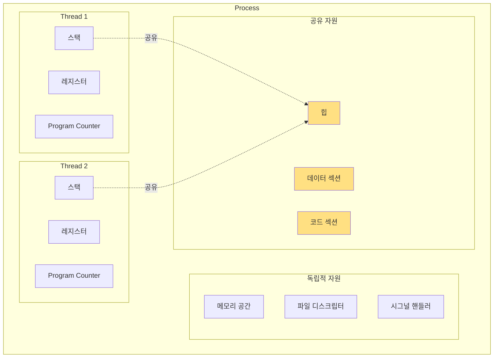

---
tags:
  - balanced
  - clone()
  - context_switch
  - fundamentals
  - medium-read
  - pthread
  - task_struct
  - thread
  - 시스템프로그래밍
difficulty: FUNDAMENTALS
learning_time: "4-6시간"
main_topic: "시스템 프로그래밍"
priority_score: 4
---

# 1.1a 스레드의 본질과 기초 구현

## 🎭 실리콘밸리 스타트업의 악몽

2019년, 한 스타트업이 하루 만에 500만 달러를 날려먹었습니다.

금융 거래 시스템에서 발생한 레이스 컨디션(Race Condition) 때문이었죠. 두 스레드가 같은 계좌 잔액을 동시에 읽고, 각자 출금을 진행한 결과, 잔액이 마이너스가 되어도 출금이 계속되었습니다. 😱

```python
# 문제의 코드 (Python으로 표현)
def withdraw(account, amount):
    balance = account.get_balance()  # Thread 1: 1000원 읽음
                                     # Thread 2: 1000원 읽음 (동시에!)
    if balance >= amount:
        # Thread 1: 800원 출금 가능 판단
        # Thread 2: 700원 출금 가능 판단
        account.set_balance(balance - amount)
        # Thread 1: 잔액을 200원으로 설정
        # Thread 2: 잔액을 300원으로 설정 (덮어씀!)
        return True
    return False
```

이게 바로 동시성 프로그래밍의 무서운 점입니다. 99.99%는 정상 작동하다가, 0.01%의 타이밍에 모든 것이 무너질 수 있죠.

## 왜 그럼에도 스레드를 쓸까?

제가 게임 엔진을 개발할 때의 일입니다. 물리 엔진, 렌더링, AI, 네트워킹을 모두 하나의 스레드에서 처리하니 FPS가 15를 넘지 못했습니다. 하지만 멀티스레딩을 도입하자:

- **물리 엔진**: 별도 스레드에서 60Hz로 시뮬레이션
- **렌더링**: 메인 스레드에서 GPU와 통신
- **AI**: 워커 스레드 풀에서 병렬 처리
- **네트워킹**: I/O 스레드에서 비동기 처리

결과? **FPS가 15에서 120으로 증가!** 🚀

하지만 대가가 있었습니다. 디버깅 지옥이 시작된 거죠. 물리 객체가 간헐적으로 벽을 통과하고, 캐릭터가 가끔 하늘로 날아가고, 세이브 파일이 깨지고...

## 프로세스 vs 스레드: 아파트 vs 룸메이트

프로세스와 스레드의 관계를 설명할 때 저는 이런 비유를 씁니다:

**프로세스 = 독립된 아파트**

- 각자의 주방(힙), 거실(데이터), 침실(스택)이 있음
- 이웃집 일에 영향받지 않음 (메모리 보호)
- 이사(context switch) 비용이 큼

**스레드 = 룸메이트**

- 주방과 거실은 공유, 침실(스택)만 각자 소유
- 한 명이 주방을 어지르면 모두가 피해 (공유 메모리 문제)
- 방 옮기기(context switch)는 쉬움

실제로 성능을 측정해보면:

```c
// ⭐ 프로세스 vs 스레드 생성 비용 벤치마크 - 이론과 실제 성능 차이의 수치적 분석
// 실제 동작: fork() vs pthread_create()의 생성 오버헤드를 1000번 반복 측정하여 평균 비용 산출
// 활용 목적: 동일 작업을 다른 방식으로 처리할 때의 성능 차이 비교 분석
#include <time.h>
#include <sys/wait.h>

// ⭐ 1단계: 프로세스 생성 성능 측정 - fork()의 실제 리소스 소모량 분석
void benchmark_process_creation() {
    struct timespec start, end;
    // ⭐ 높은 정밀도 시간 측정 시작 - CLOCK_MONOTONIC으로 시스템 시간 변경 영향 없음
    clock_gettime(CLOCK_MONOTONIC, &start);
    
    // ⭐ 2단계: 1000개 프로세스 생성/삭제 사이클 - 실제 서버의 CGI/FastCGI 모델과 유사
    for (int i = 0; i < 1000; i++) {
        pid_t pid = fork();  // ⭐ 새 프로세스 생성: 전체 메모리 주소 공간을 복사 (COW 기법 사용)
        if (pid == 0) {
            exit(0);  // ⭐ 자식 프로세스: 즉시 종료 (순수 오버헤드만 측정하기 위해)
        } else {
            // ⭐ 부모 프로세스: 자식 종료까지 대기 (context switch 및 리소스 정리 포함)
            waitpid(pid, NULL, 0);  // ⭐ 좀비 프로세스 방지를 위한 필수 대기
        }
        // 각 fork() 호출마다 발생하는 커널 작업:
        // - 새 task_struct 생성, 페이지 테이블 복사, PCB 초기화
        // - 파일 디스크립터 테이블 복사, 시그널 핸들러 설정
    }
    
    // ⭐ 3단계: 정확한 시간 산출 및 성능 지표 계산
    clock_gettime(CLOCK_MONOTONIC, &end);
    long ns = (end.tv_sec - start.tv_sec) * 1000000000 + 
              (end.tv_nsec - start.tv_nsec);  // 나노초 단위로 정밀 계산
    printf("프로세스 생성: %ld ns/개\n", ns / 1000);
    // ⭐ 예상 결과: ~500,000 ns/개 (0.5ms) - 메모리 복사와 커널 자료구조 초기화 비용 포함
}

// ⭐ 4단계: 스레드 생성 성능 측정 - pthread_create()의 효율성 검증
void benchmark_thread_creation() {
    struct timespec start, end;
    clock_gettime(CLOCK_MONOTONIC, &start);
    
    // ⭐ 5단계: 1000개 스레드 생성/종료 사이클 - 현대 웹서버의 스레드 풀 모델 시뮬레이션
    for (int i = 0; i < 1000; i++) {
        pthread_t thread;
        // ⭐ 스레드 생성: clone() 시스템 콜로 메모리 공유 실행 단위 생성
        pthread_create(&thread, NULL, empty_func, NULL);
        // 각 pthread_create() 호출마다 발생하는 작업:
        // - 새 스택 메모리 할당 (기본 8MB), TLS(Thread Local Storage) 초기화
        // - thread_struct 생성, 스케줄러에 새 실행 단위 등록
        // - 메모리 공간(mm_struct)은 공유 → 복사 오버헤드 없음!
        
        // ⭐ 스레드 종료 대기: 리소스 정리를 위한 동기화
        pthread_join(thread, NULL);  // 스레드 종료까지 대기 + 메모리 리소스 회수
    }
    
    clock_gettime(CLOCK_MONOTONIC, &end);
    long ns = (end.tv_sec - start.tv_sec) * 1000000000 + 
              (end.tv_nsec - start.tv_nsec);
    printf("스레드 생성: %ld ns/개\n", ns / 1000);
    // ⭐ 예상 결과: ~25,000 ns/개 (0.025ms) - 메모리 공유로 복사 비용 없음
    
    // ⭐ 성능 분석 결과 해석:
    // 1) 스레드가 20배 빠른 이유: 메모리 공간 공유로 복사 오버헤드 제거
    // 2) 단점: 공유 데이터로 인한 동기화 문제와 디버깅 복잡성 증가
    // 3) 실용성: 웹서버에서 초당 40,000 스레드 vs 2,000 프로세스 처리 가능
}
```

**스레드가 프로세스보다 20배 빠릅니다!** 💨



## 스레드 구현 (Linux): 커널의 비밀

리눅스 커널 개발자들의 천재적인 발상: **"스레드? 그냥 메모리 공유하는 프로세스 아니야?"**

실제로 리눅스에서는 프로세스와 스레드를 구분하지 않습니다. 모두 `task_struct`로 표현되죠. 차이는 단지 무엇을 공유하느냐뿐!

```c
// ⭐ 커널 레벨 스레드 구조체 - Linux의 통합된 프로세스/스레드 모델
// 실제 동작: 리눅스에서 프로세스와 스레드를 동일한 task_struct로 관리하는 천재적 설계
// 핵심 개념: 공유 자원의 범위에 따라 프로세스/스레드 구분이 결정됨
struct task_struct {
    // ⭐ 1단계: 식별자 필드 - 프로세스/스레드 공통 ID 체계
    pid_t pid;   // Process ID: 커널 내부에서 사용하는 고유 식별자
    pid_t tgid;  // Thread Group ID: 사용자 공간에서 보는 프로세스 ID
                 // 중요: 메인 스레드의 tgid = pid, 다른 스레드들은 메인의 tgid를 공유
    
    // ⭐ 2단계: 스레드별 고유 자원 - 실행 컨텍스트와 스택 영역
    struct thread_struct thread;  // CPU 레지스터 상태 (PC, SP, 상태 레지스터 등)
                                  // Context Switch 시 저장/복원되는 하드웨어 상태
    void *stack;                  // 스레드 전용 스택 영역 포인터 (기본 8MB)
                                  // 지역 변수, 함수 호출 스택, 리턴 주소 등 저장
    
    // ⭐ 3단계: 공유 자원 - 같은 스레드 그룹 내에서 공유되는 커널 자료구조
    struct mm_struct *mm;          // 메모리 디스크립터: 가상 메모리 맵핑, 힘, 스택 영역 정보
                                   // 같은 주소 공간을 공유 → 데이터 적어지 및 경쟁 상태 발생 가능
    struct files_struct *files;    // 파일 디스크립터 테이블: open() 호출로 열린 모든 파일
                                   // 한 스레드에서 열면 다른 스레드에서도 접근 가능
    struct signal_struct *signal;  // 시그널 핸들러: SIGINT, SIGTERM 등의 시그널 처리 방식
                                   // 전체 스레드 그룹에 동일하게 적용
    
    // ⭐ 4단계: 스케줄링 정보 - CFS(Completely Fair Scheduler)에서 사용
    int prio;                     // 우선순위 값 (낮은 숫자가 높은 우선순위)
    struct sched_entity se;       // 스케줄링 엔티티: vruntime, 실행 시간 통계 등
                                  // Red-Black Tree에서 위치 결정 기준
    
    // ⭐ 5단계: TLS (Thread Local Storage) - 스레드별 전역 변수 공간
    void *tls;                    // __thread 키워드로 선언된 변수들의 저장 위치
                                  // errno 같은 "pseudo-global" 변수의 스레드별 독립성 보장
                                  
    // ⭐ 실제 production 활용:
    // - Apache: 멀티프로세스 모델에서 각 요청마다 새 task_struct 생성
    // - Nginx: 이벤트 드리븐 + 워커 프로세스로 CPU 코어별 최적화
    // - Chrome: 탭별 프로세스 분리로 보안 강화 및 안정성 향상
};

// ⭐ clone() 시스템 콜로 스레드 생성 - pthread_create()의 내부 구현 메커니즘
// 실제 동작: POSIX pthread 라이브러리가 내부적으로 사용하는 Linux 전용 시스템 콜
// 활용 목적: 원시 수준의 스레드 생성과 자원 공유 제어 방식 이해
int create_thread(void (*fn)(void*), void *arg) {
    // ⭐ 1단계: 스레드 전용 스택 메모리 할당 - 각 스레드는 독립된 스택 영역 필요
    void *stack = mmap(NULL, STACK_SIZE,           // 시스템이 주소 선택 (NULL), 크기 지정
                      PROT_READ | PROT_WRITE,      // 읽기/쓰기 권한 설정
                      MAP_PRIVATE |                // 다른 프로세스와 공유 없음
                      MAP_ANONYMOUS |              // 파일 백에드 없음 (RAM에만 존재)
                      MAP_STACK,                   // 스택 용도 힘트 (guard page 자동 설정)
                      -1, 0);                      // 파일 디스크립터 없음, 오프셋 0
    // 중요: STACK_SIZE는 보통 8MB (ulimit -s로 확인 가능)
    
    // ⭐ 2단계: clone 플래그 설정 - 어떤 자원을 공유할지 정밀 제어
    int flags = CLONE_VM |        // 메모리 공간 공유: 같은 가상 주소 공간 사용
                                  // → 힘과 전역변수를 모든 스레드가 공유, malloc() 결과도 공유
                CLONE_FILES |     // 파일 디스크립터 테이블 공유: open() 함수 결과 공유
                                  // → 한 스레드에서 연 파일을 다른 스레드에서도 접근 가능
                CLONE_FS |        // 파일시스템 정보 공유: 현재 디렉토리, umask 등
                                  // → chdir() 호출시 모든 스레드에 동시 적용
                CLONE_SIGHAND |   // 시그널 핸들러 공유: signal() 함수로 설정한 핸들러 공유
                                  // → CTRL+C 등의 시그널이 전체 스레드 그룹에 전달
                CLONE_THREAD |    // 스레드 그룹 가입: tgid(Thread Group ID) 가 부모와 동일
                                  // → ps 명령어에서 하나의 프로세스로 표시
                CLONE_SYSVSEM |   // System V 세마포어 공유: semget(), semop() 결과 공유
                                  // → IPC 세마포어를 스레드 간에 공유
                CLONE_PARENT_SETTID |  // 부모에서 TID 받기: pthread_join()을 위해 필요
                CLONE_CHILD_CLEARTID;  // 자식 종료시 TID 자동 정리: 메모리 누수 방지
    
    // ⭐ 3단계: 실제 스레드 생성 시스템 콜 - 커널에 새 task_struct 요청
    pid_t tid = clone(fn,                    // 스레드가 실행할 함수 포인터
                     stack + STACK_SIZE,    // 스택 포인터 (스택은 아래로 자람)
                     flags,                 // 위에서 설정한 공유 플래그
                     arg);                  // 스레드 함수에 전달할 인자
    // ⭐ 반환값: 성공시 새 스레드의 TID, 실패시 -1
    
    // ⭐ 주의사항:
    // 1. 스택 메모리 누수: munmap()으로 정리 필요
    // 2. 오류 처리: tid == -1일 때 errno 확인 필수
    // 3. Portability: 이 코드는 Linux 전용, pthread_create() 사용 권장
    
    return tid;
    
    // ⭐ 실제 production 예시:
    // - glibc pthread_create(): 이 clone() 호출을 래핑하여 추상화
    // - Go runtime: 비슷한 원리로 goroutine을 M:N 스레드 모델로 구현
    // - Java HotSpot: JNI를 통해 네이티브 스레드와 매핑
}
```

## pthread 라이브러리: POSIX의 선물

pthread는 "POSIX Thread"의 약자입니다. 유닉스 계열 시스템에서 스레드를 다루는 표준이죠.

제가 처음 pthread를 배울 때 가장 헷갈렸던 것: **"왜 void* 포인터를 쓰는 거지?"**

답은 간단합니다. C언어에는 제네릭이 없으니까요! void*는 "뭐든 될 수 있는" 포인터입니다.

```c
#include <pthread.h>
#include <stdio.h>
#include <unistd.h>

// 스레드 데이터
typedef struct {
    int thread_id;
    char message[256];
    int result;
} thread_data_t;

// 스레드 함수
void* thread_function(void *arg) {
    thread_data_t *data = (thread_data_t*)arg;
    
    printf("Thread %d started: %s\n", 
           data->thread_id, data->message);
    
    // 작업 수행
    for (int i = 0; i < 5; i++) {
        printf("Thread %d working... %d\n", 
               data->thread_id, i);
        sleep(1);
    }
    
    // 결과 설정
    data->result = data->thread_id * 100;
    
    // 반환값
    return (void*)(intptr_t)data->result;
}

// ⭐ pthread 사용 예제 - 웹 서버의 대표적인 멀티스레드 요청 처리 패턴
// 실제 동작: 4개 워커 스레드를 생성하여 동시 작업 수행 및 결과 수집
// 활용 사례: Apache MPM Worker 모듈, Nginx 워커 프로세스, 데이터베이스 연결 풀
void demonstrate_pthreads() {
    const int NUM_THREADS = 4;  // ⭐ CPU 코어 수에 맞춘 스레드 수 설정 (I/O bound 작업은 더 많이)
    pthread_t threads[NUM_THREADS];        // 스레드 핸들 배열
    thread_data_t thread_data[NUM_THREADS]; // 각 스레드별 전용 데이터
    
    // ⭐ 1단계: 스레드 생성 및 작업 배분 - Producer 패턴 예시
    for (int i = 0; i < NUM_THREADS; i++) {
        // ⭐ 스레드별 고유 데이터 초기화 - 리소스 공유와 경쟁 상태 방지
        thread_data[i].thread_id = i;
        sprintf(thread_data[i].message, "Hello from thread %d", i);
        // 중요: thread_data 배열은 메인 스레드 스택에 있으므로 모든 스레드가 안전하게 접근 가능
        
        // ⭐ 실제 스레드 생성: pthread_create()는 내부에서 clone() 시스템 콜 사용
        int ret = pthread_create(&threads[i],          // 생성된 스레드 ID 저장 위치
                                NULL,                  // 스레드 속성 (기본값 사용)
                                thread_function,       // 스레드가 실행할 함수
                                &thread_data[i]);      // 함수에 전달할 인자
        // ⭐ 오류 처리: pthread_create()는 errno를 설정하지 않고 반환값으로 오류 코드 전달
        if (ret != 0) {
            perror("pthread_create");  // perror()는 errno 사용하므로 여기서는 부정확
            // 올바른 방법: fprintf(stderr, "pthread_create: %s\n", strerror(ret));
            exit(1);
        }
        // 스레드 생성 후 즉시 다음 스레드 생성 → 빠른 병렬 시작
    }
    
    // ⭐ 2단계: 스레드 종료 대기 및 결과 수집 - Collector 패턴 예시
    for (int i = 0; i < NUM_THREADS; i++) {
        void *retval;  // 스레드 함수의 반환값을 받을 포인터
        
        // ⭐ pthread_join(): 지정된 스레드가 종료될 때까지 대기 (블로킹 호출)
        pthread_join(threads[i], &retval);
        // 중요한 기능:
        // 1. 스레드 종료 대기 (synchronization barrier 역할)
        // 2. 스레드의 리소스 정리 (좀비 스레드 방지)
        // 3. 반환값 수집 (thread_function의 return 값)
        
        // ⭐ 결과 출력: void* 에서 정수로의 안전한 형변환
        printf("Thread %d finished with result: %d\n",
               i, (int)(intptr_t)retval);  // intptr_t로 중간 변환으로 경고 없이 변환
    }
    
    // ⭐ 이 시점에서 모든 스레드가 종료되고 리소스가 정리됨
    // 주소 공간(mm_struct)이 공유되므로 thread_data 배열은 여전히 유효
    
    // ⭐ 실제 production 응용:
    // 1. 웹 서버: 각 스레드가 다른 클라이언트 요청 처리
    // 2. 이미지 처리: 각 스레드가 다른 이미지의 다른 영역 동시 처리
    // 3. 데이터베이스: 각 스레드가 다른 커넥션으로 병렬 쿼리 실행
}

// 스레드 속성 설정
void configure_thread_attributes() {
    pthread_t thread;
    pthread_attr_t attr;
    
    // 속성 초기화
    pthread_attr_init(&attr);
    
    // 분리 상태 설정
    pthread_attr_setdetachstate(&attr, PTHREAD_CREATE_DETACHED);
    
    // 스택 크기 설정
    size_t stack_size = 2 * 1024 * 1024;  // 2MB
    pthread_attr_setstacksize(&attr, stack_size);
    
    // 스케줄링 정책
    pthread_attr_setschedpolicy(&attr, SCHED_FIFO);
    
    // 우선순위
    struct sched_param param;
    param.sched_priority = 10;
    pthread_attr_setschedparam(&attr, &param);
    
    // 스레드 생성
    pthread_create(&thread, &attr, thread_function, NULL);
    
    // 속성 정리
    pthread_attr_destroy(&attr);
}
```

## 핵심 요점

### 1. 스레드는 가벼운 프로세스다

스레드는 메모리 공간, 파일 디스크립터, 시그널 핸들러를 공유하는 경량 실행 단위다.

### 2. Linux는 스레드와 프로세스를 동일하게 취급한다

모두 `task_struct`로 관리되며, `clone()` 플래그로 공유할 자원을 결정한다.

### 3. pthread는 POSIX 표준 스레드 라이브러리다

크로스 플랫폼 호환성을 위해 반드시 알아야 할 핵심 API다.

---

**다음**: [4.2b 뮤텍스 기초](./04-02-mutex-basics.md)에서 스레드 간 동기화의 기본인 뮤텍스를 학습합니다.

## 📚 관련 문서

### 📖 현재 문서 정보

- **난이도**: FUNDAMENTALS
- **주제**: 시스템 프로그래밍
- **예상 시간**: 4-6시간

### 🎯 학습 경로

- [📚 FUNDAMENTALS 레벨 전체 보기](../learning-paths/fundamentals/)
- [🏠 메인 학습 경로](../learning-paths/)
- [📋 전체 가이드 목록](../README.md)

### 📂 같은 챕터 (chapter-01-process-thread)

- [Chapter 4-1: 프로세스 생성과 종료 개요](./04-10-process-creation.md)
- [Chapter 4-1A: fork() 시스템 콜과 프로세스 복제 메커니즘](./04-11-process-creation-fork.md)
- [Chapter 4-1B: exec() 패밀리와 프로그램 교체 메커니즘](./04-12-program-replacement-exec.md)
- [Chapter 4-1C: 프로세스 종료와 좀비 처리](./04-13-process-termination-zombies.md)
- [Chapter 4-1D: 프로세스 관리와 모니터링](./04-40-process-management-monitoring.md)

### 🏷️ 관련 키워드

`thread`, `pthread`, `task_struct`, `clone()`, `context_switch`

### ⏭️ 다음 단계 가이드

- 기초 개념을 충분히 이해한 후 INTERMEDIATE 레벨로 진행하세요
- 실습 위주의 학습을 권장합니다
