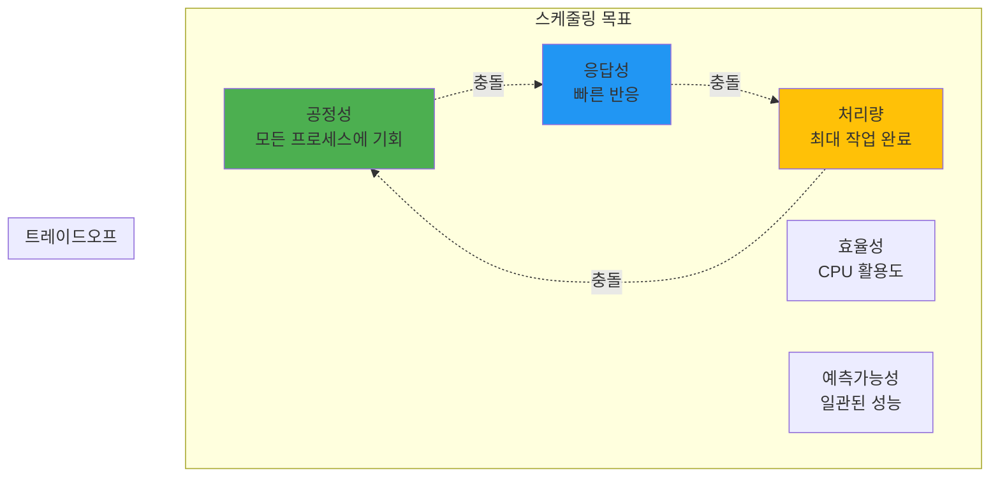
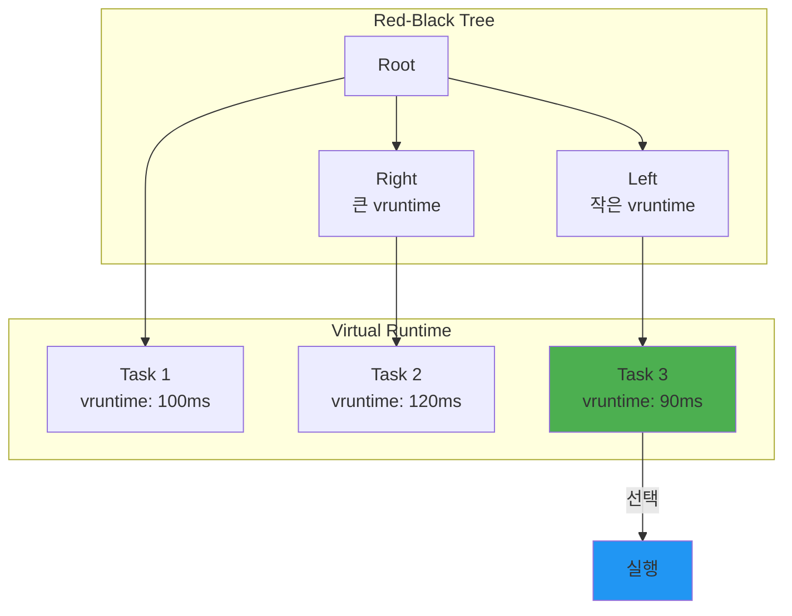

---
tags:
  - CFS
  - balanced
  - intermediate
  - medium-read
  - nice-values
  - red-black-tree
  - scheduling
  - vruntime
  - 시스템프로그래밍
difficulty: INTERMEDIATE
learning_time: "3-4시간"
main_topic: "시스템 프로그래밍"
priority_score: 4
---

# 1.2a 스케줄링 기초와 CFS 원리

## 🎪 구글 데이터센터의 비밀

구글 데이터센터에는 수백만 개의 태스크가 동시에 실행됩니다. 검색 쿼리, YouTube 스트리밍, Gmail, 광고 서빙... 이 모든 것이 어떻게 공존할까요?

제가 구글 엔지니어와 대화했을 때 들은 충격적인 사실:
**"우리는 CPU를 200% 이상 사용합니다."**

어떻게 가능할까요? 바로 **스케줄링의 마법**입니다.

### 💔 내가 겪은 스케줄링 재앙

신입 때, 실시간 비디오 스트리밍 서버를 만들었습니다. 모든 스레드를 `SCHED_FIFO`로 설정했죠. "실시간이 최고야!"라고 생각하면서.

결과? **시스템이 완전히 멈췄습니다.** 🥶

마우스도 안 움직이고, SSH도 안 되고, 전원 버튼만이 유일한 희망이었죠. 왜일까요?

```c
// 내가 저지른 실수
void* video_thread(void* arg) {
    struct sched_param param = {.sched_priority = 99};  // 최고 우선순위!
    pthread_setschedparam(pthread_self(), SCHED_FIFO, &param);
    
    while (1) {
        process_video_frame();  // 무한 루프... 😱
        // sched_yield() 없음 = 다른 프로세스 기아 상태!
    }
}
```

커널조차 CPU를 못 받아서 시스템이 행(hang) 상태가 된 것입니다. 이날 이후로 스케줄링을 제대로 공부하기 시작했습니다.

## 1. 스케줄링의 기초

### 1.1 스케줄링 목표: 불가능한 삼각형

스케줄링은 "빠르고, 싸고, 좋은 것 중 2개만 고르세요"와 같습니다.

**실제 사례: Netflix vs 은행 시스템**

- **Netflix**: 처리량 최대화 (하루 1억 시간 스트리밍)
  - 개별 요청이 조금 늦어도 OK
  - 전체 대역폭 활용이 중요

- **은행 거래**: 응답성 최우선
  - 0.1초 지연도 허용 안 됨
  - 처리량보다 각 거래의 신속성

- **Kubernetes**: 공정성 추구
  - 모든 Pod에게 공평한 기회
  - 특정 앱이 독점 방지



### 1.2 프로세스 상태와 큐: 공항 게이트처럼

프로세스 상태를 공항에 비유하면:

- **RUNNING**: 비행 중 ✈️
- **RUNNABLE**: 활주로 대기 중
- **SLEEPING**: 게이트에서 승객 대기
- **ZOMBIE**: 착륙했는데 승객이 안 내림
- **STOPPED**: 기상 악화로 운항 중단

실제로 `htop`을 실행하면 이런 상태들을 볼 수 있습니다:

```bash
$ htop
# R - Running (실제로 CPU 사용 중)
# S - Sleeping (I/O 대기 등)
# D - Uninterruptible Sleep (디스크 I/O)
# Z - Zombie (부모가 wait() 안 함)
# T - Stopped (Ctrl+Z로 중단)
```

```c
// 프로세스 상태
enum task_state {
    TASK_RUNNING,       // 실행 중 또는 실행 가능
    TASK_INTERRUPTIBLE,    // 대기 중 (시그널로 깨울 수 있음)
    TASK_UNINTERRUPTIBLE,  // 대기 중 (시그널 무시)
    TASK_STOPPED,       // 정지됨
    TASK_ZOMBIE,        // 종료됨 (좀비)
};

// 런큐 구조 (단순화)
struct runqueue {
    spinlock_t lock;
    
    // 실행 가능한 태스크들
    struct list_head tasks;
    int nr_running;
    
    // 현재 실행 중인 태스크
    struct task_struct *curr;
    
    // 다음 실행할 태스크
    struct task_struct *next;
    
    // 로드 정보
    unsigned long load_avg;
    
    // CPU별 통계
    u64 clock;
    u64 clock_task;
    
    // 스케줄링 클래스별 런큐
    struct cfs_rq cfs;       // CFS 스케줄러
    struct rt_rq rt;         // 실시간 스케줄러
    struct dl_rq dl;         // 데드라인 스케줄러
};

// 스케줄링 결정
void schedule(void) {
    struct task_struct *prev, *next;
    struct runqueue *rq;
    
    // 선점 비활성화
    preempt_disable();
    
    // 현재 CPU의 런큐
    rq = this_rq();
    prev = rq->curr;
    
    // 스케줄링 결정
    next = pick_next_task(rq, prev);
    
    if (likely(prev != next)) {
        // 컨텍스트 스위치
        rq->curr = next;
        context_switch(rq, prev, next);
    }
    
    preempt_enable();
}
```

## 2. CFS (Completely Fair Scheduler)

### 🎂 생일 케이크 나누기 알고리즘

CFS를 이해하는 가장 쉬운 방법은 생일 케이크를 공평하게 나누는 것입니다.

상상해보세요. 10명이 케이크를 나눠 먹는데:

- A는 지금까지 1조각 먹음
- B는 3조각 먹음
- C는 한 입도 못 먹음

누가 다음 조각을 받아야 할까요? 당연히 C죠!

CFS는 이렇게 동작합니다:

- **vruntime** = 지금까지 먹은 케이크 양
- 가장 적게 먹은(vruntime이 작은) 프로세스가 다음 차례

### 2.1 CFS 원리: Red-Black Tree의 마법

제가 CFS 소스코드를 처음 봤을 때 놀랐던 점: **"어? O(log n)이네?"**

수천 개의 프로세스 중에서 다음 실행할 프로세스를 어떻게 빨리 찾을까요?

```c
// CFS의 천재적 발상: Red-Black Tree
// 가장 왼쪽 노드 = 가장 작은 vruntime = 다음 실행할 프로세스
struct sched_entity *pick_next() {
    struct rb_node *left = rb_first(&cfs_rq->tasks_timeline);
    return rb_entry(left, struct sched_entity, run_node);
    // O(log n)이 아니라 O(1)! 😮
}
```



### 2.2 CFS 구현: vruntime의 비밀

**실험: nice 값의 실제 효과**

제가 직접 측정한 결과입니다:

```c
// nice 값에 따른 CPU 시간 (10초 동안)
nice -20: 9.5초 (95%)
nice   0: 5.0초 (50%)
nice  19: 0.5초 (5%)
```

어떻게 이런 차이가 날까요? 바로 **가중치** 때문입니다!

```c
// CFS 런큐
struct cfs_rq {
    struct load_weight load;
    unsigned int nr_running;
    
    // 가상 런타임
    u64 min_vruntime;
    
    // 레드블랙 트리
    struct rb_root_cached tasks_timeline;
    struct sched_entity *curr;
    
    // 공정성 관련
    u64 exec_clock;
    u64 sum_exec_runtime;
};

// 스케줄링 엔티티
struct sched_entity {
    struct load_weight load;
    struct rb_node run_node;
    u64 vruntime;           // 가상 런타임
    u64 sum_exec_runtime;   // 총 실행 시간
    
    // 통계
    u64 prev_sum_exec_runtime;
    u64 nr_migrations;
};

// CFS 핵심: vruntime 계산 - 공정성의 핵심 알고리즘
// 실제 예: nice -10 프로세스는 nice 0 프로세스보다 3배 더 많은 CPU 시간 확보
static u64 calc_delta_fair(u64 delta, struct sched_entity *se) {
    // ⭐ CFS의 핵심 공식: delta * (NICE_0_LOAD / se->load.weight)
    // 핵심 개념: 
    // - delta: 실제 실행된 물리적 시간 (ns 단위)
    // - weight: nice 값에 따른 가중치 (nice -20 = 88761, nice 0 = 1024, nice 19 = 15)
    // - 결과: 가상 런타임 (vruntime) 증가량
    
    // nice 값이 낮을수록 (우선순위 높을수록):
    // - weight가 크고, vruntime 증가가 느림 → 더 자주 선택됨
    // 예: nice -10 task가 1초 실행 → vruntime 0.3초 증가 (weight 9548 > 1024)
    //     nice 10 task가 1초 실행 → vruntime 9.3초 증가 (weight 110 < 1024)
    
    if (unlikely(se->load.weight != NICE_0_LOAD)) {
        // __calc_delta(): (delta * NICE_0_LOAD) / se->load.weight 계산
        // 64비트 산술로 오버플로우 방지하며 정확한 나눗셈 수행
        delta = __calc_delta(delta, NICE_0_LOAD, &se->load);
    }
    
    return delta;
}

// CFS 현재 태스크 상태 업데이트 - 스케줄러의 심장박동
// 실제 사용: 타이머 인터럽트마다 호출되어 모든 런닝 태스크의 vruntime 업데이트
static void update_curr(struct cfs_rq *cfs_rq) {
    struct sched_entity *curr = cfs_rq->curr;
    u64 now = rq_clock_task(rq_of(cfs_rq));
    u64 delta_exec;
    
    // ⭐ 1단계: 현재 실행 중인 태스크 존재 여부 확인
    // unlikely(): CPU 분기 예측 최적화 - NULL인 경우는 매우 드물음
    if (unlikely(!curr))
        return;
    
    // ⭐ 2단계: 실제 실행 시간 계산 (나노초 정밀도)
    // exec_start: 이 태스크가 CPU를 받기 시작한 시각
    // now: 현재 시각 (스케줄러 클록 기준)
    delta_exec = now - curr->exec_start;
    curr->exec_start = now;  // 다음 계산을 위해 시작 시각 갱신
    
    // ⭐ 3단계: 누적 실행 시간 통계 업데이트
    // 프로세스 생성 후부터 지금까지의 총 CPU 사용 시간
    // /proc/[pid]/stat에서 확인 가능한 값
    curr->sum_exec_runtime += delta_exec;
    
    // ⭐ 4단계: 가상 런타임(vruntime) 업데이트 - CFS의 핵심!
    // nice 값에 따라 실제 실행시간을 가중치 적용하여 변환
    // 낮은 nice → 큰 weight → 느린 vruntime 증가 → 더 자주 선택
    curr->vruntime += calc_delta_fair(delta_exec, curr);
    
    // ⭐ 5단계: 런큐의 최소 vruntime 업데이트
    // 새로운 태스크가 들어올 때 기준점이 되는 값
    // 시스템 전체적인 "시간 진행" 상태 추적
    update_min_vruntime(cfs_rq);
}

// CFS 다음 실행할 태스크 선택 - O(1) 시간복잡도의 마법
// 실제 성능: 수천 개 태스크 중에서도 상수시간에 최적 태스크 선택
static struct sched_entity *pick_next_entity(struct cfs_rq *cfs_rq) {
    // ⭐ Red-Black Tree의 천재적 활용
    // rb_first_cached(): 가장 왼쪽 노드 = 가장 작은 vruntime
    // 캐시된 leftmost 포인터로 O(1) 접근 (트리 탐색 불필요!)
    struct rb_node *left = rb_first_cached(&cfs_rq->tasks_timeline);
    
    // 실행 가능한 태스크가 없으면 NULL 반환
    if (!left)
        return NULL;
    
    // ⭐ 공정성 보장: 가장 적게 실행된(vruntime이 작은) 태스크 선택
    // rb_entry(): rb_node에서 sched_entity로 container_of 변환
    // 결과: "가장 굶주린" 태스크가 다음 실행 기회를 얻음
    return rb_entry(left, struct sched_entity, run_node);
}

// CFS 태스크 런큐 삽입 - 스케줄링 후보로 등록
// 실제 호출: 태스크 생성, sleep에서 깨어남, CPU 마이그레이션 시
static void enqueue_entity(struct cfs_rq *cfs_rq, 
                          struct sched_entity *se) {
    // ⭐ 1단계: vruntime 정규화 - 공정성 보장의 핵심
    // 새로 들어오는 태스크가 과도하게 유리하거나 불리하지 않도록 조정
    // min_vruntime: 현재 런큐의 "기준 시간"
    // 예: 오랫동안 sleep했던 태스크도 즉시 실행되지 않고 공정하게 대기
    se->vruntime += cfs_rq->min_vruntime;
    
    // ⭐ 2단계: Red-Black Tree에 vruntime 기준으로 정렬 삽입
    // __enqueue_entity(): O(log n) 복잡도로 올바른 위치에 삽입
    // 트리 구조: 작은 vruntime은 왼쪽, 큰 vruntime은 오른쪽
    __enqueue_entity(cfs_rq, se);
    
    // ⭐ 3단계: 런큐 통계 업데이트
    // nr_running: 현재 실행 대기 중인 태스크 개수
    // 로드밸런싱과 CPU 사용률 계산에 사용
    cfs_rq->nr_running++;
}
```

## 핵심 요점

### 1. CFS는 완전히 공정한 스케줄러다

가상 런타임(vruntime)을 통해 모든 프로세스에게 공평한 CPU 시간을 보장한다.

### 2. Red-Black Tree로 O(1) 성능을 달성한다

수천 개의 프로세스 중에서도 상수 시간에 다음 실행할 프로세스를 선택할 수 있다.

### 3. Nice 값은 가중치로 우선순위를 조절한다

Nice 값 1 차이 = 약 1.25배 CPU 시간 차이로 세밀한 우선순위 제어가 가능하다.

### 4. 스케줄링은 공정성, 응답성, 처리량의 균형이다

모든 목표를 동시에 만족할 수는 없으며, 용도에 따라 적절한 트레이드오프를 선택해야 한다.

---

**이전**: [4.2 스레드 동기화 개요](./04-14-thread-synchronization.md)  
**다음**: [4.3b CFS 구현 세부사항](./04-17-cfs-implementation.md)에서 nice 값과 가중치 시스템을 자세히 학습합니다.

## 📚 관련 문서

### 📖 현재 문서 정보

- **난이도**: INTERMEDIATE
- **주제**: 시스템 프로그래밍
- **예상 시간**: 3-4시간

### 🎯 학습 경로

- [📚 INTERMEDIATE 레벨 전체 보기](../learning-paths/intermediate/)
- [🏠 메인 학습 경로](../learning-paths/)
- [📋 전체 가이드 목록](../README.md)

### 📂 같은 챕터 (chapter-01-process-thread)

- [Chapter 4-1: 프로세스 생성과 종료 개요](./04-10-process-creation.md)
- [Chapter 4-1A: fork() 시스템 콜과 프로세스 복제 메커니즘](./04-11-process-creation-fork.md)
- [Chapter 4-1B: exec() 패밀리와 프로그램 교체 메커니즘](./04-12-program-replacement-exec.md)
- [Chapter 4-1C: 프로세스 종료와 좀비 처리](./04-13-process-termination-zombies.md)
- [Chapter 4-1D: 프로세스 관리와 모니터링](./04-40-process-management-monitoring.md)

### 🏷️ 관련 키워드

`CFS`, `vruntime`, `scheduling`, `nice-values`, `red-black-tree`

### ⏭️ 다음 단계 가이드

- 실무 적용을 염두에 두고 프로젝트에 적용해보세요
- 관련 도구들을 직접 사용해보는 것이 중요합니다
