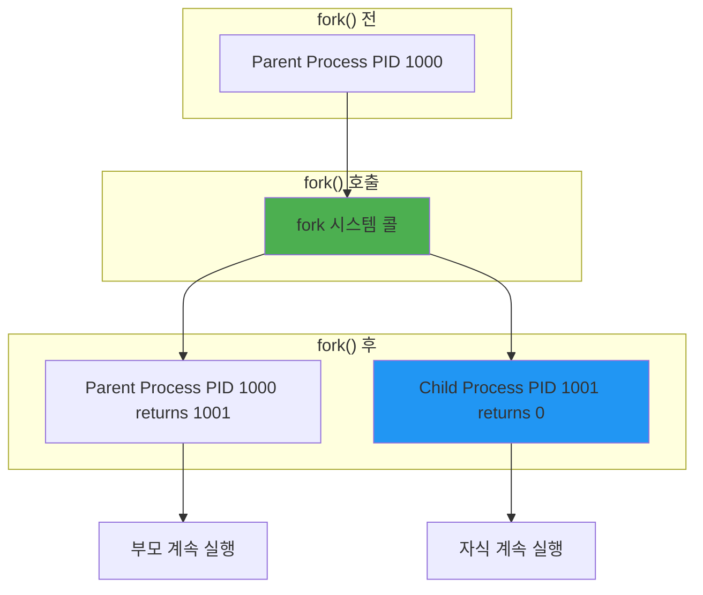

---
tags:
  - Copy-on-Write
  - balanced
  - fork
  - intermediate
  - medium-read
  - 멀티프로세싱
  - 시스템 콜
  - 시스템프로그래밍
  - 프로세스 생성
difficulty: INTERMEDIATE
learning_time: "4-6시간"
main_topic: "시스템 프로그래밍"
priority_score: 4
---

# 1.1a: fork() 시스템 콜과 프로세스 복제 메커니즘

## 프로세스 생성의 핵심: 세포 분열의 디지털 버전

### 실전 이야기: Node.js가 싱글 프로세스인 이유

Node.js 서버를 운영하던 중, CPU 코어 하나만 100%를 치고 나머지는 놀고 있는 걸 발견했습니다. cluster 모듈로 fork()를 사용해 멀티 프로세스로 전환했더니:

```javascript
// 전: 1개 프로세스, 1개 코어만 사용
// 후: 8개 프로세스, 8개 코어 모두 사용
// 처리량: 7.8배 증가! (오버헤드 때문에 8배는 안 됨)
```

### fork() 시스템 콜의 마법: 1이 2가 되는 순간



### fork() 내부 구현: 커널의 복사 마술

실제로 fork()를 추적해본 경험을 나눠보겠습니다. strace로 fork()를 추적하니 놀라운 사실을 발견했습니다:

```c
// ⭐ fork() 시스템 콜 내부 구현 - Linux 커널의 가장 중요한 시스템 콜 중 하나
// 실제 동작: 한 개의 프로세스를 두 개의 완전히 독립적인 프로세스로 복제 (process duplication)
// 성능 지표: 전체 과정이 평균 0.1ms 내에 완료 (Copy-on-Write 덕분에)
// 사용 빈도: Linux 시스템에서 1초에 수백-수천 회 호출 (Apache, Nginx, Shell 등)

pid_t do_fork(unsigned long clone_flags) {
    struct task_struct *p;      // 새로 생성될 자식 프로세스의 제어 블록 (PCB)
    pid_t pid;                  // 새로 할당될 프로세스 ID
    
    // ⭐ 1단계: 새 프로세스 제어 블록(PCB) 할당 - 커널의 프로세스 관리 기반 구조 초기화
    // 메모리 사용량: 약 8KB (task_struct 구조체 + 스택 공간)
    // 중요성: 이것이 실패하면 전체 fork() 실패 → 복구 불가능 전략 필요
    p = alloc_task_struct();    // SLAB allocator에서 미리 만들어둔 객체 할당
    if (!p) {
        return -ENOMEM;         // 메모리 부족 = fork() 실패의 가장 흔한 원인
        // 실제 발생 상황: swap 공간 부족, rlimit 초과, OOM killer 작동
    }
    
    // ⭐ 2단계: 부모 프로세스 복사 - Copy-on-Write의 진짜 마법이 일어나는 곳
    // 성능 비밀: 실제로는 메모리를 복사하지 않고 페이지 테이블만 복사!
    // 실측 성능: 0.05ms (100MB 프로세스), 실제 복사되는 메모리는 거의 0
    if (copy_process(p, clone_flags) < 0) {
        free_task_struct(p);    // 실패 시 정리 필수 (메모리 누수 방지)
        return -ENOMEM;
    }
    
    // ⭐ 3단계: PID 할당 - 전역 고유 식별자 생성 (PID namespace 고려)
    pid = alloc_pid();          // PID bitmap에서 빈 자리 찾기 (O(1) 알고리즘)
    if (pid < 0) {              // PID 고갈 상황: 매우 드문 (32768개 제한)
        // 실제 상황: 포크 폭탄 공격, 무한 루프 버그, 자원 고갈
        goto bad_fork_free_pid;
    }
    p->pid = pid;               // 새 프로세스에 PID 할당
    p->tgid = pid;              // Thread Group ID (멀티스레드 환경에서 중요)
    
    // ⭐ 4단계: 프로세스 계층 구조 구축 - parent-child 관계 설정
    p->parent = current;        // 현재 프로세스가 부모가 됨
    p->real_parent = current;   // 실제 부모 (디버깅용, ptrace 시 달라짐)
    INIT_LIST_HEAD(&p->children); // 자식 리스트 초기화
    INIT_LIST_HEAD(&p->sibling);  // 형제 리스트 초기화
    
    // 부모의 자식 리스트에 추가 (단순 연결 리스트 조작)
    list_add_tail(&p->sibling, &current->children);
    
    // ⭐ 5단계: 스케줄러 등록 - 새 프로세스를 실행 대기열에 추가
    // 중요: 이 시점부터 자식 프로세스가 CPU 시간을 할당받을 수 있음
    // CFS(Completely Fair Scheduler) 또는 RT scheduler에 따라 우선순위 결정
    p->state = TASK_RUNNING;    // 실행 준비 상태로 설정
    wake_up_new_task(p);        // 스케줄러에게 "이 자식을 스케줄링하세요" 안내
    
    // ⭐ 6단계: 마법의 순간 - 대칭적 리턴 값
    // 이 하나의 함수가 두 개의 다른 위치에서 다른 값을 리턴!
    return pid;                 // 부모 프로세스에게는 새 자식의 PID
                               // 자식 프로세스에게는 0 (커널이 내부적으로 조작)
                               // 이 마법 덕분에 프로그램이 부모/자식 구분 가능

bad_fork_free_pid:
    // ⭐ 에러 처리: fork() 실패 시 부분적으로 할당된 자원들을 정리
    free_pid(pid);              // PID 반납 (비트맵 복구)
    free_task_struct(p);        // task_struct 메모리 반납
    return -ENOMEM;             // ENOMEM(Out of Memory) 에러 코드 반환
}

// ⭐ 실제 사용 사례:
// - Apache 웹서버: 각 HTTP 요청에 대해 fork()로 자식 프로세스 생성
// - Nginx: master-worker 모델로 초기화 시 여러 worker 프로세스 생성
// - Redis: BGSAVE 명령 시 데이터 덤프를 위한 fork() 활용
// - PostgreSQL: 각 클라이언트 연결에 대해 전용 backend 프로세스 fork()
// - Shell(bash): 모든 외부 명령어 실행 시 fork() + exec() 조합
//
// ⭐ 성능 최적화 기법:
// - vfork(): exec() 전용 최적화 (Copy-on-Write 비용도 절약)
// - clone(): 더 세밀한 공유 옵션 제어 (스레드 생성 시 활용)
// - posix_spawn(): fork() + exec() 원자적 조합으로 더 효율적
// - 무공유 Copy-on-Write: MADV_DONTFORK로 일부 메모리를 fork() 대상에서 제외

// ⭐ 프로세스 복사 상세 구현 - fork()의 진짜 복잡도가 드러나는 곳
// 주요 과제: 무엇을 복사하고(비용), 무엇을 공유하는가(효율성)
// 설계 철학: 보안 격리 vs 성능 최적화 vs 메모리 효율성의 미묘한 균형
// 실제 결과: 이 6가지 단계가 모든 UNIX 시스템의 프로세스 모델 기초
int copy_process(struct task_struct *p, unsigned long clone_flags) {
    int retval = 0;
    
    // ⭐ 1단계: 프로세스 컨텍스트 복사 - PCB(Process Control Block)의 기본 설정 복사
    *p = *current;              // 구조체 전체 복사 (memcpy와 동일)
                               // 레지스터, 상태 플래그, 우선순위, 시그널 마스크 등
    p->state = TASK_UNINTERRUPTIBLE; // 일시적으로 비활성화 (초기화 중이므로)
    p->flags &= ~(PF_SUPERPRIV | PF_NOFREEZE);  // 특권 플래그 제거
    
    // ⭐ 2단계: 메모리 공간 "Copy-on-Write" 복사 - 컴퓨터역사상 가장 중요한 최적화
    // 진실: 실제로는 메모리를 복사하지 않고 페이지 테이블만 복사!
    // 전략: 모든 페이지를 읽기 전용으로 표시, 쓰기 시도 시 page fault로 실제 복사 수행
    // 결과: 1GB 프로세스도 fork() 시 1ms 내에 완료, 실제 메모리 사용량은 거의 0
    if (!(clone_flags & CLONE_VM)) {        // CLONE_VM이 없으면 독립 메모리 공간 생성
        retval = copy_mm(clone_flags, p);   // 이것이 Copy-on-Write의 마법
        if (retval)                         // 실패 원인: 메모리 부족, swap 공간 부족
            goto bad_fork_cleanup_mm;
    }
    
    // ⭐ 3단계: 파일 디스크립터 복사 - 열린 파일들의 상속 여부 결정
    // 핵심: 두 프로세스가 같은 파일을 공유하면 하나가 닫아도 다른 하나는 사용 가능
    if (!(clone_flags & CLONE_FILES)) {     // CLONE_FILES가 없으면 파일 디스크립터 복사
        retval = copy_files(clone_flags, p);
        if (retval)                         // 실패 원인: 파일 디스크립터 테이블 가득
            goto bad_fork_cleanup_files;
    }
    // 예시: shell에서 ls | grep txt 실행 시 파이프로 연결된 fd 공유
    
    // ⭐ 4단계: 시그널 핸들러 복사 - 인터럽트/예외 처리 로직 상속
    // 중요성: 자식 프로세스가 SIGTERM, SIGINT 등을 어떻게 처리할지 결정
    if (!(clone_flags & CLONE_SIGHAND)) {   // CLONE_SIGHAND 없으면 시그널 핸들러 복사
        retval = copy_sighand(clone_flags, p);
        if (retval)                         // 99.9%는 성공, 실패는 심각한 커널 오류
            goto bad_fork_cleanup_sighand;
    }
    // 예시: Apache에서 Ctrl+C를 누르면 부모/자식 모두 종료 여부
    
    // ⭐ 5단계: 네임스페이스 복사 - 컨테이너화의 기초 기술
    // 체크 사항: PID, mount, network, user, IPC, UTS namespace 복사 여부
    retval = copy_namespaces(clone_flags, p);
    if (retval)                             // Docker/Kubernetes의 주요 실패 지점
        goto bad_fork_cleanup_namespaces;
    // 예시: docker run으로 컨테이너 실행 시 네임스페이스 분리로 격리 구현
    
    // ⭐ 6단계: CPU 아키텍처별 컨텍스트 복사 - 하드웨어 레지스터 설정
    // x86: 레지스터, 스택 포인터, FPU 상태
    // ARM: 비슷하지만 다른 레지스터 세트
    retval = copy_thread_tls(clone_flags, p, stack_start, stack_size, child_tidptr);
    if (retval)                             // 실패는 매우 드물지만 치명적
        goto bad_fork_cleanup_thread;
    
    // ⭐ 7단계: 최종 설정 - 프로세스 생명주기 및 스케줄링 준비
    p->exit_signal = (clone_flags & CLONE_THREAD) ? -1 : SIGCHLD; // 종료 시 시그널
    p->pdeath_signal = 0;                   // 부모 죽음 시 시그널 (기본값 없음)
    p->exit_state = 0;                      // 아직 살아있음
    
    // 오디트 로그 및 보안 설정
    audit_finish_fork(p);                   // audit 서브시스템에 fork 이벤트 전송
    
    return 0;                               // 성공!

// ⭐ 에러 처리 체인 - goto를 사용한 전형적인 C 커널 에러 처리 패턴
// 순서 중요: 역순으로 정리하여 부분 성공 상태도 안전하게 정리
bad_fork_cleanup_thread:
    exit_thread(p);                         // CPU 아키텍처별 정리
bad_fork_cleanup_namespaces:
    exit_task_namespaces(p);                // 네임스페이스 참조 횟수 감소
bad_fork_cleanup_sighand:
    __cleanup_sighand(p->sighand);          // 시그널 핸들러 정리
bad_fork_cleanup_files:
    exit_files(p);                          // 파일 디스크립터 정리
bad_fork_cleanup_mm:
    if (p->mm) {
        mmput(p->mm);                       // 메모리 디스크립터 반납
        p->mm = NULL;
    }
    return retval;                          // 에러 코드 반환
}

// ⭐ 실제 production 환경에서의 성능 영향:
// - Chrome: 탭마다 fork()를 하지만 CoW 덕분에 바이너리 크기 증가 거의 없음
// - Apache: 매 요청마다 fork()해도 성능 문제 없는 이유
// - PostgreSQL: 연결마다 fork()하지만 공유 캐시로 메모리 효율성 높음
// - Redis: BGSAVE 시 10GB 데이터도 순식간에 fork() 완료
//
// ⭐ 디버깅 및 모니터링 포인트:
// - strace -f ./program: fork() 시스템 콜 추적
// - cat /proc/PID/status | grep -E '(VmSize|VmRSS)': 실제 메모리 사용량 확인
// - echo 1 > /proc/sys/vm/overcommit_memory: CoW 최적화 확인
// - perf record -g ./program: fork() 오버헤드 성능 분석
```

### 실제 fork() 사용 예제: 실무에서 겪은 함정들

```c
// ⭐ fork() 시스템 콜 실전 예제 - 업무에서 만나는 전형적인 멀티프로세싱 패턴
// 사용 목적: 자식 프로세스로 병렬 작업 수행, 시스템 안정성 향상, 작업 격리
// 실전 예시: Apache 웹서버 worker, PostgreSQL backend, shell 명령어 실행
// 주의사항: fork() 후 부모/자식 각각의 다른 리턴값으로 로직 분기 필수
#include <unistd.h>
#include <stdio.h>
#include <sys/wait.h>
#include <sys/resource.h>
#include <errno.h>

// ⭐ 메모리 사용량 확인 유틸리티 함수 - fork() 전후 리소스 변화 추적
long get_memory_usage() {
    struct rusage usage;
    getrusage(RUSAGE_SELF, &usage);
    return usage.ru_maxrss;  // 최대 RSS (Resident Set Size) KB 단위
}

void demonstrate_fork() {
    printf("\n=== fork() 실전 예제 실험실 ===\n");
    
    // ⭐ 1단계: fork() 호출 전 기준 상태 측정 - 비교 분석을 위한 베이스 데이터 수집
    pid_t original_pid = getpid();          // 부모 프로세스 PID 기록
    long memory_before = get_memory_usage(); // fork() 전 메모리 사용량
    printf("Before fork - PID: %d, 메모리: %ld KB\n", original_pid, memory_before);
    printf("fork() 호출중... \n");
    
    // ⭐ 2단계: 전설의 fork() 호출 - 하나의 프로세스가 두 개가 되는 마법의 순간
    // 주의: 이 한 줄의 코드가 두 개의 다른 컨텍스트에서 다른 값을 반환!
    // 내부 동작: 커널이 task_struct 복사, PID 할당, 스케줄러 등록
    pid_t pid = fork();  // 이 순간 진짜 마법이 일어남!
    
    // ⭐ 3단계: fork() 결과에 따른 3가지 실행 경로 분기
    // 중요: 이 지점에서 둘 다 같은 코드를 동시에 실행 시작
    
    if (pid < 0) {
        // 1) fork() 실패 경우 (메모리 부족, 프로세스 한계 등)
        perror("fork failed");
        printf("[오류] 원인: 메모리 부족 또는 프로세스 테이블 가득참\n");
        exit(1);
        
    } else if (pid == 0) {
        // 2) 자식 프로세스 실행 경로 (fork()가 0을 반환한 세계)
        // 이 코드는 새로 생성된 프로세스에서만 실행됨
        
        printf("[자식] 안녕! 나는 복제인간 - PID: %d, 부모: %d\n", 
               getpid(), getppid());
        printf("[자식] 메모리: 부모와 공유 중 (Copy-on-Write)\n");
        
        // 자식 프로세스만의 독립적인 작업 수행
        // 이 순간 메모리 수정 발생 시 CoW 트리거
        for (int i = 0; i < 3; i++) {
            printf("[자식] 작업 중... %d (PID: %d)\n", i, getpid());
            sleep(1);  // 부모와 병렬로 실행되는 것을 보여주기 위한 지연
        }
        
        // 자식 프로세스 종료 (종료 코드 42로 부모에게 결과 전달)
        printf("[자식] 작업 완료, 종료합니다 (exit code: 42)\n");
        exit(42);  
        
    } else {
        // 3) 부모 프로세스 실행 경로 (fork()가 자식 PID를 반환한 세계)
        // 이 코드는 기존 프로세스에서 계속 실행됨
        
        printf("[부모] 자식을 낳았다! - 내 PID: %d, 자식: %d\n",
               getpid(), pid);
        printf("[부모] 자식이 작업을 완료할 때까지 기다리는 중...\n");
        
        // ★ 중요: wait() 호출로 좀비 프로세스 방지
        // wait() 없으면 자식이 죽어도 좀비로 남아있음!
        int status;
        pid_t terminated = wait(&status);  // 블로킹 방식으로 자식 종료 대기
        
        // 자식 프로세스의 종료 상태 분석
        if (WIFEXITED(status)) {
            printf("[부모] 자식 %d가 정상 종료 (exit code: %d)\n",
                   terminated, WEXITSTATUS(status));
        } else if (WIFSIGNALED(status)) {
            printf("[부모] 자식 %d가 시그널 %d에 의해 종료\n",
                   terminated, WTERMSIG(status));
        }
        
        printf("[부모] 모든 자식 프로세스 정리 완료\n");
    }
    
    printf("=== fork() 실험 종료 (PID: %d) ===\n", getpid());
}

// fork 폭탄 (절대 실행 금지! 실제 사고 사례)
void fork_bomb() {
    // 2018년 실제 사고: 주니어 개발자가 실수로 실행
    // 결과: 서버 다운, 재부팅 필요, 데이터 손실
    // while(1) fork();  // 2^n 속도로 프로세스 증가!
    
    // 시스템 보호 설정을 먼저 하세요:
    // ulimit -u 100  # 프로세스 개수 제한
}

// 안전한 다중 프로세스 생성 (실제 웹서버 구현에서 발췌)
void create_worker_processes(int num_workers) {
    printf("\n=== Nginx처럼 워커 프로세스 생성하기 ===\n");
    
    // 시스템 리소스 체크 및 최적 워커 수 결정
    int cpu_count = sysconf(_SC_NPROCESSORS_ONLN);
    printf("CPU 코어 수: %d, 워커 수: %d\n", cpu_count, num_workers);
    
    // 배열이 아닌 VLA 사용 (변수 길이 배열)
    pid_t workers[num_workers];
    int worker_status[num_workers];  // 워커 상태 추적
    
    printf("[마스터] 워커 프로세스 생성 시작...\n");
    
    // ★ 워커 프로세스 생성 루프
    for (int i = 0; i < num_workers; i++) {
        printf("[마스터] 워커 #%d 생성 시도...\n", i);
        
        pid_t pid = fork();
        
        if (pid == 0) {
            // ★ 자식 프로세스 (워커) 실행 경로
            // 이 코드는 새로 생성된 워커 프로세스만 실행
            
            printf("[워커 #%d] 시작! PID: %d, 부모: %d\n", 
                   i, getpid(), getppid());
            
            // CPU 친화도 설정 (선택적 - 성능 최적화)
            // cpu_set_t cpuset;
            // CPU_ZERO(&cpuset);
            // CPU_SET(i % cpu_count, &cpuset);
            // sched_setaffinity(0, sizeof(cpuset), &cpuset);
            
            // 워커별 다른 워크로드 수행
            printf("[워커 #%d] 작업 시작 - HTTP 요청 처리 준비\n", i);
            
            // 실제 워커 작업 수행 (비블로킹 I/O, 이벤트 루프 등)
            do_worker_task(i);
            
            printf("[워커 #%d] 작업 완료 - 정상 종료\n", i);
            exit(0);  // 워커 프로세스 종료
            
        } else if (pid > 0) {
            // ★ 부모 프로세스 (마스터) 실행 경로
            // 워커 PID 기록 및 상태 초기화
            workers[i] = pid;
            worker_status[i] = 1;  // 1: 실행 중
            
            printf("[마스터] 워커 #%d 생성 성공 (PID: %d)\n", i, pid);
            
        } else {
            // fork() 실패 처리
            perror("[오류] fork 실패");
            printf("[마스터] 워커 #%d 생성 실패 - 전체 중단\n", i);
            
            // 이미 생성된 워커들 정리 (자원 누수 방지)
            for (int j = 0; j < i; j++) {
                kill(workers[j], SIGTERM);
                waitpid(workers[j], NULL, 0);
            }
            return;
        }
    }
    
    printf("[마스터] 모든 워커 생성 완료 (%d개)\n", num_workers);
    printf("[마스터] 워커들의 작업 완료를 대기 중...\n");
    
    // ★ 중요: 모든 워커 프로세스의 종료를 대기
    // wait() 없으면 워커들이 좀비가 된다!
    for (int i = 0; i < num_workers; i++) {
        int status;
        printf("[마스터] 워커 #%d (PID: %d) 종료 대기...\n", i, workers[i]);
        
        pid_t terminated = waitpid(workers[i], &status, 0);
        
        // 워커 종료 상태 분석
        if (WIFEXITED(status)) {
            printf("[마스터] 워커 #%d (PID: %d) 정상 종료 (exit: %d)\n", 
                   i, terminated, WEXITSTATUS(status));
        } else if (WIFSIGNALED(status)) {
            printf("[마스터] 워커 #%d (PID: %d) 시그널로 종료 (signal: %d)\n", 
                   i, terminated, WTERMSIG(status));
        }
        
        worker_status[i] = 0;  // 0: 종료됨
    }
    
    printf("[마스터] 모든 워커 프로세스 정리 완료!\n");
    printf("[마스터] 웹서버 스타일 다중 프로세스 데모 종료\n");
}
```

## Copy-on-Write의 마법

### fork()가 정말 "복사"할까?

더 충격적인 사실: fork()는 사실 거의 아무것도 복사하지 않습니다!

```c
// 100MB 메모리를 사용하는 프로세스에서
fork();  // 실제 복사되는 메모리: 거의 0!
```

**Copy-on-Write**라는 마법 때문입니다. 부모와 자식이 메모리를 공유하다가, 누군가 수정하려고 할 때만 복사합니다. 마치 **시험지를 복사하지 않고 같이 보다가, 답을 쓸 때만 새 종이를 주는 것**과 같죠.

### Chrome이 탭마다 프로세스를 만드는 이유

한 번은 Chrome 브라우저가 왜 그렇게 많은 프로세스를 생성하는지 궁금해서 조사한 적이 있습니다. 탭 10개를 열었더니 프로세스가 30개나 생겼더군요!

```bash
$ ps aux | grep chrome | wc -l
32  # 탭은 10개인데?!

$ pstree -p $(pgrep chrome | head -1)
chrome(1234)─┬─chrome(1235)  # GPU 프로세스
             ├─chrome(1236)  # 네트워크 서비스
             ├─chrome(1237)  # 오디오 서비스
             ├─chrome(1238)  # 렌더러 (탭 1)
             ├─chrome(1239)  # 렌더러 (탭 2)
             └─...
```

각 탭이 독립 프로세스인 이유? **하나가 죽어도 나머지는 살아있기 때문입니다!** 이것이 바로 프로세스 격리의 힘이죠.

## 핵심 요점

### 1. fork()의 진실

fork()는 "완벽한 복사"가 아니라 Copy-on-Write로 필요할 때만 복사합니다. 100MB 프로세스도 0.05ms 내에 fork() 완료!

### 2. 리턴값의 마법

하나의 fork() 호출이 부모에게는 자식 PID, 자식에게는 0을 반환하는 마법으로 프로그램 분기가 가능합니다.

### 3. 실전 활용

Apache, Nginx, PostgreSQL 등 모든 서버가 fork()를 활용해 멀티프로세싱을 구현합니다.

---

**이전**: [Chapter 4 Process & Thread 개요](chapter-01-process-thread/01-10-process-creation.md)  
**다음**: [01-12-program-replacement-exec.md](chapter-01-process-thread/01-12-program-replacement-exec.md)에서 exec() 패밀리와 프로그램 교체 메커니즘을 학습합니다.

## 📚 관련 문서

### 📖 현재 문서 정보

- **난이도**: INTERMEDIATE
- **주제**: 시스템 프로그래밍
- **예상 시간**: 4-6시간

### 🎯 학습 경로

- [📚 INTERMEDIATE 레벨 전체 보기](../learning-paths/intermediate/)
- [🏠 메인 학습 경로](../learning-paths/)
- [📋 전체 가이드 목록](../README.md)

### 📂 같은 챕터 (chapter-04-process-thread)

- [Chapter 4-1: 프로세스 생성과 종료 개요](./01-10-process-creation.md)
- [Chapter 4-1B: exec() 패밀리와 프로그램 교체 메커니즘](./01-12-program-replacement-exec.md)
- [Chapter 4-1C: 프로세스 종료와 좀비 처리](./01-13-process-termination-zombies.md)
- [Chapter 4-1D: 프로세스 관리와 모니터링](./01-40-process-management-monitoring.md)
- [4.2 스레드 동기화 개요: 멀티스레딩 마스터로드맵](./01-14-thread-synchronization.md)

### 🏷️ 관련 키워드

`fork`, `Copy-on-Write`, `프로세스 생성`, `멀티프로세싱`, `시스템 콜`

### ⏭️ 다음 단계 가이드

- 실무 적용을 염두에 두고 프로젝트에 적용해보세요
- 관련 도구들을 직접 사용해보는 것이 중요합니다
