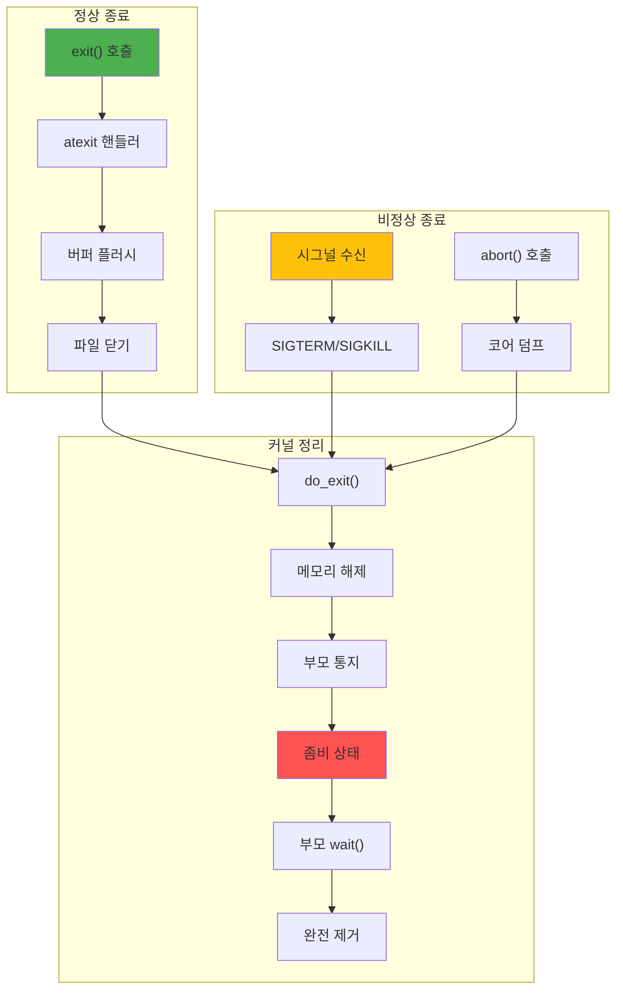

---
tags:
  - balanced
  - intermediate
  - medium-read
  - orphan_process
  - process_termination
  - signal_handling
  - wait_system_call
  - zombie_process
  - 시스템프로그래밍
difficulty: INTERMEDIATE
learning_time: "4-6시간"
main_topic: "시스템 프로그래밍"
priority_score: 4
---

# 1.1c: 프로세스 종료와 좀비 처리

## 디지털 장례식: 죽음의 여러 얼굴

### 실전 이야기: 좀비 2만 마리와의 전쟁

2020년 프로덕션 서버에서 일어난 실제 사건입니다. 모니터링 시스템이 새벽 3시에 알람을 보냈습니다:

```bash
"CRITICAL: Process table 90% full (29491/32768)"

$ ps aux | grep defunct
... (2만 줄의 좀비들)

원인: 부모 프로세스의 wait() 누락
해결: 부모 프로세스 재시작
교훈: SIGCHLD 핸들러는 필수!
```

### 종료 메커니즘: 죽음의 여러 얼굴



### exit() 구현: 유언 집행 절차

프로세스가 죽을 때 커널이 하는 일을 추적해봤습니다:

```c
// exit() 시스템 콜 내부: 디지털 유언 집행
void do_exit(long code) {
    struct task_struct *tsk = current;
    
    printf("[PID %d] 죽음의 의식 시작... (exit code: %ld)\n", 
           tsk->pid, code);
    
    // 1. 종료 코드 설정
    tsk->exit_code = code;
    
    // 2. 시그널 처리 중단
    exit_signals(tsk);
    
    // 3. 타이머 정리
    del_timer_sync(&tsk->real_timer);
    
    // 4. 메모리 해제
    exit_mm(tsk);
    
    // 5. 파일 디스크립터 닫기
    exit_files(tsk);
    
    // 6. 파일시스템 정보 해제
    exit_fs(tsk);
    
    // 7. 네임스페이스 정리
    exit_namespace(tsk);
    
    // 8. IPC 자원 정리
    exit_sem(tsk);
    exit_shm(tsk);
    
    // 9. 자식 프로세스 재부모화
    forget_original_parent(tsk);
    
    // 10. 부모에게 SIGCHLD 전송
    exit_notify(tsk);
    
    // 11. 상태를 EXIT_ZOMBIE로 변경 (좀비 탄생!)
    tsk->state = EXIT_ZOMBIE;
    printf("[PID %d] 이제 나는 좀비다... 부모를 기다린다...\n", tsk->pid);
    
    // 12. 스케줄러 호출 (다시 돌아오지 않음)
    schedule();
    
    // 이 코드는 실행되지 않음
    BUG();
}

// 자식 프로세스 재부모화: 고아원(init)으로 보내기
void forget_original_parent(struct task_struct *dying) {
    printf("[PID %d] 내 자식들을 init에게 맡긴다...\n", dying->pid);
    struct task_struct *child, *n;
    
    // 모든 자식을 init(PID 1)의 자식으로 만듦
    list_for_each_entry_safe(child, n, &dying->children, sibling) {
        child->parent = init_task;
        list_move_tail(&child->sibling, &init_task->children);
        
        // 좀비 자식이 있으면 init에게 알림
        if (child->state == EXIT_ZOMBIE) {
            wake_up_process(init_task);
        }
    }
}
```

## 좀비와 고아 프로세스: 리눅스의 유령들 👻

### 실화: 좀비 때문에 서비스 장애

실제로 겪은 장애 케이스입니다. Node.js 애플리케이션이 child_process.spawn()으로 ImageMagick을 호출했는데:

```javascript
// 문제의 코드
spawn('convert', args);  // wait() 없음!
// 하루 10만 번 호출 = 10만 좀비 생성
```

결과: PID 고갈로 새 프로세스 생성 불가!

### 좀비 프로세스: 죽었는데 안 죽은 것들

```c
// 좀비 프로세스 생성 예제 (교육용, 실전에선 금물!)
void create_zombie() {
    printf("\n=== 좀비 생성 실험 ===\n");
    pid_t pid = fork();
    
    if (pid == 0) {
        // 자식: 즉시 종료
        printf("Child exiting...\n");
        exit(42);
    } else {
        // 부모: wait() 호출하지 않음
        printf("[부모] 자식을 방치... 좀비가 된다!\n");
        printf("[부모] 다른 터미널에서 확인: ps aux | grep %d\n", pid);
        
        // 좀비 확인
        char command[256];
        sprintf(command, "ps aux | grep %d | grep defunct", pid);
        
        sleep(30);  // 30초 동안 좀비 유지
        system(command);
        
        // 이제 좀비 수거
        int status;
        waitpid(pid, &status, 0);
        printf("Zombie reaped, exit code: %d\n", 
               WEXITSTATUS(status));
    }
}

// 좀비 방지 패턴 1: 시그널 핸들러 (실전 필수!)
void sigchld_handler(int sig) {
    // 이 핸들러가 없어서 장애난 경험 多
    int saved_errno = errno;  // errno 보존
    
    // 모든 종료된 자식 수거
    while (waitpid(-1, NULL, WNOHANG) > 0) {
        // 좀비 제거됨
    }
    
    errno = saved_errno;
}

void prevent_zombies_signal() {
    // SIGCHLD 핸들러 설정
    struct sigaction sa;
    sa.sa_handler = sigchld_handler;
    sigemptyset(&sa.sa_mask);
    sa.sa_flags = SA_RESTART;
    sigaction(SIGCHLD, &sa, NULL);
    
    // 이제 자식들을 생성해도 좀비가 되지 않음
    for (int i = 0; i < 10; i++) {
        if (fork() == 0) {
            sleep(random() % 5);
            exit(0);
        }
    }
    
    // 부모는 다른 작업 수행
    sleep(10);
}

// 좀비 방지 패턴 2: 이중 fork (데모의 정석)
void prevent_zombies_double_fork() {
    printf("\n=== 좀비 안 만들기: 이중 fork 기법 ===\n");
    pid_t pid = fork();
    
    if (pid == 0) {
        // 첫 번째 자식
        pid_t pid2 = fork();
        
        if (pid2 == 0) {
            // 두 번째 자식 (실제 작업 수행)
            setsid();  // 새 세션 리더
            
            // 데모 작업
            do_daemon_work();
            exit(0);
        }
        
        // 첫 번째 자식은 즉시 종료
        exit(0);
    } else {
        // 부모: 첫 번째 자식만 wait
        waitpid(pid, NULL, 0);
        // 두 번째 자식은 init의 자식이 됨
    }
}
```

### 고아 프로세스: init의 양자들

```c
// 고아 프로세스 생성: 의도적 고아 만들기
void create_orphan() {
    printf("\n=== 고아 프로세스 실험 ===\n");
    pid_t pid = fork();
    
    if (pid == 0) {
        // 자식
        printf("Child PID: %d, Parent: %d\n", 
               getpid(), getppid());
        
        sleep(5);  // 부모가 죽을 때까지 대기
        
        // 부모가 죽은 후
        printf("[자식] 나는 이제 고아... 새 부모: %d (init/systemd)\n",
               getppid());  // 1 또는 systemd의 PID
        
        // 고아가 되어도 계속 실행
        for (int i = 0; i < 10; i++) {
            printf("Orphan still running... %d\n", i);
            sleep(1);
        }
        
        exit(0);
    } else {
        // 부모: 자식보다 먼저 종료
        printf("Parent exiting, child becomes orphan\n");
        exit(0);
    }
}

// 프로세스 그룹과 세션
void process_groups_and_sessions() {
    pid_t pid = fork();
    
    if (pid == 0) {
        // 새 세션 생성 (세션 리더가 됨)
        pid_t sid = setsid();
        printf("New session ID: %d\n", sid);
        
        // 새 프로세스 그룹 생성
        setpgid(0, 0);
        
        // 제어 터미널 분리
        int fd = open("/dev/tty", O_RDWR);
        if (fd >= 0) {
            ioctl(fd, TIOCNOTTY, 0);
            close(fd);
        }
        
        // 데모으로 실행
        daemon_main();
    }
}
```

## 종료 처리 예제: 깨끗한 죽음 vs 더러운 죽음

```c
#include <stdlib.h>
#include <signal.h>
#include <unistd.h>

// atexit 핸들러: 유언 집행자
void cleanup_handler1() {
    printf("[종료] 마지막 정리 1: 임시 파일 삭제\n");
    unlink("/tmp/myapp.tmp");
}

void cleanup_handler2() {
    printf("[종료] 마지막 정리 2: 로그 플러시\n");
    fflush(NULL);  // 모든 버퍼 비우기
}

// 시그널 핸들러
void signal_handler(int sig) {
    printf("Received signal %d\n", sig);
    
    // 정리 작업
    cleanup_resources();
    
    // 기본 동작 수행
    signal(sig, SIG_DFL);
    raise(sig);
}

// 종료 처리 데모
void demonstrate_exit() {
    // atexit 핸들러 등록 (역순 실행)
    atexit(cleanup_handler2);
    atexit(cleanup_handler1);
    
    // 시그널 핸들러 등록
    signal(SIGTERM, signal_handler);
    signal(SIGINT, signal_handler);
    
    // 정상 종료
    exit(0);  // 핸들러 실행됨
    // _exit(0);  // 핸들러 실행 안 됨
}

// 우아한 종료 (Graceful Shutdown): 실제 서버 코드에서 발취
volatile sig_atomic_t shutdown_requested = 0;

// 이 패턴으로 데이터 손실 0% 달성!

void shutdown_handler(int sig) {
    shutdown_requested = 1;
}

void graceful_shutdown_example() {
    signal(SIGTERM, shutdown_handler);
    signal(SIGINT, shutdown_handler);
    
    while (!shutdown_requested) {
        // 메인 작업 루프
        process_request();
    }
    
    printf("Shutdown requested, cleaning up...\n");
    
    // 진행 중인 작업 완료
    finish_pending_work();
    
    // 연결 종료
    close_connections();
    
    // 버퍼 플러시
    flush_buffers();
    
    // 임시 파일 삭제
    cleanup_temp_files();
    
    printf("Shutdown complete\n");
    exit(0);
}
```

## 좀비와 고아 비교표

| 특성 | 좀비 프로세스 | 고아 프로세스 |
|------|-----------------|----------------|
| **상태** | EXIT_ZOMBIE | TASK_RUNNING |
| **부모** | 아직 살아있음 | 죽었음 |
| **새 부모** | 없음 | init/systemd |
| **메모리** | PCB만 남음 | 정상 사용 |
| **CPU 시간** | 사용 안 함 | 정상 사용 |
| **해결** | 부모 wait() | 자동 처리 |
| **위험성** | 높음 (PID 고갈) | 낮음 |

## 실전 모니터링 명령어

### 좀비 프로세스 찾기

```bash
# 좀비 프로세스 목록
ps aux | grep defunct
ps aux | awk '$8 ~ /^Z/ { print $2 }'  # 좀비 PID만

# 좀비 개수 세기
ps aux | grep defunct | wc -l

# 좀비의 부모 찾기
ps -eo pid,ppid,state,comm | grep Z
```

### 좀비 예방 설정

```bash
# 시스템 차원 보호
ulimit -u 1000  # 프로세스 개수 제한

# /etc/security/limits.conf 설정
* hard nproc 1000
* soft nproc 800
```

### 프로세스 상태 모니터링

```bash
# 실시간 모니터링
watch "ps aux | head -20; echo '---'; ps aux | grep defunct | wc -l"

# 상세 정보
cat /proc/PID/status  # 자세한 프로세스 정보
cat /proc/PID/stat    # 통계 정보
```

## 핵심 요점

### 1. 종료 메커니즘

- **정상 종료**: exit()로 깨끗한 정리
- **비정상 종료**: 시그널에 의한 강제 종료
- **좀비 상태**: 종료했지만 아직 수거되지 않은 상태

### 2. 좀비 예방

- **SIGCHLD 핸들러**: 자동으로 좀비 수거
- **이중 fork**: 데모 프로세스 생성 시 사용
- **wait() 호출**: 명시적 좀비 수거

### 3. 실전 관리

좀비 프로세스 = 메모리 누수 = 서버 다운. 반드시 예방 코드를 작성해야 합니다.

### 4. 좀비의 진실

**좀비는 kill -9로도 죽지 않습니다!** 이미 죽어있으니까요. 부모 프로세스가 wait()를 호출해서 "장례"를 치러줘야만 사라집니다.

---

**이전**: [01-12-program-replacement-exec.md](chapter-01-process-thread/01-12-program-replacement-exec.md)  
**다음**: [01-40-process-management-monitoring.md](chapter-01-process-thread/01-40-process-management-monitoring.md)에서 프로세스 관리와 모니터링 기법을 학습합니다.

## 📚 관련 문서

### 📖 현재 문서 정보

- **난이도**: INTERMEDIATE
- **주제**: 시스템 프로그래밍
- **예상 시간**: 4-6시간

### 🎯 학습 경로

- [📚 INTERMEDIATE 레벨 전체 보기](../learning-paths/intermediate/)
- [🏠 메인 학습 경로](../learning-paths/)
- [📋 전체 가이드 목록](../README.md)

### 📂 같은 챕터 (chapter-04-process-thread)

- [Chapter 4-1: 프로세스 생성과 종료 개요](./01-10-process-creation.md)
- [Chapter 4-1A: fork() 시스템 콜과 프로세스 복제 메커니즘](./01-11-process-creation-fork.md)
- [Chapter 4-1B: exec() 패밀리와 프로그램 교체 메커니즘](./01-12-program-replacement-exec.md)
- [Chapter 4-1D: 프로세스 관리와 모니터링](./01-40-process-management-monitoring.md)
- [4.2 스레드 동기화 개요: 멀티스레딩 마스터로드맵](./01-14-thread-synchronization.md)

### 🏷️ 관련 키워드

`process_termination`, `zombie_process`, `orphan_process`, `signal_handling`, `wait_system_call`

### ⏭️ 다음 단계 가이드

- 실무 적용을 염두에 두고 프로젝트에 적용해보세요
- 관련 도구들을 직접 사용해보는 것이 중요합니다
