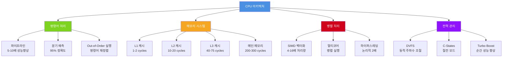

---
tags:
  - branch-prediction
  - cpu-architecture
  - intermediate
  - medium-read
  - performance-optimization
  - pipeline
  - simd
  - theoretical
  - 시스템프로그래밍
difficulty: INTERMEDIATE
learning_time: "2-3시간"
main_topic: "시스템 프로그래밍"
priority_score: 4
---

# 2.1.1: CPU 아키텍처 개요

## 🎯 CPU 아키텍처: 나노초 오케스트라의 비밀

현대 CPU는 단순한 계산기가 아닙니다. 이들은 미래를 예측하고, 명령어를 재정렬하며, 메모리를 미리 가져오는 똑똑한**예측기**입니다. Intel 엔지니어의 말처럼 "우리가 만든 CPU는 사실 점쟁이예요. 미래를 예측하죠."

이 문서는 CPU의 내부 동작 원리를 깊이 있게 탐구하며, 실제 성능 최적화에 필요한 핵심 개념들을 다룹니다.

## 📚 학습 로드맵

이 섹션은 4개의 전문화된 문서로 구성되어 있습니다:

### 1️⃣ [CPU 기본 구조와 명령어 실행](./02-01-02-cpu-fundamentals.md)

- CPU 구성 요소와 레지스터 구조
- 명령어 페치, 디코드, 실행 과정
- 파이프라인의 원리와 하자드 처리
- x86 명령어 형식과 마이크로 옵 변환

### 2️⃣ [분기 예측과 Out-of-Order 실행](./02-01-03-prediction-ooo.md)

- 분기 예측기의 학습 알고리즘
- Spectre/Meltdown 공격과 보안 이슈
- Tomasulo 알고리즘과 Reservation Station
- ROB(Reorder Buffer)를 통한 순서 보장

### 3️⃣ [CPU 캐시와 SIMD 벡터화](./02-01-04-cache-simd.md)

- 캐시 계층 구조와 일관성 프로토콜
- 캐시 최적화 기법과 False Sharing 방지
- SIMD 명령어와 실제 활용 사례
- 자동 벡터화와 수동 최적화

### 4️⃣ [성능 측정과 실전 최적화](./02-01-05-performance-optimization.md)

- CPU 성능 카운터와 프로파일링
- perf 도구를 활용한 병목 지점 분석
- 실전 최적화 기법과 우선순위
- 최적화의 함정과 효과적인 접근법

## 🎯 핵심 개념 비교표

| 기술 | 목적 | 성능 향상 | 복잡도 | 설명 |
|------|------|----------|--------|------|
|**파이프라인**| 처리량 증가 | 5-10배 | 중간 | 명령어를 단계별로 중첩 실행 |
|**분기 예측**| 파이프라인 효율화 | 2-6배 | 높음 | if문 결과를 95% 정확도로 예측 |
|**Out-of-Order**| 실행 효율성 | 1.5-3배 | 매우 높음 | 명령어 재정렬로 대기시간 최소화 |
|**캐시**| 메모리 대기시간 감소 | 10-100배 | 높음 | 자주 사용하는 데이터를 고속 저장 |
|**SIMD**| 데이터 병렬성 | 4-16배 | 중간 | 한 번에 여러 데이터 동시 처리 |

## 🏗️ CPU 아키텍처 전체 구조

## 🚀 실전 활용 시나리오

### 게임 엔진 최적화

-**문제**: 60 FPS 유지를 위한 16.6ms 프레임 시간
-**해결**: 파이프라인 친화적 코드와 SIMD 벡터화
-**결과**: 30 FPS → 144 FPS 성능 향상

### 이미지/비디오 처리

-**사례**: Instagram 세피아 필터, YouTube 인코딩
-**기법**: AVX2/AVX-512 SIMD 명령어 활용
-**효과**: 45ms → 6ms (7.5배 향상)

### 데이터베이스 쿼리

-**병목**: 캐시 미스와 분기 예측 실패
-**최적화**: SoA 데이터 구조, 브랜치리스 코드
-**개선**: 쿼리 처리 속도 5-10배 향상

## 🔗 연관 학습

### 선행 학습

- [메모리 관리 기초](../chapter-03-memory-system/) - 가상 메모리와 페이지 테이블
- [프로세스와 스레드](../chapter-01-process-thread/) - 컨텍스트 스위칭 기초

### 후속 학습  

- [인터럽트와 예외 처리](./02-02-02-interrupt-exception.md) - CPU 모드 전환
- [컨텍스트 스위칭](./02-03-03-context-switching.md) - 프로세스 간 전환 메커니즘
- [전력 관리](./02-05-02-power-management.md) - CPU 상태와 절전 모드

## 🎬 이 여행에서 얻을 수 있는 것

이 섹션을 마치면 다음과 같은 질문에 답할 수 있게 됩니다:

- CPU가 어떻게 미래를 "예측"하며 성능을 높이는가?
- 왜 정렬된 배열이 랜덤 배열보다 4배 빠른가?
- Instagram이 실시간 필터를 어떻게 구현하는가?
- Netflix가 스트리밍 서버를 어떻게 최적화했는가?
- 게임이 60 FPS를 유지하는 나노초 단위의 마법은 무엇인가?

더 나아가 여러분의 코드가 하드웨어에서 어떻게 실행되는지 정확히 이해하고, 실제로 측정 가능한 성능 향상을 달성할 수 있게 됩니다.

---

**다음**: [CPU 기본 구조와 명령어 실행](./02-01-02-cpu-fundamentals.md)에서 CPU의 내부 구조와 명령어 처리 과정부터 시작합니다.

## 📚 관련 문서

### 📖 현재 문서 정보

-**난이도**: INTERMEDIATE
-**주제**: 시스템 프로그래밍
-**예상 시간**: 2-3시간

### 🎯 학습 경로

- [📚 INTERMEDIATE 레벨 전체 보기](../learning-paths/intermediate/)
- [🏠 메인 학습 경로](../learning-paths/)
- [📋 전체 가이드 목록](../README.md)

### 📂 같은 챕터 (chapter-02-cpu-interrupt)

- [Chapter 2-1-2: CPU 기본 구조와 명령어 실행](./02-01-02-cpu-fundamentals.md)
- [Chapter 2-1-3: 분기 예측과 Out-of-Order 실행](./02-01-03-prediction-ooo.md)
- [Chapter 2-1-4: CPU 캐시와 SIMD 벡터화](./02-01-04-cache-simd.md)
- [Chapter 2-1-5: 성능 측정과 실전 최적화](./02-01-05-performance-optimization.md)
- [Chapter 2-2-2: 인터럽트와 예외 개요](./02-02-02-interrupt-exception.md)

### 🏷️ 관련 키워드

`cpu-architecture`, `performance-optimization`, `pipeline`, `branch-prediction`, `simd`

### ⏭️ 다음 단계 가이드

- 실무 적용을 염두에 두고 프로젝트에 적용해보세요
- 관련 도구들을 직접 사용해보는 것이 중요합니다
