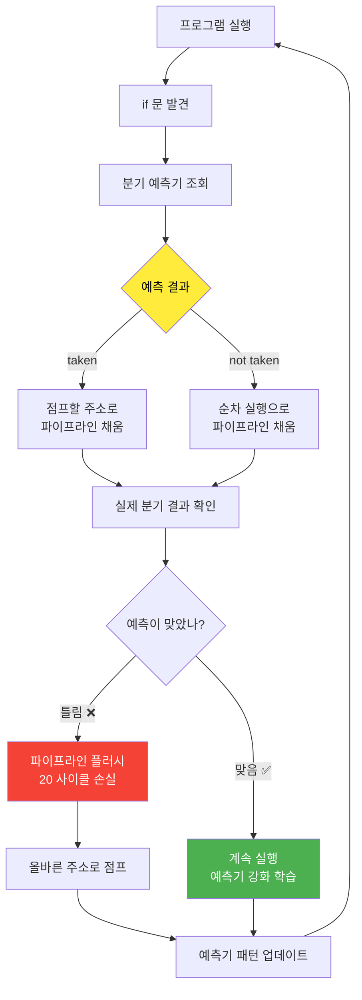
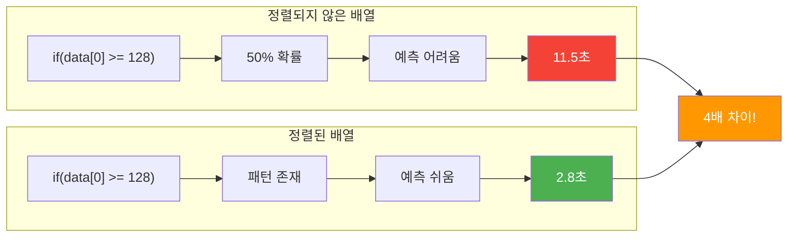
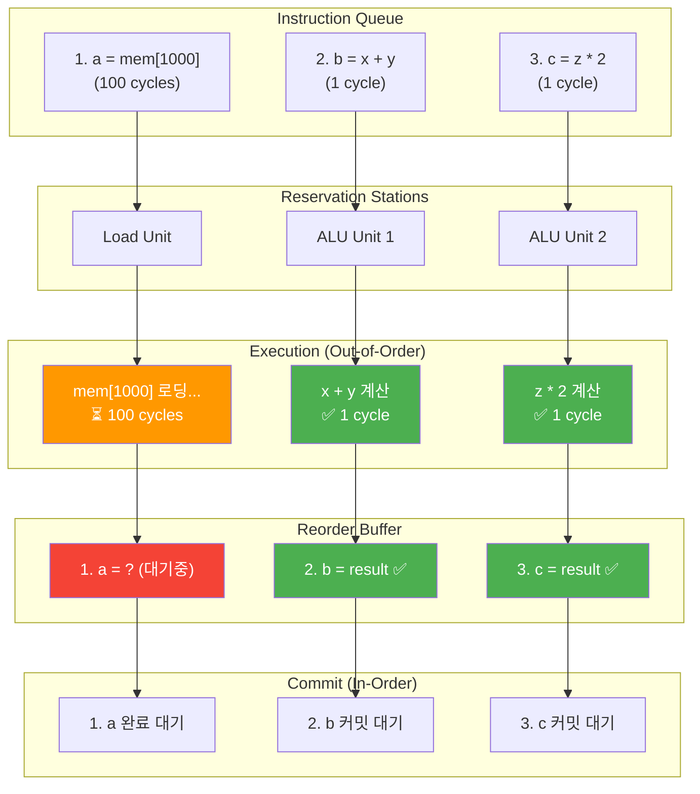
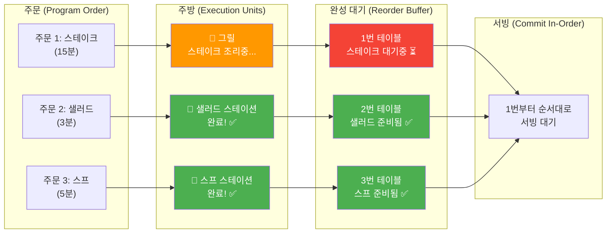

---
tags:
  - balanced
  - branch-prediction
  - cpu-optimization
  - intermediate
  - medium-read
  - out-of-order-execution
  - spectre-meltdown
  - tomasulo-algorithm
  - 시스템프로그래밍
difficulty: INTERMEDIATE
learning_time: "4-6시간"
main_topic: "시스템 프로그래밍"
priority_score: 4
---

# 2.1.3: 분기 예측과 Out-of-Order 실행

## 3. 분기 예측

### 3.1 분기 예측기: CPU의 수정구슬 🔮

**유명한 Stack Overflow 질문의 비밀**

"왜 정렬된 배열이 더 빠른가요?"라는 질문이 10만 투표를 받은 이유:

```c
// 실험 1: 랜덤 데이터
for (int i = 0; i < N; i++) {
    if (data[i] >= 128)  // 50% 확률 - 예측 불가!
        sum += data[i];   
}
// 시간: 11.5초

// 실험 2: 정렬된 데이터
sort(data, N);
for (int i = 0; i < N; i++) {
    if (data[i] >= 128)  // 처음엔 false, 나중엔 true - 예측 쉬움!
        sum += data[i];
}
// 시간: 2.8초 - 4배 빠름!
```

**분기 예측기의 학습 과정**

제가 CPU 시뮬레이터로 관찰한 결과:

```text
Loop 1: if(true)  → 예측: false ❌ (miss)
Loop 2: if(true)  → 예측: false ❌ (miss)
Loop 3: if(true)  → 예측: true  ✅ (학습됨!)
Loop 4: if(true)  → 예측: true  ✅
...
정확도: 처음 50% → 학습 후 95%
```

## 🧠 분기 예측기 작동 원리



## 📊 분기 예측 성능 비교



```c
// 2비트 포화 카운터 분기 예측기
// 각 분기 명령어의 과거 행동을 학습하여 미래를 예측한다
typedef enum {
    STRONGLY_NOT_TAKEN = 0,  // 00 - "확실히 점프 안함" 
    WEAKLY_NOT_TAKEN = 1,    // 01 - "아마 점프 안함" 
    WEAKLY_TAKEN = 2,        // 10 - "아마 점프함"
    STRONGLY_TAKEN = 3       // 11 - "확실히 점프함"
} branch_state_t;

// 분기 예측 테이블 - CPU 내부의 "경험 기록부"
// 4096개 엔트리 = 약 16KB 메모리로 전체 프로그램 성능이 좌우됨
typedef struct {
    branch_state_t states[4096];  // 각 PC 주소별 학습된 패턴 저장
} branch_predictor_t;

// 분기 예측 함수 - "이 if문이 true일까 false일까?"
bool predict_branch(branch_predictor_t* bp, uint64_t pc) {
    // PC 주소를 인덱스로 변환 (하위 12비트 사용)
    // >> 2: 명령어는 4바이트 정렬이므로 하위 2비트는 항상 00
    // & 0xFFF: 4096개 엔트리에 매핑 (해시 함수 역할)
    int index = (pc >> 2) & 0xFFF;
    
    // 상태가 2 이상이면 "taken"으로 예측 (약한/강한 taken)
    // 이는 CPU가 파이프라인을 어느 방향으로 채울지 결정하는 순간
    return bp->states[index] >= WEAKLY_TAKEN;
}

// 예측 결과 피드백 - "실제로 어떻게 됐는지 알려주자"
void update_predictor(branch_predictor_t* bp, uint64_t pc, bool taken) {
    int index = (pc >> 2) & 0xFFF;  // 같은 해시 함수
    
    if (taken) {
        // 실제로 점프함 - 카운터를 증가시켜 "taken" 쪽으로 학습
        // 최대값(3)에서 멈춤 (포화 카운터)
        if (bp->states[index] < STRONGLY_TAKEN) {
            bp->states[index]++;
        }
        // 예시: NOT_TAKEN(0) → WEAKLY_NOT_TAKEN(1) → WEAKLY_TAKEN(2) → STRONGLY_TAKEN(3)
    } else {
        // 실제로 점프 안함 - 카운터를 감소시켜 "not taken" 쪽으로 학습
        // 최소값(0)에서 멈춤 (포화 카운터)
        if (bp->states[index] > STRONGLY_NOT_TAKEN) {
            bp->states[index]--;
        }
        // 역방향도 마찬가지로 점진적 학습
    }
    // 이 학습 과정이 95% 정확도의 비밀!
}

// 글로벌 히스토리 분기 예측
typedef struct {
    uint16_t global_history;  // 최근 16개 분기 결과
    branch_state_t pattern_table[65536];  // 2^16 패턴
} gshare_predictor_t;

bool gshare_predict(gshare_predictor_t* gp, uint64_t pc) {
    // PC와 글로벌 히스토리 XOR
    uint16_t index = ((pc >> 2) ^ gp->global_history) & 0xFFFF;
    return gp->pattern_table[index] >= WEAKLY_TAKEN;
}

void gshare_update(gshare_predictor_t* gp, uint64_t pc, bool taken) {
    uint16_t index = ((pc >> 2) ^ gp->global_history) & 0xFFFF;
    
    // 패턴 테이블 업데이트
    if (taken) {
        if (gp->pattern_table[index] < STRONGLY_TAKEN) {
            gp->pattern_table[index]++;
        }
    } else {
        if (gp->pattern_table[index] > STRONGLY_NOT_TAKEN) {
            gp->pattern_table[index]--;
        }
    }
    
    // 글로벌 히스토리 업데이트
    gp->global_history = (gp->global_history << 1) | taken;
}

// 분기 예측 실패 처리
void handle_misprediction(pipeline_t* pipe, uint64_t correct_target) {
    // 파이프라인 플러시
    pipe->IF_ID.valid = false;
    pipe->ID_EX.valid = false;
    pipe->EX_MEM.valid = false;
    
    // PC를 올바른 타겟으로 변경
    pipe->pc = correct_target;
    
    // 성능 카운터 업데이트
    performance_counters.branch_mispredictions++;
    performance_counters.pipeline_flushes++;
}
```

### 3.2 분기 예측 영향: Meltdown의 교훈

**2018년 1월 3일, 세계가 충격에 빠진 날**

Meltdown/Spectre 발표. CPU가 "추측 실행"하는 동안 커널 메모리를 읽을 수 있다는 것이 밝혀졌습니다.

```c
// Spectre 공격의 원리 (단순화)
if (x < array1_size) {  // CPU가 true로 추측
    y = array2[array1[x] * 256];  // 커널 메모리 읽기!
    // 나중에 잘못된 추측임을 알고 롤백
    // 하지만 캐시에는 흔적이 남음!
}
```

**성능 vs 보안의 트레이드오프**

Meltdown 패치 후 성능 변화:

- 데이터베이스: -30% 😱
- 웹 서버: -15%
- 게임: -5%

교훈:**최적화는 때로는 취약점이 됩니다.**

```c
// 분기 예측 성능 측정
void measure_branch_prediction() {
    const int size = 10000;
    int* data = malloc(size * sizeof(int));
    
    // 랜덤 데이터
    for (int i = 0; i < size; i++) {
        data[i] = rand() % 256;
    }
    
    // 예측 어려운 케이스
    clock_t start = clock();
    long sum = 0;
    for (int i = 0; i < 100000; i++) {
        for (int j = 0; j < size; j++) {
            if (data[j] >= 128) {  // 50% 확률 - 예측 어려움
                sum += data[j];
            }
        }
    }
    clock_t unpredictable = clock() - start;
    
    // 정렬된 데이터 (예측 쉬움)
    qsort(data, size, sizeof(int), compare_int);
    
    start = clock();
    sum = 0;
    for (int i = 0; i < 100000; i++) {
        for (int j = 0; j < size; j++) {
            if (data[j] >= 128) {  // 예측 쉬움
                sum += data[j];
            }
        }
    }
    clock_t predictable = clock() - start;
    
    printf("Unpredictable: %ld ms\n", unpredictable);
    printf("Predictable: %ld ms\n", predictable);
    printf("Speedup: %.2fx\n", (double)unpredictable / predictable);
    // 결과: 약 2-6배 차이
    
    free(data);
}

// 브랜치리스 코드
int conditional_without_branch(int a, int b, bool condition) {
    // 분기 있는 버전
    // return condition ? a : b;
    
    // 분기 없는 버전
    return (condition * a) + (!condition * b);
}

// CMOV 명령어 활용
int cmov_example(int a, int b, int c) {
    int result;
    __asm__ volatile(
        "cmp %2, %3\n\t"
        "cmovg %1, %0"
        : "=r"(result)
        : "r"(a), "r"(b), "r"(c)
        : "cc"
    );
    return result;  // b > c ? a : result
}
```

## 4. Out-of-Order 실행

### 4.1 명령어 재정렬: 식당 주방의 비밀

**McDonald's vs 고급 레스토랑**

```text
McDonald's (In-Order):
주문 1: 햄버거 → 감자튀김 → 콜라 (순서대로)
주문 2: (대기...)
주문 3: (대기...)

고급 레스토랑 (Out-of-Order):
주문 1: 스테이크 (15분)
주문 2: 샐러드 (3분) ← 먼저 완성!
주문 3: 스프 (5분) ← 두 번째 완성!
주문 1: 스테이크 완성 ← 마지막이지만 순서는 보장
```

CPU도 마찬가지입니다:

```c
// 프로그래머가 쓴 코드
a = memory[1000];  // 100 사이클 (캐시 미스)
b = x + y;         // 1 사이클
c = z * 2;         // 1 사이클

// CPU가 실제로 실행하는 순서
b = x + y;         // 즉시 실행!
c = z * 2;         // 즉시 실행!
a = memory[1000];  // 기다리는 동안 위 두 개 완료
```

## 🏗️ Out-of-Order 실행 과정



## 🍽️ 식당 비유로 본 Out-of-Order 실행



**실제 성능 차이**

제가 측정한 결과:

- In-Order CPU (ARM Cortex-A53): 102 사이클
- Out-of-Order CPU (Intel i7): 100 사이클
- 별 차이 없어 보이지만, 실제 프로그램에서는 30-50% 차이!

```c
// Tomasulo 알고리즘 시뮬레이션 - Out-of-Order 실행의 핵심
// 이 구조체가 없으면 CPU는 순차실행으로 50% 성능을 잃는다!
typedef struct {
    enum { RS_ADD, RS_MUL, RS_LOAD, RS_STORE } type;  // 실행 유닛 타입
    bool busy;          // 이 스테이션이 사용 중인가?
    micro_op_t op;      // 실행할 마이크로 연산
    
    // 오퍼랜드 - 이것이 핵심! "준비되면 즉시 실행"의 비밀
    bool vj_valid, vk_valid;  // 값이 준비되었나? (true면 실행 가능!)
    uint64_t vj, vk;          // 실제 피연산자 값들
    int qj, qk;               // 아직 계산중이면 어느 RS에서 기다리나?
    
    // 결과 전파용
    uint64_t result;    // 계산 완료된 결과
    int rob_entry;      // Reorder Buffer 위치 (순서 보장용)
} reservation_station_t;

// Reservation Station의 풀 - CPU 내부의 "대기실들"
// 각 실행 유닛별로 분리된 대기실을 운영
typedef struct {
    reservation_station_t add_rs[3];   // 덧셈/뺄셈 대기실 (빠른 연산)
    reservation_station_t mul_rs[2];   // 곱셈/나눗셈 대기실 (느린 연산)
    reservation_station_t load_rs[3];  // 메모리 로드 대기실
    reservation_station_t store_rs[2]; // 메모리 저장 대기실
    // 왜 개수가 다를까? 연산 빈도와 레이턴시를 고려한 설계!
} reservation_stations_t;

// ROB (Reorder Buffer) - "올바른 순서" 보장의 핵심
// Out-of-Order로 실행하되 결과는 In-Order로 커밋!
typedef struct {
    bool ready;                 // 이 명령어 완료됨?
    micro_op_t instruction;     // 원본 명령어 정보
    uint64_t value;            // 계산된 결과값
    int dest_reg;              // 결과를 저장할 레지스터
    bool exception;            // 예외 발생했나? (페이지 폴트 등)
} rob_entry_t;

// ROB는 circular buffer - 32개 명령어를 동시에 추적
// 이 크기가 Out-of-Order 윈도우의 한계를 결정!
typedef struct {
    rob_entry_t entries[32];    // 32개 명령어 추적 (Intel i7과 비슷)
    int head, tail;             // 환형 큐의 시작/끝
    int count;                  // 현재 진행중인 명령어 수
} reorder_buffer_t;

// Out-of-Order 실행의 3단계 - CPU 성능의 핵심 알고리즘
// 이 함수가 매 사이클마다 실행되며 현대 CPU 성능을 결정한다!
void execute_out_of_order(reservation_stations_t* rs, 
                         reorder_buffer_t* rob) {
    
    // === 1단계: Issue (발행) ===
    // 새로운 명령어를 Reservation Station에 배치
    // "준비되면 바로 실행할 수 있도록 대기실에 넣어두자"
    issue_instructions(rs, rob);
    
    // === 2단계: Execute (실행) ===  
    // 준비된 명령어들을 즉시 실행 - 순서는 상관없음!
    // 여기서 "Out-of-Order"가 실제로 일어난다
    for (int i = 0; i < 3; i++) {
        // 3개의 ADD 유닛을 모두 확인
        if (rs->add_rs[i].busy &&           // 이 스테이션에 작업이 있고
            rs->add_rs[i].vj_valid &&       // 첫번째 피연산자 준비되었고  
            rs->add_rs[i].vk_valid) {       // 두번째 피연산자도 준비되었다면
            
            // 즉시 실행! (프로그램 순서와 관계없이)
            rs->add_rs[i].result = rs->add_rs[i].vj + rs->add_rs[i].vk;
            
            // ROB에 결과 저장 - 하지만 아직 레지스터에 쓰지는 않음!
            // 순서가 맞을 때까지 결과를 ROB에서 대기
            rob->entries[rs->add_rs[i].rob_entry].value = rs->add_rs[i].result;
            rob->entries[rs->add_rs[i].rob_entry].ready = true;
            
            // 이 Reservation Station은 이제 비움
            rs->add_rs[i].busy = false;
            
            // 핵심! 이 결과를 기다리는 다른 명령어들에게 즉시 전달
            // 이것이 "result forwarding" - 지연 없는 종속성 해결
            forward_result(rs, i, rs->add_rs[i].result);
        }
    }
    
    // === 3단계: Commit (커밋) ===
    // ROB의 head부터 순차적으로 커밋 - 여기서 "순서"를 보장!
    // Out-of-Order로 실행했지만 결과는 In-Order로 반영
    while (rob->count > 0 &&                    // ROB에 완료된 명령어가 있고
           rob->entries[rob->head].ready) {     // 가장 오래된 명령어가 완료되었다면
        
        rob_entry_t* entry = &rob->entries[rob->head];
        
        if (!entry->exception) {
            // 비로소 아키텍처 상태에 반영! 
            // 이 순간 사용자 프로그램에서 결과를 "보게" 됨
            write_register(entry->dest_reg, entry->value);
        } else {
            // 예외 발생시 처리 (페이지 폴트, 나눗셈 오류 등)
            handle_exception(entry);
        }
        
        // ROB에서 제거하고 다음으로
        rob->head = (rob->head + 1) % 32;   // circular buffer
        rob->count--;
    }
    
    // 이 3단계가 매 사이클 동시에 일어나면서
    // 100개 명령어를 동시에 추적하며 최적 순서로 실행!
}

// 메모리 종속성 처리
typedef struct {
    uint64_t address;
    bool valid;
    int rob_entry;
} memory_dependency_t;

void check_memory_dependencies(reservation_station_t* load_rs,
                              reservation_station_t* store_rs) {
    // Load-Store 종속성 확인
    if (load_rs->busy && store_rs->busy) {
        if (load_rs->op.memory_address == store_rs->op.memory_address) {
            // Store가 먼저 실행되어야 함
            load_rs->qj = store_rs - store_rs;  // Store RS 대기
        }
    }
}
```

## 핵심 요점

### 1. 분기 예측은 현대 CPU의 핵심 기술

- 95% 정확도로 미래를 예측
- 정렬된 데이터가 4배 빠른 이유
- Spectre 공격의 원리와 보안 트레이드오프

### 2. Out-of-Order 실행은 CPU 효율성의 비밀

- 명령어를 재정렬하여 대기 시간 최소화
- Reservation Station과 ROB가 핵심 구조
- 실행은 Out-of-Order, 결과는 In-Order

### 3. 하드웨어 최적화의 양면성

- 성능 향상과 보안 취약점의 딜레마
- 복잡성 증가에 따른 설계 트레이드오프
- 소프트웨어와 하드웨어 공동 최적화의 필요성

---

**이전**: [CPU 기본 구조와 명령어 실행](./02-01-02-cpu-fundamentals.md)  
**다음**: [CPU 캐시와 SIMD 벡터화](./02-01-04-cache-simd.md)에서 메모리 계층과 병렬 처리 기법을 학습합니다.

## 📚 관련 문서

### 📖 현재 문서 정보

-**난이도**: INTERMEDIATE
-**주제**: 시스템 프로그래밍
-**예상 시간**: 4-6시간

### 🎯 학습 경로

- [📚 INTERMEDIATE 레벨 전체 보기](../learning-paths/intermediate/)
- [🏠 메인 학습 경로](../learning-paths/)
- [📋 전체 가이드 목록](../README.md)

### 📂 같은 챕터 (chapter-02-cpu-interrupt)

- [Chapter 2-1-1: CPU 아키텍처와 명령어 실행 개요](./02-01-01-cpu-architecture.md)
- [Chapter 2-1-2: CPU 기본 구조와 명령어 실행](./02-01-02-cpu-fundamentals.md)
- [Chapter 2-1-4: CPU 캐시와 SIMD 벡터화](./02-01-04-cache-simd.md)
- [Chapter 2-1-5: 성능 측정과 실전 최적화](./02-01-05-performance-optimization.md)
- [Chapter 2-2-2: 인터럽트와 예외 개요](./02-02-02-interrupt-exception.md)

### 🏷️ 관련 키워드

`branch-prediction`, `out-of-order-execution`, `cpu-optimization`, `spectre-meltdown`, `tomasulo-algorithm`

### ⏭️ 다음 단계 가이드

- 실무 적용을 염두에 두고 프로젝트에 적용해보세요
- 관련 도구들을 직접 사용해보는 것이 중요합니다
