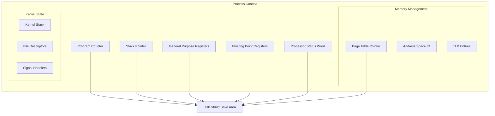

---
tags:
  - context-switching
  - cpu-registers
  - fundamentals
  - multitasking
  - process-state
  - quick-read
  - task-struct
  - theoretical
  - 시스템프로그래밍
difficulty: FUNDAMENTALS
learning_time: "1-2시간"
main_topic: "시스템 프로그래밍"
priority_score: 3
---

# 2.3.1: 컨텍스트 기초

## 도입: 멀티태스킹의 핵심 메커니즘

### 구글 크롬이 탭 100개를 동시에 처리하는 비밀

한 구글 엔지니어의 경험담:

> "사용자가 크롬에서 탭 100개를 열어놓고 유튜브 동영상을 보면서, 구글 독스로 문서를 작성하고, Gmail을 확인합니다. CPU 코어는 4개뿐인데 어떻게 가능할까요? 비밀은**초당 1000번의 컨텍스트 스위칭**이죠."

실제 측정 결과:

```bash
# 크롬 브라우저 실행 중 컨텍스트 스위칭 측정
$ vmstat 1
procs -----------memory---------- ---swap-- -----io---- -system-- ------cpu-----
 r  b   swpd   free   buff  cache   si   so    bi    bo   in   cs us sy id wa st
2  0      0 8234560 234560 4567890    0    0     0     8  2341 4567 45 12 43  0  0
#                                                           ^^^^ 초당 4567번!

# 각 탭이 받는 시간
100개 탭 ÷ 4 코어 = 코어당 25개 탭
1초 ÷ 25 = 40ms per 탭
# 40ms면 충분합니다! 인간은 50ms 이하 지연을 느끼지 못하거든요
```

### CPU의 저글링 - 프로세스 공을 떨어뜨리지 마라

서커스 저글러를 상상해보세요:

-**공 = 프로세스**
-**손 = CPU 코어**
-**공 잡기/던지기 = 컨텍스트 스위칭**

```python
# CPU의 저글링 시뮬레이션
class CPU:
    def juggle_processes(self):
        while True:
            process = self.catch_ball()     # 현재 프로세스 상태 저장
            self.juggle_time(10_ms)         # 10ms 동안 실행
            self.throw_ball(process)        # 다음을 위해 저장
            next_process = self.grab_next() # 다음 프로세스 로드
            # 🎪 완벽한 저글링! 아무도 떨어지지 않음
```

이제 이 마법같은 저글링이 어떻게 작동하는지 깊이 들어가봅시다!

## CPU 컨텍스트의 구성 요소

### 리누스 토르발스의 고백 - "컨텍스트는 무겁다"

리누스 토르발스의 커밋 메시지에서:

> "컨텍스트 스위칭은 생각보다 훨씬 무겁습니다. 레지스터 몇 개 저장하는 게 아니에요. CPU의 전체 상태, 메모리 맵핑, 캐시, TLB... 마치 이사하는 것과 같죠. 🏠→🏠"

실제로 저장해야 하는 것들:

```python
# 프로세스 이사 체크리스트
context_checklist = {
    '가구': ['레지스터 16개', 'PC', 'SP', 'FLAGS'],           # 64B
    '가전': ['FPU 상태', 'SSE/AVX 벡터'],                    # 512B
    '주소록': ['페이지 테이블 포인터', 'TLB 엔트리'],          # 4KB
    '개인물품': ['파일 디스크립터', '시그널 핸들러'],           # 8KB
    '보안': ['권한 정보', 'capabilities'],                    # 1KB
    # 총 이사 짐: 프로세스당 약 14KB!
}
```

### 프로세스 컨텍스트 구조 - CPU의 신분증



### Task Struct의 컨텍스트 저장 영역 - 프로세스의 블랙박스

넷플릭스 엔지니어의 디버깅 스토리:

> "서버가 갑자기 느려졌어요. 프로파일링 결과? 컨텍스트 스위칭이 초당 10만 번! task_struct를 덤프해보니 FPU 상태 저장/복원이 병목이었죠. AVX-512 사용을 끄니 30% 빨라졌습니다."

```c
// Linux task_struct의 스레드 정보 - 프로세스의 모든 것
struct thread_struct {
    // CPU 레지스터 상태
    struct pt_regs regs;

    // x86-64 아키텍처 특정 레지스터
    unsigned long sp;       // Stack pointer
    unsigned long ip;       // Instruction pointer

    // 세그먼트 레지스터
    unsigned short es, ds, fsindex, gsindex;
    unsigned long fs, gs;

    // 디버그 레지스터
    unsigned long debugreg[8];

    // FPU/SSE/AVX 상태
    struct fpu fpu;

    // I/O 권한 비트맵
    unsigned long *io_bitmap_ptr;
    unsigned long iopl;

    // TLS (Thread Local Storage)
    struct desc_struct tls_array[GDT_ENTRY_TLS_ENTRIES];
};

// 레지스터 세트 구조체
struct pt_regs {
    // 범용 레지스터 (x86-64)
    unsigned long r15, r14, r13, r12;
    unsigned long rbp, rbx;
    unsigned long r11, r10, r9, r8;
    unsigned long rax, rcx, rdx;
    unsigned long rsi, rdi;

    // 특수 레지스터
    unsigned long orig_rax;
    unsigned long rip;      // Instruction pointer
    unsigned long cs;       // Code segment
    unsigned long rflags;   // CPU flags
    unsigned long rsp;      // Stack pointer
    unsigned long ss;       // Stack segment
};
```

## 핵심 요점

### 1. 컨텍스트는 프로세스의 완전한 실행 상태

CPU 레지스터, 메모리 맵핑, 권한 정보 등 프로세스 실행에 필요한 모든 정보

### 2. Task Struct가 컨텍스트의 핵심 저장소

리눅스에서 각 프로세스는 약 14KB의 컨텍스트 정보를 task_struct에 저장

### 3. 컨텍스트 스위칭은 "프로세스 이사"

단순한 레지스터 교체가 아닌 전체 실행 환경의 완전한 전환

---

**이전**: [컨텍스트 스위칭 개요](./02-03-03-context-switching.md)
**다음**: [컨텍스트 스위칭 메커니즘](./02-03-05-switching-mechanisms.md)에서 실제 전환 과정을 살펴보겠습니다.

## 📚 관련 문서

### 📖 현재 문서 정보

-**난이도**: FUNDAMENTALS
-**주제**: 시스템 프로그래밍
-**예상 시간**: 1-2시간

### 🎯 학습 경로

- [📚 FUNDAMENTALS 레벨 전체 보기](../learning-paths/fundamentals/)
- [🏠 메인 학습 경로](../learning-paths/)
- [📋 전체 가이드 목록](../README.md)

### 📂 같은 챕터 (chapter-02-cpu-interrupt)

- [Chapter 2-1-1: CPU 아키텍처와 명령어 실행 개요](./02-01-01-cpu-architecture.md)
- [Chapter 2-1-2: CPU 기본 구조와 명령어 실행](./02-01-02-cpu-fundamentals.md)
- [Chapter 2-1-3: 분기 예측과 Out-of-Order 실행](./02-01-03-prediction-ooo.md)
- [Chapter 2-1-4: CPU 캐시와 SIMD 벡터화](./02-01-04-cache-simd.md)
- [Chapter 2-1-5: 성능 측정과 실전 최적화](./02-01-05-performance-optimization.md)

### 🏷️ 관련 키워드

`context-switching`, `task-struct`, `cpu-registers`, `process-state`, `multitasking`

### ⏭️ 다음 단계 가이드

- 기초 개념을 충분히 이해한 후 INTERMEDIATE 레벨로 진행하세요
- 실습 위주의 학습을 권장합니다
