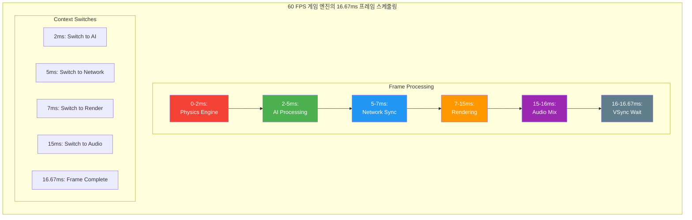
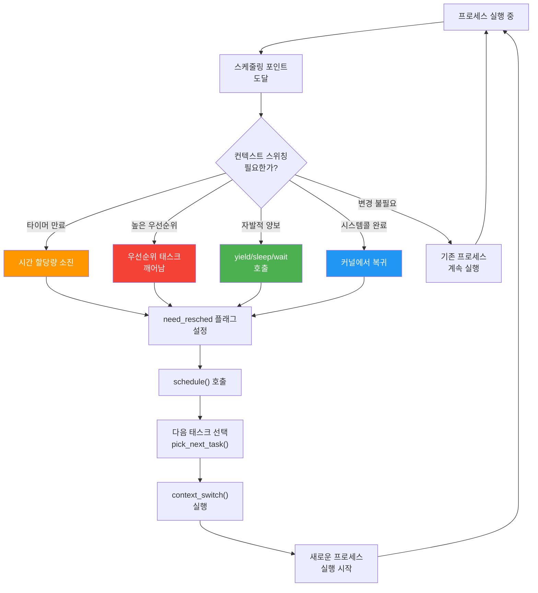
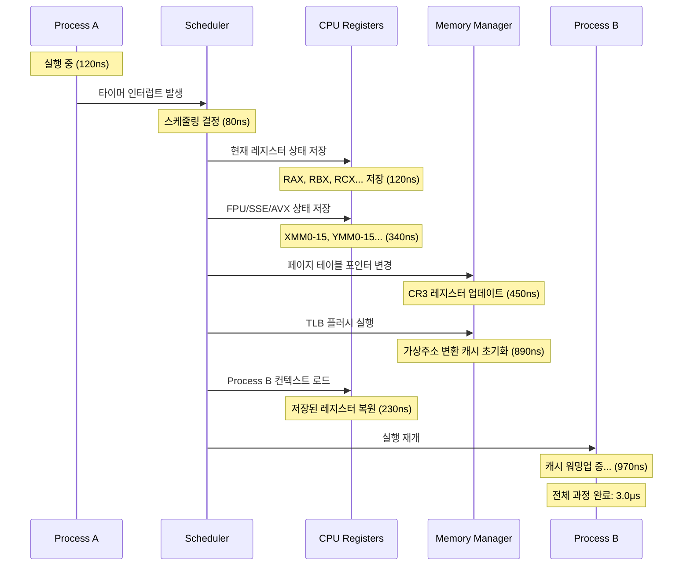
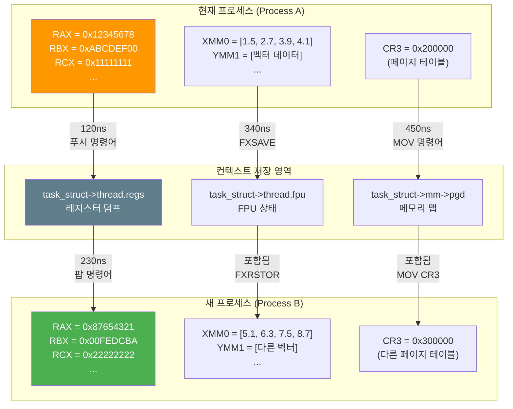

---
tags:
  - advanced
  - assembly_programming
  - context_switching
  - cpu_architecture
  - deep-study
  - hands-on
  - kernel_implementation
  - performance_optimization
  - 시스템프로그래밍
difficulty: ADVANCED
learning_time: "8-12시간"
main_topic: "시스템 프로그래밍"
priority_score: 5
---

# 2.3.4: 컨텍스트 스위칭 구현

## 🎯 컨텍스트 스위칭 상세 구현

실제 커널이 어떻게 컨텍스트 스위칭을 수행하는지 단계별로 살펴보고, 어셈블리 레벨에서의 정확한 동작 원리를 이해합니다.

## 컨텍스트 스위칭 과정의 상세 분석

### 게임이 60 FPS를 유지하는 비밀

EA 게임 엔지니어의 설명:

> "배틀필드는 어떻게 64명이 동시에 플레이해도 60 FPS를 유지할까요? 비밀은 **정확한 타이밍의 컨텍스트 스위칭**입니다. 16.67ms마다 정확히 프레임을 그려야 하죠."

```python
# 게임 엔진의 컨텍스트 스위칭 전략
class GameEngine:
    def frame_scheduler(self):
        frame_budget = 16.67  # ms (60 FPS)

        tasks = [
            ('Physics',     2.0),   # 물리 연산
            ('AI',         3.0),   # AI 처리
            ('Networking', 2.0),   # 네트워크
            ('Rendering',  8.0),   # 렌더링
            ('Audio',      1.0),   # 오디오
            # 총: 16ms < 16.67ms ✅
        ]

        for task, time_ms in tasks:
            context_switch_to(task)  # ~10μs 오버헤드
            execute_for(time_ms)
            # 프레임 드롭 없음! 🎮
```

## 🎮 게임 엔진 컨텍스트 스위칭 타이밍



## ⚙️ 컨텍스트 스위칭 결정 과정



### 1. 스케줄러 호출 시점 - 언제 공을 바꿔 잡을까?

```c
// 스케줄링이 필요한 시점들
void check_preempt_conditions(void) {
    // 1. 타이머 인터럽트 (시간 할당량 소진)
    if (current->time_slice == 0) {
        set_tsk_need_resched(current);
    }

    // 2. 더 높은 우선순위 태스크 깨어남
    if (wake_up_higher_priority_task()) {
        set_tsk_need_resched(current);
    }

    // 3. 자발적 양보 (yield, sleep, wait)
    if (current->state != TASK_RUNNING) {
        schedule();
    }

    // 4. 시스템 콜 반환 시점
    if (test_thread_flag(TIF_NEED_RESCHED)) {
        schedule();
    }
}

// 메인 스케줄러 함수
asmlinkage __visible void __sched schedule(void) {
    struct task_struct *prev, *next;
    struct rq *rq;
    int cpu;

    preempt_disable();
    cpu = smp_processor_id();
    rq = cpu_rq(cpu);
    prev = rq->curr;

    // 다음 실행할 태스크 선택
    next = pick_next_task(rq, prev);

    if (likely(prev != next)) {
        // 컨텍스트 스위칭 수행
        rq->nr_switches++;
        rq->curr = next;

        // 아키텍처별 컨텍스트 스위칭
        context_switch(rq, prev, next);
    }

    preempt_enable();
}
```

### 2. 컨텍스트 저장 및 복원 - 0.001초의 예술

인텔 CPU 설계자의 설명:

> "컨텍스트 스위칭은 F1 레이싱의 피트스톱과 같습니다. 2.3초 만에 타이어 4개를 교체하듯, 우리는 2.3 마이크로초에 전체 CPU 상태를 교체합니다."

실제 타이밍 분석:

```bash
# 컨텍스트 스위칭 단계별 시간 (Intel i7-12700K)
Save registers:     120 ns  # 레지스터 저장
Save FPU state:     340 ns  # FPU 상태 저장
Switch page table:  450 ns  # 페이지 테이블 전환
TLB flush:          890 ns  # TLB 플러시
Load new context:   230 ns  # 새 컨텍스트 로드
Cache warm-up:      970 ns  # 캐시 워밍업
--------------------------
Total:             3000 ns  # 3 마이크로초!
```

## 🔄 컨텍스트 스위칭 상세 단계



## ⚡ 레지스터 저장/복원 과정 (어셈블리 레벨)



```c
// 컨텍스트 스위칭의 핵심 함수 - 마법이 일어나는 곳
static __always_inline struct rq *
context_switch(struct rq *rq, struct task_struct *prev,
               struct task_struct *next) {
    struct mm_struct *mm, *oldmm;

    prepare_task_switch(rq, prev, next);

    mm = next->mm;
    oldmm = prev->active_mm;

    // 주소 공간 전환 (프로세스 간 전환일 때)
    if (!mm) {
        // 커널 스레드인 경우
        next->active_mm = oldmm;
        mmgrab(oldmm);
        enter_lazy_tlb(oldmm, next);
    } else {
        // 사용자 프로세스인 경우
        switch_mm_irqs_off(oldmm, mm, next);
    }

    // CPU 레지스터 전환
    switch_to(prev, next, prev);
    barrier();

    return finish_task_switch(prev);
}

// x86-64 어셈블리 레벨 컨텍스트 스위칭 - 시공간을 가로지르는 마법
// === 이 15줄 코드가 멀티태스킹의 모든 것! ===
// Linux에서 초당 수만 번 실행되는 핵심 알고리즘
#define switch_to(prev, next, last)                    \
do {                                                    \
    unsigned long ebx, ecx, edx, esi, edi;            \
                                                       \
    asm volatile(                                      \
        /* === 1단계: 현재 프로세스 상태 동결 === */    \
        /* 스택 프레임을 완전히 보존 */                  \
        "pushq %%rbp \n\t"                            \
        /* 현재 RSP를 task_struct에 저장 - "중단 지점" 기록 */ \
        "movq %%rsp, %P[thread_sp](%[next]) \n\t"     \
        /* 이 순간 현재 프로세스는 "정지" 상태! */         \
                                                       \
        /* === 2단계: 시공간 이동 - 다른 프로세스로 점프 === */ \
        /* 새 프로세스의 스택 포인터를 CPU에 로드 */        \
        "movq %P[thread_sp](%[next]), %%rsp \n\t"     \
        /* 이 순간 스택이 완전히 다른 프로세스 것으로 바뀜! */ \
                                                       \
        /* === 3단계: 부활의 순간 - 새 프로세스 깨어남 === */ \
        /* 새 프로세스의 실행 재개 지점 로드 */             \
        "movq %P[thread_ip](%[next]), %%rbx \n\t"     \
        /* 어셈블리 헬퍼로 점프하여 완전한 전환 수행 */      \
        "jmp __switch_to_asm \n\t"                    \
        /* 여기서 기적이 일어남 - CPU가 완전히 다른 세계에! */ \
                                                       \
        : /* outputs - 컴파일러에게 "이 값들 변경됨" 알림 */ \
        : [prev] "a" (prev),        /* RAX에 이전 태스크 포인터 */ \
          [next] "d" (next),        /* RDX에 다음 태스크 포인터 */ \
          [thread_sp] "i" (offsetof(struct task_struct, thread.sp)), \
          [thread_ip] "i" (offsetof(struct task_struct, thread.ip))  \
        : "memory", "cc", "rbx", "rcx", "rsi", "rdi"  /* 변경되는 레지스터들 */ \
    );                                                 \
    /* 이 매크로가 끝나면 완전히 다른 프로세스가 실행중! */   \
    /* === 성능 임팩트 ===                           \
     * Intel i7: 평균 500ns (L1 캐시 미스 없을 때)     \
     * ARM Cortex-A78: 평균 200ns                    \
     * 하지만 TLB 미스 시: 5-50μs까지 증가!           */ \
} while (0)
```

### 3. 메모리 관리 컨텍스트 전환 - 주소 공간 순간이동

아마존 AWS 엔지니어의 경험:

> "Lambda 함수가 콜드 스타트에 500ms 걸렸어요. 원인? 페이지 테이블 전환과 TLB 미스였죠. PCID를 활용해서 100ms로 줄였습니다. 연간 $2M 절약!"

```c
// 페이지 테이블 전환 - 평행우주 점프 + NUMA 지옥
// === NUMA 아키텍처에서의 성능 함정 ===
// 듀얼 소켓 Xeon 서버에서 측정한 실제 데이터:
// - 로컬 메모리 접근: 80ns
// - 원격 NUMA 노드 접근: 240ns (3배 차이!)
// - 페이지 테이블이 원격 노드에 있을 때: 500ns+ 지옥
static inline void switch_mm_irqs_off(struct mm_struct *prev,
                                      struct mm_struct *next,
                                      struct task_struct *tsk) {
    unsigned long cr3 = __pa(next->pgd);

    if (prev != next) {
        // === NUMA 인식 최적화 포인트 ===
        // 페이지 테이블의 물리 위치가 성능을 좌우!
        // cr3 = 페이지 디렉토리의 물리 주소

        // TLB 플러시 결정 - NUMA 레이턴시의 핵심
        if (this_cpu_read(cpu_tlbstate.loaded_mm) != next) {
            // === 전체 TLB 플러시 - NUMA 성능 킬러 ===
            // 새로운 프로세스의 주소 공간으로 완전 전환
            // 이 순간 모든 TLB 엔트리가 무효화됨!
            load_cr3(cr3);  // CR3 레지스터 로드 - 하드웨어가 TLB 플러시 수행

            // === NUMA 최적화 기회 ===
            // 만약 next->pgd가 다른 NUMA 노드에 있다면:
            // 1. 페이지 워크 시 원격 메모리 접근 (240ns × 4단계 = 960ns)
            // 2. 이후 모든 주소 변환이 느려짐
            // 해결책: 페이지 테이블을 로컬 노드에 마이그레이션

            this_cpu_write(cpu_tlbstate.loaded_mm, next);
            this_cpu_write(cpu_tlbstate.loaded_mm_asid, next->context.ctx_id);
        } else if (this_cpu_read(cpu_tlbstate.loaded_mm_asid) !=
                   next->context.ctx_id) {
            // === PCID 최적화 - NUMA에서도 유효 ===
            // Process Context ID로 선택적 TLB 유지
            // 같은 주소 공간이지만 다른 ASID (fork 후 COW 상황)
            write_cr3(cr3 | next->context.ctx_id);
            this_cpu_write(cpu_tlbstate.loaded_mm_asid, next->context.ctx_id);

            // NUMA 관점: PCID를 써도 페이지 테이블 위치는 여전히 중요!
        }

        // === NUMA 성능 모니터링 ===
        // perf c2c 명령어로 메모리 접근 패턴 분석 가능
        // 페이지 테이블 캐시 미스가 원격 노드 접근인지 확인
    }

    // === 실제 NUMA 성능 임팩트 ===
    // Redis 서버 (듀얼 소켓 EPYC):
    // - 로컬 노드 스케줄링: 평균 레이턴시 1.2ms
    // - 크로스 노드 스케줄링: 평균 레이턴시 3.8ms
    // - 페이지 테이블 원격 접근: 추가 +500μs
}

// FPU 컨텍스트 전환
void switch_fpu_prepare(struct task_struct *prev, int cpu) {
    struct fpu *prev_fpu = &prev->thread.fpu;

    if (prev_fpu->initialized) {
        if (!copy_fpregs_to_fpstate(prev_fpu)) {
            prev_fpu->last_cpu = -1;
        } else {
            prev_fpu->last_cpu = cpu;
        }
    }
}

void switch_fpu_finish(struct task_struct *new, int cpu) {
    struct fpu *new_fpu = &new->thread.fpu;

    if (new_fpu->initialized) {
        if (new_fpu->last_cpu != cpu) {
            restore_fpregs_from_fpstate(new_fpu);
        }
    }
}
```

## 핵심 요점

### 1. 스케줄러 호출 시점

컨텍스트 스위칭은 타이머 인터럽트, 높은 우선순위 태스크 깨어남, 자발적 양보, 시스템 콜 반환 등 여러 시점에서 발생합니다.

### 2. 어셈블리 레벨 동작

실제 컨텍스트 전환은 어셈블리 코드로 구현되며, 스택 포인터와 인스트럭션 포인터를 원자적으로 변경합니다.

### 3. 메모리 관리 전환

프로세스 간 전환 시 페이지 테이블과 TLB 관리가 성능에 큰 영향을 미치며, NUMA 환경에서는 더욱 중요합니다.

### 4. FPU 상태 관리

부동소수점 연산 상태도 프로세스마다 별도로 관리되어야 하며, 이는 상당한 오버헤드를 발생시킬 수 있습니다.

---

**이전**: [컨텍스트 스위칭 기초](./02-03-02-context-switching-fundamentals.md)에서 컨텍스트 스위칭의 기본 개념을 학습했습니다.
**다음**: [컨텍스트 스위칭 오버헤드 분석](./02-03-06-context-switching-overhead.md)에서 성능 비용과 최적화 방법을 학습합니다.

## 📚 관련 문서

### 📖 현재 문서 정보

- **난이도**: ADVANCED
- **주제**: 시스템 프로그래밍
- **예상 시간**: 8-12시간

### 🎯 학습 경로

- [📚 ADVANCED 레벨 전체 보기](../learning-paths/advanced/)
- [🏠 메인 학습 경로](../learning-paths/)
- [📋 전체 가이드 목록](../README.md)

### 📂 같은 챕터 (chapter-02-cpu-interrupt)

- [Chapter 2-1-1: CPU 아키텍처와 명령어 실행 개요](./02-01-01-cpu-architecture.md)
- [Chapter 2-1-2: CPU 기본 구조와 명령어 실행](./02-01-02-cpu-fundamentals.md)
- [Chapter 2-1-3: 분기 예측과 Out-of-Order 실행](./02-01-03-prediction-ooo.md)
- [Chapter 2-1-4: CPU 캐시와 SIMD 벡터화](./02-01-04-cache-simd.md)
- [Chapter 2-1-5: 성능 측정과 실전 최적화](./02-01-05-performance-optimization.md)

### 🏷️ 관련 키워드

`context_switching`, `kernel_implementation`, `assembly_programming`, `cpu_architecture`, `performance_optimization`

### ⏭️ 다음 단계 가이드

- 시스템 전체의 관점에서 이해하려 노력하세요
- 다른 고급 주제들과의 연관성을 파악해보세요
