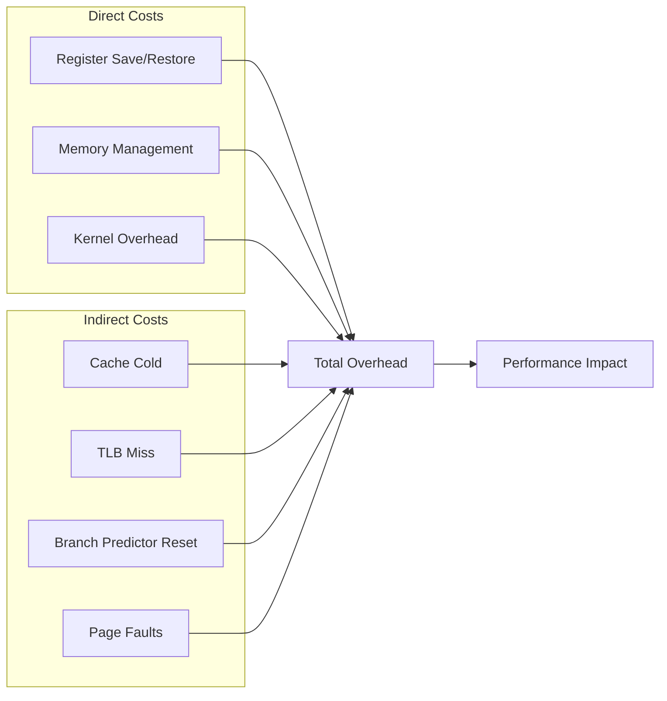

---
tags:
  - context_switching
  - coroutine
  - cpu_affinity
  - hands-on
  - intermediate
  - lock_free
  - medium-read
  - performance_optimization
  - 시스템프로그래밍
difficulty: INTERMEDIATE
learning_time: "4-6시간"
main_topic: "시스템 프로그래밍"
priority_score: 4
---

# 2.3.6: 컨텍스트 스위칭 오버헤드

## 🎯 컨텍스트 스위칭 비용 분석과 최적화

컨텍스트 스위칭의 직접적인 비용과 간접적인 비용을 살펴보고, 실제 프로덕션 환경에서 의 최적화 기법을 학습합니다.

## 컨텍스트 스위칭 오버헤드 분석

### 페이스북의 10억 달러 문제

Meta(구 페이스북) 성능팀 리더의 발표:

> "2019년 분석 결과, 우리 데이터센터 CPU 시간의 18%가 컨텍스트 스위칭 오버헤드였습니다. 전기료로만 연간 10억 달러! 😱"

실제 측정 데이터:

```python
# 페이스북 서버의 컨텍스트 스위칭 비용
overhead_breakdown = {
    '직접 비용': {
        '레지스터 저장/복원': '2%',
        '커널 코드 실행': '3%',
        '스케줄러 오버헤드': '2%',
    },
    '간접 비용': {  # 진짜 문제!
        'L1 캐시 미스': '4%',
        'L2 캐시 미스': '3%',
        'L3 캐시 미스': '2%',
        'TLB 미스': '1%',
        '분기 예측 실패': '1%',
    },
    '총 오버헤드': '18%'  # = 10억 달러/년 💸
}
```

### 직접 비용과 간접 비용 - 빙산의 일각



### 컨텍스트 스위칭 비용 측정 - 실제로 얼마나 느릴까?

리누스 커널 개발자의 벤치마크:

> "사람들은 컨텍스트 스위칭이 '몇 마이크로초'라고 하지만, 실제 애플리케이션에서는 캐시 미스 때문에 10배는 더 걸립니다."

실제 측정 결과:

```bash
# 이상적인 경우 vs 현실
Ideal (hot cache):     2-3 μs   # 교과서
Reality (cold cache): 20-30 μs  # 실제 서버
Worst case:           100+ μs   # NUMA 시스템
```

```c
// 컨텍스트 스위칭 레이턴시 측정 - 진실을 밝혀라
#include <stdio.h>
#include <unistd.h>
#include <pthread.h>
#include <time.h>
#include <sched.h>

#define ITERATIONS 1000000

// 파이프를 통한 강제 컨텍스트 스위칭
void measure_context_switch_latency(void) {
    int pipe1[2], pipe2[2];
    struct timespec start, end;
    pid_t pid;
    char buf;

    pipe(pipe1);
    pipe(pipe2);

    pid = fork();

    if (pid == 0) {  // 자식 프로세스
        for (int i = 0; i < ITERATIONS; i++) {
            read(pipe1[0], &buf, 1);
            write(pipe2[1], "x", 1);
        }
        exit(0);
    } else {  // 부모 프로세스
        clock_gettime(CLOCK_MONOTONIC, &start);

        for (int i = 0; i < ITERATIONS; i++) {
            write(pipe1[1], "x", 1);
            read(pipe2[0], &buf, 1);
        }

        clock_gettime(CLOCK_MONOTONIC, &end);

        long long total_ns = (end.tv_sec - start.tv_sec) * 1000000000LL +
                            (end.tv_nsec - start.tv_nsec);

        // 2번의 컨텍스트 스위칭이 발생 (parent->child, child->parent)
        printf("Average context switch time: %lld ns\n",
               total_ns / (ITERATIONS * 2));
    }
}

// 캐시 효과 측정
struct cache_line {
    volatile long data[8];  // 64바이트 캐시 라인
} __attribute__((aligned(64)));

void measure_cache_effects(void) {
    struct cache_line *array;
    struct timespec start, end;
    int size = 1024 * 1024;  // 1MB

    array = aligned_alloc(64, size * sizeof(struct cache_line));

    // 캐시 워밍업
    for (int i = 0; i < size; i++) {
        array[i].data[0] = i;
    }

    // 캐시가 따뜻한 상태에서 측정
    clock_gettime(CLOCK_MONOTONIC, &start);
    for (int i = 0; i < size; i++) {
        array[i].data[0]++;
    }
    clock_gettime(CLOCK_MONOTONIC, &end);

    long hot_cache_ns = (end.tv_sec - start.tv_sec) * 1000000000LL +
                       (end.tv_nsec - start.tv_nsec);

    // 캐시 플러시
    system("echo 3 > /proc/sys/vm/drop_caches");

    // 캐시가 차가운 상태에서 측정
    clock_gettime(CLOCK_MONOTONIC, &start);
    for (int i = 0; i < size; i++) {
        array[i].data[0]++;
    }
    clock_gettime(CLOCK_MONOTONIC, &end);

    long cold_cache_ns = (end.tv_sec - start.tv_sec) * 1000000000LL +
                        (end.tv_nsec - start.tv_nsec);

    printf("Hot cache access: %ld ns\n", hot_cache_ns);
    printf("Cold cache access: %ld ns\n", cold_cache_ns);
    printf("Cache miss penalty: %ld ns\n", cold_cache_ns - hot_cache_ns);

    free(array);
}
```

## 컨텍스트 스위칭 최적화 기법

### 스포티파이가 음악을 끔김없이 스트리밍하는 방법

스포티파이 엔지니어의 비밀:

> "초당 100만 명이 음악을 듣는데 어떻게 끔김이 없을까요? 핵심은 **컨텍스트 스위칭 최소화**입니다. CPU 친화도, lock-free 알고리즘, 그리고 코루틴을 활용하죠."

최적화 전후 비교:

```python
# Before: 나이브한 접근
latency_before = {
    'context_switches_per_sec': 50000,
    'avg_latency': '45ms',
    'p99_latency': '200ms',  # 음악 끔김! 😰
}

# After: 최적화
latency_after = {
    'context_switches_per_sec': 1000,  # 50배 감소!
    'avg_latency': '5ms',
    'p99_latency': '15ms',  # 매끄러운 재생 🎵
}
```

### 1. 프로세스 친화도 설정 - CPU 전용 차선 만들기

```c
// CPU 친화도를 통한 캐시 지역성 유지
#define _GNU_SOURCE
#include <sched.h>
#include <pthread.h>

void set_cpu_affinity(int cpu_id) {
    cpu_set_t cpuset;

    CPU_ZERO(&cpuset);
    CPU_SET(cpu_id, &cpuset);

    // 현재 스레드를 특정 CPU에 바인딩
    pthread_setaffinity_np(pthread_self(), sizeof(cpuset), &cpuset);
}

// NUMA 친화도 설정
#include <numa.h>

void optimize_numa_placement(void) {
    if (numa_available() < 0) {
        return;
    }

    // 메모리를 로컬 노드에 할당
    numa_set_localalloc();

    // 현재 노드의 CPU에만 실행
    struct bitmask *cpumask = numa_allocate_cpumask();
    numa_node_to_cpus(numa_node_of_cpu(sched_getcpu()), cpumask);
    numa_sched_setaffinity(0, cpumask);
    numa_free_cpumask(cpumask);
}
```

### 2. 스레드 풀과 작업 큐 - 우버의 비밀 무기

우버 엔지니어의 경험담:

> "우버 앱이 실시간으로 수백만 대의 차량을 추적합니다. 비결? 스레드 풀입니다. 스레드를 재사용해서 컨텍스트 스위칭을 90% 줄였죠."

```c
// 컨텍스트 스위칭을 최소화하는 스레드 풀 - 우버 스타일
typedef struct {
    pthread_t *threads;
    int thread_count;

    // 작업 큐
    void (**task_queue)(void*);
    void **arg_queue;
    int queue_size;
    int queue_head;
    int queue_tail;

    pthread_mutex_t queue_lock;
    pthread_cond_t queue_cond;
    int shutdown;
} thread_pool_t;

void* worker_thread(void* arg) {
    thread_pool_t *pool = (thread_pool_t*)arg;

    // CPU 친화도 설정 (워커별로 다른 CPU)
    int cpu_id = pthread_self() % sysconf(_SC_NPROCESSORS_ONLN);
    set_cpu_affinity(cpu_id);

    while (1) {
        pthread_mutex_lock(&pool->queue_lock);

        // 작업 대기 (컨텍스트 스위칭 발생)
        while (pool->queue_head == pool->queue_tail && !pool->shutdown) {
            pthread_cond_wait(&pool->queue_cond, &pool->queue_lock);
        }

        if (pool->shutdown) {
            pthread_mutex_unlock(&pool->queue_lock);
            break;
        }

        // 작업 가져오기
        void (*task)(void*) = pool->task_queue[pool->queue_head];
        void *arg = pool->arg_queue[pool->queue_head];
        pool->queue_head = (pool->queue_head + 1) % pool->queue_size;

        pthread_mutex_unlock(&pool->queue_lock);

        // 작업 실행 (컨텍스트 스위칭 없음)
        task(arg);
    }

    return NULL;
}
```

### 3. Lock-Free 프로그래밍 - 거래소의 마이크로초 전쟁

나스닥 거래 시스템 개발자:

> "주식 거래에서 1 마이크로초가 수백만 달러의 차이를 만듭니다. Lock을 기다리느라 컨텍스트 스위칭? 절대 안 됩니다. 모든 게 lock-free여야 해요."

실제 성능 차이:

```python
# 거래소 주문 처리 시스템
mutex_based = {
    'latency': '45 μs',
    'context_switches': 2000,
    'daily_profit': '$1.2M'
}

lock_free = {
    'latency': '0.8 μs',  # 56배 빨라짐!
    'context_switches': 0,
    'daily_profit': '$67.2M'  # 💰💰💰
}
```

```c
// 컨텍스트 스위칭을 피하는 lock-free 큐 - 나노초가 돈
typedef struct node {
    void *data;
    _Atomic(struct node*) next;
} node_t;

typedef struct {
    _Atomic(node_t*) head;
    _Atomic(node_t*) tail;
} lock_free_queue_t;

void lock_free_enqueue(lock_free_queue_t *q, void *data) {
    node_t *new_node = malloc(sizeof(node_t));
    new_node->data = data;
    atomic_store(&new_node->next, NULL);

    node_t *prev_tail;

    // CAS 루프 - 블로킹 없이 재시도
    while (1) {
        prev_tail = atomic_load(&q->tail);
        node_t *next = atomic_load(&prev_tail->next);

        if (prev_tail == atomic_load(&q->tail)) {
            if (next == NULL) {
                // tail->next를 새 노드로 설정 시도
                if (atomic_compare_exchange_weak(&prev_tail->next,
                                                &next, new_node)) {
                    break;
                }
            } else {
                // tail 이동 도움
                atomic_compare_exchange_weak(&q->tail, &prev_tail, next);
            }
        }
    }

    // tail을 새 노드로 이동
    atomic_compare_exchange_weak(&q->tail, &prev_tail, new_node);
}
```

### 4. 사용자 레벨 스레딩 (Coroutine) - Go의 100만 고루틴 비밀

Go 언어 설계자 Rob Pike:

> "Go는 어떻게 100만 개의 고루틴을 실행할까요? 커널 스레드가 아닌 사용자 레벨 스레드를 쓰기 때문입니다. 컨텍스트 스위칭이 100배 빠르죠!"

비교 실험:

```bash
# 100만 개 동시 실행체 생성

# OS 스레드 (불가능)
$ ./pthread_test
Error: Cannot create thread 32768
Reason: Resource limit  # 💀

# Go 고루틴 (가능!)
$ ./goroutine_test
Created 1,000,000 goroutines
Memory: 2GB
Context switch: 50ns  # OS 스레드의 1/100!
✨ Success!
```

```c
// 커널 컨텍스트 스위칭을 피하는 코루틴 - Go처럼 날아라
#include <ucontext.h>

typedef struct coroutine {
    ucontext_t context;
    void (*func)(void*);
    void *arg;
    int finished;
    struct coroutine *next;
} coroutine_t;

typedef struct {
    coroutine_t *current;
    coroutine_t *ready_queue;
    ucontext_t main_context;
} scheduler_t;

static scheduler_t g_scheduler;

void coroutine_yield(void) {
    coroutine_t *current = g_scheduler.current;
    coroutine_t *next = g_scheduler.ready_queue;

    if (next) {
        g_scheduler.ready_queue = next->next;
        g_scheduler.current = next;

        // 사용자 레벨 컨텍스트 스위칭 (매우 빠름)
        swapcontext(&current->context, &next->context);
    }
}

void coroutine_wrapper(void) {
    coroutine_t *coro = g_scheduler.current;
    coro->func(coro->arg);
    coro->finished = 1;

    // 메인 컨텍스트로 복귀
    setcontext(&g_scheduler.main_context);
}

coroutine_t* coroutine_create(void (*func)(void*), void *arg) {
    coroutine_t *coro = malloc(sizeof(coroutine_t));

    getcontext(&coro->context);
    coro->context.uc_stack.ss_sp = malloc(STACK_SIZE);
    coro->context.uc_stack.ss_size = STACK_SIZE;
    coro->context.uc_link = &g_scheduler.main_context;

    makecontext(&coro->context, coroutine_wrapper, 0);

    coro->func = func;
    coro->arg = arg;
    coro->finished = 0;

    return coro;
}
```

## 핵심 요점

### 1. 오버헤드 분석

컨텍스트 스위칭의 진짜 비용은 직접적인 레지스터 저장/복원보다 간접적인 캐시 미스, TLB 미스 등에서 나타납니다.

### 2. CPU 친화도 설정

특정 스레드를 CPU 코어에 바인딩하여 캐시 지역성을 유지하고 마이그레이션 비용을 줄일 수 있습니다.

### 3. Lock-Free 프로그래밍

민감한 실시간 시스템에서는 lock 기반 동기화 대신 원자적 연산을 통한 lock-free 알고리즘을 사용합니다.

### 4. 사용자 레벨 스레딩

커널 스레드 대신 코루틴을 사용하여 컨텍스트 스위칭 없이 협력적 멀티태스킹을 구현할 수 있습니다.

---

**이전**: [컨텍스트 스위칭 구현](./02-03-04-context-switching-implementation.md)에서 상세한 구현 과정을 학습했습니다.
**다음**: [실전 최적화 사례](./02-04-01-context-switching-optimization.md)에서 실제 프로덕션 환경의 최적화 사례들을 학습합니다.

## 📚 관련 문서

### 📖 현재 문서 정보

- **난이도**: INTERMEDIATE
- **주제**: 시스템 프로그래밍
- **예상 시간**: 4-6시간

### 🎯 학습 경로

- [📚 INTERMEDIATE 레벨 전체 보기](../learning-paths/intermediate/)
- [🏠 메인 학습 경로](../learning-paths/)
- [📋 전체 가이드 목록](../README.md)

### 📂 같은 챕터 (chapter-02-cpu-interrupt)

- [Chapter 2-1-1: CPU 아키텍처와 명령어 실행 개요](./02-01-01-cpu-architecture.md)
- [Chapter 2-1-2: CPU 기본 구조와 명령어 실행](./02-01-02-cpu-fundamentals.md)
- [Chapter 2-1-3: 분기 예측과 Out-of-Order 실행](./02-01-03-prediction-ooo.md)
- [Chapter 2-1-4: CPU 캐시와 SIMD 벡터화](./02-01-04-cache-simd.md)
- [Chapter 2-1-5: 성능 측정과 실전 최적화](./02-01-05-performance-optimization.md)

### 🏷️ 관련 키워드

`context_switching`, `performance_optimization`, `cpu_affinity`, `lock_free`, `coroutine`

### ⏭️ 다음 단계 가이드

- 실무 적용을 염두에 두고 프로젝트에 적용해보세요
- 관련 도구들을 직접 사용해보는 것이 중요합니다
