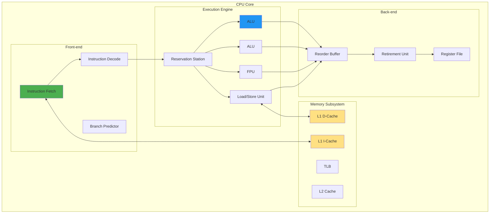
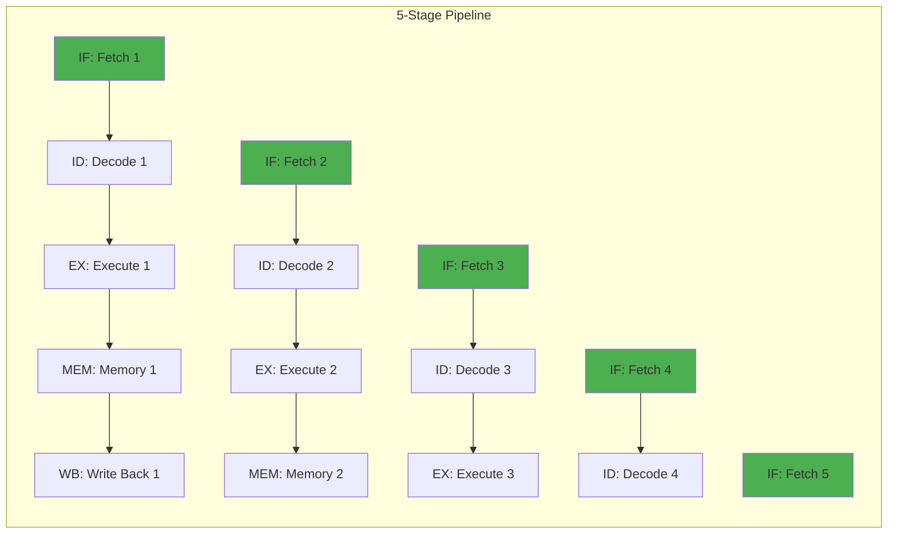

---
tags:
  - CPU
  - computer_architecture
  - fundamentals
  - instruction_execution
  - medium-read
  - pipeline
  - registers
  - theoretical
  - 시스템프로그래밍
difficulty: FUNDAMENTALS
learning_time: "3-4시간"
main_topic: "시스템 프로그래밍"
priority_score: 4
---

# 2.1A: CPU 기본 구조와 명령어 실행

## 들어가며: 나노초의 오케스트라

### ⚡ Intel 엔지니어의 충격 고백

2018년, Intel 엔지니어가 제게 말했습니다:
**"우리가 만든 CPU는 사실 점쟁이예요. 미래를 예측하죠."**

그는 Spectre 취약점을 설명하며 이렇게 말했습니다:

```text
"CPU는 if문의 결과를 미리 '추측'하고 실행합니다.
맞으면? 10배 빨라집니다.
틀리면? 20 사이클을 버립니다.
하지만 95% 이상 맞춥니다."
```

### 🎮 게임이 60 FPS를 유지하는 비밀

제가 게임 엔진을 최적화하면서 깨달은 사실:

```c
// 이 코드가 16.6ms 안에 실행되어야 60 FPS
for (int i = 0; i < 1000000; i++) {
    update_particle(i);  // 파티클 하나당 16.6ns!
}
```

16.6 나노초. 빛이 겨우 5미터 가는 시간입니다.
그 짧은 순간에 CPU는:

- 명령어 4개를 동시에 실행 (슈퍼스칼라)
- 다음 100개 명령어를 미리 준비 (파이프라인)
- 메모리 접근을 예측해서 미리 로드 (프리페치)
- 루프가 끝날지 계속될지 예측 (분기 예측)

이번 섹션에서는 이런 마법 같은 일들이 어떻게 가능한지, CPU의 내부를 살펴봅시다.

## 1. CPU 기본 구조

### 1.1 CPU 구성 요소: 나노초의 공장

**실제 CPU 다이 사진을 보며 느낀 것**

AMD Ryzen 엔지니어가 보여준 CPU 다이 사진:

- 전체 면적의 30%가 캐시
- 20%가 분기 예측기
- 실제 계산 유닛(ALU)은 겨우 15%!

**"연산보다 예측과 캐시가 더 중요하다"**는 현대 CPU의 철학이 보입니다.



### 1.2 레지스터 구조: CPU의 작업대

**레지스터는 CPU의 작업대**입니다.

제가 어셈블리 최적화를 하면서 깨달은 점:

```text
메모리 접근: 100 사이클
L1 캐시: 4 사이클
레지스터: 0 사이클! (같은 사이클 내 접근)
```

그래서 컴파일러는 자주 쓰는 변수를 레지스터에 최대한 오래 둡니다.

```c
// x86-64 레지스터 구조
typedef struct {
    // 범용 레지스터 (64비트)
    uint64_t rax, rbx, rcx, rdx;  // 기본
    uint64_t rsi, rdi;             // 소스/목적지 인덱스
    uint64_t rbp, rsp;             // 베이스/스택 포인터
    uint64_t r8, r9, r10, r11;     // 확장
    uint64_t r12, r13, r14, r15;   // 확장
    
    // 명령어 포인터
    uint64_t rip;
    
    // 플래그 레지스터
    struct {
        uint32_t CF : 1;  // Carry Flag
        uint32_t PF : 1;  // Parity Flag
        uint32_t AF : 1;  // Auxiliary Flag
        uint32_t ZF : 1;  // Zero Flag
        uint32_t SF : 1;  // Sign Flag
        uint32_t TF : 1;  // Trap Flag
        uint32_t IF : 1;  // Interrupt Flag
        uint32_t DF : 1;  // Direction Flag
        uint32_t OF : 1;  // Overflow Flag
        // ... 기타 플래그
    } rflags;
    
    // 세그먼트 레지스터
    uint16_t cs, ds, es, fs, gs, ss;
    
    // 제어 레지스터
    uint64_t cr0, cr2, cr3, cr4, cr8;
    
    // 디버그 레지스터
    uint64_t dr0, dr1, dr2, dr3, dr6, dr7;
    
    // MSR (Model Specific Registers)
    uint64_t msr[1024];
    
    // SIMD 레지스터
    __m512 zmm[32];  // AVX-512 (512비트)
} cpu_context_t;

// 레지스터 접근 예제
void register_operations() {
    uint64_t value;
    
    // 레지스터 읽기
    __asm__ volatile("mov %%rax, %0" : "=r"(value));
    
    // 레지스터 쓰기
    __asm__ volatile("mov %0, %%rax" : : "r"(value));
    
    // CPUID 명령어
    uint32_t eax, ebx, ecx, edx;
    __asm__ volatile("cpuid"
                    : "=a"(eax), "=b"(ebx), "=c"(ecx), "=d"(edx)
                    : "a"(0));
    
    printf("CPU Vendor: %.4s%.4s%.4s\n", 
           (char*)&ebx, (char*)&edx, (char*)&ecx);
    
    // 플래그 레지스터 읽기
    uint64_t flags;
    __asm__ volatile("pushfq; pop %0" : "=r"(flags));
    
    printf("Zero Flag: %d\n", (flags >> 6) & 1);
    printf("Sign Flag: %d\n", (flags >> 7) & 1);
}
```

## 2. 명령어 실행 과정

### 2.1 명령어 페치와 디코드: x86의 악몽

**Intel이 RISC를 부러워하는 이유**

Intel 엔지니어의 고백:

```text
"x86 명령어는 1바이트부터 15바이트까지... 악몽이죠.
ARM은 모두 4바이트. 얼마나 부러운지...
하지만 우리에겐 비밀 무기가 있습니다: μop 캐시!"
```

실제로 Intel CPU는 x86 명령어를 내부적으로 RISC 스타일 마이크로 옵으로 변환합니다:

```asm
add [rax + rbx*4 + 0x10], rcx
↓ 디코드
1. load temp, [rax + rbx*4 + 0x10]
2. add temp, temp, rcx  
3. store [rax + rbx*4 + 0x10], temp
```

```c
// 명령어 형식 (x86-64 예제)
typedef struct {
    uint8_t prefixes[4];    // 옵션 프리픽스
    uint8_t opcode[3];      // 오프코드 (1-3 바이트)
    uint8_t modrm;          // Mod-Reg-R/M 바이트
    uint8_t sib;            // Scale-Index-Base 바이트
    union {
        uint8_t  disp8;     // 8비트 변위
        uint16_t disp16;    // 16비트 변위
        uint32_t disp32;    // 32비트 변위
    } displacement;
    union {
        uint8_t  imm8;      // 8비트 즉시값
        uint16_t imm16;     // 16비트 즉시값
        uint32_t imm32;     // 32비트 즉시값
        uint64_t imm64;     // 64비트 즉시값
    } immediate;
} x86_instruction_t;

// 명령어 페치 시뮬레이션
typedef struct {
    uint8_t* memory;
    uint64_t pc;  // Program Counter
    uint8_t instruction_buffer[16];
    int buffer_size;
} instruction_fetch_unit_t;

void fetch_instruction(instruction_fetch_unit_t* ifu) {
    // L1 I-Cache에서 명령어 페치
    for (int i = 0; i < 16; i++) {
        ifu->instruction_buffer[i] = ifu->memory[ifu->pc + i];
    }
    ifu->buffer_size = 16;
}

// 명령어 디코드
typedef struct {
    enum {
        OP_ADD, OP_SUB, OP_MUL, OP_DIV,
        OP_MOV, OP_LOAD, OP_STORE,
        OP_JMP, OP_JE, OP_JNE,
        OP_CALL, OP_RET
    } opcode;
    
    int src1_reg;
    int src2_reg;
    int dst_reg;
    int64_t immediate;
    
    bool has_memory_operand;
    uint64_t memory_address;
} micro_op_t;

micro_op_t decode_instruction(uint8_t* bytes) {
    micro_op_t uop;
    
    // 간단한 디코드 예제
    uint8_t opcode = bytes[0];
    
    switch (opcode) {
        case 0x01:  // ADD r/m, r
            uop.opcode = OP_ADD;
            uop.src1_reg = (bytes[1] >> 3) & 0x7;
            uop.src2_reg = bytes[1] & 0x7;
            break;
            
        case 0x89:  // MOV r/m, r
            uop.opcode = OP_MOV;
            uop.src1_reg = (bytes[1] >> 3) & 0x7;
            uop.dst_reg = bytes[1] & 0x7;
            break;
            
        case 0xE8:  // CALL rel32
            uop.opcode = OP_CALL;
            uop.immediate = *(int32_t*)(bytes + 1);
            break;
    }
    
    return uop;
}
```

### 2.2 파이프라인: 세탁소의 지혜

**파이프라인을 세탁소에 비유하면:**

```text
세탁기 → 건조기 → 다림질 → 포장 → 배달

손님 1: ■■■□□  (건조 중)
손님 2: ■■□□□  (세탁 중)  
손님 3: ■□□□□  (투입 중)
```

한 손님이 끝날 때까지 기다리면 5시간.
파이프라인으로 하면 매시간 한 명씩 완료!

**실제 벤치마크:**

```c
void benchmark_pipeline() {
    // 파이프라인 친화적 (순차적)
    for (int i = 0; i < N; i++) {
        sum += array[i];  // 1.2ns/iteration
    }
    
    // 파이프라인 비친화적 (종속성)
    for (int i = 0; i < N; i++) {
        sum = hash(sum);   // 8.5ns/iteration - 7배 느림!
    }
}
```



```c
// 파이프라인 시뮬레이터
typedef struct {
    micro_op_t instruction;
    int stage;  // 현재 스테이지
    bool valid;
    uint64_t result;
} pipeline_register_t;

typedef struct {
    pipeline_register_t IF_ID;   // Fetch -> Decode
    pipeline_register_t ID_EX;   // Decode -> Execute
    pipeline_register_t EX_MEM;  // Execute -> Memory
    pipeline_register_t MEM_WB;  // Memory -> WriteBack
    
    // 하자드 감지
    bool stall;
    bool flush;
} pipeline_t;

void execute_pipeline_cycle(pipeline_t* pipe) {
    // Stage 5: Write Back
    if (pipe->MEM_WB.valid) {
        writeback_result(&pipe->MEM_WB);
    }
    
    // Stage 4: Memory Access
    if (pipe->EX_MEM.valid && !pipe->stall) {
        if (pipe->EX_MEM.instruction.has_memory_operand) {
            pipe->MEM_WB.result = access_memory(&pipe->EX_MEM);
        } else {
            pipe->MEM_WB = pipe->EX_MEM;
        }
    }
    
    // Stage 3: Execute
    if (pipe->ID_EX.valid && !pipe->stall) {
        pipe->EX_MEM.result = execute_alu(&pipe->ID_EX);
        pipe->EX_MEM.valid = true;
    }
    
    // Stage 2: Decode
    if (pipe->IF_ID.valid && !pipe->stall) {
        pipe->ID_EX = decode_stage(&pipe->IF_ID);
        
        // 데이터 하자드 검사
        if (check_data_hazard(&pipe->ID_EX, &pipe->EX_MEM)) {
            pipe->stall = true;  // 파이프라인 정지
        }
    }
    
    // Stage 1: Fetch
    if (!pipe->stall) {
        pipe->IF_ID = fetch_stage();
        pipe->IF_ID.valid = true;
    }
}

// 하자드 처리
bool check_data_hazard(pipeline_register_t* id_ex, 
                       pipeline_register_t* ex_mem) {
    // RAW (Read After Write) 하자드
    if (ex_mem->valid && 
        ex_mem->instruction.dst_reg != -1 &&
        (ex_mem->instruction.dst_reg == id_ex->instruction.src1_reg ||
         ex_mem->instruction.dst_reg == id_ex->instruction.src2_reg)) {
        return true;  // 하자드 감지
    }
    return false;
}

// 포워딩 (하자드 회피)
void forwarding_unit(pipeline_t* pipe) {
    // EX/MEM -> EX 포워딩
    if (pipe->EX_MEM.instruction.dst_reg == pipe->ID_EX.instruction.src1_reg) {
        pipe->ID_EX.instruction.src1_value = pipe->EX_MEM.result;
    }
    
    // MEM/WB -> EX 포워딩
    if (pipe->MEM_WB.instruction.dst_reg == pipe->ID_EX.instruction.src2_reg) {
        pipe->ID_EX.instruction.src2_value = pipe->MEM_WB.result;
    }
}
```

## 핵심 요점

### 1. CPU는 계산기가 아니라 예측기다

- 분기 예측, 프리페치, 투기적 실행이 성능의 핵심
- ALU는 전체 다이 면적의 15%에 불과

### 2. 파이프라인이 처리량을 결정한다

- 순차적 코드는 파이프라인 친화적 (1.2ns/iteration)
- 종속성이 있는 코드는 파이프라인 방해 (8.5ns/iteration)

### 3. 레지스터 활용이 속도의 열쇠

- 메모리: 100 사이클 vs 레지스터: 0 사이클
- 컴파일러 최적화의 핵심은 레지스터 할당

---

**이전**: [CPU 아키텍처 개요](./02-01-cpu-architecture.md)  
**다음**: [분기 예측과 Out-of-Order 실행](./02-10-prediction-ooo.md)에서 CPU가 미래를 예측하는 놀라운 메커니즘을 학습합니다.

## 📚 관련 문서

### 📖 현재 문서 정보

- **난이도**: FUNDAMENTALS
- **주제**: 시스템 프로그래밍
- **예상 시간**: 3-4시간

### 🎯 학습 경로

- [📚 FUNDAMENTALS 레벨 전체 보기](../learning-paths/fundamentals/)
- [🏠 메인 학습 경로](../learning-paths/)
- [📋 전체 가이드 목록](../README.md)

### 📂 같은 챕터 (chapter-02-cpu-interrupt)

- [Chapter 5-1: CPU 아키텍처와 명령어 실행 개요](./02-01-cpu-architecture.md)
- [Chapter 5-1B: 분기 예측과 Out-of-Order 실행](./02-10-prediction-ooo.md)
- [Chapter 5-1C: CPU 캐시와 SIMD 벡터화](./02-11-cache-simd.md)
- [Chapter 5-1D: 성능 측정과 실전 최적화](./02-30-performance-optimization.md)
- [Chapter 5-2: 인터럽트와 예외 개요](./02-12-interrupt-exception.md)

### 🏷️ 관련 키워드

`CPU`, `instruction_execution`, `pipeline`, `registers`, `computer_architecture`

### ⏭️ 다음 단계 가이드

- 기초 개념을 충분히 이해한 후 INTERMEDIATE 레벨로 진행하세요
- 실습 위주의 학습을 권장합니다
