---
tags:
  - IDT
  - exception
  - fundamentals
  - hardware_interrupt
  - interrupt
  - interrupt_vector
  - medium-read
  - theoretical
  - 시스템프로그래밍
difficulty: FUNDAMENTALS
learning_time: "2-3시간"
main_topic: "시스템 프로그래밍"
priority_score: 4
---

# 2.2A: 인터럽트 기초와 개념 이해

## 들어가며: CPU의 긴급 호출

### 클라우드플레어 장애 사건 - 인터럽트가 멈춘 날

2020년 7월 17일, 클라우드플레어의 전 세계 서비스가 27분간 마비되었습니다. 원인은? **CPU가 인터럽트를 처리하지 못한 것**이었습니다.

```bash
# 사건 당시 모니터링 로그
[ERROR] CPU0: NMI watchdog: BUG: soft lockup - CPU#0 stuck for 23s!
[ERROR] CPU1: rcu_sched self-detected stall on CPU
[ERROR] Network interrupts: 0 (expected: 100000+/sec)
```

한 엔지니어가 회상합니다:

> "서버는 살아있었지만 아무것도 반응하지 않았어요. 키보드도, 네트워크도, 심지어 콘솔도요. CPU는 100% 사용 중이었는데, 인터럽트가 비활성화된 상태로 무한 루프에 빠져있었죠. 27분이 27시간처럼 느껴졌습니다."

이 사건은 인터럽트가 얼마나 중요한지 극명하게 보여줍니다. **인터럽트 없이 컴퓨터는 외부 세계와 단절된 고립된 섬**이 됩니다.

### 당신이 키보드를 누르는 순간 일어나는 일

지금 이 순간, 당신이 'A' 키를 누른다고 상상해보세요:

1. **0ms**: 키보드 컨트롤러가 전기 신호 감지
2. **0.001ms**: IRQ1 인터럽트 발생
3. **0.002ms**: CPU가 현재 작업 중단
4. **0.003ms**: 인터럽트 핸들러 실행
5. **0.004ms**: 스캔코드를 ASCII로 변환
6. **0.005ms**: 운영체제 버퍼에 저장
7. **0.006ms**: 원래 작업 재개

**단 6마이크로초**. 당신이 눈 깜빡이는 시간의 1/50000에 모든 일이 끝납니다.

### 인터럽트는 레스토랑의 주문 벨과 같다

고급 레스토랑을 상상해보세요:

```python
# 인터럽트가 없는 세상 (폴링)
while True:
    check_table_1()     # "주문하실래요?"
    check_table_2()     # "주문하실래요?"
    check_table_3()     # "주문하실래요?"
    # ... 100개 테이블 반복
    # 😫 비효율적! CPU 낭비!

# 인터럽트가 있는 세상
def on_bell_ring(table_number):  # 인터럽트 핸들러
    take_order(table_number)
    
# CPU는 다른 일을 하다가 벨이 울릴 때만 반응
do_other_work()  # 🎯 효율적!
```

이제 인터럽트와 예외가 어떻게 현대 컴퓨팅의 심장이 되었는지 깊이 탐구해봅시다!

## 1. 인터럽트의 기초

### 게임 개발자의 악몽 - 60 FPS를 지켜라

한 인디 게임 개발자의 고백:

> "출시 일주일 전, 끔찍한 버그를 발견했어요. 게임이 가끔 멈추는 거예요. 0.1초 정도지만 60 FPS 게임에서는 치명적이었죠. 원인? USB 마우스 인터럽트가 너무 자주 발생했던 겁니다. 초당 8000번! 😱"

```c
// 문제의 코드
void mouse_interrupt_handler() {
    // 매번 전체 상태 업데이트 (느림!)
    update_mouse_position();
    recalculate_ui_layout();    // 💀 16ms 소요
    redraw_cursor();            // 💀 5ms 소요
    // 초당 8000번 × 21ms = 168초?! 불가능!
}

// 해결책: 인터럽트 결합
void optimized_mouse_handler() {
    // 좌표만 저장 (빠름!)
    mouse_queue.push(get_mouse_delta());  // 0.001ms
    
    // 실제 처리는 게임 루프에서 (16ms마다 한 번)
    if (frame_count % 60 == 0) {
        process_mouse_queue();
    }
}
```

### 1.1 인터럽트 종류

```mermaid
graph TB
    subgraph "인터럽트 분류"
        INT["인터럽트"]
        INT --> HW["하드웨어 인터럽트"]
        INT --> SW["소프트웨어 인터럽트"]
        
        HW --> EXT["외부 인터럽트<br/>키보드, 마우스, NIC"]
        HW --> TMR["타이머 인터럽트"]
        HW --> IPI["Inter-Processor<br/>Interrupt"]
        
        SW --> TRAP["트랩<br/>시스템 콜"]
        SW --> FAULT["폴트<br/>페이지 폴트"]
        SW --> ABORT["어보트<br/>치명적 오류"]
    end
    
    style HW fill:#4CAF50
    style SW fill:#2196F3
```



### 1.2 인터럽트 벡터 테이블 - CPU의 전화번호부

인텔 엔지니어가 들려주는 IDT 탄생 비화:

> "1978년, 8086 프로세서를 설계할 때였어요. 256개의 인터럽트를 어떻게 처리할지 고민했죠. 그때 누군가 '전화번호부처럼 만들면 어때?'라고 했고, 그게 IDT의 시작이었습니다."

실제로 IDT는 정말 전화번호부와 같습니다:

- **인터럽트 번호** = 이름
- **핸들러 주소** = 전화번호
- **권한 레벨** = VIP 여부

```c
// x86-64 IDT (Interrupt Descriptor Table)
typedef struct {
    uint16_t offset_low;     // 핸들러 주소 하위 16비트
    uint16_t selector;       // 코드 세그먼트 셀렉터
    uint8_t  ist;           // Interrupt Stack Table
    uint8_t  type_attr;     // 타입과 속성
    uint16_t offset_middle; // 핸들러 주소 중간 16비트
    uint32_t offset_high;   // 핸들러 주소 상위 32비트
    uint32_t reserved;      // 예약
} __attribute__((packed)) idt_entry_t;

// IDT 레지스터
typedef struct {
    uint16_t limit;
    uint64_t base;
} __attribute__((packed)) idtr_t;

// 인터럽트 벡터 정의
#define VECTOR_DIVIDE_ERROR     0x00  // 0으로 나누기
#define VECTOR_DEBUG           0x01  // 디버그
#define VECTOR_NMI             0x02  // Non-Maskable Interrupt
#define VECTOR_BREAKPOINT      0x03  // 브레이크포인트
#define VECTOR_OVERFLOW        0x04  // 오버플로우
#define VECTOR_BOUND_RANGE     0x05  // 범위 초과
#define VECTOR_INVALID_OPCODE  0x06  // 잘못된 명령어
#define VECTOR_DEVICE_NOT_AVAIL 0x07 // 장치 없음
#define VECTOR_DOUBLE_FAULT    0x08  // 이중 폴트
#define VECTOR_INVALID_TSS     0x0A  // 잘못된 TSS
#define VECTOR_SEGMENT_NOT_PRESENT 0x0B // 세그먼트 없음
#define VECTOR_STACK_FAULT     0x0C  // 스택 폴트
#define VECTOR_GENERAL_PROTECTION 0x0D // 일반 보호
#define VECTOR_PAGE_FAULT      0x0E  // 페이지 폴트
#define VECTOR_FPU_ERROR       0x10  // FPU 에러

// IRQ 벡터 (하드웨어 인터럽트)
#define VECTOR_IRQ0            0x20  // 타이머
#define VECTOR_IRQ1            0x21  // 키보드
#define VECTOR_IRQ2            0x22  // 캐스케이드
#define VECTOR_IRQ3            0x23  // COM2
#define VECTOR_IRQ4            0x24  // COM1
#define VECTOR_IRQ5            0x25  // LPT2
#define VECTOR_IRQ6            0x26  // 플로피
#define VECTOR_IRQ7            0x27  // LPT1
#define VECTOR_IRQ8            0x28  // RTC
#define VECTOR_IRQ9            0x29  // 리다이렉트
#define VECTOR_IRQ10           0x2A  // 예약
#define VECTOR_IRQ11           0x2B  // 예약
#define VECTOR_IRQ12           0x2C  // 마우스
#define VECTOR_IRQ13           0x2D  // FPU
#define VECTOR_IRQ14           0x2E  // 주 IDE
#define VECTOR_IRQ15           0x2F  // 보조 IDE

// IDT 초기화
idt_entry_t idt[256];
idtr_t idtr;

void init_idt() {
    // 예외 핸들러 설정
    set_idt_entry(VECTOR_DIVIDE_ERROR, divide_error_handler, 
                 TRAP_GATE, DPL_KERNEL);
    set_idt_entry(VECTOR_PAGE_FAULT, page_fault_handler,
                 TRAP_GATE, DPL_KERNEL);
    
    // 하드웨어 인터럽트 핸들러
    set_idt_entry(VECTOR_IRQ0, timer_interrupt_handler,
                 INTERRUPT_GATE, DPL_KERNEL);
    set_idt_entry(VECTOR_IRQ1, keyboard_interrupt_handler,
                 INTERRUPT_GATE, DPL_KERNEL);
    
    // 시스템 콜
    set_idt_entry(0x80, system_call_handler,
                 TRAP_GATE, DPL_USER);
    
    // IDT 로드
    idtr.limit = sizeof(idt) - 1;
    idtr.base = (uint64_t)&idt;
    __asm__ volatile("lidt %0" : : "m"(idtr));
}

void set_idt_entry(int vector, void* handler, int type, int dpl) {
    uint64_t handler_addr = (uint64_t)handler;
    
    idt[vector].offset_low = handler_addr & 0xFFFF;
    idt[vector].selector = KERNEL_CS;
    idt[vector].ist = 0;
    idt[vector].type_attr = type | (dpl << 5) | 0x80;
    idt[vector].offset_middle = (handler_addr >> 16) & 0xFFFF;
    idt[vector].offset_high = (handler_addr >> 32) & 0xFFFFFFFF;
    idt[vector].reserved = 0;
}
```

## 핵심 요점

### 1. 인터럽트의 역할

인터럽트는 CPU가 외부 이벤트에 즉시 반응할 수 있게 해주는 메커니즘으로, 폴링보다 훨씬 효율적입니다.

### 2. IDT의 중요성  

인터럽트 벡터 테이블은 256개의 인터럽트 타입을 각각의 핸들러와 연결해주는 핵심 데이터 구조입니다.

### 3. 인터럽트 분류

하드웨어 인터럽트(외부 이벤트)와 소프트웨어 인터럽트(예외, 시스템 콜)로 나뉩니다.

---

**다음**: [인터럽트 처리 과정과 예외](chapter-02-cpu-interrupt/02-13-interrupt-processing.md)에서 인터럽트의 실제 처리 메커니즘을 학습합니다.

## 📚 관련 문서

### 📖 현재 문서 정보

- **난이도**: FUNDAMENTALS
- **주제**: 시스템 프로그래밍
- **예상 시간**: 2-3시간

### 🎯 학습 경로

- [📚 FUNDAMENTALS 레벨 전체 보기](../learning-paths/fundamentals/)
- [🏠 메인 학습 경로](../learning-paths/)
- [📋 전체 가이드 목록](../README.md)

### 📂 같은 챕터 (chapter-05-cpu-interrupt)

- [Chapter 5-1: CPU 아키텍처와 명령어 실행 개요](./02-01-cpu-architecture.md)
- [Chapter 5-1A: CPU 기본 구조와 명령어 실행](./02-02-cpu-fundamentals.md)
- [Chapter 5-1B: 분기 예측과 Out-of-Order 실행](./02-10-prediction-ooo.md)
- [Chapter 5-1C: CPU 캐시와 SIMD 벡터화](./02-11-cache-simd.md)
- [Chapter 5-1D: 성능 측정과 실전 최적화](./02-30-performance-optimization.md)

### 🏷️ 관련 키워드

`interrupt`, `exception`, `IDT`, `interrupt_vector`, `hardware_interrupt`

### ⏭️ 다음 단계 가이드

- 기초 개념을 충분히 이해한 후 INTERMEDIATE 레벨로 진행하세요
- 실습 위주의 학습을 권장합니다
