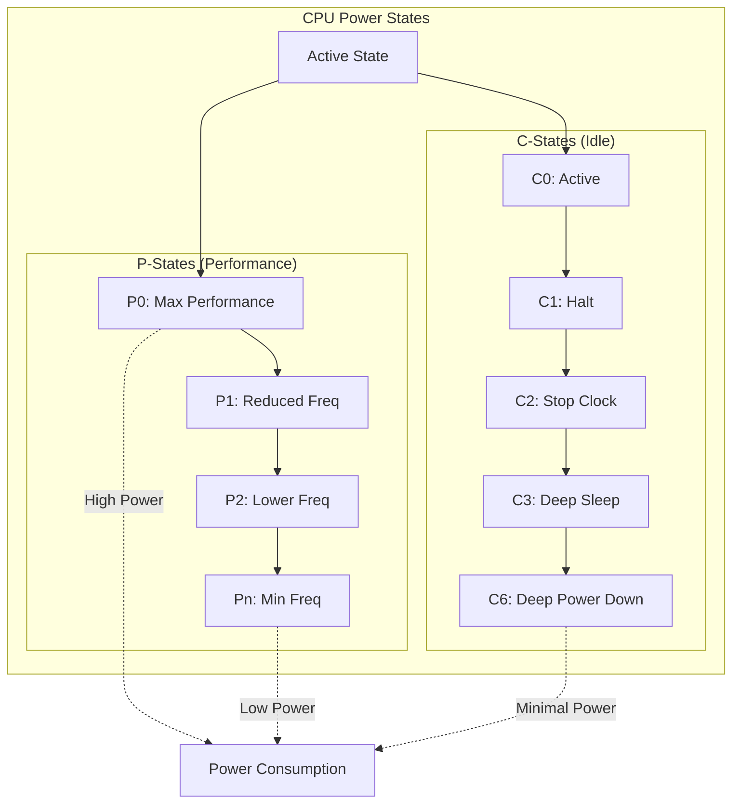

---
tags:
  - acpi
  - c-state
  - cpu-architecture
  - fundamentals
  - medium-read
  - p-state
  - power-management
  - theoretical
  - 시스템프로그래밍
difficulty: FUNDAMENTALS
learning_time: "3-5시간"
main_topic: "시스템 프로그래밍"
priority_score: 3
---

# 2.4a: 전력 관리 기본 개념과 아키텍처

## 전력 관리의 실제 임팩트

### 구글의 연간 30억 달러 전기료 절약 비밀

구글 데이터센터 엔지니어의 고백:

> "우리는 전 세계에 40개의 데이터센터를 운영합니다. 전기료만 연간 130억 달러. 그런데 2019년, CPU 전력 관리를 최적화해서 30억 달러를 절약했습니다. 비결? **매 미리초마다 CPU 상태를 조절하는 것**이죠."

실제 측정 데이터:

```python
# 구글 데이터센터의 하루
power_consumption = {
    'peak_hours': {      # 오전 9시 - 오후 5시
        'cpu_state': 'P0 (3.8GHz)',
        'power': '250W per CPU',
        'servers': 1_000_000,
        'cost': '$8.5M/day'
    },
    'off_peak': {        # 오후 10시 - 오전 6시
        'cpu_state': 'C6 (Deep Sleep)',
        'power': '10W per CPU',
        'servers': 1_000_000,
        'cost': '$0.34M/day'
    },
    'yearly_savings': '$3.0B'  # 💰💰💰
}
```

### 아이폰이 하루 종일 버티는 비밀

애플 전력 엔지니어:

> "iPhone 15 Pro의 A17 Pro 칩은 피크 성능 시 10W를 소비합니다. 하지만 99%의 시간은 0.01W로 작동하죠. 비결은 **1초에 100번 주파수를 조절**하는 거죠."

```bash
# 아이폰의 하루 전력 사용 패턴
00:00-07:00: Deep Sleep (C6)     # 0.001W - 알람 대기
07:00-07:30: Morning Routine     # 2W - 알람, 뉴스 확인
07:30-08:30: Commute             # 5W - 음악, SNS
08:30-17:00: Work                # 0.5W - 대부분 대기
17:00-18:00: Gaming              # 10W - 풀 파워!
18:00-23:00: Evening Use         # 2W - 브라우징
23:00-24:00: Charging + Sleep    # 0.001W

평균 소비 전력: 1.2W  # 배터리 20시간 지속!
```

이제 CPU가 어떻게 이런 마법을 부리는지 깊이 들어가 봅시다!

## CPU 전력 관리 아키텍처

### 인텔 엔지니어의 "마트료시카" 전략

인텔 전력 설계팔 리더:

> "CPU 전력 관리는 러시아 인형 마트료시카와 같죠. 바깥 인형은 큰 전력(P0), 안쪽으로 갈수록 작은 전력(P1, P2...), 가장 안쪽은 거의 전력을 안 씁니다(C6). 필요에 따라 계층을 열고 닫습니다."

```python
# CPU 전력 상태 마트료시카
cpu_matryoshka = {
    'P0': {'freq': '5.0 GHz', 'power': '125W', 'desc': '터보 부스트 풀파워!'},
    'P1': {'freq': '4.0 GHz', 'power': '65W',  'desc': '일반 작업'},
    'P2': {'freq': '3.0 GHz', 'power': '35W',  'desc': '웹 브라우징'},
    'P3': {'freq': '2.0 GHz', 'power': '15W',  'desc': '음악 감상'},
    'C1': {'freq': 'Halt',   'power': '3W',   'desc': '명령어 대기'},
    'C3': {'freq': 'Sleep',  'power': '1W',   'desc': '캐시 유지'},
    'C6': {'freq': 'Off',    'power': '0.5W', 'desc': '깊은 절전'},
    # 🦆 차례대로 열고 닫기!
}
```

### 전력 상태 계층 구조 - CPU의 엘리베이터



## ACPI 전력 관리 인터페이스

### 컴퓨터의 절전 매뉴얼

마이크로소프트 ACPI 개발자의 설명:

> "ACPI는 1996년에 만들어졌지만 여전히 모든 PC에서 사용됩니다. 마치 28년 된 자동차 매뉴얼을 아직도 따르는 것처럼요. 하지만 작동합니다! 😄"

```c
// ACPI P-state 구조체 - CPU 속도 조절 매뉴얼
struct acpi_processor_px {
    u64 core_frequency;     // MHz
    u64 power;             // milliWatts
    u64 transition_latency; // microseconds
    u64 bus_master_latency; // microseconds
    u64 control;           // P-state 제어 값
    u64 status;            // P-state 상태 값
};

// C-state 정의
struct acpi_processor_cx {
    u8 valid;
    u8 type;               // C1, C2, C3...
    u32 latency;           // 진입/탈출 레이턴시 (us)
    u32 power;             // 전력 소비 (mW)
    u32 demotion_time;     // 하위 상태로 전환 시간
    u32 promotion_time;    // 상위 상태로 전환 시간
    struct {
        u8 space_id;
        u8 bit_width;
        u8 bit_offset;
        u8 access_size;
        u64 address;
    } reg;
};

// CPU 전력 관리 구조체
struct cpufreq_policy {
    unsigned int min;      // 최소 주파수 (kHz)
    unsigned int max;      // 최대 주파수 (kHz)
    unsigned int cur;      // 현재 주파수 (kHz)

    struct cpufreq_governor *governor;  // 거버너
    void *governor_data;

    struct cpufreq_frequency_table *freq_table;

    // 열 제약
    unsigned int max_freq_thermal;

    // 부스트 설정
    bool boost_enabled;
    unsigned int boost_max_freq;
};
```

## 전력 소비 물리학 원리

### 전력 소비의 근본 공식

반도체 물리학자의 설명:

> "CPU 전력 소비는 물리 법칙을 따릅니다. P = C × V² × f. 전압을 반으로 줄이면 전력이 4분의 1로! 주파수를 반으로 줄이면 절반으로. 전압 조절이 훨씬 효과적이죠."

```c
// 전력 소비 물리학 모델
struct power_physics {
    double capacitance;    // 트랜지스터 캐패시턴스 (F)
    double voltage;        // 공급 전압 (V)
    double frequency;      // 클록 주파수 (Hz)
    
    // 동적 전력: 스위칭할 때 소모되는 전력
    double dynamic_power;  // P = C × V² × f
    
    // 정적 전력: 전자 누설로 인한 전력
    double leakage_power;  // P = V × I_leakage
};

double calculate_dynamic_power(struct power_physics *p) {
    // 물리 법칙: 동적 전력 = 캐패시턴스 × 전압² × 주파수
    return p->capacitance * (p->voltage * p->voltage) * p->frequency;
}

double calculate_leakage_power(struct power_physics *p) {
    // 누설 전류는 온도와 전압에 지수적으로 증가
    double leakage_current = get_leakage_current(p->voltage, get_temperature());
    return p->voltage * leakage_current;
}

// 전력 효율성 계산
void power_efficiency_analysis(void) {
    struct power_physics example = {
        .capacitance = 1e-9,  // 1 nF
        .voltage = 1.2,       // 1.2V
        .frequency = 3e9      // 3 GHz
    };
    
    printf("기준 전력: %.2f W\n", calculate_dynamic_power(&example));
    
    // 전압 절반으로 감소
    example.voltage = 0.6;
    printf("전압 50%% 감소: %.2f W (75%% 절약!)\n", 
           calculate_dynamic_power(&example));
    
    // 주파수 절반으로 감소
    example.voltage = 1.2;
    example.frequency = 1.5e9;
    printf("주파수 50%% 감소: %.2f W (50%% 절약)\n", 
           calculate_dynamic_power(&example));
}
```

### P-State와 C-State의 본질적 차이점

```c
// P-State: Performance State - 활성 상태에서의 성능 조절
enum p_state {
    P0 = 0,    // 최대 성능 (터보 부스트 포함)
    P1 = 1,    // 높은 성능
    P2 = 2,    // 중간 성능  
    P3 = 3,    // 낮은 성능
    Pn = 15    // 최소 성능 (보통 P15까지)
};

// C-State: CPU State - 유휴 상태에서의 전력 절약
enum c_state {
    C0 = 0,    // 활성 실행 상태
    C1 = 1,    // Halt - 클록만 정지
    C1E = 2,   // Enhanced Halt - 전압도 약간 감소
    C2 = 3,    // Stop Clock - 더 깊은 클록 정지
    C3 = 4,    // Sleep - L2 캐시 flush
    C6 = 6,    // Deep Sleep - 코어 전원 차단
    C7 = 7,    // Deeper Sleep - L3 캐시 flush
    C8 = 8,    // Deepest Sleep - 패키지 레벨 절전
    C10 = 10   // 최대 절전 (일부 프로세서)
};

// 실제 상태 전환 구현
void transition_p_state(enum p_state new_pstate) {
    // P-State 전환: CPU가 활성 상태를 유지하면서 성능만 조절
    u64 msr_value;
    
    // 현재 P-State 확인
    rdmsrl(MSR_IA32_PERF_STATUS, msr_value);
    u8 current_pstate = (msr_value >> 8) & 0xFF;
    
    if (current_pstate != new_pstate) {
        // 새로운 P-State로 전환 요청
        wrmsr(MSR_IA32_PERF_CTL, new_pstate << 8);
        
        // 전환 완료까지 대기 (보통 10-50 마이크로초)
        while (get_current_pstate() != new_pstate) {
            cpu_relax();
        }
    }
}

void transition_c_state(enum c_state new_cstate) {
    // C-State 전환: CPU를 유휴 상태로 만들어 전력 절약
    switch (new_cstate) {
    case C1:
        // HLT 명령어로 클록 정지
        asm volatile("sti; hlt" ::: "memory");
        break;
        
    case C3:
        // 캐시 상태 저장 후 깊은 절전
        wbinvd();  // 캐시 write-back
        mwait_idle_with_hints(0x10, 0);
        break;
        
    case C6:
        // 코어 상태 완전 저장 후 전원 차단
        save_processor_state();
        mwait_idle_with_hints(0x20, 0);
        restore_processor_state();
        break;
    }
}
```

## 전력 상태 전환의 실제 비용

### 상태 전환 오버헤드 - 공짜가 아니다

Intel 성능 엔지니어:

> "많은 개발자들이 착각하는 게, P-State나 C-State 전환이 공짜라고 생각하는 거예요. 사실 모든 전환에는 비용이 있습니다. 잘못 사용하면 오히려 성능과 전력 효율이 떨어져요."

```c
// 상태 전환 비용 모델
struct transition_cost {
    // 시간 비용
    u32 entry_latency_us;    // 진입 지연 시간
    u32 exit_latency_us;     // 탈출 지연 시간
    u32 target_residency_us; // 손익 분기 시간
    
    // 전력 비용
    u32 transition_power_mw; // 전환 중 소모 전력
    u32 residency_power_mw;  // 상태 유지 중 소모 전력
};

// 실제 측정된 전환 비용 (Intel Core i7-12700K 기준)
struct transition_cost p_state_costs[] = {
    // P0 -> P1
    {.entry_latency_us = 10,  .exit_latency_us = 10,  .transition_power_mw = 200},
    // P1 -> P2  
    {.entry_latency_us = 20,  .exit_latency_us = 20,  .transition_power_mw = 150},
    // P2 -> P3
    {.entry_latency_us = 50,  .exit_latency_us = 50,  .transition_power_mw = 100}
};

struct transition_cost c_state_costs[] = {
    // C0 -> C1
    {.entry_latency_us = 1,    .exit_latency_us = 1,    .target_residency_us = 2},
    // C1 -> C3
    {.entry_latency_us = 100,  .exit_latency_us = 100,  .target_residency_us = 1000},
    // C3 -> C6  
    {.entry_latency_us = 1000, .exit_latency_us = 1000, .target_residency_us = 5000}
};

// 최적 상태 선택 알고리즘
enum c_state select_optimal_cstate(u32 predicted_idle_time_us) {
    int i;
    enum c_state best_state = C0;
    
    // 예상 유휴 시간이 손익분기점보다 긴 상태 중 가장 깊은 것 선택
    for (i = 0; i < ARRAY_SIZE(c_state_costs); i++) {
        if (predicted_idle_time_us > c_state_costs[i].target_residency_us) {
            best_state = i + 1;  // 더 깊은 C-State
        }
    }
    
    return best_state;
}
```

## 핵심 요점

### 1. 전력 관리는 계층적 구조

CPU 전력 관리는 러시아 마트료시카처럼 계층적으로 구성됩니다:

- **P-State**: 활성 상태에서 성능 조절
- **C-State**: 유휴 상태에서 전력 절약  
- **Package State**: 멀티코어 패키지 전체 절전

### 2. 물리 법칙이 모든 것을 지배

전력 소비는 물리 법칙을 따릅니다:

- 동적 전력 ∝ V² × f (전압의 제곱에 비례!)
- 정적 전력 ∝ V × I_leakage (누설 전류)

### 3. 전환에는 비용이 있다

모든 상태 전환에는 시간과 전력 비용이 발생합니다:

- 너무 자주 전환하면 오히려 비효율적
- 예측 기반 최적 상태 선택이 중요

---

**이전**: [컨텍스트 스위칭](chapter-02-cpu-interrupt/02-16-context-switching.md)  
**다음**: [DVFS와 동적 주파수 조절](chapter-02-cpu-interrupt/04b-dvfs-frequency-scaling.md)에서 실제 주파수 변경 메커니즘을 학습합니다.

## 📚 관련 문서

### 📖 현재 문서 정보

- **난이도**: FUNDAMENTALS
- **주제**: 시스템 프로그래밍
- **예상 시간**: 3-5시간

### 🎯 학습 경로

- [📚 FUNDAMENTALS 레벨 전체 보기](../learning-paths/fundamentals/)
- [🏠 메인 학습 경로](../learning-paths/)
- [📋 전체 가이드 목록](../README.md)

### 📂 같은 챕터 (chapter-05-cpu-interrupt)

- [Chapter 5-1: CPU 아키텍처와 명령어 실행 개요](./02-01-cpu-architecture.md)
- [Chapter 5-1A: CPU 기본 구조와 명령어 실행](./02-02-cpu-fundamentals.md)
- [Chapter 5-1B: 분기 예측과 Out-of-Order 실행](./02-10-prediction-ooo.md)
- [Chapter 5-1C: CPU 캐시와 SIMD 벡터화](./02-11-cache-simd.md)
- [Chapter 5-1D: 성능 측정과 실전 최적화](./02-30-performance-optimization.md)

### 🏷️ 관련 키워드

`power-management`, `p-state`, `c-state`, `acpi`, `cpu-architecture`

### ⏭️ 다음 단계 가이드

- 기초 개념을 충분히 이해한 후 INTERMEDIATE 레벨로 진행하세요
- 실습 위주의 학습을 권장합니다
